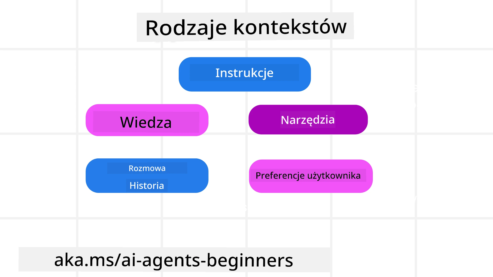
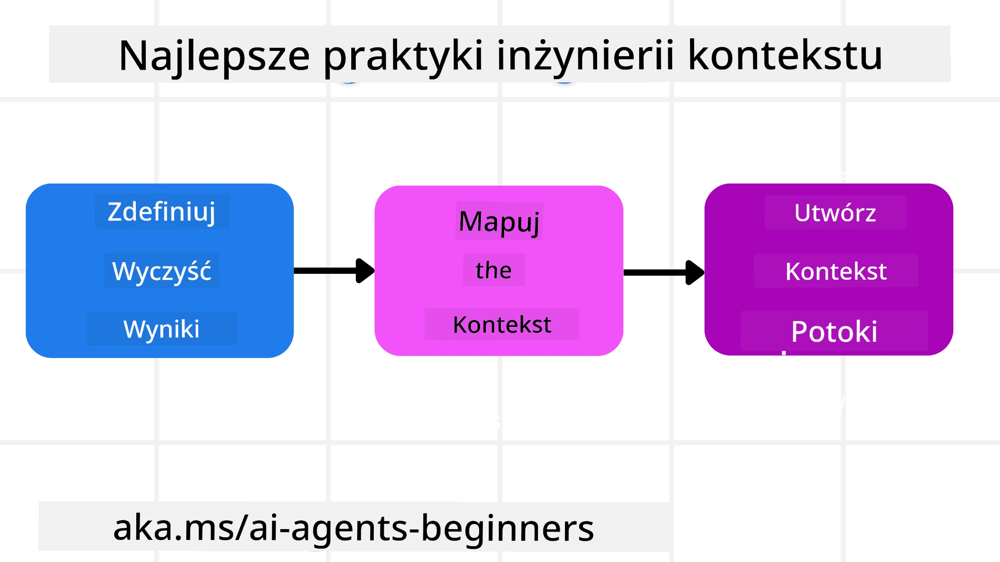

# Inżynieria kontekstu dla agentów AI

> _(Kliknij powyższy obraz, aby obejrzeć wideo z tej lekcji)_

Zrozumienie złożoności aplikacji, dla której tworzysz agenta AI, jest ważne, aby stworzyć niezawodnego agenta. Musimy budować agentów AI, którzy skutecznie zarządzają informacjami, aby sprostać złożonym wymaganiom wykraczającym poza inżynierię promptów.

W tej lekcji przyjrzymy się, czym jest inżynieria kontekstu oraz jaki ma ona wpływ na tworzenie agentów AI.

## Wprowadzenie

Ta lekcja obejmie:

• **Czym jest inżynieria kontekstu** i dlaczego różni się od inżynierii promptów.

• **Strategie efektywnej inżynierii kontekstu**, w tym jak pisać, wybierać, kompresować i izolować informacje.

• **Typowe awarie kontekstu**, które mogą zakłócić działanie twojego agenta AI oraz jak je naprawić.

## Cele nauki

Po ukończeniu tej lekcji będziesz potrafił:

• **Zdefiniować inżynierię kontekstu** i odróżnić ją od inżynierii promptów.

• **Zidentyfikować kluczowe komponenty kontekstu** w aplikacjach opartych na dużych modelach językowych (LLM).

• **Stosować strategie pisania, wybierania, kompresji i izolowania kontekstu** w celu poprawy wydajności agenta.

• **Rozpoznawać typowe awarie kontekstu**, takie jak zatrucie, rozproszenie, zamieszanie i konflikt, oraz wdrażać techniki ich łagodzenia.

## Czym jest inżynieria kontekstu?

Dla agentów AI kontekst jest tym, co napędza planowanie agenta AI do podjęcia określonych działań. Inżynieria kontekstu to praktyka zapewniania, że agent AI ma odpowiednie informacje do wykonania następnego kroku zadania. Okno kontekstowe ma ograniczony rozmiar, więc jako twórcy agentów musimy budować systemy i procesy do zarządzania dodawaniem, usuwaniem i kondensacją informacji w oknie kontekstowym.

### Inżynieria promptów a inżynieria kontekstu

Inżynieria promptów koncentruje się na pojedynczym, statycznym zestawie instrukcji, które skutecznie kierują agentami AI za pomocą określonych reguł. Inżynieria kontekstu to zarządzanie dynamicznym zestawem informacji, w tym początkowym promptem, aby zapewnić agentowi AI to, czego potrzebuje na przestrzeni czasu. Główna idea inżynierii kontekstu to uczynienie tego procesu powtarzalnym i niezawodnym.

### Rodzaje kontekstu

Ważne jest, aby pamiętać, że kontekst to nie tylko jedna rzecz. Informacje, których potrzebuje agent AI, mogą pochodzić z różnych źródeł i to od nas zależy, aby zapewnić agentowi dostęp do tych źródeł:

Rodzaje kontekstu, które agent AI może potrzebować zarządzać, to:

• **Instrukcje:** Są jak „zasady” agenta — prompt, wiadomości systemowe, przykłady few-shot (pokazujące AI, jak coś zrobić) oraz opisy narzędzi, które może używać. To tutaj łączy się fokus inżynierii promptów z inżynierią kontekstu.

• **Wiedza:** Obejmuje fakty, informacje pobierane z baz danych lub długoterminowe wspomnienia nagromadzone przez agenta. Obejmuje to integrację systemu Retrieval Augmented Generation (RAG), jeśli agent potrzebuje dostępu do różnych źródeł wiedzy i baz danych.

• **Narzędzia:** Definicje zewnętrznych funkcji, API i serwerów MCP, które agent może wywoływać, wraz z odpowiedziami (wynikami) uzyskanymi dzięki ich użyciu.

• **Historia rozmowy:** Trwający dialog z użytkownikiem. Z biegiem czasu rozmowy te stają się dłuższe i bardziej skomplikowane, co zajmuje dużo miejsca w oknie kontekstowym.

• **Preferencje użytkownika:** Informacje o upodobaniach lub niechęciach użytkownika, które są poznawane z czasem. Mogą być przechowywane i wykorzystywane przy podejmowaniu kluczowych decyzji, aby pomóc użytkownikowi.

## Strategie efektywnej inżynierii kontekstu

### Strategie planowania

Dobra inżynieria kontekstu zaczyna się od dobrego planowania. Oto podejście, które pomoże Ci zacząć myśleć o stosowaniu koncepcji inżynierii kontekstu:

1. **Zdefiniuj jasne rezultaty** – rezultaty zadań przypisanych agentom AI powinny być jasno określone. Odpowiedz na pytanie: „Jak będzie wyglądał świat, gdy agent AI zakończy swoje zadanie?” Innymi słowy, jaką zmianę, informację lub odpowiedź powinien mieć użytkownik po interakcji z agentem AI.
2. **Zmapuj kontekst** – gdy zdefiniujesz rezultaty agenta AI, musisz odpowiedzieć na pytanie „Jakich informacji agent AI potrzebuje do wykonania tego zadania?”. Dzięki temu możesz zacząć mapować kontekst, wskazując, gdzie można znaleźć potrzebne informacje.
3. **Stwórz potoki kontekstowe** – ponieważ wiesz, gdzie są informacje, kolejne pytanie brzmi: „Jak agent zdobędzie te informacje?”. Można to zrobić na różne sposoby, w tym za pomocą RAG, użycia serwerów MCP oraz innych narzędzi.

### Strategie praktyczne

Planowanie jest ważne, ale gdy informacje zaczynają napływać do okna kontekstowego naszego agenta, potrzebujemy praktycznych strategii do ich zarządzania:

#### Zarządzanie kontekstem

Podczas gdy niektóre informacje będą dodawane do okna kontekstowego automatycznie, inżynieria kontekstu polega na bardziej aktywnym zarządzaniu tą informacją, co można osiągnąć kilkoma strategiami:

 1. **Notatnik agenta (Agent Scratchpad)**  
 Pozwala agentowi AI na robienie notatek dotyczących istotnych informacji o bieżących zadaniach i interakcjach z użytkownikiem podczas pojedynczej sesji. Powinien istnieć poza oknem kontekstowym jako plik lub obiekt runtime, który agent może później odczytać w trakcie tej sesji, jeśli zajdzie taka potrzeba.

 2. **Wspomnienia**  
 Notatniki są dobre do zarządzania informacjami poza oknem kontekstowym pojedynczej sesji. Wspomnienia umożliwiają agentom przechowywanie i pobieranie istotnych informacji między wieloma sesjami. Mogą to być podsumowania, preferencje użytkownika czy opinie na temat ulepszeń na przyszłość.

 3. **Kompresja kontekstu**  
 Gdy okno kontekstowe rośnie i zbliża się do limitu, można stosować techniki takie jak podsumowania i przycinanie. Polega to na zachowaniu jedynie najistotniejszych informacji lub usuwaniu starszych wiadomości.
  
 4. **Systemy wieloagentowe**  
 Tworzenie systemów wieloagentowych jest formą inżynierii kontekstu, ponieważ każdy agent ma swoje własne okno kontekstowe. To, jak ten kontekst jest udostępniany i przekazywany innym agentom, jest kolejnym elementem do zaplanowania w trakcie budowy takich systemów.
  
 5. **Środowiska piaskownicy (Sandbox Environments)**  
 Jeśli agent musi uruchomić jakiś kod lub przetworzyć dużą ilość informacji w dokumencie, może to pochłonąć dużo tokenów potrzebnych do przetworzenia wyników. Zamiast przechowywać to wszystko w oknie kontekstowym, agent może użyć środowiska piaskownicy, które wykonuje ten kod i jedynie odczytuje wyniki i inne istotne informacje.
  
 6. **Obiekty stanu runtime**  
 Polega to na tworzeniu kontenerów informacji do zarządzania sytuacjami, gdy agent potrzebuje dostępu do określonych informacji. Przy złożonym zadaniu pozwala to agentowi na przechowywanie wyników każdego podzadania krok po kroku, pozwalając, aby kontekst pozostawał połączony tylko z tym konkretnym podzadaniem.

#### Inspekcja kontekstu

Po zastosowaniu którejkolwiek z tych strategii warto sprawdzić, co faktycznie otrzymało kolejne wywołanie modelu. Przydatne pytanie podczas debugowania to:

> Czy agent załadował zbyt dużo kontekstu, niewłaściwy kontekst, czy może zabrakło mu potrzebnego kontekstu?

Nie musisz logować surowych promptów, wyników narzędzi czy zawartości pamięci, aby udzielić odpowiedzi. W produkcji preferuj krótkie zapisy inspekcji kontekstu, które zawierają liczniki, identyfikatory, hasze i etykiety polityk:

- **Selekcja:** Śledź, ile kandydatów (fragmentów tekstu, narzędzi, pamięci) było rozważanych, ile wybrano i która reguła lub punktacja spowodowała odrzucenie pozostałych.
- **Kompresja:** Zapisz zakres źródłowy lub identyfikator śledzenia, identyfikator podsumowania, szacowaną liczbę tokenów przed i po kompresji, oraz czy surowa zawartość została wykluczona z kolejnego wywołania.
- **Izolacja:** Zanotuj, które podzadanie zostało wykonane w oddzielnym agencie, sesji lub piaskownicy, jakie podsumowanie ograniczone zostało zwrócone oraz czy duże wyniki narzędzi pozostały poza kontekstem agenta nadrzędnego.
- **Pamięć i RAG:** Zapisuj identyfikatory dokumentów pobranych, identyfikatory pamięci, punkty, wybrane identyfikatory i status redakcji zamiast pełnego pobranego tekstu.
- **Bezpieczeństwo i prywatność:** Preferuj hasze, identyfikatory, token buckety i etykiety polityk zamiast wrażliwych treści promptów, argumentów narzędzi, wyników narzędzi czy treści pamięci użytkownika.

Celem nie jest przechowywanie większej ilości kontekstu. Celem jest pozostawienie wystarczających dowodów, aby programista mógł stwierdzić, która strategia kontekstu była użyta i czy zmieniła kolejne wywołanie modelu w zamierzony sposób.

### Przykład inżynierii kontekstu

Załóżmy, że chcemy, aby agent AI **"Zarezerwował mi wycieczkę do Paryża."**

• Prostego agenta używającego tylko inżynierii promptów mogłoby odpowiedzieć: **"Dobrze, na kiedy chcesz pojechać do Paryża?"**. Przetworzył tylko twoje bezpośrednie pytanie w chwili, gdy je zadałeś.

• Agent stosujący strategie inżynierii kontekstu, o których mówiliśmy, zrobiłby znacznie więcej. Zanim odpowie, jego system może:

  ◦ **Sprawdzić twój kalendarz** pod kątem dostępnych terminów (pobierając dane w czasie rzeczywistym).

 ◦ **Przypomnieć preferencje podróżnicze z przeszłości** (z długoterminowej pamięci), takie jak preferowane linie lotnicze, budżet czy czy wolisz loty bezpośrednie.

 ◦ **Zidentyfikować dostępne narzędzia** do rezerwacji lotów i hoteli.

- Następnie przykładowa odpowiedź mogłaby brzmieć: „Cześć [Twoje Imię]! Widzę, że jesteś wolny w pierwszym tygodniu października. Mam szukać bezpośrednich lotów do Paryża na [Preferowane Linie Lotnicze] w ramach twojego zwykłego budżetu [Budżet]?”. Ta bogatsza, świadoma kontekstu odpowiedź demonstruje moc inżynierii kontekstu.

## Typowe awarie kontekstu

### Zatrucie kontekstu

**Co to jest:** Kiedy halucynacja (fałszywa informacja wygenerowana przez LLM) lub błąd trafia do kontekstu i jest powtarzalnie cytowany, powodując, że agent realizuje niemożliwe cele lub tworzy nonsensowne strategie.

**Co zrobić:** Wdróż **walidację kontekstu** i **kwarantannę**. Sprawdzaj informacje przed dodaniem ich do pamięci długoterminowej. Jeśli wykryjesz potencjalne zatrucie, zacznij nowe wątki kontekstu, aby zapobiec rozprzestrzenianiu się złych informacji.

**Przykład rezerwacji podróży:** Twój agent halucynuje istnienie **bezpośredniego lotu z małego lokalnego lotniska do odległego miasta międzynarodowego**, które w rzeczywistości nie oferuje lotów międzynarodowych. Ten nieistniejący szczegół lotu zostaje zapisany w kontekście. Gdy później prosisz agenta o rezerwację, nieustannie próbuje znaleźć bilety na tę niemożliwą trasę, co prowadzi do powtarzających się błędów.

**Rozwiązanie:** Wdróż krok, który **weryfikuje istnienie lotu i trasy za pomocą API w czasie rzeczywistym** _przed_ dodaniem szczegółów lotu do kontekstu pracy agenta. Jeśli walidacja się nie powiedzie, błędne informacje są „objęte kwarantanną” i nie są dalej używane.

### Rozproszenie kontekstu

**Co to jest:** Kiedy kontekst staje się tak obszerny, że model koncentruje się zbytnio na nagromadzonej historii zamiast korzystać z wiedzy zdobytej podczas treningu, prowadząc do powtarzalnych lub nieprzydatnych działań. Modele mogą zacząć popełniać błędy nawet zanim okno kontekstowe zostanie wypełnione.

**Co zrobić:** Użyj **podsumowywania kontekstu**. Okresowo kompresuj zgromadzone informacje do krótszych streszczeń, zachowując ważne szczegóły i usuwając redundantną historię. To pomaga zresetować fokus.

**Przykład rezerwacji podróży:** Od dłuższego czasu omawiacie różne wymarzone kierunki podróży, w tym szczegółową relację z twojej wyprawy turystycznej sprzed dwóch lat. Kiedy w końcu prosisz, aby **„znaleźć tani lot na następny miesiąc”**, agent zostaje obciążony starymi, nieistotnymi szczegółami i ciągle pyta o twoje wyposażenie na backpacking lub dawne plany, pomijając bieżące zapytanie.

**Rozwiązanie:** Po określonej liczbie tur lub gdy kontekst stanie się zbyt duży, agent powinien **podsumować najnowsze i najbardziej istotne części rozmowy** – skupiając się na aktualnych datach podróży i celu – i użyć tego skondensowanego podsumowania w kolejnym wywołaniu LLM, odrzucając mniej istotne fragmenty historii.

### Zamieszanie kontekstu

**Co to jest:** Gdy nadmiar niepotrzebnego kontekstu, często w postaci zbyt wielu dostępnych narzędzi, powoduje, że model generuje złe odpowiedzi lub wywołuje nieistotne narzędzia. Szczególnie dotyczy to mniejszych modeli.

**Co zrobić:** Wdróż **zarządzanie zestawem narzędzi** za pomocą technik RAG. Przechowuj opisy narzędzi w bazie wektorowej i wybieraj _tylko_ najbardziej odpowiednie narzędzia do każdego konkretnego zadania. Badania pokazują, że warto ograniczać wybór narzędzi do mniej niż 30.

**Przykład rezerwacji podróży:** Twój agent ma dostęp do dziesiątek narzędzi: `book_flight`, `book_hotel`, `rent_car`, `find_tours`, `currency_converter`, `weather_forecast`, `restaurant_reservations` itd. Pytasz: **„Jaki jest najlepszy sposób poruszania się po Paryżu?”** Z powodu dużej liczby narzędzi agent się gubi i próbuje wywołać `book_flight` _w obrębie_ Paryża lub `rent_car`, choć preferujesz transport publiczny, ponieważ opisy narzędzi mogą się pokrywać lub nie jest w stanie wybrać najlepsze narzędzie.

**Rozwiązanie:** Użyj **RAG nad opisami narzędzi**. Gdy pytasz o poruszanie się po Paryżu, system dynamicznie wybiera _tylko_ najbardziej odpowiednie narzędzia, takie jak `rent_car` lub `public_transport_info` na podstawie twojego zapytania, prezentując LLM skoncentrowany „zestaw” narzędzi.

### Konflikt kontekstu

**Co to jest:** Gdy w kontekście istnieją sprzeczne informacje, prowadzi to do niespójnego rozumowania lub złych końcowych odpowiedzi. Często ma to miejsce, gdy informacje przychodzą etapami, a wczesne, błędne założenia pozostają w kontekście.

**Co zrobić:** Użyj **przycinania kontekstu** i **przenoszenia poza kontekst**. Przycinanie oznacza usuwanie przestarzałych lub sprzecznych informacji, gdy pojawiają się nowe dane. Przenoszenie pozwala modelowi na oddzielne środowisko „scratchpad” do przetwarzania informacji bez zaśmiecania głównego kontekstu.
**Przykład rezerwacji podróży:** Początkowo mówisz swojemu agentowi, **„Chcę lecieć klasą ekonomiczną.”** Później w trakcie rozmowy zmieniasz zdanie i mówisz, **„Właściwie to na tę podróż wybierzmy klasę biznesową.”** Jeśli oba polecenia pozostaną w kontekście, agent może otrzymać sprzeczne wyniki wyszukiwania lub zdezorientować się, którą preferencję uwzględnić.

**Rozwiązanie:** Wdrożenie **przycinania kontekstu**. Gdy nowe polecenie sprzeciwia się staremu, starsze polecenie jest usuwane lub wyraźnie nadpisywane w kontekście. Alternatywnie agent może użyć **scratchpada**, aby pogodzić sprzeczne preferencje przed podjęciem decyzji, zapewniając, że jedynie ostateczne, spójne polecenie kieruje jego działaniami.

## Masz więcej pytań dotyczących inżynierii kontekstu?

Dołącz do [Microsoft Foundry Discord](https://aka.ms/ai-agents/discord), aby spotkać innych uczących się, uczestniczyć w godzinach pracy i uzyskać odpowiedzi na swoje pytania dotyczące AI Agents.

---

<!-- CO-OP TRANSLATOR DISCLAIMER START -->
**Zastrzeżenie**:
Niniejszy dokument został przetłumaczony za pomocą usługi tłumaczenia AI [Co-op Translator](https://github.com/Azure/co-op-translator). Choć dążymy do dokładności, prosimy pamiętać, że automatyczne tłumaczenia mogą zawierać błędy lub niedokładności. Oryginalny dokument w jego języku źródłowym należy uznawać za autorytatywne źródło. W przypadku informacji krytycznych zalecane jest skorzystanie z profesjonalnego tłumaczenia wykonanego przez człowieka. Nie ponosimy odpowiedzialności za jakiekolwiek nieporozumienia lub błędne interpretacje wynikające z użycia tego tłumaczenia.
<!-- CO-OP TRANSLATOR DISCLAIMER END -->