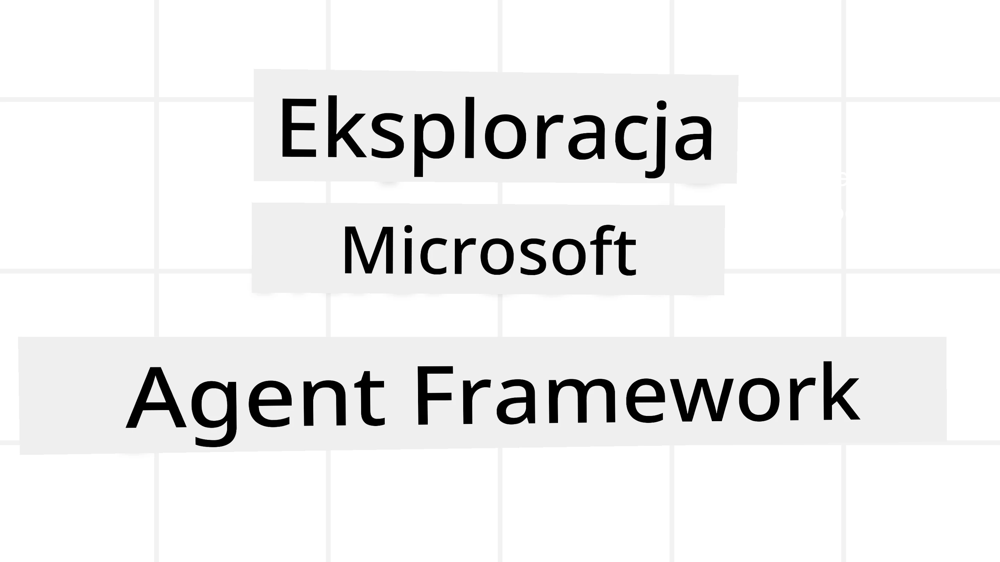
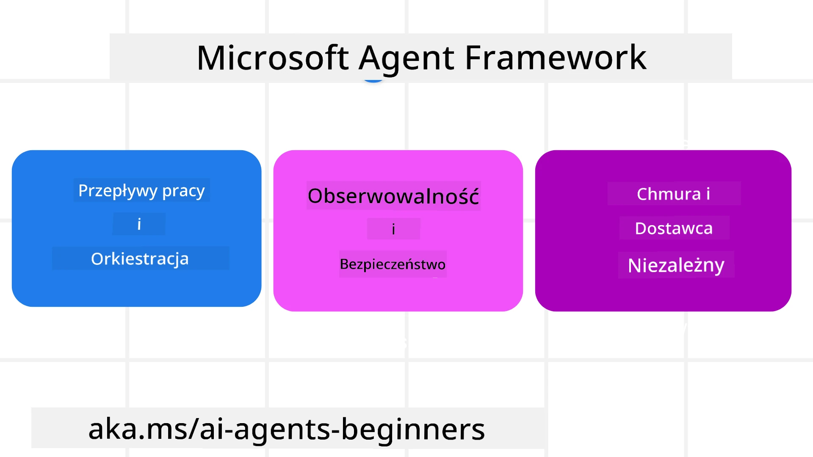
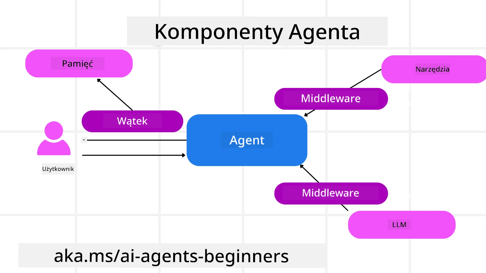

# Eksploracja Microsoft Agent Framework



### Wprowadzenie

Ta lekcja obejmie:

- Zrozumienie Microsoft Agent Framework: kluczowe funkcje i wartość  
- Poznanie kluczowych koncepcji Microsoft Agent Framework
- Zaawansowane wzorce MAF: przepływy pracy, middleware i pamięć

## Cele nauki

Po ukończeniu tej lekcji będziesz potrafić:

- Tworzyć agentów AI gotowych do produkcji przy użyciu Microsoft Agent Framework
- Stosować kluczowe funkcje Microsoft Agent Framework w swoich przypadkach użycia agentów
- Stosować zaawansowane wzorce, w tym przepływy pracy, middleware i obserwowalność

## Przykłady kodu 

Przykłady kodu dla [Microsoft Agent Framework (MAF)](https://aka.ms/ai-agents-beginners/agent-framewrok) można znaleźć w tym repozytorium w plikach `xx-python-agent-framework` i `xx-dotnet-agent-framework`.

## Zrozumienie Microsoft Agent Framework



[Microsoft Agent Framework (MAF)](https://aka.ms/ai-agents-beginners/agent-framewrok) to zunifikowany framework Microsoftu do tworzenia agentów AI. Oferuje elastyczność, aby sprostać różnorodnym przypadkom użycia agentów, spotykanym zarówno w środowiskach produkcyjnych, jak i badawczych, w tym:

- **Sekwencyjna orkiestracja agentów** w scenariuszach, gdzie potrzebne są przepływy krok po kroku.
- **Równoczesna orkiestracja** w scenariuszach, gdzie agenci muszą wykonywać zadania jednocześnie.
- **Orkiestracja czatu grupowego** w scenariuszach, gdzie agenci mogą współpracować nad jednym zadaniem.
- **Orkiestracja przekazania zadań (handoff)** w scenariuszach, gdzie agenci przekazują sobie zadanie w miarę wykonywania podzadań.
- **Magnetic Orchestration** w scenariuszach, w których agent zarządzający tworzy i modyfikuje listę zadań oraz koordynuje podagentów w celu ukończenia zadania.

Aby dostarczać agentów AI w środowisku produkcyjnym, MAF zawiera również funkcje do:

- **Obserwowalność** dzięki użyciu OpenTelemetry, gdzie każda akcja agenta AI — w tym wywołanie narzędzi, kroki orkiestracji, przebiegi rozumowania i monitorowanie wydajności — jest widoczna przez pulpity Microsoft Foundry.
- **Bezpieczeństwo** poprzez hostowanie agentów natywnie w Microsoft Foundry, które zawiera mechanizmy kontroli bezpieczeństwa, takie jak dostęp oparty na rolach, obsługa danych prywatnych oraz wbudowane zabezpieczenia treści.
- **Trwałość** — wątki agentów i przepływy pracy mogą być wstrzymywane, wznawiane i odzyskiwane po błędach, co umożliwia dłużej działające procesy.
- **Kontrola** — obsługiwane są przepływy pracy z udziałem człowieka (human-in-the-loop), w których zadania oznaczane są jako wymagające zatwierdzenia przez człowieka.

Microsoft Agent Framework skupia się również na interoperacyjności poprzez:

- **Niezależność od chmury (Cloud-agnostic)** — agenci mogą uruchamiać się w kontenerach, lokalnie (on-prem) oraz w różnych chmurach.
- **Niezależność od dostawcy (Provider-agnostic)** — agenci mogą być tworzeni przy użyciu preferowanego SDK, w tym Azure OpenAI i OpenAI
- **Integracja otwartych standardów** — agenci mogą korzystać z protokołów takich jak Agent-to-Agent (A2A) i Model Context Protocol (MCP), aby odkrywać i wykorzystywać innych agentów i narzędzia.
- **Wtyczki i konektory** — można nawiązywać połączenia z usługami danych i pamięci, takimi jak Microsoft Fabric, SharePoint, Pinecone i Qdrant.

Spójrzmy, jak te funkcje są stosowane w niektórych kluczowych koncepcjach Microsoft Agent Framework.

## Kluczowe koncepcje Microsoft Agent Framework

### Agenci



**Tworzenie agentów**

Tworzenie agenta odbywa się poprzez zdefiniowanie usługi inferencyjnej (dostawcy LLM), a
zestawu instrukcji, których agent AI ma przestrzegać, oraz przypisanej `name`:

```python
agent = AzureOpenAIChatClient(credential=AzureCliCredential()).create_agent( instructions="You are good at recommending trips to customers based on their preferences.", name="TripRecommender" )
```

Powyższy przykład używa `Azure OpenAI`, ale agenci mogą być tworzeni przy użyciu różnych usług, w tym `Microsoft Foundry Agent Service`:

```python
AzureAIAgentClient(async_credential=credential).create_agent( name="HelperAgent", instructions="You are a helpful assistant." ) as agent
```

API OpenAI `Responses` i `ChatCompletion`

```python
agent = OpenAIResponsesClient().create_agent( name="WeatherBot", instructions="You are a helpful weather assistant.", )
```

```python
agent = OpenAIChatClient().create_agent( name="HelpfulAssistant", instructions="You are a helpful assistant.", )
```

lub zdalnych agentów korzystających z protokołu A2A:

```python
agent = A2AAgent( name=agent_card.name, description=agent_card.description, agent_card=agent_card, url="https://your-a2a-agent-host" )
```

**Uruchamianie agentów**

Agenci są uruchamiani za pomocą metod `.run` lub `.run_stream` dla odpowiednio odpowiedzi niestrumieniowych lub strumieniowych.

```python
result = await agent.run("What are good places to visit in Amsterdam?")
print(result.text)
```

```python
async for update in agent.run_stream("What are the good places to visit in Amsterdam?"):
    if update.text:
        print(update.text, end="", flush=True)

```

Każde uruchomienie agenta może także zawierać opcje umożliwiające dostosowanie parametrów, takich jak `max_tokens` używane przez agenta, `tools`, które agent może wywoływać,  a nawet sam `model` używany przez agenta.

Jest to przydatne w przypadkach, gdy określone modele lub narzędzia są wymagane do wykonania zadania użytkownika.

**Narzędzia**

Narzędzia mogą być zdefiniowane zarówno podczas definiowania agenta:

```python
def get_attractions( location: Annotated[str, Field(description="The location to get the top tourist attractions for")], ) -> str: """Get the top tourist attractions for a given location.""" return f"The top attractions for {location} are." 


# Podczas tworzenia ChatAgenta bezpośrednio

agent = ChatAgent( chat_client=OpenAIChatClient(), instructions="You are a helpful assistant", tools=[get_attractions]

```

jak również podczas uruchamiania agenta:

```python

result1 = await agent.run( "What's the best place to visit in Seattle?", tools=[get_attractions] # Narzędzie dostępne tylko podczas tego uruchomienia )
```

**Wątki agenta**

Wątki agenta są używane do obsługi konwersacji wieloturnowych. Wątki mogą być tworzone na jeden z następujących sposobów:

- Użycie `get_new_thread()`, które umożliwia zapisanie wątku do wykorzystania później
- Automatyczne utworzenie wątku podczas uruchamiania agenta, który istnieje tylko podczas bieżącego uruchomienia.

Aby utworzyć wątek, kod wygląda następująco:

```python
# Utwórz nowy wątek.
thread = agent.get_new_thread() # Uruchom agenta z tym wątkiem.
response = await agent.run("Hello, I am here to help you book travel. Where would you like to go?", thread=thread)

```

Następnie możesz zserializować wątek, aby przechować go do późniejszego użycia:

```python
# Utwórz nowy wątek.
thread = agent.get_new_thread() 

# Uruchom agenta z tym wątkiem.

response = await agent.run("Hello, how are you?", thread=thread) 

# Zserializuj wątek do przechowywania.

serialized_thread = await thread.serialize() 

# Zdeserializuj stan wątku po wczytaniu z pamięci.

resumed_thread = await agent.deserialize_thread(serialized_thread)
```

**Middleware agenta**

Agenci wchodzą w interakcje z narzędziami i LLM-ami, aby wykonywać zadania użytkowników. W pewnych scenariuszach chcemy wykonywać lub śledzić zdarzenia pomiędzy tymi interakcjami. Middleware agenta umożliwia nam to poprzez:

*Middleware funkcji*

To middleware pozwala wykonać akcję między agentem a funkcją/narzędziem, które będzie wywoływane. Przykładem użycia jest chęć rejestrowania wywołania funkcji.

W poniższym kodzie `next` określa, czy powinno zostać wywołane następne middleware, czy faktyczna funkcja.

```python
async def logging_function_middleware(
    context: FunctionInvocationContext,
    next: Callable[[FunctionInvocationContext], Awaitable[None]],
) -> None:
    """Function middleware that logs function execution."""
    # Przetwarzanie wstępne: Zaloguj przed wykonaniem funkcji
    print(f"[Function] Calling {context.function.name}")

    # Kontynuuj do następnego middleware lub wykonania funkcji
    await next(context)

    # Przetwarzanie końcowe: Zaloguj po wykonaniu funkcji
    print(f"[Function] {context.function.name} completed")
```

*Middleware czatu*

To middleware pozwala wykonać lub zalogować akcję pomiędzy agentem a żądaniami wysyłanymi do LLM .

Zawiera to ważne informacje, takie jak `messages`, które są wysyłane do usługi AI.

```python
async def logging_chat_middleware(
    context: ChatContext,
    next: Callable[[ChatContext], Awaitable[None]],
) -> None:
    """Chat middleware that logs AI interactions."""
    # Przetwarzanie wstępne: Zaloguj przed wywołaniem AI
    print(f"[Chat] Sending {len(context.messages)} messages to AI")

    # Kontynuuj do następnego middleware lub usługi AI
    await next(context)

    # Przetwarzanie końcowe: Zaloguj po otrzymaniu odpowiedzi AI
    print("[Chat] AI response received")

```

**Pamięć agenta**

Jak omówiono w lekcji `Agentic Memory`, pamięć jest ważnym elementem umożliwiającym agentowi działanie w różnych kontekstach. MAF oferuje kilka różnych typów pamięci:

*Przechowywanie w pamięci (In-Memory Storage)*

To jest pamięć przechowywana we wątkach podczas działania aplikacji.

```python
# Utwórz nowy wątek.
thread = agent.get_new_thread() # Uruchom agenta z tym wątkiem.
response = await agent.run("Hello, I am here to help you book travel. Where would you like to go?", thread=thread)
```

*Wiadomości trwałe (Persistent Messages)*

Ta pamięć jest używana do przechowywania historii konwersacji między różnymi sesjami. Jest ona definiowana przy użyciu `chat_message_store_factory` :

```python
from agent_framework import ChatMessageStore

# Utwórz niestandardowy magazyn wiadomości
def create_message_store():
    return ChatMessageStore()

agent = ChatAgent(
    chat_client=OpenAIChatClient(),
    instructions="You are a Travel assistant.",
    chat_message_store_factory=create_message_store
)

```

*Pamięć dynamiczna (Dynamic Memory)*

Ta pamięć jest dodawana do kontekstu przed uruchomieniem agentów. Pamięci te mogą być przechowywane w zewnętrznych usługach, takich jak mem0:

```python
from agent_framework.mem0 import Mem0Provider

# Korzystanie z Mem0 dla zaawansowanych możliwości pamięciowych
memory_provider = Mem0Provider(
    api_key="your-mem0-api-key",
    user_id="user_123",
    application_id="my_app"
)

agent = ChatAgent(
    chat_client=OpenAIChatClient(),
    instructions="You are a helpful assistant with memory.",
    context_providers=memory_provider
)

```

**Obserwowalność agenta**

Obserwowalność jest ważna przy budowaniu niezawodnych i łatwych w utrzymaniu systemów opartych na agentach. MAF integruje się z OpenTelemetry, aby zapewnić śledzenie i mierniki dla lepszej obserwowalności.

```python
from agent_framework.observability import get_tracer, get_meter

tracer = get_tracer()
meter = get_meter()
with tracer.start_as_current_span("my_custom_span"):
    # zrób coś
    pass
counter = meter.create_counter("my_custom_counter")
counter.add(1, {"key": "value"})
```

### Przepływy pracy

MAF oferuje przepływy pracy, które są z góry zdefiniowanymi krokami do wykonania zadania i obejmują agentów AI jako komponenty tych kroków.

Przepływy pracy składają się z różnych komponentów umożliwiających lepszy przepływ sterowania. Przepływy pracy umożliwiają również **orkiestrację wielu agentów** oraz **zapisywanie punktów kontrolnych (checkpointing)** w celu zachowania stanów przepływu pracy.

Główne komponenty przepływu pracy to:

**Wykonawcy (Executors)**

Wykonawcy otrzymują komunikaty wejściowe, wykonują przypisane im zadania, a następnie generują komunikat wyjściowy. To przesuwa przepływ pracy do przodu w kierunku ukończenia większego zadania. Wykonawcy mogą być agentami AI lub logiką niestandardową.

**Krawędzie (Edges)**

Krawędzie służą do definiowania przepływu komunikatów w przepływie pracy. Mogą to być:

*Krawędzie bezpośrednie (Direct Edges)* - Proste połączenia jeden-do-jednego między wykonawcami:

```python
from agent_framework import WorkflowBuilder

builder = WorkflowBuilder()
builder.add_edge(source_executor, target_executor)
builder.set_start_executor(source_executor)
workflow = builder.build()
```

*Krawędzie warunkowe (Conditional Edges)* - Aktywowane po spełnieniu określonego warunku. Na przykład, gdy pokoje hotelowe są niedostępne, wykonawca może zasugerować inne opcje.

*Krawędzie typu switch-case (Switch-case Edges)* - Kierują komunikaty do różnych wykonawców w oparciu o zdefiniowane warunki. Na przykład, jeśli klient podróżny ma dostęp priorytetowy, jego zadania będą obsługiwane przez inny przepływ pracy.

*Krawędzie rozgałęziające (Fan-out Edges)* - Wysyłają jeden komunikat do wielu odbiorców.

*Krawędzie zbierające (Fan-in Edges)* - Zbierają wiele komunikatów od różnych wykonawców i wysyłają je do jednego celu.

**Zdarzenia**

Aby zapewnić lepszą obserwowalność przepływów pracy, MAF oferuje wbudowane zdarzenia związane z wykonaniem, w tym:

- `WorkflowStartedEvent`  - Rozpoczęcie wykonywania przepływu pracy
- `WorkflowOutputEvent` - Przepływ pracy generuje wynik
- `WorkflowErrorEvent` - Przepływ pracy napotyka błąd
- `ExecutorInvokeEvent`  - Wykonawca rozpoczyna przetwarzanie
- `ExecutorCompleteEvent`  -  Wykonawca kończy przetwarzanie
- `RequestInfoEvent` - Wysyłane jest żądanie

## Zaawansowane wzorce MAF

Powyższe sekcje omawiają kluczowe koncepcje Microsoft Agent Framework. Budując bardziej złożone agenty, rozważ następujące zaawansowane wzorce:

- **Kompozycja middleware**:  Łączenie wielu handlerów middleware (logowanie, auth, ograniczanie częstotliwości) za pomocą middleware funkcji i czatu w celu precyzyjnej kontroli zachowania agenta.
- **Zapisywanie punktów kontrolnych workflow (Workflow Checkpointing)**: Użyj zdarzeń przepływu pracy i serializacji, aby zapisywać i przywracać długotrwałe procesy agentów.
- **Dynamiczny wybór narzędzi**: Połącz RAG na opisach narzędzi z rejestracją narzędzi w MAF, aby prezentować tylko odpowiednie narzędzia dla danego zapytania.
- **Przekazywanie między agentami (Multi-Agent Handoff)**: Użyj krawędzi przepływu pracy i routingu warunkowego do orkiestracji przekazywania zadań między wyspecjalizowanymi agentami.

## Przykłady kodu 

Przykłady kodu dla Microsoft Agent Framework można znaleźć w tym repozytorium w plikach `xx-python-agent-framework` i `xx-dotnet-agent-framework`.

## Masz więcej pytań dotyczących Microsoft Agent Framework?

Dołącz do [Microsoft Foundry Discord](https://aka.ms/ai-agents/discord) aby spotkać innych uczących się, uczestniczyć w godzinach konsultacji i uzyskać odpowiedzi na pytania dotyczące swoich agentów AI.

---

<!-- CO-OP TRANSLATOR DISCLAIMER START -->
Zastrzeżenie:
Ten dokument został przetłumaczony przy użyciu usługi tłumaczenia AI Co-op Translator (https://github.com/Azure/co-op-translator). Chociaż dokładamy starań o rzetelność, należy pamiętać, że tłumaczenia automatyczne mogą zawierać błędy lub niedokładności. Oryginalny dokument w języku źródłowym należy uznać za wersję wiążącą. W przypadku informacji krytycznych zalecane jest skorzystanie z profesjonalnego tłumaczenia wykonanego przez człowieka. Nie ponosimy odpowiedzialności za jakiekolwiek nieporozumienia lub błędne interpretacje wynikające z użycia tego tłumaczenia.
<!-- CO-OP TRANSLATOR DISCLAIMER END -->