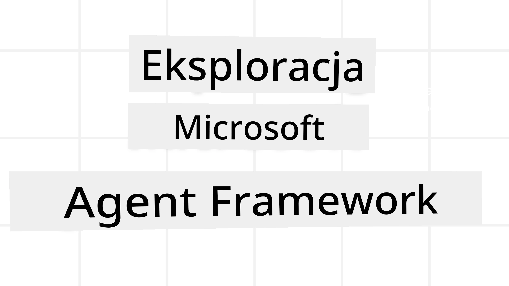
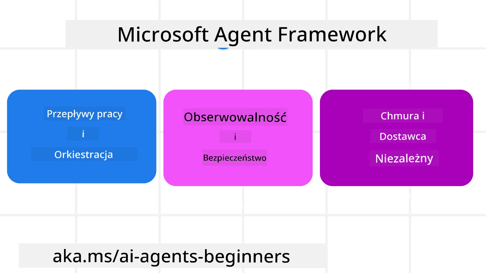
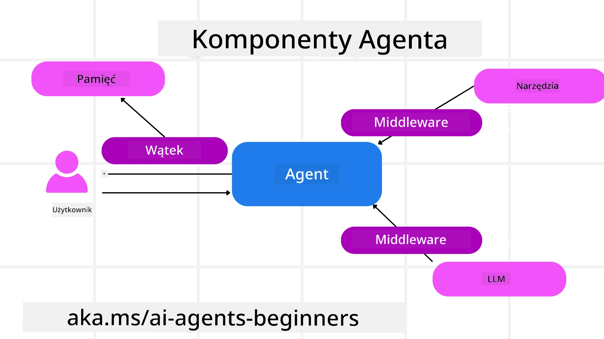

# Eksploracja Microsoft Agent Framework



### Wprowadzenie

Ta lekcja obejmuje:

- Zrozumienie Microsoft Agent Framework: Kluczowe cechy i wartość  
- Eksplorację kluczowych koncepcji Microsoft Agent Framework
- Zaawansowane wzorce MAF: przepływy pracy, middleware i pamięć

## Cele nauki

Po ukończeniu tej lekcji będziesz wiedzieć, jak:

- Tworzyć gotowe do produkcji agentów AI przy użyciu Microsoft Agent Framework
- Stosować podstawowe funkcje Microsoft Agent Framework do Twoich przypadków użycia agentów
- Używać zaawansowanych wzorców, w tym przepływów pracy, middleware oraz obserwowalności

## Przykłady kodu 

Przykłady kodu dla [Microsoft Agent Framework (MAF)](https://learn.microsoft.com/en-us/agent-framework/overview/?wt.mc_id=youtube_26688_organicsocial_reactor&pivots=programming-language-python) znajdziesz w tym repozytorium w plikach `xx-python-agent-framework` i `xx-dotnet-agent-framework`.

## Zrozumienie Microsoft Agent Framework



[Microsoft Agent Framework (MAF)](https://learn.microsoft.com/en-us/agent-framework/overview/?wt.mc_id=youtube_26688_organicsocial_reactor&pivots=programming-language-python) to zunifikowany framework Microsoft do tworzenia agentów AI. Oferuje elastyczność do realizacji szerokiej gamy scenariuszy użycia agentów spotykanych zarówno w środowiskach produkcyjnych, jak i badawczych, w tym:

- **Sekwencyjną orkiestrację agentów** w scenariuszach, gdy potrzebne są krok po kroku przepływy pracy.
- **Równoległą orkiestrację** w scenariuszach, gdzie agenci muszą wykonywać zadania jednocześnie.
- **Orkiestrację czatu grupowego** w scenariuszach, gdy agenci mogą współpracować nad jednym zadaniem.
- **Orkiestrację przekazywania zadań** w scenariuszach, gdy agenci przekazują zadanie sobie nawzajem, gdy podzadania są ukończone.
- **Orkiestrację magnetyczną** w scenariuszach, gdy agent zarządzający tworzy i modyfikuje listę zadań oraz koordynuje podagentów do ich wykonania.

Aby dostarczać agentów AI w produkcji, MAF zawiera także funkcje dla:

- **Obserwowalności** poprzez użycie OpenTelemetry, gdzie każda akcja agenta AI, włącznie z wywołaniem narzędzi, krokami orkiestracji, przepływami rozumowania oraz monitorowaniem wydajności na pulpitach Microsoft Foundry, jest śledzona.
- **Bezpieczeństwa** dzięki natywnemu hostowaniu agentów w Microsoft Foundry, które obejmuje kontrolę dostępu opartą na rolach, obsługę prywatnych danych i wbudowane bezpieczeństwo treści.
- **Trwałości**, ponieważ wątki i przepływy agenta mogą być wstrzymywane, wznawiane i odzyskiwane po błędach, co umożliwia procesy długotrwałe.
- **Kontroli** poprzez obsługę przepływów pracy z człowiekiem w pętli, gdzie zadania oznaczane są jako wymagające zatwierdzenia przez człowieka.

Microsoft Agent Framework skupia się także na interoperacyjności poprzez:

- **Bycie niezależnym od chmury** - Agenci mogą działać w kontenerach, on-premises oraz na różnych chmurach.
- **Bycie neutralnym względem dostawcy** - Agenci mogą być tworzeni przy użyciu preferowanego SDK, w tym Azure OpenAI i OpenAI.
- **Integrację otwartych standardów** - Agenci mogą wykorzystywać protokoły takie jak Agent-to-Agent (A2A) i Model Context Protocol (MCP) do odkrywania i używania innych agentów i narzędzi.
- **Wtyczki i konektory** - Możliwe są połączenia z usługami danych i pamięci takimi jak Microsoft Fabric, SharePoint, Pinecone i Qdrant.

Przyjrzyjmy się, jak te funkcje są stosowane do niektórych podstawowych koncepcji Microsoft Agent Framework.

## Kluczowe koncepcje Microsoft Agent Framework

### Agenci



**Tworzenie agentów**

Tworzenie agenta odbywa się przez zdefiniowanie usługi inferencyjnej (dostawcy LLM),  
zestawu instrukcji, które agent AI ma wykonać oraz przypisanej `name`:

```python
agent = AzureOpenAIChatClient(credential=AzureCliCredential()).create_agent( instructions="You are good at recommending trips to customers based on their preferences.", name="TripRecommender" )
```

Powyższy przykład używa `Azure OpenAI`, ale agentów można tworzyć przy użyciu różnych usług, w tym `Microsoft Foundry Agent Service`:

```python
AzureAIAgentClient(async_credential=credential).create_agent( name="HelperAgent", instructions="You are a helpful assistant." ) as agent
```

OpenAI `Responses`, `ChatCompletion` API

```python
agent = OpenAIResponsesClient().create_agent( name="WeatherBot", instructions="You are a helpful weather assistant.", )
```

```python
agent = OpenAIChatClient().create_agent( name="HelpfulAssistant", instructions="You are a helpful assistant.", )
```

lub [MiniMax](https://platform.minimaxi.com/), który oferuje API kompatybilne z OpenAI z dużymi oknami kontekstowymi (do 204K tokenów):

```python
agent = OpenAIChatClient(base_url="https://api.minimax.io/v1", api_key=os.environ["MINIMAX_API_KEY"], model_id="MiniMax-M3").create_agent( name="HelpfulAssistant", instructions="You are a helpful assistant.", )
```

lub agentów zdalnych wykorzystujących protokół A2A:

```python
agent = A2AAgent( name=agent_card.name, description=agent_card.description, agent_card=agent_card, url="https://your-a2a-agent-host" )
```

**Uruchamianie agentów**

Agenci są uruchamiani za pomocą metod `.run` lub `.run_stream` dla odpowiednio odpowiedzi nieprzesyłanych lub przesyłanych strumieniowo.

```python
result = await agent.run("What are good places to visit in Amsterdam?")
print(result.text)
```

```python
async for update in agent.run_stream("What are the good places to visit in Amsterdam?"):
    if update.text:
        print(update.text, end="", flush=True)

```

Każde uruchomienie agenta może mieć również opcje dostosowania parametrów takich jak `max_tokens` używane przez agenta, `tools`, które agent może wywoływać, a nawet `model` stosowany przez agenta.

Jest to przydatne w przypadkach, gdzie wymagane są konkretne modele lub narzędzia do wykonania zadania użytkownika.

**Narzędzia**

Narzędzia mogą być definiowane zarówno podczas definiowania agenta:

```python
def get_attractions( location: Annotated[str, Field(description="The location to get the top tourist attractions for")], ) -> str: """Get the top tourist attractions for a given location.""" return f"The top attractions for {location} are." 


# Przy bezpośrednim tworzeniu ChatAgent

agent = ChatAgent( chat_client=OpenAIChatClient(), instructions="You are a helpful assistant", tools=[get_attractions]

```

jak i podczas uruchamiania agenta:

```python

result1 = await agent.run( "What's the best place to visit in Seattle?", tools=[get_attractions] # Narzędzie udostępnione wyłącznie na to uruchomienie )
```

**Wątki agentów**

Wątki agentów służą do obsługi wielokrotnych rozmów. Wątki mogą być tworzone albo przez:

- Użycie `get_new_thread()`, które pozwala na zapisywanie wątku w czasie
- Automatyczne utworzenie wątku podczas uruchamiania agenta, przy czym wątek istnieje tylko podczas bieżącego uruchomienia.

Aby utworzyć wątek, kod wygląda następująco:

```python
# Utwórz nowy wątek.
thread = agent.get_new_thread() # Uruchom agenta z wątkiem.
response = await agent.run("Hello, I am here to help you book travel. Where would you like to go?", thread=thread)

```

Następnie możesz zserializować wątek, aby przechować go na później:

```python
# Utwórz nowy wątek.
thread = agent.get_new_thread() 

# Uruchom agenta z wątkiem.

response = await agent.run("Hello, how are you?", thread=thread) 

# Zserializuj wątek do przechowywania.

serialized_thread = await thread.serialize() 

# Deserializuj stan wątku po załadowaniu z magazynu.

resumed_thread = await agent.deserialize_thread(serialized_thread)
```

**Middleware agenta**

Agenci współdziałają z narzędziami i LLM, aby wykonywać zadania użytkownika. W niektórych scenariuszach chcemy wykonać lub śledzić działania pomiędzy tymi interakcjami. Middleware agenta pozwala na to przez:

*Middleware funkcji*

To middleware pozwala wykonać akcję pomiędzy agentem a funkcją/narzędziem, które będzie wywoływane. Przykładem jego użycia jest logowanie wywołania funkcji.

W poniższym kodzie `next` określa, czy wywołać następne middleware lub faktyczną funkcję.

```python
async def logging_function_middleware(
    context: FunctionInvocationContext,
    next: Callable[[FunctionInvocationContext], Awaitable[None]],
) -> None:
    """Function middleware that logs function execution."""
    # Przetwarzanie wstępne: Logowanie przed wykonaniem funkcji
    print(f"[Function] Calling {context.function.name}")

    # Kontynuuj do następnego middleware lub wykonania funkcji
    await next(context)

    # Przetwarzanie końcowe: Logowanie po wykonaniu funkcji
    print(f"[Function] {context.function.name} completed")
```

*Middleware czatu*

To middleware pozwala wykonać lub zalogować akcję pomiędzy agentem a żądaniami do LLM.

Zawiera ważne informacje, takie jak `messages` przesyłane do usług AI.

```python
async def logging_chat_middleware(
    context: ChatContext,
    next: Callable[[ChatContext], Awaitable[None]],
) -> None:
    """Chat middleware that logs AI interactions."""
    # Wstępne przetwarzanie: Logowanie przed wywołaniem AI
    print(f"[Chat] Sending {len(context.messages)} messages to AI")

    # Kontynuuj do następnego middleware lub usługi AI
    await next(context)

    # Przetwarzanie po wywołaniu: Logowanie po odpowiedzi AI
    print("[Chat] AI response received")

```

**Pamięć agenta**

Jak omówiono w lekcji `Agentic Memory`, pamięć jest ważnym elementem umożliwiającym agentowi działanie w różnych kontekstach. MAF oferuje kilka typów pamięci:

*Pamięć w trakcie działania (In-Memory Storage)*

Jest to pamięć przechowywana we wątkach podczas działania aplikacji.

```python
# Utwórz nowy wątek.
thread = agent.get_new_thread() # Uruchom agenta z tym wątkiem.
response = await agent.run("Hello, I am here to help you book travel. Where would you like to go?", thread=thread)
```

*Wiadomości trwałe (Persistent Messages)*

Ta pamięć jest używana do przechowywania historii rozmów między sesjami. Definiuje się ją za pomocą `chat_message_store_factory` :

```python
from agent_framework import ChatMessageStore

# Utwórz niestandardowy sklep wiadomości
def create_message_store():
    return ChatMessageStore()

agent = ChatAgent(
    chat_client=OpenAIChatClient(),
    instructions="You are a Travel assistant.",
    chat_message_store_factory=create_message_store
)

```

*Pamięć dynamiczna (Dynamic Memory)*

Ta pamięć jest dodawana do kontekstu przed uruchomieniem agentów. Może być przechowywana w usługach zewnętrznych, takich jak mem0:

```python
from agent_framework.mem0 import Mem0Provider

# Używanie Mem0 do zaawansowanych możliwości pamięciowych
memory_provider = Mem0Provider(
    api_key="your-mem0-api-key",
    user_id="user_123",
    application_id="my_app"
)

agent = ChatAgent(
    chat_client=OpenAIChatClient(),
    instructions="You are a helpful assistant with memory.",
    context_providers=memory_provider
)

```

**Obserwowalność agenta**

Obserwowalność jest ważna dla budowy niezawodnych i łatwych w utrzymaniu systemów agentowych. MAF integruje się z OpenTelemetry, oferując śledzenie i mierniki dla lepszej obserwowalności.

```python
from agent_framework.observability import get_tracer, get_meter

tracer = get_tracer()
meter = get_meter()
with tracer.start_as_current_span("my_custom_span"):
    # zrób coś
    pass
counter = meter.create_counter("my_custom_counter")
counter.add(1, {"key": "value"})
```

### Przepływy pracy

MAF oferuje przepływy pracy, które są predefiniowanymi krokami do wykonania zadania, włączając agentów AI jako komponenty tych kroków.

Przepływy pracy składają się z różnych komponentów, które pozwalają lepiej kontrolować przepływ. Umożliwiają także **orkiestrację wielu agentów** i **checkpointing**, aby zapisywać stany przepływu pracy.

Podstawowe komponenty przepływu pracy to:

**Wykonawcy (Executors)**

Wykonawcy odbierają wiadomości wejściowe, wykonują powierzone zadania, a następnie generują wiadomość wyjściową. Przesuwają działanie przepływu pracy w kierunku ukończenia większego zadania. Wykonawcą może być agent AI lub logika niestandardowa.

**Krawędzie (Edges)**

Krawędzie służą do definiowania przepływu wiadomości w przepływie pracy. Mogą to być:

*Krawędzie bezpośrednie* - Proste połączenia jeden do jednego między wykonawcami:

```python
from agent_framework import WorkflowBuilder

builder = WorkflowBuilder()
builder.add_edge(source_executor, target_executor)
builder.set_start_executor(source_executor)
workflow = builder.build()
```

*Krawędzie warunkowe* - Aktywowane po spełnieniu określonego warunku. Na przykład, gdy pokoje hotelowe są niedostępne, wykonawca może zasugerować inne opcje.

*Krawędzie typu switch-case* - Kierują wiadomości do różnych wykonawców na podstawie określonych warunków. Na przykład, jeśli klient podróży ma priorytetowy dostęp, jego zadania będą obsługiwane przez inny przepływ pracy.

*Krawędzie rozsyłające (Fan-out)* - Wysyłają jedną wiadomość do wielu odbiorców.

*Krawędzie zbierające (Fan-in)* - Zbierają wiele wiadomości od różnych wykonawców i wysyłają do jednego odbiorcy.

**Zdarzenia (Events)**

Aby zapewnić lepszą obserwowalność przepływów pracy, MAF oferuje wbudowane zdarzenia wykonania, takie jak:

- `WorkflowStartedEvent`  - Rozpoczęcie wykonania przepływu pracy
- `WorkflowOutputEvent` - Przepływ pracy generuje wynik
- `WorkflowErrorEvent` - Przepływ pracy natrafia na błąd
- `ExecutorInvokeEvent`  - Wykonawca zaczyna przetwarzanie
- `ExecutorCompleteEvent`  -  Wykonawca kończy przetwarzanie
- `RequestInfoEvent` - Wysłanie zapytania

## Zaawansowane wzorce MAF

Powyższe sekcje omawiają kluczowe koncepcje Microsoft Agent Framework. Budując bardziej złożonych agentów, warto rozważyć następujące zaawansowane wzorce:

- **Kompozycja middleware**: Łączenie wielu obsług middleware (logowanie, autoryzacja, ograniczenia szybkości) przy użyciu middleware funkcji i czatu dla precyzyjnej kontroli zachowania agenta.
- **Checkpointing przepływów pracy**: Używanie zdarzeń przepływu pracy i serializacji do zapisywania i wznawiania długotrwałych procesów agentów.
- **Dynamiczny wybór narzędzi**: Łączenie RAG nad opisami narzędzi z rejestracją narzędzi w MAF, aby prezentować tylko istotne narzędzia dla zapytania.
- **Przekazywanie między agentami**: Użycie krawędzi przepływu pracy i warunkowego routingu do orkiestracji przekazań między wyspecjalizowanymi agentami.

## Hostowanie agentów LangChain / LangGraph na Microsoft Foundry

Microsoft Agent Framework jest **framework-interoperacyjny** — nie jesteś ograniczony do agentów napisanych w MAF. Jeśli masz już agenta zbudowanego za pomocą **LangChain** lub **LangGraph**, możesz go uruchomić jako **hostowanego agenta Microsoft Foundry**, gdzie Foundry zarządza środowiskiem uruchomieniowym, sesjami, skalowaniem, tożsamością i punktami końcowymi protokołu, podczas gdy logika Twojego agenta pozostaje w LangGraph.

Realizuje się to za pomocą pakietu `langchain_azure_ai.agents.hosting`, który udostępnia skompilowany graf LangGraph za pośrednictwem tych samych protokołów, które używają hostowani agenci Foundry.

**1. Zainstaluj dodatkowe zależności hostingowe:**

```bash
pip install -U "langchain-azure-ai[hosting]>=1.2.4" azure-identity
```

Pakiet `hosting` instaluje biblioteki protokołów Foundry: `azure-ai-agentserver-responses` (kompatybilny z OpenAI endpoint `/responses`) oraz `azure-ai-agentserver-invocations` (ogólny endpoint `/invocations`).

**2. Wybierz protokół hostowania:**

| Protokół | Klasa hosta | Punkt końcowy | Użycie |
|----------|-----------|----------|----------|
| **Responses** | `ResponsesHostServer` | `/responses` | Chcesz czatu kompatybilnego z OpenAI, przesyłania strumieniowego, historii odpowiedzi i wątków rozmowy — zalecany domyślny dla agentów konwersacyjnych. |
| **Invocations** | `InvocationsHostServer` | `/invocations` | Potrzebujesz niestandardowego JSON, punktu końcowego w stylu webhook lub przetwarzania niekonwersacyjnego. |

Ponieważ **Responses API jest głównym API do rozwoju agentów w Foundry**, zacznij od `ResponsesHostServer` dla większości agentów.

**3. Skonfiguruj zmienne środowiskowe** (`az login` najpierw, by `DefaultAzureCredential` mogła się uwierzytelnić):

```bash
export FOUNDRY_PROJECT_ENDPOINT="https://<resource>.services.ai.azure.com/api/projects/<project>"
export FOUNDRY_MODEL_NAME="gpt-5-mini"
```

Kiedy agent będzie działał jako hostowany agent w Foundry, platforma automatycznie wstrzyknie `FOUNDRY_PROJECT_ENDPOINT`.

**4. Udostępnij agenta LangGraph przez protokół Responses:**

```python
import os

from azure.ai.projects import AIProjectClient
from azure.identity import DefaultAzureCredential, get_bearer_token_provider
from langchain.agents import create_agent
from langchain_openai import ChatOpenAI
from langchain_azure_ai.agents.hosting import ResponsesHostServer

_AZURE_AI_SCOPE = "https://ai.azure.com/.default"


def build_chat_model() -> ChatOpenAI:
    project_endpoint = os.environ["FOUNDRY_PROJECT_ENDPOINT"].rstrip("/")
    deployment = os.environ.get("FOUNDRY_MODEL_NAME", "gpt-5-mini")
    credential = DefaultAzureCredential()
    project = AIProjectClient(endpoint=project_endpoint, credential=credential)
    openai_client = project.get_openai_client()
    token_provider = get_bearer_token_provider(credential, _AZURE_AI_SCOPE)

    # ChatOpenAI tutaj kieruje się do punktu końcowego (Responses) zgodnego z OpenAI projektu Foundry.
    return ChatOpenAI(
        model=deployment,
        base_url=str(openai_client.base_url),
        api_key=token_provider,
    )


def main() -> None:
    graph = create_agent(build_chat_model(), tools=[])
    port = int(os.environ.get("PORT", "8088"))
    ResponsesHostServer(graph).run(port=port)


if __name__ == "__main__":
    main()
```

Uruchom lokalnie poleceniem `python main.py`, a następnie wyślij zapytanie Responses do `http://localhost:8088/responses`.

**Kluczowe zachowania:**

- **Rozmowy**: Klienci kontynuują rozmowę, przekazując `previous_response_id` lub `conversation` ID. Jeśli Twój graf jest skompilowany z checkpointingiem LangGraph, Foundry powiąże stan rozmowy z checkpointem (użyj trwałego checkpointera w produkcji; `MemorySaver` jest ok do testów lokalnych).
- **Człowiek w pętli (Human-in-the-loop)**: Jeśli Twój graf korzysta z `interrupt()` LangGraph, `ResponsesHostServer` wyświetla oczekujące przerwanie jako element `function_call` / `mcp_approval_request`, a klienci wznawiają z dopasowanym `function_call_output` / `mcp_approval_response`.
- **Deploy do Foundry**: Użyj Azure Developer CLI — `azd ext install azure.ai.agents`, `azd ai agent init -m <manifest>`, `azd ai agent run` (lokalnie, wymaga Dockera), następnie `azd provision` i `azd deploy`. Wdrażanie hostowanych agentów wymaga roli **Foundry Project Manager**.

Uruchomialna wersja tego przykładu znajduje się w pliku [code-samples/14-langchain-hosted-agent.py](../../../14-microsoft-agent-framework/code-samples/14-langchain-hosted-agent.py). Pełny przewodnik (protokół Invocations, niestandardowe schematy żądań i rozwiązywanie problemów) znajdziesz w [Host LangGraph agents as Foundry hosted agents](https://learn.microsoft.com/azure/foundry/how-to/develop/langchain-hosted-agents).

## Przykłady kodu 

Przykłady kodu dla Microsoft Agent Framework znajdziesz w tym repozytorium w plikach `xx-python-agent-framework` i `xx-dotnet-agent-framework`.

## Masz więcej pytań o Microsoft Agent Framework?

Dołącz do [Microsoft Foundry Discord](https://discord.com/invite/ATgtXmAS5D), aby spotkać innych uczących się, uczestniczyć w godzinach konsultacji i uzyskać odpowiedzi na pytania dotyczące agentów AI.
## Poprzednia lekcja

[Pamięć dla agentów AI](../13-agent-memory/README.md)

## Następna lekcja

[Budowanie agentów korzystających z komputera (CUA)](../15-browser-use/README.md)

---

<!-- CO-OP TRANSLATOR DISCLAIMER START -->
**Zastrzeżenie**:
Niniejszy dokument został przetłumaczony za pomocą usługi tłumaczenia AI [Co-op Translator](https://github.com/Azure/co-op-translator). Choć dążymy do dokładności, prosimy pamiętać, że automatyczne tłumaczenia mogą zawierać błędy lub niedokładności. Oryginalny dokument w jego języku źródłowym należy uznawać za autorytatywne źródło. W przypadku informacji krytycznych zalecane jest skorzystanie z profesjonalnego tłumaczenia wykonanego przez człowieka. Nie ponosimy odpowiedzialności za jakiekolwiek nieporozumienia lub błędne interpretacje wynikające z użycia tego tłumaczenia.
<!-- CO-OP TRANSLATOR DISCLAIMER END -->