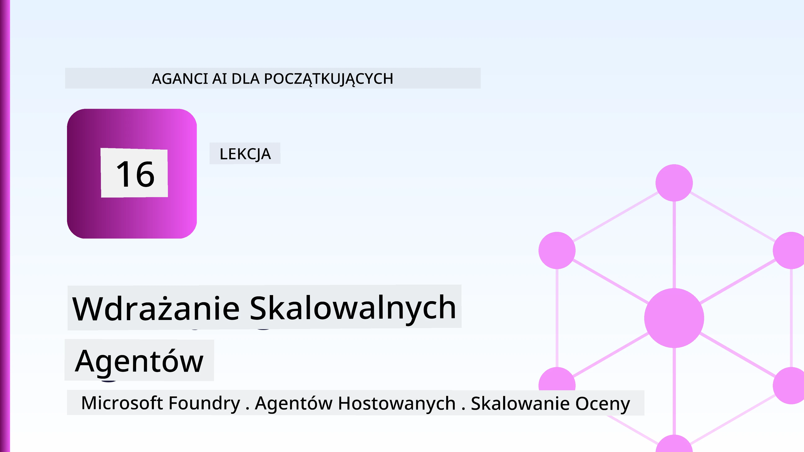
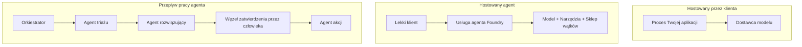
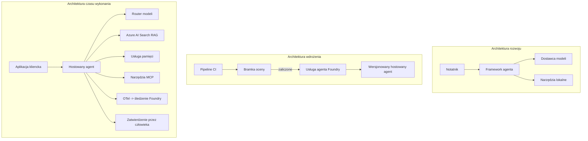

# Wdrażanie Skalowalnych Agentów z Microsoft Foundry



Do tej pory w kursie tworzyłeś agentów działających na swoim laptopie, wewnątrz notatnika, uruchamianych przez `az login` i kilka zmiennych środowiskowych. To dokładnie właściwy sposób na naukę. To nie jest właściwy sposób na uruchomienie agenta, od którego zależy tysiące klientów o 3 nad ranem.

Ta lekcja dotyczy luki między "działa na mojej maszynie" a "działa niezawodnie i przystępnie cenowo w produkcji." Tę lukę zamykamy za pomocą **Microsoft Foundry** i **Microsoft Foundry Agent Service**, budując rzeczywistego agenta wsparcia klienta, który ma narzędzia, wyszukiwanie, pamięć, ocenę i monitorowanie.

## Wprowadzenie

Ta lekcja obejmie:

- Różnicę między **agentem prototypowym** a **agentem wdrożonym** oraz dlaczego przejście dotyczy przede wszystkim wszystkiego *wokół* modelu.
- **Wzorce wdrożenia** dla agentów: hostowane przez klienta, hostowane jako usługa (Hosted Agents) oraz orkiestracja workflow.
- **Cykl życia agenta** na Microsoft Foundry — tworzenie, wersjonowanie, wdrażanie, ocena, obserwacja, wycofanie.
- **Strategie skalowania**: trasowanie modeli, cache’owanie, równoczesność i projektowanie bezstanowe.
- **Obserwowalność** z OpenTelemetry i śledzeniem Foundry.
- **Optymalizacja kosztów** przez dobór modelu, trasowanie i bramki oceny.
- **Rozważania korporacyjne**: zarządzanie, zatwierdzenie przez człowieka i bezpieczne uruchamianie serwerów MCP w produkcji.

## Cele Nauki

Po ukończeniu tej lekcji będziesz potrafił:

- Wybrać odpowiedni wzorzec wdrożenia dla danego obciążenia agenta.
- Wdrożyć agenta do Microsoft Foundry Agent Service tak, aby był wersjonowany, zarządzany i obserwowalny.
- Instrumentować agenta do śledzenia i podłączyć potok oceny działający przed każdym wydaniem.
- Zastosować trasowanie i cache’owanie modeli, aby utrzymać opóźnienia i koszty pod kontrolą na dużą skalę.
- Dodać bramkę zatwierdzania przez człowieka dla działań wysokiego ryzyka i zintegrować serwer MCP w sposób bezpieczny dla produkcji.

## Wymagania Wstępne

Ta lekcja zakłada, że ukończyłeś wcześniejsze lekcje i czujesz się komfortowo z:

- Budowaniem agentów za pomocą [Microsoft Agent Framework](../14-microsoft-agent-framework/README.md) (Lekcja 14).
- [Użyciem narzędzi](../04-tool-use/README.md) (Lekcja 4) i [Agentic RAG](../05-agentic-rag/README.md) (Lekcja 5).
- [Pamięcią agenta](../13-agent-memory/README.md) (Lekcja 13) i [Agentic Protocols / MCP](../11-agentic-protocols/README.md) (Lekcja 11).
- [Obserwowalnością i oceną](../10-ai-agents-production/README.md) (Lekcja 10) — ta lekcja bezpośrednio na niej bazuje.

Potrzebujesz również:

- **Subskrypcji Azure** i **projektu Microsoft Foundry** z przynajmniej jednym wdrożonym modelem czatu.
- **Azure CLI** zalogowanego (`az login`).
- Pythona 3.12+ i pakietów z repozytorium [`requirements.txt`](../../../requirements.txt).

## Od Prototypu do Produkcji: Co się faktycznie zmienia

Agent prototypowy i agent produkcyjny dzielą tę samą podstawową pętlę — rozumowanie, wywołanie narzędzi, odpowiedź. Zmienia się wszystko, co jest wokół tej pętli. Model to może około 20% agenta produkcyjnego; pozostałe 80% to operacyjny szkielet.

| Aspekt | Prototyp | Produkcja |
| --- | --- | --- |
| **Hosting** | Działa w twoim notatniku | Działa jako hostowana usługa, wersjonowana i wdrażana |
| **Tożsamość** | Twój token `az login` | Zarządzana tożsamość z ograniczonym RBAC |
| **Stan** | W pamięci, tracony przy restarcie | Zewnętrzny (magazyn wątków, serwis pamięci) |
| **Awaria** | Widzisz traceback | Ponowne próby, rozwiązania zapasowe, dead-letter, alerty |
| **Koszt** | "To kilka centów" | Śledzony na żądanie, trasowany, cache’owany, budżetowany |
| **Jakość** | Oceniasz wzrokiem | Automatycznie oceniany przed każdym wydaniem |
| **Zaufanie** | Zatwierdzasz każdą akcję | Polityka + człowiek w pętli dla ryzykownych działań |

Zapamiętaj tę tabelę. Każda poniższa sekcja odpowiada jednemu wierszowi.

## Wzorce Wdrożenia Agentów

Istnieją trzy wzorce, których często używasz w połączeniu.

### 1. Agenci hostowani przez klienta

Obiekt agenta działa wewnątrz *twojego* procesu aplikacji. Twój kod wywołuje bezpośrednio dostawcę modelu; pętla rozumowania działa w twojej usłudze. To jest to, co robiły dotychczasowe lekcje.

- **Używaj, gdy** potrzebujesz pełnej kontroli nad pętlą, niestandardowego middleware lub osadzasz agenta w istniejącym backendzie.
- **Kompromis**: sam zarządzasz skalowalnością, stanem i odpornością.

### 2. Agenci hostowani (Foundry Agent Service)

Agent jest *zarejestrowany jako zasób* w Microsoft Foundry. Foundry hostuje pętlę rozumowania, przechowuje wątki, egzekwuje bezpieczeństwo treści i RBAC, oraz udostępnia agenta na portalu Foundry. Twoja aplikacja staje się cienkim klientem, który tworzy wątki i odczytuje odpowiedzi.

- **Używaj, gdy** chcesz trwałości, wbudowanej obserwowalności, zarządzania i mniejszej powierzchni operacyjnej.
- **Kompromis**: mniej niskopoziomowej kontroli w zamian za runtime zarządzany.

### 3. Workflow agentów

Wielu agentów (i narzędzi) łączy się w graf z explicytnym przepływem sterowania — kroki sekwencyjne, rozwidlenia, węzły zatwierdzenia przez człowieka oraz trwałe punkty kontrolne, które mogą wstrzymać i wznowić pracę. To jest zdolność Microsoft Agent Framework **Workflows** zastosowana na skali wdrożeniowej.

- **Używaj, gdy** pojedyncze zadanie obejmuje kilku specjalistycznych agentów lub wymaga kroku zatwierdzenia pośredniego.
- **Kompromis**: więcej poruszających się części; wymaga obserwowalności na poziomie orkiestracji.



## Cykl życia agenta na Microsoft Foundry

Wdrożenie agenta to nie jednorazowy `push`. To pętla, bardzo podobna do cyklu wydawniczego oprogramowania, bo właśnie nią jest.


Kluczowa idea, przeniesiona z [Lekcji 10](../10-ai-agents-production/README.md): **ocena offline to brama, nie dodatek.** Nowa wersja agenta nie jest udostępniana, jeśli nie przejdzie twoich progów oceny. Obserwowalność online odsyła rzeczywiste awarie z powrotem do zestawu testów offline. To cała pętla.

## Strategie Skalowania

Skalowanie agenta różni się od skalowania bezstanowego API webowego, bo każde żądanie może wywołać wiele kosztownych wywołań modelu i narzędzi. Cztery techniki niosą większość obciążenia.

**Obsługa żądań bez stanu.** Nie przechowuj danych stanu użytkownika w pamięci procesu. Zachowuj wątki rozmowy w magazynie wątków Foundry lub serwisie pamięci, by każda instancja mogła obsłużyć dowolne żądanie. To umożliwia skalowanie horyzontalne — dodajesz instancje, brak sesji przyklejonych.

**Trasowanie modelu.** Nie każde żądanie wymaga najbardziej zdolnego (i najdroższego) modelu. Kieruj proste żądania — klasyfikację intencji, krótkie odpowiedzi faktograficzne — do małego, szybkiego modelu, a duży model rezerwuj do prawdziwego rozumowania. Foundry’s **Model Router** zrobi to za ciebie, lub możesz zbudować lekki klasyfikator samodzielnie. W laboratorium zbudujesz wersję DIY.

**Cache’owanie odpowiedzi.** Wiele zapytań wsparcia to niemal duplikaty ("jak zresetować hasło?"). Cache’uj odpowiedzi na popularne pytania i serwuj je bez wywoływania modelu. Nawet skromny wskaźnik trafień cache znacząco obniża koszt i opóźnienia.

**Równoczesność i backpressure.** Dostawcy modeli mają limity szybkości. Ograniczaj równoczesność, stosuj ponowne próby z wykładniczym backoffem i obsługuj błędy łagodnie (odpowiedź w kolejce „pracujemy nad tym” lepsza niż 500).


## Obserwowalność w Produkcji

Nie możesz zarządzać tym, czego nie widzisz. Jak omówiono w Lekcji 10, Microsoft Agent Framework natywnie emituje ślady **OpenTelemetry** — każde wywołanie modelu, narzędzia i krok orkiestracji staje się zakresem (spanem). W produkcji eksportujesz te zakresy do Microsoft Foundry (lub dowolnego backendu kompatybilnego z OTel), aby:

- Śledzić pojedynczą skargę klienta od początku do końca przez każde wywołanie modelu i narzędzia.
- Obserwować latencję p50/p95 i koszty na żądanie w czasie.
- Alarmować o skokach błędów i anomaliach kosztów zanim zauważą to użytkownicy (lub dział finansów).

```python
from agent_framework.observability import get_tracer

tracer = get_tracer()

with tracer.start_as_current_span("support_request") as span:
    span.set_attribute("customer.tier", "enterprise")
    span.set_attribute("routed.model", "gpt-5-nano")
    # wykonanie agenta jest automatycznie śledzone wewnątrz tego zakresu
```

Atrybuty takie jak `customer.tier` i `routed.model` zamieniają ścianę śladów w pytania z odpowiedziami („czy klienci korporacyjni trafiają za często do małego modelu?”).

## Optymalizacja Kosztów

Koszt w agentach produkcyjnych dominuje liczba tokenów. Trzy dźwignie, według wpływu:

1. **Dobierz model odpowiednio.** Mały model, który przechodzi twoją bramkę oceny, jest prawie zawsze tańszy niż duży, który także ją przechodzi. Używaj oceny, aby *udowodnić*, że mały model jest wystarczający zamiast domyślnie wybierać największy z ostrożności.
2. **Trasuj wg złożoności.** Jak wyżej — płać ceny dużego modelu tylko za żądania wymagające rozumowania dużym modelem.
3. **Cache’uj agresywnie.** Najtańsze wywołanie modelu to takie, którego nigdy nie wykonujesz.

Bramki oceny i kontrola kosztów to ta sama dyscyplina widziana z dwóch stron: ocena mówi o *podstawowej jakości*, a trasowanie i cache’owanie utrzymują koszty możliwie blisko tej podstawy.

## Rozważania Korporacyjne przy Wdrożeniu

**Zarządzanie.** Agenci hostowani dziedziczą RBAC, bezpieczeństwo treści i logowanie audytu Foundry. Nadaj każdemu agentowi zarządzaną tożsamość z najmniejszym niezbędnym uprawnieniem — dostęp tylko do odczytu bazy wiedzy, ograniczony dostęp do API ticketów, nic więcej.

**Człowiek w pętli.** Niektóre operacje są zbyt ważne, by je automatyzować całkowicie — zwrot pieniędzy, usunięcie konta, eskalacja do zespołu prawnego. Microsoft Agent Framework wspiera narzędzia **wymagające zatwierdzenia**: agent proponuje akcję, wykonanie wstrzymuje się, człowiek zatwierdza lub odrzuca, a workflow wznawia pracę. Poznałeś tę prymitywę w [Lekcji 6](../06-building-trustworthy-agents/README.md); tutaj ją wdrażasz.

**MCP w produkcji.** [MCP](../11-agentic-protocols/README.md) pozwala twojemu agentowi korzystać z zewnętrznych narzędzi przez standardowy interfejs. W produkcji traktuj każdy serwer MCP jako niezaufaną granicę: przypnij wersję serwera, uruchom go z ograniczoną tożsamością, waliduj jego wyniki i nigdy nie ujawniaj mu sekretów. Serwer MCP to zależność, a zależności są łatane, audytowane i ograniczane pod względem szybkości.



Te trzy diagramy — rozwój, wdrożenie, runtime — to ten sam agent na trzech etapach życia. Laboratorium poniżej przeprowadzi cię przez jego budowę.

## Laboratorium praktyczne: Agent wsparcia klienta gotowy do produkcji

Otwórz [`code_samples/16-python-agent-framework.ipynb`](./code_samples/16-python-agent-framework.ipynb) i przejdź przez niego krok po kroku. Złożysz **agenta wsparcia klienta Contoso** ze wszystkimi aspektami produkcyjnymi:

1. **Wywoływanie narzędzi** — sprawdzanie statusu zamówienia i otwieranie zgłoszeń wsparcia.
2. **RAG** — odpowiadanie na pytania polityczne z bazy wiedzy (Azure AI Search, z pamięciową metodą zapasową, więc notatnik działa bez zasobu Search).
3. **Pamięć** — zapamiętywanie klienta przez konwersacje.
4. **Trasowanie modelu** — klasyfikator złożoności kieruje każde zapytanie do małego lub dużego modelu.
5. **Cache’owanie odpowiedzi** — powtarzające się pytania są obsługiwane z cache.
6. **Zatwierdzenie przez człowieka** — zwroty powyżej progu zatrzymują się na podpis człowieka.
7. **Potok oceny** — mały offline zestaw testowy ocenia agenta i działa jako brama wydania.
8. **Obserwowalność** — śledzenie OpenTelemetry wokół każdego żądania.

### Przegląd

Notatnik jest zorganizowany tak, że każda kwestia produkcyjna ma własną, samodzielną, wykonalną sekcję. Jądrem jest handler żądania łączący trasowanie i cache:

```python
async def handle_support_request(query: str, customer_id: str) -> str:
    # 1. Serwuj z pamięci podręcznej, gdy to możliwe.
    cached = response_cache.get(normalize(query))
    if cached:
        return cached

    # 2. Kieruj według złożoności, aby kontrolować koszty.
    model = "gpt-5-nano" if is_simple(query) else "gpt-5-mini"

    # 3. Uruchom agenta w ramach śledzenia dla obserwowalności.
    with tracer.start_as_current_span("support_request") as span:
        span.set_attribute("routed.model", model)
        span.set_attribute("customer.id", customer_id)
        response = await support_agent.run(query, model=model)

    # 4. Buforuj i zwracaj.
    response_cache.set(normalize(query), response.text)
    return response.text
```

Brama oceny chroniąca wydanie wygląda tak:

```python
async def evaluation_gate(agent, test_cases, threshold: float = 0.8) -> bool:
    passed = 0
    for case in test_cases:
        result = await agent.run(case["input"])
        if score_response(result.text, case["expected"]) >= 0.8:
            passed += 1
    pass_rate = passed / len(test_cases)
    print(f"Evaluation pass rate: {pass_rate:.0%} (gate: {threshold:.0%})")
    return pass_rate >= threshold  # wdrażaj tylko, jeśli brama przejdzie pomyślnie
```

Czytaj każdą linię — notatnik celowo utrzymuje prymitywy małe, aby nic nie było ukryte za wywołaniem frameworku.

## Walidacja Wdrożonego Agenta testami smoke

Bramka oceny powyżej działa *offline* na twoim obiekcie agenta. Po wdrożeniu jako Hosted Agent potrzebujesz jeszcze jednej, jeszcze tańszej kontroli: **czy wdrożony endpoint faktycznie odpowiada?**

Wdrożenie „z sukcesem” tylko potwierdza, że płaszczyzna kontrolna zaakceptowała definicję — nie dowodzi, że agent odpowiada. Brak zależności, błędne trasowanie modelu lub wygasłe połączenie mogą pozostawić zielone wdrożenie, które nic nie zwraca. **Test smoke** wychwytuje to w kilka sekund, przy każdym wdrożeniu, bez kosztów pełnej oceny.

To repozytorium dostarcza gotową do użycia ścieżkę testów smoke opartą na GitHub Action [AI Smoke Test](https://github.com/marketplace/actions/ai-smoke-test):

- **Katalog** — [`tests/lesson-16-smoke-tests.json`](../../../tests/lesson-16-smoke-tests.json) zawiera zapytania i asercje dla agenta wsparcia Contoso (podstawowe odpowiedzi zgodne z polityką, wyszukiwanie zamówień, utrzymywanie tematu i ciągłość wieloetapowej rozmowy). Katalogi agentów innych lekcji znajdują się obok — zobacz [`tests/README.md`](../tests/README.md).
- **Workflow** — [`.github/workflows/smoke-test.yml`](../../../.github/workflows/smoke-test.yml) loguje się przez Azure OIDC i POSTuje każde zapytanie do endpointu Responses agenta, przerywając zadanie przy każdej niezgodności.

```yaml
- name: Smoke-test hosted agent
  uses: JFolberth/ai-smoketest@v1
  with:
    project_endpoint: ${{ inputs.project_endpoint }}
    agent_name: ContosoSupportAgent
    tests_file: tests/lesson-16-smoke-tests.json
```


Uruchom to z zakładki **Akcje** po wdrożeniu agenta, podając punkt końcowy projektu Foundry oraz nazwę agenta. Tożsamość federowana musi mieć rolę **Azure AI User** w zakresie projektu Foundry. Warstwy można wyobrazić sobie jako piramidę: testy dymne (czy jest dostępny i odpowiada?) uruchamiane przy każdym wdrożeniu, ocena offline (czy jest wystarczająco dobra, by ją wypuścić?) uruchamiana przed promocją oraz ocena online (jak radzi sobie na żywo?) prowadzona ciągle.

## Sprawdzenie Wiedzy

Przetestuj swoją wiedzę przed przejściem do zadania.

**1. Ile mniej więcej stanowi model w produkcyjnym agencie, a co stanowi resztę?**

<details>
<summary>Odpowiedź</summary>

Model stanowi mniejszość systemu — często podaje się około 20%. Reszta to szkielet operacyjny: hosting i wersjonowanie, tożsamość i RBAC, zewnętrzny stan, obsługa awarii, śledzenie kosztów, ewaluacja i kontrola z udziałem człowieka. Przejście do produkcji polega głównie na zbudowaniu wszystkiego *wokół* pętli rozumowania.
</details>

**2. Kiedy wybrałbyś Agenta Hostowanego zamiast agenta hostowanego po stronie klienta?**

<details>
<summary>Odpowiedź</summary>

Gdy potrzebujesz zarządzanego środowiska uruchomieniowego z wbudowaną trwałością (wątki, które przetrwają i mogą być wznawiane), obserwowalnością, bezpieczeństwem treści i RBAC, i jesteś gotów poświęcić trochę niskopoziomowej kontroli nad pętlą rozumowania na rzecz mniejszej powierzchni operacyjnej. Hostowanie po stronie klienta jest lepsze, gdy potrzebujesz pełnej kontroli nad pętlą lub osadzasz agenta w istniejącym backendzie.
</details>

**3. Dlaczego skalowalny agent musi być bezstanowy w pamięci własnego procesu?**

<details>
<summary>Odpowiedź</summary>

Aby każda instancja mogła obsłużyć każde żądanie, co pozwala na skalowanie horyzontalne bez sesji powiązanych (sticky sessions). Stan konwersacji użytkownika jest zewnętrzny — w magazynie wątków lub usłudze pamięci. Gdyby stan był w pamięci procesu, straciłbyś go przy restarcie i nie mógłbyś swobodnie rozdzielać obciążenia.
</details>

**4. Jaki problem rozwiązuje kierowanie do modeli i jak wiąże się to z ewaluacją?**

<details>
<summary>Odpowiedź</summary>

Kierowanie wysyła proste zapytania do małego, taniego, szybkiego modelu i rezerwuje duży model do prawdziwego rozumowania, kontrolując zarówno opóźnienie, jak i koszty. Wiąże się to z ewaluacją, ponieważ to właśnie ewaluacja *udowadnia*, że mały model jest wystarczająco dobry dla danej klasy zapytań — kierowanie bez ewaluacji to zgadywanie.
</details>

**5. Czym jest "brama ewaluacyjna" i gdzie jest umiejscowiona w cyklu życia?**

<details>
<summary>Odpowiedź</summary>

Brama ewaluacyjna uruchamia offline zestaw testowy na nowej wersji agenta i blokuje wdrożenie, jeśli wskaźnik zdawalności nie przekracza progu. Znajduje się pomiędzy "wersją" a "wdrożeniem" w cyklu życia, czyniąc jakość warunkiem wstępnym wydania, a nie czymś, co sprawdza się po wypuszczeniu.
</details>

**6. Dlaczego serwer MCP powinien być traktowany jako niezaufana granica w produkcji?**

<details>
<summary>Odpowiedź</summary>

Ponieważ jest to zewnętrzne zależne źródło, do którego agent się odwołuje. Powinieneś przypiąć jego wersję, uruchomić go z zakresem tożsamości, weryfikować jego wyjścia, ograniczać ilość żądań i nigdy nie ujawniać mu sekretów — tę samą dyscyplinę, którą stosujesz do każdego zewnętrznego komponentu. Jego wyjścia są wykorzystywane w rozumowaniu agenta, więc niesprawdzona wiarygodność stanowi ryzyko bezpieczeństwa.
</details>

**7. Jaka pojedyncza zmiana zazwyczaj ma największy wpływ na koszt produkcyjnego agenta i dlaczego?**

<details>
<summary>Odpowiedź</summary>

Dobór odpowiedniego rozmiaru modelu — użycie najmniejszego modelu, który nadal przechodzi bramę ewaluacyjną. Koszt jest dominowany przez tokeny, a mniejszy model spełniający wymogi jakości jest niemal zawsze tańszy niż większy. Pamięć podręczna i kierowanie redukują koszty jeszcze bardziej, ale wybór właściwego modelu bazowego ma największy efekt pierwszego rzędu.
</details>

**8. Jaką rolę pełnią atrybuty span, takie jak `customer.tier` i `routed.model`, w obserwowalności?**

<details>
<summary>Odpowiedź</summary>

Zamieniają surowe ślady w pytania biznesowe, na które można odpowiedzieć. Bez atrybutów masz zbiór spanów; z nimi możesz zapytać: "czy klienci enterprise są zbyt często kierowani do małego modelu?" lub "który model obsługuje nasze najwolniejsze zapytania?" Atrybuty to sposób na segmentację telemetrii według wymiarów ważnych dla twojej operacji.
</details>

## Zadanie

Weź agenta obsługi klienta z laboratorium i zabezpiecz go pod kątem konkretnego scenariusza: **agenta obsługi subskrypcyjnej fakturacji dla firmy SaaS.**

Twoje zgłoszenie powinno:

1. **Zamienić narzędzia** na te związane z fakturacją: `get_subscription_status`, `get_invoice` oraz `issue_credit` (kredyty powyżej 50$ wymagają zatwierdzenia przez człowieka).
2. **Dodać trzy dokumenty RAG** obejmujące politykę zwrotów firmy, cykl rozliczeniowy oraz politykę anulowania.
3. **Rozszerzyć zestaw ewaluacyjny** do co najmniej ośmiu przypadków, w tym co najmniej dwa, które *powinny* wywołać ścieżkę zatwierdzenia przez człowieka, i potwierdzić, że brama ewaluacyjna poprawnie je przepuszcza lub odrzuca.
4. **Dodać jeden raport kosztów**: po uruchomieniu dziesięciu mieszanych zapytań przez agenta, wydrukować ile trafiło do małego modelu, ile do dużego oraz ile zostało obsłużonych z pamięci podręcznej.

Napisz krótki akapit (w komórce markdown) wyjaśniający, którą regułę kierowania modelem wybrałeś i jak zweryfikowałbyś ją za pomocą rzeczywistego ruchu. Nie ma jednej poprawnej odpowiedzi — oceniana będzie spójność powiązania kwestii produkcyjnych.

## Podsumowanie

W tej lekcji przeszedłeś z prototypu do produkcji agenta w Microsoft Foundry:

- Skok do produkcji to głównie **szkielet operacyjny** wokół modelu — hosting, tożsamość, stan, obsługa awarii, koszty, jakość i zaufanie.
- Poznałeś trzy **wzorce wdrożeniowe** — klient-hostowany, Hostowani Agenci oraz Agent Workflows — i kiedy stosować każdy z nich.
- Przeszedłeś przez **cykl życia agenta**, gdzie offline **ewaluacja pełni rolę bramy wydania**, a online obserwowalność przekazuje błędy z powrotem do zestawu testowego.
- Zastosowałeś **strategie skalowania** — projekt bezstanowy, kierowanie modelem, cache oraz ograniczoną współbieżność — i powiązałeś je z **optymalizacją kosztów**.
- Wprowadziłeś **kontrole korporacyjne**: RBAC, zatwierdzenie z udziałem człowieka i integrację MCP bezpieczną dla produkcji.
- Zbudowałeś **gotowego do produkcji agenta obsługi klienta** łączącego wszystkie te kwestie w kodzie możliwym do uruchomienia.

Następna lekcja to podróż odwrotna: zamiast skalować agentów w chmurze, sprowadzisz ich *na dół* na pojedynczą maszynę deweloperską i uruchomisz całkowicie lokalnie.

## Dodatkowe zasoby

- <a href="https://learn.microsoft.com/azure/ai-foundry/what-is-azure-ai-foundry" target="_blank">Dokumentacja Microsoft Foundry</a>
- <a href="https://learn.microsoft.com/azure/ai-foundry/agents/overview" target="_blank">Przegląd usługi agentów Microsoft Foundry</a>
- <a href="https://learn.microsoft.com/en-us/agent-framework/overview/?wt.mc_id=youtube_26688_organicsocial_reactor&pivots=programming-language-python" target="_blank">Microsoft Agent Framework</a>
- <a href="https://learn.microsoft.com/azure/ai-foundry/concepts/model-router" target="_blank">Kierowanie modelem w Microsoft Foundry</a>
- <a href="https://learn.microsoft.com/azure/search/search-what-is-azure-search" target="_blank">Azure AI Search</a>
- <a href="https://opentelemetry.io/" target="_blank">OpenTelemetry</a>
- <a href="https://github.com/marketplace/actions/ai-smoke-test" target="_blank">AI Smoke Test GitHub Action</a>
- <a href="https://modelcontextprotocol.io/" target="_blank">Model Context Protocol (MCP)</a>

## Poprzednia lekcja

[Budowanie agentów użycia komputera (CUA)](../15-browser-use/README.md)

## Następna lekcja

[Tworzenie lokalnych agentów AI](../17-creating-local-ai-agents/README.md)

---

<!-- CO-OP TRANSLATOR DISCLAIMER START -->
**Zastrzeżenie**:
Niniejszy dokument został przetłumaczony za pomocą usługi tłumaczenia AI [Co-op Translator](https://github.com/Azure/co-op-translator). Choć dążymy do dokładności, prosimy pamiętać, że automatyczne tłumaczenia mogą zawierać błędy lub niedokładności. Oryginalny dokument w jego języku źródłowym należy uznawać za autorytatywne źródło. W przypadku informacji krytycznych zalecane jest skorzystanie z profesjonalnego tłumaczenia wykonanego przez człowieka. Nie ponosimy odpowiedzialności za jakiekolwiek nieporozumienia lub błędne interpretacje wynikające z użycia tego tłumaczenia.
<!-- CO-OP TRANSLATOR DISCLAIMER END -->