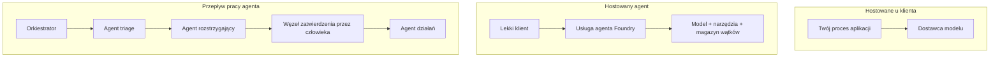
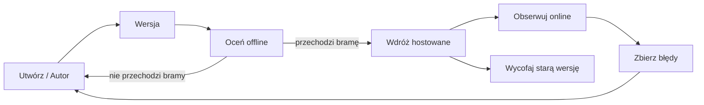
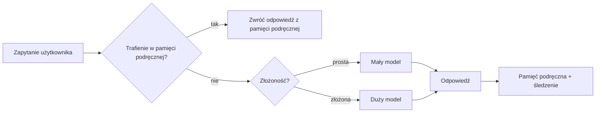
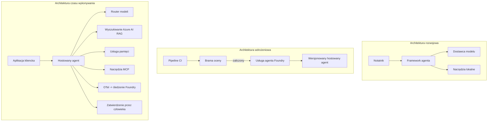

# Wdrażanie skalowalnych agentów za pomocą Microsoft Foundry


Do tego momentu kursu budowałeś agentów, którzy działają na Twoim laptopie, w notatniku, sterowani przez `az login` i garść zmiennych środowiskowych. To dokładnie właściwy sposób nauki. Nie jest to właściwy sposób uruchamiania agenta, na którym polega tysiące klientów o 3 nad ranem.

Ta lekcja dotyczy luki między "działa na mojej maszynie" a "działa niezawodnie i ekonomicznie w produkcji." Zamykamy tę lukę, korzystając z **Microsoft Foundry** i **Microsoft Foundry Agent Service**, budując prawdziwego agenta wsparcia klienta, który ma narzędzia, wyszukiwanie, pamięć, ocenianie i monitorowanie.

## Wprowadzenie

Ta lekcja obejmie:

- Różnicę między **agentem prototypowym** a **wszczepionym agentem** oraz dlaczego przejście dotyczy głównie wszystkiego *dookoła* modelu.
- **Wzorce wdrożeniowe** dla agentów: na kliencie, na serwisie (Hosted Agents) oraz orkiestracja przepływu pracy.
- **Cykl życia agenta** w Microsoft Foundry — tworzenie, wersjonowanie, wdrażanie, ocena, obserwacja, wycofywanie.
- **Strategie skalowania**: routowanie modelu, cache'owanie, współbieżność i bezstanowy design.
- **Obserwowalność** z OpenTelemetry i śledzeniem Foundry.
- **Optymalizacja kosztów** przez wybór modelu, routowanie i bramki ewaluacyjne.
- **Uwagi korporacyjne**: zarządzanie, zatwierdzenie przez człowieka oraz bezpieczne uruchamianie serwerów MCP w produkcji.

## Cele nauki

Po ukończeniu tej lekcji będziesz potrafił:

- Wybrać właściwy wzorzec wdrożenia dla określonego obciążenia agenta.
- Wdrożyć agenta do Microsoft Foundry Agent Service, tak aby był wersjonowany, zarządzany i obserwowalny.
- Instrumentować agenta pod kątem śledzenia i powiązać potok ewaluacyjny, który działa przed każdym wydaniem.
- Zastosować routowanie modeli i cache'owanie, aby utrzymać niskie opóźnienia i kontrolować koszty przy skalowaniu.
- Dodać bramkę zatwierdzenia przez człowieka dla działań wysokiego ryzyka i zintegrować serwer MCP w sposób bezpieczny dla produkcji.

## Wymagania wstępne

Ta lekcja zakłada ukończenie wcześniejszych lekcji i komfort w:

- Budowaniu agentów z użyciem [Microsoft Agent Framework](../14-microsoft-agent-framework/README.md) (Lekcja 14).
- [Użycie narzędzi](../04-tool-use/README.md) (Lekcja 4) oraz [Agentic RAG](../05-agentic-rag/README.md) (Lekcja 5).
- [Pamięci agenta](../13-agent-memory/README.md) (Lekcja 13) oraz [Agentic Protocols / MCP](../11-agentic-protocols/README.md) (Lekcja 11).
- [Obserwowalności i ewaluacji](../10-ai-agents-production/README.md) (Lekcja 10) — ta lekcja jest na niej bezpośrednio oparta.

Będziesz też potrzebować:

- Subskrypcji **Azure** i projektu **Microsoft Foundry** z co najmniej jednym wdrożonym modelem czatu.
- **Azure CLI** z uwierzytelnieniem (`az login`).
- Pythona 3.12+ oraz pakietów z repozytorium [`requirements.txt`](../../../requirements.txt).

## Od prototypu do produkcji: co się naprawdę zmienia

Agent prototypowy i produkcyjny mają tę samą podstawową pętlę — rozumowanie, wywoływanie narzędzi, reakcja. Zmienia się wszystko wokół tej pętli. Model stanowi może 20% agenta produkcyjnego; pozostałe 80% to operacyjny szkielet.

| Obszar | Prototyp | Produkcja |
| --- | --- | --- |
| **Hostowanie** | Działa w Twoim notatniku | Działa jako hostingowana usługa, wersjonowana i wdrażana stopniowo |
| **Tożsamość** | Twój token `az login` | Zarządzana tożsamość z przypisanym RBAC |
| **Stan** | W pamięci, utracony po restarcie | Zewnętrzny (sklep wątków, usługa pamięci) |
| **Awaria** | Widzisz ślad błędu | Ponowienia prób, zapasowe opcje, dead-letter, alerty |
| **Koszt** | "To kilka centów" | Śledzony na żądanie, kierowany, cache'owany, budżetowany |
| **Jakość** | Oceniasz na oko | Oceniany automatycznie przed każdym wydaniem |
| **Zaufanie** | Zatwierdzasz każdą akcję | Polityka + człowiek w pętli dla działań ryzykownych |

Zapamiętaj tę tabelę. Każda sekcja poniżej odpowiada jednemu z tych wierszy.

## Wzorce wdrożeniowe agentów

Istnieją trzy wzorce, które będziesz używać, często łącznie.

### 1. Agenci hostowani po stronie klienta

Obiekt agenta żyje w *Twoim* procesie aplikacji. Twój kod wywołuje dostawcę modelu bezpośrednio; pętla rozumowania działa w Twojej usłudze. To jest to, co robiły wszystkie poprzednie lekcje.

- **Używaj, gdy** potrzebujesz pełnej kontroli nad pętlą, niestandardowego middleware lub osadzasz agenta w istniejącym backendzie.
- **Koszt**: sam zarządzasz skalowalnością, stanem i odpornością.

### 2. Agenci hostowani (Foundry Agent Service)

Agent jest *zarejestrowany jako zasób* w Microsoft Foundry. Foundry hostuje pętlę rozumowania, przechowuje wątki, wymusza bezpieczeństwo treści i RBAC, oraz udostępnia agenta w portalu Foundry. Twoja aplikacja staje się cienkim klientem, który tworzy wątki i odczytuje odpowiedzi.

- **Używaj, gdy** chcesz trwałości, wbudowanej obserwowalności, zarządzania i mniejszego obszaru operacyjnego.
- **Koszt**: mniej kontroli niskiego poziomu w zamian za zarządzane środowisko uruchomieniowe.

### 3. Przepływy pracy agentów

Wielu agentów (i narzędzi) jest łączonych w graf z wyraźnym przepływem sterowania — kroki sekwencyjne, rozgałęzienia, węzły zatwierdzenia przez człowieka oraz trwałe punkty kontrolne, które mogą zatrzymać i wznowić pracę. To jest funkcjonalność **Workflows** Microsoft Agent Framework zastosowana na skalę wdrożenia.

- **Używaj, gdy** pojedyncze zadanie rozciąga się na kilku wyspecjalizowanych agentów lub wymaga kroku zatwierdzenia w trakcie.
- **Koszt**: więcej elementów do zarządzania; wymaga obserwowalności na poziomie orkiestracji.



## Cykl życia agenta w Microsoft Foundry

Wdrożenie agenta to nie pojedynczy `push`. To pętla, bardzo podobna do cyklu wydawania oprogramowania, bo dokładnie tym jest.



Kluczowa idea, przeniesiona z [Lekcji 10](../10-ai-agents-production/README.md): **ocena offline jest bramką, a nie dodatkiem.** Nowa wersja agenta nie zostanie wypuszczona, jeśli nie spełni progów oceny. Obserwowalność online zwraca błędy z rzeczywistego świata do twojego zestawu testów offline. To jest cała pętla.

## Strategie skalowania

Skalowanie agenta różni się od skalowania bezstanowego API sieciowego, ponieważ każde żądanie może wywołać wiele kosztownych wywołań modeli i narzędzi. Cztery techniki niosą większość obciążenia.

**Obsługa bezstanowa żądań.** Nie przechowuj stanu per-użytkownik w pamięci procesu. Przechowuj wątki rozmów w magazynie wątków Foundry lub usłudze pamięci, aby dowolna instancja mogła obsłużyć każde żądanie. To pozwala skalować poziomo — dodajesz instancje, brak sesji przypisanych do maszyny.

**Routowanie modeli.** Nie każde żądanie wymaga twojego najwydajniejszego (i najdroższego) modelu. Kieruj proste żądania — klasyfikację intencji, krótkie faktyczne odpowiedzi — do małego, szybkiego modelu, a duży model zostaw dla prawdziwego rozumowania. Foundry's **Model Router** zrobi to za ciebie, albo możesz zaimplementować lekki klasyfikator samodzielnie. W labie zbudujesz wersję DIY.

**Cache'owanie odpowiedzi.** Wiele zapytań o wsparcie jest prawie duplikatami ("jak zresetować hasło?"). Cache'uj odpowiedzi na typowe pytania i serwuj je bez wywoływania modelu. Nawet umiarkowany wskaźnik trafień w cache znacząco obniża koszty i opóźnienia.

**Współbieżność i backpressure.** Dostawcy modeli mają limity szybkości. Ogranicz współbieżność, stosuj ponowienia z eksponencjalnym opóźnieniem i reaguj łagodnie na błędy (odpowiedź w kolejce "pracujemy nad tym" jest lepsza niż błąd 500).



## Obserwowalność w produkcji

Nie możesz zarządzać tym, czego nie widzisz. Jak omówiono w Lekcji 10, Microsoft Agent Framework natywnie emituje ślady **OpenTelemetry** — każde wywołanie modelu, uruchomienie narzędzia i krok orkiestracji staje się zakresem (span). W produkcji eksportujesz te zakresy do Microsoft Foundry (lub dowolnego backendu kompatybilnego z OTel), aby:

- Śledzić jedną reklamację klienta end-to-end przez wszystkie wywołania modeli i narzędzi.
- Obserwować opóźnienia p50/p95 i koszty na żądanie w czasie.
- Alarmować o szczytach błędów i anomaliach kosztów zanim zauważą to użytkownicy (lub Twój dział finansowy).

```python
from agent_framework.observability import get_tracer

tracer = get_tracer()

with tracer.start_as_current_span("support_request") as span:
    span.set_attribute("customer.tier", "enterprise")
    span.set_attribute("routed.model", "gpt-5-nano")
    # wykonanie agenta jest automatycznie śledzone wewnątrz tego zakresu
```

Atrybuty takie jak `customer.tier` i `routed.model` zamieniają ścianę śladów w pytania, na które można odpowiedzieć ("czy klienci korporacyjni są zbyt często kierowani do małego modelu?").

## Optymalizacja kosztów

Koszty w agentach produkcyjnych dominują tokeny. Trzy dźwignie, według wpływu:

1. **Dobierz odpowiedni model.** Mały model, który przejdzie twoją bramkę oceny, jest prawie zawsze tańszy niż duży, który również ją przechodzi. Użyj oceny, aby *udowodnić*, że mały model jest wystarczająco dobry, zamiast domyślnie wybierać największy model ze względów ostrożności.
2. **Routuj według złożoności.** Jak wyżej — płać cenę dużego modelu tylko za żądania, które potrzebują rozumowania dużym modelem.
3. **Cache'uj agresywnie.** Najtańszym wywołaniem modelu jest to, którego nigdy nie wykonasz.

Bramki oceny i kontrola kosztów to ta sama dyscyplina widziana z dwóch stron: ocena mówi o *minimalnej jakości*, a routowanie i cache'owanie utrzymują koszty jak najbliżej tego minimum.

## Uwagi korporacyjne dotyczące wdrożenia

**Zarządzanie.** Hosted Agents dziedziczą RBAC, bezpieczeństwo treści i logowanie audytu Foundry. Przyznaj każdemu agentowi zarządzaną tożsamość z minimalnymi uprawnieniami — dostęp tylko do odczytu bazy wiedzy, dostęp do API obsługi zgłoszeń z ograniczeniami, nic więcej.

**Człowiek w pętli.** Niektóre akcje są zbyt poważne, żeby automatyzować je w całości — wydawanie zwrotu pieniędzy, usuwanie konta, eskalacja do zespołu prawnego. Microsoft Agent Framework obsługuje narzędzia wymagające zatwierdzenia: agent proponuje akcję, wykonanie jest wstrzymane, człowiek zatwierdza lub odrzuca, a przepływ pracy jest wznawiany. Widziałeś prymityw w [Lekcji 6](../06-building-trustworthy-agents/README.md); tutaj go wdrażasz.

**MCP w produkcji.** [MCP](../11-agentic-protocols/README.md) pozwala agentowi korzystać z zewnętrznych narzędzi przez standardowy interfejs. W produkcji traktuj każdy serwer MCP jako nienawierzony obszar: przypnij wersję serwera, uruchamiaj go z ograniczoną tożsamością, weryfikuj jego wyniki, nigdy nie ujawniaj mu sekretów. Serwer MCP to zależność, a zależności są łatane, audytowane i ograniczane pod względem częstotliwości.



Te trzy diagramy — rozwój, wdrożenie, uruchomienie — to ten sam agent w trzech etapach swojego życia. Laboratorium, które następuje, przeprowadzi cię przez jego budowę.

## Laboratorium praktyczne: agent wsparcia klienta gotowy do produkcji

Otwórz [`code_samples/16-python-agent-framework.ipynb`](./code_samples/16-python-agent-framework.ipynb) i przepracuj go od początku do końca. Złożysz **agenta wsparcia klienta Contoso** z wszystkimi elementami produkcyjnymi:

1. **Wywoływanie narzędzi** — sprawdzanie statusu zamówienia i otwieranie zgłoszeń wsparcia.
2. **RAG** — odpowiadanie na pytania dotyczące polityki z bazy wiedzy (Azure AI Search, z pamięciową rezerwą na wypadek braku zasobu Search).
3. **Pamięć** — zapamiętywanie klienta poprzez kolejne wymiany rozmowy.
4. **Routowanie modeli** — klasyfikator złożoności kieruje każde żądanie do małego lub dużego modelu.
5. **Cache'owanie odpowiedzi** — powtarzające się pytania są obsługiwane z cache.
6. **Zatwierdzenie przez człowieka** — refundacje powyżej progu czekają na podpis człowieka.
7. **Potok ewaluacyjny** — mały zestaw testów offline ocenia agenta i działa jako bramka wydania.
8. **Obserwowalność** — śledzenie OpenTelemetry wokół każdego żądania.

### Przegląd

Notatnik jest zorganizowany tak, że każda kwestia produkcyjna to samodzielna, uruchamialna sekcja. Sercem jest obsługiwacz żądań łączący routowanie i cache'owanie:

```python
async def handle_support_request(query: str, customer_id: str) -> str:
    # 1. Serwuj z pamięci podręcznej, gdy to możliwe.
    cached = response_cache.get(normalize(query))
    if cached:
        return cached

    # 2. Kieruj według złożoności, aby kontrolować koszty.
    model = "gpt-5-nano" if is_simple(query) else "gpt-5-mini"

    # 3. Uruchom agenta wewnątrz zakresu śledzenia dla obserwowalności.
    with tracer.start_as_current_span("support_request") as span:
        span.set_attribute("routed.model", model)
        span.set_attribute("customer.id", customer_id)
        response = await support_agent.run(query, model=model)

    # 4. Buforuj i zwracaj.
    response_cache.set(normalize(query), response.text)
    return response.text
```

Bramką oceny, która pilnuje wydania, jest:

```python
async def evaluation_gate(agent, test_cases, threshold: float = 0.8) -> bool:
    passed = 0
    for case in test_cases:
        result = await agent.run(case["input"])
        if score_response(result.text, case["expected"]) >= 0.8:
            passed += 1
    pass_rate = passed / len(test_cases)
    print(f"Evaluation pass rate: {pass_rate:.0%} (gate: {threshold:.0%})")
    return pass_rate >= threshold  # wdrażaj tylko jeśli brama zostanie zaliczona
```

Przeczytaj każde zdanie — notatnik celowo trzyma prymitywy małe, by nic nie było ukryte za wywołaniem frameworka.

## Walidacja wdrożonego agenta testami dymnymi

Powyższa bramka oceny działa *offline* na obiekcie agenta. Po wdrożeniu jako Hosted Agent potrzebujesz jeszcze jednej, jeszcze tańszej kontroli: **czy wdrożony punkt końcowy faktycznie odpowiada?**

"Pomyślne" wdrożenie dowodzi tylko, że płaszczyzna kontroli zaakceptowała definicję — nie dowodzi, że agent odpowiada. Brakująca zależność, błędne routowanie modelu lub wygasłe połączenie mogą pozostawić zielone wdrożenie, które nic nie zwraca. **Test dymny** wykrywa to w kilka sekund, przy każdym wdrożeniu, bez kosztów pełnej ewaluacji.

To repozytorium zawiera gotowy potok testów dymnych oparty na GitHub Action [AI Smoke Test](https://github.com/marketplace/actions/ai-smoke-test):

- **Katalog** — [`tests/lesson-16-smoke-tests.json`](../../../tests/lesson-16-smoke-tests.json) zawiera prompt i asercje dla agenta wsparcia Contoso (podstawowe odpowiedzi polityki, wyszukiwanie zamówienia, pozostawanie w temacie i ciągłość wieloetapowej konwersacji). Katalogi dla agentów z innych lekcji znajdują się obok — patrz [`tests/README.md`](../tests/README.md).
- **Przepływ pracy** — [`.github/workflows/smoke-test.yml`](../../../.github/workflows/smoke-test.yml) loguje się za pomocą Azure OIDC i wysyła każdą prośbę HTTP POST na endpoint Odpowiedzi agenta, przerywając zadanie przy wykryciu błędu testu.

```yaml
- name: Smoke-test hosted agent
  uses: JFolberth/ai-smoketest@v1
  with:
    project_endpoint: ${{ inputs.project_endpoint }}
    agent_name: ContosoSupportAgent
    tests_file: tests/lesson-16-smoke-tests.json
```


Uruchom to z zakładki **Actions** po wdrożeniu agenta, podając punkt końcowy projektu Foundry i nazwę agenta. Tożsamość federowana musi mieć rolę **Azure AI User** w zakresie projektu Foundry. Warstwy można sobie wyobrazić jako piramidę: testy dymne (dostępny i reagujący?) uruchamiane są przy każdym wdrożeniu, ocena offline (czy jest wystarczająco dobra, by wdrażać?) uruchamiana jest przed promocją, a ocena online (jak działa w środowisku produkcyjnym?) działa ciągle.

## Sprawdzenie wiedzy

Przetestuj swoją wiedzę zanim przejdziesz do zadania.

**1. Około jaką część produkcyjnego agenta stanowi „model”, a co stanowi reszta?**

<details>
<summary>Odpowiedź</summary>

Model stanowi mniejszość systemu — często mówi się o około 20%. Resztę stanowi szkielet operacyjny: hosting i wersjonowanie, tożsamość i RBAC, zewnętrzny stan, obsługa błędów, śledzenie kosztów, ewaluacja i kontrola z udziałem człowieka. Przejście do produkcji to głównie budowanie wszystkiego *wokół* pętli rozumowania.
</details>

**2. Kiedy wybrałbyś Hosted Agent zamiast klienta-hosted agenta?**

<details>
<summary>Odpowiedź</summary>

Kiedy chcesz zarządzalne środowisko uruchomieniowe z wbudowaną trwałością (wątki, które przetrwają i mogą być wznowione), obserwowalnością, bezpieczeństwem treści i RBAC, i jesteś gotów poświęcić trochę niskopoziomowej kontroli nad pętlą rozumowania na rzecz mniejszej powierzchni operacyjnej. Klient-hosted jest lepszy, gdy potrzebujesz pełnej kontroli nad pętlą lub gdy osadzasz agenta w istniejącym backendzie.
</details>

**3. Dlaczego skalowalny agent musi być bezstanowy w pamięci własnego procesu?**

<details>
<summary>Odpowiedź</summary>

Aby dowolna instancja mogła obsłużyć dowolne żądanie, co umożliwia skalowanie poziome bez potrzeby sesji przywiązanych do jednego serwera. Stan rozmowy użytkownika jest zewnętrzny, przechowywany w magazynie wątków lub usłudze pamięci. Jeśli stan byłby w pamięci procesu, straciłbyś go przy restarcie i nie mógłbyś swobodnie rozkładać obciążenia.
</details>

**4. Jaki problem rozwiązuje trasowanie modeli i jak się ono ma do oceny?**

<details>
<summary>Odpowiedź</summary>

Trasowanie wysyła proste żądania do małego, taniego, szybkiego modelu i rezerwuje duży model do rzeczywistego rozumowania, kontrolując zarówno opóźnienie, jak i koszt. Ma to związek z oceną, ponieważ ocena *dowodzi*, że mały model jest wystarczająco dobry dla danej klasy żądań — trasowanie bez oceny to zgadywanie.
</details>

**5. Co to jest „brama oceny” i gdzie znajduje się w cyklu życia?**

<details>
<summary>Odpowiedź</summary>

Brama oceny uruchamia zestaw testowy offline na nowej wersji agenta i blokuje wdrożenie, jeśli wskaźnik zaliczeń nie przekroczy progu. Znajduje się między „wersją” a „wdrożeniem” w cyklu życia, czyniąc jakość warunkiem wstępnym wydania, a nie czymś, co sprawdza się po publikacji.
</details>

**6. Dlaczego serwer MCP powinien być traktowany jako nieniezaufana granica w produkcji?**

<details>
<summary>Odpowiedź</summary>

Ponieważ jest zewnętrznym zależnym serwisem, do którego odwołuje się twój agent. Powinieneś przypiąć jego wersję, uruchomić z tożsamością o ograniczonych uprawnieniach, weryfikować jego wyniki, ograniczać jego dostęp i nigdy nie ujawniać mu sekretów — tak jak postępujesz z każdą zależnością zewnętrzną. Jego wyniki wpływają na rozumowanie twojego agenta, więc nieweryfikowane zaufanie to zagrożenie bezpieczeństwa.
</details>

**7. Która pojedyncza zmiana zwykle ma największy wpływ na koszt produkcyjnego agenta i dlaczego?**

<details>
<summary>Odpowiedź</summary>

Dobre dobranie rozmiaru modelu — użycie najmniejszego modelu, który nadal przechodzi twoją bramę oceny. Koszty są zdominowane przez tokeny, a mniejszy model spełniający wymogi jakości jest niemal zawsze tańszy niż większy. Cache i trasowanie dodatkowo obniżają koszty, ale wybór odpowiedniego modelu bazowego ma największy efekt pierwszego rzędu.
</details>

**8. Jaką rolę odgrywają atrybuty powierzchniowe, takie jak `customer.tier` i `routed.model`, w obserwowalności?**

<details>
<summary>Odpowiedź</summary>

Przekształcają surowe ślady w konkretne pytania biznesowe. Bez atrybutów masz ścianę zdarzeń; z nimi możesz zapytać „czy klienci korporacyjni są zbyt często kierowani do małego modelu?” lub „który model obsługuje nasze najwolniejsze żądania?” Atrybuty umożliwiają analizę telemetrii według wymiarów istotnych dla działania twojej organizacji.
</details>

## Zadanie

Weź agenta wsparcia klienta z laboratorium i wzmocnij go pod konkretny scenariusz: **agent wsparcia bilingowego dla firmy SaaS.**

Twoje zgłoszenie powinno:

1. **Zamienić narzędzia** na te związane z bilingiem: `get_subscription_status`, `get_invoice`, oraz `issue_credit` (kredyty powyżej 50$ wymagają zatwierdzenia przez człowieka).
2. **Dodać trzy dokumenty RAG** dotyczące polityki zwrotów firmy, cyklu bilingowego oraz polityki anulacji.
3. **Rozszerzyć zestaw ewaluacyjny** do co najmniej ośmiu przypadków, w tym co najmniej dwóch, które *powinny* uruchomić ścieżkę zatwierdzenia przez człowieka, i potwierdzić, że brama oceny poprawnie akceptuje lub odrzuca.
4. **Dodać jeden raport kosztów**: po przetworzeniu dziesięciu mieszanych zapytań przez agenta, wydrukuj, ile trafień poszło do małego modelu, ile do dużego, a ile obsłużono z cache.

Napisz krótki akapit (w komórce markdown) wyjaśniający, którą regułę trasowania modeli wybrałeś i jak zweryfikowałbyś ją na prawdziwym ruchu. Nie ma jednej poprawnej odpowiedzi — oceniana będzie spójność powiązania kwestii produkcyjnych.

## Podsumowanie

W tej lekcji przeniosłeś agenta od prototypu do produkcji z użyciem Microsoft Foundry:

- Skok do produkcji to przede wszystkim **szkielet operacyjny** wokół modelu — hosting, tożsamość, stan, obsługa błędów, koszty, jakość i zaufanie.
- Poznałeś trzy **wzorce wdrożeń** — klient-hosted, Hosted Agents oraz Agent Workflows — i kiedy każdy ma zastosowanie.
- Przeszedłeś przez **cykl życia agenta**, gdzie offline **ocena działa jako brama wydania**, a obserwowalność online odsyła błędy z powrotem do zestawu testowego.
- Zastosowałeś **strategie skalowania** — bezstanowość, trasowanie modeli, cache i ograniczoną współbieżność — i powiązałeś je z **optymalizacją kosztów**.
- Podłączyłeś **kontrole korporacyjne**: RBAC, zatwierdzanie z udziałem człowieka oraz integrację MCP bezpieczną dla produkcji.
- Zbudowałeś **agenta wsparcia klienta gotowego do produkcji**, który łączy wszystkie te kwestie w działającym kodzie.

Następna lekcja podąża w przeciwnym kierunku: zamiast skalować agentów w chmurze, przeniesiesz ich *na dół* na pojedynczą maszynę deweloperską i będziesz uruchamiać je całkowicie lokalnie.

## Dodatkowe zasoby

- <a href="https://learn.microsoft.com/azure/ai-foundry/what-is-azure-ai-foundry" target="_blank">Dokumentacja Microsoft Foundry</a>
- <a href="https://learn.microsoft.com/azure/ai-foundry/agents/overview" target="_blank">Przegląd usługi Microsoft Foundry Agent</a>
- <a href="https://learn.microsoft.com/en-us/agent-framework/overview/?wt.mc_id=youtube_26688_organicsocial_reactor&pivots=programming-language-python" target="_blank">Microsoft Agent Framework</a>
- <a href="https://learn.microsoft.com/azure/ai-foundry/concepts/model-router" target="_blank">Model Router w Microsoft Foundry</a>
- <a href="https://learn.microsoft.com/azure/search/search-what-is-azure-search" target="_blank">Azure AI Search</a>
- <a href="https://opentelemetry.io/" target="_blank">OpenTelemetry</a>
- <a href="https://github.com/marketplace/actions/ai-smoke-test" target="_blank">AI Smoke Test GitHub Action</a>
- <a href="https://modelcontextprotocol.io/" target="_blank">Model Context Protocol (MCP)</a>

## Poprzednia lekcja

[Budowanie agentów do obsługi komputera (CUA)](../15-browser-use/README.md)

## Następna lekcja

[Tworzenie lokalnych agentów AI](../17-creating-local-ai-agents/README.md)

---

<!-- CO-OP TRANSLATOR DISCLAIMER START -->
**Zastrzeżenie**:
Niniejszy dokument został przetłumaczony za pomocą usługi tłumaczenia AI [Co-op Translator](https://github.com/Azure/co-op-translator). Choć dążymy do dokładności, prosimy pamiętać, że automatyczne tłumaczenia mogą zawierać błędy lub niedokładności. Oryginalny dokument w jego języku źródłowym należy uznawać za autorytatywne źródło. W przypadku informacji krytycznych zalecane jest skorzystanie z profesjonalnego tłumaczenia wykonanego przez człowieka. Nie ponosimy odpowiedzialności za jakiekolwiek nieporozumienia lub błędne interpretacje wynikające z użycia tego tłumaczenia.
<!-- CO-OP TRANSLATOR DISCLAIMER END -->