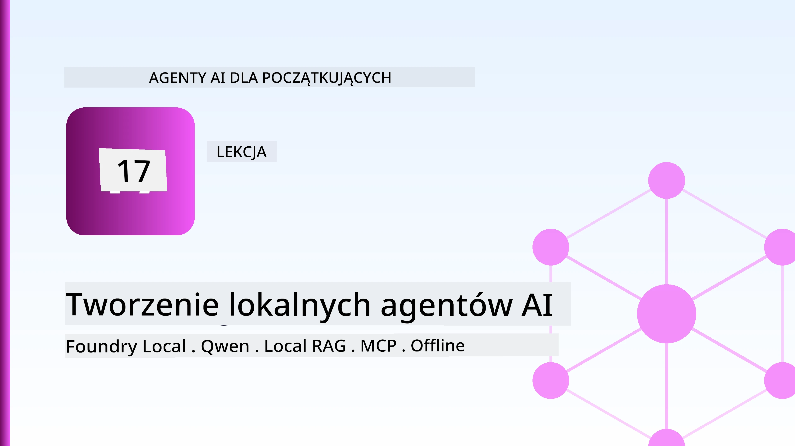
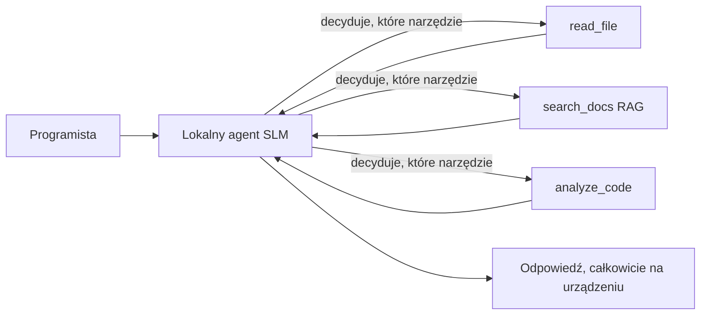
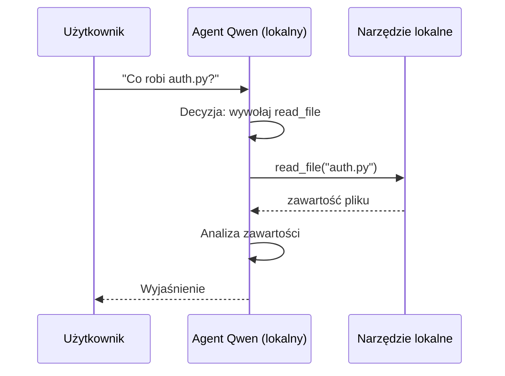
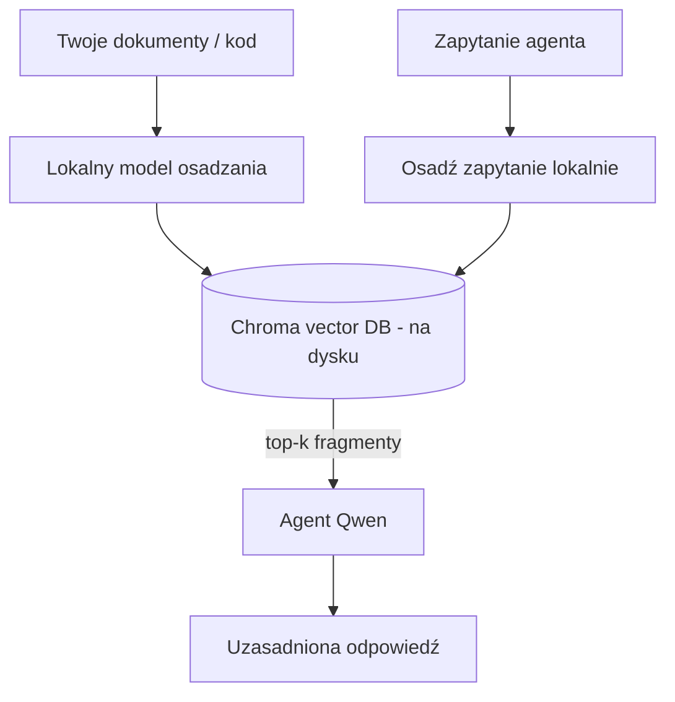
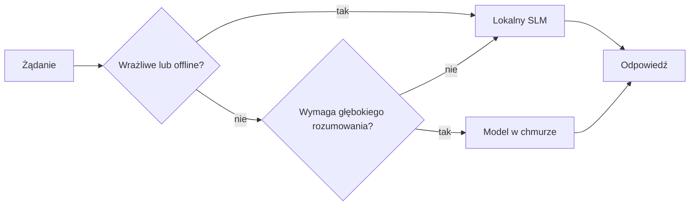

# Tworzenie lokalnych agentów AI za pomocą Microsoft Foundry Local i Qwen



Poprzednia lekcja skalowała agentów *w górę* do chmury. Ta sprowadza ich *w dół* na pojedynczą maszynę. Na końcu będziesz mieć działającego asystenta inżynieryjnego, który rozumuje, wywołuje narzędzia, czyta twoje pliki i wyszukuje w dokumentacji — **bez żadnego wywołania inferencji w chmurze.**

Dlaczego miałbyś tego chcieć? Trzy powody, które stale pojawiają się w rzeczywistej pracy inżynierskiej:

- **Prywatność.** Kod i dokumenty nigdy nie opuszczają maszyny. Żaden prompt, żaden fragment, żadne dane klienta nie przechodzą przez granicę sieci.
- **Koszty.** Lokalna inferencja nie ma rozliczenia za tokeny. Możesz iterować cały dzień za cenę prądu.
- **Tryb offline.** W samolocie, w bezpiecznym obiekcie lub podczas awarii agent nadal działa.

Warunek jest taki, że wymieniasz model cloudowy frontier na **Mały Model Językowy (SLM)** działający na swoim CPU, GPU lub NPU. Ta lekcja pokazuje, jak budować agentów, którzy są *dobrzy* w tym ograniczeniu, zamiast udawać, że ono nie istnieje.

## Wprowadzenie

Ta lekcja obejmuje:

- **Małe Modele Językowe (SLM)** — czym są, gdzie błyszczą, a gdzie nie.
- **Microsoft Foundry Local** — środowisko uruchomieniowe pobierające i serwujące modele lokalnie przez **API kompatybilne z OpenAI**.
- **Modele Qwen do wywoływania funkcji** — SLM, które niezawodnie generują wywołania narzędzi, co pozwala na lokalnych *agentów* (nie tylko lokalny czat).
- **Lokalne narzędzia, lokalne RAG i lokalny MCP** — które dają agentowi możliwości bez chmury.
- **Wzorce hybrydowe** — kiedy zostawać lokalnie, a kiedy sięgać po chmurę.

## Cele nauki

Po ukończeniu tej lekcji będziesz potrafił:

- Wyjaśnić kompromisy SLM i wybrać odpowiednie zastosowania lokalnych agentów.
- Lokalnie serwować model Qwen z Foundry Local i łączyć się z nim przez endpoint kompatybilny z OpenAI.
- Zbudować agenta wywołującego narzędzia, który działa w całości na twoim stanowisku pracy.
- Dodać lokalne RAG nad własnymi dokumentami za pomocą lokalnej bazy wektorowej (Chroma).
- Połączyć agenta z lokalnym serwerem MCP i rozważać hybrydowe projekty lokalne/chmurowe.

## Wymagania wstępne

Ta lekcja zakłada, że ukończyłeś wcześniejsze lekcje i czujesz się swobodnie z:

- [Użycie narzędzi](../04-tool-use/README.md) (Lekcja 4) i [Agentic RAG](../05-agentic-rag/README.md) (Lekcja 5).
- [Protokoły Agentic / MCP](../11-agentic-protocols/README.md) (Lekcja 11).
- [Microsoft Agent Framework](../14-microsoft-agent-framework/README.md) (Lekcja 14).

Będziesz także potrzebował:

- Stanowisko pracy dla dewelopera. **Realistyczne minimum to 8 GB RAM**; 16 GB+ jest komfortowe. GPU lub NPU pomaga, ale nie jest wymagane.
- Zainstalowany **Microsoft Foundry Local** (patrz sekcja konfiguracji poniżej).
- Python 3.12+ i pakiety z repozytorium [`requirements.txt`](../../../requirements.txt), plus `foundry-local-sdk`, `openai` i `chromadb` na tę lekcję.

## Małe Modele Językowe: odpowiednie narzędzie do pracy lokalnej

Model frontier w chmurze ma setki miliardów parametrów i centrum danych za sobą. SLM ma kilka miliardów parametrów i musi zmieścić się w RAM twojego laptopa. Ta różnica wyznacza jasne oczekiwania.

**SLM dobrze radzą sobie z:**

- Zadaniami ustrukturyzowanymi i ograniczonymi — klasyfikacja, ekstrakcja, streszczenie znanego dokumentu.
- **Wywoływaniem narzędzi** — decyzją, którą funkcję wywołać i z jakimi argumentami.
- Szybką, tania i prywatną iteracją na własnych danych.

**SLM słabiej radzą sobie z:**

- Otwartym, wieloetapowym rozumowaniem na dużym kontekście.
- Szeroką wiedzą o świecie (widzieli mniej i szybciej zapominają).

Zwycięska strategia dla lokalnych agentów to więc: **pozwól SLM orkiestruje, a narzędziom wykonuj ciężką pracę.** Model nie musi *znać* twojego kodu — musi wiedzieć, kiedy wywołać `read_file` i `search_docs`. To trafia bezpośrednio w mocne strony SLM.



## Microsoft Foundry Local

**Microsoft Foundry Local** to lekkie środowisko uruchomieniowe, które pobiera, zarządza i serwuje modele całkowicie na twojej maszynie. Jego najważniejszą cechą dla nas jest, że udostępnia **endpoint HTTP kompatybilny z OpenAI** — co oznacza, że SDK OpenAI i klient OpenAI z Microsoft Agent Framework działają z nim, zmieniając tylko `base_url`. Wszystko, czego nauczyłeś się o budowaniu agentów, przenosi się bezpośrednio; tylko endpoint zmienia lokalizację z chmury na `localhost`.

Foundry Local automatycznie dobiera najlepszą wersję modelu dla twojego sprzętu — wersję CPU, CUDA/GPU lub NPU — więc nie musisz optymalizować ręcznie dla każdej maszyny.

### Konfiguracja

Zainstaluj Foundry Local (patrz [dokumentację](https://learn.microsoft.com/azure/ai-foundry/foundry-local/) dla twojego systemu operacyjnego), a następnie potwierdź, że działa:

```bash
# Zainstaluj (na przykład; postępuj zgodnie z dokumentacją dla swojej platformy)
winget install Microsoft.FoundryLocal      # Windows
# brew install microsoft/foundrylocal/foundrylocal   # macOS

# Pobierz i uruchom model Qwen, a następnie uruchom usługę lokalną
foundry model run qwen2.5-7b-instruct
foundry service status
```

Gdy usługa działa, masz lokalny endpoint kompatybilny z OpenAI (zwykle `http://localhost:PORT/v1`). Notatnik używa `foundry-local-sdk`, by automatycznie odnaleźć endpoint, więc nie musisz twardo kodować portu.

## Wywoływanie funkcji w Qwen: dlaczego to ważne

Agent jest agentem tylko wtedy, gdy potrafi wywoływać narzędzia. Wiele SLM potrafi prowadzić rozmowę, ale generuje zawodną, źle sformatowaną składnię wywołania narzędzia. Modele **Qwen** są trenowane do wywoływania funkcji i konsekwentnie generują dobrze uformowane struktury wywołań narzędzi — co dokładnie pozwala przekształcić lokalny model czatu w lokalnego *agenta*.

Przebieg to standardowa pętla wywoływania narzędzi, którą już znasz, z tą różnicą, że działa lokalnie:



## Lokalny RAG

Wyszukiwanie w dokumentacji jest miejscem, gdzie lokalne agenty mają sens. Zamiast ufać, że SLM zapamiętał dokumentację twojego frameworka, umieszczasz te dokumenty w **lokalnej bazie wektorowej** i pozwalasz agentowi pobierać odpowiednie fragmenty na żądanie.

Używamy **Chroma**, osadzonego sklepu wektorowego, który działa w procesie i nie wymaga serwera do zarządzania. Cały pipeline jest w całości lokalny: lokalny model osadzania → lokalne wektory → lokalne wyszukiwanie → lokalny SLM.



To ten sam wzorzec Agentic RAG z Lekcji 5 — jedyna zmiana to że każdy komponent działa na twojej maszynie.

## Lokalne serwery MCP

[MCP](../11-agentic-protocols/README.md) to transport, a nie usługa w chmurze. Serwer MCP może działać jako lokalny proces na `stdio`, udostępniając narzędzia twojemu agentowi przez protokół standardowy. Pozwala to na ponowne użycie rosnącego ekosystemu serwerów MCP — dostęp do systemu plików, operacje git, zapytania do bazy danych — całkowicie offline.

Postawa bezpieczeństwa jest inna niż w chmurze, ale nie nieobecna: lokalny serwer MCP nadal działa z uprawnieniami twojego użytkownika, więc zakres, do czego ma dostęp (katalog projektu, a nie cały folder domowy) i traktuj jego wyjścia jako wejścia do walidacji.

## Wzorce hybrydowe chmury i lokalnych rozwiązań

Lokalność w pierwszej kolejności nie oznacza lokalności wyłącznie. Dojrzałe systemy kierują ruch według poufności i trudności:

| Sytuacja | Gdzie działa |
| --- | --- |
| Poufny kod / dane lub tryb offline | **Lokalny SLM** |
| Proste, ograniczone zadanie | **Lokalny SLM** (tani, szybki) |
| Trudne, wieloetapowe rozumowanie na danych niepoufnych | **Model w chmurze** |
| Wszystko podczas awarii | **Lokalny SLM** (łagodna degradacja) |

To odzwierciedla koncepcję **trasowania modeli** z Lekcji 16 — z tym, że jednym z "modeli" jest teraz twoja własna maszyna. Solidny projekt przechodzi na lokalne przetwarzanie, gdy chmura jest niedostępna, więc agent degraduje się jakościowo, zamiast całkowicie zawieść.



## Laboratorium praktyczne: lokalny asystent inżynieryjny

Otwórz [`code_samples/17-local-agent-foundry-local.ipynb`](./code_samples/17-local-agent-foundry-local.ipynb) i przejdź przez ten plik krok po kroku. Zbudujesz **lokalnego asystenta inżynieryjnego**, który działa w całości na twoim stanowisku i potrafi:

1. **Wywoływać narzędzia** — przez wywoływanie funkcji Qwen za pośrednictwem Foundry Local.
2. **Wykonywać lokalne operacje na plikach** — listować i czytać pliki w katalogu projektu.
3. **Analizować kod** — raportować podstawowe metryki o pliku źródłowym.
4. **Przeszukiwać dokumentację** — lokalne RAG nad katalogiem dokumentów z Chromą.
5. **Używać MCP** — połączyć się z lokalnym serwerem MCP (z łagodnym pominięciem, jeśli żaden nie jest skonfigurowany).

W żadnym momencie nie używa chmurowej inferencji.

### Przewodnik krok po kroku

Asystent łączy się z Foundry Local przez endpoint kompatybilny z OpenAI, więc kod agenta wygląda niemal identycznie jak w lekcjach o chmurze — zmienia się tylko klient:

```python
from foundry_local import FoundryLocalManager
from openai import OpenAI

# Foundry Local wykrywa/pobiera model i udostępnia nam lokalny punkt końcowy.
manager = FoundryLocalManager(\"qwen2.5-7b-instruct\")
client = OpenAI(base_url=manager.endpoint, api_key=manager.api_key)  # api_key to lokalny symbol zastępczy
```

Narzędzia to zwyczajne funkcje Pythonowe ograniczone do katalogu projektu:

```python
def read_file(path: str) -> str:
    \"\"\"Read a file, but only inside the sandboxed project directory.\"\"\"
    full = (PROJECT_ROOT / path).resolve()
    if PROJECT_ROOT not in full.parents and full != PROJECT_ROOT:
        return \"Access denied: path is outside the project directory.\"
    return full.read_text(encoding=\"utf-8\")
```

Zwróć uwagę na kontrolę sandbox — nawet lokalnie narzędzie czytające dowolne ścieżki to ryzyko. Notatnik ogranicza każde narzędzie do jednego katalogu głównego projektu.

## Sprawdzenie wiedzy

Przetestuj swoją wiedzę przed przejściem do zadania.

**1. Podaj dwa konkretne powody, by uruchomić agenta lokalnie zamiast w chmurze.**

<details>
<summary>Odpowiedź</summary>

Dowolne dwa z: **prywatność** (kod i dane nigdy nie opuszczają maszyny), **koszty** (brak rozliczenia inferencji za tokeny), i **możliwość pracy offline** (działa bez sieci — w samolocie, w bezpiecznym obiekcie lub podczas awarii). Powody regulacyjne/zgodności, zakazujące wysyłania danych poza urządzenie, są częstym motywatorem powodu prywatności.
</details>

**2. Jakie jest zalecane podzielenie pracy między SLM a jego narzędziami w lokalnym agencie i dlaczego?**

<details>
<summary>Odpowiedź</summary>

Pozwól SLM **orkiestrować** (decydować, które narzędzie wywołać i z jakimi argumentami) i pozwól **narzędziom wykonać ciężką pracę** (czytanie plików, pobieranie dokumentów, obliczenia). SLM są silne w ograniczonych decyzjach, jak wybór narzędzia, ale słabsze w szerokiej wiedzy i długim rozumowaniu wieloetapowym, więc poleganie na narzędziach wykorzystuje ich mocne strony.
</details>

**3. Co sprawia, że można ponownie użyć kodu agentów chmurowych z Foundry Local?**

<details>
<summary>Odpowiedź</summary>

Foundry Local udostępnia **endpoint HTTP kompatybilny z OpenAI**. SDK OpenAI i klient OpenAI z Agent Framework działają z nim, zmieniając jedynie `base_url` (i używając lokalnego placeholdera klucza API). Reszta kodu agenta pozostaje bez zmian.
</details>

**4. Dlaczego używamy konkretnie modelu Qwen do wywoływania funkcji, a nie dowolnego SLM?**

<details>
<summary>Odpowiedź</summary>

Bo agent musi produkować niezawodne, dobrze uformowane **wywołania narzędzi**. Wiele SLM potrafi czatować, ale generuje błędne lub niespójne struktury wywołań narzędzi. Modele Qwen są trenowane do wywoływania funkcji i konsekwentnie generują wywołania narzędzi, co zamienia lokalny model czatu w działającego lokalnego agenta.
</details>

**5. W pipeline lokalnego RAG, które komponenty działają na maszynie?**

<details>
<summary>Odpowiedź</summary>

Wszystkie: model osadzania, baza wektorowa (Chroma, na dysku), krok wyszukiwania i SLM. Dokumenty są osadzane lokalnie, przechowywane lokalnie, pobierane lokalnie i rozumowane przez lokalny model — żaden komponent nie korzysta z chmury.
</details>

**6. Lokalny serwer MCP działa na twojej maszynie. Czy to automatycznie oznacza bezpieczeństwo? Jakie środki ostrożności należy zachować?**

<details>
<summary>Odpowiedź</summary>

Nie. Lokalny serwer MCP działa z uprawnieniami twojego użytkownika, więc może uzyskać dostęp do wszystkiego, do czego ty masz dostęp. Ogranicz go do tego, czego potrzebuje (np. do katalogu jednego projektu, a nie całego folderu domowego) i traktuj jego wyjścia jako wejścia, które trzeba zweryfikować przed działaniem.
</details>

**7. Opisz sensowne reguły hybrydowego trasowania zawierające model lokalny.**

<details>
<summary>Odpowiedź</summary>

Kieruj zapytania poufne lub offline do lokalnego SLM; kieruj proste, ograniczone zadania do lokalnego SLM ze względu na szybkość i niski koszt; kieruj trudne, wieloetapowe rozumowanie na danych niepoufnych do modelu w chmurze; i wracaj do lokalnego SLM, jeśli chmura jest niedostępna, aby agent łagodnie degradował się, zamiast zawieść. To jest trasowanie modeli (Lekcja 16) z lokalną maszyną jako jednym z modeli.
</details>

**8. Jaka jest realistyczna minimalna ilość RAM potrzebna do uruchomienia lokalnego agenta z tej lekcji i co daje więcej RAM?**

<details>
<summary>Odpowiedź</summary>

Około **8 GB** to realistyczne minimum; 16 GB+ to komfort. Więcej RAM pozwala uruchamiać większe, bardziej zdolne modele oraz utrzymywać więcej kontekstu w pamięci. GPU lub NPU przyspiesza inferencję, ale nie jest wymagane — Foundry Local wybiera wersję CPU, gdy nie ma akceleratora.
</details>

## Zadanie

Rozszerz lokalnego asystenta inżynieryjnego do **lokalnego recenzenta dokumentacji** dla małego wybranego przez siebie projektu (możesz użyć jednego z katalogów z lekcjami w tym repozytorium).

Twoje zgłoszenie powinno:

1. **Zindeksować prawdziwy katalog dokumentacji/kodu** w Chromie (co najmniej pięć plików).
2. **Dodać narzędzie `find_todos`**, które przeszukuje projekt pod kątem komentarzy `TODO`/`FIXME` i zwraca je z plikiem i numerem linii — zachowując tę samą kontrolę sandbox, co `read_file`.

3. **Zadaj agentowi trzy pytania**, które zmuszą go do połączenia narzędzi: jedno czysto RAG, jedno wymagające przeczytania konkretnego pliku oraz jedno, które wymaga znalezienia TODO.
4. **Zmierz to**: zmierz czas każdej z trzech odpowiedzi i zanotuj je w komórce markdown. Skomentuj, czy opóźnienie jest akceptowalne dla twojego zamierzonego przepływu pracy.

Następnie napisz krótki akapit o tym, **co przeniósłbyś do chmury, a co zostawił na lokalnej maszynie** dla tego recenzenta i dlaczego. Oceniamy, czy komponenty lokalne są poprawnie połączone oraz czy twoje hybrydowe rozumowanie jest poprawne — a nie jakość modelu.

## Podsumowanie

W tej lekcji zbudowałeś agenta działającego całkowicie na twoim własnym komputerze:

- **SLM-y** wymieniają szerokość na prywatność, koszty i działanie offline — i błyszczą, gdy **orkiestrują narzędzia**, zamiast samodzielnie posiadać całą wiedzę.
- **Foundry Local** udostępnia modele na urządzeniu, za **zgodnym z OpenAI endpointem**, dzięki czemu kod twojego agenta chmurowego przenosi się jednym wierszem zmiany.
- **Qwen modele wywołujące funkcje** umożliwiają niezawodne lokalne wywoływanie narzędzi — a więc lokalnych *agentów*.
- **Lokalne RAG** (Chroma) oraz **lokalny MCP** dają agentowi możliwości bez opuszczania maszyny.
- **Hybrydowe wzorce** pozwalają kierować według poufności i trudności, z lokalnym jako elegancką alternatywą.

To kończy łuk wdrożenia: Lekcja 16 skalowała agentów na Microsoft Foundry, a ta lekcja zeskalowała ich na pojedynczą stację roboczą. Następna lekcja zajmie się utrzymaniem bezpieczeństwa wdrożonych agentów.

## Dodatkowe zasoby

- <a href="https://learn.microsoft.com/azure/ai-foundry/foundry-local/" target="_blank">Dokumentacja Microsoft Foundry Local</a>
- <a href="https://learn.microsoft.com/azure/ai-foundry/what-is-azure-ai-foundry" target="_blank">Dokumentacja Microsoft Foundry</a>
- <a href="https://learn.microsoft.com/en-us/agent-framework/overview/?wt.mc_id=youtube_26688_organicsocial_reactor&pivots=programming-language-python" target="_blank">Microsoft Agent Framework</a>
- <a href="https://qwen.readthedocs.io/en/latest/framework/function_call.html" target="_blank">Dokumentacja wywoływania funkcji Qwen</a>
- <a href="https://modelcontextprotocol.io/" target="_blank">Model Context Protocol (MCP)</a>
- <a href="https://docs.trychroma.com/" target="_blank">Baza wektorowa Chroma</a>

## Poprzednia lekcja

[Deploying Scalable Agents](../16-deploying-scalable-agents/README.md)

## Następna lekcja

[Securing AI Agents](../18-securing-ai-agents/README.md)

---

<!-- CO-OP TRANSLATOR DISCLAIMER START -->
**Zastrzeżenie**:
Niniejszy dokument został przetłumaczony za pomocą usługi tłumaczenia AI [Co-op Translator](https://github.com/Azure/co-op-translator). Choć dążymy do dokładności, prosimy pamiętać, że automatyczne tłumaczenia mogą zawierać błędy lub niedokładności. Oryginalny dokument w jego języku źródłowym należy uznawać za autorytatywne źródło. W przypadku informacji krytycznych zalecane jest skorzystanie z profesjonalnego tłumaczenia wykonanego przez człowieka. Nie ponosimy odpowiedzialności za jakiekolwiek nieporozumienia lub błędne interpretacje wynikające z użycia tego tłumaczenia.
<!-- CO-OP TRANSLATOR DISCLAIMER END -->