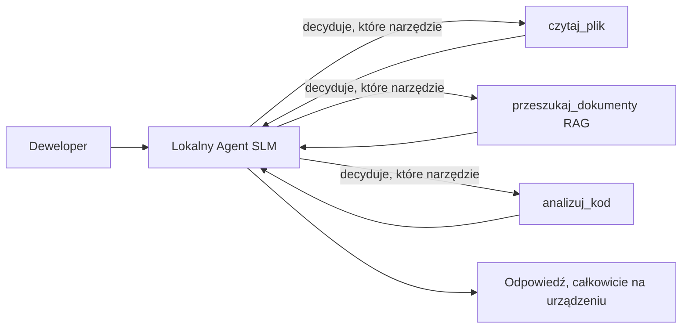
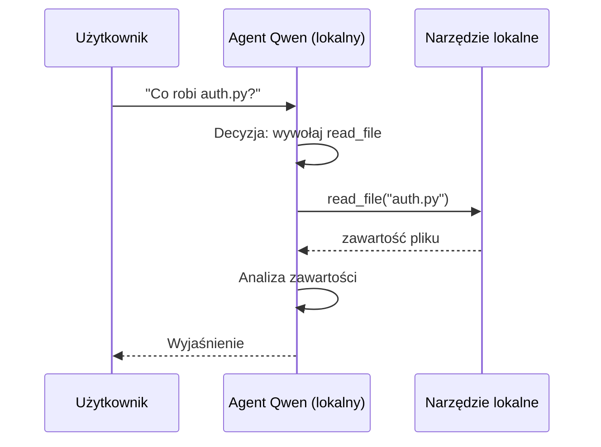
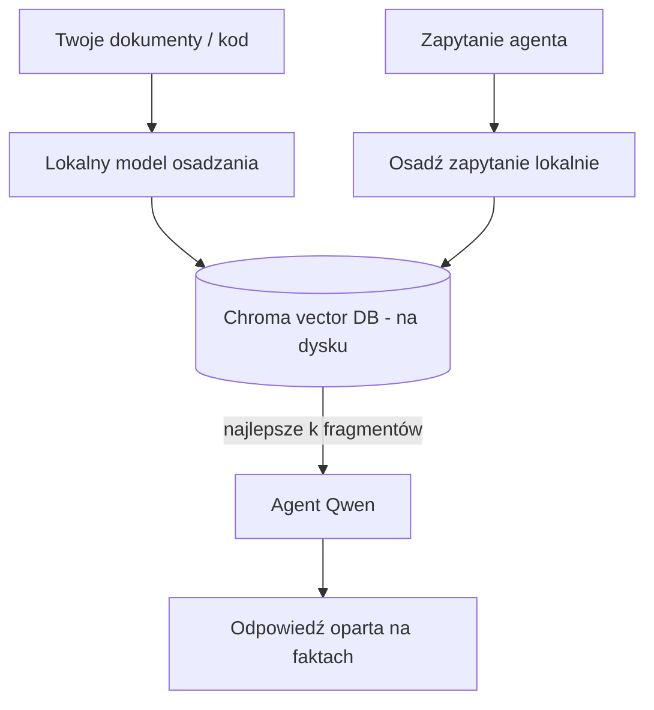
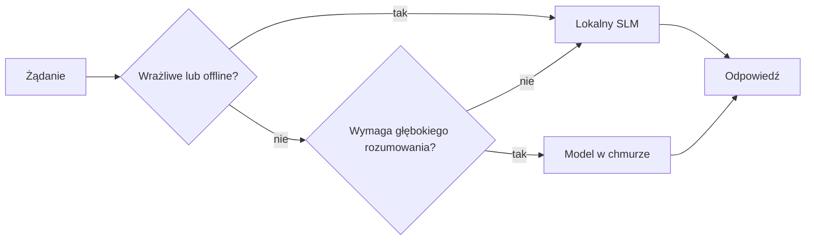

# Tworzenie lokalnych agentów AI z użyciem Microsoft Foundry Local i Qwen


Poprzednia lekcja przeniosła agentów *do chmury*. Ta zabiera ich *na jeden komputer*. Pod koniec będziesz mieć działającego asystenta inżynieryjnego, który rozumuje, wywołuje narzędzia, czyta twoje pliki i wyszukuje w dokumentacji — **bez ani jednego wywołania inferencji w chmurze.**

Dlaczego miałbyś tego chcieć? Trzy powody, które często pojawiają się podczas realnej pracy inżynieryjnej:

- **Prywatność.** Kod i dokumenty nigdy nie opuszczają maszyny. Żaden prompt, fragment kodu czy dane klienta nie przekraczają granicy sieci.
- **Koszt.** Lokalna inferencja nie generuje faktury za tokeny. Możesz iterować cały dzień za cenę prądu.
- **Tryb offline.** Na samolocie, w zabezpieczonym obiekcie lub podczas awarii agent nadal działa.

Minusem jest to, że zamieniasz model chmurowy klasy frontowej na **Mały Model Językowy (SLM)** działający na Twoim CPU, GPU lub NPU. Ta lekcja skupia się na budowaniu agentów, którzy są *dobrzy* w tych ograniczeniach, zamiast udawać, że ich nie ma.

## Wprowadzenie

Ta lekcja obejmie:

- **Małe Modele Językowe (SLM)** — czym są, gdzie błyszczą, a gdzie zawodzą.
- **Microsoft Foundry Local** — środowisko uruchomieniowe, które pobiera i udostępnia modele lokalnie przez **API zgodne z OpenAI**.
- **Modele wywołujące funkcje Qwen** — SLM-y, które wiarygodnie generują wywołania narzędzi, co czyni lokalne *agentów* możliwymi (nie tylko chat).
- **Lokalne narzędzia, lokalny RAG i lokalne MCP** — dając agentowi możliwości bez chmury.
- **Wzorce hybrydowe** — kiedy trzymać się lokalnego, a kiedy sięgnąć po chmurę.

## Cele nauki

Po ukończeniu tej lekcji będziesz potrafił:

- Wyjaśnić kompromisy SLM i wybrać odpowiednie przypadki użycia lokalnych agentów.
- Uruchomić model Qwen lokalnie za pomocą Foundry Local i połączyć się z nim przez endpoint kompatybilny z OpenAI.
- Zbudować agenta wywołującego narzędzia działającego całkowicie na Twojej stacji roboczej.
- Dodać lokalny RAG na swoich dokumentach przy użyciu lokalnej bazy wektorowej (Chroma).
- Połączyć agenta z lokalnym serwerem MCP i rozważać hybrydowe projekty lokalno/chmurowe.

## Wymagania wstępne

Ta lekcja zakłada, że ukończyłeś wcześniejsze lekcje i czujesz się swobodnie z:

- [Używaniem narzędzi](../04-tool-use/README.md) (Lekcja 4) i [Agentic RAG](../05-agentic-rag/README.md) (Lekcja 5).
- [Protokołami Agentic / MCP](../11-agentic-protocols/README.md) (Lekcja 11).
- [Microsoft Agent Framework](../14-microsoft-agent-framework/README.md) (Lekcja 14).

Potrzebujesz też:

- Stacji roboczej dla dewelopera. **8 GB RAM to realistyczne minimum**; 16 GB+ zapewnia komfort. GPU lub NPU pomagają, ale nie są wymagane.
- Zainstalowanego **Microsoft Foundry Local** (zobacz sekcję instalacji poniżej).
- Pythona 3.12+ i pakietów z repozytorium [`requirements.txt`](../../../requirements.txt), oraz `foundry-local-sdk`, `openai` i `chromadb` do tej lekcji.

## Małe Modele Językowe: odpowiednie narzędzie do pracy lokalnej

Model chmurowy klasy frontowej ma setki miliardów parametrów i za nim stoi centrum danych. SLM ma kilka miliardów parametrów i musi zmieścić się w pamięci RAM laptopa. Ta różnica ustawia jasne oczekiwania.

**SLMy dobrze radzą sobie z:**

- Zadaniami strukturalnymi i ograniczonymi — klasyfikacja, ekstrakcja, streszczenie znanego dokumentu.
- **Wywoływaniem narzędzi** — decydowaniem, którą funkcję wywołać i z jakimi argumentami.
- Szybką, tanią, prywatną iteracją na własnych danych.

**SLMy gorzej radzą sobie z:**

- Otwartymi, wieloetapowymi rozumowaniami na dużym kontekście.
- Szeroką wiedzą o świecie (wiedziały mniej i szybciej zapominają).

Zwycięska strategia dla lokalnych agentów to: **niech SLM orkiestruje, a narzędzia niech wykonują ciężką pracę.** Model nie musi *znać* Twojej bazy kodu — musi wiedzieć, kiedy wywołać `read_file` i `search_docs`. To trafia dokładnie w mocne strony SLM.



## Microsoft Foundry Local

**Microsoft Foundry Local** to lekkie środowisko uruchomieniowe, które pobiera, zarządza i udostępnia modele całkowicie na Twoim komputerze. Najważniejszą funkcją dla nas jest udostępnianie **HTTP endpointa kompatybilnego z OpenAI** — co oznacza, że SDK OpenAI oraz klient OpenAI w Microsoft Agent Framework działają z nim tylko przez zmianę `base_url`. Wszystko, czego się nauczyłeś o budowaniu agentów, przenosi się bezpośrednio; zmienia się tylko endpoint z chmury na `localhost`.

Foundry Local automatycznie wybiera najlepszą wersję modelu dla Twojego sprzętu — wersję na CPU, CUDA/GPU lub NPU — więc nie musisz ręcznie optymalizować dla każdej maszyny.

### Instalacja

Zainstaluj Foundry Local (zobacz [dokumentację](https://learn.microsoft.com/azure/ai-foundry/foundry-local/) dla twojego systemu operacyjnego), następnie potwierdź, że działa:

```bash
# Instalacja (przykład; postępuj zgodnie z dokumentacją dla swojej platformy)
winget install Microsoft.FoundryLocal      # Windows
# brew install microsoft/foundrylocal/foundrylocal   # macOS

# Pobierz i uruchom model Qwen, a następnie rozpocznij lokalną usługę
foundry model run qwen2.5-7b-instruct
foundry service status
```

Po uruchomieniu serwisu masz lokalny endpoint kompatybilny z OpenAI (zwykle `http://localhost:PORT/v1`). Notatnik używa `foundry-local-sdk` do automatycznego wykrywania endpointa, więc nie musisz ręcznie wpisywać portu.

## Wywoływanie funkcji Qwen: dlaczego to ważne

Agent jest agentem tylko wtedy, gdy może wywoływać narzędzia. Wiele SLM-ów potrafi prowadzić chat, ale wytwarza niewiarygodne, źle sformułowane wywołania narzędzi. Modele **Qwen** są trenowane do wywoływania funkcji i konsekwentnie emitują poprawne struktury wywołań narzędzi — to właśnie zamienia lokalny model chatowy w lokalnego *agenta*.

Przepływ to standardowa pętla wywoływania narzędzi, którą już znasz, tylko działa lokalnie:



## Lokalny RAG

Wyszukiwanie w dokumentacji to miejsce, gdzie lokalni agenci uzasadniają swoją obecność. Zamiast liczyć, że SLM zapamiętał dokumentację twojego frameworka, wkładasz te dokumenty do **lokalnej bazy wektorowej** i pozwalasz agentowi pobierać odpowiednie fragmenty na żądanie.

Używamy **Chroma**, osadzonego magazynu wektorów działającego w procesie, bez potrzeby serwera do zarządzania. Cały pipeline jest lokalny: lokalny model osadzający → lokalne wektory → lokalne wyszukiwanie → lokalny SLM.



To ten sam wzorzec Agentic RAG z Lekcji 5 — jedyna zmiana jest taka, że każdy komponent działa na Twoim komputerze.

## Lokalne serwery MCP

[MCP](../11-agentic-protocols/README.md) to transport, nie usługa chmurowa. Serwer MCP może działać jako lokalny proces na `stdio`, udostępniając narzędzia agentowi przez standardowy protokół. Pozwala to na ponowne użycie rozwijającego się ekosystemu serwerów MCP — dostęp do systemu plików, operacje git, zapytania do bazy danych — całkowicie offline.

Pozycja bezpieczeństwa różni się od chmury, ale nie jest jej brakiem: lokalny serwer MCP działa z uprawnieniami Twojego użytkownika, więc ogranicz co może dotykać (katalog projektu, nie cały katalog domowy) i traktuj jego wyjścia jako dane do weryfikacji.

## Hybrydowe wzorce chmura-i-lokalnie

Lokalność pierwsza nie oznacza tylko lokalności. Dojrzałe systemy kierują ruch wg wrażliwości i trudności:

| Sytuacja | Gdzie działa |
| --- | --- |
| Wrażliwy kod/dane lub tryb offline | **Lokalny SLM** |
| Proste, ograniczone zadanie | **Lokalny SLM** (tani, szybki) |
| Trudne, wieloetapowe rozumowanie na danych niewrażliwych | **Model chmurowy** |
| Wszystko podczas awarii | **Lokalny SLM** (łagodne obniżenie jakości) |

To odzwierciedla koncepcję **kierowania modelem** z Lekcji 16 — z tą różnicą, że jednym z „modeli” jest teraz Twój własny komputer. Solidny projekt przewiduje fallback do lokalnego, gdy chmura jest niedostępna, więc agent obniża jakość, zamiast całkowicie zawieść.



## Praktyczne ćwiczenie: Lokalny asystent inżynieryjny

Otwórz [`code_samples/17-local-agent-foundry-local.ipynb`](./code_samples/17-local-agent-foundry-local.ipynb) i przejdź przez niego krok po kroku. Zbudujesz **lokalnego asystenta inżynieryjnego** działającego całkowicie na Twojej stacji roboczej, który potrafi:

1. **Wywoływać narzędzia** — przez wywoływanie funkcji Qwen przez Foundry Local.
2. **Wykonywać operacje na plikach lokalnych** — listować i czytać pliki w katalogu projektu.
3. **Analizować kod** — raportować podstawowe metryki pliku źródłowego.
4. **Przeszukiwać dokumentację** — lokalny RAG na folderze dokumentacji z Chromą.
5. **Używać MCP** — łączyć się z lokalnym serwerem MCP (z przyjaznym pominięciem, jeśli nie jest skonfigurowany).

Ani razu nie korzysta z inferencji w chmurze.

### Prześledzenie

Asystent łączy się z Foundry Local przez endpoint kompatybilny z OpenAI, więc kod agenta wygląda niemal identycznie jak w lekcjach chmurowych — zmienia się tylko klient:

```python
from foundry_local import FoundryLocalManager
from openai import OpenAI

# Foundry Local wykrywa/pobiera model i udostępnia nam lokalny punkt końcowy.
manager = FoundryLocalManager(\"qwen2.5-7b-instruct\")
client = OpenAI(base_url=manager.endpoint, api_key=manager.api_key)  # api_key jest lokalnym symbolem zastępczym
```

Narzędzia to zwykłe funkcje Pythona ograniczone do katalogu projektu:

```python
def read_file(path: str) -> str:
    \"\"\"Read a file, but only inside the sandboxed project directory.\"\"\"
    full = (PROJECT_ROOT / path).resolve()
    if PROJECT_ROOT not in full.parents and full != PROJECT_ROOT:
        return \"Access denied: path is outside the project directory.\"
    return full.read_text(encoding=\"utf-8\")
```

Zwróć uwagę na sprawdzenie sandboxa — nawet lokalnie narzędzie czytające dowolne ścieżki stanowi ryzyko. Notatnik utrzymuje każde narzędzie ograniczone do jednego katalogu projektu.

## Sprawdzenie wiedzy

Sprawdź swoje zrozumienie przed przejściem do zadania.

**1. Podaj dwa konkretne powody, by uruchamiać agenta lokalnie, a nie w chmurze.**

<details>
<summary>Odpowiedź</summary>

Dowolne dwa z: **prywatność** (kod i dane nigdy nie opuszczają maszyny), **koszt** (brak opłat za token) i **działanie offline** (działa bez sieci — na samolocie, w bezpiecznym obiekcie lub podczas awarii). Ograniczenia regulacyjne/zgodności, zakazujące wysyłania danych poza urządzenie, to częsty powód dla prywatności.
</details>

**2. Jaki jest zalecany podział pracy między SLM a jego narzędziami w lokalnym agencie i dlaczego?**

<details>
<summary>Odpowiedź</summary>

Niech SLM **orkiestruje** (decyduje, które narzędzie wywołać i z jakimi argumentami), a **narzędzia wykonują ciężką pracę** (czytanie plików, pobieranie dokumentów, obliczanie wyników). SLMy dobrze radzą sobie z ograniczonymi decyzjami jak wybór narzędzi, ale słabiej z szeroką wiedzą i długim rozumowaniem wieloetapowym, więc wsparcie narzędziami to ich mocna strona.
</details>

**3. Co umożliwia ponowne użycie kodu agenta chmurowego z Foundry Local?**

<details>
<summary>Odpowiedź</summary>

Foundry Local udostępnia **endpoint HTTP kompatybilny z OpenAI**. SDK OpenAI i klient OpenAI w Agent Framework działają z nim po zmianie tylko `base_url` (używając lokalnego klucza API zastępczego). Reszta kodu agenta pozostaje bez zmian.
</details>

**4. Dlaczego używamy konkretnego modelu Qwen do wywoływania funkcji, a nie dowolnego SLM?**

<details>
<summary>Odpowiedź</summary>

Bo agent musi wytwarzać wiarygodne, poprawnie sformatowane **wywołania narzędzi**. Wiele SLM potrafi rozmawiać, ale wytwarza źle zbudowane lub niespójne struktury wywołań. Modele Qwen są trenowane do wywoływania funkcji i produkują spójne wywołania narzędzi, co zamienia lokalny model chatowy w działającego lokalnego agenta.
</details>

**5. Które elementy pipeline'u lokalnego RAG działają na komputerze?**

<details>
<summary>Odpowiedź</summary>

Wszystkie: model osadzający, baza wektorowa (Chroma, na dysku), krok wyszukiwania i SLM. Dokumenty są osadzane lokalnie, przechowywane lokalnie, pobierane lokalnie i analizowane przez lokalny model — żadna część nie dotyka chmury.
</details>

**6. Lokalny serwer MCP działa na Twoim komputerze. Czy to automatycznie oznacza, że jest bezpieczny? Jaką ostrożność nadal powinieneś zachować?**

<details>
<summary>Odpowiedź</summary>

Nie. Lokalny serwer MCP działa z uprawnieniami Twojego użytkownika, więc może uzyskać dostęp do wszystkiego, do czego Ty masz dostęp. Ogranicz go do tego, co potrzebuje (np. jednokatalog projektu zamiast całego katalogu domowego) i traktuj jego wyjścia jako dane do weryfikacji przed dalszym wykorzystaniem.
</details>

**7. Opisz sensowną hybrydową regułę kierowania (routing), która uwzględnia model lokalny.**

<details>
<summary>Odpowiedź</summary>

Kieruj wrażliwe lub offline żądania do lokalnego SLM; proste, ograniczone zadania do lokalnego SLM dla szybkości i kosztu; trudne, wieloetapowe rozumowanie na danych niewrażliwych do modelu chmurowego; a gdy chmura jest niedostępna, przełącz się na lokalnego SLM, żeby agent obniżył jakość łagodnie, zamiast zawieść. To jest kierowanie modelem (lekcja 16) z lokalnym komputerem jako jednym z modeli.
</details>

**8. Jaka jest realistyczna minimalna ilość RAM do uruchomienia lokalnego agenta z tej lekcji, a co daje więcej RAM?**

<details>
<summary>Odpowiedź</summary>

Około **8 GB** to realistyczne minimum; 16 GB+ to komfort. Więcej RAM pozwala uruchamiać większe, bardziej zdolne modele i mieć więcej kontekstu w pamięci. GPU lub NPU przyspiesza inferencję, ale nie jest wymagany — Foundry Local wybiera wersję CPU, gdy brak akceleratora.
</details>

## Zadanie

Rozszerz lokalnego asystenta inżynieryjnego do **lokalnego recenzenta dokumentacji** dla małego projektu według własnego wyboru (możesz użyć jednego z folderów lekcji z tego repozytorium).

Twoje zgłoszenie powinno:

1. **Zindeksować prawdziwy folder z dokumentacją/kodem** w Chromie (co najmniej pięć plików).
2. **Dodać narzędzie `find_todos`**, które skanuje projekt pod kątem komentarzy `TODO`/`FIXME` i zwraca je wraz z nazwą pliku i numerem linii — zachowując to samo sprawdzenie sandbox jak `read_file`.

3. **Zadaj agentowi trzy pytania**, które zmuszą go do łączenia narzędzi: jedno czysto RAG, jedno wymagające przeczytania konkretnego pliku oraz jedno wymagające znalezienia TODO.
4. **Zmierz to**: zmierz czas każdej z trzech odpowiedzi i zanotuj go w komórce markdown. Skomentuj, czy opóźnienie jest akceptowalne dla twojego planowanego przepływu pracy.

Następnie napisz krótki akapit o tym, **co przeniósłbyś do chmury, a co pozostawił lokalnie** dla tego recenzenta i dlaczego. Oceniane jest, czy lokalne komponenty są poprawnie połączone i czy twoje hybrydowe rozumowanie jest prawidłowe — a nie jakość modelu.

## Podsumowanie

W tej lekcji zbudowałeś agenta, który działa całkowicie na twoim własnym komputerze:

- **SLMy** wymieniają zakres na prywatność, koszt i działanie offline — i błyszczą, gdy **orkiestrują narzędzia**, a nie niosą całą wiedzę samodzielnie.
- **Foundry Local** obsługuje modele na urządzeniu za pomocą **zakończenia kompatybilnego z OpenAI**, dzięki czemu twój kod agenta chmurowego przenosi się jednym wierszem zmiany.
- **Modele wywołujące funkcje Qwen** umożliwiają niezawodne lokalne wywoływanie narzędzi — a zatem lokalnych *agentów*.
- **Lokalny RAG** (Chroma) i **lokalny MCP** dają agentowi możliwości bez wychodzenia z maszyny.
- **Wzorce hybrydowe** pozwalają kierować według wrażliwości i trudności, z lokalnym rozwiązaniem awaryjnym.

To kończy łuk wdrożeniowy: Lekcja 16 rozszerzyła agentów do Microsoft Foundry, a ta lekcja zmniejszyła ich skalę do pojedynczej stacji roboczej. Następna lekcja dotyczy utrzymania bezpieczeństwa wdrożonych agentów.

## Dodatkowe materiały

- <a href="https://learn.microsoft.com/azure/ai-foundry/foundry-local/" target="_blank">Dokumentacja Microsoft Foundry Local</a>
- <a href="https://learn.microsoft.com/azure/ai-foundry/what-is-azure-ai-foundry" target="_blank">Dokumentacja Microsoft Foundry</a>
- <a href="https://learn.microsoft.com/en-us/agent-framework/overview/?wt.mc_id=youtube_26688_organicsocial_reactor&pivots=programming-language-python" target="_blank">Microsoft Agent Framework</a>
- <a href="https://qwen.readthedocs.io/en/latest/framework/function_call.html" target="_blank">Dokumentacja wywoływania funkcji Qwen</a>
- <a href="https://modelcontextprotocol.io/" target="_blank">Model Context Protocol (MCP)</a>
- <a href="https://docs.trychroma.com/" target="_blank">Baza wektorowa Chroma</a>

## Poprzednia lekcja

[Deploying Scalable Agents](../16-deploying-scalable-agents/README.md)

## Następna lekcja

[Securing AI Agents](../18-securing-ai-agents/README.md)

---

<!-- CO-OP TRANSLATOR DISCLAIMER START -->
**Zastrzeżenie**:
Niniejszy dokument został przetłumaczony za pomocą usługi tłumaczenia AI [Co-op Translator](https://github.com/Azure/co-op-translator). Choć dążymy do dokładności, prosimy pamiętać, że automatyczne tłumaczenia mogą zawierać błędy lub niedokładności. Oryginalny dokument w jego języku źródłowym należy uznawać za autorytatywne źródło. W przypadku informacji krytycznych zalecane jest skorzystanie z profesjonalnego tłumaczenia wykonanego przez człowieka. Nie ponosimy odpowiedzialności za jakiekolwiek nieporozumienia lub błędne interpretacje wynikające z użycia tego tłumaczenia.
<!-- CO-OP TRANSLATOR DISCLAIMER END -->