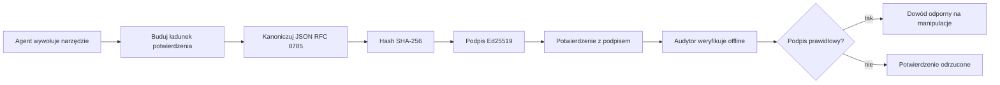
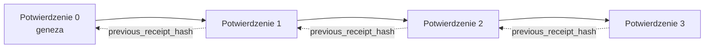

[Obejrzyj wideo z lekcją: Zabezpieczanie agentów AI za pomocą kryptograficznych potwierdzeń](https://youtu.be/PLACEHOLDER_VIDEO_ID)

> _(Wideo z lekcją i miniaturka zostaną dodane przez zespół Microsoft ds. treści po scaleniu, zgodnie ze wzorem lekcji 14 / 15.)_

# Zabezpieczanie agentów AI za pomocą kryptograficznych potwierdzeń

## Wprowadzenie

Ta lekcja obejmie:

- Dlaczego ślady audytu agentów AI są ważne dla zgodności, debugowania i zaufania.
- Czym jest kryptograficzne potwierdzenie i czym różni się od niepodpisanego wpisu w dzienniku.
- Jak wygenerować podpisane potwierdzenie wywołania narzędzia przez agenta w czystym Pythonie.
- Jak zweryfikować potwierdzenie offline i wykryć manipulację.
- Jak łączyć potwierdzenia w łańcuch tak, by usunięcie lub zmiana kolejności jednego z nich przerwała cały łańcuch.
- Co potwierdzenia udowadniają, a czego wyraźnie nie udowadniają.

## Cele nauki

Po ukończeniu tej lekcji będziesz potrafił:

- Zidentyfikować tryby awarii, które uzasadniają kryptograficzne pochodzenie działań agenta.
- Wygenerować potwierdzenie podpisane Ed25519 na kanonicznym obiekcie JSON.
- Zweryfikować potwierdzenie niezależnie, korzystając tylko z klucza publicznego podpisującego.
- Wykryć manipulacje, ponownie uruchamiając weryfikację na zmodyfikowanym potwierdzeniu.
- Zbudować łańcuch potwierdzeń oparty na haszach i wyjaśnić, dlaczego łańcuch ma znaczenie.
- Rozpoznać granicę między tym, co potwierdzenia udowadniają (przypisanie, integralność, kolejność), a tym, czego nie udowadniają (poprawność działania, słuszność polityki).

## Problem: Ślad audytu twojego agenta

Wyobraź sobie, że wdrożyłeś agenta AI dla Contoso Travel. Agent czyta prośby klientów, wywołuje API lotów, aby wyszukać opcje, i rezerwuje miejsca w imieniu klienta. W ostatnim kwartale agent przetworzył 50 000 rezerwacji.

Dziś przychodzi audytor. Zadaje proste pytanie: „Pokaż mi, co zrobił twój agent.”

Przekazujesz pliki dziennika. Audytor je przegląda i zadaje trudniejsze pytanie: „Skąd mam wiedzieć, że te dzienniki nie zostały zmienione?”

To jest problem śladu audytu. Większość obecnych wdrożeń agentów opiera się na:

- **Dziennikach aplikacji**: tworzonych przez samego agenta, możliwych do edycji przez każdego z dostępem do systemu plików.
- **Usługach logowania w chmurze**: odpornych na manipulacje na poziomie platformy, ale tylko jeśli audytor ufa operatorowi platformy.
- **Dziennikach transakcji bazy danych**: dobrze nadających się do zmian w bazie danych, ale nie do dowolnych wywołań narzędzi.

Żaden z tych sposobów nie odpowiada na pytanie audytora bez wymogu zaufania do kogoś (ciebie, twojego dostawcy chmury, producenta bazy danych). W zastosowaniach wewnętrznych takie zaufanie jest często akceptowalne. W regulowanych obciążeniach (finanse, opieka zdrowotna, wszystko podlegające EU AI Act) nie jest.

Kryptograficzne potwierdzenia rozwiązują to, czyniąc każdą akcję agenta niezależnie weryfikowalną. Audytor nie musi ufać tobie. Potrzebuje tylko twojego klucza publicznego i samego potwierdzenia.

## Czym jest kryptograficzne potwierdzenie?

Potwierdzenie to obiekt JSON rejestrujący, co agent zrobił, podpisany cyfrowo.


  
Minimalne potwierdzenie wygląda tak:

```json
{
  "type": "agent.tool_call.v1",
  "agent_id": "contoso-travel-bot",
  "tool_name": "lookup_flights",
  "tool_args_hash": "sha256:a3f9c1...",
  "result_hash": "sha256:7b2e1d...",
  "policy_id": "contoso-travel-policy-v3",
  "timestamp": "2026-04-25T14:30:00Z",
  "sequence": 47,
  "previous_receipt_hash": "sha256:9d4e6a...",
  "signature": {
    "alg": "EdDSA",
    "sig": "c5af83...",
    "public_key": "8f3b2c..."
  }
}
```
  
Trzy właściwości wykonują ważną pracę:

1. **Podpis**. Potwierdzenie jest podpisane przez bramę agenta za pomocą prywatnego klucza Ed25519. Każdy posiadający odpowiadający klucz publiczny może offline zweryfikować podpis. Zmiana jakiegokolwiek pola unieważnia podpis.

2. **Kodowanie kanoniczne**. Przed podpisaniem potwierdzenie jest serializowane z użyciem JSON Canonicalization Scheme (JCS, RFC 8785). Zapewnia to, że dwa różne implementacje generujące ten sam logiczny dokument dadzą identyczną sekwencję bajtów. Bez kanonizacji różne serializatory JSON generowałyby różne podpisy dla tej samej zawartości.

3. **Łańcuchowanie hashy**. Pole `previous_receipt_hash` łączy każde potwierdzenie z poprzednim. Usunięcie lub zmiana kolejności potwierdzenia łamie każde kolejne potwierdzenie. Manipulacje stają się widoczne na poziomie całego łańcucha, nawet jeśli pojedyncze podpisy zostaną obejścié.

Razem te właściwości dają trzy gwarancje:

- **Przypisanie**: ten klucz podpisał tę zawartość.
- **Integralność**: zawartość nie zmieniła się od momentu podpisu.
- **Kolejność**: to potwierdzenie nastąpiło po tamtym w łańcuchu.

## Generowanie potwierdzenia w Pythonie

Nie potrzebujesz specjalnej biblioteki do wygenerowania potwierdzenia. Prymitywy kryptograficzne są powszechnie dostępne, a logika zajmuje kilkadziesiąt linijek Pythona.

Ćwiczenia praktyczne w `code_samples/18-signed-receipts.ipynb` prowadzą przez cały proces. Podsumowanie:

```python
import json
import hashlib
import base64
from nacl import signing
from jcs import canonicalize  # RFC 8785 kanoniczny JSON

def b64url_nopad(data: bytes) -> str:
    return base64.urlsafe_b64encode(data).decode("ascii").rstrip("=")

def sha256_canonical(obj) -> str:
    """SHA-256 of a Python object's JCS-canonical JSON form."""
    return f"sha256:{hashlib.sha256(canonicalize(obj)).hexdigest()}"

# Wygeneruj lub załaduj klucz podpisu (w produkcji przechowuj w sejfie na klucze)
signing_key = signing.SigningKey.generate()
verify_key = signing_key.verify_key

# Zbuduj ładunek paragonu (jeszcze bez podpisu)
tool_args = {"origin": "SYD", "destination": "LAX"}
tool_result = [{"flight": "QF11", "price": 1850, "stops": 0}]

payload = {
    "type": "agent.tool_call.v1",
    "agent_id": "contoso-travel-bot",
    "tool_name": "lookup_flights",
    "tool_args_hash": sha256_canonical(tool_args),
    "result_hash": sha256_canonical(tool_result),
    "policy_id": "contoso-travel-policy-v3",
    "timestamp": "2026-04-25T14:30:00Z",
    "sequence": 0,
    "previous_receipt_hash": None,
}

# Kanonizuj, haszuj, podpisuj.
canonical_bytes = canonicalize(payload)
message_hash = hashlib.sha256(canonical_bytes).digest()
signature_bytes = signing_key.sign(message_hash).signature

# Dołącz strukturalny obiekt podpisu.
receipt = {
    **payload,
    "signature": {
        "alg": "EdDSA",
        "sig": b64url_nopad(signature_bytes),
        "public_key": b64url_nopad(bytes(verify_key)),
    },
}
```
  
To cały proces podpisywania. Ćwiczenia w notatniku przechodzą przez każdy etap.

## Weryfikacja potwierdzenia i wykrywanie manipulacji

Weryfikacja to operacja odwrotna:

```python
import base64
import hashlib
from nacl import signing
from nacl.exceptions import BadSignatureError
from jcs import canonicalize

def b64url_decode(s: str) -> bytes:
    padding = "=" * ((4 - len(s) % 4) % 4)
    return base64.urlsafe_b64decode(s + padding)

def verify_receipt(receipt: dict) -> bool:
    # Podpis jest ustrukturyzowanym obiektem: {"alg", "sig", "public_key"}.
    sig_obj = receipt.get("signature")
    if not sig_obj or sig_obj.get("alg") != "EdDSA":
        return False

    # Odtwórz ładunek, który faktycznie został podpisany (wszystko oprócz podpisu).
    payload = {k: v for k, v in receipt.items() if k != "signature"}

    canonical_bytes = canonicalize(payload)
    message_hash = hashlib.sha256(canonical_bytes).digest()

    try:
        verify_key = signing.VerifyKey(b64url_decode(sig_obj["public_key"]))
        verify_key.verify(message_hash, b64url_decode(sig_obj["sig"]))
        return True
    except BadSignatureError:
        return False
```
  
Ta funkcja przyjmuje potwierdzenie i zwraca `True` jeśli podpis jest ważny, w przeciwnym wypadku `False`. Bez wywołań sieci, bez zależności od zewnętrznych usług, bez konieczności zaufania żadnej stronie trzeciej.

Aby zobaczyć działanie wykrywania manipulacji, notatnik demonstruje:

1. Wygenerowanie poprawnego potwierdzenia i potwierdzenie, że weryfikacja przechodzi.
2. Zmianę jednego bajtu w polu `tool_args_hash`.
3. Ponowne uruchomienie weryfikacji i obserwację jej niepowodzenia.

To praktyczna demonstracja, że potwierdzenia są odporne na manipulacje: każda zmiana, nawet najmniejsza, niszczy ważność podpisu.

## Łączenie potwierdzeń dla agentów wieloetapowych

Pojedyncze podpisane potwierdzenie chroni jedną akcję. Łańcuch potwierdzeń chroni sekwencję.


  
Każde potwierdzenie zapisuje hash potwierdzenia poprzedniego. Aby cicho usunąć potwierdzenie nr 2, atakujący musiałby:

- Zmienić pole `previous_receipt_hash` w potwierdzeniu nr 3 (co unieważnia podpis potwierdzenia nr 3), LUB
- Sfałszować nowy podpis na zmodyfikowanym potwierdzeniu nr 3 (wymaga prywatnego klucza agenta).

Jeśli klucz prywatny jest w sprzętowym sejfie kluczy, a ty publikujesz klucz publiczny z każdym potwierdzeniem, żadna z tych metod nie jest możliwa bez wykrycia.

Notatnik przeprowadza przez:

1. Budowę łańcucha z trzech potwierdzeń.
2. Weryfikację zgodności pola `previous_receipt_hash` z prawdziwym hashem poprzedniego potwierdzenia.
3. Próba manipulacji potwierdzeniem ze środka i obserwacja złamania łańcucha dokładnie w tym punkcie.

Tak tworzysz ślad audytu, który zewnętrzny audytor może zweryfikować bez konieczności zaufania tobie.

## Co potwierdzenia udowadniają (a czego nie)

To najważniejsza sekcja tej lekcji. Potwierdzenia są potężne, ale ich moc jest ograniczona.

**Potwierdzenia udowadniają trzy rzeczy:**

1. **Przypisanie**: konkretny klucz podpisał konkretną ładunek danych.
2. **Integralność**: ładunek nie zmienił się od podpisu.
3. **Kolejność**: to potwierdzenie nastąpiło po tamtym w łańcuchu hashy.

**Potwierdzenia NIE udowadniają:**

1. **Poprawności**: że działanie agenta było właściwe. Potwierdzenie można podpisać dla błędnej odpowiedzi równie łatwo jak dla właściwej.
2. **Zgodności z polityką**: że polityka określona w `policy_id` była faktycznie oceniana lub że pozwoliłaby na tę akcję po kontroli. Potwierdzenie rejestruje, co zostało zadeklarowane, nie to, co zostało wymuszone.
3. **Tożsamości wykraczającej poza klucz**: potwierdzenie mówi „ten klucz podpisał tę zawartość.” Nie mówi „ten człowiek to autoryzował.” Powiązanie klucza z osobą lub organizacją wymaga odrębnej infrastruktury tożsamości (katalogu, rejestru kluczy publicznych itp.).
4. **Prawdziwości wejść**: jeśli agent otrzymuje zmanipulowaną podpowiedź i działa zgodnie z nią, potwierdzenie wiernie rejestruje tę akcję. Potwierdzenia są poniżej walidacji wejścia, nie są jej zamiennikiem.

Ta granica jest istotna z dwóch powodów:

- Mówi, do czego potwierdzenia się nadają: do audytowania zachowania agenta i wykrywania manipulacji, nawet między różnymi organizacjami.
- Wskazuje, jakie dodatkowe warstwy wciąż potrzebujesz: walidację wejścia (Lekcja 6), egzekwowanie polityki (krótko poniżej) oraz infrastrukturę tożsamości (poza zakresem tej lekcji).

Powszechny błąd to zakładanie, że „mamy potwierdzenia” oznacza „jesteśmy zarządzani.” Nie oznacza. Potwierdzenia to fundament. Zarządzanie to system, który budujesz na jego bazie.

## Referencje produkcyjne

Kod Python w tej lekcji jest celowo minimalny, abyś mógł przeczytać każdą linijkę i dokładnie zrozumieć przebieg. W produkcji masz dwie opcje:

1. **Budować bezpośrednio na prymitywach kryptograficznych.** 50 linijek powyżej wystarcza w wielu przypadkach. PyNaCl (Ed25519) i pakiet `jcs` (kanoniczny JSON) to dobrze utrzymywane i audytowane biblioteki.

2. **Używać produkcyjnej biblioteki potwierdzeń.** Kilka projektów open source implementuje ten sam wzorzec z dodatkowymi funkcjami (rotacja kluczy, weryfikacja wsadowa, dystrybucja zestawu JWK, integracja z silnikami polityk):
   - Format potwierdzeń używany w tej lekcji jest zgodny z projektem IETF Internet-Draft (`draft-farley-acta-signed-receipts`) obecnie w procesie standaryzacji.
   - Microsoft Agent Governance Toolkit łączy potwierdzenia z decyzjami polityki opartymi na Cedar; zobacz Tutorial 33 w tym repozytorium dla przykładu end-to-end.
   - Pakiety `protect-mcp` (npm) i `@veritasacta/verify` (npm) oferują implementację Node do podpisywania i offline weryfikacji potwierdzeń, przeznaczoną do owinięcia dowolnego serwera MCP w tamper-evident ścieżkę audytu.

Decyzja między własnym rozwiązaniem a biblioteką przypomina decyzję między własną biblioteką JWT a testowaną biblioteką: oba podejścia są rozsądne; biblioteka oszczędza czas i redukuje powierzchnię audytu; własne rozwiązanie wymusza zrozumienie każdego prymitywu. Ta lekcja uczy podejścia od podstaw, byś miał fundament pod oba wybory.

## Sprawdzenie wiedzy

Sprawdź swoje rozumienie przed przejściem do ćwiczenia praktycznego.

**1. Potwierdzenie jest podpisane prywatnym kluczem Ed25519 agenta. Audytor ma tylko klucz publiczny. Czy audytor może zweryfikować potwierdzenie offline?**

<details>
<summary>Odpowiedź</summary>

Tak. Weryfikacja Ed25519 wymaga tylko klucza publicznego i podpisanego ciągu bajtów. Bez wywołań sieci, bez zależności od usług trzecich. To cecha, która czyni potwierdzenia użytecznymi w środowiskach odizolowanych, wieloorganizacyjnych lub nisko zaufanych przy audycie.
</details>

**2. Atakujący zmienia pole `policy_id` w potwierdzeniu, by twierdzić, że było nim rządzone bardziej liberalne reguły. Podpis był nad oryginalnym obiektem. Co się stanie podczas weryfikacji?**

<details>
<summary>Odpowiedź</summary>

Weryfikacja się nie powiedzie. Podpis został stworzony nad kanoniczną reprezentacją oryginalnego ładunku; zmiana jakiegokolwiek pola zmienia bajty kanoniczne, co zmienia hash SHA-256, więc podpis staje się nieważny. Atakujący musiałby mieć klucz prywatny, aby złożyć nowy ważny podpis, którego nie posiada.
</details>

**3. Dlaczego potwierdzenie zawiera `tool_args_hash` i `result_hash` zamiast surowych argumentów i wyników?**

<details>
<summary>Odpowiedź</summary>

Dwa powody. Po pierwsze, potwierdzenie może być archiwizowane lub przesyłane w środowiskach, gdzie ujawnienie surowych danych (Dane Osobowe, dane biznesowe) jest problematyczne. Hashowanie utrzymuje potwierdzenie małym i prywatnym; audytor weryfikuje, czy hash zgadza się z osobno przechowywaną kopią rzeczywistej zawartości. Po drugie, hashe mają stały rozmiar; potwierdzenie z hashami ma ograniczony rozmiar bez względu na wielkość wejść i wyjść.
</details>

**4. Pole `previous_receipt_hash` łączy potwierdzenia w łańcuch. Jeśli atakujący usunie cicho jedno potwierdzenie z środka łańcucha, co stanie się nieważne?**

<details>
<summary>Odpowiedź</summary>

Każde potwierdzenie po tym usuniętym. Ich pola `previous_receipt_hash` nie będą już pasować do faktycznego łańcucha (bo potwierdzenie, do którego się odnosiły, już nie istnieje, lub łańcuch teraz wskazuje innych poprzedników). Aby ukryć usunięcie, atakujący musiałby ponownie podpisać każde dalsze potwierdzenie, co wymaga prywatnego klucza.
</details>

**5. Potwierdzenie weryfikuje się poprawnie. Czy to dowodzi, że działanie agenta było poprawne, słuszne lub zgodne z polityką?**

<details>
<summary>Odpowiedź</summary>

Nie. Ważne potwierdzenie dowodzi trzech rzeczy: przypisania (ten klucz podpisał tę zawartość), integralności (zawartość się nie zmieniła), i kolejności (to potwierdzenie przyszło po tamtym). Nie dowodzi, że działanie było poprawne, że polityka wskazana w `policy_id` była faktycznie oceniona ani że agent przestrzegał wszystkich reguł. Potwierdzenia czynią zachowanie agenta audytowalnym, ale niekoniecznie poprawnym. To najważniejsza granica lekcji.
</details>

## Ćwiczenie praktyczne

Otwórz `code_samples/18-signed-receipts.ipynb` i wykonaj wszystkie cztery sekcje:

1. **Sekcja 1**: Podpisz swoje pierwsze potwierdzenie i zweryfikuj je.
2. **Sekcja 2**: Manipuluj potwierdzeniem i obserwuj niepowodzenie weryfikacji.
3. **Sekcja 3**: Zbuduj łańcuch z trzech potwierdzeń i zweryfikuj integralność łańcucha.
4. **Sekcja 4**: Zastosuj wzór do agenta stworzonego w Microsoft Agent Framework: opakuj wywołanie narzędzia w podpisywanie potwierdzenia, a następnie zweryfikuj potwierdzenie niezależnie.

**Dodatkowe wyzwanie 1:** rozszerz schemat potwierdzenia o dodatkowe, własne pole (np. identyfikator żądania dla śledzenia), zaktualizuj logikę kanonicznego podpisywania, by je uwzględnić, i potwierdź, że potwierdzenie przechodzi weryfikację. Następnie zmodyfikuj pole po podpisaniu i potwierdź niepowodzenie weryfikacji. To wymusza zrozumienie, jak każdy bajt kodowania kanonicznego wpływa na podpis.
**Wyzwanie dodatkowe 2:** Podwójnie zahashuj SHA-256 dwa swoje pokwitowania razem (łącząc ich kanoniczne bajty w deterministycznej kolejności) i osadź powstały skrót jako nowe pole na trzecim pokwitowaniu przed jego podpisaniem. Zweryfikuj, że wszystkie trzy pokwitowania nadal poprawnie się odtwarzają. Właśnie stworzyłeś dowód włączenia jednokrokowego: każdy posiadający trzecie pokwitowanie może udowodnić, że pierwsze dwa istniały w momencie jego podpisania, bez potrzeby ujawniania ich zawartości. Jest to wzorzec używany przez pokwitowania selektywnego ujawniania na dużą skalę (zobowiązania Merkle'a, RFC 6962).

## Podsumowanie

Kryptograficzne pokwitowania dają agentom AI ślad audytowy, który jest:

- **Niezależnie weryfikowalny**: każda strona posiadająca klucz publiczny może zweryfikować, bez zależności od usług.
- **Odporny na manipulacje**: każda modyfikacja unieważnia podpis.
- **Przenośny**: pokwitowanie to mały plik JSON; można go archiwizować, przesyłać i weryfikować gdziekolwiek.
- **Zgodny ze standardami**: oparty na Ed25519 (RFC 8032), JCS (RFC 8785) i SHA-256, wszystkich powszechnie stosowanych prymitywach.

Nie zastępują one walidacji wejścia, egzekwowania polityk ani infrastruktury tożsamości. Stanowią fundament dla tych warstw. Gdy wdrażasz agentów do środowisk regulowanych, przepływów pracy obejmujących wiele organizacji lub w każdej sytuacji, gdzie przyszły audytor nie może zakładać, że ci ufa, pokwitowania są sposobem na uczciwy ślad audytowy.

Najważniejszy wniosek: pokwitowania udowadniają, kto co powiedział i kiedy. Nie udowadniają, że to, co powiedziano, było prawdziwe lub słuszne. Traktuj tę różnicę poważnie. To różnica między uczciwym systemem pochodzenia a mylącym.

## Lista kontrolna produkcji

Gdy będziesz gotów przejść do wdrożenia agentów podpisujących pokwitowania w środowisku produkcyjnym:

- [ ] **Przenieś klucz podpisujący z laptopa dewelopera.** Używaj Azure Key Vault, AWS KMS lub modułu sprzętowego bezpieczeństwa. Klucz prywatny podpisujący twoje pokwitowania nigdy nie powinien znajdować się w kontroli źródła ani w postaci jawnej na maszynach aplikacji.
- [ ] **Opublikuj publiczny klucz weryfikacyjny.** Audytorzy potrzebują go do weryfikacji offline. Standardowy wzorzec to Zestaw JWK pod dobrze znanym URL (RFC 7517), np. `https://twoja-org.example.com/.well-known/agent-keys.json`.
- [ ] **Kotwicz łańcuch na zewnątrz.** Okresowo zapisuj hash najnowszego nagłówka łańcucha w dzienniku przejrzystości (Sigstore Rekor, RFC 3161 urząd czasu, lub drugi wewnętrzny system), tak aby zewnętrzna strona mogła potwierdzić „ten łańcuch istniał w tym momencie”.
- [ ] **Przechowuj pokwitowania w sposób niezmienny.** Append-only blob storage (Azure Storage z politykami niezmienności, AWS S3 Object Lock) uniemożliwia osobie z dostępem wewnętrznym przepisywanie historii na poziomie przechowywania.
- [ ] **Zdecyduj o retencji.** Wiele reżimów zgodności wymaga wieloletniego przechowywania. Zaplanuj wzrost pokwitowań (każde pokwitowanie to ~500 bajtów; agent wykonujący 10 tys. wywołań dziennie generuje ~1,8 GB rocznie).
- [ ] **Udokumentuj, czego pokwitowania nie obejmują.** Pokwitowania dowodzą przypisania, integralności i kolejności. Twój podręcznik operacyjny powinien wyraźnie wymieniać, jakie dodatkowe kontrole (walidacja wejścia, egzekwowanie polityki, ograniczanie tempa, infrastruktura tożsamości) współistnieją obok pokwitowań w twojej postawie zarządczej.

### Masz więcej pytań o zabezpieczanie agentów AI?

Dołącz do [Microsoft Foundry Discord](https://aka.ms/ai-agents/discord), aby spotkać innych uczących się, uczestniczyć w godzinach konsultacji i uzyskać odpowiedzi na pytania o agentach AI.

## Poza tym materiałem

Lekcja ta obejmuje podpisywanie pojedynczego pokwitowania i łańcuchy hashów. Te same prymitywy składają się na kilka bardziej zaawansowanych wzorców, które możesz napotkać, gdy twoja postawa zarządcza dojrzeje:

- **Selektywne ujawnianie.** Gdy pola pokwitowania są niezależnie zobowiązane (Merkle tree w stylu RFC 6962), możesz ujawnić konkretne pola wybranym audytorom i udowodnić, że pozostałe nie zostały zmienione, bez ich ujawniania. Przydatne, gdy to samo pokwitowanie musi spełniać zarówno szeroki audyt (który chce kompletności), jak i regulacje dotyczące minimalizacji danych, np. RODO (gdzie audytor ma zobaczyć tak mało, jak to konieczne).
- **Unieważnienie pokwitowań.** Jeśli klucz podpisujący zostanie skompromitowany, potrzebujesz sposobu, by oznaczyć wszystkie pokwitowania podpisane tym kluczem jako niegodne zaufania od określonego momentu. Standardowe wzorce: krótkotrwałe klucze podpisujące plus opublikowana lista unieważnień lub dziennik przejrzystości z wpisami unieważnień.
- **Dwustronne / podzielone podpisy pokwitowań.** Niektóre implementacje dzielą podpisany ładunek na dwie części: przedwykonawczą (`authorization_*`) i powykonawczą (`result_*`) z niezależnymi podpisami, przydatne gdy decyzję o autoryzacji i obserwowany wynik podejmują różni aktorzy lub w różnym czasie. Komponuje się to dodatkowo na formacie pokwitowania nauczonym w tej lekcji.
- **Kompozycja ładunku.** Pokwitowanie pieczętuje dowolne bajty, które umieścisz w `result_hash`. Rzeczywiste ładunki często są bogatsze niż pojedynczy wynik wywołania narzędzia: rozumowanie przed decyzją (predykcja modelu, rozpatrywane opcje, dowody i ich kompletność, postawa ryzyka, łańcuch odpowiedzialności, wynik bramki) może mieszkać w ładunku, zapieczętowany pojedynczym pokwitowaniem. Utrzymuje to format pokwitowania minimalistyczny, umożliwiając ewolucję schematów ładunku w domenach.
- **Zgodność między implementacjami.** Kilka niezależnych implementacji tego samego formatu pokwitowania (Python, TypeScript, Rust, Go) weryfikuje się wzajemnie na bazie wspólnych wektorów testowych. Jeśli zbudujesz własną implementację, walidacja na opublikowanych wektorach potwierdza kompatybilność protokołu.
- **Migracja postkwantowa.** Ed25519 jest dziś powszechnie używane, ale nie jest odporne na komputery kwantowe. Format pokwitowania jest elastyczny względem algorytmów: pole `signature.alg` może zawierać `ML-DSA-65` (standard podpisu postkwantowego NIST) gdy potrzebujesz migracji. Zaplanuj okres przejściowy, gdy pokwitowania są podpisywane podwójnie.

## Dodatkowe zasoby

- <a href="https://datatracker.ietf.org/doc/draft-farley-acta-signed-receipts/" target="_blank">IETF Internet-Draft: Signed Decision Receipts for Machine-to-Machine Access Control</a>
- <a href="https://learn.microsoft.com/azure/ai-studio/responsible-use-of-ai-overview" target="_blank">Przegląd odpowiedzialnego AI (Azure AI)</a>
- <a href="https://datatracker.ietf.org/doc/html/rfc8032" target="_blank">RFC 8032: Edwards-Curve Digital Signature Algorithm (EdDSA)</a>
- <a href="https://datatracker.ietf.org/doc/html/rfc8785" target="_blank">RFC 8785: JSON Canonicalization Scheme (JCS)</a>
- <a href="https://datatracker.ietf.org/doc/html/rfc6962" target="_blank">RFC 6962: Certificate Transparency</a> (konstrukcja drzewa Merkle używana przez pokwitowania selektywnego ujawniania)
- <a href="https://github.com/microsoft/agent-governance-toolkit/blob/main/docs/tutorials/33-offline-verifiable-receipts.md" target="_blank">Microsoft Agent Governance Toolkit, Tutorial 33: Offline-Verifiable Decision Receipts</a>
- <a href="https://github.com/ScopeBlind/agent-governance-testvectors" target="_blank">Wektory testowe zgodności między implementacjami</a> dla formatu pokwitowania używanego w tej lekcji (Apache-2.0)
- <a href="https://pynacl.readthedocs.io/" target="_blank">Dokumentacja PyNaCl</a> (Ed25519 w Pythonie)

## Poprzednia lekcja

[Building Computer Use Agents (CUA)](../15-browser-use/README.md)

## Następna lekcja

_(Do ustalenia przez opiekunów programu nauczania)_

---

<!-- CO-OP TRANSLATOR DISCLAIMER START -->
**Zastrzeżenie**:
Niniejszy dokument został przetłumaczony za pomocą usługi tłumaczenia AI [Co-op Translator](https://github.com/Azure/co-op-translator). Choć dążymy do dokładności, prosimy pamiętać, że automatyczne tłumaczenia mogą zawierać błędy lub niedokładności. Oryginalny dokument w jego języku źródłowym należy uznawać za autorytatywne źródło. W przypadku informacji krytycznych zalecane jest skorzystanie z profesjonalnego tłumaczenia wykonanego przez człowieka. Nie ponosimy odpowiedzialności za jakiekolwiek nieporozumienia lub błędne interpretacje wynikające z użycia tego tłumaczenia.
<!-- CO-OP TRANSLATOR DISCLAIMER END -->