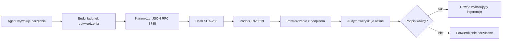
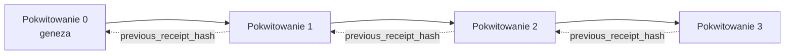

[Obejrzyj wideo z lekcji: Zabezpieczanie agentów AI za pomocą kryptograficznych potwierdzeń](https://youtu.be/PLACEHOLDER_VIDEO_ID)

> _(Wideo z lekcji i miniaturka zostaną dodane przez zespół Microsoft ds. treści po scaleniu, zgodnie ze wzorcem lekcji 14 / 15.)_

# Zabezpieczanie agentów AI za pomocą kryptograficznych potwierdzeń

## Wprowadzenie

W tej lekcji omówimy:

- Dlaczego ścieżki audytu dla agentów AI są ważne dla zgodności, debugowania i zaufania.
- Czym jest kryptograficzne potwierdzenie i jak różni się od niepodpisanej linii dziennika.
- Jak wygenerować podpisane potwierdzenie dla wywołania narzędzia przez agenta w czystym Pythonie.
- Jak zweryfikować potwierdzenie offline i wykryć manipulacje.
- Jak łączyć potwierdzenia w łańcuch, tak aby usunięcie lub zmiana kolejności jednego z nich zerwała łańcuch.
- Co potwierdzenia udowadniają, a czego wyraźnie nie udowadniają.

## Cele nauki

Po ukończeniu tej lekcji będziesz potrafił:

- Zidentyfikować tryby awarii, które motywują kryptograficzne pochodzenie działań agenta.
- Wygenerować potwierdzenie podpisane Ed25519 na kanonicznym ładunku JSON.
- Zweryfikować potwierdzenie niezależnie, używając tylko klucza publicznego sygnatariusza.
- Wykryć manipulację poprzez ponowne uruchomienie weryfikacji na zmodyfikowanym potwierdzeniu.
- Zbudować sekwencję potwierdzeń z łańcuchem haszującym i wyjaśnić, dlaczego łańcuch jest ważny.
- Rozpoznać granicę między tym, co potwierdzenia udowadniają (przypisanie, integralność, kolejność) a tym, czego nie udowadniają (poprawność działania, zasadność polityki).

## Problem: Ścieżka audytu twojego agenta

Wyobraź sobie, że wdrożyłeś agenta AI dla Contoso Travel. Agent odczytuje zapytania klientów, wywołuje API lotów, by znaleźć opcje, i rezerwuje miejsca w ich imieniu. W ostatnim kwartale agent przetworzył 50 000 rezerwacji.

Dzisiaj przybywa audytor. Zadaje proste pytanie: „Pokaż mi, co zrobił twój agent.”

Przekazujesz mu swoje pliki dziennika. Audytor je przegląda i zadaje trudniejsze pytanie: „Skąd mam wiedzieć, że te dzienniki nie zostały zmienione?”

To jest problem ścieżki audytu. Większość wdrożeń agentów obecnie opiera się na:

- **Dziennikach aplikacji**: zapisywanych przez samego agenta, możliwych do edytowania przez każdego, kto ma dostęp do systemu plików.
- **Usługach logowania w chmurze**: które są odporne na manipulacje na poziomie platformy, ale tylko jeśli audytor ufa operatorowi platformy.
- **Dziennikach transakcji baz danych**: dobrze nadających się do zmian w bazie, ale nie do dowolnych wywołań narzędzi.

Żaden z nich nie potrafi odpowiedzieć na pytanie audytora bez wymogu zaufania do kogoś (ciebie, dostawcy chmury, producenta bazy danych). Dla użytku wewnętrznego to zaufanie zwykle jest akceptowalne. Dla obciążonych regulacjami środowisk (finanse, opieka zdrowotna, cokolwiek objęte unijnym rozporządzeniem AI) – nie jest.

Kryptograficzne potwierdzenia rozwiązują to, umożliwiając niezależną weryfikację każdego działania agenta. Audytor nie musi ci ufać. Wystarczy mu twój klucz publiczny i samo potwierdzenie.

## Czym jest kryptograficzne potwierdzenie?

Potwierdzenie to obiekt JSON, który zapisuje, co agent zrobił, podpisany cyfrowo.


  
Minimalne potwierdzenie wygląda tak:

```json
{
  "type": "agent.tool_call.v1",
  "agent_id": "contoso-travel-bot",
  "tool_name": "lookup_flights",
  "tool_args_hash": "sha256:a3f9c1...",
  "result_hash": "sha256:7b2e1d...",
  "policy_id": "contoso-travel-policy-v3",
  "timestamp": "2026-04-25T14:30:00Z",
  "sequence": 47,
  "previous_receipt_hash": "sha256:9d4e6a...",
  "signature": {
    "alg": "EdDSA",
    "sig": "c5af83...",
    "public_key": "8f3b2c..."
  }
}
```
  
Trzy właściwości wykonują tu pracę:

1. **Podpis**. Potwierdzenie jest podpisane przez bramkę agenta kluczem prywatnym Ed25519. Każdy, kto ma odpowiadający klucz publiczny, może zweryfikować podpis offline. Manipulacja którymkolwiek polem unieważnia podpis.

2. **Kanoniczne kodowanie**. Przed podpisaniem potwierdzenie jest serializowane zgodnie ze schematem kanonicznego JSON (JCS, RFC 8785). Zapewnia to, że dwie implementacje produkujące logicznie ten sam dokument dają identyczny wynik bajtowy. Bez kanoniczności różne serializatory JSON dawałyby różne podpisy tego samego ładunku.

3. **Łańcuchowanie haszami**. Pole `previous_receipt_hash` łączy każde potwierdzenie z poprzednim. Usunięcie lub zmiana kolejności potwierdzenia niszczy wszystkie kolejne. Manipulacje stają się widoczne na poziomie łańcucha, nawet jeśli pojedyncze podpisy zostałyby ominięte.

Wspólnie te właściwości dają trzy gwarancje:

- **Przypisanie**: ten klucz podpisał tę zawartość.
- **Integralność**: zawartość nie zmieniła się od podpisania.
- **Kolejność**: to potwierdzenie pojawiło się po tamtym w łańcuchu.

## Generowanie potwierdzenia w Pythonie

Nie potrzebujesz specjalnej biblioteki, by wygenerować potwierdzenie. Prymitywy kryptograficzne są powszechnie dostępne, a logika to kilkadziesiąt linijek Pythona.

Ćwiczenia praktyczne w `code_samples/18-signed-receipts.ipynb` przeprowadzają przez cały proces. Wersja skrócona:

```python
import json
import hashlib
import base64
from nacl import signing
from jcs import canonicalize  # Kanoniczny JSON zgodny z RFC 8785

def b64url_nopad(data: bytes) -> str:
    return base64.urlsafe_b64encode(data).decode("ascii").rstrip("=")

def sha256_canonical(obj) -> str:
    """SHA-256 of a Python object's JCS-canonical JSON form."""
    return f"sha256:{hashlib.sha256(canonicalize(obj)).hexdigest()}"

# Wygeneruj lub załaduj klucz podpisujący (w produkcji przechowuj w sejfie na klucze)
signing_key = signing.SigningKey.generate()
verify_key = signing_key.verify_key

# Zbuduj ładunek potwierdzenia (jeszcze bez podpisu)
tool_args = {"origin": "SYD", "destination": "LAX"}
tool_result = [{"flight": "QF11", "price": 1850, "stops": 0}]

payload = {
    "type": "agent.tool_call.v1",
    "agent_id": "contoso-travel-bot",
    "tool_name": "lookup_flights",
    "tool_args_hash": sha256_canonical(tool_args),
    "result_hash": sha256_canonical(tool_result),
    "policy_id": "contoso-travel-policy-v3",
    "timestamp": "2026-04-25T14:30:00Z",
    "sequence": 0,
    "previous_receipt_hash": None,
}

# Kanonizuj, haszuj, podpisz.
canonical_bytes = canonicalize(payload)
message_hash = hashlib.sha256(canonical_bytes).digest()
signature_bytes = signing_key.sign(message_hash).signature

# Dołącz strukturalny obiekt podpisu.
receipt = {
    **payload,
    "signature": {
        "alg": "EdDSA",
        "sig": b64url_nopad(signature_bytes),
        "public_key": b64url_nopad(bytes(verify_key)),
    },
}
```
  
To cały pipeline podpisywania. Ćwiczenia w notatniku przeprowadzą cię przez każdy krok.

## Weryfikacja potwierdzenia i wykrywanie manipulacji

Weryfikacja to operacja odwrotna:

```python
import base64
import hashlib
from nacl import signing
from nacl.exceptions import BadSignatureError
from jcs import canonicalize

def b64url_decode(s: str) -> bytes:
    padding = "=" * ((4 - len(s) % 4) % 4)
    return base64.urlsafe_b64decode(s + padding)

def verify_receipt(receipt: dict) -> bool:
    # Podpis jest obiektem strukturalnym: {"alg", "sig", "public_key"}.
    sig_obj = receipt.get("signature")
    if not sig_obj or sig_obj.get("alg") != "EdDSA":
        return False

    # Odtwórz ładunek, który został faktycznie podpisany (wszystko oprócz podpisu).
    payload = {k: v for k, v in receipt.items() if k != "signature"}

    canonical_bytes = canonicalize(payload)
    message_hash = hashlib.sha256(canonical_bytes).digest()

    try:
        verify_key = signing.VerifyKey(b64url_decode(sig_obj["public_key"]))
        verify_key.verify(message_hash, b64url_decode(sig_obj["sig"]))
        return True
    except BadSignatureError:
        return False
```
  
Ta funkcja przyjmuje potwierdzenie i zwraca `True`, jeśli podpis jest ważny, `False` w przeciwnym wypadku. Bez wywołań sieciowych, bez zależności od serwisów, bez konieczności zaufania stronom trzecim.

Aby zobaczyć działanie wykrywania manipulacji, notatnik pokazuje:

1. Wygenerowanie ważnego potwierdzenia i potwierdzenie jego weryfikacji.  
2. Zmianę jednego bajtu w polu `tool_args_hash`.  
3. Ponowne uruchomienie weryfikacji i obserwowanie jej niepowodzenia.

To praktyczny dowód na to, że potwierdzenia są odporne na manipulacje: każda zmiana, choćby najdrobniejsza, łamie podpis.

## Łączenie potwierdzeń dla agentów wieloetapowych

Pojedyncze podpisane potwierdzenie chroni jedno działanie. Łańcuch potwierdzeń chroni sekwencję działań.


  
Każde potwierdzenie zapisuje hash poprzedniego potwierdzenia. Aby cicho usunąć potwierdzenie nr 2, atakujący musiałby albo:

- Zmodyfikować pole `previous_receipt_hash` potwierdzenia nr 3 (co łamie podpis potwierdzenia nr 3), LUB  
- Sfałszować nowy podpis na zmodyfikowanym potwierdzeniu nr 3 (wymaga klucza prywatnego agenta).

Jeśli klucz prywatny jest w sprzętowym sejfie kluczy, a ty publikujesz klucz publiczny przy każdym potwierdzeniu, żadna z tych opcji nie jest wykonalna bez wykrycia.

Notatnik przeprowadza przez:  
1. Budowę łańcucha trzech potwierdzeń.  
2. Weryfikację, że każde pole `previous_receipt_hash` odpowiada faktycznemu hashowi poprzedniego potwierdzenia.  
3. Manipulację jednym potwierdzeniem w środku i widzenie, jak łańcuch psuje się dokładnie w tym miejscu.

Tak produkujesz ścieżkę audytu, którą zewnętrzny audytor może zweryfikować bez konieczności zaufania tobie.

## Co potwierdzenia udowadniają (a czego nie)

To najważniejsza sekcja tej lekcji. Potwierdzenia są potężne, ale ich moc jest ograniczona.

**Potwierdzenia udowadniają trzy rzeczy:**

1. **Przypisanie**: konkretny klucz podpisał konkretny ładunek.  
2. **Integralność**: ładunek nie zmienił się od podpisania.  
3. **Kolejność**: to potwierdzenie pojawiło się po tamtym w łańcuchu hash-y.

**Potwierdzenia NIE udowadniają:**

1. **Poprawności**: że działanie agenta było prawidłowe. Potwierdzenie może być podpisane dla złej odpowiedzi równie łatwo jak dla dobrej.  
2. **Zgodności z polityką**: że polityka wskazana w `policy_id` była faktycznie oceniana albo że dopuściłaby tę akcję weryfikowaną przez system. Potwierdzenie zapisuje to, co zgłoszono, nie to, co wymuszono.  
3. **Tożsamości wykraczającej poza klucz**: potwierdzenie mówi „ten klucz podpisał tę zawartość.” Nie mówi „ten człowiek autoryzował to.” Powiązanie klucza z osobą lub organizacją wymaga oddzielnej infrastruktury tożsamości (katalogu, rejestru kluczy publicznych itp.).  
4. **Prawdziwości danych wejściowych**: jeśli agent otrzyma zmanipulowany prompt i wykona działanie, potwierdzenie wiernie zapisuje tę akcję. Potwierdzenia są etapem po walidacji wejścia, a nie jej substytutem.

Ta granica jest ważna z dwóch powodów:

- Mówi, do czego potwierdzenia są użyteczne: czynią zachowanie agenta audytowalnym i odpornym na manipulacje, nawet międzyorganizacyjnie.  
- Wskazuje, jakie dodatkowe warstwy nadal potrzebujesz: walidację wejść (Lekcja 6), egzekwowanie polityk (omówione krótko poniżej) oraz infrastrukturę tożsamości (poza zakresem tej lekcji).

Częstym błędem jest zakładanie, że „mamy potwierdzenia” oznacza „jesteśmy zarządzani.” Tak nie jest. Potwierdzenia to podstawa. Zarządzanie to system, który budujesz na tej podstawie.

## Odniesienia produkcyjne

Kod Pythona w tej lekcji jest celowo minimalny, abyś mógł przeczytać każdą linię i dokładnie zrozumieć, co się dzieje. W produkcji masz dwie opcje:

1. **Budować bezpośrednio na prymitywach kryptograficznych.** 50 linijek, które widziałeś, wystarczy dla wielu zastosowań. PyNaCl (Ed25519) oraz pakiet `jcs` (kanoniczny JSON) to dobrze utrzymane i audytowane biblioteki.

2. **Używać produkcyjnej biblioteki potwierdzeń.** Kilka projektów open source implementuje ten sam wzorzec z dodatkowymi funkcjami (rotacja kluczy, weryfikacja wsadowa, dystrybucja zestawu JWK, integracja z silnikami polityk):  
   - Format potwierdzeń używany w tej lekcji podąża za IETF Internet-Draft (`draft-farley-acta-signed-receipts`) obecnie w procesie standaryzacji.  
   - Microsoft Agent Governance Toolkit łączy potwierdzenia z decyzjami politycznymi opartymi na Cedar; zobacz Tutorial 33 w tym repozytorium dla przykładu end-to-end.  
   - Pakiety `protect-mcp` (npm) i `@veritasacta/verify` (npm) oferują implementację Node do podpisywania potwierdzeń i weryfikacji offline, przeznaczoną do opakowywania dowolnego serwera MCP w ścieżkę audytu odporną na manipulacje.  
   - **[nobulex](https://github.com/arian-gogani/nobulex)** Python SDK (`pip install nobulex`) dostarcza ten sam wzorzec Ed25519 + JCS w Pythonie z integracjami LangChain i CrewAI, w tym opublikowane wektory testowe do walidacji krzyżowej oraz mapowanie zgodności wniesione przez [OWASP PR #2210](https://github.com/OWASP/CheatSheetSeries/pull/2210).

Decyzja między napisaniem własnego rozwiązania a użyciem biblioteki przypomina wybór między własną biblioteką JWT a przetestowaną: obie są rozsądne; biblioteka oszczędza czas i zmniejsza powierzchnię audytu; własne rozwiązanie wymusza zrozumienie każdego prymitywu. Ta lekcja uczy drogi od podstaw, abyś miał solidną bazę dla każdej opcji.

## Sprawdzenie wiedzy

Sprawdź swoją wiedzę przed przejściem do ćwiczenia praktycznego.

**1. Potwierdzenie jest podpisane kluczem prywatnym Ed25519 agenta. Audytor ma tylko klucz publiczny. Czy audytor może zweryfikować potwierdzenie offline?**

<details>
<summary>Odpowiedź</summary>

Tak. Weryfikacja Ed25519 wymaga tylko klucza publicznego i podpisanych bajtów. Bez wywołań sieciowych, bez zależności od usług. To właściwość, która czyni potwierdzenia przydatnymi w środowiskach odizolowanych, wieloorganizacyjnych lub niskozaufanych.
</details>

**2. Atakujący zmienia pole `policy_id` potwierdzenia, twierdząc, że było zarządzane bardziej permisywną polityką. Podpis był z oryginalnym ładunkiem. Co się stanie podczas weryfikacji?**

<details>
<summary>Odpowiedź</summary>

Weryfikacja się nie powiedzie. Podpis był obliczony na kanonicznych bajtach oryginalnego ładunku; zmiana pola zmienia te bajty, co zmienia hash SHA-256, co unieważnia podpis. Atakujący potrzebowałby klucza prywatnego, aby wygenerować nowy ważny podpis, którego nie posiada.
</details>

**3. Dlaczego potwierdzenie zawiera `tool_args_hash` i `result_hash` zamiast surowych argumentów i wyniku?**

<details>
<summary>Odpowiedź</summary>

Dwa powody. Po pierwsze, potwierdzenie może wymagać archiwizacji lub przesłania w środowiskach, gdzie wyciek surowej zawartości (danych osobowych, danych biznesowych) byłby problemem. Haszowanie utrzymuje potwierdzenie małe i prywatne; audytor weryfikuje, że hash pasuje do oddzielnie przechowywanej kopii faktycznej zawartości. Po drugie, hasze mają stały rozmiar; potwierdzenie z haszami ma ograniczony rozmiar niezależnie od rozmiaru wejść i wyjść.
</details>

**4. Pole `previous_receipt_hash` łączy każde potwierdzenie z poprzednikiem. Co staje się nieprawidłowe, jeśli atakujący cicho usunie jedno potwierdzenie ze środka łańcucha?**

<details>
<summary>Odpowiedź</summary>

Każde potwierdzenie, które było po usuniętym. Ich pola `previous_receipt_hash` nie odpowiadają już faktycznemu łańcuchowi (bo potwierdzenie, do którego się odnosiły, już nie istnieje lub teraz łańcuch wskazuje na innego poprzednika). Aby ukryć usunięcie, atakujący musiałby ponownie podpisać wszystkie późniejsze potwierdzenia, co wymaga klucza prywatnego.
</details>

**5. Potwierdzenie weryfikuje się poprawnie. Czy to dowód na to, że działanie agenta było poprawne, prawidłowe i zgodne z polityką?**

<details>
<summary>Odpowiedź</summary>

Nie. Ważne potwierdzenie udowadnia trzy rzeczy: przypisanie (ten klucz podpisał tę zawartość), integralność (zawartość nie zmieniła się) i kolejność (to potwierdzenie nastąpiło po tamtym). NIE udowadnia, że działanie było poprawne, że polityka wskazana w `policy_id` była faktycznie oceniana ani że agent postępował zgodnie ze wszystkimi zasadami. Potwierdzenia czynią zachowanie agenta audytowalnym, niekoniecznie poprawnym. To najważniejsza granica w lekcji.
</details>

## Ćwiczenie praktyczne

Otwórz `code_samples/18-signed-receipts.ipynb` i wykonaj wszystkie cztery sekcje:

1. **Sekcja 1**: Podpisz swoje pierwsze potwierdzenie i zweryfikuj je.  
2. **Sekcja 2**: Manipuluj potwierdzeniem i zaobserwuj niepowodzenie weryfikacji.  
3. **Sekcja 3**: Zbuduj łańcuch trzech potwierdzeń i zweryfikuj integralność łańcucha.  
4. **Sekcja 4**: Zastosuj wzorzec dla agenta zbudowanego na Microsoft Agent Framework: opakuj wywołanie narzędzia w podpisanie potwierdzenia, a następnie zweryfikuj potwierdzenie niezależnie.
**Wyzwanie dodatkowe 1:** rozszerz schemat pokwitowania o dodatkowe pole według własnego wyboru (na przykład identyfikator żądania do śledzenia), zaktualizuj logikę kanonicznego podpisu, aby je uwzględniała, i potwierdź, że pokwitowanie nadal przechodzi weryfikację bez problemów. Następnie zmodyfikuj pole po podpisaniu i potwierdź, że weryfikacja nie powiedzie się. To zmusza do zrozumienia, jak każdy bajt kanonicznego kodowania wpływa na podpis.

**Wyzwanie dodatkowe 2:** wykonaj funkcję skrótu SHA-256 dwóch swoich pokwitowań razem (połącz ich kanoniczne bajty w deterministycznej kolejności) i osadź wynikowy skrót jako nowe pole w trzecim pokwitowaniu przed jego podpisaniem. Zweryfikuj, że wszystkie trzy pokwitowania nadal przechodzą poprawnie weryfikację. Właśnie zbudowałeś dowód inkluzji w jednym kroku: każdy posiadający trzecie pokwitowanie może udowodnić, że dwa pierwsze istniały w czasie jego podpisania, bez konieczności ujawniania ich zawartości. Jest to wzorzec używany w pokwitowaniach selektywnego ujawniania na dużą skalę (zob. zobowiązania Merkle’a, RFC 6962).

## Podsumowanie

Kryptograficzne pokwitowania dają agentom AI ślad audytowy, który jest:

- **Niezależnie weryfikowalny**: każda strona posiadająca klucz publiczny może zweryfikować, bez zależności od usługi.
- **Odporne na manipulacje**: każda modyfikacja unieważnia podpis.
- **Przenośne**: pokwitowanie to mały plik JSON; można je archiwizować, przesyłać i weryfikować wszędzie.
- **Zgodne ze standardami**: oparte na Ed25519 (RFC 8032), JCS (RFC 8785) i SHA-256, czyli na powszechnie stosowanych prymitywach.

Nie są one substytutem walidacji wejścia, egzekwowania polityki ani infrastruktury tożsamości. Są fundamentem dla tych warstw. Gdy wdrażasz agentów do obciążeń podlegających regulacjom, przepływów pracy wielu organizacji lub w każdym środowisku, gdzie przyszły audytor nie może zakładać, że ci ufa, pokwitowania są sposobem na uczciwy ślad audytowy.

Najważniejszy wniosek: pokwitowania udowadniają, kto co powiedział i kiedy. Nie udowadniają, że to, co powiedziano, było prawdziwe lub poprawne. Trzymaj tę różnicę mocno. To różnica między uczciwym systemem pochodzenia a wprowadzającym w błąd.

## Lista kontrolna do produkcji

Gdy będziesz gotowy przejść od tej lekcji do wdrożenia agentów podpisujących pokwitowania w środowisku produkcyjnym:

- [ ] **Przenieś klucz podpisujący z laptopa dewelopera.** Użyj Azure Key Vault, AWS KMS lub modułu bezpieczeństwa sprzętowego. Klucz prywatny podpisujący twoje pokwitowania nigdy nie może być w kontroli źródła lub w postaci czystego tekstu na maszynach aplikacji.
- [ ] **Opublikuj klucz publiczny do weryfikacji.** Audytorzy potrzebują go do weryfikacji offline. Standardowy wzorzec to zestaw JWK na dobrze znanym URL (RFC 7517), np. `https://your-org.example.com/.well-known/agent-keys.json`.
- [ ] **Zadokuj łańcuch zewnętrznie.** Okresowo zapisz hash najnowszego nagłówka łańcucha w dzienniku przejrzystości (Sigstore Rekor, autorytet czasowy RFC 3161 lub drugi wewnętrzny system), aby strona zewnętrzna mogła potwierdzić „ten łańcuch istniał w tym czasie”.
- [ ] **Przechowuj pokwitowania w sposób niemodyfikowalny.** Magazyn typu append-only (Azure Storage z politykami niezmienności, AWS S3 Object Lock) zapobiega przepisywaniu historii na warstwie magazynu przez insiderów.
- [ ] **Zaplanuj okres przechowywania.** Wiele reżimów zgodności wymaga wieloletniego przechowywania. Zaplanuj wzrost liczby pokwitowań (każde pokwitowanie to ~500 bajtów; agent wykonujący 10 000 wywołań dziennie generuje ~1,8 GB rocznie).
- [ ] **Udokumentuj, czego pokwitowania nie obejmują.** Pokwitowania dowodzą przypisania, integralności i kolejności. Twój runbook powinien wyraźnie wymieniać dodatkowe mechanizmy kontroli (walidacja danych wejściowych, egzekwowanie polityki, ograniczanie szybkości, infrastruktura tożsamości), które współistnieją z pokwitowaniami w twojej postawie zarządzania.

### Masz więcej pytań o zabezpieczanie agentów AI?

Dołącz do [Microsoft Foundry Discord](https://aka.ms/ai-agents/discord), aby spotkać innych uczących się, uczestniczyć w godzinach konsultacji i uzyskać odpowiedzi na pytania dotyczące agentów AI.

## Poza tą lekcją

Ta lekcja obejmuje podpisywanie pojedynczych pokwitowań oraz sekwencje połączone skrótem. Te same prymitywy składają się na kilka bardziej zaawansowanych wzorców, które możesz napotkać wraz z rozwojem swojej postawy zarządzania:

- **Selektywne ujawnianie.** Gdy pola pokwitowania są niezależnie zobowiązywane (drzewo Merkle w stylu RFC 6962), możesz ujawniać wybrane pola wybranym audytorom i dowodzić, że reszta pozostała niezmieniona, bez ujawniania ich zawartości. Przydatne, gdy to samo pokwitowanie musi spełniać zarówno kompleksowy audyt (wymagający kompletności), jak i przepisy dotyczące minimalizacji danych, takie jak GDPR (gdzie audytor powinien zobaczyć jak najmniej).
- **Unieważnianie pokwitowań.** Jeśli klucz podpisujący zostanie skompromitowany, potrzebujesz sposobu na oznaczenie wszystkich pokwitowań podpisanych tym kluczem jako niewiarygodnych od określonego momentu. Standardowe wzorce: krótkotrwałe klucze podpisujące plus opublikowana lista unieważnień lub dziennik przejrzystości z wpisami o unieważnianiu.
- **Pokwitowania bilateralne / z podzielonym podpisem.** Niektóre implementacje dzielą podpisany ładunek na dwie części: przedwykonawczą (`authorization_*`) i powykonawczą (`result_*`) z niezależnymi podpisami, przydatne, gdy decyzję autoryzacyjną i obserwowany rezultat tworzą różni aktorzy lub w różnym czasie. Składa się to addytywnie na format pokwitowania omawiany w tej lekcji.
- **Kompozycja ładunku.** Pokwitowanie uszczelnia dowolne bajty, które włożysz do `result_hash`. Rzeczywiste ładunki są często bogatsze niż wynik pojedynczego wywołania narzędzia: rozumowanie przed decyzją (prognoza modelu, rozważane opcje, dowody i ich kompletność, ryzyko, łańcuch odpowiedzialności, wynik bramki) może znajdować się w ładunku zapieczętowanym jednym pokwitowaniem. To pozwala zachować minimalny format pokwitowania, umożliwiając rozwój schematów ładunku dla konkretnej dziedziny.
- **Zgodność między implementacjami.** Kilka niezależnych implementacji tego samego formatu pokwitowań (Python, TypeScript, Rust, Go) wzajemnie się weryfikuje za pomocą wspólnych wektorów testowych. Jeśli stworzysz własną implementację, walidacja wobec opublikowanych wektorów potwierdzi zgodność transmisji.
- **Migracja postkwantowa.** Ed25519 jest dziś powszechnie stosowany, ale nie jest odporny na ataki kwantowe. Format pokwitowania jest algorytmicznie elastyczny: pole `signature.alg` może zawierać `ML-DSA-65` (standard podpisu postkwantowego NIST) gdy nadejdzie potrzeba migracji. Zaplanuj okres przejściowy, w którym pokwitowania będą podwójnie podpisane.

## Dodatkowe zasoby

- <a href="https://datatracker.ietf.org/doc/draft-farley-acta-signed-receipts/" target="_blank">IETF Internet-Draft: Podpisane pokwitowania decyzji do kontroli dostępu maszyna-maszyna</a>
- <a href="https://learn.microsoft.com/azure/ai-studio/responsible-use-of-ai-overview" target="_blank">Przegląd odpowiedzialnego AI (Azure AI)</a>
- <a href="https://datatracker.ietf.org/doc/html/rfc8032" target="_blank">RFC 8032: Algorytm podpisu cyfrowego na krzywej Edwardsa (EdDSA)</a>
- <a href="https://datatracker.ietf.org/doc/html/rfc8785" target="_blank">RFC 8785: Schemat kanonizacji JSON (JCS)</a>
- <a href="https://datatracker.ietf.org/doc/html/rfc6962" target="_blank">RFC 6962: Przejrzystość certyfikatów</a> (konstrukcja drzewa Merkle używana w pokwitowaniach selektywnego ujawniania)
- <a href="https://github.com/microsoft/agent-governance-toolkit/blob/main/docs/tutorials/33-offline-verifiable-receipts.md" target="_blank">Microsoft Agent Governance Toolkit, Tutorial 33: Offline-weryfikowalne pokwitowania decyzji</a>
- <a href="https://github.com/ScopeBlind/agent-governance-testvectors" target="_blank">Wektory testowe zgodności między implementacjami</a> dla formatu pokwitowań używanego w tej lekcji (Apache-2.0)
- <a href="https://pynacl.readthedocs.io/" target="_blank">Dokumentacja PyNaCl</a> (Ed25519 w Pythonie)

## Poprzednia lekcja

[Budowanie agentów do użycia komputera (CUA)](../15-browser-use/README.md)

## Następna lekcja

_(Do ustalenia przez opiekunów programu nauczania)_

---

<!-- CO-OP TRANSLATOR DISCLAIMER START -->
**Zastrzeżenie**:
Niniejszy dokument został przetłumaczony za pomocą usługi tłumaczenia AI [Co-op Translator](https://github.com/Azure/co-op-translator). Choć dążymy do dokładności, prosimy pamiętać, że automatyczne tłumaczenia mogą zawierać błędy lub niedokładności. Oryginalny dokument w jego języku źródłowym należy uznawać za autorytatywne źródło. W przypadku informacji krytycznych zalecane jest skorzystanie z profesjonalnego tłumaczenia wykonanego przez człowieka. Nie ponosimy odpowiedzialności za jakiekolwiek nieporozumienia lub błędne interpretacje wynikające z użycia tego tłumaczenia.
<!-- CO-OP TRANSLATOR DISCLAIMER END -->