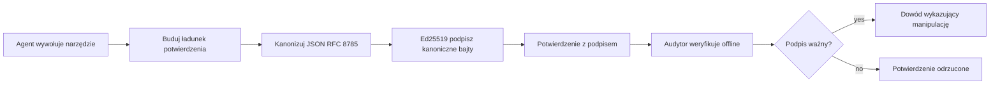
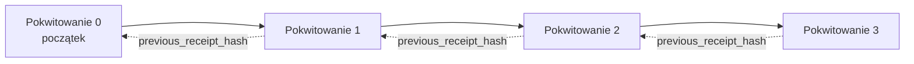

[Obejrzyj lekcję wideo: Zabezpieczanie agentów AI za pomocą kryptograficznych potwierdzeń](https://youtu.be/PLACEHOLDER_VIDEO_ID)

> _(Lekcja wideo i miniaturka zostaną dodane przez zespół Microsoft po scaleniu, zgodnie z wzorem lekcji 14 / 15.)_

# Zabezpieczanie agentów AI za pomocą kryptograficznych potwierdzeń

## Wprowadzenie

Ta lekcja obejmie:

- Dlaczego ścieżki audytu dla agentów AI są ważne dla zgodności, debugowania i zaufania.
- Czym jest kryptograficzne potwierdzenie i czym różni się od niepodpisanego wpisu w logu.
- Jak wytworzyć podpisane potwierdzenie wywołania narzędzia przez agenta w czystym Pythonie.
- Jak zweryfikować potwierdzenie offline i wykryć manipulacje.
- Jak łączyć potwierdzenia w łańcuch tak, żeby usunięcie lub zmiana kolejności jednego łamała łańcuch.
- Co potwierdzenia udowadniają, a czego wyraźnie nie udowadniają.

## Cele nauki

Po ukończeniu tej lekcji będziesz wiedzieć jak:

- Zidentyfikować tryby awarii, które motywują kryptograficzne pochodzenie działań agenta.
- Wytworzyć podpisane Ed25519 potwierdzenie nad kanonicznym ładunkiem JSON.
- Zweryfikować potwierdzenie niezależnie, używając tylko publicznego klucza podpisującego.
- Wykryć manipulacje przez ponowne wykonanie weryfikacji na zmodyfikowanym potwierdzeniu.
- Zbudować sekwencję potwierdzeń powiązanych łańcuchem haszy i wyjaśnić, dlaczego łańcuch ma znaczenie.
- Rozpoznać granicę między tym, co potwierdzenia udowadniają (przypisanie, integralność, kolejność), a tym czego nie udowadniają (poprawność działania, sensowność polityki).

## Problem: Ścieżka audytu twojego agenta

Wyobraź sobie, że wdrożyłeś agenta AI dla Contoso Travel. Agent odczytuje zapytania klientów, wywołuje API lotów w celu wyszukania opcji i rezerwuje miejsca w imieniu klienta. W ostatnim kwartale agent przetworzył 50 000 rezerwacji.

Dziś przychodzi audytor. Zadaje proste pytanie: „Pokaż mi, co zrobił twój agent.”

Przekazujesz pliki dzienników. Audytor patrzy na nie i zadaje trudniejsze pytanie: „Skąd mam wiedzieć, że te logi nie były edytowane?”

To jest problem ścieżki audytu. Większość wdrożeń agentów obecnie opiera się na:

- **Logach aplikacji**: zapisywanych przez samego agenta, edytowalnych przez każdego z dostępem do systemu plików.
- **Usługach logowania w chmurze**: odporne na manipulacje na poziomie platformy, ale tylko jeśli audytor ufa operatorowi platformy.
- **Logach transakcji bazy danych**: dobrze nadają się do zmian w bazie danych, ale nie do dowolnych wywołań narzędzi.

Żadne z nich nie potrafi odpowiedzieć na pytanie audytora bez wymogu, by audytor komuś zaufał (tobie, dostawcy chmury, dostawcy bazy danych). Do użytku wewnętrznego zaufanie to często jest akceptowalne. W obciążeniach regulowanych (finanse, opieka zdrowotna, cokolwiek podlegającego rozporządzeniu UE AI Act) nie jest.

Kryptograficzne potwierdzenia rozwiązują ten problem, czyniąc każde działanie agenta niezależnie weryfikowalnym. Audytor nie musi ufać tobie. Potrzebuje tylko twojego klucza publicznego i samego potwierdzenia.

## Czym jest kryptograficzne potwierdzenie?

Potwierdzenie to obiekt JSON, który zapisuje, co agent zrobił, podpisany cyfrowym podpisem.


```mermaid
flowchart LR
    A[Agent wywołuje narzędzie] --> B[Buduj ładunek potwierdzenia]
    B --> C[Kanonizuj JSON RFC 8785]
    C --> E[Ed25519 podpisz kanoniczne bajty]
    E --> F[Potwierdzenie z podpisem]
    F --> G[Audytor weryfikuje offline]
    G --> H{Podpis ważny?}
    H -- yes --> I[Dowód wykazujący manipulację]
    H -- no --> J[Potwierdzenie odrzucone]
```

Minimalne potwierdzenie wygląda tak:

```json
{
  "type": "agent.tool_call.v1",
  "agent_id": "contoso-travel-bot",
  "tool_name": "lookup_flights",
  "tool_args_hash": "sha256:a3f9c1...",
  "result_hash": "sha256:7b2e1d...",
  "policy_id": "contoso-travel-policy-v3",
  "timestamp": "2026-04-25T14:30:00Z",
  "sequence": 47,
  "previous_receipt_hash": "sha256:9d4e6a...",
  "signature": {
    "alg": "EdDSA",
    "sig": "c5af83...",
    "public_key": "8f3b2c..."
  }
}
```

Trzy właściwości wykonują pracę:

1. **Podpis**. Potwierdzenie jest podpisane przez bramę agenta używając prywatnego klucza Ed25519. Każdy z odpowiadającym kluczem publicznym może zweryfikować podpis offline. Manipulacja dowolnym polem unieważnia podpis.

2. **Kanoniczne kodowanie**. Przed podpisaniem potwierdzenie jest serializowane przy użyciu JSON Canonicalization Scheme (JCS, RFC 8785). To zapewnia, że dwie implementacje produkujące tę samą logiczną zawartość potwierdzenia, wytwarzają identyczne bajtowo wyjście. Bez kanonizacji różne serializatory JSON generowałyby różne podpisy dla tej samej treści.

3. **Łańcuchowanie haszy**. Pole `previous_receipt_hash` łączy każde potwierdzenie z poprzednim. Usunięcie lub zmiana kolejności potwierdzenia łamie każdy potwierdzenie, które następuje po nim. Manipulacje stają się widoczne na poziomie łańcucha, nawet jeśli pojedyncze podpisy zostałyby ominięte.

Razem te właściwości dają trzy gwarancje:

- **Przypisanie**: ten klucz podpisał tę zawartość.
- **Integralność**: zawartość nie zmieniła się od czasu podpisania.
- **Kolejność**: to potwierdzenie pojawiło się po tamtym w łańcuchu.

## Tworzenie potwierdzenia w Pythonie

Nie potrzebujesz specjalnej biblioteki, aby wytworzyć potwierdzenie. Prymitywy kryptograficzne są powszechnie dostępne, a logika to kilkadziesiąt linii Pythona.

Ćwiczenia praktyczne w `code_samples/18-signed-receipts.ipynb` przechodzą przez cały proces. Wersja skrócona:

```python
import json
import hashlib
import base64
from nacl import signing
from jcs import canonicalize  # RFC 8785 kanoniczny JSON

def b64url_nopad(data: bytes) -> str:
    return base64.urlsafe_b64encode(data).decode("ascii").rstrip("=")

def sha256_canonical(obj) -> str:
    """SHA-256 of a Python object's JCS-canonical JSON form."""
    return f"sha256:{hashlib.sha256(canonicalize(obj)).hexdigest()}"

# Wygeneruj lub załaduj klucz podpisu (w produkcji przechowuj w sejfie kluczy)
signing_key = signing.SigningKey.generate()
verify_key = signing_key.verify_key

# Zbuduj ładunek potwierdzenia (jeszcze bez podpisu)
tool_args = {"origin": "SYD", "destination": "LAX"}
tool_result = [{"flight": "QF11", "price": 1850, "stops": 0}]

payload = {
    "type": "agent.tool_call.v1",
    "agent_id": "contoso-travel-bot",
    "tool_name": "lookup_flights",
    "tool_args_hash": sha256_canonical(tool_args),
    "result_hash": sha256_canonical(tool_result),
    "policy_id": "contoso-travel-policy-v3",
    "timestamp": "2026-04-25T14:30:00Z",
    "sequence": 0,
    "previous_receipt_hash": None,
}

# Kanonicznie przekształć i podpisz bajty JCS bezpośrednio. PureEdDSA hashuje wewnętrznie.
canonical_bytes = canonicalize(payload)
signature_bytes = signing_key.sign(canonical_bytes).signature

# Dołącz strukturalny obiekt podpisu.
receipt = {
    **payload,
    "signature": {
        "alg": "EdDSA",
        "sig": b64url_nopad(signature_bytes),
        "public_key": b64url_nopad(bytes(verify_key)),
    },
}
```

To cały pipeline podpisywania. Ćwiczenia w notatniku omawiają każdy krok.

## Weryfikacja potwierdzenia i wykrywanie manipulacji

Weryfikacja to operacja odwrotna:

```python
import base64
import hashlib
from nacl import signing
from nacl.exceptions import BadSignatureError
from jcs import canonicalize

def b64url_decode(s: str) -> bytes:
    padding = "=" * ((4 - len(s) % 4) % 4)
    return base64.urlsafe_b64decode(s + padding)

def verify_receipt(receipt: dict) -> bool:
    # Podpis to zorganizowany obiekt: {"alg", "sig", "public_key"}.
    sig_obj = receipt.get("signature")
    if not sig_obj or sig_obj.get("alg") != "EdDSA":
        return False

    # Odtwórz treść, która faktycznie została podpisana (wszystko oprócz podpisu).
    payload = {k: v for k, v in receipt.items() if k != "signature"}

    canonical_bytes = canonicalize(payload)

    try:
        verify_key = signing.VerifyKey(b64url_decode(sig_obj["public_key"]))
        verify_key.verify(canonical_bytes, b64url_decode(sig_obj["sig"]))
        return True
    except BadSignatureError:
        return False
```

Ta funkcja przyjmuje potwierdzenie i zwraca `True` jeśli podpis jest ważny, `False` w przeciwnym razie. Bez wywołania sieci, bez zależności od usługi, bez konieczności zaufania stronie trzeciej.

Aby zobaczyć wykrywanie manipulacji w działaniu, notatnik przechodzi przez:

1. Utworzenie prawidłowego potwierdzenia i potwierdzenie, że weryfikuje się poprawnie.
2. Modyfikacja jednego bajtu pola `tool_args_hash`.
3. Ponowne uruchomienie weryfikacji i zobaczenie jej niepowodzenia.

To jest praktyczny pokaz, że potwierdzenia są odporne na manipulacje: każda zmiana, nawet najmniejsza, łamie podpis.

## Łączenie potwierdzeń dla agentów wieloetapowych

Jedno podpisane potwierdzenie chroni jedno działanie. Łańcuch potwierdzeń chroni sekwencję.


```mermaid
flowchart LR
    R0[Pokwitowanie 0<br/>początek] --> R1[Pokwitowanie 1]
    R1 --> R2[Pokwitowanie 2]
    R2 --> R3[Pokwitowanie 3]
    R1 -. previous_receipt_hash .-> R0
    R2 -. previous_receipt_hash .-> R1
    R3 -. previous_receipt_hash .-> R2
```

Każde potwierdzenie zapisuje hasz potwierdzenia poprzedzającego. Aby cicho usunąć potwierdzenie 2, atakujący musiałby albo:

- Zmodyfikować pole `previous_receipt_hash` potwierdzenia 3 (co łamie podpis potwierdzenia 3), LUB
- Podrobić nowy podpis dla zmodyfikowanego potwierdzenia 3 (wymaga prywatnego klucza agenta).

Jeśli klucz prywatny jest w sprzętowym skarbcu kluczy, a ty publikujesz klucz publiczny z każdym potwierdzeniem, żadna z tych prób ataku nie jest możliwa bez wykrycia.

Notatnik omawia:

1. Budowę łańcucha trzech potwierdzeń.
2. Weryfikację, że `previous_receipt_hash` każdego potwierdzenia pasuje do faktycznego haszu poprzedniego potwierdzenia.
3. Manipulację jednym potwierdzeniem w środku i zobaczenie, że łańcuch psuje się dokładnie w tym miejscu.

Tak właśnie wytwarzasz ścieżkę audytu, którą zewnętrzny audytor może zweryfikować bez konieczności zaufania tobie.

## Co potwierdzenia udowadniają (a czego nie)

To najważniejsza część tej lekcji. Potwierdzenia są potężne, ale ich moc jest ograniczona.

**Potwierdzenia udowadniają trzy rzeczy:**

1. **Przypisanie**: konkretny klucz podpisał konkretny ładunek.
2. **Integralność**: ładunek nie zmienił się od czasu podpisania.
3. **Kolejność**: to potwierdzenie pojawiło się po tamtym w łańcuchu haszy.

**Potwierdzenia NIE udowadniają:**

1. **Poprawności**: że działanie agenta było właściwe. Potwierdzenie może zostać podpisane tak samo dobrze dla błędnej odpowiedzi jak i poprawnej.
2. **Zgodności z polityką**: że polityka odwołana w `policy_id` faktycznie została oceniona lub że pozwoliłaby na to działanie, gdyby została sprawdzona. Potwierdzenie zapamiętuje, co zgłoszono, a nie co zostało wymuszone.
3. **Tożsamości poza kluczem**: potwierdzenie mówi „ten klucz podpisał tę zawartość”. Nie mówi „ten człowiek zatwierdził to”. Powiązanie klucza z osobą lub organizacją wymaga osobnej infrastruktury tożsamości (katalogu, rejestru kluczy publicznych itd.).
4. **Prawdziwości danych wejściowych**: jeśli agent otrzyma zmanipulowany prompt i na jego podstawie podejmie działanie, potwierdzenie wiernie zapisuje to działanie. Potwierdzenia są poniżej walidacji danych wejściowych, a nie jej substytutem.

Ta granica ma znaczenie z dwóch powodów:

- Informuje, do czego potwierdzenia są przydatne: czynią zachowanie agenta audytowalnym i odpornym na manipulacje, nawet między organizacjami.
- Pokazuje, jakie dodatkowe warstwy wciąż są potrzebne: walidację danych wejściowych (Lekcja 6), wymuszanie polityki (krótko omawiane poniżej), oraz infrastrukturę tożsamości (poza zakresem tej lekcji).

Częstym błędem jest zakładanie, że „mamy potwierdzenia” oznacza „jesteśmy zarządzani”. Nie oznacza. Potwierdzenia to fundament. Zarządzanie to system, który na tym budujesz.

## Udowadnianie, że człowiek zatwierdził dokładne działanie

Punkt 3 powyżej zasługuje na osobną sekcję: potwierdzenie działania mówi „ten klucz podpisał tę zawartość”, nigdy „człowiek to zatwierdził”. Dla działań wysokiego ryzyka (zwroty, usuwanie, przelewy) ramy zarządzania coraz częściej wymagają właśnie tego brakującego stwierdzenia, a jest ono możliwe do wygenerowania przy użyciu tych samych prymitywów, które już zbudowałeś w tej lekcji.

Kolejny notatnik `code_samples/human-authorization-receipts.ipynb` dodaje drugi rodzaj potwierdzenia, `human.approval.v1`, w tym samym kształcie koperty co potwierdzenia lekcji (typowany ładunek podpisany Ed25519 nad kanonicznymi bajtami JCS, z obiektem `signature` poza podpisanymi bajtami). Nazwany zatwierdzający podpisuje **pełne kanoniczne działanie i jego skrót** przed wykonaniem; potwierdzenie działania agenta zawiera **ten sam skrót działania** i `parent_approval_ref`, hash potwierdzenia zatwierdzenia, w tej samej konwencji co `previous_receipt_hash` w łańcuchu, który powyżej zbudowałeś. Jedna funkcja `verify_chain` przegląda oba artefakty pod **osobnymi zbiorem przypiętych kluczy** (klucze zatwierdzających vs klucze agentów), więc ścieżka kodu jest współdzielona, ale autorzy nigdy nie są.

Właściwość, którą to zapewnia, wyrażona ostrożnie: *człowiek zatwierdził dokładnie to działanie, a agent wykonał dokładnie to zatwierdzone działanie.* Mechanizmy odrzucania w notatniku sprawiają, że ta właściwość jest rzeczywista, a nie tylko deklarowana:

- klasyczny zestaw: manipulacja, zdezorientowany zastępca, powtórka, podrobione klucze po obu stronach, błędne dane wejściowe;
- **przestarzałe uprawnienia**: podpis, który wciąż weryfikuje się, lecz odrzucony, ponieważ wersja polityki się zmieniła, klucz zatwierdzający został usunięty z przypiętego rejestru lub zatwierdzenie wygasło przed wykonaniem;
- **podmiana skrótu**: prawidłowo podpisane potwierdzenie działania wskazujące na *prawdziwe* zatwierdzenie, które wiąże *inne* kanoniczne działanie.

Każda awaria odrzuca z konkretnym powodem, więc audytor czytający odmowę może rozpoznać czy uprawnienia wygasły czy zmieniło się wykonanie działania. Zasada przekazywana w notatniku: podpisane zatwierdzenie nie jest samo w sobie uprawnieniem. Uprawnienie istnieje tylko wtedy, gdy oba potwierdzenia wiążą się z tym samym kanonicznym działaniem w czasie wykonania. Potwierdzenie zatwierdzenia przez człowieka to kompozycja edukacyjna zdefiniowana przez tę lekcję, nie jest typem potwierdzenia zdefiniowanym przez `draft-farley-acta-signed-receipts`.

## Odniesienia produkcyjne

Kod Python w tej lekcji jest celowo minimalny, abyś mógł przeczytać każdy wiersz i dokładnie zrozumieć, co się dzieje. W produkcji masz dwie opcje:

1. **Budować bezpośrednio na prymitywach kryptograficznych.** 50 linii, które widziałeś powyżej, wystarczają w wielu przypadkach. PyNaCl (Ed25519) i pakiet `jcs` (kanoniczny JSON) to dobrze utrzymywane i audytowane biblioteki.

2. **Użyć biblioteki produkcyjnej potwierdzeń.** Kilka projektów open source implementuje ten sam wzorzec z dodatkowymi funkcjami (rotacja kluczy, weryfikacja wsadowa, dystrybucja JWK Set, integracja z silnikami polityk):
   - Pipeline podpisywania korzysta z konwencji JCS i zakresu podpisów w niezależnym propozycji IETF Internet-Draft ([`draft-farley-acta-signed-receipts`](https://datatracker.ietf.org/doc/draft-farley-acta-signed-receipts/), wersja 02). Edukacyjne płaskie potwierdzenie z tej lekcji różni się od draftowego koperty `{payload, signature}` i nie jest przedstawiane jako zgodna implementacja. Draft publikuje wspólny zestaw testów zgodności ([agent-governance-testvectors](https://github.com/ScopeBlind/agent-governance-testvectors)) dla implementacji celujących w jego format transmisji.
   - Microsoft Agent Governance Toolkit łączy potwierdzenia z decyzjami polityki opartymi na Cedar; zobacz Tutorial 33 w tym repozytorium dla przykładu end-to-end.
   - Pakiety `protect-mcp` (npm) oraz `@veritasacta/verify` (npm) dostarczają implementację Node do podpisywania potwierdzeń i weryfikacji offline, przeznaczoną do opakowania dowolnego serwera MCP z odporną na manipulacje ścieżką audytu, w tym przepływ z zatrzymaniem do współpodpisu, gdzie wstrzymane działanie emituje potwierdzenie zatwierdzenia związane ze skrótem działania (zabezpieczone WebAuthn w przepływie desktopowym), ten sam wzorzec potwierdzenia zatwierdzenia, co notatnik o zatwierdzeniu przez człowieka powyżej.
   - **[nobulex](https://github.com/arian-gogani/nobulex)** Python SDK (`pip install nobulex`) dostarcza ten sam wzorzec podpisywania Ed25519 + JCS w Pythonie z integracjami LangChain i CrewAI, w tym opublikowane wektory testowe walidacji krzyżowej i mapowanie zgodności dostarczone przez [OWASP PR #2210](https://github.com/OWASP/CheatSheetSeries/pull/2210).

Decyzja między napisaniem własnego a użyciem biblioteki odzwierciedla wybór między pisaniem własnej biblioteki JWT a użyciem sprawdzonej: oba podejścia są rozsądne; biblioteka oszczędza czas i zmniejsza powierzchnię audytu; podejście od podstaw wymusza zrozumienie każdego prymitywu. Ta lekcja uczy od podstaw, abyś miał fundament pod oba wybory.

## Sprawdzenie wiedzy

Przetestuj swoją wiedzę przed przejściem do ćwiczenia praktycznego.

**1. Potwierdzenie jest podpisane prywatnym kluczem Ed25519 agenta. Audytor ma tylko klucz publiczny. Czy audytor może zweryfikować potwierdzenie offline?**

<details>
<summary>Odpowiedź</summary>

Tak. Weryfikacja Ed25519 wymaga tylko klucza publicznego i podpisanych bajtów. Bez wywołań sieci, bez zależności od usług. To własność, która czyni potwierdzenia użytecznymi w środowiskach odizolowanych, wieloorganizacyjnych lub o niskim poziomie zaufania do audytu.
</details>

**2. Atakujący modyfikuje pole `policy_id` potwierdzenia, twierdząc, że było zarządzane bardziej liberalną polityką. Podpis dotyczył oryginalnego ładunku. Co się dzieje podczas weryfikacji?**

<details>
<summary>Odpowiedź</summary>


Weryfikacja nie powiodła się. Podpis został obliczony na kanonicznych bajtach oryginalnej treści; zmiana jakiegokolwiek pola zmienia te bajty, co unieważnia podpis. Atakujący potrzebowałby klucza prywatnego, aby wygenerować nowy ważny podpis, którego nie posiada.
</details>

**3. Dlaczego potwierdzenie zawiera `tool_args_hash` i `result_hash`, a nie surowe argumenty i wynik?**

<details>
<summary>Odpowiedź</summary>

Dwa powody. Po pierwsze, potwierdzenie może wymagać archiwizacji lub przesłania w środowiskach, gdzie ujawnienie surowej zawartości (Dane Osobowe, dane biznesowe) stanowi problem. Haszowanie utrzymuje potwierdzenie małym i zachowuje prywatność zawartości; audytor weryfikuje, czy hash odpowiada osobno przechowywanej kopii faktycznej zawartości. Po drugie, hash ma stały rozmiar; potwierdzenie z hashami ma ograniczony rozmiar bez względu na to, jak duże były dane wejściowe i wyjściowe.
</details>

**4. Pole `previous_receipt_hash` wiąże każde potwierdzenie z jego poprzednikiem. Jeśli atakujący po cichu usunie jedno potwierdzenie ze środka łańcucha, co stanie się nieważne?**

<details>
<summary>Odpowiedź</summary>

Każde potwierdzenie, które nastąpiło po usuniętym. Ich pola `previous_receipt_hash` nie będą już zgodne z faktycznym łańcuchem (ponieważ potwierdzenie, do którego się odwoływały, już nie istnieje lub łańcuch wskazuje na innego poprzednika). Aby ukryć usunięcie, atakujący musiałby ponownie podpisać każde późniejsze potwierdzenie, co wymaga klucza prywatnego.
</details>

**5. Potwierdzenie zostało prawidłowo zweryfikowane. Czy to dowodzi, że działanie agenta było poprawne, zgodne z przepisami lub zgodne z polityką?**

<details>
<summary>Odpowiedź</summary>

Nie. Ważne potwierdzenie dowodzi trzech rzeczy: przypisania (ten klucz podpisał tę zawartość), integralności (zawartość nie została zmieniona) oraz kolejności (to potwierdzenie nastąpiło po tamtym). NIE dowodzi, że działanie było słuszne, że polityka wskazana w `policy_id` była faktycznie oceniana, ani że agent przestrzegał każdej reguły. Potwierdzenia umożliwiają audyt zachowania agenta, ale niekoniecznie jego poprawność. To jest najważniejsza granica w tej lekcji.
</details>

## Ćwiczenie praktyczne

Otwórz `code_samples/18-signed-receipts.ipynb` i wykonaj wszystkie cztery sekcje:

1. **Sekcja 1**: Podpisz swoje pierwsze potwierdzenie i zweryfikuj je.
2. **Sekcja 2**: Sfałszuj potwierdzenie i zaobserwuj niepowodzenie weryfikacji.
3. **Sekcja 3**: Zbuduj trzy-punktowy łańcuch potwierdzeń i zweryfikuj integralność łańcucha.
4. **Sekcja 4**: Zastosuj wzorzec do agenta zbudowanego za pomocą Microsoft Agent Framework: opakuj wywołanie narzędzia w podpisywanie potwierdzenia, następnie niezależnie zweryfikuj potwierdzenie.

**Wyzwanie dodatkowe 1:** rozbuduj schemat potwierdzenia o dodatkowe pole według własnego wyboru (np. identyfikator żądania do śledzenia), zaktualizuj logikę kanonicznego podpisu, aby je uwzględnić, i potwierdź, że potwierdzenie nadal przechodzi pełną weryfikację. Następnie zmodyfikuj pole po podpisaniu i potwierdź niepowodzenie weryfikacji. To zmusza do zrozumienia, jak każdy bajt kanonicznego kodowania wpływa na podpis.

**Wyzwanie dodatkowe 2:** Zhaszuj podwójnie swoje dwa potwierdzenia SHA-256 (połącz ich kanoniczne bajty w deterministycznej kolejności) i osadź powstały skrót jako nowe pole w trzecim potwierdzeniu przed podpisaniem. Zweryfikuj, że wszystkie trzy potwierdzenia nadal przechodzą pełną weryfikację. Właśnie zbudowałeś jednopoziomowy dowód włączenia: każdy, kto posiada trzecie potwierdzenie, może udowodnić, że pierwsze dwa istniały w momencie jego podpisania, bez konieczności ujawniania ich zawartości. To jest wzorzec używany na dużą skalę przez potwierdzenia z selektywnym ujawnianiem (Merkle commitments, RFC 6962).

## Podsumowanie

Kryptograficzne potwierdzenia dają agentom AI ślad audytowy, który jest:

- **Niezależnie weryfikowalny**: każda strona z kluczem publicznym może zweryfikować, bez zależności od usług.
- **Odporny na fałszerstwo**: każda modyfikacja unieważnia podpis.
- **Przenośny**: potwierdzenie to mały plik JSON; można go archiwizować, przesyłać i weryfikować gdziekolwiek.
- **Zgodny ze standardami**: oparty na Ed25519 (RFC 8032), JCS (RFC 8785) i SHA-256, wszystkie szeroko stosowane prymitywy.

Nie zastępują one walidacji danych wejściowych, egzekwowania polityki ani infrastruktury tożsamości. Są one fundamentem dla tych warstw. Gdy wdrażasz agentów w środowiskach regulowanych, w przepływach pracy wielu organizacji lub w każdym miejscu, gdzie nie można zakładać zaufania audytora w przyszłości, potwierdzenia umożliwiają uczciwy ślad audytowy.

Najważniejszy wniosek: potwierdzenia dowodzą, kto co i kiedy powiedział. Nie dowodzą, że to, co powiedziano, było prawdziwe lub słuszne. Trzymaj tę różnicę mocno. To różnica między uczciwym systemem źródłowości a tym wprowadzającym w błąd.

## Lista kontrolna produkcyjna

Gdy będziesz gotowy przejść od tej lekcji do wdrażania agentów podpisujących potwierdzenia w środowisku produkcyjnym:

- [ ] **Przenieś klucz podpisujący z laptopa dewelopera.** Użyj Azure Key Vault, AWS KMS lub modułu bezpieczeństwa sprzętowego. Klucz prywatny podpisujący potwierdzenia nigdy nie może znajdować się w kontroli źródła ani w postaci zwykłego tekstu na maszynach aplikacyjnych.
- [ ] **Opublikuj klucz publiczny do weryfikacji.** Audytorzy potrzebują go do weryfikacji offline. Standardowy wzorzec to zestaw JWK pod dobrze znanym URL-em (RFC 7517), np. `https://twoja-organizacja.example.com/.well-known/agent-keys.json`.
- [ ] **Zakotwicz łańcuch zewnętrznie.** Okresowo zapisz hash ostatniego nagłówka łańcucha do dziennika przejrzystości (Sigstore Rekor, RFC 3161 timestamp authority lub drugi wewnętrzny system), żeby zewnętrzna strona mogła potwierdzić "ten łańcuch istniał w tym czasie."
- [ ] **Przechowuj potwierdzenia w sposób niezmienny.** Przechowywanie typu append-only (Azure Storage z politykami niezmienności, AWS S3 Object Lock) zapobiega zmianom historii przez insiderów na poziomie warstwy przechowywania.
- [ ] **Zdecyduj o okresie przechowywania.** Wiele regulacji wymaga wieloletniego przechowywania. Zaplanuj wzrost liczby potwierdzeń (każde potwierdzenie to ~500 bajtów; agent wykonujący 10 tys. wywołań dziennie generuje ~1,8 GB rocznie).
- [ ] **Udokumentuj, czego potwierdzenia nie obejmują.** Potwierdzenia dowodzą przypisania, integralności i kolejności. Twój runbook powinien wyraźnie wskazywać, jakie dodatkowe mechanizmy (walidacja danych wejściowych, egzekwowanie polityki, ograniczenia tempa, infrastruktura tożsamości) współistnieją z potwierdzeniami w twojej postawie zarządczej.

### Masz więcej pytań o zabezpieczanie agentów AI?

Dołącz do [Microsoft Foundry Discord](https://aka.ms/ai-agents/discord), aby spotkać się z innymi uczącymi się, uczestniczyć w godzinach konsultacji i uzyskać odpowiedzi na pytania dotyczące AI Agents.

## Poza tą lekcją

Ta lekcja obejmuje podpisywanie pojedynczych potwierdzeń i sekwencje łańcuchowe z haszami. Te same prymitywy tworzą kilka bardziej zaawansowanych wzorców, które możesz napotkać, gdy twoja postura zarządcza dojrzeje:

- **Selektywne ujawnianie.** Gdy pola potwierdzenia są niezależnie zobowiązane (Merkle tree zgodny z RFC 6962), możesz ujawniać konkretne pola określonym audytorom i udowadniać, że pozostałe nie zmieniły się bez ich ujawniania. Przydatne, gdy to samo potwierdzenie musi spełnić zarówno kompleksowy audyt (wymagający kompletności), jak i regulacje minimalizacji danych jak GDPR (wymagające, by audytor widział jak najmniej).
- **Unieważnianie potwierdzeń.** Jeśli klucz podpisujący zostanie skompromitowany, potrzebujesz sposobu, aby oznaczyć wszystkie potwierdzenia podpisane tym kluczem jako niegodne zaufania od pewnego momentu w czasie. Standardowe wzorce: krótkotrwałe klucze podpisujące plus opublikowana lista unieważnień albo dziennik przejrzystości z wpisami unieważnienia.
- **Dwustronne / podzielne podpisy potwierdzeń.** Niektóre implementacje dzielą podpisywany ładunek na przedwykonawcze (`authorization_*`) i powykonawcze (`result_*`) połowy z niezależnymi podpisami, przydatne, gdy decyzja autoryzacyjna i obserwowany wynik są wytwarzane przez różnych aktorów lub w różnych momentach. To dodaje się addytywnie do formatu potwierdzeń przedstawionego w tej lekcji.
- **Kompozycja ładunku.** Potwierdzenie pieczętuje dowolne bajty umieszczone w `result_hash`. Rzeczywiste ładunki są często bogatsze niż pojedynczy wynik wywołania narzędzia: rozumowanie przed decyzją (prognoza modelu, rozważane opcje, dowody i ich kompletność, postawa ryzyka, łańcuch odpowiedzialności, wynik bramy) mogą wszystkie znajdować się w ładunku, zapieczętowane pojedynczym potwierdzeniem. To utrzymuje format potwierdzenia minimalny, pozwalając na ewolucję schematów ładunku w poszczególnych dziedzinach.
- **Zgodność międzyimplementacyjna.** Kilka niezależnych implementacji tego samego formatu potwierdzeń (Python, TypeScript, Rust, Go) weryfikuje się wzajemnie za pomocą wspólnych zestawów testowych. Jeśli budujesz własną implementację, walidacja względem publikowanych wektorów potwierdza kompatybilność protokołu.
- **Migracja postkwantowa.** Ed25519 jest dziś szeroko stosowany, ale nie jest odporny na ataki kwantowe. Format potwierdzenia jest elastyczny względem algorytmów: pole `signature.alg` może zawierać `ML-DSA-65` (standard podpisu postkwantowego NIST), gdy zajdzie potrzeba migracji. Zaplanuj okres przejściowy, kiedy potwierdzenia są podpisywane podwójnie.

## Dodatkowe zasoby

- <a href="https://datatracker.ietf.org/doc/draft-farley-acta-signed-receipts/" target="_blank">IETF Internet-Draft: Signed Decision Receipts for Machine-to-Machine Access Control</a>
- <a href="https://learn.microsoft.com/azure/ai-studio/responsible-use-of-ai-overview" target="_blank">Responsible AI overview (Azure AI)</a>
- <a href="https://datatracker.ietf.org/doc/html/rfc8032" target="_blank">RFC 8032: Edwards-Curve Digital Signature Algorithm (EdDSA)</a>
- <a href="https://datatracker.ietf.org/doc/html/rfc8785" target="_blank">RFC 8785: JSON Canonicalization Scheme (JCS)</a>
- <a href="https://datatracker.ietf.org/doc/html/rfc6962" target="_blank">RFC 6962: Certificate Transparency</a> (Merkle-tree construction used by selective-disclosure receipts)
- <a href="https://github.com/microsoft/agent-governance-toolkit/blob/main/docs/tutorials/33-offline-verifiable-receipts.md" target="_blank">Microsoft Agent Governance Toolkit, Tutorial 33: Offline-Verifiable Decision Receipts</a>
- <a href="https://github.com/ScopeBlind/agent-governance-testvectors" target="_blank">Cross-implementation conformance test vectors</a> for the receipt format used in this lesson (Apache-2.0)
- <a href="https://pynacl.readthedocs.io/" target="_blank">PyNaCl documentation</a> (Ed25519 in Python)

## Poprzednia lekcja

[Creating Local AI Agents](../17-creating-local-ai-agents/README.md)

---

<!-- CO-OP TRANSLATOR DISCLAIMER START -->
**Zastrzeżenie**:
Niniejszy dokument został przetłumaczony za pomocą usługi tłumaczenia AI [Co-op Translator](https://github.com/Azure/co-op-translator). Choć dążymy do dokładności, prosimy pamiętać, że automatyczne tłumaczenia mogą zawierać błędy lub niedokładności. Oryginalny dokument w jego języku źródłowym należy uznawać za autorytatywne źródło. W przypadku informacji krytycznych zalecane jest skorzystanie z profesjonalnego tłumaczenia wykonanego przez człowieka. Nie ponosimy odpowiedzialności za jakiekolwiek nieporozumienia lub błędne interpretacje wynikające z użycia tego tłumaczenia.
<!-- CO-OP TRANSLATOR DISCLAIMER END -->