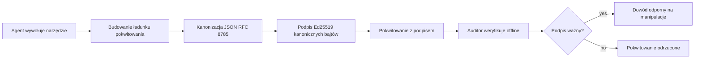
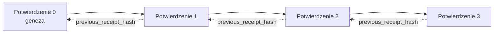

[Obejrzyj film z lekcji: Zabezpieczanie agentów AI za pomocą kryptograficznych potwierdzeń](https://youtu.be/PLACEHOLDER_VIDEO_ID)

> _(Film z lekcji i miniaturka zostaną dodane przez zespół Microsoft ds. treści po scaleniu, zgodnie ze wzorem lekcji 14 / 15.)_

# Zabezpieczanie agentów AI za pomocą kryptograficznych potwierdzeń

## Wprowadzenie

Ta lekcja obejmuje:

- Dlaczego ścieżki audytu dla agentów AI są ważne dla zgodności, debugowania i zaufania.
- Czym jest kryptograficzne potwierdzenie i jak różni się od niepodpisanego wpisu w dzienniku.
- Jak wygenerować podpisane potwierdzenie dla wywołania narzędzia agenta w czystym Pythonie.
- Jak zweryfikować potwierdzenie offline i wykryć manipulację.
- Jak łączyć potwierdzenia w łańcuch tak, aby usunięcie lub zmiana kolejności jednej powodowało przerwanie łańcucha.
- Co potwierdzenia udowadniają, a czego wyraźnie nie dowodzą.

## Cele nauki

Po ukończeniu tej lekcji będziesz wiedzieć, jak:

- Zidentyfikować tryby awarii, które motywują kryptograficzne pochodzenie działań agenta.
- Wygenerować potwierdzenie podpisane Ed25519 nad kanonicznym ładunkiem JSON.
- Zweryfikować potwierdzenie samodzielnie, używając tylko klucza publicznego podpisującego.
- Wykryć manipulacje poprzez ponowne uruchomienie weryfikacji zmodyfikowanego potwierdzenia.
- Zbudować sekwencję potwierdzeń powiązaną skrótem i wyjaśnić, dlaczego łańcuch jest istotny.
- Rozpoznać granicę pomiędzy tym, co potwierdzenia dowodzą (przypisanie, integralność, kolejność), a tym, czego nie dowodzą (poprawność działania, słuszność polityki).

## Problem: Ścieżka audytu Twojego agenta

Wyobraź sobie, że wdrożyłeś agenta AI dla Contoso Travel. Agent odczytuje prośby klientów, wywołuje interfejs API lotów w celu wyszukania opcji i rezerwuje miejsca w imieniu klienta. W ostatnim kwartale agent przetworzył 50 000 rezerwacji.

Dzisiaj przychodzi audytor. Zadaje proste pytanie: "Pokaż mi, co zrobił Twój agent."

Przekazujesz pliki dziennika. Audytor je przegląda i zadaje trudniejsze pytanie: "Skąd mam wiedzieć, że te dzienniki nie były edytowane?"

To jest problem ścieżki audytu. Większość dzisiejszych wdrożeń agentów opiera się na:

- **Dziennikach aplikacji**: tworzonych przez samego agenta, możliwych do edycji przez każdego, kto ma dostęp do systemu plików.
- **Usługach dziennikowania w chmurze**: zabezpieczonych na poziomie platformy przed manipulacją, ale tylko jeśli audytor ufa operatorowi platformy.
- **Dziennikach transakcji bazodanowych**: odpowiednich dla zmian w bazie, ale nie dla dowolnych wywołań narzędzi.

Żadne z nich nie jest w stanie odpowiedzieć na pytanie audytora bez wymogu zaufania do kogoś (Ciebie, dostawcy chmury, dostawcy bazy danych). W użytku wewnętrznym takie zaufanie jest często akceptowalne. W przypadku obciążeń regulowanych (finanse, opieka zdrowotna, cokolwiek objęte EU AI Act) nie jest.

Kryptograficzne potwierdzenia rozwiązują ten problem, czyniąc każde działanie agenta niezależnie weryfikowalnym. Audytor nie musi Ci ufać. Potrzebuje tylko Twojego klucza publicznego i samego potwierdzenia.

## Czym jest kryptograficzne potwierdzenie?

Potwierdzenie to obiekt JSON, który zapisuje, co agent zrobił, podpisany cyfrowo.


```mermaid
flowchart LR
    A[Agent wywołuje narzędzie] --> B[Budowanie ładunku pokwitowania]
    B --> C[Kanonizacja JSON RFC 8785]
    C --> E[Podpis Ed25519 kanonicznych bajtów]
    E --> F[Pokwitowanie z podpisem]
    F --> G[Auditor weryfikuje offline]
    G --> H{Podpis ważny?}
    H -- yes --> I[Dowód odporny na manipulacje]
    H -- no --> J[Pokwitowanie odrzucone]
```

Minimalne potwierdzenie wygląda tak:

```json
{
  "type": "agent.tool_call.v1",
  "agent_id": "contoso-travel-bot",
  "tool_name": "lookup_flights",
  "tool_args_hash": "sha256:a3f9c1...",
  "result_hash": "sha256:7b2e1d...",
  "policy_id": "contoso-travel-policy-v3",
  "timestamp": "2026-04-25T14:30:00Z",
  "sequence": 47,
  "previous_receipt_hash": "sha256:9d4e6a...",
  "signature": {
    "alg": "EdDSA",
    "sig": "c5af83...",
    "public_key": "8f3b2c..."
  }
}
```

Trzy właściwości odpowiadają za jego działanie:

1. **Podpis**. Potwierdzenie jest podpisywane przez bramę agenta przy użyciu prywatnego klucza Ed25519. Każdy, kto posiada odpowiadający klucz publiczny, może zweryfikować podpis offline. Manipulacja jakimkolwiek polem unieważnia podpis.

2. **Kanoniczne kodowanie**. Przed podpisaniem potwierdzenie jest serializowane przy użyciu schematu kanonicznego JSON (JCS, RFC 8785). Zapewnia to, że dwa implementacje wytwarzające ten sam logiczny dokument generują identyczne bajty. Bez kanonizacji różne serializatory JSON generowałyby różne podpisy dla tej samej zawartości.

3. **Łączenie za pomocą skrótu**. Pole `previous_receipt_hash` łączy każde potwierdzenie z poprzednim. Usunięcie lub zmiana kolejności potwierdzenia łamie każde potwierdzenie następujące po nim. Manipulacje stają się widoczne na poziomie całego łańcucha, nawet jeśli indywidualne podpisy są pomijane.

Razem te cechy dają trzy gwarancje:

- **Przypisanie**: ten klucz podpisał tę zawartość.
- **Integralność**: zawartość nie zmieniła się od czasu podpisu.
- **Kolejność**: to potwierdzenie wystąpiło po tamtym w łańcuchu.

## Tworzenie potwierdzenia w Pythonie

Nie potrzebujesz specjalnej biblioteki, aby wygenerować potwierdzenie. Prymitywy kryptograficzne są powszechnie dostępne, a logika to kilka dziesiątek linii Pythona.

Ćwiczenia praktyczne w `code_samples/18-signed-receipts.ipynb` przeprowadzają przez cały proces. Wersja skrócona:

```python
import json
import hashlib
import base64
from nacl import signing
from jcs import canonicalize  # RFC 8785 kanoniczny JSON

def b64url_nopad(data: bytes) -> str:
    return base64.urlsafe_b64encode(data).decode("ascii").rstrip("=")

def sha256_canonical(obj) -> str:
    """SHA-256 of a Python object's JCS-canonical JSON form."""
    return f"sha256:{hashlib.sha256(canonicalize(obj)).hexdigest()}"

# Wygeneruj lub załaduj klucz podpisu (w produkcji przechowuj w magazynie kluczy)
signing_key = signing.SigningKey.generate()
verify_key = signing_key.verify_key

# Zbuduj ładunek potwierdzenia (jeszcze bez podpisu)
tool_args = {"origin": "SYD", "destination": "LAX"}
tool_result = [{"flight": "QF11", "price": 1850, "stops": 0}]

payload = {
    "type": "agent.tool_call.v1",
    "agent_id": "contoso-travel-bot",
    "tool_name": "lookup_flights",
    "tool_args_hash": sha256_canonical(tool_args),
    "result_hash": sha256_canonical(tool_result),
    "policy_id": "contoso-travel-policy-v3",
    "timestamp": "2026-04-25T14:30:00Z",
    "sequence": 0,
    "previous_receipt_hash": None,
}

# Kanonizuj i podpisz bezpośrednio bajty JCS. PureEdDSA wewnętrznie haszuje.
canonical_bytes = canonicalize(payload)
signature_bytes = signing_key.sign(canonical_bytes).signature

# Dołącz strukturalny obiekt podpisu.
receipt = {
    **payload,
    "signature": {
        "alg": "EdDSA",
        "sig": b64url_nopad(signature_bytes),
        "public_key": b64url_nopad(bytes(verify_key)),
    },
}
```

To cały pipeline podpisywania. Ćwiczenia w notatniku omawiają każdy krok.

## Weryfikacja potwierdzenia i wykrywanie manipulacji

Weryfikacja to operacja odwrotna:

```python
import base64
import hashlib
from nacl import signing
from nacl.exceptions import BadSignatureError
from jcs import canonicalize

def b64url_decode(s: str) -> bytes:
    padding = "=" * ((4 - len(s) % 4) % 4)
    return base64.urlsafe_b64decode(s + padding)

def verify_receipt(receipt: dict) -> bool:
    # Sygnatura jest obiektem strukturalnym: {"alg", "sig", "public_key"}.
    sig_obj = receipt.get("signature")
    if not sig_obj or sig_obj.get("alg") != "EdDSA":
        return False

    # Odtwórz ładunek, który był faktycznie podpisany (wszystko oprócz sygnatury).
    payload = {k: v for k, v in receipt.items() if k != "signature"}

    canonical_bytes = canonicalize(payload)

    try:
        verify_key = signing.VerifyKey(b64url_decode(sig_obj["public_key"]))
        verify_key.verify(canonical_bytes, b64url_decode(sig_obj["sig"]))
        return True
    except BadSignatureError:
        return False
```

Funkcja przyjmuje potwierdzenie i zwraca `True` jeśli podpis jest prawidłowy, `False` w przeciwnym razie. Bez wywołań sieciowych, bez zależności od usług, bez potrzeby zaufania stronie trzeciej.

Aby zobaczyć wykrywanie manipulacji w praktyce, notatnik pokazuje:

1. Wygenerowanie prawidłowego potwierdzenia i potwierdzenie, że weryfikuje się.
2. Modyfikację jednego bajtu w polu `tool_args_hash`.
3. Ponowne uruchomienie weryfikacji i sprawdzenie, że się nie powiodło.

To praktyczny dowód, że potwierdzenia są odporne na manipulacje: każda modyfikacja, nawet najmniejsza, łamie podpis.

## Łączenie potwierdzeń dla agentów wieloetapowych

Pojedyncze podpisane potwierdzenie chroni jedno działanie. Łańcuch potwierdzeń chroni sekwencję.


```mermaid
flowchart LR
    R0[Potwierdzenie 0<br/>geneza] --> R1[Potwierdzenie 1]
    R1 --> R2[Potwierdzenie 2]
    R2 --> R3[Potwierdzenie 3]
    R1 -. previous_receipt_hash .-> R0
    R2 -. previous_receipt_hash .-> R1
    R3 -. previous_receipt_hash .-> R2
```

Każde potwierdzenie zapisuje skrót poprzedniego potwierdzenia. Aby cicho usunąć potwierdzenie nr 2, napastnik musiałby:

- Zmodyfikować pole `previous_receipt_hash` w potwierdzeniu nr 3 (co unieważnia podpis potwierdzenia nr 3), LUB
- Sfałszować nowy podpis dla zmodyfikowanego potwierdzenia nr 3 (wymaga prywatnego klucza agenta).

Jeśli klucz prywatny jest w sprzętowym skarbcu kluczy, a Ty publikujesz klucz publiczny z każdym potwierdzeniem, żaden z tych ataków nie jest możliwy bez wykrycia.

Notatnik przeprowadza przez:

1. Budowę łańcucha trzech potwierdzeń.
2. Weryfikację, że `previous_receipt_hash` każdego potwierdzenia odpowiada rzeczywistemu skrótowi poprzedniego potwierdzenia.
3. Manipulację jednym potwierdzeniem pośrodku i obserwację przerwania łańcucha w tym miejscu.

W ten sposób tworzysz ścieżkę audytu, którą zewnętrzny audytor może zweryfikować bez konieczności zaufania Tobie.

## Co potwierdzenia udowadniają (a czego nie)

To najważniejsza część lekcji. Potwierdzenia są potężne, ale ich moc jest ograniczona.

**Potwierdzenia udowadniają trzy rzeczy:**

1. **Przypisanie**: konkretny klucz podpisał konkretny ładunek.
2. **Integralność**: ładunek nie zmienił się od czasu podpisu.
3. **Kolejność**: to potwierdzenie wystąpiło po tamtym w łańcuchu skrótów.

**Potwierdzenia NIE udowadniają:**

1. **Poprawności**: że działanie agenta było właściwe. Potwierdzenie może być podpisane dla błędnej odpowiedzi równie dobrze jak dla właściwej.
2. **Zgodności z polityką**: że polityka wspomniana w `policy_id` została faktycznie oceniona lub że umożliwiłaby tę akcję, gdyby była sprawdzana. Potwierdzenie zapisuje to, co zostało zadeklarowane, a nie to, co zostało egzekwowane.
3. **Tożsamości poza kluczem**: potwierdzenie mówi "ten klucz podpisał tę zawartość". Nie mówi "ten człowiek zatwierdził to". Połączenie klucza z osobą lub organizacją wymaga osobnej infrastruktury tożsamości (katalog, rejestr kluczy publicznych itd.).
4. **Prawdziwości danych wejściowych**: jeśli agent otrzyma zmanipulowaną podpowiedź i na niej działa, potwierdzenie wiernie zapisuje działanie. Potwierdzenia występują po walidacji danych wejściowych, nie zastępują jej.

Ta granica ma znaczenie z dwóch powodów:

- Mówi, do czego potwierdzenia są przydatne: uczynienia zachowania agenta audytowalnym i odpornym na manipulacje, nawet między organizacjami.
- Mówi, jakie dodatkowe warstwy są jeszcze potrzebne: walidacja danych wejściowych (Lekcja 6), egzekwowanie polityki (omówione krótko poniżej) oraz infrastruktura tożsamości (poza zakresem tej lekcji).

Częstym błędem jest założenie, że "mamy potwierdzenia" oznacza "jesteśmy regulowani". To nieprawda. Potwierdzenia są fundamentem. Regulacje to system, który na nim budujesz.

## Udowadnianie, że człowiek zatwierdził dokładne działanie

Punkt 3 zasługuje na osobną sekcję: potwierdzenie akcji mówi "ten klucz podpisał tę zawartość", nigdy "człowiek to zatwierdził". Dla działań o wysokim ryzyku (zwroty, usunięcia, przelewy bankowe) ramy zarządzania coraz częściej wymagają właśnie tej brakującej deklaracji, i można ją wytworzyć tymi samymi prymitywami, które już zbudowałeś w tej lekcji.

Kolejny notatnik `code_samples/human-authorization-receipts.ipynb` dodaje drugi rodzaj potwierdzenia, `human.approval.v1`, w tej samej formie koperty co potwierdzenia z lekcji (typowany ładunek podpisany Ed25519 nad kanonicznymi bajtami JCS, z obiektem `signature` poza podpisanymi bajtami). Nazwany zatwierdzający podpisuje **pełne kanoniczne działanie i jego skrót** przed wykonaniem; potwierdzenie działania agenta przenosi **ten sam skrót działania** i `parent_approval_ref`, skrót potwierdzenia zatwierdzenia, tę samą konwencję co `previous_receipt_hash` w łańcuchu zbudowanym powyżej. Jedna funkcja `verify_chain` przetwarza oba artefakty pod **oddzielnymi zaufanymi rejestrami kluczy** (klucze zatwierdzających vs klucze agentów), więc ścieżka kodu jest wspólna, ale uprawnienia nigdy nie są.

Posiadaną właściwość wyrażono ostrożnie: *człowiek zatwierdził dokładnie to działanie, a agent wykonał dokładnie to zatwierdzone działanie.* Elementy odmowy w notatniku sprawiają, że ta właściwość jest realna, a nie tylko deklarowana:

- klasyczny zestaw: manipulacja, zdezorientowany zastępca, powtórzenie, sfałszowane klucze po obu stronach, niepoprawne dane wejściowe;
- **przestarzałe uprawnienia**: podpis, który nadal weryfikuje się poprawnie, odrzucony mimo to, ponieważ wersja polityki się zmieniła, klucz zatwierdzającego został usunięty z zaufanego rejestru lub zatwierdzenie wygasło przed wykonaniem;
- **podmiana skrótu**: prawidłowo podpisane potwierdzenie działania wskazujące na *prawdziwe* zatwierdzenie wiążące *inne* kanoniczne działanie.

Każda odmowa ma odrębny powód, więc audytor czytający odmowę może stwierdzić, czy prawo wygasło, czy zmieniło się wykonane działanie. Zasada, której uczy notatnik: podpisane zatwierdzenie samo w sobie nie jest uprawnieniem. Uprawnienie istnieje tylko wtedy, gdy oba potwierdzenia nadal wiążą się z tym samym kanonicznym działaniem w momencie wykonania. Potwierdzenie zatwierdzenia człowieka jest edukacyjną kompozycją zdefiniowaną w tej lekcji, a nie typem potwierdzenia zdefiniowanym w `draft-farley-acta-signed-receipts`.

## Odniesienia produkcyjne

Kod Pythona w tej lekcji jest celowo minimalny, abyś mógł przeczytać każdą linię i dokładnie zrozumieć, co się dzieje. W produkcji masz dwie opcje:

1. **Budować bezpośrednio na prymitywach kryptograficznych.** Te 50 linii, które widziałeś powyżej, wystarcza dla wielu przypadków użycia. PyNaCl (Ed25519) i pakiet `jcs` (kanoniczny JSON) to dobrze utrzymane i audytowane biblioteki.

2. **Użyć biblioteki produkcyjnej do potwierdzeń.** Kilka projektów open-source implementuje ten sam wzorzec z dodatkowymi funkcjami (rotacja kluczy, weryfikacja wsadowa, dystrybucja zbioru JWK, integracja z silnikami polityk):
   - Pipeline podpisywania korzysta z konwencji JCS i zakresu podpisu w niezależnym szkicu IETF ([`draft-farley-acta-signed-receipts`](https://datatracker.ietf.org/doc/draft-farley-acta-signed-receipts/), rewizja 02). Edukacyjne płaskie potwierdzenie z lekcji różni się od koperty szkicu `{payload, signature}` i nie jest prezentowane jako implementacja zgodna. Szkic publikuje wspólny zestaw testów zgodności ([agent-governance-testvectors](https://github.com/ScopeBlind/agent-governance-testvectors)) dla implementacji celujących w jego format transmisji.
   - Microsoft Agent Governance Toolkit łączy potwierdzenia z decyzjami politycznymi opartymi na Cedar; zobacz Tutorial 33 w tym repozytorium jako przykład end-to-end.
   - Pakiety `protect-mcp` (npm) i `@veritasacta/verify` (npm) zapewniają implementację Node do podpisywania potwierdzeń i weryfikacji offline, przeznaczoną do opakowywania dowolnego serwera MCP z bezpieczną ścieżką audytu, w tym przepływ z zatrzymaniem do współpodpisu, gdzie zatrzymana akcja emituje potwierdzenie zatwierdzenia powiązane ze skrótem działania (poparte WebAuthn w przepływie desktopowym), ta sama konwencja potwierdzenia zatwierdzenia co w notatniku dla autoryzacji ludzkiej powyżej.
   - **[nobulex](https://github.com/arian-gogani/nobulex)** Python SDK (`pip install nobulex`) zapewnia ten sam wzorzec podpisywania Ed25519 + JCS w Pythonie z integracjami LangChain i CrewAI, w tym opublikowane wektory testów krzyżowej walidacji i mapowanie zgodności wniesione przez [OWASP PR #2210](https://github.com/OWASP/CheatSheetSeries/pull/2210).

Decyzja między samodzielnym napisaniem a użyciem biblioteki przypomina wybór między napisaniem własnej biblioteki JWT a użyciem przetestowanej: oba są rozsądne; biblioteka oszczędza czas i zmniejsza powierzchnię audytu; podejście od podstaw wymaga zrozumienia każdego prymitywu. Ta lekcja uczy podejścia od podstaw, abyś miał fundament do obu wyborów.

## Sprawdzenie wiedzy

Sprawdź swoje rozumienie przed przejściem do ćwiczenia praktycznego.

**1. Potwierdzenie jest podpisane prywatnym kluczem Ed25519 agenta. Audytor ma tylko klucz publiczny. Czy audytor może zweryfikować potwierdzenie offline?**

<details>
<summary>Odpowiedź</summary>

Tak. Weryfikacja Ed25519 wymaga tylko klucza publicznego i podpisanych bajtów. Bez wywołań sieciowych, bez zależności od usług. To jest właściwość, która czyni potwierdzenia użytecznymi w środowiskach offline, wieloorganizacyjnych lub o niskim poziomie zaufania.
</details>

**2. Atakujący modyfikuje pole `policy_id` potwierdzenia, aby twierdzić, że było ono objęte bardziej liberalną polityką. Podpis dotyczył oryginalnego ładunku. Co się stanie podczas weryfikacji?**

<details>
<summary>Odpowiedź</summary>


Weryfikacja nie powiodła się. Podpis został obliczony na kanonicznych bajtach oryginalnej treści; zmiana któregokolwiek pola zmienia te bajty, co unieważnia podpis. Atakujący potrzebowałby klucza prywatnego, aby wygenerować nowy ważny podpis, którego nie posiada.
</details>

**3. Dlaczego potwierdzenie zawiera `tool_args_hash` i `result_hash` zamiast surowych argumentów i wyniku?**

<details>
<summary>Odpowiedź</summary>

Dwa powody. Po pierwsze, potwierdzenie może wymagać archiwizacji lub przesyłania w środowiskach, gdzie wyciek surowych danych (dane osobowe, biznesowe) stanowi problem. Hashowanie utrzymuje potwierdzenie małe i zawartość prywatną; audytor weryfikuje, że hash odpowiada oddzielnie przechowywanej kopii faktycznej zawartości. Po drugie, hashe mają stały rozmiar; potwierdzenie z hashami ma ograniczony rozmiar bez względu na wielkość wejść i wyjść.
</details>

**4. Pole `previous_receipt_hash` łączy każde potwierdzenie z jego poprzednikiem. Jeśli atakujący cicho usunie jedno potwierdzenie ze środka łańcucha, co stanie się nieważne?**

<details>
<summary>Odpowiedź</summary>

Każde potwierdzenie, które nastąpiło po usuniętym. Ich pola `previous_receipt_hash` nie pasują już do faktycznego łańcucha (ponieważ potwierdzenie, do którego się odwoływały, już nie istnieje lub łańcuch wskazuje teraz innego poprzednika). Aby ukryć usunięcie, atakujący musiałby ponownie podpisać każde późniejsze potwierdzenie, co wymaga klucza prywatnego.
</details>

**5. Potwierdzenie przechodzi weryfikację bez zarzutu. Czy to dowodzi, że działanie agenta było poprawne, rzetelne lub zgodne z polityką?**

<details>
<summary>Odpowiedź</summary>

Nie. Ważne potwierdzenie dowodzi trzech rzeczy: przypisania (ten klucz podpisał tę zawartość), integralności (zawartość nie została zmieniona) oraz kolejności (to potwierdzenie przyszło po tamtym potwierdzeniu). NIE dowodzi, że działanie było poprawne, że polityka wymieniona w `policy_id` została faktycznie oceniona, ani że agent przestrzegał każdej zasady. Potwierdzenia czynią zachowanie agenta audytowalnym, niekoniecznie poprawnym. To najważniejsza granica w tej lekcji.
</details>

## Ćwiczenie praktyczne

Otwórz `code_samples/18-signed-receipts.ipynb` i ukończ wszystkie cztery sekcje:

1. **Sekcja 1**: Podpisz swoje pierwsze potwierdzenie i zweryfikuj je.
2. **Sekcja 2**: Wprowadź fałszerstwo w potwierdzeniu i zaobserwuj niepowodzenie weryfikacji.
3. **Sekcja 3**: Zbuduj łańcuch z trzech potwierdzeń i zweryfikuj integralność łańcucha.
4. **Sekcja 4**: Zastosuj wzorzec do agenta zbudowanego w Microsoft Agent Framework: otocz wywołanie narzędzia podpisywaniem potwierdzenia, a następnie zweryfikuj potwierdzenie niezależnie.

**Dodatkowe wyzwanie 1:** rozszerz schemat potwierdzenia o dodatkowe pole według własnego wyboru (na przykład ID żądania do śledzenia), zaaktualizuj logikę kanonicznego podpisu, aby je uwzględnić, i potwierdź, że potwierdzenie nadal przebiega przez weryfikację bez problemu. Następnie zmodyfikuj to pole po podpisaniu i potwierdź, że weryfikacja się nie powiodła. To zmusza do zrozumienia, jak każdy bajt kanonicznego kodowania wpływa na podpis.

**Dodatkowe wyzwanie 2:** Zhashuj SHA-256 dwa swoje potwierdzenia razem (połącz ich kanoniczne bajty w deterministycznym porządku) i osadź wynikowy skrót jako nowe pole w trzecim potwierdzeniu przed podpisaniem. Zweryfikuj, że wszystkie trzy potwierdzenia nadal przechodzą przez proces. Właśnie stworzyłeś dowód inkluzji jednokrokowej: każdy posiadający trzecie potwierdzenie może udowodnić, że pierwsze dwa istniały w momencie podpisania, bez konieczności ujawniania ich zawartości. To wzorzec, którego używają potwierdzenia ujawniające selektywnie na dużą skalę (zobacz Merkle commitments, RFC 6962).

## Podsumowanie

Kryptograficzne potwierdzenia dają agentom AI ślad audytu, który jest:

- **Niezależnie weryfikowalny**: każda strona z kluczem publicznym może zweryfikować, bez zależności od usług.
- **Odporny na fałszerstwo**: każda modyfikacja unieważnia podpis.
- **Przenośny**: potwierdzenie to mały plik JSON; można go archiwizować, przesyłać i weryfikować gdziekolwiek.
- **Zgodny ze standardami**: oparty na Ed25519 (RFC 8032), JCS (RFC 8785) i SHA-256, wszystkie to powszechnie stosowane prymitywy.

Nie zastępują walidacji danych wejściowych, egzekwowania polityk czy infrastruktury tożsamości. Są fundamentem tych warstw. Kiedy wdrażasz agentów w regulowanych środowiskach, workflow wieloorganizacyjnych lub tam, gdzie przyszły audytor nie może zakładać, że ci ufa, potwierdzenia sprawiają, że ślad audytu jest uczciwy.

Najważniejsze przesłanie: potwierdzenia dowodzą, kto co powiedział i kiedy. Nie dowodzą, że to, co powiedział, było prawdą lub poprawne. Trzymaj tę różnicę mocno. To jest różnica między uczciwym systemem pochodzenia a wprowadzającym w błąd.

## Lista kontrolna do produkcji

Gdy będziesz gotów przejść z tej lekcji do wdrożenia agentów podpisujących potwierdzenia w środowisku produkcyjnym:

- [ ] **Przenieś klucz podpisujący z laptopa deweloperskiego.** Użyj Azure Key Vault, AWS KMS lub modułu bezpieczeństwa sprzętowego. Klucz prywatny podpisujący potwierdzenia nigdy nie powinien znajdować się w repozytorium kodu ani w postaci niezaszyfrowanej na maszynach aplikacji.
- [ ] **Opublikuj klucz publiczny do weryfikacji.** Audytorzy potrzebują go do weryfikacji offline. Standardowy wzorzec to zestaw JWK pod dobrze znanym adresem URL (RFC 7517), np. `https://your-org.example.com/.well-known/agent-keys.json`.
- [ ] **Zakotwicz łańcuch zewnętrznie.** Okresowo zapisuj skrót najnowszego nagłówka łańcucha do dziennika przejrzystości (Sigstore Rekor, autorytet czasowy RFC 3161 lub drugi system wewnętrzny), aby zewnętrzna strona mogła potwierdzić „ten łańcuch istniał w tym czasie.”
- [ ] **Przechowuj potwierdzenia niezmiennie.** Magazyn danych typu append-only (Azure Storage z politykami niezmienności, AWS S3 Object Lock) zapobiega insiderowi przed przerabianiem historii na poziomie magazynu.
- [ ] **Zdecyduj o retencji.** Wiele reżimów zgodności wymaga wieloletniego przechowywania. Zaplanuj wzrost liczby potwierdzeń (każde ma ~500 bajtów; agent wykonujący 10 tys. wywołań dziennie generuje ~1,8 GB rocznie).
- [ ] **Udokumentuj, czego potwierdzenia nie obejmują.** Potwierdzenia dowodzą przypisania, integralności i kolejności. Twój podręcznik operacyjny powinien wyraźnie wymieniać dodatkowe kontrole (walidacja wejścia, egzekwowanie polityki, ograniczenia częstości, infrastruktura tożsamości) stanowiące uzupełnienie potwierdzeń w twojej postawie zarządczej.

### Masz więcej pytań na temat zabezpieczania agentów AI?

Dołącz do [Microsoft Foundry Discord](https://aka.ms/ai-agents/discord), aby spotkać się z innymi uczącymi się, wziąć udział w godzinach konsultacji i uzyskać odpowiedzi na pytania dotyczące agentów AI.

## Poza tą lekcją

Ta lekcja obejmuje pojedyncze podpisywanie potwierdzeń i sekwencje hashowanych łańcuchów. Te same prymitywy łączą się w bardziej zaawansowane wzorce, które możesz napotkać w miarę dojrzewania twojej postawy zarządczej:

- **Selektywne ujawnianie.** Gdy pola potwierdzenia są niezależnie zobowiązane (Merkle tree w stylu RFC 6962), możesz ujawnić wybrane pola konkretnym audytorom i udowodnić, że pozostałe nie uległy zmianie, nie ujawniając ich. Przydatne, gdy to samo potwierdzenie musi spełnić zarówno kompleksowy audyt (wymagający pełności), jak i przepisy minimalizacji danych, takie jak RODO (gdzie audytor powinien widzieć jak najmniej).
- **Unieważnienie potwierdzeń.** Jeśli klucz podpisujący zostanie skompromitowany, potrzebujesz sposobu oznaczenia wszystkich potwierdzeń podpisanych tym kluczem jako nieufnych od określonego momentu. Standardowe wzorce: krótkotrwałe klucze podpisujące i opublikowana lista unieważnień lub dziennik przejrzystości z wpisami unieważnień.
- **Dwustronne / podpisy podzielone potwierdzeń.** Niektóre implementacje dzielą podpisany ładunek na półprzed wykonaniem (`authorization_*`) i po wykonaniu (`result_*`) z niezależnymi podpisami, użyteczne, gdy decyzja o upoważnieniu i obserwowany wynik są produkowane przez różne podmioty lub w różnym czasie. To łączy się warstwowo z formatem potwierdzenia nauczonym w tej lekcji.
- **Kompozycja ładunku.** Potwierdzenie zamyka dowolne bajty umieszczone w `result_hash`. W rzeczywistości ładunki często są bogatsze niż pojedynczy wynik wywołania narzędzia: rozumowanie przed decyzją (predykcja modelu, rozważane opcje, dowody i ich kompletność, postawa ryzyka, łańcuch odpowiedzialności, wynik kontroli) mogą wszystkie mieszkać w ładunku, zamknięte pojedynczym potwierdzeniem. To utrzymuje format potwierdzenia minimalny, jednocześnie pozwalając rozwijać schematy ładunków domenowo.
- **Zgodność międzyimplementacyjna.** Kilka niezależnych implementacji tego samego formatu potwierdzenia (Python, TypeScript, Rust, Go) weryfikuje się nawzajem na wspólnych wektorach testowych. Jeśli stworzysz własną implementację, walidacja na opublikowanych wektorach potwierdza kompatybilność protokołu.
- **Migracja postkwantowa.** Ed25519 jest dziś powszechnie używany, ale nie jest odporny na komputery kwantowe. Format potwierdzenia jest elastyczny co do algorytmu: pole `signature.alg` może zawierać `ML-DSA-65` (standarda podpisu postkwantowego NIST), gdy zajdzie potrzeba migracji. Zaplanuj okres przejściowy, w którym potwierdzenia będą podpisywane dwuetapowo.

## Dodatkowe zasoby

- <a href="https://datatracker.ietf.org/doc/draft-farley-acta-signed-receipts/" target="_blank">IETF Internet-Draft: Podpisane potwierdzenia decyzji do kontroli dostępu maszyna-do-maszyny</a>
- <a href="https://learn.microsoft.com/azure/ai-studio/responsible-use-of-ai-overview" target="_blank">Przegląd odpowiedzialnej sztucznej inteligencji (Azure AI)</a>
- <a href="https://datatracker.ietf.org/doc/html/rfc8032" target="_blank">RFC 8032: Algorithm cyfrowego podpisu krzywej Edwardsa (EdDSA)</a>
- <a href="https://datatracker.ietf.org/doc/html/rfc8785" target="_blank">RFC 8785: Schemat kanonizacji JSON (JCS)</a>
- <a href="https://datatracker.ietf.org/doc/html/rfc6962" target="_blank">RFC 6962: Transparentność certyfikatów</a> (konstrukcja drzewa Merkle używana przez potwierdzenia selektywnego ujawniania)
- <a href="https://github.com/microsoft/agent-governance-toolkit/blob/main/docs/tutorials/33-offline-verifiable-receipts.md" target="_blank">Microsoft Agent Governance Toolkit, Tutorial 33: Offline-Weryfikowalne potwierdzenia decyzji</a>
- <a href="https://github.com/ScopeBlind/agent-governance-testvectors" target="_blank">Wektory testowe zgodności międzyimplementacyjnej</a> dla formatu potwierdzeń używanego w tej lekcji (Apache-2.0)
- <a href="https://pynacl.readthedocs.io/" target="_blank">Dokumentacja PyNaCl</a> (Ed25519 w Pythonie)

## Poprzednia lekcja

[Tworzenie lokalnych agentów AI](../17-creating-local-ai-agents/README.md)

---

<!-- CO-OP TRANSLATOR DISCLAIMER START -->
**Zastrzeżenie**:
Niniejszy dokument został przetłumaczony za pomocą usługi tłumaczenia AI [Co-op Translator](https://github.com/Azure/co-op-translator). Choć dążymy do dokładności, prosimy pamiętać, że automatyczne tłumaczenia mogą zawierać błędy lub niedokładności. Oryginalny dokument w jego języku źródłowym należy uznawać za autorytatywne źródło. W przypadku informacji krytycznych zalecane jest skorzystanie z profesjonalnego tłumaczenia wykonanego przez człowieka. Nie ponosimy odpowiedzialności za jakiekolwiek nieporozumienia lub błędne interpretacje wynikające z użycia tego tłumaczenia.
<!-- CO-OP TRANSLATOR DISCLAIMER END -->