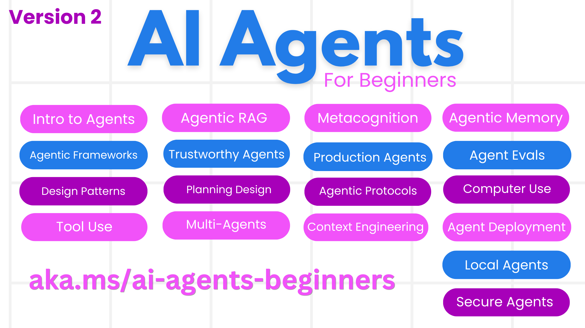

<!--
CO_OP_TRANSLATOR_METADATA:
{
  "original_hash": "6a1ba0bd2cbfa4db17890fa34776225c",
  "translation_date": "2025-10-24T09:00:42+00:00",
  "source_file": "README.md",
  "language_code": "pl"
}
-->
# Kurs AI Agents dla Początkujących

## Kurs uczący wszystkiego, co musisz wiedzieć, aby zacząć budować AI Agents

### 🌐 Wsparcie dla wielu języków

#### Obsługiwane przez GitHub Action (Automatyczne i zawsze aktualne)

<!-- CO-OP TRANSLATOR LANGUAGES TABLE START -->
[Arabski](../ar/README.md) | [Bengalski](../bn/README.md) | [Bułgarski](../bg/README.md) | [Birmański (Myanmar)](../my/README.md) | [Chiński (Uproszczony)](../zh/README.md) | [Chiński (Tradycyjny, Hongkong)](../hk/README.md) | [Chiński (Tradycyjny, Makau)](../mo/README.md) | [Chiński (Tradycyjny, Tajwan)](../tw/README.md) | [Chorwacki](../hr/README.md) | [Czeski](../cs/README.md) | [Duński](../da/README.md) | [Holenderski](../nl/README.md) | [Estoński](../et/README.md) | [Fiński](../fi/README.md) | [Francuski](../fr/README.md) | [Niemiecki](../de/README.md) | [Grecki](../el/README.md) | [Hebrajski](../he/README.md) | [Hindi](../hi/README.md) | [Węgierski](../hu/README.md) | [Indonezyjski](../id/README.md) | [Włoski](../it/README.md) | [Japoński](../ja/README.md) | [Koreański](../ko/README.md) | [Litewski](../lt/README.md) | [Malajski](../ms/README.md) | [Marathi](../mr/README.md) | [Nepalski](../ne/README.md) | [Norweski](../no/README.md) | [Perski (Farsi)](../fa/README.md) | [Polski](./README.md) | [Portugalski (Brazylia)](../br/README.md) | [Portugalski (Portugalia)](../pt/README.md) | [Pendżabski (Gurmukhi)](../pa/README.md) | [Rumuński](../ro/README.md) | [Rosyjski](../ru/README.md) | [Serbski (Cyrylica)](../sr/README.md) | [Słowacki](../sk/README.md) | [Słoweński](../sl/README.md) | [Hiszpański](../es/README.md) | [Suahili](../sw/README.md) | [Szwedzki](../sv/README.md) | [Tagalog (Filipiński)](../tl/README.md) | [Tamilski](../ta/README.md) | [Tajski](../th/README.md) | [Turecki](../tr/README.md) | [Ukraiński](../uk/README.md) | [Urdu](../ur/README.md) | [Wietnamski](../vi/README.md)
<!-- CO-OP TRANSLATOR LANGUAGES TABLE END -->

**Jeśli chcesz, aby dodatkowe języki były obsługiwane, lista dostępnych języków znajduje się [tutaj](https://github.com/Azure/co-op-translator/blob/main/getting_started/supported-languages.md)**

## 🌱 Pierwsze kroki

Ten kurs zawiera lekcje dotyczące podstaw budowania AI Agents. Każda lekcja porusza osobny temat, więc możesz zacząć od dowolnego miejsca!

Kurs jest dostępny w wielu językach. Przejdź do [dostępnych języków tutaj](../..). 

Jeśli po raz pierwszy budujesz modele generatywnej AI, zapoznaj się z naszym kursem [Generatywna AI dla Początkujących](https://aka.ms/genai-beginners), który zawiera 21 lekcji na temat budowania z GenAI.

Nie zapomnij [dodać gwiazdki (🌟) do tego repozytorium](https://docs.github.com/en/get-started/exploring-projects-on-github/saving-repositories-with-stars?WT.mc_id=academic-105485-koreyst) i [zrobić forka tego repozytorium](https://github.com/microsoft/ai-agents-for-beginners/fork), aby uruchomić kod.

### Poznaj innych uczących się, uzyskaj odpowiedzi na swoje pytania

Jeśli utkniesz lub masz pytania dotyczące budowania AI Agents, dołącz do naszego dedykowanego kanału Discord w [Azure AI Foundry Community Discord](https://aka.ms/ai-agents/discord).

### Co jest potrzebne

Każda lekcja w tym kursie zawiera przykłady kodu, które można znaleźć w folderze code_samples. Możesz [zrobić forka tego repozytorium](https://github.com/microsoft/ai-agents-for-beginners/fork), aby stworzyć własną kopię.  

Przykłady kodu w tych ćwiczeniach wykorzystują Azure AI Foundry i GitHub Model Catalogs do interakcji z modelami językowymi:

- [Modele GitHub](https://aka.ms/ai-agents-beginners/github-models) - Darmowe / Ograniczone
- [Azure AI Foundry](https://aka.ms/ai-agents-beginners/ai-foundry) - Wymagane konto Azure

Ten kurs wykorzystuje również następujące frameworki i usługi AI Agent od Microsoft:

- [Microsoft Agent Framework (MAF) - Nowość!](https://aka.ms/ai-agents-beginners/agent-framewrok)
- [Azure AI Agent Service](https://aka.ms/ai-agents-beginners/ai-agent-service)
- [Semantic Kernel](https://aka.ms/ai-agents-beginners/semantic-kernel)
- [AutoGen](https://aka.ms/ai-agents/autogen)

Więcej informacji na temat uruchamiania kodu dla tego kursu znajdziesz w [Konfiguracji kursu](./00-course-setup/README.md).

## 🙏 Chcesz pomóc?

Masz sugestie lub znalazłeś błędy w pisowni lub kodzie? [Zgłoś problem](https://github.com/microsoft/ai-agents-for-beginners/issues?WT.mc_id=academic-105485-koreyst) lub [Utwórz pull request](https://github.com/microsoft/ai-agents-for-beginners/pulls?WT.mc_id=academic-105485-koreyst)

## 📂 Każda lekcja zawiera

- Pisemną lekcję znajdującą się w README oraz krótki film
- Przykłady kodu w Pythonie wspierające Azure AI Foundry i Modele GitHub (Darmowe)
- Linki do dodatkowych zasobów, aby kontynuować naukę

## 🗃️ Lekcje

| **Lekcja**                                   | **Tekst i Kod**                                   | **Wideo**                                                  | **Dodatkowa Nauka**                                                                     |
|----------------------------------------------|--------------------------------------------------|------------------------------------------------------------|----------------------------------------------------------------------------------------|
| Wprowadzenie do AI Agents i przypadki użycia | [Link](./01-intro-to-ai-agents/README.md)        | [Wideo](https://youtu.be/3zgm60bXmQk?si=z8QygFvYQv-9WtO1)  | [Link](https://aka.ms/ai-agents-beginners/collection?WT.mc_id=academic-105485-koreyst) |
| Eksploracja frameworków AI Agentic           | [Link](./02-explore-agentic-frameworks/README.md)| [Wideo](https://youtu.be/ODwF-EZo_O8?si=Vawth4hzVaHv-u0H)  | [Link](https://aka.ms/ai-agents-beginners/collection?WT.mc_id=academic-105485-koreyst) |
| Zrozumienie wzorców projektowych AI Agentic  | [Link](./03-agentic-design-patterns/README.md)   | [Wideo](https://youtu.be/m9lM8qqoOEA?si=BIzHwzstTPL8o9GF)  | [Link](https://aka.ms/ai-agents-beginners/collection?WT.mc_id=academic-105485-koreyst) |
| Wzorzec projektowy użycia narzędzi           | [Link](./04-tool-use/README.md)                  | [Wideo](https://youtu.be/vieRiPRx-gI?si=2z6O2Xu2cu_Jz46N)  | [Link](https://aka.ms/ai-agents-beginners/collection?WT.mc_id=academic-105485-koreyst) |
| Agentic RAG                                  | [Link](./05-agentic-rag/README.md)               | [Wideo](https://youtu.be/WcjAARvdL7I?si=gKPWsQpKiIlDH9A3)  | [Link](https://aka.ms/ai-agents-beginners/collection?WT.mc_id=academic-105485-koreyst) |
| Budowanie wiarygodnych AI Agents             | [Link](./06-building-trustworthy-agents/README.md)| [Wideo](https://youtu.be/iZKkMEGBCUQ?si=jZjpiMnGFOE9L8OK ) | [Link](https://aka.ms/ai-agents-beginners/collection?WT.mc_id=academic-105485-koreyst) |
| Wzorzec projektowy planowania                | [Link](./07-planning-design/README.md)           | [Wideo](https://youtu.be/kPfJ2BrBCMY?si=6SC_iv_E5-mzucnC)  | [Link](https://aka.ms/ai-agents-beginners/collection?WT.mc_id=academic-105485-koreyst) |
| Wzorzec projektowy Multi-Agent               | [Link](./08-multi-agent/README.md)               | [Wideo](https://youtu.be/V6HpE9hZEx0?si=rMgDhEu7wXo2uo6g)  | [Link](https://aka.ms/ai-agents-beginners/collection?WT.mc_id=academic-105485-koreyst) |
| Wzorzec projektowy metapoznania              | [Link](./09-metacognition/README.md)             | [Wideo](https://youtu.be/His9R6gw6Ec?si=8gck6vvdSNCt6OcF)  | [Link](https://aka.ms/ai-agents-beginners/collection?WT.mc_id=academic-105485-koreyst) |
| AI Agents w produkcji                        | [Link](./10-ai-agents-production/README.md)      | [Wideo](https://youtu.be/l4TP6IyJxmQ?si=31dnhexRo6yLRJDl)  | [Link](https://aka.ms/ai-agents-beginners/collection?WT.mc_id=academic-105485-koreyst) |
| Korzystanie z protokołów agentowych (MCP, A2A i NLWeb) | [Link](./11-agentic-protocols/README.md)           | [Wideo](https://youtu.be/X-Dh9R3Opn8)                                 | [Link](https://aka.ms/ai-agents-beginners/collection?WT.mc_id=academic-105485-koreyst) |
| Inżynieria kontekstu dla agentów AI                   | [Link](./12-context-engineering/README.md)         | [Wideo](https://youtu.be/F5zqRV7gEag)                                 | [Link](https://aka.ms/ai-agents-beginners/collection?WT.mc_id=academic-105485-koreyst) |
| Zarządzanie pamięcią agentów                          | [Link](./13-agent-memory/README.md)     |      [Wideo](https://youtu.be/QrYbHesIxpw?si=vZkVwKrQ4ieCcIPx)                                                      |                                                                                        |
| Eksploracja Microsoft Agent Framework                 | [Link](./14-microsoft-agent-framework/README.md)                            |                                                            |                                                                                        |
| Tworzenie agentów do obsługi komputera (CUA)          | Wkrótce dostępne                            |                                                            |                                                                                        |
| Wdrażanie skalowalnych agentów                        | Wkrótce dostępne                            |                                                            |                                                                                        |
| Tworzenie lokalnych agentów AI                        | Wkrótce dostępne                               |                                                            |                                                                                        |
| Zabezpieczanie agentów AI                             | Wkrótce dostępne                               |                                                            |                                                                                        |

## 🎒 Inne kursy

Nasz zespół tworzy inne kursy! Sprawdź:

### Azure / Edge / MCP / Agenci

---

### Seria Generative AI

[-9333EA?style=for-the-badge&labelColor=E5E7EB&color=9333EA)](https://github.com/microsoft/Generative-AI-for-beginners-dotnet?WT.mc_id=academic-105485-koreyst)
[-C084FC?style=for-the-badge&labelColor=E5E7EB&color=C084FC)](https://github.com/microsoft/generative-ai-for-beginners-java?WT.mc_id=academic-105485-koreyst)
[-E879F9?style=for-the-badge&labelColor=E5E7EB&color=E879F9)](https://github.com/microsoft/generative-ai-with-javascript?WT.mc_id=academic-105485-koreyst)

---

### Podstawowe kursy

---

### Seria Copilot

## 🌟 Podziękowania dla społeczności

Dziękujemy [Shivamowi Goyalowi](https://www.linkedin.com/in/shivam2003/) za wkład w ważne przykłady kodu demonstrujące Agentic RAG. 

## Wkład

Ten projekt przyjmuje wkłady i sugestie. Większość wkładów wymaga od Ciebie zgody na Umowę Licencyjną Współtwórcy (CLA), która potwierdza, że masz prawo do udzielenia nam praw do korzystania z Twojego wkładu. Szczegóły znajdziesz na <https://cla.opensource.microsoft.com>.

Gdy przesyłasz pull request, bot CLA automatycznie określi, czy musisz dostarczyć CLA i odpowiednio oznaczy PR (np. sprawdzenie statusu, komentarz). Wystarczy, że postąpisz zgodnie z instrukcjami podanymi przez bota. Musisz to zrobić tylko raz dla wszystkich repozytoriów korzystających z naszego CLA.

Ten projekt przyjął [Kodeks postępowania Microsoft Open Source](https://opensource.microsoft.com/codeofconduct/).
Więcej informacji znajdziesz w [FAQ dotyczących kodeksu postępowania](https://opensource.microsoft.com/codeofconduct/faq/) lub skontaktuj się z [opencode@microsoft.com](mailto:opencode@microsoft.com) w przypadku dodatkowych pytań lub komentarzy.

## Znaki towarowe

Ten projekt może zawierać znaki towarowe lub logotypy projektów, produktów lub usług. Autoryzowane użycie znaków towarowych lub logotypów Microsoft podlega i musi być zgodne z
[Wytycznymi dotyczącymi znaków towarowych i marki Microsoft](https://www.microsoft.com/legal/intellectualproperty/trademarks/usage/general).
Użycie znaków towarowych lub logotypów Microsoft w zmodyfikowanych wersjach tego projektu nie może powodować zamieszania ani sugerować sponsorowania przez Microsoft.
Każde użycie znaków towarowych lub logotypów stron trzecich podlega politykom tych stron trzecich.

## Uzyskiwanie pomocy

Jeśli utkniesz lub masz pytania dotyczące tworzenia aplikacji AI, dołącz do:

Jeśli masz uwagi dotyczące produktu lub napotkałeś błędy podczas tworzenia, odwiedź:

---

**Zastrzeżenie**:  
Ten dokument został przetłumaczony za pomocą usługi tłumaczenia AI [Co-op Translator](https://github.com/Azure/co-op-translator). Chociaż staramy się zapewnić dokładność, prosimy pamiętać, że automatyczne tłumaczenia mogą zawierać błędy lub nieścisłości. Oryginalny dokument w jego rodzimym języku powinien być uznawany za autorytatywne źródło. W przypadku informacji krytycznych zaleca się skorzystanie z profesjonalnego tłumaczenia przez człowieka. Nie ponosimy odpowiedzialności za jakiekolwiek nieporozumienia lub błędne interpretacje wynikające z użycia tego tłumaczenia.