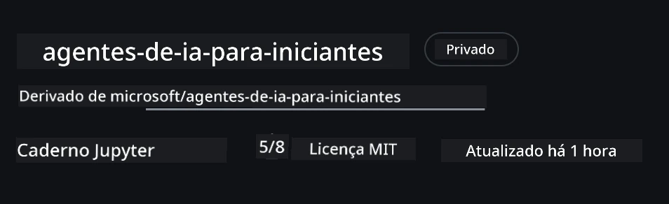
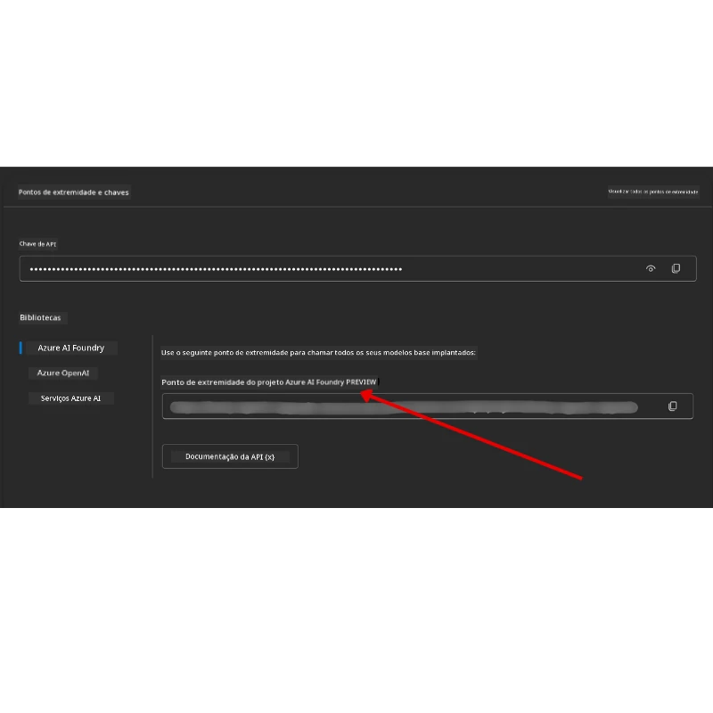

# Configuração do Curso

## Introdução

Esta lição abordará como executar os exemplos de código deste curso.

## Junte-se a Outros Alunos e Obtenha Ajuda

Antes de começar a clonar seu repositório, junte-se ao [canal do Discord AI Agents For Beginners](https://aka.ms/ai-agents/discord) para obter ajuda com a configuração, esclarecer dúvidas sobre o curso ou conectar-se com outros alunos.

## Clone ou Faça um Fork deste Repositório

Para começar, por favor clone ou faça um fork do repositório do GitHub. Isso criará sua própria versão do material do curso para que você possa executar, testar e ajustar o código!

Isso pode ser feito clicando no link para <a href="https://github.com/microsoft/ai-agents-for-beginners/fork" target="_blank">fazer fork do repositório</a>

Agora você deve ter sua própria versão forked deste curso no link a seguir:



### Clonagem Superficial (recomendada para workshop / Codespaces)

  >O repositório completo pode ser grande (~3 GB) ao fazer download do histórico completo e de todos os arquivos. Se você estiver participando apenas do workshop ou precisar apenas de algumas pastas de lições, uma clonagem superficial (ou clonagem esparsa) faz o download de muito menos.

#### Clonagem superficial rápida — histórico mínimo, todos os arquivos

Substitua `<your-username>` nos comandos abaixo pela URL do seu fork (ou pela URL upstream, se preferir).

Para clonar apenas o histórico do último commit (download pequeno):

```bash
git clone --depth 1 https://github.com/<your-username>/ai-agents-for-beginners.git
```

Para clonar um branch específico:

```bash
git clone --depth 1 --branch <branch-name> https://github.com/<your-username>/ai-agents-for-beginners.git
```

#### Clonagem Parcial (esparsa) — blobs mínimos + apenas pastas selecionadas

Isso usa clonagem parcial e sparse-checkout (requer Git 2.25+ e é recomendada uma versão moderna do Git com suporte à clonagem parcial):

```bash
git clone --depth 1 --filter=blob:none --sparse https://github.com/<your-username>/ai-agents-for-beginners.git
```

Acesse a pasta do repositório:

```bash
cd ai-agents-for-beginners
```

Depois especifique quais pastas deseja (exemplo abaixo mostra duas pastas):

```bash
git sparse-checkout set 00-course-setup 01-intro-to-ai-agents
```

Após clonar e verificar os arquivos, se você precisar apenas dos arquivos e quiser liberar espaço (sem histórico git), por favor delete os metadados do repositório (💀irreversível — você perderá toda funcionalidade do Git):

```bash
# zsh/bash
rm -rf .git
```

```powershell
# PowerShell
Remove-Item -Recurse -Force .git
```

#### Usando GitHub Codespaces (recomendado para evitar grandes downloads locais)

- Crie um novo Codespace para este repositório via a [interface do GitHub](https://github.com/codespaces).  

- No terminal do codespace recém-criado, execute um dos comandos de clonagem superficial/esparsa acima para trazer apenas as pastas de lição que você precisa para o espaço de trabalho do Codespace.
- Opcional: após clonar dentro do Codespaces, remova o .git para recuperar espaço extra (veja os comandos de remoção acima).
- Nota: Se preferir abrir o repositório diretamente no Codespaces (sem uma clonagem extra), saiba que o Codespaces construirá o ambiente devcontainer e ainda poderá provisionar mais do que você precisa.

#### Dicas

- Sempre substitua a URL do clone pelo seu fork se quiser editar/commitar.
- Se depois precisar de mais histórico ou arquivos, você pode buscá-los ou ajustar a sparse-checkout para incluir pastas adicionais.

## Executando o Código

Este curso oferece uma série de Jupyter Notebooks que você pode executar para obter experiência prática na construção de Agentes de IA.

Os exemplos de código usam **Microsoft Agent Framework (MAF)** com o `FoundryChatClient`, que se conecta ao **Microsoft Foundry Agent Service V2** (a API de Respostas) através do **Microsoft Foundry**.

Todos os notebooks Python estão rotulados como `*-python-agent-framework.ipynb`.

## Requisitos

- Python 3.12+
  - **NOTA**: Se você não tem Python3.12 instalado, certifique-se de instalá-lo. Depois crie seu ambiente virtual usando python3.12 para garantir que as versões corretas sejam instaladas a partir do arquivo requirements.txt.
  
    >Exemplo

    Crie o diretório do ambiente virtual Python:

    ```bash
    python -m venv venv
    ```

    Então ative o ambiente virtual para:

    ```bash
    # zsh/bash
    source venv/bin/activate
    ```
  
    ```dos
    # Command Prompt for Windows
    venv\Scripts\activate
    ```

- .NET 10+: Para os códigos de exemplo que usam .NET, garanta que você instalou o [.NET 10 SDK](https://dotnet.microsoft.com/download/dotnet/10.0) ou superior. Depois, verifique a versão do SDK instalado:

    ```bash
    dotnet --list-sdks
    ```

- **Azure CLI** — Necessário para autenticação. Instale em [aka.ms/installazurecli](https://aka.ms/installazurecli).
- **Assinatura Azure** — Para acesso ao Microsoft Foundry e Microsoft Foundry Agent Service.
- **Projeto Microsoft Foundry** — Um projeto com um modelo implantado (ex., `gpt-5-mini`). Veja [Passo 1](#passo-1-crie-um-projeto-microsoft-foundry) abaixo.

Incluímos um arquivo `requirements.txt` na raiz deste repositório que contém todos os pacotes Python necessários para executar os exemplos de código.

Você pode instalá-los executando o seguinte comando no seu terminal na raiz do repositório:

```bash
pip install -r requirements.txt
```

Recomendamos criar um ambiente virtual Python para evitar conflitos e problemas.

## Configure o VSCode

Certifique-se de que está usando a versão correta do Python no VSCode.


## Configurar Microsoft Foundry e Microsoft Foundry Agent Service

### Passo 1: Crie um Projeto Microsoft Foundry

Você precisa de um **hub** e **projeto** Microsoft Foundry com um modelo implantado para executar os notebooks.

1. Vá para [ai.azure.com](https://ai.azure.com) e entre com sua conta Azure.
2. Crie um **hub** (ou use um existente). Veja: [Visão geral dos recursos do Hub](https://learn.microsoft.com/azure/ai-foundry/concepts/ai-resources).
3. Dentro do hub, crie um **projeto**.
4. Implemente um modelo (ex., `gpt-5-mini`) em **Models + Endpoints** → **Deploy model**.

### Passo 2: Recupere o Endpoint do Projeto e o Nome da Implantação do Modelo

Do seu projeto no portal Microsoft Foundry:

- **Endpoint do Projeto** — Vá para a página **Overview** e copie a URL do endpoint.



- **Nome da Implantação do Modelo** — Vá para **Models + Endpoints**, selecione seu modelo implantado e copie o **Deployment name** (ex., `gpt-5-mini`).

### Passo 3: Entre no Azure com `az login`

A maioria dos notebooks autentica por meio do seu **login CLI do Azure** — usando `AzureCliCredential` ou `DefaultAzureCredential` (ambos pegam a sessão `az login`) do pacote `azure-identity` — então eles não requerem chaves de API. Algumas lições e integrações opcionais usam chaves de API; verifique os pré-requisitos de cada lição para quaisquer variáveis de ambiente adicionais. Isso exige que você esteja conectado via Azure CLI.

1. **Instale a Azure CLI** se ainda não fez isso: [aka.ms/installazurecli](https://aka.ms/installazurecli)

2. **Faça login** executando:

    ```bash
    az login
    ```

    Ou, se você estiver em um ambiente remoto/Codespace sem navegador:

    ```bash
    az login --use-device-code
    ```

3. **Selecione sua assinatura** se solicitado — escolha aquela que contém seu projeto Foundry.

4. **Verifique** se está conectado:

    ```bash
    az account show
    ```

> **Por que `az login`?** Os notebooks autentican usando `AzureCliCredential` (ou `DefaultAzureCredential`, que também reconhece seu login Azure CLI) do pacote `azure-identity`. Isso significa que sua sessão Azure CLI fornece as credenciais — sem chaves API ou segredos em seu arquivo `.env`. Essa é uma [melhor prática de segurança](https://learn.microsoft.com/azure/developer/ai/keyless-connections).

### Passo 4: Crie Seu Arquivo `.env`

Copie o arquivo de exemplo:

```bash
# zsh/bash
cp .env.example .env
```

```powershell
# PowerShell
Copy-Item .env.example .env
```

Abra `.env` e preencha esses dois valores:

```env
AZURE_AI_PROJECT_ENDPOINT=https://<your-project>.services.ai.azure.com/api/projects/<your-project-id>
AZURE_AI_MODEL_DEPLOYMENT_NAME=gpt-5-mini
```

| Variável | Onde encontrar |
|----------|-----------------|
| `AZURE_AI_PROJECT_ENDPOINT` | Portal Foundry → seu projeto → página **Overview** |
| `AZURE_AI_MODEL_DEPLOYMENT_NAME` | Portal Foundry → **Models + Endpoints** → nome do seu modelo implantado |

Isso é tudo para a maioria das lições! Os notebooks irão autenticar automaticamente através da sua sessão `az login`.

### Passo 5: Instale as Dependências Python

```bash
pip install -r requirements.txt
```

Recomendamos executar isso dentro do ambiente virtual que você criou anteriormente.

## Configuração Opcional: Azure AI Search (Lições 5 e 16)

Os notebooks da Lições 5 (Agentic RAG) e 16 funcionam imediatamente com uma **base de conhecimento em memória** — sem recursos Azure extras necessários. Se desejar integrá-los com um índice real do **Azure AI Search**, note que o **notebook da Lição 16 atualmente usa autenticação baseada em chave**: ele muda da busca em memória para Azure AI Search apenas quando **ambos** `AZURE_SEARCH_SERVICE_ENDPOINT` **e** `AZURE_SEARCH_API_KEY` estão configurados, caso contrário permanece usando busca em memória — então para usá-lo com um índice real você deve definir também a chave administrativa. A autenticação sem chave com Microsoft Entra ID (RBAC) é a abordagem recomendada para seu próprio código de produção, consistente com o fluxo `az login` usado em todo o curso.

Os passos RBAC abaixo aplicam-se aos exemplos do guia de configuração e ao seu próprio código. Eles não habilitam autenticação sem chave no notebook da Lição 16; esta ainda exige ambos endpoint e chave administrativa para usar Azure AI Search.

1. **Habilite acesso baseado em função** no seu serviço de busca:

    ```bash
    az search service update --name <service-name> --resource-group <resource-group> --auth-options aadOrApiKey
    ```

2. **Atribua a si mesmo as funções necessárias** (criar/carregar índices e consultar):

    ```bash
    az role assignment create --assignee <your-user-or-principal-id> --role "Search Service Contributor" --scope $(az search service show -g <resource-group> -n <service-name> --query id -o tsv)
    az role assignment create --assignee <your-user-or-principal-id> --role "Search Index Data Contributor" --scope $(az search service show -g <resource-group> -n <service-name> --query id -o tsv)
    ```

3. **Adicione o endpoint** ao seu arquivo `.env`:

| Variável | Onde encontrar |
|----------|-----------------|
| `AZURE_SEARCH_SERVICE_ENDPOINT` | Portal Azure → seu recurso **Azure AI Search** → **Overview** → URL |
| `AZURE_SEARCH_API_KEY` | Necessário (juntamente com o endpoint) para habilitar Azure AI Search na Lição 16, que usa autenticação por chave. Portal Azure → **Configurações** → **Chaves** → chave administrativa primária |

> **Por que sem chave?** Chaves administrativas concedem acesso completo ao serviço de busca e podem vazar via arquivos `.env`. Com RBAC, sua identidade `az login` é usada, o mesmo padrão sem chave Entra ID utilizado pelos notebooks do curso (via `AzureCliCredential` / `DefaultAzureCredential`). Veja [Conectar ao Azure AI Search usando funções](https://learn.microsoft.com/azure/search/search-security-rbac).

Veja o [guia de configuração Azure AI Search](./AzureSearch.md) para exemplos completos de criação de índices em Python e .NET.

## Configuração Adicional para Lições que Chamam Azure OpenAI Diretamente (Lições 6 e 8)

Alguns notebooks nas lições 6 e 8 chamam **Azure OpenAI** diretamente (usando a **Responses API**) ao invés de passar por um projeto Microsoft Foundry. Estes exemplos usavam anteriormente Modelos GitHub, que estão obsoletos e não suportam a Responses API. Adicione estas variáveis ao seu arquivo `.env`:

| Variável | Onde encontrar |
|----------|-----------------|
| `AZURE_OPENAI_ENDPOINT` | Portal Azure → seu recurso **Azure OpenAI** → **Chaves e Endpoint** → Endpoint (ex. `https://<your-resource>.openai.azure.com`) |
| `AZURE_OPENAI_DEPLOYMENT` | Nome do seu modelo implantado (ex. `gpt-5-mini`) que suporta a Responses API |
| `AZURE_OPENAI_API_KEY` | Opcional — somente se usar autenticação por chave em vez de `az login` / Entra ID |

> A Responses API usa o endpoint estável `/openai/v1/`, então não é necessário `api-version`. Faça login com `az login` para usar autenticação sem chave Entra ID.

## Provedor Alternativo: MiniMax (Compatível com OpenAI)

[MiniMax](https://platform.minimaxi.com/) fornece modelos de contexto grande (até 204K tokens) por meio de uma API compatível com OpenAI. Como o `OpenAIChatClient` do Microsoft Agent Framework funciona com qualquer endpoint compatível com OpenAI, você pode usar o MiniMax como uma alternativa direta para as lições que utilizam `OpenAIChatClient`.

Adicione estas variáveis em seu arquivo `.env`:

| Variável | Onde encontrar |
|----------|-----------------|
| `MINIMAX_API_KEY` | [MiniMax Platform](https://platform.minimaxi.com/) → Chaves de API |
| `MINIMAX_BASE_URL` | Use `https://api.minimax.io/v1` (valor padrão) |
| `MINIMAX_MODEL_ID` | Nome do modelo para usar (ex., `MiniMax-M3`) |

**Modelos exemplo**: `MiniMax-M3` (recomendado), `MiniMax-M2.7`, `MiniMax-M2.7-highspeed` (respostas mais rápidas). Os nomes e disponibilidade dos modelos podem mudar com o tempo, e o acesso a um determinado modelo pode depender da sua conta.

Os exemplos de código que usam `OpenAIChatClient` (ex., fluxo da lição 14 para reserva de hotel) detectarão automaticamente e usarão sua configuração MiniMax quando `MINIMAX_API_KEY` estiver definida.


## Provedor Alternativo: Novita AI (Compatível com OpenAI)

[Novita AI](https://novita.ai/llm-api) oferece uma API compatível com OpenAI para LLMs open-source e de ponta (DeepSeek, Llama, Qwen e mais). Como o `OpenAIChatClient` do Microsoft Agent Framework funciona com qualquer endpoint compatível com OpenAI, você pode usar o Novita AI como uma alternativa direta ao Azure OpenAI ou OpenAI.

Adicione essas variáveis ao seu arquivo `.env`:

| Variável | Onde encontrá-la |
|----------|-----------------|
| `NOVITA_API_KEY` | [Novita AI Dashboard](https://novita.ai/settings/key-management) → Chaves da API |
| `NOVITA_BASE_URL` | Use `https://api.novita.ai/openai/v1` (valor padrão) |
| `NOVITA_MODEL_ID` | Nome do modelo a ser usado (ex: `moonshotai/kimi-k3`) |

**Modelos de exemplo**: `moonshotai/kimi-k3`, `zai-org/glm-5.2`, `deepseek/deepseek-v4-flash-0731`. Novita AI também hospeda muitas outras famílias de modelos open-source (Llama, Qwen, GLM e mais) — confira a [biblioteca de modelos Novita AI](https://novita.ai/llm-api) para a lista atual de modelos disponíveis e seus IDs.

As amostras atuais não consomem automaticamente as variáveis `NOVITA_*`. Para usar Novita AI, passe esses valores explicitamente ao construir o `OpenAIChatClient` na amostra que estiver executando.

## Provedor Alternativo: Foundry Local (Execute Modelos Localmente)

[Foundry Local](https://foundrylocal.ai) é um runtime leve que baixa, gerencia e oferece modelos de linguagem **inteiramente na sua própria máquina** através de uma API compatível com OpenAI — sem necessidade de nuvem.

Como o `OpenAIChatClient` do Microsoft Agent Framework funciona com qualquer endpoint compatível com OpenAI, o Foundry Local é uma alternativa local direta ao Azure OpenAI.

**1. Instale o Foundry Local**

```bash
# Windows
winget install Microsoft.FoundryLocal

# macOS
brew install foundrylocal
```

**2. Baixe e execute um modelo** (isso também inicia o serviço local):

```bash
foundry model list          # ver modelos disponíveis
foundry model run phi-4-mini
```

**3. Instale o SDK Python** usado para descobrir o endpoint local:

```bash
pip install foundry-local-sdk
```

**4. Aponte o Microsoft Agent Framework para seu modelo local:**

```python
from foundry_local import FoundryLocalManager
from agent_framework.openai import OpenAIChatClient

# Baixa (se necessário) e serve o modelo localmente, então descobre o endpoint/porta.
manager = FoundryLocalManager("phi-4-mini")

chat_client = OpenAIChatClient(
    base_url=manager.endpoint,      # por exemplo http://localhost:<porta>/v1
    api_key=manager.api_key,        # sempre "not-required" para Foundry Local
    model_id=manager.get_model_info("phi-4-mini").id,
)

agent = chat_client.as_agent(
    name="LocalAgent",
    instructions="You are a helpful assistant running fully on-device.",
)
```

> **Nota:** Foundry Local expõe um endpoint de **Chat Completions** compatível com OpenAI. Use-o para desenvolvimento local e cenários offline. Para o conjunto completo de recursos da **API de Respostas** (conversas com estado, etc.), use Azure OpenAI ou um projeto Microsoft Foundry.

## Configuração Adicional para a Aula 8 (Fluxo de Trabalho de Grounding com Bing)

O notebook do fluxo condicional da aula 8 usa **grounding do Bing** via Microsoft Foundry. Se planeja executar essa amostra, adicione esta variável ao seu arquivo `.env`:

| Variável | Onde encontrá-la |
|----------|-----------------|
| `BING_CONNECTION_ID` | Portal Microsoft Foundry → seu projeto → **Management** → **Connected resources** → sua conexão Bing → copie o ID da conexão |

## Solução de Problemas

### Erros de Verificação de Certificado SSL no macOS

Se você estiver no macOS e encontrar um erro como:

```plaintext
ssl.SSLCertVerificationError: [SSL: CERTIFICATE_VERIFY_FAILED] certificate verify failed: self-signed certificate in certificate chain
```

Este é um problema conhecido com Python no macOS onde os certificados SSL do sistema não são confiados automaticamente. Tente as seguintes soluções na ordem:

**Opção 1: Execute o script Install Certificates do Python (recomendado)**

```bash
# Substitua 3.XX pela versão do Python instalada (por exemplo, 3.12 ou 3.13):
/Applications/Python\ 3.XX/Install\ Certificates.command
```

**Opção 2: Use `connection_verify=False` no seu notebook (apenas para notebooks GitHub Models)**

No notebook da Aula 6 (`06-building-trustworthy-agents/code_samples/06-system-message-framework.ipynb`), uma solução alternativa comentada já está incluída. Descomente `connection_verify=False` quando encontrar erros de certificado:

```python
client = ChatCompletionsClient(
    endpoint=endpoint,
    credential=AzureKeyCredential(token),
    connection_verify=False,  # Desative a verificação SSL se você encontrar erros de certificado
)
```

> **⚠️ Aviso:** Desativar a verificação SSL (`connection_verify=False`) reduz a segurança ao pular a validação do certificado. Use isso apenas como solução temporária em ambientes de desenvolvimento. Nunca use em produção.

**Opção 3: Instale e use `truststore`**

```bash
pip install truststore
```

Em seguida, adicione o seguinte no início do seu notebook ou script antes de fazer qualquer chamada de rede:

```python
import truststore
truststore.inject_into_ssl()
```

## Preso em Algum Lugar?

Se você tiver qualquer problema ao executar esta configuração, entre em nosso <a href="https://discord.gg/kzRShWzttr" target="_blank">Discord da Comunidade Azure AI</a> ou <a href="https://github.com/microsoft/ai-agents-for-beginners/issues?WT.mc_id=academic-105485-koreyst" target="_blank">crie uma issue</a>.

## Próxima Aula

Agora você está pronto para executar o código deste curso. Feliz aprendizado sobre o mundo dos Agentes de IA!

[Introdução a Agentes de IA e Casos de Uso de Agentes](../01-intro-to-ai-agents/README.md)

---

<!-- CO-OP TRANSLATOR DISCLAIMER START -->
**Aviso Legal**:
Este documento foi traduzido usando o serviço de tradução por IA [Co-op Translator](https://github.com/Azure/co-op-translator). Embora nos esforcemos pela precisão, por favor, esteja ciente de que traduções automatizadas podem conter erros ou imprecisões. O documento original em seu idioma nativo deve ser considerado a fonte autorizada. Para informações críticas, recomenda-se tradução profissional humana. Não nos responsabilizamos por quaisquer mal-entendidos ou interpretações incorretas decorrentes do uso desta tradução.
<!-- CO-OP TRANSLATOR DISCLAIMER END -->