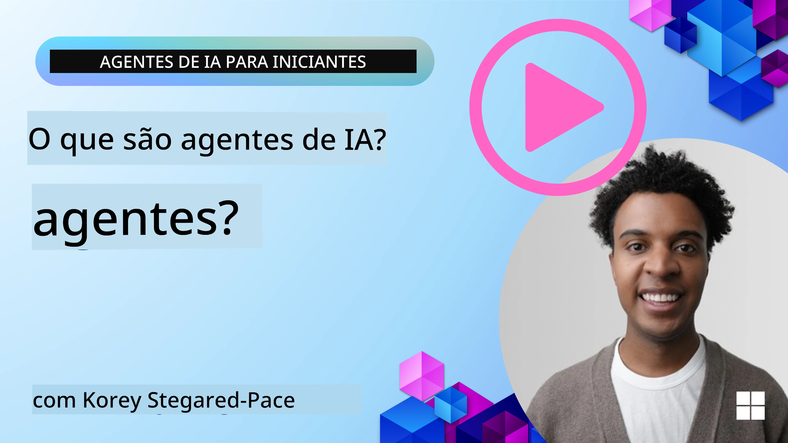
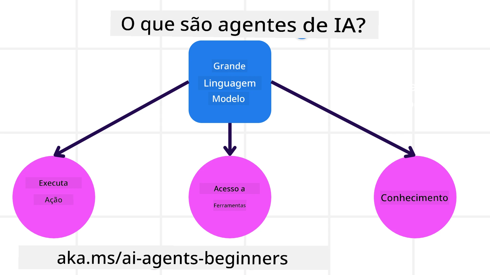
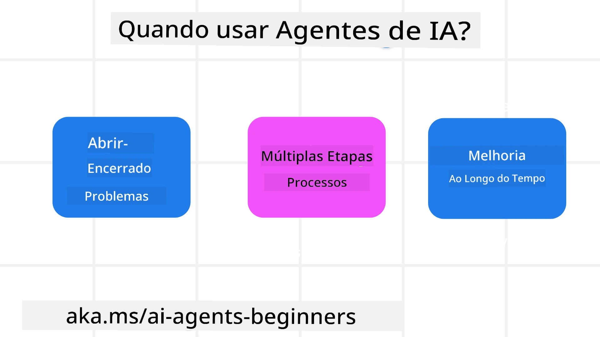

> _(Clique na imagem acima para ver o vídeo desta aula)_

# Introdução aos Agentes de IA e seus Casos de Uso

Bem-vindo ao curso "Agentes de IA para Iniciantes"! Este curso fornece conhecimentos fundamentais e exemplos práticos para construir Agentes de IA.

Participe da <a href="https://discord.gg/kzRShWzttr" target="_blank">Comunidade Azure AI no Discord</a> para conhecer outros aprendizes e construtores de Agentes de IA e tirar quaisquer dúvidas que você tenha sobre este curso.

Para começar este curso, iniciamos entendendo melhor o que são Agentes de IA e como podemos usá-los nas aplicações e fluxos de trabalho que construímos.

## Introdução

Esta aula aborda:

- O que são Agentes de IA e quais são os diferentes tipos de agentes?
- Quais casos de uso são mais adequados para Agentes de IA e como eles podem nos ajudar?
- Quais são alguns dos blocos de construção básicos ao projetar soluções baseadas em agentes?

## Objetivos de Aprendizagem
Após concluir esta aula, você deverá ser capaz de:

- Compreender os conceitos de Agentes de IA e como eles diferem de outras soluções de IA.
- Aplicar Agentes de IA da forma mais eficiente.
- Projetar soluções baseadas em agentes de forma produtiva tanto para usuários quanto para clientes.

## Definindo Agentes de IA e Tipos de Agentes de IA

### O que são Agentes de IA?

Agentes de IA são **sistemas** que permitem que **Modelos de Linguagem de Grande Porte (LLMs)** **executem ações** ao ampliar suas capacidades dando aos LLMs **acesso a ferramentas** e **conhecimento**.

Vamos dividir essa definição em partes menores:

- **Sistema** - É importante pensar nos agentes não apenas como um único componente, mas como um sistema de muitos componentes. No nível básico, os componentes de um Agente de IA são:
  - **Ambiente** - O espaço definido onde o Agente de IA está operando. Por exemplo, se tivéssemos um agente de reservas de viagem, o ambiente poderia ser o sistema de reservas de viagem que o Agente de IA usa para completar tarefas.
  - **Sensores** - Os ambientes têm informações e fornecem feedback. Agentes de IA usam sensores para coletar e interpretar essas informações sobre o estado atual do ambiente. No exemplo do Agente de Reservas de Viagem, o sistema de reservas pode fornecer informações como disponibilidade de hotéis ou preços de voos.
  - **Atuadores** - Depois que o Agente de IA recebe o estado atual do ambiente, para a tarefa corrente o agente determina qual ação realizar para alterar o ambiente. Para o agente de reservas de viagem, pode ser reservar um quarto disponível para o usuário.

**Modelos de Linguagem de Grande Porte** - O conceito de agentes existia antes da criação dos LLMs. A vantagem de construir Agentes de IA com LLMs é a capacidade deles de interpretar a linguagem humana e dados. Essa capacidade permite que os LLMs interpretem informações ambientais e definam um plano para alterar o ambiente.

**Executar Ações** - Fora dos sistemas de Agentes de IA, os LLMs estão limitados a situações em que a ação é gerar conteúdo ou informação com base no prompt do usuário. Dentro dos sistemas de Agentes de IA, os LLMs podem realizar tarefas interpretando a solicitação do usuário e usando ferramentas disponíveis em seu ambiente.

**Acesso a Ferramentas** - Quais ferramentas o LLM tem acesso é definido por 1) o ambiente em que ele opera e 2) o desenvolvedor do Agente de IA. No nosso exemplo do agente de viagens, as ferramentas do agente são limitadas pelas operações disponíveis no sistema de reservas, e/ou o desenvolvedor pode limitar o acesso do agente a ferramentas relacionadas a voos.

**Memória+Conhecimento** - A memória pode ser de curto prazo no contexto da conversa entre o usuário e o agente. Em longo prazo, além da informação fornecida pelo ambiente, Agentes de IA também podem recuperar conhecimento de outros sistemas, serviços, ferramentas e até outros agentes. No exemplo do agente de viagens, esse conhecimento poderia ser as informações sobre as preferências de viagem do usuário localizadas em um banco de dados de clientes.

### Os diferentes tipos de agentes

Agora que temos uma definição geral de Agentes de IA, vejamos alguns tipos específicos de agentes e como eles seriam aplicados a um agente de reservas de viagem.

| **Tipo de Agente**                | **Descrição**                                                                                                                       | **Exemplo**                                                                                                                                                                                                                   |
| ----------------------------- | ------------------------------------------------------------------------------------------------------------------------------------- | ----------------------------------------------------------------------------------------------------------------------------------------------------------------------------------------------------------------------------- |
| **Agentes de Reflexo Simples**      | Executam ações imediatas baseadas em regras predefinidas.                                                                                  | O agente de viagens interpreta o contexto do e-mail e encaminha reclamações de viagem para o atendimento ao cliente.                                                                                                                          |
| **Agentes de Reflexo Baseados em Modelo** | Executam ações com base em um modelo do mundo e nas mudanças desse modelo.                                                              | O agente de viagens prioriza rotas com mudanças de preço significativas com base no acesso a dados históricos de preços.                                                                                                             |
| **Agentes Orientados a Objetivos**         | Criam planos para atingir objetivos específicos interpretando o objetivo e determinando ações para alcançá-lo.                                  | O agente de viagens reserva uma jornada determinando os arranjos de viagem necessários (carro, transporte público, voos) do local atual até o destino.                                                                                |
| **Agentes Baseados em Utilidade**      | Consideram preferências e ponderam compensações numericamente para determinar como alcançar objetivos.                                               | O agente de viagens maximiza a utilidade ponderando conveniência vs. custo ao reservar uma viagem.                                                                                                                                          |
| **Agentes de Aprendizagem**           | Melhoram ao longo do tempo respondendo ao feedback e ajustando suas ações conforme necessário.                                                        | O agente de viagens melhora usando o feedback dos clientes de pesquisas pós-viagem para fazer ajustes em reservas futuras.                                                                                                               |
| **Agentes Hierárquicos**       | Apresentam múltiplos agentes em um sistema em níveis, com agentes de nível superior dividindo tarefas em subtarefas para que agentes de nível inferior as completem. | O agente de viagens cancela uma viagem dividindo a tarefa em subtarefas (por exemplo, cancelar reservas específicas) e fazendo com que agentes de nível inferior as completem, reportando de volta ao agente de nível superior.                                     |
| **Sistemas Multiagente (MAS)** | Agentes completam tarefas de forma independente, seja cooperativamente ou competitivamente.                                                           | Cooperativo: Vários agentes reservam serviços de viagem específicos, como hotéis, voos e entretenimento. Competitivo: Vários agentes gerenciam e competem por um calendário de reservas de hotel compartilhado para alocar clientes no hotel. |

## Quando Usar Agentes de IA

Na seção anterior, usamos o caso de uso do Agente de Viagens para explicar como os diferentes tipos de agentes podem ser usados em diferentes cenários de reserva de viagens. Continuaremos a usar essa aplicação ao longo do curso.

Vamos ver os tipos de casos de uso para os quais os Agentes de IA são mais indicados:

- **Problemas Abertos** - permitir que o LLM determine os passos necessários para completar uma tarefa porque nem sempre é possível codificá-los rigidamente em um fluxo de trabalho.
- **Processos de Múltiplas Etapas** - tarefas que exigem um nível de complexidade no qual o Agente de IA precisa usar ferramentas ou informações ao longo de várias interações em vez de uma recuperação única.  
- **Melhoria ao Longo do Tempo** - tarefas em que o agente pode melhorar ao longo do tempo ao receber feedback do seu ambiente ou dos usuários, a fim de fornecer melhor utilidade.

Abordamos mais considerações sobre o uso de Agentes de IA na lição Construindo Agentes de IA Confiáveis.

## Noções Básicas de Soluções Baseadas em Agentes

### Desenvolvimento de Agentes

O primeiro passo ao projetar um sistema de Agente de IA é definir as ferramentas, ações e comportamentos. Neste curso, focamos no uso do **Azure AI Agent Service** para definir nossos Agentes. Ele oferece recursos como:

- Seleção de Modelos Abertos como OpenAI, Mistral e Llama
- Uso de Dados Licenciados por meio de provedores como Tripadvisor
- Uso de ferramentas padronizadas OpenAPI 3.0

### Padrões baseados em agentes

A comunicação com LLMs é feita por meio de prompts. Dada a natureza semi-autônoma dos Agentes de IA, nem sempre é possível ou necessário reemitir prompts manualmente ao LLM após uma mudança no ambiente. Usamos **padrões baseados em agentes** que nos permitem solicitar ao LLM em múltiplas etapas de maneira mais escalável.

Este curso está dividido em alguns dos padrões baseados em agentes atualmente populares.

### Frameworks baseados em agentes

Frameworks baseados em agentes permitem que desenvolvedores implementem padrões baseados em agentes por meio de código. Esses frameworks oferecem templates, plugins e ferramentas para uma melhor colaboração entre Agentes de IA. Esses benefícios fornecem capacidades para melhor observabilidade e solução de problemas de sistemas de Agentes de IA.

Neste curso, exploraremos o Microsoft Agent Framework (MAF) para construir agentes de IA prontos para produção.

## Exemplos de Código

- Python: [Framework do Agente](./code_samples/01-python-agent-framework.ipynb)
- .NET: [Framework do Agente](./code_samples/01-dotnet-agent-framework.md)

## Tem Mais Perguntas sobre Agentes de IA?

Participe do [Microsoft Foundry no Discord](https://aka.ms/ai-agents/discord) para encontrar outros aprendizes, participar de horas de atendimento e tirar suas dúvidas sobre Agentes de IA.

## Lição Anterior

[Configuração do Curso](../00-course-setup/README.md)

## Próxima Lição

[Explorando Frameworks baseados em agentes](../02-explore-agentic-frameworks/README.md)

---

<!-- CO-OP TRANSLATOR DISCLAIMER START -->
Aviso legal:
Este documento foi traduzido usando o serviço de tradução por IA [Co-op Translator](https://github.com/Azure/co-op-translator). Embora nos esforcemos para garantir a precisão, esteja ciente de que traduções automatizadas podem conter erros ou imprecisões. O documento original, em seu idioma nativo, deve ser considerado a fonte autoritativa. Para informações críticas, recomenda-se tradução profissional humana. Não nos responsabilizamos por quaisquer mal-entendidos ou interpretações incorretas decorrentes do uso desta tradução.
<!-- CO-OP TRANSLATOR DISCLAIMER END -->