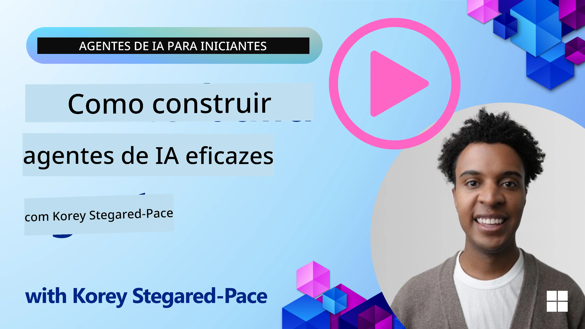
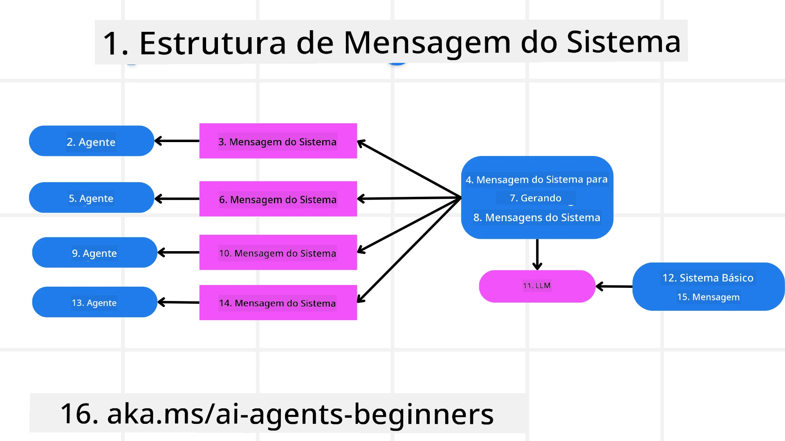
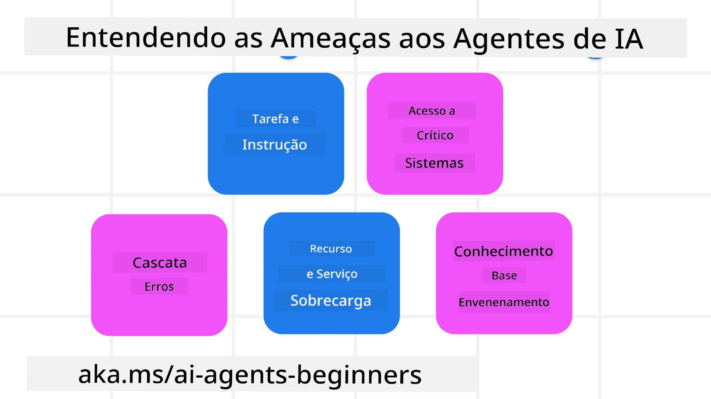
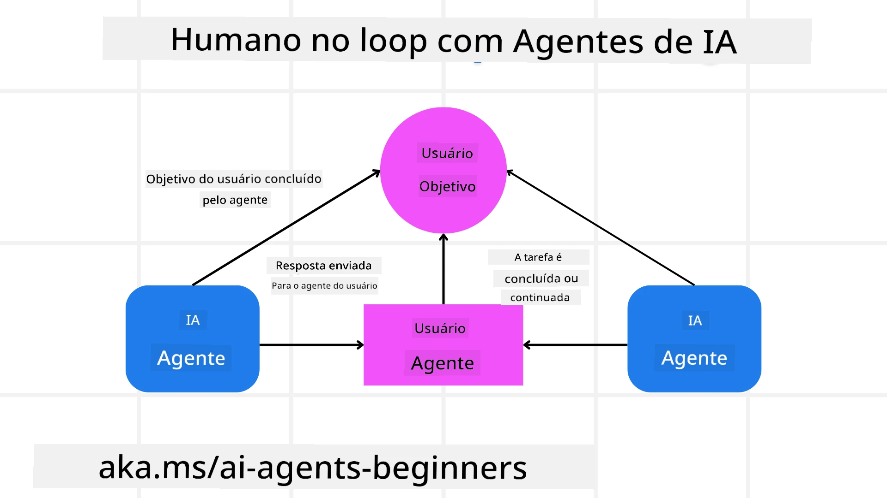

[](https://youtu.be/iZKkMEGBCUQ?si=Q-kEbcyHUMPoHp8L)

> _(Clique na imagem acima para assistir ao vídeo desta aula)_

# Construindo Agentes de IA Confiáveis

## Introdução

Esta lição abordará:

- Como construir e implantar Agentes de IA seguros e eficazes
- Considerações importantes de segurança ao desenvolver Agentes de IA
- Como manter a privacidade dos dados e do usuário ao desenvolver Agentes de IA

## Objetivos de Aprendizagem

Após concluir esta lição, você saberá como:

- Identificar e mitigar riscos ao criar Agentes de IA
- Implementar medidas de segurança para garantir que os dados e o acesso sejam gerenciados adequadamente
- Criar Agentes de IA que mantenham a privacidade dos dados e proporcionem uma experiência de usuário de qualidade

## Segurança

Vamos primeiro analisar como construir aplicações agentivas seguras. Segurança significa que o agente de IA atua conforme projetado. Como desenvolvedores de aplicações agentivas, temos métodos e ferramentas para maximizar a segurança:

### Construindo uma Estrutura de Mensagem de Sistema

Se você já construiu uma aplicação de IA usando Modelos de Linguagem Ampla (LLMs), sabe a importância de projetar um prompt de sistema robusto ou mensagem de sistema. Esses prompts estabelecem as regras meta, instruções e diretrizes sobre como o LLM irá interagir com o usuário e os dados.

Para Agentes de IA, o prompt de sistema é ainda mais importante, pois os Agentes de IA precisarão de instruções altamente específicas para completar as tarefas que projetamos para eles.

Para criar prompts de sistema escaláveis, podemos usar uma estrutura de mensagem de sistema para construir um ou mais agentes em nossa aplicação:



#### Passo 1: Criar uma Mensagem de Sistema Meta

O prompt meta será usado por um LLM para gerar os prompts de sistema para os agentes que criarmos. Nós o projetamos como um modelo para que possamos criar vários agentes de forma eficiente, se necessário.

Aqui está um exemplo de uma mensagem de sistema meta que forneceríamos ao LLM:

```plaintext
You are an expert at creating AI agent assistants. 
You will be provided a company name, role, responsibilities and other
information that you will use to provide a system prompt for.
To create the system prompt, be descriptive as possible and provide a structure that a system using an LLM can better understand the role and responsibilities of the AI assistant. 
```

#### Passo 2: Criar um prompt básico

O próximo passo é criar um prompt básico para descrever o Agente de IA. Você deve incluir o papel do agente, as tarefas que o agente realizará e quaisquer outras responsabilidades do agente.

Aqui está um exemplo:

```plaintext
You are a travel agent for Contoso Travel that is great at booking flights for customers. To help customers you can perform the following tasks: lookup available flights, book flights, ask for preferences in seating and times for flights, cancel any previously booked flights and alert customers on any delays or cancellations of flights.  
```

#### Passo 3: Fornecer Mensagem Básica de Sistema para o LLM

Agora podemos otimizar esta mensagem de sistema fornecendo a mensagem de sistema meta como a mensagem de sistema e nossa mensagem básica de sistema.

Isso produzirá uma mensagem de sistema melhor projetada para guiar nossos agentes de IA:

```markdown
**Company Name:** Contoso Travel  
**Role:** Travel Agent Assistant

**Objective:**  
You are an AI-powered travel agent assistant for Contoso Travel, specializing in booking flights and providing exceptional customer service. Your main goal is to assist customers in finding, booking, and managing their flights, all while ensuring that their preferences and needs are met efficiently.

**Key Responsibilities:**

1. **Flight Lookup:**
    
    - Assist customers in searching for available flights based on their specified destination, dates, and any other relevant preferences.
    - Provide a list of options, including flight times, airlines, layovers, and pricing.
2. **Flight Booking:**
    
    - Facilitate the booking of flights for customers, ensuring that all details are correctly entered into the system.
    - Confirm bookings and provide customers with their itinerary, including confirmation numbers and any other pertinent information.
3. **Customer Preference Inquiry:**
    
    - Actively ask customers for their preferences regarding seating (e.g., aisle, window, extra legroom) and preferred times for flights (e.g., morning, afternoon, evening).
    - Record these preferences for future reference and tailor suggestions accordingly.
4. **Flight Cancellation:**
    
    - Assist customers in canceling previously booked flights if needed, following company policies and procedures.
    - Notify customers of any necessary refunds or additional steps that may be required for cancellations.
5. **Flight Monitoring:**
    
    - Monitor the status of booked flights and alert customers in real-time about any delays, cancellations, or changes to their flight schedule.
    - Provide updates through preferred communication channels (e.g., email, SMS) as needed.

**Tone and Style:**

- Maintain a friendly, professional, and approachable demeanor in all interactions with customers.
- Ensure that all communication is clear, informative, and tailored to the customer's specific needs and inquiries.

**User Interaction Instructions:**

- Respond to customer queries promptly and accurately.
- Use a conversational style while ensuring professionalism.
- Prioritize customer satisfaction by being attentive, empathetic, and proactive in all assistance provided.

**Additional Notes:**

- Stay updated on any changes to airline policies, travel restrictions, and other relevant information that could impact flight bookings and customer experience.
- Use clear and concise language to explain options and processes, avoiding jargon where possible for better customer understanding.

This AI assistant is designed to streamline the flight booking process for customers of Contoso Travel, ensuring that all their travel needs are met efficiently and effectively.

```

#### Passo 4: Iterar e Melhorar

O valor desta estrutura de mensagem de sistema é conseguir escalar a criação de mensagens de sistema para múltiplos agentes com mais facilidade, além de melhorar suas mensagens de sistema ao longo do tempo. É raro que você tenha uma mensagem de sistema que funcione logo na primeira vez para seu caso de uso completo. Ser capaz de fazer pequenos ajustes e melhorias alterando a mensagem básica de sistema e executando-a no sistema permitirá comparar e avaliar resultados.

## Entendendo Ameaças

Para construir agentes de IA confiáveis, é importante entender e mitigar os riscos e ameaças ao seu agente de IA. Vamos analisar apenas algumas das diferentes ameaças aos agentes de IA e como você pode planejar e se preparar melhor para elas.



### Tarefa e Instrução

**Descrição:** Atacantes tentam mudar as instruções ou objetivos do agente de IA por meio de prompts ou manipulação de entradas.

**Mitigação:** Execute verificações de validação e filtros de entrada para detectar prompts potencialmente perigosos antes que sejam processados pelo Agente de IA. Como esses ataques normalmente requerem interação frequente com o Agente, limitar o número de interações em uma conversa é outra forma de prevenir esse tipo de ataque.

### Acesso a Sistemas Críticos

**Descrição:** Se um agente de IA tiver acesso a sistemas e serviços que armazenam dados sensíveis, atacantes podem comprometer a comunicação entre o agente e esses serviços. Isso pode ser ataques diretos ou tentativas indiretas de obter informações sobre esses sistemas por meio do agente.

**Mitigação:** Os agentes de IA devem ter acesso aos sistemas apenas quando necessário, para evitar esse tipo de ataque. A comunicação entre o agente e o sistema também deve ser segura. Implementar autenticação e controle de acesso é outra forma de proteger essa informação.

### Sobrecarga de Recursos e Serviços

**Descrição:** Agentes de IA podem acessar diferentes ferramentas e serviços para completar tarefas. Atacantes podem usar essa habilidade para atacar esses serviços enviando um alto volume de requisições através do Agente de IA, o que pode resultar em falhas no sistema ou custos elevados.

**Mitigação:** Implemente políticas para limitar o número de requisições que um agente de IA pode fazer a um serviço. Limitar o número de interações em uma conversa e o número de requisições ao seu agente de IA é outra forma de prevenir esse tipo de ataque.

### Envenenamento da Base de Conhecimento

**Descrição:** Este tipo de ataque não mira diretamente o agente de IA, mas sim a base de conhecimento e outros serviços que o agente usará. Isso pode envolver corromper dados ou informações que o agente usará para realizar uma tarefa, levando a respostas tendenciosas ou não intencionais ao usuário.

**Mitigação:** Realize verificações regulares dos dados que o agente de IA utilizará em seus fluxos de trabalho. Garanta que o acesso a esses dados seja seguro e que só seja alterado por indivíduos confiáveis para evitar esse tipo de ataque.

### Erros em Cascata

**Descrição:** Agentes de IA acessam várias ferramentas e serviços para completar tarefas. Erros causados por atacantes podem levar a falhas em outros sistemas conectados ao agente, fazendo com que o ataque se torne mais amplo e difícil de solucionar.

**Mitigação:** Um método para evitar isso é fazer com que o Agente de IA opere em um ambiente limitado, como executar tarefas em um container Docker, para prevenir ataques diretos ao sistema. Criar mecanismos de fallback e lógica de tentativa de nova execução quando certos sistemas respondem com erro é outra forma de evitar falhas maiores no sistema.

## Humano no Loop

Outra forma eficaz de construir sistemas confiáveis de Agentes de IA é usando um Humano no Loop. Isso cria um fluxo onde os usuários podem fornecer feedback aos Agentes durante a execução. Os usuários atuam essencialmente como agentes em um sistema multiagente, aprovando ou terminando o processo em execução.



Aqui está um trecho de código utilizando o Microsoft Agent Framework para mostrar como esse conceito é implementado:

```python
import os
from agent_framework.azure import AzureAIProjectAgentProvider
from azure.identity import AzureCliCredential

# Crie o provedor com aprovação humana no processo
provider = AzureAIProjectAgentProvider(
    credential=AzureCliCredential(),
)

# Crie o agente com uma etapa de aprovação humana
response = provider.create_response(
    input="Write a 4-line poem about the ocean.",
    instructions="You are a helpful assistant. Ask for user approval before finalizing.",
)

# O usuário pode revisar e aprovar a resposta
print(response.output_text)
user_input = input("Do you approve? (APPROVE/REJECT): ")
if user_input == "APPROVE":
    print("Response approved.")
else:
    print("Response rejected. Revising...")
```

## Conclusão

Construir agentes de IA confiáveis requer um design cuidadoso, medidas de segurança robustas e iteração contínua. Ao implementar sistemas estruturados de meta prompts, entender as ameaças potenciais e aplicar estratégias de mitigação, os desenvolvedores podem criar agentes de IA seguros e eficazes. Além disso, incorporar uma abordagem de humano no loop garante que os agentes de IA permaneçam alinhados às necessidades dos usuários enquanto minimiza riscos. À medida que a IA continua a evoluir, manter uma postura proativa sobre segurança, privacidade e considerações éticas será essencial para fomentar confiança e confiabilidade em sistemas baseados em IA.

## Exemplos de Código

- [`code_samples/06-system-message-framework.ipynb`](code_samples/06-system-message-framework.ipynb): Demonstração passo a passo da estrutura de mensagens de sistema com meta-prompt.
- [`code_samples/06-human-in-the-loop.ipynb`](code_samples/06-human-in-the-loop.ipynb): Portões de aprovação antes da ação, classificação de risco e registro de auditoria para agentes confiáveis.

### Tem Mais Perguntas sobre Construir Agentes de IA Confiáveis?

Junte-se ao [Microsoft Foundry Discord](https://aka.ms/ai-agents/discord) para encontrar outros aprendizes, participar de horas de atendimento e tirar dúvidas sobre seus Agentes de IA.

## Recursos Adicionais

- <a href="https://learn.microsoft.com/azure/ai-studio/responsible-use-of-ai-overview" target="_blank">Visão geral da IA Responsável</a>
- <a href="https://learn.microsoft.com/azure/ai-studio/concepts/evaluation-approach-gen-ai" target="_blank">Avaliação de modelos e aplicações generativas de IA</a>
- <a href="https://learn.microsoft.com/azure/ai-services/openai/concepts/system-message?context=%2Fazure%2Fai-studio%2Fcontext%2Fcontext&tabs=top-techniques" target="_blank">Mensagens de sistema de segurança</a>
- <a href="https://blogs.microsoft.com/wp-content/uploads/prod/sites/5/2022/06/Microsoft-RAI-Impact-Assessment-Template.pdf?culture=en-us&country=us" target="_blank">Modelo de Avaliação de Risco</a>

## Lição Anterior

[Agentic RAG](../05-agentic-rag/README.md)

## Próxima Lição

[Padrão de Planejamento de Design](../07-planning-design/README.md)

---

<!-- CO-OP TRANSLATOR DISCLAIMER START -->
**Aviso Legal**:
Este documento foi traduzido usando o serviço de tradução por IA [Co-op Translator](https://github.com/Azure/co-op-translator). Embora nos esforcemos pela precisão, por favor, esteja ciente de que traduções automatizadas podem conter erros ou imprecisões. O documento original em seu idioma nativo deve ser considerado a fonte autorizada. Para informações críticas, recomenda-se tradução profissional humana. Não nos responsabilizamos por quaisquer mal-entendidos ou interpretações incorretas decorrentes do uso desta tradução.
<!-- CO-OP TRANSLATOR DISCLAIMER END -->