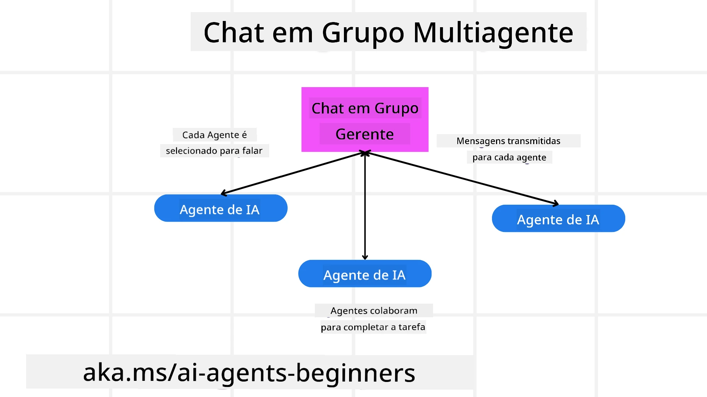
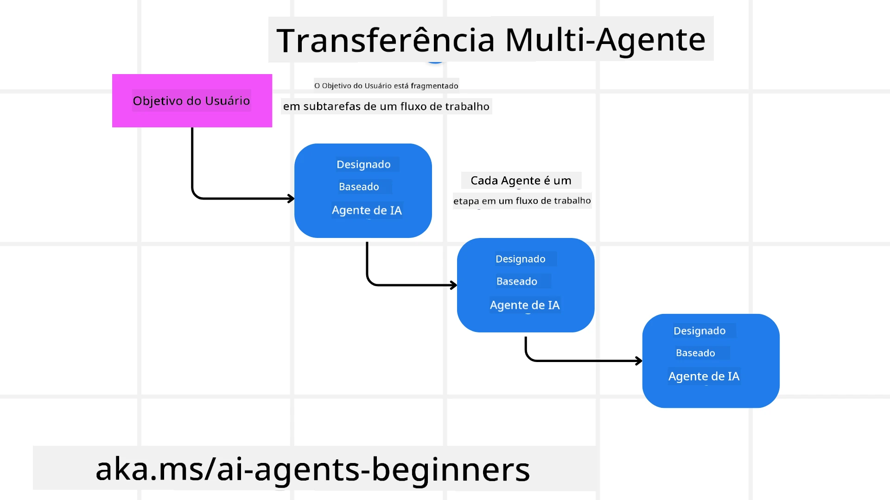
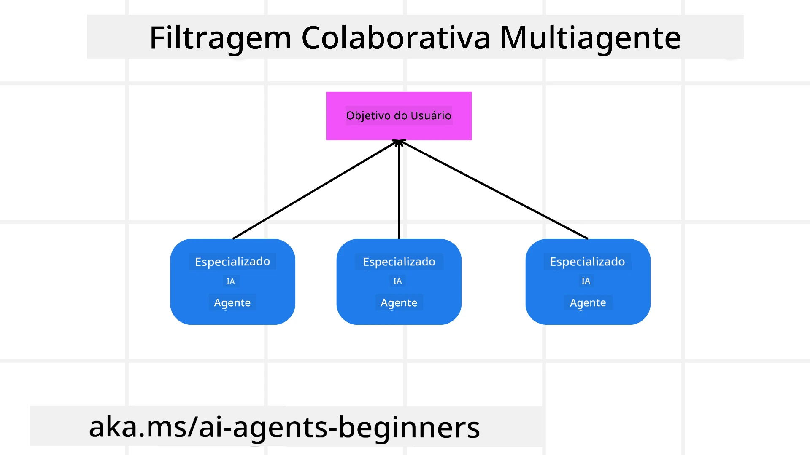

> _(Clique na imagem acima para assistir ao vídeo desta lição)_

# Padrões de design multagente

Assim que você começa a trabalhar em um projeto que envolve múltiplos agentes, precisará considerar o padrão de design multagente. No entanto, pode não ser imediatamente claro quando mudar para múltiplos agentes e quais são as vantagens.

## Introdução

Nesta lição, buscamos responder às seguintes perguntas:

- Quais são os cenários onde múltiplos agentes são aplicáveis?
- Quais são as vantagens de usar múltiplos agentes em vez de apenas um agente singular realizando múltiplas tarefas?
- Quais são os blocos de construção para implementar o padrão de design multagente?
- Como podemos ter visibilidade de como os múltiplos agentes estão interagindo entre si?

## Objetivos de Aprendizagem

Após esta lição, você deverá ser capaz de:

- Identificar cenários onde múltiplos agentes são aplicáveis
- Reconhecer as vantagens de usar múltiplos agentes ao invés de um agente singular.
- Compreender os blocos de construção para implementar o padrão de design multagente.

Qual é o panorama geral?

*Multiplos agentes são um padrão de design que permite que vários agentes trabalhem juntos para alcançar um objetivo comum*.

Esse padrão é amplamente usado em vários campos, incluindo robótica, sistemas autônomos e computação distribuída.

## Cenários Onde Múltiplos Agentes São Aplicáveis

Então, quais cenários são adequados para usar múltiplos agentes? A resposta é que existem muitos cenários onde empregar múltiplos agentes é benéfico, especialmente nos seguintes casos:

- **Grandes cargas de trabalho**: Grandes cargas de trabalho podem ser divididas em tarefas menores e atribuídas a diferentes agentes, permitindo processamento paralelo e conclusão mais rápida. Um exemplo disso é em uma grande tarefa de processamento de dados.
- **Tarefas complexas**: Tarefas complexas, assim como grandes cargas, podem ser quebradas em subtarefas menores e atribuídas a diferentes agentes, cada um especializado em um aspecto específico da tarefa. Um bom exemplo é no caso de veículos autônomos onde diferentes agentes gerenciam navegação, detecção de obstáculos e comunicação com outros veículos.
- **Expertise diversa**: Diferentes agentes podem ter expertise diversa, permitindo-lhes lidar com diferentes aspectos de uma tarefa de forma mais eficaz do que um único agente. Para este caso, um bom exemplo é na área da saúde, onde agentes podem gerenciar diagnósticos, planos de tratamento e monitoramento de pacientes.

## Vantagens de Usar Múltiplos Agentes em Vez de um Agente Singular

Um sistema de agente único pode funcionar bem para tarefas simples, mas para tarefas mais complexas, usar múltiplos agentes pode proporcionar várias vantagens:

- **Especialização**: Cada agente pode ser especializado em uma tarefa específica. A falta de especialização em um único agente significa que você tem um agente que pode fazer tudo, mas pode ficar confuso sobre o que fazer ao enfrentar uma tarefa complexa. Ele pode, por exemplo, acabar fazendo uma tarefa para a qual não está mais bem preparado.
- **Escalabilidade**: É mais fácil escalar sistemas adicionando mais agentes do que sobrecarregando um único agente.
- **Tolerância a falhas**: Se um agente falhar, outros podem continuar funcionando, garantindo a confiabilidade do sistema.

Vamos a um exemplo, vamos reservar uma viagem para um usuário. Um sistema com um único agente teria que lidar com todos os aspectos do processo de reserva da viagem, desde encontrar voos até reservar hotéis e aluguel de carros. Para conseguir isso com um único agente, o agente precisaria ter ferramentas para lidar com todas essas tarefas. Isso poderia levar a um sistema complexo e monolítico, difícil de manter e escalar. Um sistema multagente, por outro lado, poderia ter diferentes agentes especializados em encontrar voos, reservar hotéis e alugar carros. Isso tornaria o sistema mais modular, fácil de manter e escalável.

Compare isso com um escritório de viagens comandado como uma loja familiar versus um escritório de viagens administrado como uma franquia. A loja familiar teria um único agente lidando com todos os aspectos do processo de reserva, enquanto a franquia teria diferentes agentes cuidando de diferentes aspectos do processo de reserva.

## Blocos de Construção para Implementar o Padrão de Design Multagente

Antes de implementar o padrão de design multagente, você precisa entender os blocos de construção que compõem o padrão.

Vamos tornar isso mais concreto novamente olhando o exemplo de reservar uma viagem para um usuário. Neste caso, os blocos de construção incluiriam:

- **Comunicação entre Agentes**: Agentes para encontrar voos, reservar hotéis e aluguel de carros precisam se comunicar e compartilhar informações sobre as preferências e restrições do usuário. Você precisa decidir os protocolos e métodos para essa comunicação. O que isso significa concretamente é que o agente responsável por encontrar voos precisa se comunicar com o agente responsável por reservar hotéis para garantir que o hotel seja reservado nas mesmas datas do voo. Isso significa que os agentes precisam compartilhar informações sobre as datas de viagem do usuário, ou seja, você precisa decidir *quais agentes estão compartilhando informações e como eles estão compartilhando essas informações*.
- **Mecanismos de Coordenação**: Os agentes precisam coordenar suas ações para garantir que as preferências e restrições do usuário sejam atendidas. Uma preferência do usuário pode ser que ele queira um hotel próximo ao aeroporto, enquanto uma restrição pode ser que os carros alugados estejam disponíveis apenas no aeroporto. Isso significa que o agente de reserva de hotéis precisa coordenar com o agente de aluguel de carros para garantir que as preferências e restrições do usuário sejam atendidas. Isso significa que você precisa decidir *como os agentes estão coordenando suas ações*.
- **Arquitetura dos Agentes**: Os agentes precisam ter uma estrutura interna para tomar decisões e aprender com suas interações com o usuário. Isso significa que o agente de encontrar voos precisa ter a estrutura interna para decidir quais voos recomendar ao usuário. Isso significa que você precisa decidir *como os agentes estão tomando decisões e aprendendo com suas interações com o usuário*. Exemplo de como um agente aprende e melhora poderia ser que o agente de encontrar voos use um modelo de aprendizado de máquina para recomendar voos ao usuário com base em suas preferências anteriores.
- **Visibilidade nas Interações Multagentes**: Você precisa ter visibilidade de como os múltiplos agentes estão interagindo entre si. Isso significa que você precisa de ferramentas e técnicas para acompanhar as atividades e interações dos agentes. Isso pode ser na forma de ferramentas de registro e monitoramento, ferramentas de visualização e métricas de desempenho.
- **Padrões Multagentes**: Existem diferentes padrões para implementar sistemas multagentes, como arquiteturas centralizadas, descentralizadas e híbridas. Você precisa decidir qual padrão melhor se adapta ao seu caso de uso.
- **Humano no loop**: Na maioria dos casos, você terá um humano no loop e precisará instruir os agentes quando solicitar a intervenção humana. Isso pode ser na forma de um usuário pedindo um hotel ou voo específico que os agentes não recomendaram ou solicitando confirmação antes de reservar um voo ou hotel.

## Visibilidade nas Interações Multagentes

É importante que você tenha visibilidade de como os múltiplos agentes estão interagindo entre si. Essa visibilidade é essencial para depuração, otimização e garantia da eficácia geral do sistema. Para isso, você precisa de ferramentas e técnicas para rastrear as atividades e interações dos agentes. Isso pode ser na forma de ferramentas de registro e monitoramento, ferramentas de visualização e métricas de desempenho.

Por exemplo, no caso de reservar uma viagem para um usuário, você poderia ter um painel que mostra o status de cada agente, as preferências e restrições do usuário e as interações entre os agentes. Este painel poderia mostrar as datas de viagem do usuário, os voos recomendados pelo agente de voos, os hotéis recomendados pelo agente de hotéis e os carros alugados recomendados pelo agente de aluguel de carros. Isso lhe daria uma visão clara de como os agentes estão interagindo entre si e se as preferências e restrições do usuário estão sendo atendidas.

Vamos analisar cada um desses aspectos com mais detalhes.

- **Ferramentas de Registro e Monitoramento**: Você quer ter registros para cada ação tomada por um agente. Uma entrada de registro pode armazenar informações sobre o agente que realizou a ação, a ação tomada, a hora da ação e o resultado da ação. Essas informações podem ser usadas para depuração, otimização e mais.
- **Ferramentas de Visualização**: Ferramentas de visualização podem ajudar você a ver as interações entre os agentes de uma maneira mais intuitiva. Por exemplo, você pode ter um gráfico que mostra o fluxo de informações entre os agentes. Isso pode ajudar a identificar gargalos, ineficiências e outros problemas no sistema.
- **Métricas de Desempenho**: As métricas de desempenho podem ajudar a acompanhar a eficácia do sistema multagente. Por exemplo, você pode rastrear o tempo para completar uma tarefa, o número de tarefas concluídas por unidade de tempo e a precisão das recomendações feitas pelos agentes. Essas informações podem ajudar a identificar áreas para melhorias e otimizar o sistema.

## Padrões Multagentes

Vamos analisar alguns padrões concretos que podemos usar para criar aplicativos multagentes. Aqui estão alguns padrões interessantes a considerar:

### Bate-papo em grupo

Este padrão é útil quando você deseja criar um aplicativo de bate-papo em grupo onde vários agentes podem se comunicar entre si. Casos típicos para esse padrão incluem colaboração em equipe, suporte ao cliente e redes sociais.

Neste padrão, cada agente representa um usuário no bate-papo em grupo, e as mensagens são trocadas entre os agentes usando um protocolo de mensagens. Os agentes podem enviar mensagens para o grupo, receber mensagens do grupo e responder a mensagens de outros agentes.

Este padrão pode ser implementado usando uma arquitetura centralizada, onde todas as mensagens são roteadas por um servidor central, ou uma arquitetura descentralizada, onde as mensagens são trocadas diretamente.

### Transferência

Este padrão é útil quando você deseja criar um aplicativo onde múltiplos agentes podem transferir tarefas uns aos outros.

Casos típicos para esse padrão incluem suporte ao cliente, gerenciamento de tarefas e automação de fluxo de trabalho.

Neste padrão, cada agente representa uma tarefa ou etapa em um fluxo de trabalho, e os agentes podem transferir tarefas para outros agentes com base em regras pré-definidas.

### Filtragem colaborativa

Este padrão é útil quando você deseja criar um aplicativo onde múltiplos agentes podem colaborar para fazer recomendações aos usuários.

O motivo para querer que múltiplos agentes colaborem é porque cada agente pode ter uma expertise diferente e pode contribuir para o processo de recomendação de maneiras diversas.

Vamos ao exemplo de um usuário que quer uma recomendação sobre a melhor ação para comprar no mercado financeiro.

- **Especialista em indústria**: Um agente poderia ser especialista em uma indústria específica.
- **Análise técnica**: Outro agente poderia ser especialista em análise técnica.
- **Análise fundamental**: E outro agente poderia ser especialista em análise fundamental. Ao colaborar, esses agentes podem fornecer uma recomendação mais abrangente ao usuário.

## Cenário: Processo de reembolso

Considere um cenário onde um cliente está tentando obter o reembolso de um produto, pode haver vários agentes envolvidos nesse processo, mas vamos dividi-los entre agentes específicos para esse processo e agentes gerais que podem ser usados em outros processos.

**Agentes específicos para o processo de reembolso**:

A seguir estão alguns agentes que poderiam estar envolvidos no processo de reembolso:

- **Agente do cliente**: Este agente representa o cliente e é responsável por iniciar o processo de reembolso.
- **Agente do vendedor**: Este agente representa o vendedor e é responsável por processar o reembolso.
- **Agente de pagamento**: Este agente representa o processo de pagamento e é responsável por reembolsar o pagamento do cliente.
- **Agente de resolução**: Este agente representa o processo de resolução e é responsável por resolver quaisquer problemas que surjam durante o processo de reembolso.
- **Agente de conformidade**: Este agente representa o processo de conformidade e é responsável por garantir que o processo de reembolso cumpra as regulamentações e políticas.

**Agentes gerais**:

Estes agentes podem ser usados por outras partes do seu negócio.

- **Agente de envio**: Este agente representa o processo de envio e é responsável por enviar o produto de volta ao vendedor. Esse agente pode ser usado tanto no processo de reembolso quanto no envio geral de um produto via compra, por exemplo.
- **Agente de feedback**: Este agente representa o processo de feedback e é responsável por coletar feedback do cliente. Feedback pode ser dado a qualquer momento e não apenas durante o processo de reembolso.
- **Agente de escalonamento**: Este agente representa o processo de escalonamento e é responsável por escalar problemas para um nível superior de suporte. Você pode usar esse tipo de agente para qualquer processo onde precise escalar um problema.
- **Agente de notificação**: Este agente representa o processo de notificação e é responsável por enviar notificações ao cliente em várias etapas do processo de reembolso.
- **Agente de análises**: Este agente representa o processo de análises e é responsável por analisar dados relacionados ao processo de reembolso.
- **Agente de auditoria**: Este agente representa o processo de auditoria e é responsável por auditar o processo de reembolso para garantir que ele está sendo realizado corretamente.
- **Agente de relatórios**: Este agente representa o processo de relatórios e é responsável por gerar relatórios sobre o processo de reembolso.
- **Agente de conhecimento**: Este agente representa o processo de conhecimento e é responsável por manter uma base de conhecimento de informações relacionadas ao processo de reembolso. Este agente poderia ter conhecimento tanto sobre reembolsos quanto sobre outras partes do seu negócio.
- **Agente de segurança**: Este agente representa o processo de segurança e é responsável por garantir a segurança do processo de reembolso.
- **Agente de qualidade**: Este agente representa o processo de qualidade e é responsável por garantir a qualidade do processo de reembolso.

Há vários agentes listados anteriormente, tanto para o processo específico de reembolso, quanto para os agentes gerais que podem ser usados em outras partes do seu negócio. Esperamos que isso lhe dê uma ideia de como decidir quais agentes usar no seu sistema multagente.

## Tarefa

Projete um sistema multagente para um processo de suporte ao cliente. Identifique os agentes envolvidos no processo, seus papéis e responsabilidades, e como eles interagem entre si. Considere tanto agentes específicos para o processo de suporte ao cliente quanto agentes gerais que podem ser usados em outras partes do seu negócio.
> Pense um pouco antes de ler a solução a seguir, você pode precisar de mais agentes do que pensa.

> DICA: Pense nas diferentes etapas do processo de suporte ao cliente e também considere agentes necessários para qualquer sistema.

## Solução

[Solução](./solution/solution.md)

## Verificações de conhecimento

Pergunta: Quando você deve considerar o uso de multi-agentes?

- [ ] A1: Quando você tem uma pequena carga de trabalho e uma tarefa simples.
- [ ] A2: Quando você tem uma grande carga de trabalho
- [ ] A3: Quando você tem uma tarefa simples.

[Quiz da solução](./solution/solution-quiz.md)

## Resumo

Nesta lição, examinamos o padrão de design multi-agente, incluindo os cenários em que multi-agentes são aplicáveis, as vantagens de usar multi-agentes em vez de um agente único, os blocos de construção para implementar o padrão de design multi-agente, e como ter visibilidade sobre como os múltiplos agentes estão interagindo entre si.

### Tem Mais Perguntas sobre o Padrão de Design Multi-Agente?

Junte-se ao [Microsoft Foundry Discord](https://aka.ms/ai-agents/discord) para encontrar outros aprendizes, participar de horas de atendimento e obter respostas para suas dúvidas sobre Agentes de IA.

## Recursos adicionais

- <a href="https://learn.microsoft.com/azure/ai-services/agents/overview" target="_blank">Documentação do Microsoft Agent Framework</a>
- <a href="https://www.analyticsvidhya.com/blog/2024/10/agentic-design-patterns/" target="_blank">Padrões de design Agentic</a>

## Lição anterior

[Planejamento de Design](../07-planning-design/README.md)

## Próxima lição

[Metacognição em Agentes de IA](../09-metacognition/README.md)

---

<!-- CO-OP TRANSLATOR DISCLAIMER START -->
**Aviso Legal**:
Este documento foi traduzido utilizando o serviço de tradução por IA [Co-op Translator](https://github.com/Azure/co-op-translator). Embora nos esforcemos para garantir a precisão, esteja ciente de que traduções automatizadas podem conter erros ou imprecisões. O documento original em seu idioma nativo deve ser considerado a fonte oficial. Para informações críticas, recomenda-se a tradução profissional por humanos. Não nos responsabilizamos por quaisquer mal-entendidos ou interpretações incorretas decorrentes do uso desta tradução.
<!-- CO-OP TRANSLATOR DISCLAIMER END -->