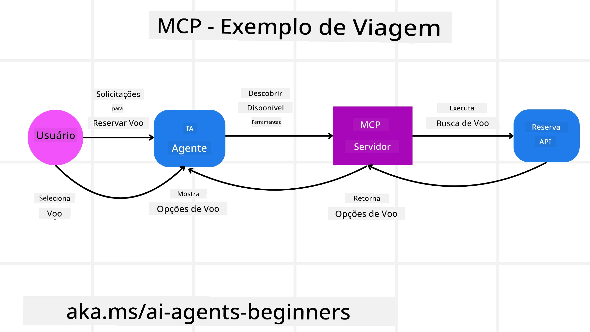
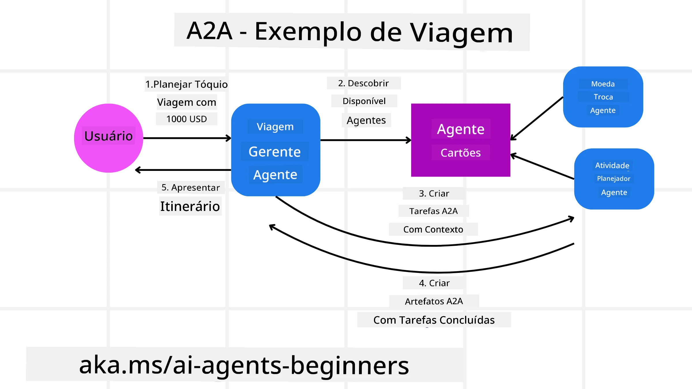
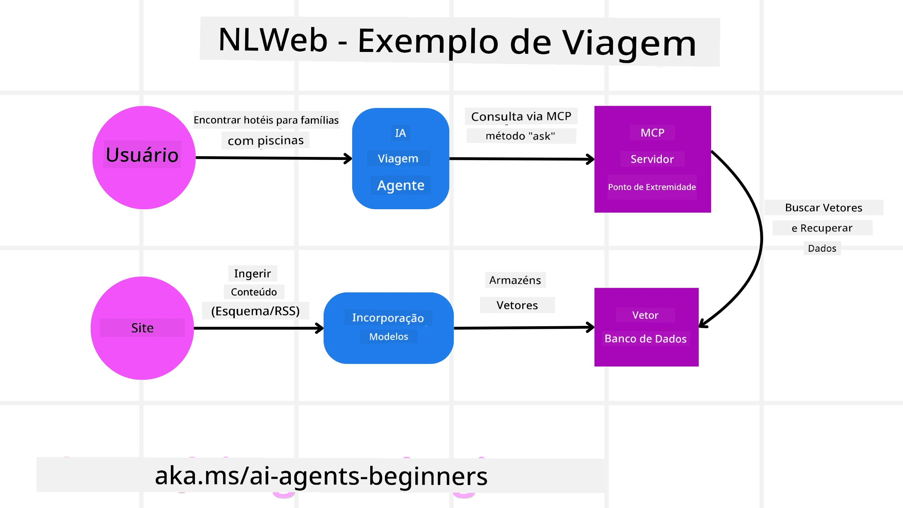

# Using Agentic Protocols (MCP, A2A and NLWeb)

> _(Clique na imagem acima para ver o vídeo desta lição)_

À medida que o uso de agentes de IA cresce, também cresce a necessidade de protocolos que assegurem padronização, segurança e apoiem a inovação aberta. Nesta lição, cobriremos 3 protocolos que buscam atender a essa necessidade - Model Context Protocol (MCP), Agent to Agent (A2A) e Natural Language Web (NLWeb).

## Introduction

Nesta lição, cobriremos:

• Como o **MCP** permite que Agentes de IA acessem ferramentas e dados externos para completar tarefas dos usuários.

• Como **A2A** possibilita a comunicação e colaboração entre diferentes agentes de IA.

• Como **NLWeb** leva interfaces em linguagem natural para qualquer site, permitindo que Agentes de IA descubram e interajam com o conteúdo.

## Learning Goals

• **Identificar** o propósito central e os benefícios do MCP, A2A e NLWeb no contexto de agentes de IA.

• **Explicar** como cada protocolo facilita comunicação e interação entre LLMs, ferramentas e outros agentes.

• **Reconhecer** os papéis distintos que cada protocolo desempenha na construção de sistemas agentivos complexos.

## Model Context Protocol

O **Model Context Protocol (MCP)** é um padrão aberto que fornece uma maneira padronizada para aplicações fornecerem contexto e ferramentas para LLMs. Isso possibilita um "adaptador universal" para diferentes fontes de dados e ferramentas que Agentes de IA podem conectar de forma consistente.

Vamos analisar os componentes do MCP, os benefícios em comparação com o uso direto de APIs e um exemplo de como agentes de IA podem usar um servidor MCP.

### MCP Core Components

O MCP opera em uma **arquitetura cliente-servidor** e os componentes principais são:

• **Hosts** são aplicações LLM (por exemplo um editor de código como o VSCode) que iniciam as conexões com um Servidor MCP.

• **Clients** são componentes dentro da aplicação host que mantêm conexões one-to-one com servidores.

• **Servers** são programas leves que expõem capacidades específicas.

Incluídos no protocolo estão três primitivas centrais que são as capacidades de um Servidor MCP:

• **Tools**: Estas são ações ou funções discretas que um agente de IA pode chamar para executar uma ação. Por exemplo, um serviço meteorológico pode expor uma ferramenta "get weather", ou um servidor de e-commerce pode expor uma ferramenta "purchase product". Servidores MCP anunciam o nome de cada ferramenta, descrição e esquema de entrada/saída em sua listagem de capacidades.

• **Resources**: Estes são itens de dados ou documentos somente leitura que um servidor MCP pode fornecer, e os clientes podem recuperá-los sob demanda. Exemplos incluem conteúdos de arquivos, registros de banco de dados ou arquivos de log. Resources podem ser texto (como código ou JSON) ou binário (como imagens ou PDFs).

• **Prompts**: Estes são templates predefinidos que fornecem prompts sugeridos, permitindo fluxos de trabalho mais complexos.

### Benefits of MCP

O MCP oferece vantagens significativas para Agentes de IA:

• **Dynamic Tool Discovery**: Agentes podem receber dinamicamente uma lista de ferramentas disponíveis de um servidor junto com descrições do que elas fazem. Isso contrasta com APIs tradicionais, que frequentemente requerem codificação estática para integrações, significando que qualquer mudança na API exige atualizações de código. O MCP oferece uma abordagem "integre uma vez", levando a maior adaptabilidade.

• **Interoperability Across LLMs**: O MCP funciona através de diferentes LLMs, proporcionando flexibilidade para trocar modelos centrais para avaliar um desempenho melhor.

• **Standardized Security**: O MCP inclui um método padrão de autenticação, melhorando a escalabilidade ao adicionar acesso a servidores MCP adicionais. Isso é mais simples do que gerenciar chaves diferentes e tipos de autenticação para várias APIs tradicionais.

### MCP Example

Imagine que um usuário queira reservar um voo usando um assistente de IA com suporte MCP.

1. **Connection**: O assistente de IA (o cliente MCP) conecta-se a um servidor MCP fornecido por uma companhia aérea.

2. **Tool Discovery**: O cliente pergunta ao servidor MCP da companhia aérea: "Que ferramentas vocês têm disponíveis?" O servidor responde com ferramentas como "search flights" e "book flights".

3. **Tool Invocation**: Você então pede ao assistente de IA: "Por favor, procure um voo de Portland para Honolulu." O assistente de IA, usando seu LLM, identifica que precisa chamar a ferramenta "search flights" e passa os parâmetros relevantes (origem, destino) para o servidor MCP.

4. **Execution and Response**: O servidor MCP, atuando como um wrapper, realiza a chamada real para a API interna de reserva da companhia aérea. Em seguida, recebe as informações do voo (por exemplo, dados JSON) e as envia de volta ao assistente de IA.

5. **Further Interaction**: O assistente de IA apresenta as opções de voo. Uma vez que você selecione um voo, o assistente pode invocar a ferramenta "book flight" no mesmo servidor MCP, completando a reserva.

## Agent-to-Agent Protocol (A2A)

Enquanto o MCP foca em conectar LLMs a ferramentas, o **Agent-to-Agent (A2A) protocol** dá um passo além ao possibilitar comunicação e colaboração entre diferentes agentes de IA. O A2A conecta agentes de IA através de diferentes organizações, ambientes e stacks tecnológicos para completar uma tarefa compartilhada.

Examinaremos os componentes e benefícios do A2A, junto com um exemplo de como ele poderia ser aplicado em nossa aplicação de viagens.

### A2A Core Components

O A2A foca em habilitar a comunicação entre agentes e fazê-los trabalhar juntos para completar um subtarefa do usuário. Cada componente do protocolo contribui para isso:

#### Agent Card

Semelhante a como um servidor MCP compartilha uma lista de ferramentas, um Agent Card tem:
- O Nome do Agente.
- Uma **descrição das tarefas gerais** que ele realiza.
- Uma **lista de habilidades específicas** com descrições para ajudar outros agentes (ou até usuários humanos) a entender quando e por que chamariam esse agente.
- A **URL de Endpoint atual** do agente
- A **versão** e as **capacidades** do agente, como respostas em streaming e notificações push.

#### Agent Executor

O Agent Executor é responsável por **passar o contexto do chat do usuário para o agente remoto**, o agente remoto precisa disso para entender a tarefa que precisa ser completada. Em um servidor A2A, um agente usa seu próprio Large Language Model (LLM) para analisar solicitações recebidas e executar tarefas usando suas próprias ferramentas internas.

#### Artifact

Quando um agente remoto completa a tarefa solicitada, seu produto de trabalho é criado como um artifact. Um artifact **contém o resultado do trabalho do agente**, uma **descrição do que foi completado**, e o **contexto em texto** que é enviado através do protocolo. Após o artifact ser enviado, a conexão com o agente remoto é encerrada até que seja necessária novamente.

#### Event Queue

Este componente é usado para **manusear atualizações e passar mensagens**. É particularmente importante em produção para sistemas agentivos evitar que a conexão entre agentes seja fechada antes que uma tarefa seja completada, especialmente quando tempos de conclusão podem ser mais longos.

### Benefits of A2A

• **Enhanced Collaboration**: Ele permite que agentes de diferentes fornecedores e plataformas interajam, compartilhem contexto e trabalhem juntos, facilitando automação contínua através de sistemas tradicionalmente desconectados.

• **Model Selection Flexibility**: Cada agente A2A pode decidir qual LLM usa para atender suas solicitações, permitindo modelos otimizados ou fine-tuned por agente, ao contrário de uma conexão única de LLM em alguns cenários MCP.

• **Built-in Authentication**: A autenticação é integrada diretamente ao protocolo A2A, fornecendo uma estrutura de segurança robusta para interações entre agentes.

### A2A Example

Vamos expandir nosso cenário de reserva de viagens, mas desta vez usando A2A.

1. **User Request to Multi-Agent**: Um usuário interage com um "Travel Agent" cliente/agente A2A, talvez dizendo: "Por favor, reserve uma viagem inteira para Honolulu na próxima semana, incluindo voos, hotel e um carro alugado".

2. **Orchestration by Travel Agent**: O Travel Agent recebe essa solicitação complexa. Ele usa seu LLM para raciocinar sobre a tarefa e determinar que precisa interagir com outros agentes especializados.

3. **Inter-Agent Communication**: O Travel Agent então usa o protocolo A2A para conectar-se a agentes a jusante, como um "Airline Agent", um "Hotel Agent" e um "Car Rental Agent" que são criados por diferentes empresas.

4. **Delegated Task Execution**: O Travel Agent envia tarefas específicas para esses agentes especializados (por exemplo, "Encontrar voos para Honolulu", "Reservar um hotel", "Alugar um carro"). Cada um desses agentes especializados, executando seus próprios LLMs e utilizando suas próprias ferramentas (que poderiam ser servidores MCP), realiza sua parte específica da reserva.

5. **Consolidated Response**: Quando todos os agentes a jusante completam suas tarefas, o Travel Agent compila os resultados (detalhes dos voos, confirmação do hotel, reserva do carro) e envia uma resposta abrangente, em estilo de chat, de volta ao usuário.

## Natural Language Web (NLWeb)

Sites têm sido, por muito tempo, a principal forma de os usuários acessarem informações e dados pela internet.

Vejamos os diferentes componentes do NLWeb, os benefícios do NLWeb e um exemplo de como nosso NLWeb funciona olhando nossa aplicação de viagens.

### Components of NLWeb

- **NLWeb Application (Core Service Code)**: O sistema que processa perguntas em linguagem natural. Ele conecta as diferentes partes da plataforma para criar respostas. Você pode pensar nele como o **motor que alimenta os recursos de linguagem natural** de um site.

- **NLWeb Protocol**: Este é um **conjunto básico de regras para interação em linguagem natural** com um site. Ele retorna respostas em formato JSON (frequentemente usando Schema.org). Seu propósito é criar uma base simples para a "Web de IA", da mesma forma que o HTML tornou possível compartilhar documentos online.

- **MCP Server (Model Context Protocol Endpoint)**: Cada configuração NLWeb também funciona como um **servidor MCP**. Isso significa que pode **compartilhar ferramentas (como um método “ask”) e dados** com outros sistemas de IA. Na prática, isso torna o conteúdo e as capacidades do site utilizáveis por agentes de IA, permitindo que o site se torne parte do mais amplo "ecossistema de agentes."

- **Embedding Models**: Esses modelos são usados para **converter o conteúdo do site em representações numéricas chamadas vetores** (embeddings). Esses vetores capturam significado de uma forma que computadores podem comparar e buscar. Eles são armazenados em um banco de dados especial, e os usuários podem escolher qual modelo de embedding desejam usar.

- **Vector Database (Retrieval Mechanism)**: Este banco de dados **armazena os embeddings do conteúdo do site**. Quando alguém faz uma pergunta, o NLWeb consulta o banco de dados vetorial para encontrar rapidamente as informações mais relevantes. Ele retorna uma lista rápida de possíveis respostas, ranqueadas por similaridade. NLWeb funciona com diferentes sistemas de armazenamento vetorial, como Qdrant, Snowflake, Milvus, Azure AI Search e Elasticsearch.

### NLWeb by Example

Considere novamente nosso site de reserva de viagens, mas desta vez ele é alimentado por NLWeb.

1. **Data Ingestion**: Os catálogos de produtos existentes do site de viagens (por exemplo, listagens de voos, descrições de hotéis, pacotes de turismo) são formatados usando Schema.org ou carregados via feeds RSS. As ferramentas do NLWeb ingerem esses dados estruturados, criam embeddings e os armazenam em um banco de dados vetorial local ou remoto.

2. **Natural Language Query (Human)**: Um usuário visita o site e, em vez de navegar por menus, digita em uma interface de chat: "Encontre um hotel familiar em Honolulu com piscina para a próxima semana".

3. **NLWeb Processing**: A aplicação NLWeb recebe essa consulta. Ela envia a consulta para um LLM para compreensão e simultaneamente busca em seu banco de dados vetorial por listagens de hotéis relevantes.

4. **Accurate Results**: O LLM ajuda a interpretar os resultados da busca no banco de dados, identificar as melhores correspondências com base nos critérios "familiar", "piscina" e "Honolulu", e então formata uma resposta em linguagem natural. Crucialmente, a resposta refere-se a hotéis reais do catálogo do site, evitando informações inventadas.

5. **AI Agent Interaction**: Porque o NLWeb serve como um servidor MCP, um agente externo de viagens de IA também poderia conectar-se à instância NLWeb deste site. O agente de IA então poderia usar o método `ask("Existem restaurantes veganos na área de Honolulu recomendados pelo hotel?")`. A instância NLWeb processaria isso, aproveitando seu banco de dados de informações de restaurantes (se carregado), e retornaria uma resposta JSON estruturada.

### Got More Questions about MCP/A2A/NLWeb?

Participe do [Microsoft Foundry Discord](https://aka.ms/ai-agents/discord) para encontrar outros aprendizes, participar de office hours e ter suas perguntas sobre Agentes de IA respondidas.

## Resources

- [MCP for Beginners](https://aka.ms/mcp-for-beginners)  
- [MCP Documentation](https://learn.microsoft.com/python/api/overview/azure/ai-projects-readme)
- [NLWeb Repo](https://github.com/nlweb-ai/NLWeb)
- [Microsoft Agent Framework](https://aka.ms/ai-agents-beginners/agent-framewrok)

---

<!-- CO-OP TRANSLATOR DISCLAIMER START -->
Isenção de responsabilidade:
Este documento foi traduzido utilizando o serviço de tradução por IA [Co-op Translator](https://github.com/Azure/co-op-translator). Embora nos esforcemos pela precisão, esteja ciente de que traduções automatizadas podem conter erros ou imprecisões. O documento original em seu idioma nativo deve ser considerado a fonte autorizada. Para informações críticas, recomenda-se tradução humana profissional. Não nos responsabilizamos por quaisquer mal-entendidos ou interpretações equivocadas decorrentes do uso desta tradução.
<!-- CO-OP TRANSLATOR DISCLAIMER END -->