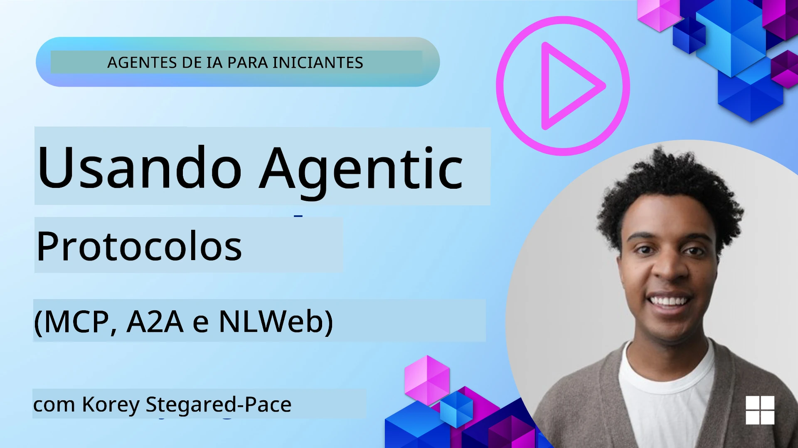
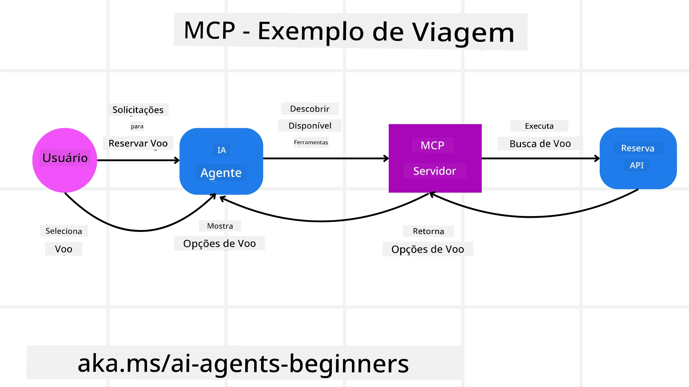
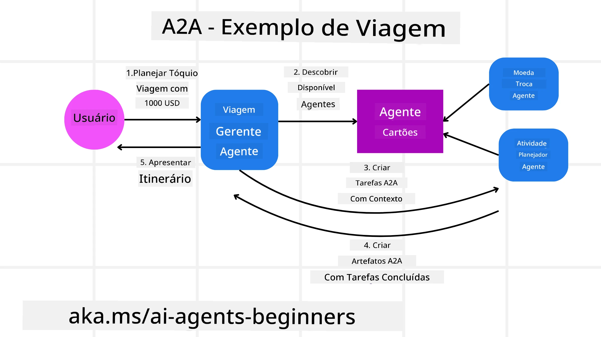
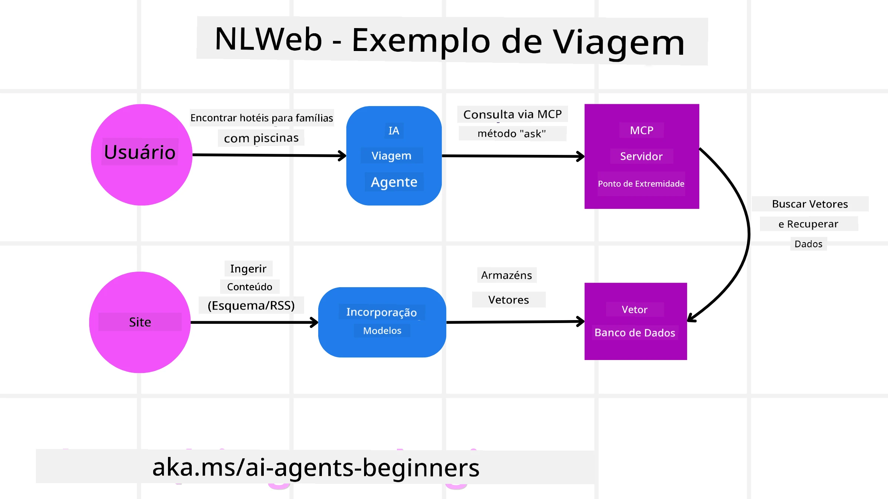

# Usando Protocolos Agentic (MCP, A2A e NLWeb)

> _(Clique na imagem acima para assistir ao vídeo desta lição)_

Conforme o uso de agentes de IA cresce, também cresce a necessidade de protocolos que garantam padronização, segurança e apoiem a inovação aberta. Nesta lição, abordaremos 3 protocolos que buscam atender a essa necessidade - Model Context Protocol (MCP), Agent to Agent (A2A) e Natural Language Web (NLWeb).

## Introdução

Nesta lição, abordaremos:

• Como o **MCP** permite que Agentes de IA acessem ferramentas e dados externos para completar tarefas do usuário.

• Como o **A2A** possibilita comunicação e colaboração entre diferentes agentes de IA.

• Como o **NLWeb** traz interfaces em linguagem natural para qualquer site, permitindo que Agentes de IA descubram e interajam com o conteúdo.

## Objetivos de Aprendizagem

• **Identificar** o propósito principal e os benefícios do MCP, A2A e NLWeb no contexto de agentes de IA.

• **Explicar** como cada protocolo facilita a comunicação e interação entre LLMs, ferramentas e outros agentes.

• **Reconhecer** os papéis distintos que cada protocolo desempenha na construção de sistemas agentic complexos.

## Model Context Protocol

O **Model Context Protocol (MCP)** é um padrão aberto que fornece uma forma padronizada para aplicações fornecerem contexto e ferramentas para LLMs. Isso possibilita um "adaptador universal" para diferentes fontes de dados e ferramentas que agentes de IA podem conectar de maneira consistente.

Vamos olhar para os componentes do MCP, os benefícios comparados ao uso direto de APIs, e um exemplo de como agentes de IA podem usar um servidor MCP.

### Componentes Principais do MCP

O MCP opera em uma **arquitetura cliente-servidor** e seus componentes principais são:

• **Hosts** são aplicações LLM (por exemplo, um editor de código como o VSCode) que iniciam conexões com um Servidor MCP.

• **Clientes** são componentes dentro da aplicação host que mantêm conexões um-para-um com servidores.

• **Servidores** são programas leves que expõem capacidades específicas.

Incluídas no protocolo estão três primitivas principais que são as capacidades de um Servidor MCP:

• **Ferramentas**: São ações ou funções discretas que um agente de IA pode chamar para executar uma ação. Por exemplo, um serviço de clima pode expor uma ferramenta "obter clima", ou um servidor de e-commerce pode expor uma ferramenta "comprar produto". Servidores MCP anunciam o nome, descrição e esquema de entrada/saída de cada ferramenta em sua lista de capacidades.

• **Recursos**: São itens de dados ou documentos somente leitura que um servidor MCP pode fornecer, e clientes podem recuperá-los sob demanda. Exemplos incluem conteúdo de arquivos, registros de banco de dados ou arquivos de log. Recursos podem ser texto (como código ou JSON) ou binários (como imagens ou PDFs).

• **Prompts**: São templates pré-definidos que fornecem prompts sugeridos, permitindo fluxos de trabalho mais complexos.

### Benefícios do MCP

O MCP oferece vantagens significativas para Agentes de IA:

• **Descoberta Dinâmica de Ferramentas**: Agentes podem receber dinamicamente uma lista de ferramentas disponíveis de um servidor junto com descrições do que elas fazem. Isso contrasta com APIs tradicionais, que frequentemente requerem codificação estática para integrações, significando que qualquer mudança na API exige atualização de código. O MCP oferece uma abordagem "integre uma vez", levando a maior adaptabilidade.

• **Interoperabilidade entre LLMs**: O MCP funciona com diferentes LLMs, oferecendo flexibilidade para alternar modelos centrais para avaliar melhor desempenho.

• **Segurança Padronizada**: MCP inclui um método padrão de autenticação, melhorando a escalabilidade ao adicionar acesso a servidores MCP adicionais. Isso é mais simples do que gerenciar diferentes chaves e tipos de autenticação para várias APIs tradicionais.

### Exemplo MCP

Imagine que um usuário queira reservar um voo usando um assistente de IA alimentado por MCP.

1. **Conexão**: O assistente de IA (cliente MCP) conecta-se a um servidor MCP fornecido por uma companhia aérea.

2. **Descoberta de Ferramentas**: O cliente pergunta ao servidor MCP da companhia aérea: "Quais ferramentas vocês têm disponíveis?" O servidor responde com ferramentas como "buscar voos" e "reservar voos".

3. **Chamada da Ferramenta**: Você então pede ao assistente de IA: "Por favor, busque um voo de Portland para Honolulu." O assistente de IA, usando seu LLM, identifica que precisa chamar a ferramenta "buscar voos" e passa os parâmetros relevantes (origem, destino) ao servidor MCP.

4. **Execução e Resposta**: O servidor MCP, atuando como um invólucro, faz a chamada real para a API interna de reservas da companhia aérea. Então, recebe as informações do voo (ex., dados JSON) e as envia de volta ao assistente de IA.

5. **Interação Adicional**: O assistente de IA apresenta as opções de voo. Uma vez que você selecione um voo, o assistente pode chamar a ferramenta "reservar voo" no mesmo servidor MCP, finalizando a reserva.

## Protocolo Agent-to-Agent (A2A)

Enquanto o MCP foca em conectar LLMs a ferramentas, o **protocolo Agent-to-Agent (A2A)** vai além, possibilitando comunicação e colaboração entre diferentes agentes de IA. O A2A conecta agentes de IA de diferentes organizações, ambientes e pilhas tecnológicas para completar uma tarefa compartilhada.

Vamos examinar os componentes e benefícios do A2A, junto com um exemplo de como ele poderia ser aplicado em nossa aplicação de viagem.

### Componentes Principais do A2A

O A2A foca em habilitar a comunicação entre agentes e fazer com que eles trabalhem juntos para completar uma subtarefa do usuário. Cada componente do protocolo contribui para isso:

#### Cartão do Agente

Semelhante a como um servidor MCP compartilha uma lista de ferramentas, um Cartão do Agente possui:
- O Nome do Agente.
- Uma **descrição das tarefas gerais** que ele realiza.
- Uma **lista de habilidades específicas** com descrições para ajudar outros agentes (ou até usuários humanos) a entender quando e por que chamar aquele agente.
- A **URL final atual** do agente.
- A **versão** e as **capacidades** do agente, como respostas por streaming e notificações push.

#### Executor do Agente

O Executor do Agente é responsável por **passar o contexto do chat do usuário para o agente remoto**, que precisa disso para entender a tarefa a ser completada. Em um servidor A2A, um agente usa seu próprio Large Language Model (LLM) para analisar requisições recebidas e executar tarefas usando suas ferramentas internas.

#### Artefato

Após um agente remoto completar a tarefa solicitada, o produto do seu trabalho é criado como um artefato. Um artefato **contém o resultado do trabalho do agente**, uma **descrição do que foi completado**, e o **contexto de texto** que é transmitido pelo protocolo. Depois que o artefato é enviado, a conexão com o agente remoto é fechada até que seja necessária novamente.

#### Fila de Eventos

Este componente é usado para **manter atualizações e transmitir mensagens**. É particularmente importante em produção para sistemas agentic evitar que a conexão entre agentes seja encerrada antes que uma tarefa seja finalizada, especialmente quando o tempo de conclusão pode ser longo.

### Benefícios do A2A

• **Colaboração Aprimorada**: Permite que agentes de diferentes fornecedores e plataformas interajam, compartilhem contexto e trabalhem juntos, facilitando automação integrada entre sistemas tradicionalmente desconectados.

• **Flexibilidade na Seleção de Modelos**: Cada agente A2A pode decidir qual LLM utilizar para atender suas requisições, permitindo modelos otimizados ou ajustados por agente, diferente de uma única conexão LLM em alguns cenários MCP.

• **Autenticação Integrada**: A autenticação está integrada diretamente no protocolo A2A, oferecendo uma estrutura robusta de segurança para interações entre agentes.

### Exemplo A2A

Vamos expandir nosso cenário de reserva de viagem, mas desta vez usando A2A.

1. **Requisição do Usuário para Multi-Agente**: Um usuário interage com um cliente/agente A2A "Agente de Viagens", talvez dizendo "Por favor, reserve uma viagem completa para Honolulu na próxima semana, incluindo voos, hotel e aluguel de carro".

2. **Orquestração pelo Agente de Viagens**: O Agente de Viagens recebe essa solicitação complexa. Ele usa seu LLM para raciocinar sobre a tarefa e determinar que precisa interagir com outros agentes especializados.

3. **Comunicação entre Agentes**: O Agente de Viagens usa o protocolo A2A para conectar com agentes a jusante, como um "Agente de Companhia Aérea", "Agente de Hotel" e "Agente de Locação de Carro" criados por empresas diferentes.

4. **Execução Delegada de Tarefas**: O Agente de Viagens envia tarefas específicas para esses agentes especializados (ex., "Encontrar voos para Honolulu", "Reservar um hotel", "Alugar um carro"). Cada um desses agentes, rodando seus próprios LLMs e utilizando suas próprias ferramentas (que podem ser servidores MCP), executa sua parte da reserva.

5. **Resposta Consolidada**: Quando todos os agentes a jusante completam suas tarefas, o Agente de Viagens compila os resultados (detalhes do voo, confirmação do hotel, reserva do aluguel de carro) e envia uma resposta abrangente no estilo chat para o usuário.

## Natural Language Web (NLWeb)

Sites têm sido a forma principal para usuários acessarem informações e dados na internet.

Vamos analisar os diferentes componentes do NLWeb, os benefícios do NLWeb e um exemplo de como nosso NLWeb funciona observando nossa aplicação de viagem.

### Componentes do NLWeb

- **Aplicação NLWeb (Código Central do Serviço)**: O sistema que processa perguntas em linguagem natural. Conecta as diferentes partes da plataforma para criar respostas. Você pode pensar nele como o **motor que alimenta os recursos de linguagem natural** de um site.

- **Protocolo NLWeb**: É um **conjunto básico de regras para interação em linguagem natural** com um site. Envia respostas em formato JSON (frequentemente usando Schema.org). Seu propósito é criar uma base simples para a “Web de IA”, da mesma forma que o HTML possibilitou compartilhar documentos online.

- **Servidor MCP (Endpoint do Model Context Protocol)**: Cada configuração NLWeb também funciona como um **servidor MCP**. Isso significa que pode **compartilhar ferramentas (como um método “ask”) e dados** com outros sistemas de IA. Na prática, isso torna o conteúdo e as capacidades do site utilizáveis por agentes de IA, permitindo que o site faça parte do ecossistema mais amplo de “agentes”.

- **Modelos de Embedding**: Esses modelos são usados para **converter conteúdo de sites em representações numéricas chamadas vetores** (embeddings). Esses vetores capturam o significado de uma forma que computadores podem comparar e buscar. São armazenados em um banco de dados especial, e usuários podem escolher qual modelo de embedding desejam usar.

- **Banco de Dados Vetorial (Mecanismo de Recuperação)**: Esse banco **armazena os embeddings do conteúdo do site**. Quando alguém faz uma pergunta, o NLWeb consulta o banco vetorial para encontrar rapidamente as informações mais relevantes. Ele fornece uma lista rápida de possíveis respostas, classificadas por similaridade. O NLWeb funciona com vários sistemas de armazenamento vetorial como Qdrant, Snowflake, Milvus, Azure AI Search e Elasticsearch.

### NLWeb por Exemplo

Considere novamente nosso site de reservas de viagem, mas desta vez, alimentado pelo NLWeb.

1. **Ingestão de Dados**: Catálogos de produtos existentes do site de viagem (ex., listas de voos, descrições de hotéis, pacotes turísticos) são formatados usando Schema.org ou carregados via feeds RSS. As ferramentas do NLWeb ingerem esses dados estruturados, criam embeddings, e os armazenam em um banco de dados vetorial local ou remoto.

2. **Consulta em Linguagem Natural (Humano)**: Um usuário visita o site e, em vez de navegar em menus, digita em uma interface de chat: "Encontre um hotel para famílias em Honolulu com piscina para a próxima semana".

3. **Processamento NLWeb**: A aplicação NLWeb recebe essa consulta. Envia a consulta a um LLM para compreensão e simultaneamente busca em seu banco vetorial listas relevantes de hotéis.

4. **Resultados Precisos**: O LLM ajuda a interpretar os resultados da busca no banco de dados, identifica as melhores correspondências baseadas nos critérios "para famílias", "piscina" e "Honolulu", e então formata uma resposta em linguagem natural. Essencialmente, a resposta se refere a hotéis reais do catálogo do site, evitando informações inventadas.

5. **Interação com Agente de IA**: Como o NLWeb funciona como servidor MCP, um agente de viagem IA externo também poderia se conectar à instância NLWeb deste site. O agente IA poderia então usar o método `ask` do MCP para consultar o site diretamente: `ask("Existem restaurantes veganos recomendados na área de Honolulu pelo hotel?")`. A instância NLWeb processaria isso, aproveitando seu banco de dados de informações de restaurantes (se carregado), e retornaria uma resposta estruturada em JSON.

### Tem Mais Perguntas sobre MCP/A2A/NLWeb?

Junte-se ao [Microsoft Foundry Discord](https://discord.com/invite/ATgtXmAS5D) para encontrar outros aprendizes, participar de horários de consulta e obter respostas para suas perguntas sobre Agentes de IA.

## Recursos

- [MCP para Iniciantes](https://aka.ms/mcp-for-beginners)  
- [Documentação MCP](https://learn.microsoft.com/python/api/overview/azure/ai-projects-readme)
- [Repositório NLWeb](https://github.com/nlweb-ai/NLWeb)
- [Microsoft Agent Framework](https://learn.microsoft.com/en-us/agent-framework/overview/?wt.mc_id=youtube_26688_organicsocial_reactor&pivots=programming-language-python)

## Lição Anterior

[Agentes de IA em Produção](../10-ai-agents-production/README.md)

## Próxima Lição

[Engenharia de Contexto para Agentes de IA](../12-context-engineering/README.md)

---

<!-- CO-OP TRANSLATOR DISCLAIMER START -->
**Aviso Legal**:
Este documento foi traduzido usando o serviço de tradução por IA [Co-op Translator](https://github.com/Azure/co-op-translator). Embora nos esforcemos pela precisão, por favor, esteja ciente de que traduções automatizadas podem conter erros ou imprecisões. O documento original em seu idioma nativo deve ser considerado a fonte autorizada. Para informações críticas, recomenda-se tradução profissional humana. Não nos responsabilizamos por quaisquer mal-entendidos ou interpretações incorretas decorrentes do uso desta tradução.
<!-- CO-OP TRANSLATOR DISCLAIMER END -->