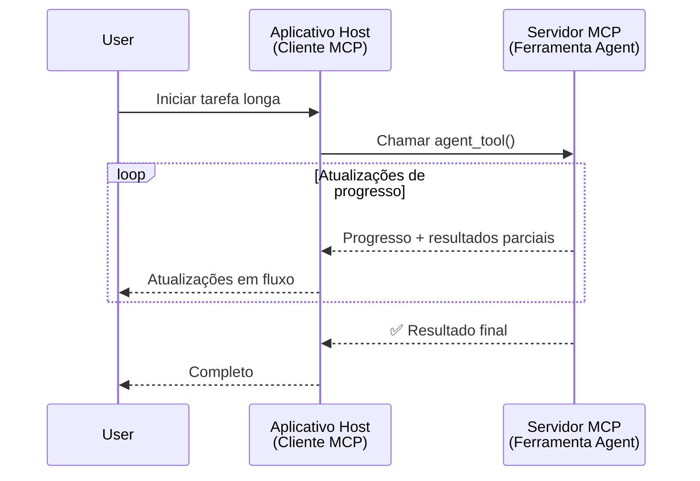
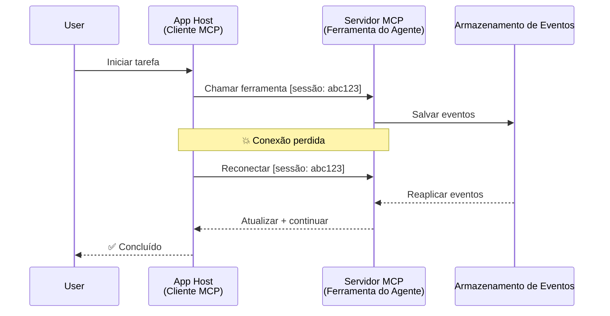
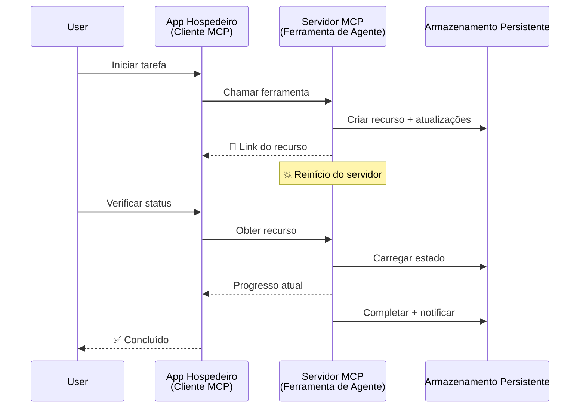
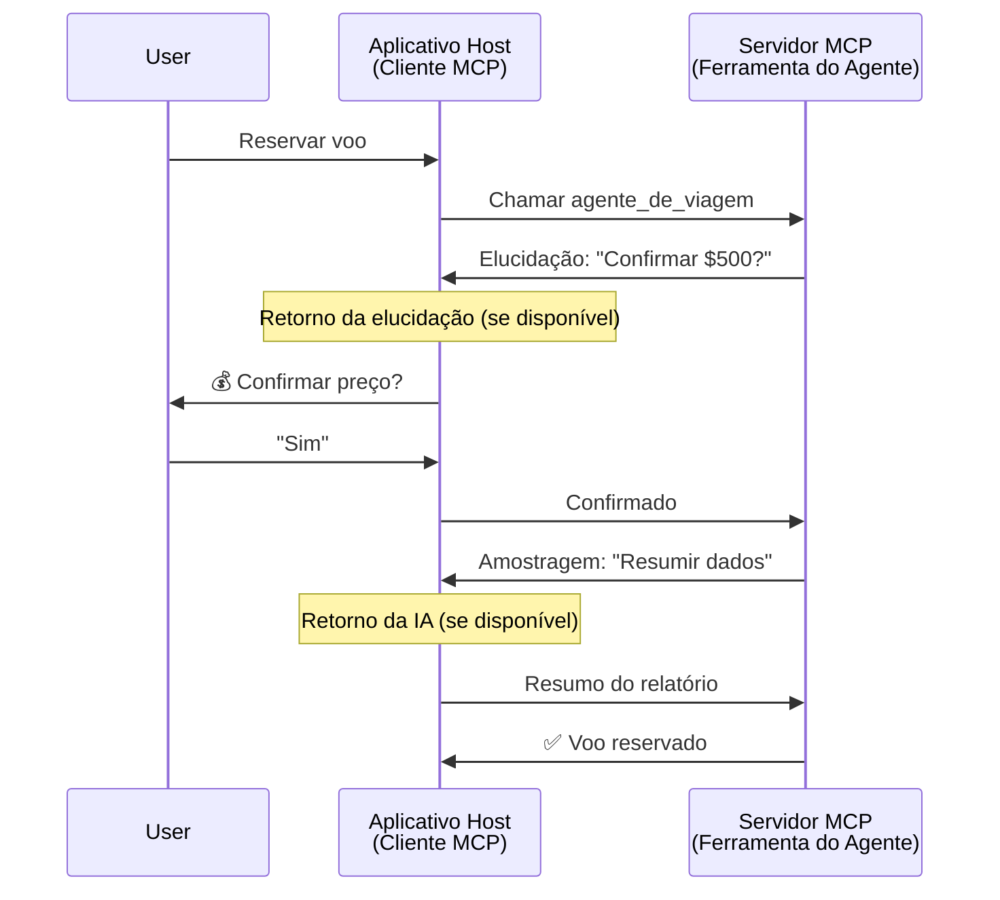
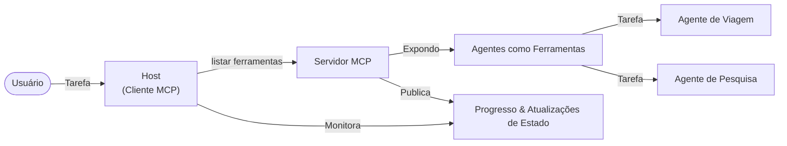

# Construindo Sistemas de Comunicação Agente-para-Agente com MCP

> TL;DR - Você pode construir comunicação Agent2Agent no MCP? Sim!

O MCP evoluiu significativamente além de seu objetivo original de "fornecer contexto para LLMs". Com aprimoramentos recentes, incluindo [streams retomáveis](https://modelcontextprotocol.io/docs/concepts/transports#resumability-and-redelivery), [elicitação](https://modelcontextprotocol.io/specification/2025-06-18/client/elicitation), [amostragem](https://modelcontextprotocol.io/specification/2025-06-18/client/sampling) e notificações ([progresso](https://modelcontextprotocol.io/specification/2025-06-18/basic/utilities/progress) e [recursos](https://modelcontextprotocol.io/specification/2025-06-18/schema#resourceupdatednotification)), o MCP agora fornece uma base robusta para construir sistemas complexos de comunicação agente-para-agente.

## O Equívoco sobre Agente/Ferramenta

À medida que mais desenvolvedores exploram ferramentas com comportamentos agenticos (executam por longos períodos, podem exigir entradas adicionais durante a execução, etc.), um equívoco comum é que o MCP é inadequado, principalmente porque exemplos iniciais de ferramentas primitivas focaram em padrões simples de requisição-resposta.

Essa percepção está desatualizada. A especificação MCP foi significativamente aprimorada nos últimos meses com capacidades que fecham a lacuna para construir comportamentos agenticos de longa duração:

- **Streaming e Resultados Parciais**: Atualizações de progresso em tempo real durante a execução
- **Retomabilidade**: Clientes podem reconectar e continuar após desconexão
- **Durabilidade**: Resultados sobrevivem a reinícios do servidor (por exemplo, via links de recurso)
- **Multi-turno**: Entrada interativa no meio da execução por meio de elicitação e amostragem

Esses recursos podem ser combinados para possibilitar aplicações agenticas e multiagentes complexas, todas implantadas no protocolo MCP.

Para referência, chamaremos um agente de "ferramenta" disponível em um servidor MCP. Isso implica a existência de uma aplicação host que implementa um cliente MCP, estabelece uma sessão com o servidor MCP e pode invocar o agente.

## O que Torna uma Ferramenta MCP "Agentica"?

Antes de mergulhar na implementação, vamos estabelecer quais capacidades de infraestrutura são necessárias para apoiar agentes de longa duração.

> Definiremos um agente como uma entidade que pode operar autonomamente por períodos prolongados, capaz de lidar com tarefas complexas que podem requerer múltiplas interações ou ajustes baseados em feedback em tempo real.

### 1. Streaming e Resultados Parciais

Padrões tradicionais de requisição-resposta não funcionam para tarefas longas. Agentes precisam fornecer:

- Atualizações de progresso em tempo real
- Resultados intermediários

**Suporte MCP**: Notificações de atualização de recurso permitem a transmissão de resultados parciais, embora isso exija um design cuidadoso para evitar conflitos com o modelo 1:1 de requisição/resposta do JSON-RPC.

| Recurso                   | Caso de Uso                                                                                                                                                              | Suporte MCP                                                                               |
| ------------------------- | ----------------------------------------------------------------------------------------------------------------------------------------------------------------------- | ----------------------------------------------------------------------------------------- |
| Atualizações de Progresso | Usuário solicita uma tarefa de migração de base de código. O agente transmite progresso: "10% - Analisando dependências... 25% - Convertendo arquivos TypeScript... 50% - Atualizando importações..."          | ✅ Notificações de progresso                                                               |
| Resultados Parciais       | Tarefa "Gerar um livro" transmite resultados parciais, por exemplo, 1) Esboço do arco da história, 2) Lista de capítulos, 3) Cada capítulo conforme concluído. O host pode inspecionar, cancelar ou redirecionar em qualquer etapa. | ✅ Notificações podem ser "estendidas" para incluir resultados parciais - veja propostas nos PR 383, 776 |

<div align="center" style="font-style: italic; font-size: 0.95em; margin-bottom: 0.5em;">
<strong>Figura 1:</strong> Este diagrama ilustra como um agente MCP transmite atualizações de progresso em tempo real e resultados parciais para a aplicação host durante uma tarefa de longa duração, permitindo que o usuário monitore a execução em tempo real.
</div>



### 2. Retomabilidade

Agentes devem lidar graciosamente com interrupções de rede:

- Reconectar após desconexão (cliente)
- Continuar de onde pararam (reenvio de mensagem)

**Suporte MCP**: Hoje, o transporte StreamableHTTP do MCP suporta retomada de sessão e reenvio de mensagens com IDs de sessão e IDs do último evento. A nota importante aqui é que o servidor deve implementar um EventStore que possibilite repetição de eventos na reconexão do cliente.  
Observe que há uma proposta comunitária (PR #975) que explora streams retomáveis independentes do transporte.

| Recurso      | Caso de Uso                                                                                                                                               | Suporte MCP                                                                |
| ------------ | -------------------------------------------------------------------------------------------------------------------------------------------------------- | -------------------------------------------------------------------------- |
| Retomabilidade | Cliente desconecta durante uma tarefa longa. Ao reconectar, a sessão é retomada com eventos perdidos reproduzidos, continuando sem interrupções de onde parou. | ✅ Transporte StreamableHTTP com IDs de sessão, reprodução de eventos e EventStore |

<div align="center" style="font-style: italic; font-size: 0.95em; margin-bottom: 0.5em;">
<strong>Figura 2:</strong> Este diagrama mostra como o transporte StreamableHTTP do MCP e o armazenamento de eventos permitem a retomada de sessão sem interrupções: se o cliente desconectar, pode reconectar e reproduzir eventos perdidos, continuando a tarefa sem perda de progresso.
</div>



### 3. Durabilidade

Agentes de longa duração precisam de estado persistente:

- Resultados sobrevivem a reinícios do servidor
- Estado pode ser recuperado fora de banda
- Rastreamento de progresso entre sessões

**Suporte MCP**: O MCP agora suporta um tipo de retorno de link de recurso para chamadas de ferramentas. Hoje, um padrão possível é projetar uma ferramenta que cria um recurso e retorna imediatamente um link para o recurso. A ferramenta pode continuar a tratar a tarefa em segundo plano e atualizar o recurso. Por sua vez, o cliente pode optar por consultar o estado desse recurso para obter resultados parciais ou completos (com base nas atualizações de recurso fornecidas pelo servidor) ou assinar o recurso para notificações de atualização.

Uma limitação aqui é que consultar recursos ou assinar atualizações pode consumir recursos com implicações em larga escala. Há uma proposta comunitária aberta (incluindo a #992) explorando a possibilidade de incluir webhooks ou triggers que o servidor pode chamar para notificar o cliente/aplicação host sobre atualizações.

| Recurso    | Caso de Uso                                                                                                                                      | Suporte MCP                                                        |
| ---------- | ------------------------------------------------------------------------------------------------------------------------------------------------- | ------------------------------------------------------------------ |
| Durabilidade | Servidor trava durante tarefa de migração de dados. Resultados e progresso sobrevivem ao reinício, cliente pode verificar estado e continuar a partir do recurso persistente. | ✅ Links de recurso com armazenamento persistente e notificações de status |

Hoje, um padrão comum é projetar uma ferramenta que cria um recurso e retorna imediatamente um link de recurso. A ferramenta pode, em segundo plano, tratar a tarefa, emitir notificações de recurso que servem como atualizações de progresso ou incluir resultados parciais, e atualizar o conteúdo no recurso conforme necessário.

<div align="center" style="font-style: italic; font-size: 0.95em; margin-bottom: 0.5em;">
<strong>Figura 3:</strong> Este diagrama demonstra como agentes MCP usam recursos persistentes e notificações de status para assegurar que tarefas longas sobrevivam reinícios do servidor, permitindo que clientes verifiquem o progresso e recuperem resultados mesmo após falhas.
</div>



### 4. Interações Multi-Turno

Agentes frequentemente precisam de entradas adicionais durante a execução:

- Esclarecimento ou aprovação humana
- Assistência de IA para decisões complexas
- Ajuste dinâmico de parâmetros

**Suporte MCP**: Totalmente suportado via amostragem (para entrada de IA) e elicitação (para entrada humana).

| Recurso                 | Caso de Uso                                                                                                                                      | Suporte MCP                                           |
| ----------------------- | ----------------------------------------------------------------------------------------------------------------------------------------------- | ----------------------------------------------------- |
| Interações Multi-Turno   | Agente de reserva de viagem solicita confirmação de preço ao usuário, depois pede para IA resumir dados de viagem antes de completar a reserva. | ✅ Elicitação para entrada humana, amostragem para entrada de IA |

<div align="center" style="font-style: italic; font-size: 0.95em; margin-bottom: 0.5em;">
<strong>Figura 4:</strong> Este diagrama mostra como agentes MCP podem interativamente elicitar entrada humana ou solicitar assistência de IA durante a execução, suportando fluxos multi-turno complexos como confirmações e decisões dinâmicas.
</div>



## Implementando Agentes de Longa Duração no MCP - Visão Geral do Código

Como parte deste artigo, fornecemos um [repositório de código](https://github.com/victordibia/ai-tutorials/tree/main/MCP%20Agents) que contém uma implementação completa de agentes de longa duração usando o SDK MCP para Python com transporte StreamableHTTP para retomada de sessão e reenvio de mensagens. A implementação demonstra como as capacidades MCP podem ser combinadas para permitir comportamentos sofisticados semelhantes a agentes.

Especificamente, implementamos um servidor com duas ferramentas principais de agente:

- **Agente de Viagem** - Simula um serviço de reserva de viagens com confirmação de preço via elicitação
- **Agente de Pesquisa** - Executa tarefas de pesquisa com resumos assistidos por IA via amostragem

Ambos os agentes demonstram atualizações de progresso em tempo real, confirmações interativas e capacidades completas de retomada de sessão.

### Conceitos Chave da Implementação

As seções seguintes mostram a implementação do agente no lado servidor e o tratamento pelo host cliente para cada capacidade:

#### Streaming & Atualizações de Progresso - Status de Tarefa em Tempo Real

Streaming permite que agentes forneçam atualizações de progresso em tempo real durante tarefas de longa duração, mantendo os usuários informados do estado da tarefa e resultados intermediários.

**Implementação no Servidor (agente envia notificações de progresso):**

```python
# Do servidor/server.py - Agente de viagem enviando atualizações de progresso
for i, step in enumerate(steps):
    await ctx.session.send_progress_notification(
        progress_token=ctx.request_id,
        progress=i * 25,
        total=100,
        message=step,
        related_request_id=str(ctx.request_id)
    )
    await anyio.sleep(2)  # Simular trabalho

# Alternativa: Registrar mensagens para atualizações detalhadas passo a passo
await ctx.session.send_log_message(
    level="info",
    data=f"Processing step {current_step}/{steps} ({progress_percent}%)",
    logger="long_running_agent",
    related_request_id=ctx.request_id,
)
```

**Implementação no Cliente (host recebe atualizações de progresso):**

```python
# Do client/client.py - Cliente lidando com notificações em tempo real
async def message_handler(message) -> None:
    if isinstance(message, types.ServerNotification):
        if isinstance(message.root, types.LoggingMessageNotification):
            console.print(f"📡 [dim]{message.root.params.data}[/dim]")
        elif isinstance(message.root, types.ProgressNotification):
            progress = message.root.params
            console.print(f"🔄 [yellow]{progress.message} ({progress.progress}/{progress.total})[/yellow]")

# Registrar manipulador de mensagens ao criar sessão
async with ClientSession(
    read_stream, write_stream,
    message_handler=message_handler
) as session:
```

#### Elicitação - Solicitando Entrada do Usuário

Elicitação permite que agentes solicitem entrada do usuário no meio da execução. Isso é essencial para confirmações, esclarecimentos ou aprovações durante tarefas longas.

**Implementação no Servidor (agente solicita confirmação):**

```python
# Do servidor/server.py - Agente de viagens solicitando confirmação de preço
elicit_result = await ctx.session.elicit(
    message=f"Please confirm the estimated price of $1200 for your trip to {destination}",
    requestedSchema=PriceConfirmationSchema.model_json_schema(),
    related_request_id=ctx.request_id,
)

if elicit_result and elicit_result.action == "accept":
    # Continuar com a reserva
    logger.info(f"User confirmed price: {elicit_result.content}")
elif elicit_result and elicit_result.action == "decline":
    # Cancelar a reserva
    booking_cancelled = True
```

**Implementação no Cliente (host fornece callback de elicitação):**

```python
# Do client/client.py - Manipulação de requisições de elicitação pelo cliente
async def elicitation_callback(context, params):
    console.print(f"💬 Server is asking for confirmation:")
    console.print(f"   {params.message}")

    response = console.input("Do you accept? (y/n): ").strip().lower()

    if response in ['y', 'yes']:
        return types.ElicitResult(
            action="accept",
            content={"confirm": True, "notes": "Confirmed by user"}
        )
    else:
        return types.ElicitResult(
            action="decline",
            content={"confirm": False, "notes": "Declined by user"}
        )

# Registrar o callback ao criar a sessão
async with ClientSession(
    read_stream, write_stream,
    elicitation_callback=elicitation_callback
) as session:
```

#### Amostragem - Solicitando Assistência de IA

Amostragem permite que agentes solicitem assistência do LLM para decisões complexas ou geração de conteúdo durante a execução. Isso habilita fluxos híbridos humano-IA.

**Implementação no Servidor (agente solicita assistência de IA):**

```python
# De server/server.py - Agente de pesquisa solicitando resumo de IA
sampling_result = await ctx.session.create_message(
    messages=[
        SamplingMessage(
            role="user",
            content=TextContent(type="text", text=f"Please summarize the key findings for research on: {topic}")
        )
    ],
    max_tokens=100,
    related_request_id=ctx.request_id,
)

if sampling_result and sampling_result.content:
    if sampling_result.content.type == "text":
        sampling_summary = sampling_result.content.text
        logger.info(f"Received sampling summary: {sampling_summary}")
```

**Implementação no Cliente (host fornece callback de amostragem):**

```python
# De client/client.py - Cliente lidando com solicitações de amostragem
async def sampling_callback(context, params):
    message_text = params.messages[0].content.text if params.messages else 'No message'
    console.print(f"🧠 Server requested sampling: {message_text}")

    # Em uma aplicação real, isso poderia chamar uma API de LLM
    # Para fins de demonstração, fornecemos uma resposta simulada
    mock_response = "Based on current research, MCP has evolved significantly..."

    return types.CreateMessageResult(
        role="assistant",
        content=types.TextContent(type="text", text=mock_response),
        model="interactive-client",
        stopReason="endTurn"
    )

# Registrar o callback ao criar a sessão
async with ClientSession(
    read_stream, write_stream,
    sampling_callback=sampling_callback,
    elicitation_callback=elicitation_callback
) as session:
```

#### Retomabilidade - Continuidade de Sessão Através de Desconexões

Retomabilidade garante que tarefas de agentes longos possam sobreviver a desconexões do cliente e continuar sem interrupções após reconexão. Isso é implementado via armazenamento de eventos e tokens de retomada.

**Implementação do Event Store (servidor mantém estado da sessão):**

```python
# De server/event_store.py - Armazenamento de evento simples em memória
class SimpleEventStore(EventStore):
    def __init__(self):
        self._events: list[tuple[StreamId, EventId, JSONRPCMessage]] = []
        self._event_id_counter = 0

    async def store_event(self, stream_id: StreamId, message: JSONRPCMessage) -> EventId:
        """Store an event and return its ID."""
        self._event_id_counter += 1
        event_id = str(self._event_id_counter)
        self._events.append((stream_id, event_id, message))
        return event_id

    async def replay_events_after(self, last_event_id: EventId, send_callback: EventCallback) -> StreamId | None:
        """Replay events after the specified ID for resumption."""
        start_index = None
        stream_id = None
        for index, (event_stream_id, event_id, _) in enumerate(self._events):
            if event_id == last_event_id:
                start_index = index + 1
                stream_id = event_stream_id
                break

        if start_index is None:
            return None

        # Reproduzir apenas eventos posteriores do fluxo original da sessão.
        for event_stream_id, event_id, message in self._events[start_index:]:
            if event_stream_id != stream_id:
                continue
            await send_callback(EventMessage(message, event_id))

        return stream_id

# De server/server.py - Passando armazenamento de evento para o gerenciador de sessão
def create_server_app(event_store: Optional[EventStore] = None) -> Starlette:
    server = ResumableServer()

    # Criar gerenciador de sessão com armazenamento de evento para retomada
    session_manager = StreamableHTTPSessionManager(
        app=server,
        event_store=event_store,  # Armazenamento de evento permite retomada de sessão
        json_response=False,
        security_settings=security_settings,
    )

    return Starlette(routes=[Mount("/mcp", app=session_manager.handle_request)])

# Uso: Inicializar com armazenamento de evento
event_store = SimpleEventStore()
app = create_server_app(event_store)
```

**Metadados do Cliente com Token de Retomada (cliente reconecta usando estado armazenado):**

```python
# De client/client.py - Retomada do cliente com metadados
if existing_tokens and existing_tokens.get("resumption_token"):
    # Use o token de retomada existente para continuar de onde paramos
    metadata = ClientMessageMetadata(
        resumption_token=existing_tokens["resumption_token"],
    )
else:
    # Crie uma callback para salvar o token de retomada quando recebido
    def enhanced_callback(token: str):
        protocol_version = getattr(session, 'protocol_version', None)
        token_manager.save_tokens(session_id, token, protocol_version, command, args)

    metadata = ClientMessageMetadata(
        on_resumption_token_update=enhanced_callback,
    )

# Enviar solicitação com metadados de retomada
result = await session.send_request(
    types.ClientRequest(
        types.CallToolRequest(
            method="tools/call",
            params=types.CallToolRequestParams(name=command, arguments=args)
        )
    ),
    types.CallToolResult,
    metadata=metadata,
)
```

A aplicação host mantém localmente IDs de sessão e tokens de retomada, permitindo que reconecte a sessões existentes sem perda de progresso ou estado.

### Organização do Código

<div align="center" style="font-style: italic; font-size: 0.95em; margin-bottom: 0.5em;">
<strong>Figura 5:</strong> Arquitetura do sistema de agentes baseado em MCP
</div>



**Arquivos Chave:**

- **`server/server.py`** - Servidor MCP retomável com agentes de viagem e pesquisa que demonstram elicitação, amostragem e atualizações de progresso
- **`client/client.py`** - Aplicação host interativa com suporte a retomada, manipuladores de callbacks e gerenciamento de tokens
- **`server/event_store.py`** - Implementação do armazenamento de eventos que possibilita retomada de sessão e reenvio de mensagens

## Extensão para Comunicação Multiagente no MCP

A implementação acima pode ser estendida para sistemas multiagente ampliando a inteligência e escopo da aplicação host:

- **Decomposição Inteligente de Tarefas**: Host analisa solicitações de usuário complexas e as divide em subtarefas para agentes especializados diferentes
- **Coordenação Multi-Servidor**: Host mantém conexões com múltiplos servidores MCP, cada um oferecendo diferentes capacidades de agentes
- **Gerenciamento de Estado de Tarefa**: Host rastreia o progresso de várias tarefas de agentes concorrentes, lidando com dependências e sequenciamento
- **Resiliência e Repetições**: Host gerencia falhas, implementa lógica de tentativa e redireciona tarefas quando agentes ficam indisponíveis
- **Síntese de Resultados**: Host combina saídas de múltiplos agentes em resultados finais coerentes

O host evolui de um cliente simples para um orquestrador inteligente, coordenando capacidades distribuídas de agentes enquanto mantém a mesma base do protocolo MCP.

## Conclusão

As capacidades aprimoradas do MCP - notificações de recursos, elicitação/amostragem, streams retomáveis e recursos persistentes - habilitam interações complexas agente-para-agente mantendo a simplicidade do protocolo.

## Começando

Pronto para construir seu próprio sistema agent2agent? Siga estes passos:

### 1. Execute a Demonstração

```bash
# Inicie o servidor com armazenamento de eventos para retomada
python -m server.server --port 8006

# Em outro terminal, execute o cliente interativo
python -m client.client --url http://127.0.0.1:8006/mcp
```

**Comandos disponíveis no modo interativo:**

- `travel_agent` - Reservar viagem com confirmação de preço via elicitação
- `research_agent` - Pesquisar temas com resumos assistidos por IA via amostragem
- `list` - Mostrar todas as ferramentas disponíveis
- `clean-tokens` - Limpar tokens de retomada
- `help` - Mostrar ajuda detalhada dos comandos
- `quit` - Sair do cliente

### 2. Teste as Capacidades de Retomada

- Inicie um agente de longa duração (ex: `travel_agent`)
- Interrompa o cliente durante a execução (Ctrl+C)
- Reinicie o cliente - ele automaticamente retomará de onde parou

### 3. Explore e Expanda

- **Explore os exemplos**: Confira este [mcp-agents](https://github.com/victordibia/ai-tutorials/tree/main/MCP%20Agents)
- **Participe da comunidade**: Participe das discussões MCP no GitHub
- **Experimente**: Comece com uma tarefa simples de longa duração e gradualmente adicione streaming, retomabilidade e coordenação multiagente

Isso demonstra como o MCP habilita comportamentos inteligentes de agente enquanto mantém a simplicidade baseada em ferramentas.

No geral, a especificação do protocolo MCP está evoluindo rapidamente; o leitor é incentivado a revisar o site oficial da documentação para as atualizações mais recentes - https://modelcontextprotocol.io/introduction

---

<!-- CO-OP TRANSLATOR DISCLAIMER START -->
**Aviso Legal**:
Este documento foi traduzido usando o serviço de tradução por IA [Co-op Translator](https://github.com/Azure/co-op-translator). Embora nos esforcemos pela precisão, por favor, esteja ciente de que traduções automatizadas podem conter erros ou imprecisões. O documento original em seu idioma nativo deve ser considerado a fonte autorizada. Para informações críticas, recomenda-se tradução profissional humana. Não nos responsabilizamos por quaisquer mal-entendidos ou interpretações incorretas decorrentes do uso desta tradução.
<!-- CO-OP TRANSLATOR DISCLAIMER END -->