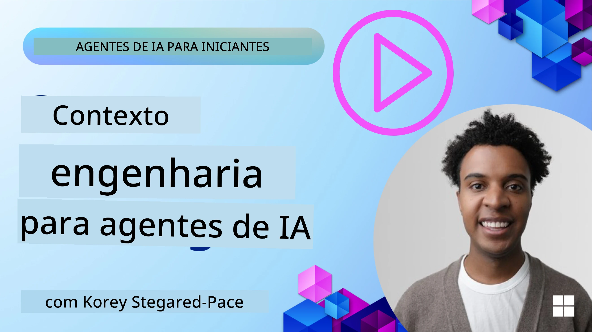
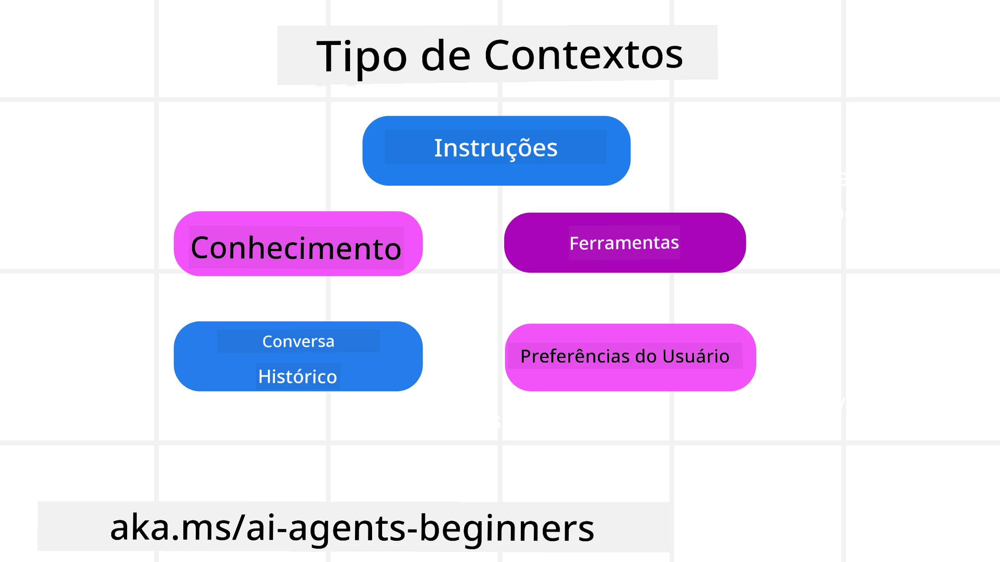

# Engenharia de Contexto para Agentes de IA

> _(Clique na imagem acima para assistir ao vídeo desta lição)_

Compreender a complexidade do aplicativo para o qual você está construindo um agente de IA é importante para criar um confiável. Precisamos construir Agentes de IA que gerenciem efetivamente as informações para atender a necessidades complexas além da engenharia de prompts.

Nesta lição, veremos o que é engenharia de contexto e seu papel na construção de agentes de IA.

## Introdução

Esta lição cobrirá:

• **O que é Engenharia de Contexto** e por que é diferente da engenharia de prompts.

• **Estratégias para uma Engenharia de Contexto eficaz**, incluindo como escrever, selecionar, comprimir e isolar informações.

• **Falhas Comuns de Contexto** que podem atrapalhar seu agente de IA e como corrigi-las.

## Objetivos de Aprendizagem

Após concluir esta lição, você saberá como:

• **Definir engenharia de contexto** e diferenciá-la da engenharia de prompts.

• **Identificar os componentes-chave do contexto** em aplicações de Modelos de Linguagem Ampla (LLM).

• **Aplicar estratégias para escrever, selecionar, comprimir e isolar contexto** para melhorar o desempenho do agente.

• **Reconhecer falhas comuns de contexto** como envenenamento, distração, confusão e conflito, e implementar técnicas de mitigação.

## O que é Engenharia de Contexto?

Para Agentes de IA, o contexto é o que orienta o planejamento do agente para tomar certas ações. Engenharia de Contexto é a prática de garantir que o Agente de IA possua as informações corretas para completar o próximo passo da tarefa. A janela de contexto é limitada em tamanho, então, como construtores de agentes, precisamos criar sistemas e processos para gerenciar a adição, remoção e condensação das informações na janela de contexto.

### Engenharia de Prompt vs Engenharia de Contexto

Engenharia de prompt foca em um conjunto único de instruções estáticas para orientar efetivamente os Agentes de IA com um conjunto de regras. A engenharia de contexto é como gerenciar um conjunto dinâmico de informações, incluindo o prompt inicial, para garantir que o Agente de IA tenha o que precisa ao longo do tempo. A ideia principal da engenharia de contexto é tornar esse processo repetível e confiável.

### Tipos de Contexto

É importante lembrar que o contexto não é apenas uma coisa. As informações que o Agente de IA precisa podem vir de várias fontes diferentes, e cabe a nós garantir que o agente tenha acesso a essas fontes:

Os tipos de contexto que um agente de IA pode precisar gerenciar incluem:

• **Instruções:** São como as "regras" do agente – prompts, mensagens do sistema, exemplos few-shot (mostrando à IA como fazer algo) e descrições das ferramentas que ele pode usar. É aqui que o foco da engenharia de prompts se combina com a engenharia de contexto.

• **Conhecimento:** Abrange fatos, informações recuperadas de bancos de dados, ou memórias de longo prazo que o agente acumulou. Isso inclui integrar um sistema de Geração Aumentada por Recuperação (RAG) se o agente precisar acessar diferentes repositórios de conhecimento e bancos de dados.

• **Ferramentas:** São as definições de funções externas, APIs e Servidores MCP que o agente pode chamar, junto com o feedback (resultados) que obtém ao usá-las.

• **Histórico de Conversação:** O diálogo em andamento com um usuário. Conforme o tempo passa, essas conversas se tornam mais longas e complexas, o que significa que ocupam espaço na janela de contexto.

• **Preferências do Usuário:** Informações aprendidas sobre gostos ou desgostos do usuário ao longo do tempo. Podem ser armazenadas e acessadas ao tomar decisões importantes para ajudar o usuário.

## Estratégias para uma Engenharia de Contexto Eficaz

### Estratégias de Planejamento

Uma boa engenharia de contexto começa com um bom planejamento. Aqui está uma abordagem que ajudará você a começar a pensar em como aplicar o conceito de engenharia de contexto:

1. **Definir Resultados Claros** – Os resultados das tarefas que os Agentes de IA irão executar devem ser claramente definidos. Responda à pergunta – “Como o mundo estará quando o Agente de IA terminar sua tarefa?” Em outras palavras, qual mudança, informação ou resposta o usuário deve ter após interagir com o Agente de IA.
2. **Mapear o Contexto** – Depois de definir os resultados do Agente de IA, é preciso responder “Qual informação o Agente de IA precisa para completar essa tarefa?”. Assim, você pode começar a mapear o contexto e onde essa informação pode ser localizada.
3. **Criar Pipelines de Contexto** – Agora que você sabe onde a informação está, precisa responder “Como o Agente obterá essa informação?”. Isso pode ser feito de várias formas, incluindo RAG, uso de servidores MCP e outras ferramentas.

### Estratégias Práticas

Planejar é importante, mas assim que a informação começar a fluir para a janela de contexto do nosso agente, precisamos de estratégias práticas para gerenciá-la:

#### Gerenciando o Contexto

Embora alguma informação seja adicionada automaticamente à janela de contexto, engenharia de contexto é assumir um papel mais ativo sobre essa informação, o que pode ser feito por algumas estratégias:

 1. **Bloco de Notas do Agente**  
 Permite que um Agente de IA tome notas das informações relevantes sobre as tarefas atuais e interações do usuário durante uma única sessão. Isso deve existir fora da janela de contexto, em um arquivo ou objeto de tempo de execução que o agente possa recuperar depois durante essa sessão, se necessário.

 2. **Memórias**  
 Blocos de notas são bons para gerenciar informações fora da janela de contexto em uma única sessão. Memórias permitem que agentes armazenem e recuperem informações relevantes ao longo de múltiplas sessões. Isso pode incluir resumos, preferências do usuário e feedback para melhorias futuras.

 3. **Compressão de Contexto**  
 Quando a janela de contexto cresce e está próxima do limite, técnicas como sumarização e corte podem ser usadas. Isso inclui manter apenas as informações mais relevantes ou remover mensagens mais antigas.

 4. **Sistemas Multi-Agentes**  
 Desenvolver sistemas multi-agentes é uma forma de engenharia de contexto porque cada agente tem sua própria janela de contexto. Como esse contexto é compartilhado e passado para diferentes agentes é outro aspecto a planejar na construção desses sistemas.

 5. **Ambientes Sandbox**  
 Se um agente precisar executar algum código ou processar grandes quantidades de informação em um documento, isso pode consumir muitos tokens para processar os resultados. Em vez de armazenar tudo na janela de contexto, o agente pode usar um ambiente sandbox que executa o código e apenas lê os resultados e outras informações relevantes.

 6. **Objetos de Estado em Tempo de Execução**  
 Isso é feito criando containers de informação para gerenciar situações em que o Agente precisa ter acesso a certas informações. Para uma tarefa complexa, isso permitiria que o Agente armazenasse os resultados de cada subtarefa passo a passo, permitindo que o contexto permaneça conectado apenas àquela subtarefa específica.

#### Inspecionando o Contexto

Depois de aplicar uma dessas estratégias, vale a pena verificar o que a próxima chamada ao modelo realmente recebeu. Uma pergunta útil para depuração é:

> O agente carregou contexto demais, contexto errado, ou faltou contexto necessário?

Você não precisa registrar prompts brutos, saídas de ferramentas ou conteúdos da memória para responder a essa pergunta. Em produção, prefira pequenos registros de inspeção de contexto que capturem contagens, ids, hashes e rótulos de política:

- **Seleção:** Acompanhe quantos fragmentos candidatos, ferramentas ou memórias foram considerados, quantos foram selecionados, e qual regra ou pontuação causou a filtragem dos demais.
- **Compressão:** Registre o intervalo de origem ou id de rastreamento, o id do resumo, uma estimativa da contagem de tokens antes e depois da compressão, e se o conteúdo bruto foi excluído da próxima chamada.
- **Isolamento:** Anote qual subtarefa rodou em um agente separado, sessão ou sandbox, qual resumo limitado foi retornado e se a saída de ferramentas grandes ficou fora do contexto do agente pai.
- **Memória e RAG:** Armazene ids de documentos recuperados, ids de memória, pontuações, ids selecionados e status de redação em vez do texto completo recuperado.
- **Segurança e privacidade:** Prefira hashes, ids, tokens em balde e rótulos de política em vez de texto sensível do prompt, argumentos ou resultados de ferramenta, ou corpos de memória do usuário.

O objetivo não é manter mais contexto. É deixar evidências suficientes para que um desenvolvedor saiba qual estratégia de contexto foi aplicada e se isso mudou a próxima chamada ao modelo da maneira pretendida.

### Exemplo de Engenharia de Contexto

Digamos que queremos que um agente de IA **"Reserve uma viagem para Paris para mim."**

• Um agente simples usando apenas engenharia de prompt talvez apenas responda: **"Ok, quando você gostaria de ir para Paris?"** Ele só processou sua pergunta direta no momento em que o usuário fez.

• Um agente usando as estratégias de engenharia de contexto apresentadas faria muito mais. Antes de responder, seu sistema poderia:

  ◦ **Verificar seu calendário** para datas disponíveis (recuperando dados em tempo real).

 ◦ **Recordar preferências de viagens passadas** (da memória de longo prazo), como sua companhia aérea preferida, orçamento, ou se prefere voos diretos.

 ◦ **Identificar ferramentas disponíveis** para reserva de voos e hotéis.

- Então, uma resposta exemplo poderia ser: "Olá [Seu Nome]! Vejo que você está livre na primeira semana de outubro. Devo procurar voos diretos para Paris na [Companhia Aérea Preferida] dentro do seu orçamento usual de [Orçamento]?" Essa resposta mais rica e consciente do contexto demonstra o poder da engenharia de contexto.

## Falhas Comuns de Contexto

### Envenenamento de Contexto

**O que é:** Quando uma alucinação (informação falsa gerada pelo LLM) ou um erro entra no contexto e é repetidamente referenciado, fazendo o agente perseguir metas impossíveis ou desenvolver estratégias sem sentido.

**O que fazer:** Implemente **validação de contexto** e **quarentena**. Valide informações antes de adicioná-las à memória de longo prazo. Se um possível envenenamento for detectado, inicie novos fios de contexto para evitar que a informação ruim se espalhe.

**Exemplo de Reserva de Viagem:** Seu agente alucina um **voo direto de um pequeno aeroporto local para uma cidade internacional distante** que na realidade não oferece voos internacionais. Esse detalhe de voo inexistente é salvo no contexto. Depois, quando você pede para reservar, ele continua tentando encontrar passagens para essa rota impossível, gerando erros repetidos.

**Solução:** Implemente uma etapa que **valide a existência e rotas do voo com uma API em tempo real** _antes_ de adicionar o detalhe do voo ao contexto de trabalho do agente. Se a validação falhar, a informação incorreta é "quarentenada" e não usada adiante.

### Distração de Contexto

**O que é:** Quando o contexto fica tão grande que o modelo foca demais no histórico acumulado em vez do que aprendeu durante o treinamento, levando a ações repetitivas ou inúteis. Modelos podem começar a cometer erros mesmo antes da janela de contexto estar cheia.

**O que fazer:** Use **sumarização de contexto**. Periodicamente, comprima a informação acumulada em resumos mais curtos, mantendo detalhes importantes e removendo histórico redundante. Isso ajuda a "resetar" o foco.

**Exemplo de Reserva de Viagem:** Você vem discutindo vários destinos de viagem dos sonhos por muito tempo, incluindo um relato detalhado da sua viagem de mochilão de dois anos atrás. Quando finalmente pede para **"encontrar um voo barato para o próximo mês"**, o agente fica preso nos detalhes antigos e irrelevantes do mochilão e continua perguntando sobre seu equipamento ou roteiros antigos, negligenciando seu pedido atual.

**Solução:** Após certo número de turnos ou quando o contexto crescer demais, o agente deve **resumir as partes mais recentes e relevantes da conversa** – focando nas suas datas e destino atuais – e usar esse resumo condensado para a próxima chamada ao LLM, descartando o chat histórico menos relevante.

### Confusão de Contexto

**O que é:** Quando contexto desnecessário, muitas vezes na forma de muitas ferramentas disponíveis, faz o modelo gerar respostas ruins ou chamar ferramentas irrelevantes. Modelos menores são especialmente propensos a isso.

**O que fazer:** Implemente **gerenciamento de carga de ferramentas** usando técnicas RAG. Armazene descrições de ferramentas em um banco de dados vetorial e selecione _apenas_ as ferramentas mais relevantes para cada tarefa específica. Pesquisas mostram que limitar a seleção a menos de 30 é ideal.

**Exemplo de Reserva de Viagem:** Seu agente tem acesso a dezenas de ferramentas: `book_flight`, `book_hotel`, `rent_car`, `find_tours`, `currency_converter`, `weather_forecast`, `restaurant_reservations`, etc. Você pergunta: **"Qual a melhor forma de se locomover em Paris?"** Devido à grande quantidade de ferramentas, o agente fica confuso e tenta chamar `book_flight` _dentro_ de Paris, ou `rent_car` mesmo você preferindo transporte público, porque as descrições das ferramentas podem se sobrepor ou ele simplesmente não consegue discernir a melhor.

**Solução:** Use **RAG sobre as descrições de ferramentas**. Quando você pergunta como se locomover em Paris, o sistema recupera _apenas_ as ferramentas mais relevantes como `rent_car` ou `public_transport_info` com base na sua consulta, apresentando uma "carga" focada de ferramentas para o LLM.

### Conflito de Contexto

**O que é:** Quando informações conflitantes existem dentro do contexto, levando a raciocínios inconsistentes ou respostas finais ruins. Isso costuma acontecer quando a informação chega em etapas, e suposições incorretas iniciais permanecem no contexto.

**O que fazer:** Use **poda de contexto** e **descarregamento**. Poda significa remover informações desatualizadas ou conflitantes à medida que novos detalhes chegam. Descarregamento oferece ao modelo um espaço "bloco de notas" separado para processar informações sem poluir o contexto principal.
**Exemplo de Reserva de Viagem:** Você inicialmente diz ao seu agente, **"Quero voar na classe econômica."** Mais tarde, na conversa, você muda de ideia e diz, **"Na verdade, para esta viagem, vamos na classe executiva."** Se ambas as instruções permanecerem no contexto, o agente pode receber resultados de busca conflitantes ou ficar confuso sobre qual preferência priorizar.

**Solução:** Implemente **podar o contexto**. Quando uma nova instrução contradiz uma antiga, a instrução mais antiga é removida ou explicitamente sobrescrita no contexto. Alternativamente, o agente pode usar um **bloco de anotações** para reconciliar preferências conflitantes antes de decidir, garantindo que somente a instrução final e consistente guie suas ações.

## Tem Mais Perguntas Sobre Engenharia de Contexto?

Junte-se ao [Microsoft Foundry Discord](https://aka.ms/ai-agents/discord) para encontrar outros aprendizes, participar de horas de atendimento e obter respostas às suas perguntas sobre Agentes de IA.

---

<!-- CO-OP TRANSLATOR DISCLAIMER START -->
**Aviso Legal**:
Este documento foi traduzido usando o serviço de tradução por IA [Co-op Translator](https://github.com/Azure/co-op-translator). Embora nos esforcemos pela precisão, por favor, esteja ciente de que traduções automatizadas podem conter erros ou imprecisões. O documento original em seu idioma nativo deve ser considerado a fonte autorizada. Para informações críticas, recomenda-se tradução profissional humana. Não nos responsabilizamos por quaisquer mal-entendidos ou interpretações incorretas decorrentes do uso desta tradução.
<!-- CO-OP TRANSLATOR DISCLAIMER END -->