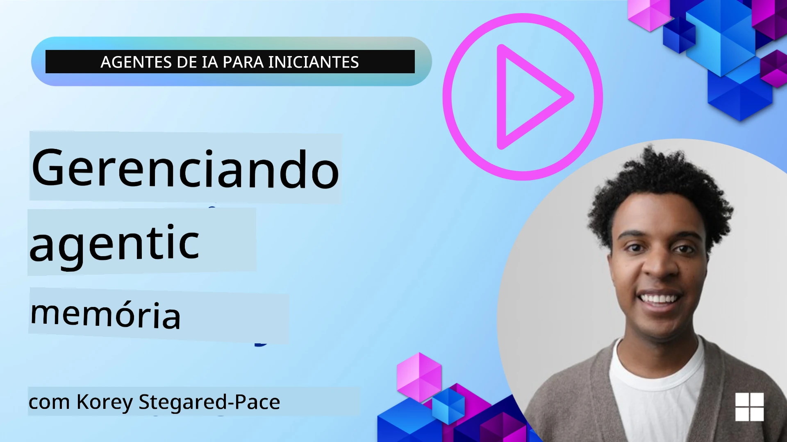

# Memória para Agentes de IA 

When discussing the unique benefits of creating AI Agents, two things are mainly discussed: the ability to call tools to complete tasks and the ability to improve over time. Memory is at the foundation of creating self-improving agent that can create better experiences for our users.

In this lesson, we will look at what memory is for AI Agents and how we can manage it and use it for the benefit of our applications.

## Introdução

Esta lição cobrirá:

• **Entendendo a Memória de Agentes de IA**: O que é memória e por que é essencial para agentes.

• **Implementando e Armazenando Memória**: Métodos práticos para adicionar capacidades de memória aos seus agentes de IA, com foco em memória de curto e longo prazo.

• **Fazendo com que Agentes de IA Melhorem Sozinhos**: Como a memória permite que agentes aprendam com interações passadas e melhorem ao longo do tempo.

## Implementações Disponíveis

This lesson includes two comprehensive notebook tutorials:

• **[13-agent-memory.ipynb](./13-agent-memory.ipynb)**: Implements memory using Mem0 and Azure AI Search with Microsoft Agent Framework

• **[13-agent-memory-cognee.ipynb](./13-agent-memory-cognee.ipynb)**: Implements structured memory using Cognee, automatically building knowledge graph backed by embeddings, visualizing graph, and intelligent retrieval

## Objetivos de Aprendizagem

After completing this lesson, you will know how to:

• **Diferenciar entre vários tipos de memória de agentes de IA**, incluindo memória de trabalho, curto prazo e longo prazo, assim como formas especializadas como persona e memória episódica.

• **Implementar e gerenciar memória de curto e longo prazo para agentes de IA** usando o Microsoft Agent Framework, aproveitando ferramentas como Mem0, Cognee, Whiteboard memory e integrando com Azure AI Search.

• **Entender os princípios por trás de agentes de IA que se autoaperfeiçoam** e como sistemas robustos de gerenciamento de memória contribuem para aprendizado contínuo e adaptação.

## Entendendo a Memória de Agentes de IA

Em sua essência, **memória para agentes de IA refere-se aos mecanismos que permitem que eles retenham e recordem informações**. Essas informações podem ser detalhes específicos sobre uma conversa, preferências do usuário, ações passadas ou até padrões aprendidos.

Sem memória, aplicações de IA frequentemente são sem estado, significando que cada interação começa do zero. Isso leva a uma experiência repetitiva e frustrante para o usuário, onde o agente "esquece" o contexto ou as preferências anteriores.

### Por que a Memória é Importante?

A inteligência de um agente está profundamente ligada à sua capacidade de recordar e utilizar informações passadas. A memória permite que os agentes sejam:

• **Reflexivos**: Aprender com ações e resultados passados.

• **Interativos**: Manter o contexto ao longo de uma conversa em andamento.

• **Proativos e Reativos**: Antecipar necessidades ou responder adequadamente com base em dados históricos.

• **Autônomos**: Operar de forma mais independente ao recorrer ao conhecimento armazenado.

O objetivo de implementar memória é tornar os agentes mais **confiáveis e capazes**.

### Tipos de Memória

#### Memória de Trabalho

Pense nisso como um pedaço de papel rascunho que um agente usa durante uma única tarefa ou processo de pensamento em andamento. Ela contém informações imediatas necessárias para calcular o próximo passo.

Para agentes de IA, a memória de trabalho frequentemente captura as informações mais relevantes de uma conversa, mesmo que todo o histórico do chat seja longo ou truncado. Ela se concentra em extrair elementos-chave como requisitos, propostas, decisões e ações.

**Exemplo de Memória de Trabalho**

Em um agente de reserva de viagens, a memória de trabalho pode capturar a solicitação atual do usuário, como "Quero reservar uma viagem para Paris". Esse requisito específico é mantido no contexto imediato do agente para guiar a interação atual.

#### Memória de Curto Prazo

Esse tipo de memória retém informações pela duração de uma única conversa ou sessão. É o contexto do chat atual, permitindo que o agente se refira a trocas anteriores no diálogo.

**Exemplo de Memória de Curto Prazo**

Se um usuário pergunta, "Quanto custaria um voo para Paris?" e depois complementa com "E a hospedagem lá?", a memória de curto prazo garante que o agente saiba que "lá" se refere a "Paris" dentro da mesma conversa.

#### Memória de Longo Prazo

São informações que persistem através de múltiplas conversas ou sessões. Permite que agentes lembrem preferências do usuário, interações históricas ou conhecimento geral por períodos mais longos. Isso é importante para personalização.

**Exemplo de Memória de Longo Prazo**

Uma memória de longo prazo pode armazenar que "Ben gosta de esquiar e atividades ao ar livre, prefere café com vista para a montanha e quer evitar pistas de esqui avançadas devido a uma lesão passada". Essa informação, aprendida em interações anteriores, influencia recomendações em futuras sessões de planejamento de viagens, tornando-as altamente personalizadas.

#### Memória de Persona

Esse tipo de memória especializado ajuda um agente a desenvolver uma "personalidade" ou "persona" consistente. Permite que o agente lembre detalhes sobre si mesmo ou seu papel pretendido, tornando as interações mais fluidas e focadas.

**Exemplo de Memória de Persona**
Se o agente de viagens for projetado para ser um "planejador de esqui especialista", a memória de persona pode reforçar esse papel, influenciando suas respostas para alinhar com o tom e o conhecimento de um especialista.

#### Memória de Fluxo de Trabalho/Episódica

Essa memória armazena a sequência de passos que um agente toma durante uma tarefa complexa, incluindo sucessos e falhas. É como lembrar "episódios" ou experiências passadas para aprender com elas.

**Exemplo de Memória Episódica**

Se o agente tentou reservar um voo específico, mas falhou devido à indisponibilidade, a memória episódica poderia registrar essa falha, permitindo que o agente tente voos alternativos ou informe o usuário sobre o problema de forma mais informada em uma tentativa subsequente.

#### Memória de Entidades

Isso envolve extrair e lembrar entidades específicas (como pessoas, lugares ou coisas) e eventos das conversas. Permite que o agente construa um entendimento estruturado dos elementos-chave discutidos.

**Exemplo de Memória de Entidades**

De uma conversa sobre uma viagem passada, o agente pode extrair "Paris", "Torre Eiffel" e "jantar no restaurante Le Chat Noir" como entidades. Em uma interação futura, o agente poderia recordar "Le Chat Noir" e se oferecer para fazer uma nova reserva lá.

#### RAG Estruturado (Retrieval Augmented Generation)

Embora RAG seja uma técnica mais ampla, o "RAG Estruturado" é destacado como uma tecnologia de memória poderosa. Ele extrai informações densas e estruturadas de várias fontes (conversas, e-mails, imagens) e as utiliza para melhorar precisão, recuperação e velocidade nas respostas. Ao contrário do RAG clássico, que depende apenas de similaridade semântica, o RAG Estruturado trabalha com a estrutura inerente da informação.

**Exemplo de RAG Estruturado**

Ao invés de apenas combinar palavras-chave, o RAG Estruturado poderia analisar detalhes de voo (destino, data, hora, companhia aérea) a partir de um e-mail e armazená-los de forma estruturada. Isso permite consultas precisas como "Qual voo eu reservei para Paris na terça-feira?"

## Implementando e Armazenando Memória

Implementar memória para agentes de IA envolve um processo sistemático de **gerenciamento de memória**, que inclui gerar, armazenar, recuperar, integrar, atualizar e até "esquecer" (ou excluir) informações. A recuperação é um aspecto particularmente crucial.

### Ferramentas de Memória Especializadas

#### Mem0

Uma forma de armazenar e gerenciar a memória de agentes é usar ferramentas especializadas como Mem0. Mem0 funciona como uma camada de memória persistente, permitindo que agentes recordem interações relevantes, armazenem preferências do usuário e contexto factual, e aprendam com sucessos e falhas ao longo do tempo. A ideia aqui é que agentes sem estado se tornem com estado.

Ele funciona através de um **pipeline de memória em duas fases: extração e atualização**. Primeiro, mensagens adicionadas ao thread de um agente são enviadas ao serviço Mem0, que usa um Large Language Model (LLM) para resumir o histórico de conversa e extrair novas memórias. Subsequentemente, uma fase de atualização guiada por LLM determina se deve adicionar, modificar ou excluir essas memórias, armazenando-as em um armazenamento híbrido que pode incluir bancos de dados vetoriais, de grafo e de chave-valor. Esse sistema também suporta vários tipos de memória e pode incorporar memória em grafo para gerenciar relacionamentos entre entidades.

#### Cognee

Outra abordagem poderosa é usar o **Cognee**, uma memória semântica open-source para agentes de IA que transforma dados estruturados e não estruturados em grafos de conhecimento consultáveis respaldados por embeddings. O Cognee oferece uma **arquitetura de armazenamento dupla** combinando busca por similaridade vetorial com relacionamentos em grafo, permitindo que agentes entendam não apenas quais informações são similares, mas como os conceitos se relacionam entre si.

Ele se destaca em **recuperação híbrida** que mistura similaridade vetorial, estrutura de grafo e raciocínio por LLM - desde a busca de fragmentos brutos até perguntas e respostas conscientes do grafo. O sistema mantém uma **memória viva** que evolui e cresce enquanto permanece consultável como um grafo conectado, suportando tanto o contexto de sessão de curto prazo quanto a memória persistente de longo prazo.

O notebook tutorial do Cognee ([13-agent-memory-cognee.ipynb](./13-agent-memory-cognee.ipynb)) demonstra a construção dessa camada unificada de memória, com exemplos práticos de ingestão de fontes de dados diversas, visualização do grafo de conhecimento e consulta com diferentes estratégias de busca adaptadas às necessidades específicas dos agentes.

### Armazenando Memória com RAG

Beyond specialized memory tools like mem0 , you can leverage robust search services like **Azure AI Search as a backend for storing and retrieving memories**, especially for structured RAG.

This allows you to ground your agent's responses with your own data, ensuring more relevant and accurate answers. Azure AI Search can be used to store user-specific travel memories, product catalogs, or any other domain-specific knowledge.

Azure AI Search supports capabilities like **Structured RAG**, which excels at extracting and retrieving dense, structured information from large datasets like conversation histories, emails, or even images. This provides "superhuman precision and recall" compared to traditional text chunking and embedding approaches.

## Fazendo com que Agentes de IA Melhorem Sozinhos

A common pattern for self-improving agents involves introducing a **"knowledge agent"**. This separate agent observes the main conversation between the user and the primary agent. Its role is to:

1. **Identificar informações valiosas**: Determinar se alguma parte da conversa vale a pena ser salva como conhecimento geral ou preferência específica do usuário.

2. **Extrair e resumir**: Distinguir o aprendizado essencial ou a preferência a partir da conversa.

3. **Armazenar em uma base de conhecimento**: Persistir essa informação extraída, frequentemente em um banco de dados vetorial, para que possa ser recuperada depois.

4. **Aumentar consultas futuras**: Quando o usuário inicia uma nova consulta, o agente de conhecimento recupera informações armazenadas relevantes e as anexa ao prompt do usuário, fornecendo contexto crucial ao agente primário (semelhante ao RAG).

### Otimizações para Memória

• **Gerenciamento de Latência**: Para evitar desacelerar as interações do usuário, um modelo mais barato e rápido pode ser usado inicialmente para verificar rapidamente se uma informação vale a pena ser armazenada ou recuperada, invocando o processo de extração/recuperação mais complexo somente quando necessário.

• **Manutenção da Base de Conhecimento**: Para uma base de conhecimento em crescimento, informações menos usadas podem ser movidas para "armazenamento frio" para gerenciar custos.

## Tem Mais Perguntas Sobre Memória de Agentes?

Join the [Discord do Microsoft Foundry](https://aka.ms/ai-agents/discord) to meet with other learners, attend office hours and get your AI Agents questions answered.

---

<!-- CO-OP TRANSLATOR DISCLAIMER START -->
**Isenção de responsabilidade**:
Este documento foi traduzido usando o serviço de tradução por IA [Co-op Translator](https://github.com/Azure/co-op-translator). Embora nos esforcemos pela precisão, esteja ciente de que traduções automatizadas podem conter erros ou imprecisões. O documento original, em seu idioma nativo, deve ser considerado a fonte autoritativa. Para informações críticas, recomenda-se tradução profissional realizada por um tradutor humano. Não nos responsabilizamos por quaisquer mal-entendidos ou interpretações equivocadas decorrentes do uso desta tradução.
<!-- CO-OP TRANSLATOR DISCLAIMER END -->