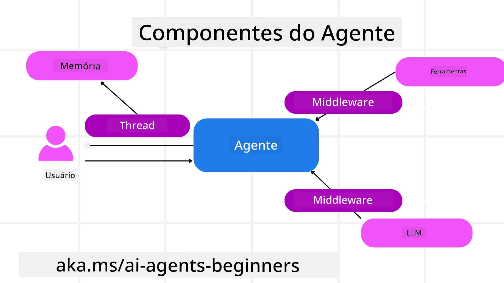

# Explorando o Microsoft Agent Framework


### Introdução

Esta lição abordará:

- Compreendendo o Microsoft Agent Framework: Principais Recursos e Valor  
- Explorando os Conceitos-Chave do Microsoft Agent Framework
- Padrões Avançados do MAF: Workflows, Middleware e Memória

## Objetivos de Aprendizagem

Após concluir esta lição, você saberá como:

- Construir Agentes de IA Prontos para Produção usando o Microsoft Agent Framework
- Aplicar os recursos principais do Microsoft Agent Framework aos seus Casos de Uso Agentes
- Usar padrões avançados incluindo workflows, middleware e observabilidade

## Exemplos de Código

Exemplos de código para [Microsoft Agent Framework (MAF)](https://aka.ms/ai-agents-beginners/agent-framewrok) podem ser encontrados neste repositório nos arquivos `xx-python-agent-framework` e `xx-dotnet-agent-framework`.

## Compreendendo o Microsoft Agent Framework


[Microsoft Agent Framework (MAF)](https://aka.ms/ai-agents-beginners/agent-framewrok) é o framework unificado da Microsoft para construir agentes de IA. Ele oferece a flexibilidade para abordar a ampla variedade de casos de uso agentes, vistos tanto em ambientes de produção quanto de pesquisa, incluindo:

- **Orquestração Sequencial de Agentes** em cenários onde são necessários workflows passo a passo.
- **Orquestração Concorrente** em cenários onde agentes precisam completar tarefas ao mesmo tempo.
- **Orquestração de Conversa em Grupo** em cenários onde agentes podem colaborar juntos em uma tarefa.
- **Orquestração de Transferência** em cenários onde agentes passam a tarefa uns aos outros à medida que subtarefas são concluídas.
- **Orquestração Magnética** em cenários onde um agente gerente cria e modifica uma lista de tarefas e coordena subagentes para completar a tarefa.

Para entregar Agentes de IA em Produção, o MAF também inclui recursos para:

- **Observabilidade** por meio do uso do OpenTelemetry onde cada ação do Agente de IA, incluindo invocação de ferramentas, etapas de orquestração, fluxos de raciocínio e monitoramento de desempenho são feitas através dos dashboards do Microsoft Foundry.
- **Segurança** hospedando agentes nativamente no Microsoft Foundry, que inclui controles de segurança como acesso baseado em função, manipulação de dados privados e segurança de conteúdo integrada.
- **Durabilidade** pois threads e workflows de agentes podem ser pausados, retomados e recuperados de erros, o que possibilita processos de execução prolongada.
- **Controle** já que workflows com intervenção humana são suportados, onde as tarefas são marcadas como requerendo aprovação humana.

O Microsoft Agent Framework também foca na interoperabilidade por:

- **Ser Cloud-agnostic** - Agentes podem rodar em containers, on-premises e em múltiplas clouds diferentes.
- **Ser Provider-agnostic** - Agentes podem ser criados através do seu SDK preferido incluindo Azure OpenAI e OpenAI
- **Integrar Padrões Abertos** - Agentes podem utilizar protocolos como Agent-to-Agent(A2A) e Model Context Protocol (MCP) para descobrir e usar outros agentes e ferramentas.
- **Plugins e Conectores** - Conexões podem ser feitas a serviços de dados e memória como Microsoft Fabric, SharePoint, Pinecone e Qdrant.

Vamos ver como esses recursos são aplicados a alguns dos conceitos centrais do Microsoft Agent Framework.

## Conceitos-Chave do Microsoft Agent Framework

### Agentes



**Criando Agentes**

A criação de agentes é feita definindo o serviço de inferência (Provedor LLM), um conjunto de instruções para o Agente de IA seguir e um `nome` atribuído:

```python
agent = AzureOpenAIChatClient(credential=AzureCliCredential()).create_agent( instructions="You are good at recommending trips to customers based on their preferences.", name="TripRecommender" )
```

O exemplo acima usa `Azure OpenAI`, mas agentes podem ser criados usando uma variedade de serviços, incluindo `Microsoft Foundry Agent Service`:

```python
AzureAIAgentClient(async_credential=credential).create_agent( name="HelperAgent", instructions="You are a helpful assistant." ) as agent
```

APIs OpenAI `Responses`, `ChatCompletion`

```python
agent = OpenAIResponsesClient().create_agent( name="WeatherBot", instructions="You are a helpful weather assistant.", )
```

```python
agent = OpenAIChatClient().create_agent( name="HelpfulAssistant", instructions="You are a helpful assistant.", )
```

ou agentes remotos usando o protocolo A2A:

```python
agent = A2AAgent( name=agent_card.name, description=agent_card.description, agent_card=agent_card, url="https://your-a2a-agent-host" )
```

**Executando Agentes**

Agentes são executados usando os métodos `.run` ou `.run_stream` para respostas síncronas ou em streaming.

```python
result = await agent.run("What are good places to visit in Amsterdam?")
print(result.text)
```

```python
async for update in agent.run_stream("What are the good places to visit in Amsterdam?"):
    if update.text:
        print(update.text, end="", flush=True)

```

Cada execução de agente também pode ter opções para personalizar parâmetros como `max_tokens` usados pelo agente, `tools` que o agente pode chamar e até mesmo o próprio `model` usado pelo agente.

Isso é útil em casos onde modelos ou ferramentas específicas são necessárias para completar a tarefa do usuário.

**Ferramentas**

Ferramentas podem ser definidas tanto na criação do agente:

```python
def get_attractions( location: Annotated[str, Field(description="The location to get the top tourist attractions for")], ) -> str: """Get the top tourist attractions for a given location.""" return f"The top attractions for {location} are." 


# Ao criar um ChatAgent diretamente

agent = ChatAgent( chat_client=OpenAIChatClient(), instructions="You are a helpful assistant", tools=[get_attractions]

```

quanto na execução do agente:

```python

result1 = await agent.run( "What's the best place to visit in Seattle?", tools=[get_attractions] # Ferramenta fornecida apenas para esta execução )
```

**Threads de Agentes**

Threads de agentes são usadas para gerenciar conversas multi-turno. Threads podem ser criadas de duas formas:

- Usando `get_new_thread()` que permite a thread ser salva ao longo do tempo
- Criando uma thread automaticamente ao executar um agente, e que dura apenas durante a execução atual.

Para criar uma thread, o código é assim:

```python
# Crie uma nova thread.
thread = agent.get_new_thread() # Execute o agente com a thread.
response = await agent.run("Hello, I am here to help you book travel. Where would you like to go?", thread=thread)

```

Você pode então serializar a thread para ser armazenada para uso posterior:

```python
# Criar uma nova thread.
thread = agent.get_new_thread() 

# Executar o agente com a thread.

response = await agent.run("Hello, how are you?", thread=thread) 

# Serializar a thread para armazenamento.

serialized_thread = await thread.serialize() 

# Desserializar o estado da thread após carregar do armazenamento.

resumed_thread = await agent.deserialize_thread(serialized_thread)
```

**Middleware do Agente**

Agentes interagem com ferramentas e LLMs para completar as tarefas dos usuários. Em certos cenários, queremos executar ou rastrear ações entre essas interações. Middleware de agentes nos permite fazer isso através de:

*Middleware de Função*

Este middleware permite executar uma ação entre o agente e uma função/ferramenta que será chamada. Um exemplo de uso é quando se quer fazer registro de logs na chamada da função.

No código abaixo `next` define se o próximo middleware ou a função real deve ser chamada.

```python
async def logging_function_middleware(
    context: FunctionInvocationContext,
    next: Callable[[FunctionInvocationContext], Awaitable[None]],
) -> None:
    """Function middleware that logs function execution."""
    # Pré-processamento: Registro antes da execução da função
    print(f"[Function] Calling {context.function.name}")

    # Continuar para o próximo middleware ou execução da função
    await next(context)

    # Pós-processamento: Registro após a execução da função
    print(f"[Function] {context.function.name} completed")
```

*Middleware de Chat*

Este middleware permite executar ou registrar uma ação entre o agente e as requisições entre o LLM.

Aqui estão informações importantes como as `messages` que estão sendo enviadas ao serviço de IA.

```python
async def logging_chat_middleware(
    context: ChatContext,
    next: Callable[[ChatContext], Awaitable[None]],
) -> None:
    """Chat middleware that logs AI interactions."""
    # Pré-processamento: Registrar antes da chamada da IA
    print(f"[Chat] Sending {len(context.messages)} messages to AI")

    # Continuar para o próximo middleware ou serviço de IA
    await next(context)

    # Pós-processamento: Registrar após a resposta da IA
    print("[Chat] AI response received")

```

**Memória do Agente**

Como abordado na lição `Memória Agente`, a memória é um elemento importante para permitir que o agente opere sobre diferentes contextos. O MAF oferece vários tipos diferentes de memória:

*Armazenamento em Memória*

É a memória armazenada em threads durante o tempo de execução da aplicação.

```python
# Crie uma nova thread.
thread = agent.get_new_thread() # Execute o agente com a thread.
response = await agent.run("Hello, I am here to help you book travel. Where would you like to go?", thread=thread)
```

*Mensagens Persistentes*

Essa memória é usada ao armazenar o histórico de conversa entre diferentes sessões. É definida usando a `chat_message_store_factory`:

```python
from agent_framework import ChatMessageStore

# Criar uma loja de mensagens personalizada
def create_message_store():
    return ChatMessageStore()

agent = ChatAgent(
    chat_client=OpenAIChatClient(),
    instructions="You are a Travel assistant.",
    chat_message_store_factory=create_message_store
)

```

*Memória Dinâmica*

Essa memória é adicionada ao contexto antes da execução dos agentes. Essas memórias podem ser armazenadas em serviços externos como mem0:

```python
from agent_framework.mem0 import Mem0Provider

# Usando Mem0 para capacidades avançadas de memória
memory_provider = Mem0Provider(
    api_key="your-mem0-api-key",
    user_id="user_123",
    application_id="my_app"
)

agent = ChatAgent(
    chat_client=OpenAIChatClient(),
    instructions="You are a helpful assistant with memory.",
    context_providers=memory_provider
)

```

**Observabilidade do Agente**

Observabilidade é importante para construir sistemas agentes confiáveis e fáceis de manter. O MAF integra com OpenTelemetry para fornecer tracing e métricas para melhor observabilidade.

```python
from agent_framework.observability import get_tracer, get_meter

tracer = get_tracer()
meter = get_meter()
with tracer.start_as_current_span("my_custom_span"):
    # fazer algo
    pass
counter = meter.create_counter("my_custom_counter")
counter.add(1, {"key": "value"})
```

### Workflows

O MAF oferece workflows que são etapas pré-definidas para completar uma tarefa e incluem agentes de IA como componentes dessas etapas.

Workflows são compostos por diferentes componentes que permitem melhor controle do fluxo. Workflows também possibilitam **orquestração multiagente** e **checkpointing** para salvar estados do workflow.

Os componentes centrais de um workflow são:

**Executores**

Executores recebem mensagens de entrada, executam suas tarefas atribuídas e produzem uma mensagem de saída. Isso move o workflow em direção à conclusão da tarefa maior. Executores podem ser agentes de IA ou lógica customizada.

**Arestas**

Arestas são usadas para definir o fluxo de mensagens em um workflow. Elas podem ser:

*Arestas Diretas* - Conexões simples um-para-um entre executores:

```python
from agent_framework import WorkflowBuilder

builder = WorkflowBuilder()
builder.add_edge(source_executor, target_executor)
builder.set_start_executor(source_executor)
workflow = builder.build()
```

*Arestas Condicionais* - Ativadas após determinada condição ser satisfeita. Por exemplo, quando quartos de hotel não estão disponíveis, um executor pode sugerir outras opções.

*Arestas switch-case* - Roteiam mensagens para diferentes executores com base em condições definidas. Por exemplo, se um cliente de viagens tem acesso prioritário e suas tarefas serão tratadas por outro workflow.

*Arestas fan-out* - Enviam uma mensagem para múltiplos destinos.

*Arestas fan-in* - Coletam múltiplas mensagens de diferentes executores e enviam para um destino.

**Eventos**

Para fornecer melhor observabilidade nos workflows, o MAF oferece eventos integrados para execução, incluindo:

- `WorkflowStartedEvent`  - Início da execução do workflow
- `WorkflowOutputEvent` - Workflow produz uma saída
- `WorkflowErrorEvent` - Workflow encontra um erro
- `ExecutorInvokeEvent`  - Executor começa o processamento
- `ExecutorCompleteEvent`  -  Executor finaliza o processamento
- `RequestInfoEvent` - Uma requisição é emitida

## Padrões Avançados do MAF

As seções acima cobrem os conceitos chave do Microsoft Agent Framework. Ao construir agentes mais complexos, aqui estão alguns padrões avançados a considerar:

- **Composição de Middleware**: Encadeie múltiplos handlers de middleware (logging, autenticação, limitação de taxa) usando middleware de função e chat para controle fino do comportamento do agente.
- **Checkpointing de Workflow**: Use eventos de workflow e serialização para salvar e retomar processos longos de agentes.
- **Seleção Dinâmica de Ferramentas**: Combine RAG sobre descrições de ferramentas com registro de ferramentas do MAF para apresentar apenas ferramentas relevantes por consulta.
- **Transferência Multi-Agente**: Use arestas de workflow e roteamento condicional para orquestrar transferências entre agentes especializados.

## Exemplos de Código

Exemplos de código para Microsoft Agent Framework podem ser encontrados neste repositório nos arquivos `xx-python-agent-framework` e `xx-dotnet-agent-framework`.

## Tem Mais Perguntas Sobre Microsoft Agent Framework?

Participe do [Microsoft Foundry Discord](https://aka.ms/ai-agents/discord) para se encontrar com outros aprendizes, participar de office hours e tirar suas dúvidas sobre Agentes de IA.

---

<!-- CO-OP TRANSLATOR DISCLAIMER START -->
**Aviso Legal**:  
Este documento foi traduzido utilizando o serviço de tradução automática [Co-op Translator](https://github.com/Azure/co-op-translator). Embora nos esforcemos para garantir a precisão, esteja ciente de que traduções automatizadas podem conter erros ou imprecisões. O documento original em seu idioma nativo deve ser considerado a fonte autorizada. Para informações críticas, recomenda-se tradução humana profissional. Não nos responsabilizamos por quaisquer mal-entendidos ou interpretações equivocadas decorrentes do uso desta tradução.
<!-- CO-OP TRANSLATOR DISCLAIMER END -->