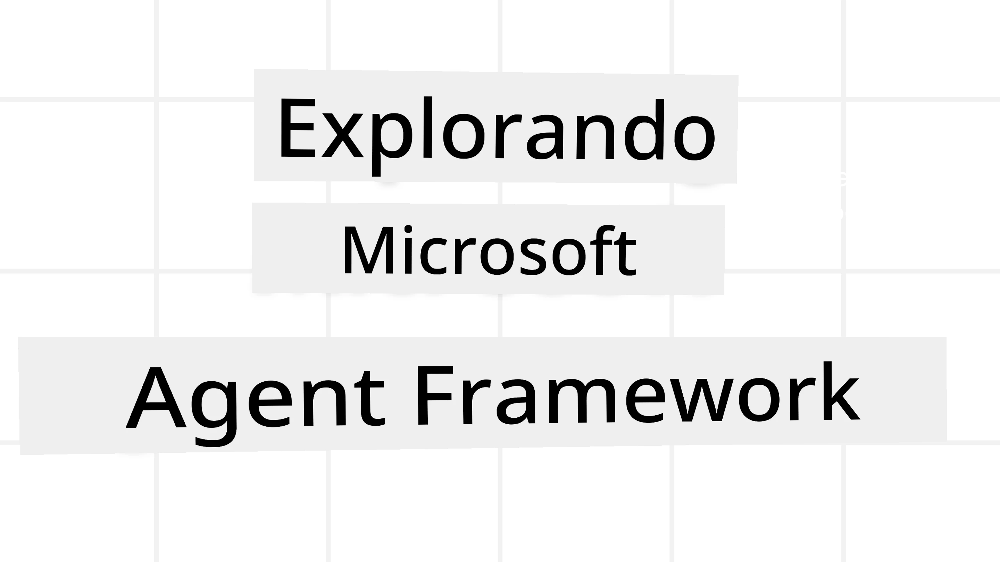
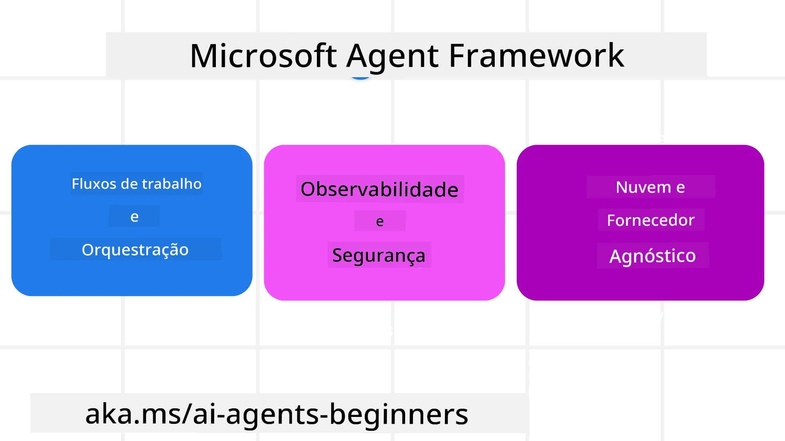
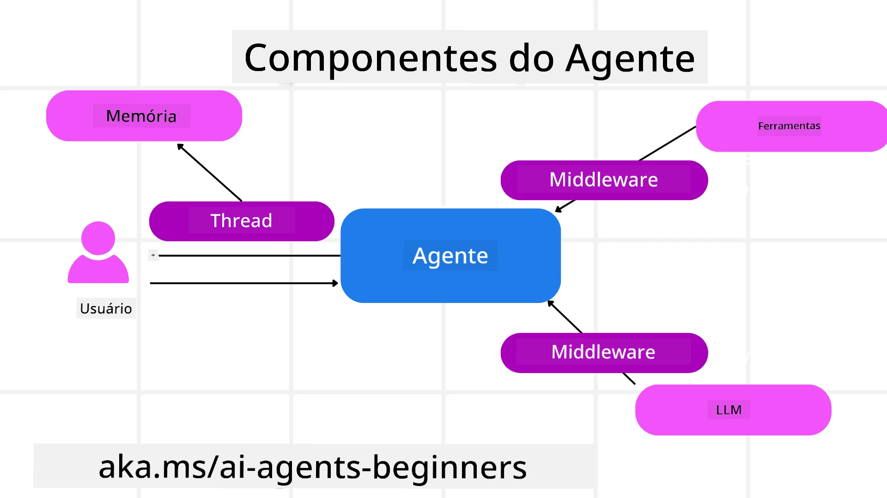

# Explorando o Microsoft Agent Framework



### Introdução

Esta lição abordará:

- Compreendendo o Microsoft Agent Framework: principais características e valor  
- Explorando os conceitos-chave do Microsoft Agent Framework
- Padrões avançados do MAF: fluxos de trabalho, middleware e memória

## Objetivos de Aprendizagem

Depois de completar esta lição, você saberá como:

- Construir Agentes de IA Prontos para Produção usando o Microsoft Agent Framework
- Aplicar as funcionalidades principais do Microsoft Agent Framework aos seus casos de uso agenticos
- Usar padrões avançados incluindo fluxos de trabalho, middleware e observabilidade

## Exemplos de Código 

Exemplos de código para o [Microsoft Agent Framework (MAF)](https://learn.microsoft.com/en-us/agent-framework/overview/?wt.mc_id=youtube_26688_organicsocial_reactor&pivots=programming-language-python) podem ser encontrados neste repositório nos arquivos `xx-python-agent-framework` e `xx-dotnet-agent-framework`.

## Compreendendo o Microsoft Agent Framework



[Microsoft Agent Framework (MAF)](https://learn.microsoft.com/en-us/agent-framework/overview/?wt.mc_id=youtube_26688_organicsocial_reactor&pivots=programming-language-python) é a estrutura unificada da Microsoft para construir agentes de IA. Ele oferece flexibilidade para lidar com a grande variedade de casos de uso agenticos vistos tanto em ambientes de produção quanto de pesquisa, incluindo:

- **Orquestração Sequencial de Agentes** em cenários onde são necessários fluxos de trabalho passo a passo.
- **Orquestração Concorrente** em cenários onde agentes precisam completar tarefas ao mesmo tempo.
- **Orquestração de Chat em Grupo** em cenários onde agentes podem colaborar juntos em uma tarefa.
- **Orquestração de Transferência** em cenários onde agentes repassam as tarefas entre si conforme os subtarefas são concluídas.
- **Orquestração Magnética** em cenários onde um agente gerente cria e modifica uma lista de tarefas e coordena os subagentes para completar a tarefa.

Para entregar Agentes de IA em Produção, o MAF também inclui funcionalidades para:

- **Observabilidade** por meio do uso do OpenTelemetry, onde cada ação do Agente de IA, incluindo invocação de ferramentas, etapas de orquestração, fluxos de raciocínio e monitoramento de desempenho são realizados através dos painéis Microsoft Foundry.
- **Segurança** hospedando agentes nativamente no Microsoft Foundry, que inclui controles de segurança como acesso baseado em funções, manejo de dados privados e segurança de conteúdo incorporada.
- **Durabilidade** já que threads e fluxos de trabalho do Agente podem pausar, retomar e recuperar-se de erros, o que permite processos de execução longa.
- **Controle** pois fluxos de trabalho com interação humana são suportados, onde tarefas são marcadas como exigindo aprovação humana.

O Microsoft Agent Framework também foca em ser interoperável por:

- **Ser Agnóstico à Nuvem** - Agentes podem rodar em containers, on-premises e através de múltiplas nuvens diferentes.
- **Ser Agnóstico ao Provedor** - Agentes podem ser criados através do seu SDK preferido, incluindo Azure OpenAI e OpenAI
- **Integrar Padrões Abertos** - Agentes podem utilizar protocolos como Agent-to-Agent (A2A) e Model Context Protocol (MCP) para descobrir e usar outros agentes e ferramentas.
- **Plugins e Conectores** - Conexões podem ser feitas a serviços de dados e memória como Microsoft Fabric, SharePoint, Pinecone e Qdrant.

Vamos ver como essas funcionalidades são aplicadas em alguns dos conceitos-chave do Microsoft Agent Framework.

## Conceitos-Chave do Microsoft Agent Framework

### Agentes



**Criando Agentes**

A criação de agentes é feita definindo o serviço de inferência (Provedor LLM), um
conjunto de instruções para o Agente de IA seguir, e um `nome` atribuído:

```python
agent = AzureOpenAIChatClient(credential=AzureCliCredential()).create_agent( instructions="You are good at recommending trips to customers based on their preferences.", name="TripRecommender" )
```

O exemplo acima usa `Azure OpenAI` mas agentes podem ser criados utilizando uma variedade de serviços incluindo `Microsoft Foundry Agent Service`:

```python
AzureAIAgentClient(async_credential=credential).create_agent( name="HelperAgent", instructions="You are a helpful assistant." ) as agent
```

APIs OpenAI `Responses`, `ChatCompletion`

```python
agent = OpenAIResponsesClient().create_agent( name="WeatherBot", instructions="You are a helpful weather assistant.", )
```

```python
agent = OpenAIChatClient().create_agent( name="HelpfulAssistant", instructions="You are a helpful assistant.", )
```

ou [MiniMax](https://platform.minimaxi.com/), que fornece uma API compatível com OpenAI com janelas de contexto grandes (até 204K tokens):

```python
agent = OpenAIChatClient(base_url="https://api.minimax.io/v1", api_key=os.environ["MINIMAX_API_KEY"], model_id="MiniMax-M3").create_agent( name="HelpfulAssistant", instructions="You are a helpful assistant.", )
```

ou agentes remotos usando o protocolo A2A:

```python
agent = A2AAgent( name=agent_card.name, description=agent_card.description, agent_card=agent_card, url="https://your-a2a-agent-host" )
```

**Executando Agentes**

Agentes são executados usando os métodos `.run` ou `.run_stream` para respostas não-streaming ou streaming.

```python
result = await agent.run("What are good places to visit in Amsterdam?")
print(result.text)
```

```python
async for update in agent.run_stream("What are the good places to visit in Amsterdam?"):
    if update.text:
        print(update.text, end="", flush=True)

```

Cada execução do agente pode também ter opções para personalizar parâmetros como `max_tokens` usados pelo agente, `tools` que o agente pode chamar, e até mesmo o próprio `model` usado para o agente.

Isso é útil em casos onde modelos ou ferramentas específicos são necessários para completar a tarefa do usuário.

**Ferramentas**

Ferramentas podem ser definidas tanto na definição do agente:

```python
def get_attractions( location: Annotated[str, Field(description="The location to get the top tourist attractions for")], ) -> str: """Get the top tourist attractions for a given location.""" return f"The top attractions for {location} are." 


# Ao criar um ChatAgent diretamente

agent = ChatAgent( chat_client=OpenAIChatClient(), instructions="You are a helpful assistant", tools=[get_attractions]

```

e também ao executar o agente:

```python

result1 = await agent.run( "What's the best place to visit in Seattle?", tools=[get_attractions] # Ferramenta fornecida apenas para esta execução )
```

**Threads do Agente**

Threads do Agente são usadas para lidar com conversas multi-turnos. Threads podem ser criadas de duas formas:

- Usando `get_new_thread()` que permite que a thread seja salva ao longo do tempo
- Criando uma thread automaticamente ao executar um agente, sendo a thread válida apenas durante a execução atual.

Para criar uma thread, o código é assim:

```python
# Criar uma nova thread.
thread = agent.get_new_thread() # Executar o agente com a thread.
response = await agent.run("Hello, I am here to help you book travel. Where would you like to go?", thread=thread)

```

Você pode então serializar a thread para ser armazenada para uso posterior:

```python
# Crie uma nova thread.
thread = agent.get_new_thread() 

# Execute o agente com a thread.

response = await agent.run("Hello, how are you?", thread=thread) 

# Serialize a thread para armazenamento.

serialized_thread = await thread.serialize() 

# Desserialize o estado da thread após o carregamento do armazenamento.

resumed_thread = await agent.deserialize_thread(serialized_thread)
```

**Middleware do Agente**

Agentes interagem com ferramentas e LLMs para completar as tarefas dos usuários. Em certos cenários, queremos executar ou monitorar entre essas interações. Middleware do agente nos permite isso através de:

*Middleware de Função*

Esse middleware nos permite executar uma ação entre o agente e uma função/ferramenta que está sendo chamada. Um exemplo de quando isso seria usado é para realizar algum registro (logging) na chamada da função.

No código abaixo `next` define se o próximo middleware ou a função real deve ser chamada.

```python
async def logging_function_middleware(
    context: FunctionInvocationContext,
    next: Callable[[FunctionInvocationContext], Awaitable[None]],
) -> None:
    """Function middleware that logs function execution."""
    # Pré-processamento: Registrar antes da execução da função
    print(f"[Function] Calling {context.function.name}")

    # Continuar para o próximo middleware ou execução da função
    await next(context)

    # Pós-processamento: Registrar após a execução da função
    print(f"[Function] {context.function.name} completed")
```

*Middleware de Chat*

Esse middleware nos permite executar ou registrar uma ação entre o agente e as requisições entre o LLM.

Isso contém informações importantes como as `messages` que estão sendo enviadas para o serviço de IA.

```python
async def logging_chat_middleware(
    context: ChatContext,
    next: Callable[[ChatContext], Awaitable[None]],
) -> None:
    """Chat middleware that logs AI interactions."""
    # Pré-processamento: Registrar antes da chamada da IA
    print(f"[Chat] Sending {len(context.messages)} messages to AI")

    # Continuar para o próximo middleware ou serviço de IA
    await next(context)

    # Pós-processamento: Registrar após a resposta da IA
    print("[Chat] AI response received")

```

**Memória do Agente**

Conforme abordado na lição `Agentic Memory`, a memória é um elemento importante para permitir que o agente opere sobre diferentes contextos. O MAF oferece vários tipos diferentes de memórias:

*Armazenamento em Memória*

Esta é a memória armazenada em threads durante o tempo de execução da aplicação.

```python
# Criar uma nova thread.
thread = agent.get_new_thread() # Executar o agente com a thread.
response = await agent.run("Hello, I am here to help you book travel. Where would you like to go?", thread=thread)
```

*Mensagens Persistentes*

Essa memória é usada quando armazenando o histórico de conversas entre diferentes sessões. É definida usando o `chat_message_store_factory`:

```python
from agent_framework import ChatMessageStore

# Crie um armazenamento de mensagens personalizado
def create_message_store():
    return ChatMessageStore()

agent = ChatAgent(
    chat_client=OpenAIChatClient(),
    instructions="You are a Travel assistant.",
    chat_message_store_factory=create_message_store
)

```

*Memória Dinâmica*

Essa memória é adicionada ao contexto antes dos agentes serem executados. Essas memórias podem ser armazenadas em serviços externos como mem0:

```python
from agent_framework.mem0 import Mem0Provider

# Usando Mem0 para capacidades avançadas de memória
memory_provider = Mem0Provider(
    api_key="your-mem0-api-key",
    user_id="user_123",
    application_id="my_app"
)

agent = ChatAgent(
    chat_client=OpenAIChatClient(),
    instructions="You are a helpful assistant with memory.",
    context_providers=memory_provider
)

```

**Observabilidade do Agente**

Observabilidade é importante para construir sistemas agênticos confiáveis e fáceis de manter. O MAF integra-se com OpenTelemetry para fornecer rastreamento e medidas para melhor observabilidade.

```python
from agent_framework.observability import get_tracer, get_meter

tracer = get_tracer()
meter = get_meter()
with tracer.start_as_current_span("my_custom_span"):
    # fazer algo
    pass
counter = meter.create_counter("my_custom_counter")
counter.add(1, {"key": "value"})
```

### Fluxos de Trabalho

O MAF oferece fluxos de trabalho que são passos pré-definidos para completar uma tarefa e incluem agentes de IA como componentes desses passos.

Fluxos de trabalho são compostos por diferentes componentes que permitem melhor controle de fluxo. Fluxos de trabalho também permitem **orquestração multi-agentes** e **checkpointing** para salvar estados do fluxo.

Os componentes principais de um fluxo de trabalho são:

**Executores**

Executores recebem mensagens de entrada, realizam suas tarefas atribuídas e então produzem uma mensagem de saída. Isso move o fluxo de trabalho adiante para completar a tarefa maior. Executores podem ser tanto agentes de IA quanto lógica personalizada.

**Edges (Conexões)**

Edges são usados para definir o fluxo das mensagens em um fluxo de trabalho. Podem ser:

*Edges Diretos* - Conexões simples um-para-um entre executores:

```python
from agent_framework import WorkflowBuilder

builder = WorkflowBuilder()
builder.add_edge(source_executor, target_executor)
builder.set_start_executor(source_executor)
workflow = builder.build()
```

*Edges Condicionais* - Ativados quando uma certa condição é satisfeita. Por exemplo, quando quartos de hotel estão indisponíveis, um executor pode sugerir outras opções.

*Edges de Switch-case* - Roteiam mensagens para diferentes executores baseados em condições definidas. Por exemplo, se um cliente de viagem tem acesso prioritário e suas tarefas serão tratadas por outro fluxo de trabalho.

*Edges Fan-out* - Enviar uma mensagem para múltiplos alvos.

*Edges Fan-in* - Coletar múltiplas mensagens de diferentes executores e enviar a um único alvo.

**Eventos**

Para oferecer melhor observabilidade dos fluxos de trabalho, o MAF oferece eventos internos para a execução incluindo:

- `WorkflowStartedEvent`  - Início da execução do fluxo
- `WorkflowOutputEvent` - O fluxo produz uma saída
- `WorkflowErrorEvent` - O fluxo encontra um erro
- `ExecutorInvokeEvent`  - Executor inicia processamento
- `ExecutorCompleteEvent`  -  Executor termina processamento
- `RequestInfoEvent` - Uma requisição é emitida

## Padrões Avançados do MAF

As seções acima cobrem os conceitos-chave do Microsoft Agent Framework. À medida que você constrói agentes mais complexos, aqui estão alguns padrões avançados a considerar:

- **Composição de Middleware**: Encadeie múltiplos manipuladores de middleware (registro, autenticação, limitação de taxa) usando middleware de função e chat para controle detalhado do comportamento do agente.
- **Checkpointing de fluxos de trabalho**: Use eventos do fluxo e serialização para salvar e retomar processos longos do agente.
- **Seleção Dinâmica de Ferramentas**: Combine RAG sobre descrições das ferramentas com o registro de ferramentas do MAF para apresentar apenas ferramentas relevantes por consulta.
- **Transferência Multi-Agente**: Use edges e roteamento condicional do fluxo para orquestrar transferências entre agentes especializados.

## Hospedando Agentes LangChain / LangGraph no Microsoft Foundry

O Microsoft Agent Framework é **interoperável entre frameworks** — você não fica limitado a agentes escritos com o MAF. Se você já tem um agente construído com **LangChain** ou **LangGraph**, pode executá-lo como um **agente hospedado no Microsoft Foundry**, de modo que o Foundry gerencie o runtime, sessões, escalabilidade, identidade e endpoints de protocolo para você, enquanto a lógica do seu agente permanece no LangGraph.

Isso é feito com o pacote `langchain_azure_ai.agents.hosting`, que expõe um grafo LangGraph compilado sobre os mesmos protocolos usados por agentes hospedados no Foundry.

**1. Instale o extra de hospedagem:**

```bash
pip install -U "langchain-azure-ai[hosting]>=1.2.4" azure-identity
```

O extra `hosting` instala as bibliotecas de protocolo Foundry: `azure-ai-agentserver-responses` (o endpoint `/responses` compatível com OpenAI) e `azure-ai-agentserver-invocations` (o endpoint genérico `/invocations`).

**2. Escolha um protocolo de hospedagem:**

| Protocolo | Classe Host | Endpoint | Use quando |
|----------|-------------|----------|----------|
| **Responses** | `ResponsesHostServer` | `/responses` | Você quer chat compatível com OpenAI, streaming, histórico de respostas e threading de conversa — a recomendação padrão para agentes conversacionais. |
| **Invocations** | `InvocationsHostServer` | `/invocations` | Você precisa de uma forma JSON personalizada, um endpoint estilo webhook, ou processamento não conversacional. |

Como a **API Responses é a API principal para desenvolvimento de agentes no Foundry**, comece com `ResponsesHostServer` para a maioria dos agentes.

**3. Configure as variáveis de ambiente** (`az login` primeiro para `DefaultAzureCredential` autenticar):

```bash
export FOUNDRY_PROJECT_ENDPOINT="https://<resource>.services.ai.azure.com/api/projects/<project>"
export FOUNDRY_MODEL_NAME="gpt-5-mini"
```

Quando o agente for executado posteriormente como agente hospedado no Foundry, a plataforma injeta automaticamente `FOUNDRY_PROJECT_ENDPOINT`.

**4. Exponha um agente LangGraph sobre o protocolo Responses:**

```python
import os

from azure.ai.projects import AIProjectClient
from azure.identity import DefaultAzureCredential, get_bearer_token_provider
from langchain.agents import create_agent
from langchain_openai import ChatOpenAI
from langchain_azure_ai.agents.hosting import ResponsesHostServer

_AZURE_AI_SCOPE = "https://ai.azure.com/.default"


def build_chat_model() -> ChatOpenAI:
    project_endpoint = os.environ["FOUNDRY_PROJECT_ENDPOINT"].rstrip("/")
    deployment = os.environ.get("FOUNDRY_MODEL_NAME", "gpt-5-mini")
    credential = DefaultAzureCredential()
    project = AIProjectClient(endpoint=project_endpoint, credential=credential)
    openai_client = project.get_openai_client()
    token_provider = get_bearer_token_provider(credential, _AZURE_AI_SCOPE)

    # O ChatOpenAI aqui tem como alvo o endpoint compatível com OpenAI (Responses) do projeto Foundry.
    return ChatOpenAI(
        model=deployment,
        base_url=str(openai_client.base_url),
        api_key=token_provider,
    )


def main() -> None:
    graph = create_agent(build_chat_model(), tools=[])
    port = int(os.environ.get("PORT", "8088"))
    ResponsesHostServer(graph).run(port=port)


if __name__ == "__main__":
    main()
```

Execute localmente com `python main.py`, então envie uma requisição Responses para `http://localhost:8088/responses`.

**Comportamentos principais:**

- **Conversas**: Clientes continuam uma conversa passando `previous_response_id` ou um ID de `conversation`. Se seu grafo for compilado com um checkpoints LangGraph, o Foundry associa o estado da conversa ao checkpoint (use um checkpoint durável em produção; `MemorySaver` é aceitável para testes locais).
- **Humano no Loop**: Se seu grafo usa `interrupt()` do LangGraph, `ResponsesHostServer` expõe a interrupção pendente como um item `function_call` / `mcp_approval_request` no Responses, e os clientes retomam com um `function_call_output` / `mcp_approval_response` correspondente.
- **Implantar no Foundry**: Use o Azure Developer CLI — `azd ext install azure.ai.agents`, `azd ai agent init -m <manifest>`, `azd ai agent run` (local, requer Docker), e depois `azd provision` e `azd deploy`. Implantação de agentes hospedados requer a função **Foundry Project Manager**.

Uma versão executável deste exemplo está em [code-samples/14-langchain-hosted-agent.py](../../../14-microsoft-agent-framework/code-samples/14-langchain-hosted-agent.py). Para o tutorial completo (protocolo Invocations, esquemas de requisição personalizados e solução de problemas), consulte [Hospedar agentes LangGraph como agentes hospedados no Foundry](https://learn.microsoft.com/azure/foundry/how-to/develop/langchain-hosted-agents).

## Exemplos de Código 

Exemplos de código para Microsoft Agent Framework podem ser encontrados neste repositório nos arquivos `xx-python-agent-framework` e `xx-dotnet-agent-framework`.

## Tem Mais Perguntas Sobre o Microsoft Agent Framework?

Junte-se ao [Microsoft Foundry Discord](https://discord.com/invite/ATgtXmAS5D) para encontrar outros aprendizes, participar de horas de atendimento e tirar suas dúvidas sobre Agentes de IA.
## Lição Anterior

[Memória para Agentes de IA](../13-agent-memory/README.md)

## Próxima Lição

[Construindo Agentes de Uso de Computador (CUA)](../15-browser-use/README.md)

---

<!-- CO-OP TRANSLATOR DISCLAIMER START -->
**Aviso Legal**:
Este documento foi traduzido usando o serviço de tradução por IA [Co-op Translator](https://github.com/Azure/co-op-translator). Embora nos esforcemos pela precisão, por favor, esteja ciente de que traduções automatizadas podem conter erros ou imprecisões. O documento original em seu idioma nativo deve ser considerado a fonte autorizada. Para informações críticas, recomenda-se tradução profissional humana. Não nos responsabilizamos por quaisquer mal-entendidos ou interpretações incorretas decorrentes do uso desta tradução.
<!-- CO-OP TRANSLATOR DISCLAIMER END -->