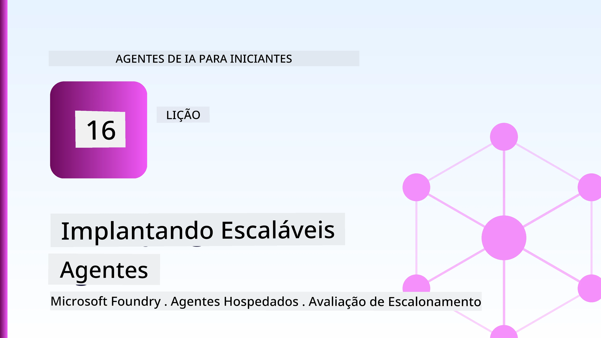
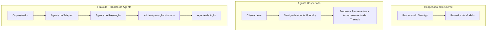
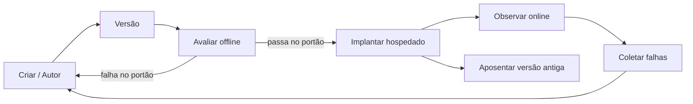
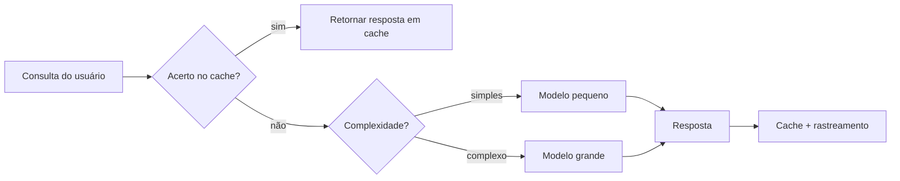
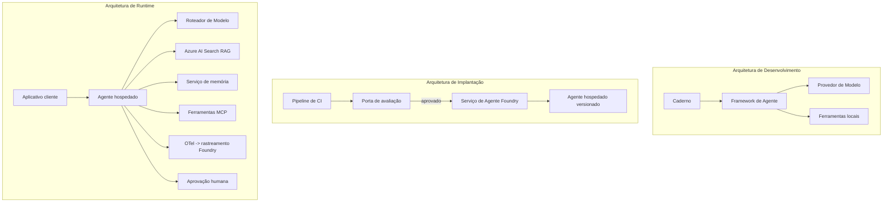

# Implantando Agentes Escaláveis com o Microsoft Foundry



Até este ponto do curso, você construiu agentes que rodam no seu laptop, dentro de um notebook, acionados pelo `az login` e algumas variáveis de ambiente. Essa é exatamente a maneira certa de aprender. Não é a maneira certa de executar um agente do qual milhares de clientes dependem às 3 da manhã.

Esta lição é sobre a lacuna entre "funciona na minha máquina" e "funciona, de forma confiável e acessível, em produção." Fechamos essa lacuna usando o **Microsoft Foundry** e o **Microsoft Foundry Agent Service**, e fazemos isso construindo um agente real de suporte ao cliente que possui ferramentas, recuperação, memória, avaliação e monitoramento.

## Introdução

Esta lição cobrirá:

- A diferença entre um **agente protótipo** e um **agente implantado**, e por que a transição é principalmente sobre tudo *ao redor* do modelo.
- **Padrões de implantação** para agentes: hospedado no cliente, hospedado como serviço (Agentes Hospedados), e orquestrado por fluxo de trabalho.
- O **ciclo de vida do agente** no Microsoft Foundry — criar, versionar, implantar, avaliar, observar, aposentar.
- **Estratégias de escalabilidade**: roteamento de modelo, cache, concorrência, e design stateless.
- **Observabilidade** com OpenTelemetry e rastreamento pelo Foundry.
- **Otimização de custos** por meio de seleção de modelo, roteamento e portões de avaliação.
- **Considerações empresariais**: governança, aprovação humana, e execução segura dos servidores MCP em produção.

## Objetivos de Aprendizagem

Após concluir esta lição, você saberá como:

- Escolher o padrão de implantação correto para uma determinada carga de trabalho de agente.
- Implantar um agente no Microsoft Foundry Agent Service para que ele seja versionado, governado e observável.
- Instrumentar um agente para rastreamento e conectar uma pipeline de avaliação que roda antes de cada lançamento.
- Aplicar roteamento de modelo e cache para manter latência e custo sob controle em escala.
- Adicionar um portão de aprovação humana para ações de alto risco e integrar um servidor MCP de forma segura em produção.

## Pré-requisitos

Esta lição pressupõe que você completou as lições anteriores e está confortável com:

- Construção de agentes com o [Microsoft Agent Framework](../14-microsoft-agent-framework/README.md) (Lição 14).
- [Uso de Ferramentas](../04-tool-use/README.md) (Lição 4) e [Agentic RAG](../05-agentic-rag/README.md) (Lição 5).
- [Memória do Agente](../13-agent-memory/README.md) (Lição 13) e [Protocolos Agénticos / MCP](../11-agentic-protocols/README.md) (Lição 11).
- [Observabilidade e Avaliação](../10-ai-agents-production/README.md) (Lição 10) — esta lição se baseia diretamente nela.

Você também precisará de:

- Uma **assinatura do Azure** e um **projeto Microsoft Foundry** com pelo menos um modelo de chat implantado.
- A **Azure CLI** autenticada (`az login`).
- Python 3.12+ e os pacotes no repositório [`requirements.txt`](../../../requirements.txt).

## Do Protótipo à Produção: O Que Realmente Muda

Um agente protótipo e um agente de produção compartilham o mesmo loop principal — raciocinar, chamar ferramentas, responder. O que muda é tudo que envolve esse loop. O modelo é talvez 20% de um agente de produção; os outros 80% são o esqueleto operacional.

| Preocupação | Protótipo | Produção |
| --- | --- | --- |
| **Hospedagem** | Roda no seu notebook | Roda como um serviço hospedado, versionado e lançado |
| **Identidade** | Seu token `az login` | Identidade gerenciada com RBAC restrito |
| **Estado** | Na memória, perdido ao reiniciar | Externalizado (armazenamento de threads, serviço de memória) |
| **Falha** | Você vê o traceback | Retentativas, alternativas, dead-letter, alertas |
| **Custo** | "São alguns centavos" | Controlado por solicitação, roteado, em cache, orçado |
| **Qualidade** | Você analisa visualmente a saída | Avaliado automaticamente antes de cada lançamento |
| **Confiança** | Você aprova toda ação | Política + humano no loop para ações de risco |

Tenha esta tabela em mente. Cada seção abaixo corresponde a uma dessas linhas.

## Padrões de Implantação de Agentes

Existem três padrões que você usará, frequentemente em combinação.

### 1. Agentes Hospedados no Cliente

O objeto agente vive dentro do *seu* processo de aplicação. Seu código chama o provedor de modelo diretamente; o loop de raciocínio roda no seu serviço. Foi isso que todas as lições anteriores fizeram.

- **Use quando** você precisa de controle total sobre o loop, middleware personalizado ou está incorporando o agente em um backend existente.
- **Compromisso**: você gerencia escalabilidade, estado e resiliência.

### 2. Agentes Hospedados (Foundry Agent Service)

O agente é *registrado como recurso* no Microsoft Foundry. O Foundry hospeda o loop de raciocínio, armazena threads, aplica segurança de conteúdo e RBAC, e torna o agente visível no portal Foundry. Seu app torna-se um cliente leve que cria threads e lê as respostas.

- **Use quando** você quer durabilidade, observabilidade integrada, governança e menor superfície operacional.
- **Compromisso**: menos controle de baixo nível em troca de um runtime gerenciado.

### 3. Fluxos de Trabalho de Agentes

Múltiplos agentes (e ferramentas) são compostos em um grafo com fluxo de controle explícito — passos sequenciais, ramificações, nós de aprovação humana e checkpoints duráveis que podem pausar e retomar. Esta é a capacidade de **Workflows** do Microsoft Agent Framework aplicada em escala de implantação.

- **Use quando** uma tarefa única abrange vários agentes especializados ou requer um passo de aprovação no meio.
- **Compromisso**: mais partes móveis; necessita de observabilidade em nível de orquestração.



## O Ciclo de Vida do Agente no Microsoft Foundry

Implantar um agente não é um `push` único. É um loop, e é muito parecido com um ciclo de lançamento de software porque é exatamente isso.



A ideia-chave, trazida da [Lição 10](../10-ai-agents-production/README.md): **a avaliação offline é um portão, não um detalhe.** Uma nova versão do agente não é lançada a menos que ultrapasse seus limites de avaliação. A observabilidade online então alimenta falhas do mundo real no seu conjunto de testes offline. Esse é o ciclo completo.

## Estratégias de Escalabilidade

Escalar um agente é diferente de escalar uma API web stateless, porque cada solicitação pode acionar várias chamadas caras a modelos e ferramentas. Quatro técnicas carregam a maior parte da carga.

**Tratamento stateless de solicitações.** Não mantenha estado por usuário na memória do processo. Persista os threads de conversa no armazenamento de threads do Foundry ou em um serviço de memória para que qualquer instância possa lidar com qualquer solicitação. Isso permite escalabilidade horizontal — adicione instâncias, não precisa de sessões fixas.

**Roteamento de modelo.** Nem toda solicitação precisa do seu modelo mais capaz (e caro). Direcione solicitações simples — classificação de intenção, respostas factuais curtas — para um modelo pequeno e rápido, e reserve o modelo grande para raciocínio genuíno. O **Model Router** do Foundry pode fazer isso por você, ou você pode implementar um classificador leve. Você construirá a versão DIY no laboratório.

**Cache de respostas.** Muitas consultas de suporte são quase duplicadas ("como redefino minha senha?"). Armazene em cache respostas para perguntas comuns e sirva sem nem consultar o modelo. Mesmo uma taxa modesta de cache reduz significativamente custo e latência.

**Concorrência e controle de pressão.** Provedores de modelos têm limites de taxa. Limite sua concorrência, use retentativas com backoff exponencial, e falhe de forma elegante (uma resposta enfileirada dizendo "estamos cuidando" é melhor que um erro 500).



## Observabilidade em Produção

Você não pode operar o que não pode ver. Como abordado na Lição 10, o Microsoft Agent Framework emite traços **OpenTelemetry** nativamente — cada chamada de modelo, invocação de ferramenta e passo de orquestração vira um span. Em produção, você exporta esses spans para o Microsoft Foundry (ou qualquer backend compatível com OTel) para:

- Rastrear uma única reclamação de cliente de ponta a ponta em cada chamada de modelo e ferramenta.
- Monitorar latência p50/p95 e custo por solicitação ao longo do tempo.
- Alertar sobre picos de taxa de erros e anomalias de custo antes que seus usuários (ou sua equipe financeira) percebam.

```python
from agent_framework.observability import get_tracer

tracer = get_tracer()

with tracer.start_as_current_span("support_request") as span:
    span.set_attribute("customer.tier", "enterprise")
    span.set_attribute("routed.model", "gpt-5-nano")
    # a execução do agente é rastreada automaticamente dentro desta abrangência
```

Atributos como `customer.tier` e `routed.model` são o que transforma um muro de traços em perguntas respondíveis ("clientes enterprise estão sendo roteados para o modelo pequeno com muita frequência?").

## Otimização de Custos

O custo em agentes de produção é dominado por tokens. Três alavancas, em ordem de impacto:

1. **Dimensionar o modelo corretamente.** Um modelo pequeno que passa seu portão de avaliação é quase sempre mais barato que um grande que também passa. Use avaliação para *provar* que o modelo pequeno é bom o suficiente, em vez de usar o maior só por cautela.
2. **Roteie por complexidade.** Como acima — pague preços de modelo grande somente para solicitações que exigem raciocínio grande.
3. **Cache agressivamente.** A chamada de modelo mais barata é a que você nunca faz.

Portões de avaliação e controle de custo são a mesma disciplina vista sob dois ângulos: avaliação indica o *piso de qualidade*, roteamento e cache mantêm você o mais próximo possível do *custo* desse piso.

## Considerações para Implantação Empresarial

**Governança.** Agentes hospedados herdam RBAC, segurança de conteúdo e registro de auditoria do Foundry. Dê a cada agente uma identidade gerenciada com o menor privilégio necessário — acesso somente leitura à base de conhecimento, acesso restrito à API de tickets, nada mais.

**Humano no loop.** Algumas ações são muito importantes para automatizar completamente — emitir reembolso, deletar conta, escalar para equipe jurídica. O Microsoft Agent Framework suporta ferramentas **com aprovação obrigatória**: o agente propõe a ação, a execução pausa, um humano aprova ou rejeita e o fluxo continua. Você viu esse primitivo na [Lição 6](../06-building-trustworthy-agents/README.md); aqui você o implanta.

**MCP em produção.** [MCP](../11-agentic-protocols/README.md) permite que seu agente consuma ferramentas externas por meio de uma interface padrão. Em produção, trate cada servidor MCP como um limite não confiável: fixe a versão do servidor, execute com identidade restrita, valide suas saídas, e nunca exponha segredos a ele. Um servidor MCP é uma dependência, e dependências são corrigidas, auditadas e limitadas.



Esses três diagramas — desenvolvimento, implantação, tempo de execução — são o mesmo agente em três estágios de sua vida. O laboratório a seguir guia você na construção dele.

## Laboratório Prático: Um Agente de Suporte ao Cliente Pronto para Produção

Abra [`code_samples/16-python-agent-framework.ipynb`](./code_samples/16-python-agent-framework.ipynb) e siga passo a passo. Você montará um **agente de suporte ao cliente Contoso** com todas as preocupações de produção conectadas:

1. **Chamada de ferramentas** — consultar status de pedidos e abrir tickets de suporte.
2. **RAG** — responder perguntas de política a partir de uma base de conhecimento (Azure AI Search, com fallback em memória para rodar o notebook sem recurso Search).
3. **Memória** — lembrar o cliente ao longo das trocas de conversa.
4. **Roteamento de modelo** — um classificador de complexidade roteia cada solicitação para modelo pequeno ou grande.
5. **Cache de respostas** — perguntas repetidas são servidas do cache.
6. **Aprovação humana** — reembolsos acima de um limiar pausam para aprovação humana.
7. **Pipeline de avaliação** — um conjunto pequeno de testes offline pontua o agente e atua como portão de lançamento.
8. **Observabilidade** — rastreamento OpenTelemetry ao redor de cada solicitação.

### Passo a passo

O notebook está organizado para que cada preocupação de produção seja uma seção autonomeada e executável. O coração disso é o manipulador de solicitações de roteamento e cache:

```python
async def handle_support_request(query: str, customer_id: str) -> str:
    # 1. Servir a partir do cache quando pudermos.
    cached = response_cache.get(normalize(query))
    if cached:
        return cached

    # 2. Roteie por complexidade para controlar o custo.
    model = "gpt-5-nano" if is_simple(query) else "gpt-5-mini"

    # 3. Execute o agente dentro de um span de rastreamento para observabilidade.
    with tracer.start_as_current_span("support_request") as span:
        span.set_attribute("routed.model", model)
        span.set_attribute("customer.id", customer_id)
        response = await support_agent.run(query, model=model)

    # 4. Cache e retorne.
    response_cache.set(normalize(query), response.text)
    return response.text
```

O portão de avaliação que protege um lançamento é assim:

```python
async def evaluation_gate(agent, test_cases, threshold: float = 0.8) -> bool:
    passed = 0
    for case in test_cases:
        result = await agent.run(case["input"])
        if score_response(result.text, case["expected"]) >= 0.8:
            passed += 1
    pass_rate = passed / len(test_cases)
    print(f"Evaluation pass rate: {pass_rate:.0%} (gate: {threshold:.0%})")
    return pass_rate >= threshold  # só implantar se a verificação passar
```

Leia cada linha — o notebook mantém os primitivos propositalmente pequenos para que nada fique escondido por chamadas de framework.

## Validando um Agente Implantado com Testes Smoke

O portão de avaliação acima roda *offline* contra seu objeto agente. Uma vez que o agente esteja implantado como Agente Hospedado, você precisa de mais uma verificação, ainda mais barata: **a endpoint implantada está realmente respondendo?**

Implantar "com sucesso" só prova que o plano de controle aceitou a definição — não prova que o agente responde. Uma dependência ausente, um roteamento de modelo ruim ou uma conexão expirada podem deixar uma implantação verde que não retorna nada. Um **teste smoke** detecta isso em segundos, a cada implantação, sem o custo de uma avaliação completa.

Este repositório fornece uma pipeline de teste smoke pronta para uso, construída sobre a GitHub Action [AI Smoke Test](https://github.com/marketplace/actions/ai-smoke-test):

- **Catálogo** — [`tests/lesson-16-smoke-tests.json`](../../../tests/lesson-16-smoke-tests.json) contém prompts e afirmações para o agente de suporte Contoso (respostas fundamentadas em políticas, consulta de pedidos, manter o foco, e continuidade de thread multisseriado). Catálogos para agentes de outras lições vivem junto — veja [`tests/README.md`](../tests/README.md).
- **Fluxo de trabalho** — [`.github/workflows/smoke-test.yml`](../../../.github/workflows/smoke-test.yml) autentica com Azure OIDC e envia cada prompt para o endpoint Responses, falhando o job em qualquer falha de afirmação.

```yaml
- name: Smoke-test hosted agent
  uses: JFolberth/ai-smoketest@v1
  with:
    project_endpoint: ${{ inputs.project_endpoint }}
    agent_name: ContosoSupportAgent
    tests_file: tests/lesson-16-smoke-tests.json
```


Execute-o na aba **Actions** uma vez que seu agente esteja implantado, fornecendo o endpoint do projeto Foundry e o nome do agente. A identidade federada precisa da função **Azure AI User** no escopo do projeto Foundry. Pense nas camadas como uma pirâmide: testes simples (acessível e respondendo?) são executados em toda implantação, avaliação offline (bom o suficiente para entregar?) é feita antes da promoção, e avaliação online (como está se saindo na prática?) é executada continuamente.

## Verificação de Conhecimento

Teste seu entendimento antes de passar para a tarefa.

**1. Aproximadamente quanto de um agente de produção é "o modelo" e o que compõe o restante?**

<details>
<summary>Resposta</summary>

O modelo é uma parte minoritária do sistema — frequentemente citado como cerca de 20%. O restante é o esqueleto operacional: hospedagem e versionamento, identidade e RBAC, estado externalizado, tratamento de falhas, acompanhamento de custos, avaliação e controles com participação humana. O passo para produção é principalmente sobre construir tudo *ao redor* do ciclo de raciocínio.
</details>

**2. Quando você escolheria um Agente Hospedado em vez de um agente hospedado pelo cliente?**

<details>
<summary>Resposta</summary>

Quando você quer um ambiente gerenciado com durabilidade embutida (threads que persistem e podem retomar), observabilidade, segurança de conteúdo e RBAC, e está disposto a trocar algum controle de baixo nível do ciclo de raciocínio por uma menor superfície operacional. Hospedagem pelo cliente é preferível quando você precisa de controle total sobre o ciclo ou está incorporando o agente em um backend existente.
</details>

**3. Por que um agente escalável deve ser sem estado na memória do próprio processo?**

<details>
<summary>Resposta</summary>

Para que qualquer instância possa lidar com qualquer requisição, o que permite escala horizontal sem sessões fixas (sticky sessions). O estado da conversa por usuário é externalizado para um armazenamento de threads ou serviço de memória. Se o estado morasse na memória do processo, você o perderia na reinicialização e não poderia distribuir a carga livremente.
</details>

**4. Qual problema a roteirização do modelo resolve e qual sua relação com a avaliação?**

<details>
<summary>Resposta</summary>

A roteirização envia requisições simples para um modelo pequeno, barato e rápido, reservando o modelo grande para raciocínios genuínos, controlando latência e custo. Relaciona-se com avaliação porque esta é o que *comprova* que o modelo pequeno é bom o suficiente para uma classe de requisições — roteirização sem avaliação é um palpite.
</details>

**5. O que é um "portão de avaliação" e onde ele fica no ciclo de vida?**

<details>
<summary>Resposta</summary>

Um portão de avaliação executa um conjunto de testes offline contra uma nova versão do agente e bloqueia a implantação a menos que a taxa de aprovação ultrapasse um limiar. Ele fica entre "versão" e "implantação" no ciclo de vida, tornando a qualidade uma pré-condição para o lançamento em vez de algo verificado após o envio.
</details>

**6. Por que um servidor MCP deve ser tratado como uma fronteira não confiável em produção?**

<details>
<summary>Resposta</summary>

Porque é uma dependência externa que seu agente acessa. Você deve fixar sua versão, executá-lo com uma identidade limitada, validar suas saídas, limitar sua taxa de acesso e nunca expor segredos a ele — a mesma disciplina aplicada a qualquer dependência de terceiros. Suas saídas alimentam o raciocínio do seu agente, então confiança sem validação é um risco de segurança.
</details>

**7. Qual mudança única costuma ter o maior impacto no custo do agente em produção, e por quê?**

<details>
<summary>Resposta</summary>

Ajustar o tamanho do modelo — usar o menor modelo que ainda passe pelo seu portão de avaliação. O custo é dominado por tokens, e um modelo menor que atenda ao padrão de qualidade é quase sempre mais barato que um maior. Caching e roteirização reduzem o custo ainda mais, mas a escolha do modelo base certo tem o maior efeito de primeira ordem.
</details>

**8. Qual papel atributos de span como `customer.tier` e `routed.model` desempenham na observabilidade?**

<details>
<summary>Resposta</summary>

Eles transformam rastreamentos brutos em perguntas comerciais respondíveis. Sem atributos, você tem uma parede de spans; com eles, pode perguntar "os clientes empresariais estão sendo roteados para o modelo pequeno com muita frequência?" ou "qual modelo lida com as requisições mais lentas?" Atributos são como você segmenta a telemetria pelas dimensões que importam para sua operação.
</details>

## Tarefa

Pegue o agente de suporte ao cliente do laboratório e fortaleça-o para um cenário específico: **um agente de suporte para cobrança de assinaturas para uma empresa SaaS.**

Sua submissão deve:

1. **Substituir as ferramentas** por outras relevantes para cobrança: `get_subscription_status`, `get_invoice` e `issue_credit` (créditos acima de $50 requerem aprovação humana).
2. **Adicionar três documentos RAG** cobrindo a política de reembolso da empresa, o ciclo de cobrança e a política de cancelamento.
3. **Estender o conjunto de avaliação** para pelo menos oito casos, incluindo pelo menos dois que *devem* acionar o caminho de aprovação humana, e confirmar que seu portão de avaliação passa ou falha corretamente.
4. **Adicionar um relatório de custos**: após rodar dez consultas variadas pelo agente, imprimir quantas foram para o modelo pequeno, quantas para o modelo grande e quantas foram atendidas do cache.

Escreva um parágrafo curto (em uma célula markdown) explicando qual regra de roteirização de modelo você escolheu e como você a validaria com tráfego real. Não há uma resposta única correta — você será avaliado se as preocupações de produção estiverem integradas de forma coerente.

## Resumo

Nesta lição você moveu um agente de protótipo para produção com Microsoft Foundry:

- O salto para produção é principalmente sobre o **esqueleto operacional** em torno do modelo — hospedagem, identidade, estado, tratamento de falhas, custo, qualidade e confiança.
- Você aprendeu os três **padrões de implantação** — hospedagem pelo cliente, Agentes Hospedados e Fluxos de Trabalho de Agentes — e quando cada um se encaixa.
- Você percorreu o **ciclo de vida do agente**, onde a avaliação offline **atua como um portão de liberação** e a observabilidade online alimenta falhas de volta para o conjunto de testes.
- Você aplicou **estratégias de escalonamento** — design sem estado, roteirização do modelo, cache e concorrência limitada — e conectou tudo à **otimização de custos**.
- Você integrou **controles corporativos**: RBAC, aprovação com participação humana e integração segura do MCP em produção.
- Você construiu um **agente de suporte ao cliente pronto para produção** que conecta todas essas preocupações juntos em código executável.

A próxima lição faz o caminho oposto: em vez de escalar agentes para a nuvem, você os trará *para baixo* até uma única máquina de desenvolvedor e os executará inteiramente localmente.

## Recursos Adicionais

- <a href="https://learn.microsoft.com/azure/ai-foundry/what-is-azure-ai-foundry" target="_blank">Documentação do Microsoft Foundry</a>
- <a href="https://learn.microsoft.com/azure/ai-foundry/agents/overview" target="_blank">Visão geral do Serviço de Agentes Microsoft Foundry</a>
- <a href="https://learn.microsoft.com/en-us/agent-framework/overview/?wt.mc_id=youtube_26688_organicsocial_reactor&pivots=programming-language-python" target="_blank">Microsoft Agent Framework</a>
- <a href="https://learn.microsoft.com/azure/ai-foundry/concepts/model-router" target="_blank">Model Router no Microsoft Foundry</a>
- <a href="https://learn.microsoft.com/azure/search/search-what-is-azure-search" target="_blank">Azure AI Search</a>
- <a href="https://opentelemetry.io/" target="_blank">OpenTelemetry</a>
- <a href="https://github.com/marketplace/actions/ai-smoke-test" target="_blank">Ação GitHub AI Smoke Test</a>
- <a href="https://modelcontextprotocol.io/" target="_blank">Model Context Protocol (MCP)</a>

## Lição Anterior

[Construindo Agentes de Uso de Computador (CUA)](../15-browser-use/README.md)

## Próxima Lição

[Criando Agentes de IA Locais](../17-creating-local-ai-agents/README.md)

---

<!-- CO-OP TRANSLATOR DISCLAIMER START -->
**Aviso Legal**:
Este documento foi traduzido usando o serviço de tradução por IA [Co-op Translator](https://github.com/Azure/co-op-translator). Embora nos esforcemos pela precisão, por favor, esteja ciente de que traduções automatizadas podem conter erros ou imprecisões. O documento original em seu idioma nativo deve ser considerado a fonte autorizada. Para informações críticas, recomenda-se tradução profissional humana. Não nos responsabilizamos por quaisquer mal-entendidos ou interpretações incorretas decorrentes do uso desta tradução.
<!-- CO-OP TRANSLATOR DISCLAIMER END -->