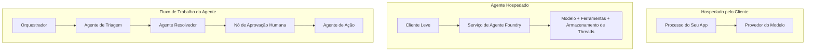
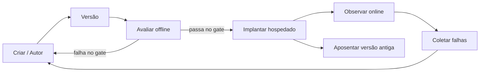
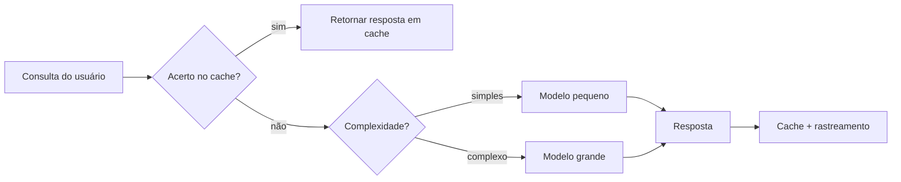
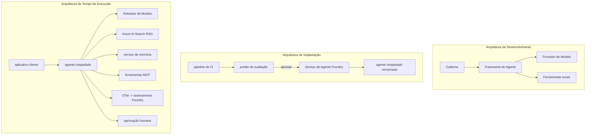

# Implantando Agentes Escaláveis com Microsoft Foundry


Até este ponto do curso, você construiu agentes que rodam no seu laptop, dentro de um notebook, acionados pelo `az login` e algumas variáveis de ambiente. Essa é exatamente a maneira certa de aprender. Não é a maneira certa de executar um agente do qual milhares de clientes dependem às 3 da manhã.

Esta lição trata da lacuna entre "funciona na minha máquina" e "funciona, de forma confiável e acessível, em produção." Fechamos essa lacuna usando o **Microsoft Foundry** e o **Microsoft Foundry Agent Service**, e fazemos isso construindo um agente real de suporte ao cliente que possui ferramentas, recuperação, memória, avaliação e monitoramento.

## Introdução

Esta lição irá cobrir:

- A diferença entre um **agente protótipo** e um **agente implantado**, e por que a transição é principalmente sobre tudo *ao redor* do modelo.
- **Padrões de implantação** para agentes: hospedado no cliente, hospedado como serviço (Agentes Hospedados) e orquestrado por workflows.
- O **ciclo de vida do agente** no Microsoft Foundry — criar, versionar, implantar, avaliar, observar, aposentar.
- **Estratégias de escalonamento**: roteamento do modelo, cache, concorrência e design sem estado.
- **Observabilidade** com OpenTelemetry e rastreamento Foundry.
- **Otimização de custos** por meio da seleção do modelo, roteamento e portões de avaliação.
- **Considerações empresariais**: governança, aprovação humana e execução segura de servidores MCP em produção.

## Objetivos de Aprendizagem

Após completar esta lição, você saberá como:

- Escolher o padrão de implantação certo para uma determinada carga de trabalho do agente.
- Implantar um agente no Microsoft Foundry Agent Service para que ele seja versionado, governado e observável.
- Instrumentar um agente para rastreamento e conectar um pipeline de avaliação que roda antes de cada lançamento.
- Aplicar roteamento e cache de modelo para manter a latência e o custo sob controle em escala.
- Adicionar um portão de aprovação humana para ações de alto risco e integrar um servidor MCP de maneira segura para produção.

## Pré-requisitos

Esta lição assume que você completou as lições anteriores e está confortável com:

- Construir agentes com o [Microsoft Agent Framework](../14-microsoft-agent-framework/README.md) (Lição 14).
- [Uso de Ferramentas](../04-tool-use/README.md) (Lição 4) e [Agentic RAG](../05-agentic-rag/README.md) (Lição 5).
- [Memória de Agentes](../13-agent-memory/README.md) (Lição 13) e [Protocolos Agentes / MCP](../11-agentic-protocols/README.md) (Lição 11).
- [Observabilidade e Avaliação](../10-ai-agents-production/README.md) (Lição 10) — esta lição se baseia diretamente nela.

Você também precisará de:

- Uma **assinatura do Azure** e um **projeto Microsoft Foundry** com pelo menos um modelo de chat implantado.
- A **CLI do Azure** autenticada (`az login`).
- Python 3.12+ e os pacotes no repositório [`requirements.txt`](../../../requirements.txt).

## Do Protótipo à Produção: O Que Realmente Muda

Um agente protótipo e um agente de produção compartilham o mesmo loop principal — raciocinar, chamar ferramentas, responder. O que muda é tudo que envolve esse loop. O modelo é talvez 20% de um agente de produção; os outros 80% são o esqueleto operacional.

| Preocupação | Protótipo | Produção |
| --- | --- | --- |
| **Hospedagem** | Roda no seu notebook | Roda como serviço hospedado, versionado e lançado gradualmente |
| **Identidade** | Seu token `az login` | Identidade gerenciada com RBAC escopado |
| **Estado** | Na memória, perdido na reinicialização | Externalizado (armazenamento de threads, serviço de memória) |
| **Falhas** | Você vê o traceback | Retentativas, fallback, dead-letter, alertas |
| **Custo** | "São alguns centavos" | Monitorado por requisição, roteado, cacheado, orçado |
| **Qualidade** | Você verifica visualmente a saída | Avaliado automaticamente antes de cada lançamento |
| **Confiança** | Você aprova cada ação | Política + humano no loop para ações de risco |

Mantenha esta tabela em mente. Cada seção abaixo corresponde a uma dessas linhas.

## Padrões de Implantação de Agentes

Existem três padrões que você usará, frequentemente em combinação.

### 1. Agentes Hospedados no Cliente

O objeto agente vive dentro do processo *da sua* aplicação. Seu código chama o provedor do modelo diretamente; o loop de raciocínio roda no seu serviço. É isso que todas as lições anteriores fizeram.

- **Use quando** você precisar de controle total sobre o loop, middleware customizado, ou estiver incorporando o agente dentro de um backend existente.
- **Compromisso**: você mesmo gerencia a escalabilidade, estado e resiliência.

### 2. Agentes Hospedados (Foundry Agent Service)

O agente é *registrado como um recurso* no Microsoft Foundry. O Foundry hospeda o loop de raciocínio, armazena threads, aplica segurança de conteúdo e RBAC, e torna o agente visível no portal Foundry. Seu app vira um cliente leve que cria threads e lê respostas.

- **Use quando** quiser durabilidade, observabilidade embutida, governança e menor superfície operacional.
- **Compromisso**: menos controle de baixo nível em troca de um ambiente gerenciado.

### 3. Workflows de Agentes

Múltiplos agentes (e ferramentas) são compostos em um grafo com fluxo de controle explícito — etapas sequenciais, ramificações, nós de aprovação humana, e checkpoints duráveis que podem pausar e retomar. Esta é a capacidade **Workflows** do Microsoft Agent Framework aplicada em escala de implantação.

- **Use quando** uma única tarefa envolve vários agentes especializados ou precisa de uma etapa de aprovação no meio.
- **Compromisso**: mais partes móveis; precisa de observabilidade no nível da orquestração.



## Ciclo de Vida do Agente no Microsoft Foundry

Implantar um agente não é um simples `push`. É um ciclo que se parece muito com um ciclo de lançamento de software porque é exatamente isso que é.



A ideia-chave, trazida da [Lição 10](../10-ai-agents-production/README.md): **a avaliação offline é um portão, não um pensamento posterior.** Uma nova versão do agente não é lançada a menos que ultrapasse seus critérios de avaliação. A observabilidade online então alimenta falhas do mundo real de volta ao seu conjunto de testes offline. Esse é o ciclo completo.

## Estratégias de Escalonamento

Escalonar um agente é diferente de escalar uma API web sem estado, porque cada requisição pode disparar múltiplas chamadas caras a modelos e ferramentas. Quatro técnicas carregam a maior parte da carga.

**Manipulação de requisições sem estado.** Não mantenha estado por usuário na memória do processo. Persista conversas no armazenador de threads do Foundry ou em um serviço de memória para que qualquer instância possa atender qualquer requisição. Isso permite escalar horizontalmente — adicione instâncias, sem sessões grudadas.

**Roteamento de modelo.** Nem toda requisição precisa do seu modelo mais capaz (e mais caro). Direcione requisições simples — classificação de intenção, respostas factuais curtas — para um modelo pequeno e rápido, e reserve o modelo grande para raciocínio genuíno. O **Model Router** do Foundry pode fazer isso por você, ou você pode implementar um classificador leve. Você construirá a versão DIY no laboratório.

**Cache de respostas.** Muitas consultas de suporte são quase duplicatas ("como redefino minha senha?"). Armazene respostas para perguntas comuns e entregue-as sem atingir o modelo. Mesmo uma taxa modesta de acertos no cache reduz significativamente custo e latência.

**Concorrência e retropressão.** Os provedores de modelos têm limites de taxa. Limite sua concorrência, use retentativas com backoff exponencial e falhe com graça (uma resposta enfileirada "estamos cuidando disso" é melhor que um erro 500).



## Observabilidade em Produção

Você não pode operar o que não pode ver. Como abordado na Lição 10, o Microsoft Agent Framework emite rastreamentos **OpenTelemetry** nativamente — cada chamada ao modelo, invocação de ferramenta e etapa da orquestração vira um span. Em produção, você exporta esses spans para o Microsoft Foundry (ou qualquer backend compatível com OTel) para que possa:

- Rastrear uma única reclamação de cliente de ponta a ponta através de cada chamada de modelo e ferramenta.
- Monitorar latência p50/p95 e custo por requisição ao longo do tempo.
- Alertar sobre picos na taxa de erros e anomalias de custo antes que seus usuários (ou seu time financeiro) percebam.

```python
from agent_framework.observability import get_tracer

tracer = get_tracer()

with tracer.start_as_current_span("support_request") as span:
    span.set_attribute("customer.tier", "enterprise")
    span.set_attribute("routed.model", "gpt-5-nano")
    # a execução do agente é rastreada automaticamente dentro deste intervalo
```

Atributos como `customer.tier` e `routed.model` são o que transformam um muro de rastreamentos em perguntas respondíveis ("clientes empresariais estão sendo roteados para o modelo pequeno com muita frequência?").

## Otimização de Custos

O custo em agentes de produção é dominado por tokens. Três alavancas, em ordem de impacto:

1. **Ajuste do modelo.** Um modelo pequeno que passa seu portão de avaliação quase sempre é mais barato que um grande que também passa. Use a avaliação para *provar* que o modelo pequeno é suficientemente bom ao invés de padrão escolher o maior por precaução.
2. **Roteamento pela complexidade.** Como acima — pague preço de modelo grande apenas por requisições que precisam de raciocínio de modelo grande.
3. **Cache agressivo.** A chamada de modelo mais barata é a que você nunca faz.

Portões de avaliação e controle de custos são a mesma disciplina vista de dois ângulos: avaliação indica o *piso de qualidade*, roteamento e cache mantêm você tão próximo quanto possível do *custo* desse piso.

## Considerações para Implantação Empresarial

**Governança.** Agentes Hospedados herdam o RBAC, segurança de conteúdo e registro de auditoria do Foundry. Dê a cada agente uma identidade gerenciada com o mínimo privilégio necessário — acesso somente leitura à base de conhecimento, acesso escopado à API de tickets, nada mais.

**Humano no loop.** Algumas ações são muito importantes para automatizar totalmente — emitir um reembolso, deletar uma conta, escalar para o time jurídico. O Microsoft Agent Framework suporta ferramentas com **aprovação necessária**: o agente propõe a ação, a execução pausa, um humano aprova ou rejeita, e o fluxo de trabalho retoma. Você viu o primitivo na [Lição 6](../06-building-trustworthy-agents/README.md); aqui você o implanta.

**MCP em produção.** O [MCP](../11-agentic-protocols/README.md) permite que seu agente consuma ferramentas externas através de uma interface padrão. Em produção, trate cada servidor MCP como uma fronteira não confiável: fixe a versão do servidor, rode com uma identidade escopada, valide suas saídas, e nunca exponha segredos a ele. Um servidor MCP é uma dependência, e dependências são corrigidas, auditadas e limitadas por taxa.



Esses três diagramas — desenvolvimento, implantação, tempo de execução — são o mesmo agente em três estágios de vida. O laboratório a seguir guia você na construção dele.

## Laboratório Prático: Um Agente de Suporte ao Cliente Pronto para Produção

Abra [`code_samples/16-python-agent-framework.ipynb`](./code_samples/16-python-agent-framework.ipynb) e siga-o do começo ao fim. Você montará um **agente de suporte ao cliente Contoso** com todas as preocupações de produção conectadas:

1. **Chamada de ferramentas** — consultar status de pedidos e abrir tickets de suporte.
2. **RAG** — responder perguntas de política de uma base de conhecimento (Azure AI Search, com um fallback em memória para o notebook rodar sem recurso Search).
3. **Memória** — lembrar do cliente ao longo da conversa.
4. **Roteamento de modelo** — um classificador de complexidade direciona cada requisição para modelo pequeno ou grande.
5. **Cache de respostas** — perguntas repetidas são respondidas do cache.
6. **Aprovação humana** — reembolsos acima de um limite aguardam aprovação humana.
7. **Pipeline de avaliação** — um conjunto de testes offline pequeno pontua o agente e funciona como portão de lançamento.
8. **Observabilidade** — rastreamento OpenTelemetry em cada requisição.

### Passo a passo

O notebook está organizado para que cada preocupação de produção seja uma seção autônoma e executável. O coração disso é o manipulador de requisições combinando roteamento e cache:

```python
async def handle_support_request(query: str, customer_id: str) -> str:
    # 1. Servir do cache quando possível.
    cached = response_cache.get(normalize(query))
    if cached:
        return cached

    # 2. Roteie por complexidade para controlar o custo.
    model = "gpt-5-nano" if is_simple(query) else "gpt-5-mini"

    # 3. Execute o agente dentro de um span de rastreamento para observabilidade.
    with tracer.start_as_current_span("support_request") as span:
        span.set_attribute("routed.model", model)
        span.set_attribute("customer.id", customer_id)
        response = await support_agent.run(query, model=model)

    # 4. Armazene em cache e retorne.
    response_cache.set(normalize(query), response.text)
    return response.text
```

O portão de avaliação que protege um lançamento se parece com isto:

```python
async def evaluation_gate(agent, test_cases, threshold: float = 0.8) -> bool:
    passed = 0
    for case in test_cases:
        result = await agent.run(case["input"])
        if score_response(result.text, case["expected"]) >= 0.8:
            passed += 1
    pass_rate = passed / len(test_cases)
    print(f"Evaluation pass rate: {pass_rate:.0%} (gate: {threshold:.0%})")
    return pass_rate >= threshold  # implantar apenas se o gate passar
```

Leia cada linha — o notebook mantém os primitivos deliberadamente pequenos para que nada fique escondido atrás de uma chamada de framework.

## Validando um Agente Implantado com Testes de Fumaça

O portão de avaliação acima roda *offline* contra seu objeto agente. Uma vez que o agente é implantado como um Agente Hospedado, você precisa de mais uma verificação, ainda mais barata: **o endpoint implantado está realmente respondendo?**

Implantar "com sucesso" apenas prova que o plano de controle aceitou a definição — não prova que o agente responde. Uma dependência ausente, um roteamento de modelo errado, ou uma conexão expirada pode deixar uma implantação verde que não retorna nada. Um **teste de fumaça** detecta isso em segundos, a cada implantação, sem o custo de uma avaliação completa.

Este repositório inclui um pipeline de teste de fumaça pronto para uso, construído com a GitHub Action [AI Smoke Test](https://github.com/marketplace/actions/ai-smoke-test):

- **Catálogo** — [`tests/lesson-16-smoke-tests.json`](../../../tests/lesson-16-smoke-tests.json) contém prompts e afirmações para o agente de suporte Contoso (respostas políticas fundamentadas, consulta de pedidos, manter o tema, e continuidade multi-turno). Catálogos para os agentes de outras lições ficam junto — veja [`tests/README.md`](../tests/README.md).
- **Workflow** — [`.github/workflows/smoke-test.yml`](../../../.github/workflows/smoke-test.yml) faz login com Azure OIDC e POSTa cada prompt no endpoint Responses do agente, falhando o trabalho em qualquer afirmação não confirmada.

```yaml
- name: Smoke-test hosted agent
  uses: JFolberth/ai-smoketest@v1
  with:
    project_endpoint: ${{ inputs.project_endpoint }}
    agent_name: ContosoSupportAgent
    tests_file: tests/lesson-16-smoke-tests.json
```


Execute a partir da guia **Ações** assim que seu agente for implantado, fornecendo o endpoint do projeto Foundry e o nome do agente. A identidade federada precisa da função **Azure AI User** no escopo do projeto Foundry. Pense nas camadas como uma pirâmide: testes de fumaça (alcançável e respondendo?) executam em toda implantação, avaliação offline (bom o suficiente para liberar?) executa antes da promoção, e avaliação online (como está se saindo em produção?) executa continuamente.

## Verificação de Conhecimento

Teste seu entendimento antes de passar para a tarefa.

**1. Mais ou menos quanto do agente em produção é "o modelo" e o que é o resto?**

<details>
<summary>Resposta</summary>

O modelo é uma minoria do sistema — citado frequentemente em cerca de 20%. O restante é o esqueleto operacional: hospedagem e versionamento, identidade e RBAC, estado externalizado, tratamento de falhas, acompanhamento de custos, avaliação e controles com interação humana. Passar para produção é principalmente construir tudo *ao redor* do ciclo de raciocínio.
</details>

**2. Quando você escolheria um Agente Hospedado em vez de um agente hospedado no cliente?**

<details>
<summary>Resposta</summary>

Quando você deseja um ambiente gerenciado com durabilidade integrada (threads que persistem e podem retomar), observabilidade, segurança de conteúdo e RBAC, e está disposto a trocar algum controle de baixo nível sobre o ciclo de raciocínio por uma menor superfície operacional. O agente hospedado no cliente é preferível quando você precisa de controle total sobre o ciclo ou está integrando o agente em um backend existente.
</details>

**3. Por que um agente escalável deve ser sem estado na memória do seu próprio processo?**

<details>
<summary>Resposta</summary>

Para que qualquer instância possa lidar com qualquer requisição, o que permite escalonamento horizontal sem sessões fixas. O estado da conversa por usuário é externalizado para uma loja de threads ou serviço de memória. Se o estado vivesse na memória do processo, você o perderia ao reiniciar e não poderia distribuir a carga livremente.
</details>

**4. Qual problema o roteamento de modelo resolve e como ele se relaciona com a avaliação?**

<details>
<summary>Resposta</summary>

O roteamento envia requisições simples para um modelo pequeno, barato e rápido e reserva o modelo grande para raciocínios genuínos, controlando tanto a latência quanto o custo. Está relacionado à avaliação porque a avaliação é o que *prova* que o modelo pequeno é bom o suficiente para uma classe de requisições — roteamento sem avaliação é um palpite.
</details>

**5. O que é um "portão de avaliação" e onde ele se situa no ciclo de vida?**

<details>
<summary>Resposta</summary>

Um portão de avaliação executa um conjunto de testes offline contra uma nova versão do agente e bloqueia a implantação, a menos que a taxa de aprovação supere um limite. Ele fica entre "versão" e "implantação" no ciclo de vida, tornando a qualidade uma pré-condição para o lançamento em vez de algo que você verifica depois do envio.
</details>

**6. Por que um servidor MCP deve ser tratado como um limite não confiável em produção?**

<details>
<summary>Resposta</summary>

Porque é uma dependência externa que seu agente chama. Você deve fixar sua versão, executá-lo com uma identidade com escopo, validar suas saídas, limitar sua taxa e nunca expor segredos para ele — a mesma disciplina aplicada a qualquer dependência de terceiros. Suas saídas são usadas no raciocínio do seu agente, portanto confiança não validada é um risco de segurança.
</details>

**7. Qual única mudança geralmente tem o maior impacto no custo do agente em produção, e por quê?**

<details>
<summary>Resposta</summary>

Ajustar corretamente o tamanho do modelo — usar o menor modelo que ainda passe pelo seu portão de avaliação. O custo é dominado por tokens, e um modelo menor que atende ao padrão de qualidade é quase sempre mais barato que um maior. Cache e roteamento reduzem ainda mais o custo, mas escolher o modelo base certo tem o maior efeito primário.
</details>

**8. Que papel os atributos de span como `customer.tier` e `routed.model` desempenham na observabilidade?**

<details>
<summary>Resposta</summary>

Eles transformam rastreamentos brutos em perguntas de negócio respondíveis. Sem atributos, você tem um muro de spans; com eles, você pode perguntar "os clientes empresariais estão sendo roteados para o modelo pequeno com muita frequência?" ou "qual modelo lida com nossas requisições mais lentas?" Atributos são como você fatiar a telemetria pelas dimensões que importam para sua operação.
</details>

## Tarefa

Pegue o agente de suporte ao cliente do laboratório e fortaleça-o para um cenário específico: **um agente de suporte de faturamento de assinaturas para uma empresa SaaS.**

Sua submissão deve:

1. **Substituir as ferramentas** por ferramentas relevantes para faturamento: `get_subscription_status`, `get_invoice` e `issue_credit` (créditos acima de $50 requerem aprovação humana).
2. **Adicionar três documentos RAG** cobrindo a política de reembolso da empresa, ciclo de faturamento e política de cancelamento.
3. **Estender o conjunto de avaliação** para pelo menos oito casos, incluindo pelo menos dois que *devem* acionar o caminho de aprovação humana, e confirmar que seu portão de avaliação passa ou falha corretamente.
4. **Adicionar um relatório de custo**: após executar dez consultas mistas através do agente, imprimir quantas foram para o modelo pequeno, quantas para o modelo grande e quantas foram atendidas pelo cache.

Escreva um parágrafo curto (em uma célula markdown) explicando qual regra de roteamento de modelo você escolheu e como a validaria com tráfego real. Não há uma única resposta correta — você será avaliado sobre se as preocupações de produção estão conectadas coerentemente.

## Resumo

Nesta lição, você levou um agente de protótipo a produção com Microsoft Foundry:

- O salto para produção é principalmente sobre o **esqueleto operacional** ao redor do modelo — hospedagem, identidade, estado, tratamento de falhas, custo, qualidade e confiança.
- Você aprendeu os três **padrões de implantação** — hospedado no cliente, Agentes Hospedados e Fluxos de Trabalho de Agentes — e quando cada um se encaixa.
- Você percorreu o **ciclo de vida do agente**, onde a avaliação offline **atua como um portão de liberação** e a observabilidade online alimenta falhas de volta ao conjunto de testes.
- Você aplicou **estratégias de escalonamento** — design sem estado, roteamento de modelo, cache e concorrência limitada — e conectou elas à **otimização de custo**.
- Você conectou **controles empresariais**: RBAC, aprovação com interação humana e integração segura do MCP em produção.
- Você construiu um **agente de suporte ao cliente pronto para produção** que reúne todas essas preocupações em código executável.

A próxima lição faz a jornada inversa: em vez de escalar agentes para a nuvem, você os trará *para baixo* para uma única máquina de desenvolvedor e os executará inteiramente localmente.

## Recursos Adicionais

- <a href="https://learn.microsoft.com/azure/ai-foundry/what-is-azure-ai-foundry" target="_blank">Documentação do Microsoft Foundry</a>
- <a href="https://learn.microsoft.com/azure/ai-foundry/agents/overview" target="_blank">Visão geral do Microsoft Foundry Agent Service</a>
- <a href="https://learn.microsoft.com/en-us/agent-framework/overview/?wt.mc_id=youtube_26688_organicsocial_reactor&pivots=programming-language-python" target="_blank">Microsoft Agent Framework</a>
- <a href="https://learn.microsoft.com/azure/ai-foundry/concepts/model-router" target="_blank">Model Router no Microsoft Foundry</a>
- <a href="https://learn.microsoft.com/azure/search/search-what-is-azure-search" target="_blank">Azure AI Search</a>
- <a href="https://opentelemetry.io/" target="_blank">OpenTelemetry</a>
- <a href="https://github.com/marketplace/actions/ai-smoke-test" target="_blank">Ação AI Smoke Test no GitHub</a>
- <a href="https://modelcontextprotocol.io/" target="_blank">Model Context Protocol (MCP)</a>

## Lição Anterior

[Construindo Agentes de Uso de Computador (CUA)](../15-browser-use/README.md)

## Próxima Lição

[Criando Agentes de IA Locais](../17-creating-local-ai-agents/README.md)

---

<!-- CO-OP TRANSLATOR DISCLAIMER START -->
**Aviso Legal**:
Este documento foi traduzido usando o serviço de tradução por IA [Co-op Translator](https://github.com/Azure/co-op-translator). Embora nos esforcemos pela precisão, por favor, esteja ciente de que traduções automatizadas podem conter erros ou imprecisões. O documento original em seu idioma nativo deve ser considerado a fonte autorizada. Para informações críticas, recomenda-se tradução profissional humana. Não nos responsabilizamos por quaisquer mal-entendidos ou interpretações incorretas decorrentes do uso desta tradução.
<!-- CO-OP TRANSLATOR DISCLAIMER END -->