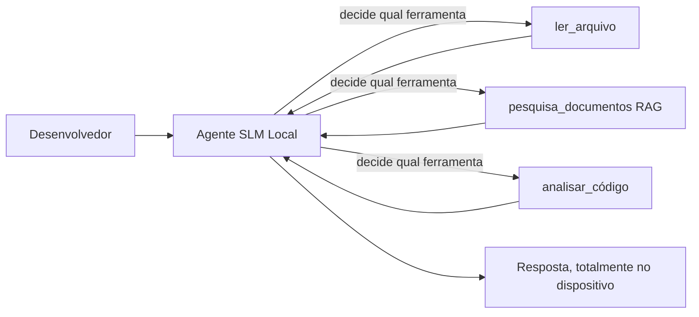
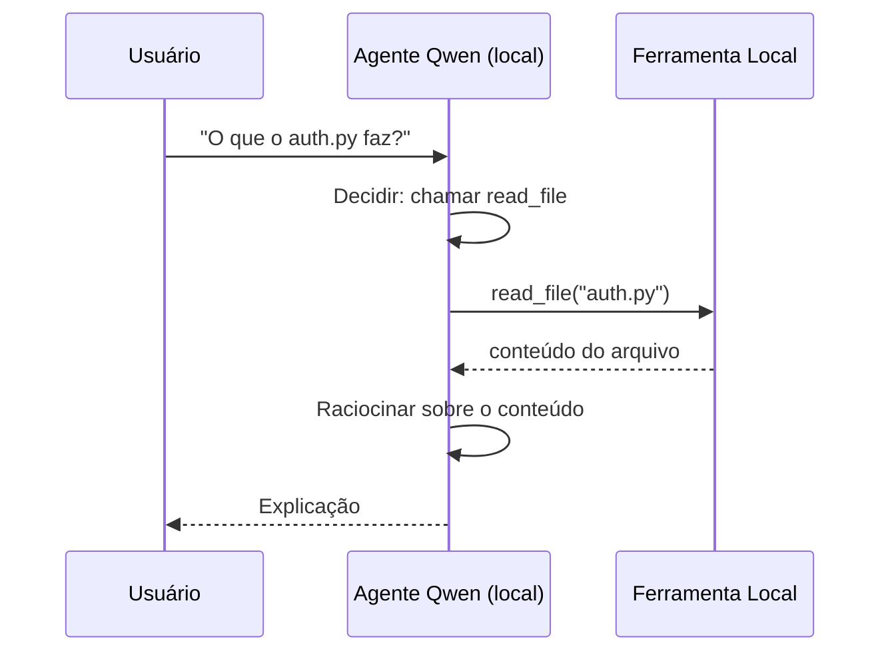
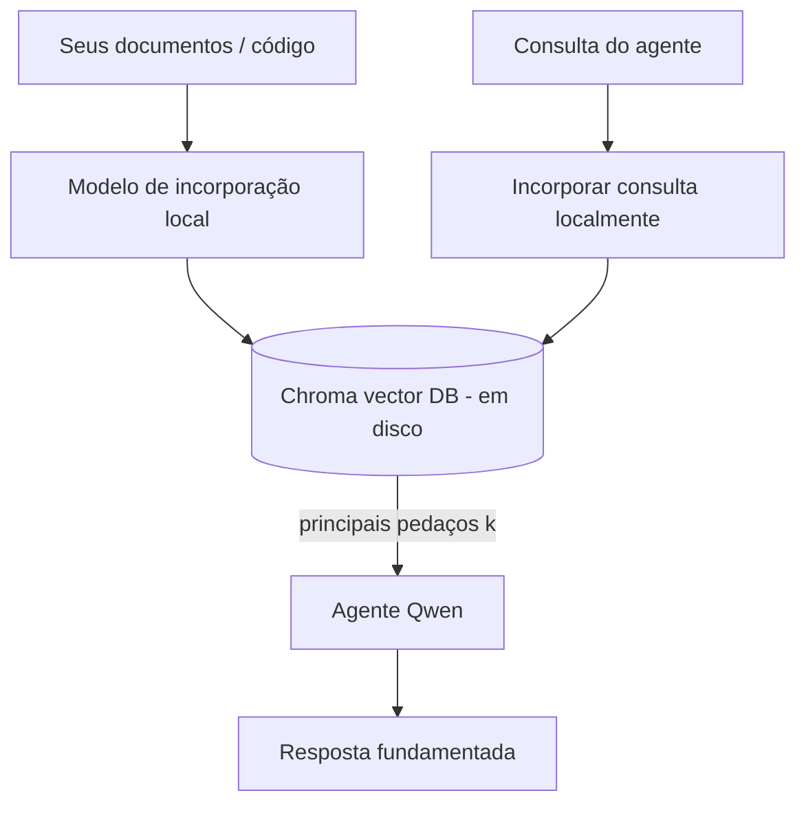
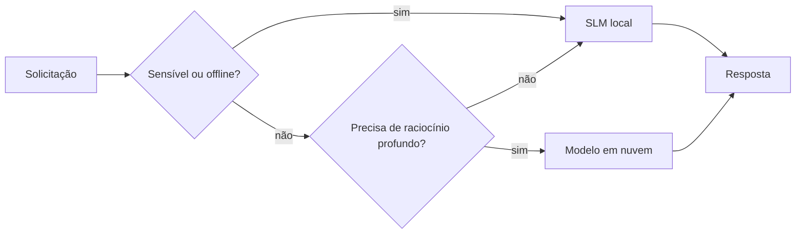

# Criando Agentes de IA Locais Usando Microsoft Foundry Local e Qwen


A lição anterior escalou agentes *para cima* na nuvem. Esta os traz *para baixo* para uma única máquina. Ao final, você terá um assistente de engenharia funcional que raciocina, chama ferramentas, lê seus arquivos e pesquisa sua documentação — **sem uma única chamada de inferência na nuvem.**

Por que você gostaria disso? Três razões que surgem constantemente no trabalho real de engenharia:

- **Privacidade.** O código e documentos nunca deixam a máquina. Nenhuma solicitação, nenhum trecho, nenhum dado do cliente cruza a fronteira da rede.
- **Custo.** A inferência local não tem cobrança por token. Você pode iterar o dia todo pelo preço da eletricidade.
- **Offline.** No avião, em uma instalação segura ou durante uma queda, o agente ainda funciona.

O problema é que você está trocando um modelo de ponta na nuvem por um **Modelo de Linguagem Pequeno (SLM)** rodando em sua CPU, GPU ou NPU. Esta lição trata de construir agentes que sejam *bons* dentro dessa restrição ao invés de fingir que ela não existe.

## Introdução

Esta lição cobrirá:

- **Modelos de Linguagem Pequenos (SLMs)** — o que são, onde brilham e onde não brilham.
- **Microsoft Foundry Local** — um runtime que baixa e serve modelos localmente através de uma **API compatível com OpenAI**.
- **Modelos Qwen com chamada de função** — SLMs que produzem chamadas de ferramentas confiáveis, o que torna agentes locais (não só chat local) possíveis.
- **Ferramentas locais, RAG local e MCP local** — dando ao agente capacidade sem a nuvem.
- **Padrões híbridos** — quando manter coisas locais e quando recorrer à nuvem.

## Objetivos de Aprendizagem

Após completar esta lição, você saberá como:

- Explicar as vantagens e desvantagens dos SLMs e escolher casos de uso adequados para agentes locais.
- Servir um modelo Qwen localmente com Foundry Local e conectar-se a ele através do endpoint compatível com OpenAI.
- Construir um agente que chama ferramentas que roda inteiramente na sua estação de trabalho.
- Adicionar RAG local sobre seus próprios documentos usando um banco de dados vetorial local (Chroma).
- Conectar o agente a um servidor MCP local e raciocinar sobre designs híbridos local/nuvem.

## Pré-requisitos

Esta lição presume que você completou as lições anteriores e está confortável com:

- [Uso de Ferramentas](../04-tool-use/README.md) (Lição 4) e [Agentic RAG](../05-agentic-rag/README.md) (Lição 5).
- [Protocolos Agentic / MCP](../11-agentic-protocols/README.md) (Lição 11).
- O [Microsoft Agent Framework](../14-microsoft-agent-framework/README.md) (Lição 14).

Você também precisará de:

- Uma estação de trabalho para desenvolvedor. **8 GB de RAM é um mínimo realista**; 16 GB+ é confortável. Uma GPU ou NPU ajuda mas não é obrigatória.
- **Microsoft Foundry Local** instalado (veja a seção de configuração abaixo).
- Python 3.12+ e os pacotes no repositório [`requirements.txt`](../../../requirements.txt), além de `foundry-local-sdk`, `openai` e `chromadb` para esta lição.

## Modelos de Linguagem Pequenos: A Ferramenta Certa para Trabalho Local

Um modelo de ponta na nuvem tem centenas de bilhões de parâmetros e um data center atrás dele. Um SLM tem alguns bilhões de parâmetros e precisa caber na RAM do seu laptop. Essa diferença define expectativas claras.

**SLMs são bons em:**

- Tarefas estruturadas e delimitadas — classificação, extração, sumarização de um documento conhecido.
- **Chamada de ferramenta** — decidir qual função chamar e com quais argumentos.
- Iteração rápida, barata e privada em seus próprios dados.

**SLMs são mais fracos em:**

- Raciocínio aberto, de múltiplos saltos, em grande contexto.
- Conhecimento amplo do mundo (vêem menos e esquecem mais).

A estratégia vencedora para agentes locais é então: **deixe o SLM orquestrar e deixe as ferramentas fazerem o trabalho pesado.** O modelo não precisa *conhecer* seu código — precisa saber quando chamar `read_file` e `search_docs`. Isso joga diretamente para as forças de um SLM.



## Microsoft Foundry Local

**Microsoft Foundry Local** é um runtime leve que baixa, gerencia e serve modelos inteiramente na sua máquina. Sua característica mais importante para nós é que ele expõe um **endpoint HTTP compatível com OpenAI** — o que significa que o SDK OpenAI e o cliente OpenAI do Microsoft Agent Framework funcionam contra ele com apenas uma mudança de `base_url`. Tudo o que você aprendeu sobre construir agentes se transfere diretamente; só o endpoint sai da nuvem para o `localhost`.

O Foundry Local também escolhe automaticamente a melhor versão do modelo para seu hardware — uma build para CPU, uma para CUDA/GPU ou uma para NPU — para que você não precise otimizar manualmente por máquina.

### Configuração

Instale o Foundry Local (veja a [documentação](https://learn.microsoft.com/azure/ai-foundry/foundry-local/) para seu sistema operacional), então confirme que funciona:

```bash
# Instale (exemplo; siga a documentação para sua plataforma)
winget install Microsoft.FoundryLocal      # Windows
# brew install microsoft/foundrylocal/foundrylocal   # macOS

# Baixe e execute um modelo Qwen, então inicie o serviço local
foundry model run qwen2.5-7b-instruct
foundry service status
```

Uma vez que o serviço esteja rodando, você terá um endpoint local compatível com OpenAI (tipicamente `http://localhost:PORT/v1`). O notebook usa o `foundry-local-sdk` para descobrir o endpoint automaticamente, então você não precisa codificar a porta fixamente.

## Chamada de Função Qwen: Por Que Isso Importa

Um agente é somente um agente se ele pode chamar ferramentas. Muitos SLMs conversam, mas produzem chamadas de ferramentas pouco confiáveis e mal formadas. Os modelos **Qwen** são treinados para chamada de funções e geram estruturas de chamada de ferramenta bem formadas consistentemente — exatamente o que transforma um modelo de chat local em um *agente* local.

O fluxo é o loop padrão de chamada de ferramenta que você já conhece, só que rodando no dispositivo:



## RAG Local

A busca de documentação é onde agentes locais mostram seu valor. Ao invés de esperar que o SLM tenha memorizado a documentação do seu framework, você incorpora esses documentos em um **banco de dados vetorial local** e deixa o agente recuperar os pedaços relevantes sob demanda.

Usamos o **Chroma**, uma loja vetorial embutida que roda no processo, sem servidor para gerenciar. O pipeline é inteiramente local: modelo de incorporação local → vetores locais → recuperação local → SLM local.



Este é o mesmo padrão Agentic RAG da Lição 5 — a única mudança é que cada componente roda em sua máquina.

## Servidores MCP Locais

[MCP](../11-agentic-protocols/README.md) é um transporte, não um serviço de nuvem. Um servidor MCP pode rodar como um processo local em `stdio`, expondo ferramentas ao seu agente pelo protocolo padrão. Isso permite reaproveitar o ecossistema crescente de servidores MCP — acesso ao sistema de arquivos, operações git, consultas a banco de dados — totalmente offline.

A postura de segurança é diferente da nuvem, mas não ausente: um servidor MCP local ainda roda com as permissões do seu usuário, então limite o que ele pode acessar (um diretório do projeto, não sua pasta home inteira) e trate suas saídas como entradas a validar.

## Padrões Híbridos Nuvem-e-Local

Local-primeiro não significa só local. Sistemas maduros direcionam por sensibilidade e dificuldade:

| Situação | Onde roda |
| --- | --- |
| Código/dados sensíveis, ou offline | **SLM Local** |
| Tarefa simples e delimitada | **SLM Local** (barato, rápido) |
| Raciocínio complexo de múltiplos saltos em dados não sensíveis | **Modelo na nuvem** |
| Tudo, durante uma queda | **SLM Local** (degradação graciosa) |

Isso espelha a ideia de **roteamento de modelo** da Lição 16 — exceto que agora um dos "modelos" é sua própria máquina. Um design robusto recorre ao local quando a nuvem não está disponível, de modo que o agente decai em qualidade em vez de falhar completamente.



## Laboratório Prático: Um Assistente de Engenharia Local

Abra [`code_samples/17-local-agent-foundry-local.ipynb`](./code_samples/17-local-agent-foundry-local.ipynb) e siga. Você construirá um **assistente de engenharia local** que roda inteiramente em sua estação de trabalho e pode:

1. **Chamar ferramentas** — via chamada de função Qwen através do Foundry Local.
2. **Realizar operações de arquivo locais** — listar e ler arquivos em um diretório de projeto.
3. **Analisar código** — reportar métricas básicas em um arquivo fonte.
4. **Pesquisar documentação** — RAG local sobre uma pasta de docs com Chroma.
5. **Usar MCP** — conectar a um servidor MCP local (com um pulo gracioso se nenhum estiver configurado).

Nenhuma inferência na nuvem é usada em nenhum momento.

### Passo a passo

O assistente conecta-se ao Foundry Local via o endpoint compatível com OpenAI, então o código do agente parece quase idêntico às lições da nuvem — só o cliente muda:

```python
from foundry_local import FoundryLocalManager
from openai import OpenAI

# Foundry Local descobre/baixa o modelo e nos fornece um endpoint local.
manager = FoundryLocalManager(\"qwen2.5-7b-instruct\")
client = OpenAI(base_url=manager.endpoint, api_key=manager.api_key)  # api_key é um espaço reservado local
```

As ferramentas são funções Python comuns limitadas a um diretório de projeto:

```python
def read_file(path: str) -> str:
    \"\"\"Read a file, but only inside the sandboxed project directory.\"\"\"
    full = (PROJECT_ROOT / path).resolve()
    if PROJECT_ROOT not in full.parents and full != PROJECT_ROOT:
        return \"Access denied: path is outside the project directory.\"
    return full.read_text(encoding=\"utf-8\")
```

Note a checagem de sandbox — mesmo localmente, uma ferramenta que lê caminhos arbitrários é uma responsabilidade. O notebook mantém cada ferramenta limitada a um único root de projeto.

## Verificação de Conhecimento

Teste seu entendimento antes de avançar para o exercício.

**1. Dê duas razões concretas para rodar um agente localmente em vez de na nuvem.**

<details>
<summary>Resposta</summary>

Qualquer duas das seguintes: **privacidade** (código e dados nunca deixam a máquina), **custo** (nenhuma cobrança por inferência por token) e **capacidade offline** (funciona sem rede — no avião, em instalações seguras ou durante uma queda). Restrições regulatórias/compliance que proíbem envio de dados para fora do dispositivo são uma causa comum da razão de privacidade.
</details>

**2. Qual é a divisão recomendada de trabalho entre um SLM e suas ferramentas em um agente local, e por quê?**

<details>
<summary>Resposta</summary>

Deixe o SLM **orquestrar** (decidir qual ferramenta chamar e com quais argumentos) e deixe as **ferramentas fazerem o trabalho pesado** (ler arquivos, recuperar docs, calcular resultados). SLMs são fortes em decisões delimitadas como seleção de ferramentas, mas fracos em conhecimento amplo e raciocínio longo de múltiplos saltos, então apoiar-se em ferramentas joga para as forças deles.
</details>

**3. O que torna possível reutilizar código de agente para nuvem com o Foundry Local?**

<details>
<summary>Resposta</summary>

O Foundry Local expõe um **endpoint HTTP compatível com OpenAI**. O SDK OpenAI e o cliente OpenAI do Agent Framework funcionam contra ele mudando apenas o `base_url` (e usando uma chave de API local fictícia). Todo o resto do código do agente permanece igual.
</details>

**4. Por que usamos especificamente um modelo Qwen com chamada de função ao invés de qualquer SLM?**

<details>
<summary>Resposta</summary>

Porque um agente deve produzir chamadas de **ferramentas confiáveis e bem formadas**. Muitos SLMs podem conversar, mas emitem chamadas de ferramentas mal formadas ou inconsistentes. Modelos Qwen são treinados para chamadas de função e produzem chamadas de ferramenta consistentes, que é o que transforma um modelo de chat local em um agente local funcional.
</details>

**5. No pipeline RAG local, quais componentes rodam na máquina?**

<details>
<summary>Resposta</summary>

Todos eles: o modelo de incorporação, o banco de dados vetorial (Chroma, no disco), a etapa de recuperação e o SLM. Documentos são incorporados localmente, armazenados localmente, recuperados localmente e analisados por um modelo local — nenhum componente toca na nuvem.
</details>

**6. Um servidor MCP local roda na sua máquina. Isso o torna automaticamente seguro? Que precaução você ainda deve tomar?**

<details>
<summary>Resposta</summary>

Não. Um servidor MCP local roda com as permissões do seu usuário, então ele pode acessar tudo que você pode. Restrinja-o ao que ele precisa (por exemplo, um único diretório de projeto e não sua pasta home inteira) e trate suas saídas como entradas a validar antes de agir sobre elas.
</details>

**7. Descreva uma regra sensata de roteamento híbrido que inclui um modelo local.**

<details>
<summary>Resposta</summary>

Direcione solicitações sensíveis ou offline para o SLM local; direcione tarefas simples e delimitadas para o SLM local por velocidade e custo; direcione raciocínio complexo de múltiplos saltos em dados não sensíveis para um modelo na nuvem; e recorra ao SLM local se a nuvem estiver indisponível para que o agente degrade graciosamente em vez de falhar. Isso é roteamento de modelo (Lição 16) com a máquina local como um dos modelos.
</details>

**8. Qual é uma quantidade realista mínima de RAM para rodar o agente local nesta lição, e o que mais RAM lhe proporciona?**

<details>
<summary>Resposta</summary>

Cerca de **8 GB** é um mínimo realista; 16 GB+ é confortável. Mais RAM permite rodar modelos maiores e mais capazes e manter mais contexto na memória. Uma GPU ou NPU acelera a inferência, mas não é obrigatória — o Foundry Local seleciona uma build para CPU quando nenhum acelerador está disponível.
</details>

## Exercício

Estenda o assistente de engenharia local para um **revisor de documentação local** para um pequeno projeto de sua escolha (use uma das pastas de lição deste repositório se quiser).

Sua submissão deve:

1. **Indexar uma pasta real de docs/código** no Chroma (pelo menos cinco arquivos).
2. **Adicionar uma ferramenta `find_todos`** que escaneie o projeto por comentários `TODO`/`FIXME` e os retorne com arquivo e número da linha — mantendo a mesma checagem de sandbox que `read_file`.

3. **Faça três perguntas ao agente** que o obriguem a combinar ferramentas: uma pergunta RAG pura, uma que exija ler um arquivo específico e uma que exija encontrar TODOs.
4. **Meça-o**: cronometre cada uma das três respostas e anote-as em uma célula markdown. Comente se a latência é aceitável para seu fluxo de trabalho pretendido.

Depois escreva um pequeno parágrafo sobre **o que você moveria para a nuvem e o que manteria localmente** para este avaliador, e por quê. Você será avaliado se os componentes locais estão conectados corretamente e se seu raciocínio híbrido é sólido — não na qualidade do modelo.

## Resumo

Nesta lição, você construiu um agente que roda inteiramente na sua própria máquina:

- **SLMs** trocam amplitude por privacidade, custo e operação offline — e se destacam quando **orquestram ferramentas** ao invés de carregar todo o conhecimento por si só.
- **Foundry Local** oferece modelos no dispositivo por trás de um **endereço compatível com OpenAI**, portanto seu código agente na nuvem é transferido com uma alteração de linha.
- **Modelos com função de chamada Qwen** tornam a chamada confiável de ferramentas locais — e portanto agentes *locais* — possível.
- **RAG local** (Chroma) e **MCP local** dão ao agente capacidade sem sair da máquina.
- **Padrões híbridos** permitem roteamento por sensibilidade e dificuldade, com local como um retorno elegante.

Isso completa o arco de implantação: a Lição 16 escalou agentes para Microsoft Foundry, e esta lição os escalou para uma única estação de trabalho. A próxima lição aborda manter agentes implantados seguros.

## Recursos Adicionais

- <a href="https://learn.microsoft.com/azure/ai-foundry/foundry-local/" target="_blank">Documentação Microsoft Foundry Local</a>
- <a href="https://learn.microsoft.com/azure/ai-foundry/what-is-azure-ai-foundry" target="_blank">Documentação Microsoft Foundry</a>
- <a href="https://learn.microsoft.com/en-us/agent-framework/overview/?wt.mc_id=youtube_26688_organicsocial_reactor&pivots=programming-language-python" target="_blank">Microsoft Agent Framework</a>
- <a href="https://qwen.readthedocs.io/en/latest/framework/function_call.html" target="_blank">Documentação de chamadas de função Qwen</a>
- <a href="https://modelcontextprotocol.io/" target="_blank">Model Context Protocol (MCP)</a>
- <a href="https://docs.trychroma.com/" target="_blank">Banco de dados vetorial Chroma</a>

## Lição Anterior

[Implantando Agentes Escaláveis](../16-deploying-scalable-agents/README.md)

## Próxima Lição

[Segurança de Agentes de IA](../18-securing-ai-agents/README.md)

---

<!-- CO-OP TRANSLATOR DISCLAIMER START -->
**Aviso Legal**:
Este documento foi traduzido usando o serviço de tradução por IA [Co-op Translator](https://github.com/Azure/co-op-translator). Embora nos esforcemos pela precisão, por favor, esteja ciente de que traduções automatizadas podem conter erros ou imprecisões. O documento original em seu idioma nativo deve ser considerado a fonte autorizada. Para informações críticas, recomenda-se tradução profissional humana. Não nos responsabilizamos por quaisquer mal-entendidos ou interpretações incorretas decorrentes do uso desta tradução.
<!-- CO-OP TRANSLATOR DISCLAIMER END -->