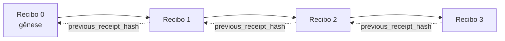

[Assista ao vídeo da lição: Protegendo Agentes de IA com Recibos Criptográficos](https://youtu.be/PLACEHOLDER_VIDEO_ID)

> _(Vídeo da lição e miniatura serão adicionados pela equipe de conteúdo da Microsoft após a mesclagem, seguindo o padrão da lição 14 / 15.)_

# Protegendo Agentes de IA com Recibos Criptográficos

## Introdução

Esta lição irá cobrir:

- Por que trilhas de auditoria para agentes de IA são importantes para conformidade, depuração e confiança.
- O que é um recibo criptográfico e como ele difere de uma linha de log não assinada.
- Como produzir um recibo assinado para a chamada de uma ferramenta do agente em Python puro.
- Como verificar um recibo offline e detectar adulteração.
- Como encadear recibos para que a remoção ou reordenação de um quebre a cadeia.
- O que os recibos provam e o que eles explicitamente não provam.

## Objetivos de Aprendizagem

Após concluir esta lição, você saberá como:

- Identificar os modos de falha que motivam a proveniência criptográfica para ações do agente.
- Produzir um recibo assinado com Ed25519 sobre uma carga útil JSON canônica.
- Verificar um recibo de forma independente usando apenas a chave pública do signatário.
- Detectar adulteração reexecutando a verificação em um recibo modificado.
- Construir uma sequência de recibos encadeados por hash e explicar por que a cadeia é importante.
- Reconhecer o limite entre o que os recibos provam (atribuição, integridade, ordenação) e o que não provam (correção da ação, solidez da política).

## O Problema: A Trilha de Auditoria do Seu Agente

Imagine que você implantou um agente de IA para a Contoso Travel. O agente lê solicitações dos clientes, chama uma API de voos para buscar opções e reserva assentos em nome do cliente. No último trimestre, o agente processou 50.000 reservas.

Hoje um auditor chega. Ele faz uma pergunta simples: "Mostre-me o que seu agente fez."

Você entrega seus arquivos de log. O auditor os analisa e faz a pergunta mais difícil: "Como eu sei que esses logs não foram editados?"

Este é o problema da trilha de auditoria. A maioria das implantações de agentes hoje depende de:

- **Logs de aplicativos**: escritos pelo próprio agente, editáveis por qualquer pessoa com acesso ao sistema de arquivos.
- **Serviços de registro na nuvem**: evidenciam adulteração em nível de plataforma, mas apenas se o auditor confiar no operador da plataforma.
- **Logs de transações de banco de dados**: adequados para mudanças de banco, mas não para chamadas arbitrárias de ferramentas.

Nenhum deles pode responder à pergunta do auditor sem exigir que o auditor confie em alguém (você, seu provedor de nuvem, seu fornecedor de banco de dados). Para uso interno, essa confiança costuma ser aceitável. Para cargas reguladas (finanças, saúde, qualquer coisa sujeita à Lei de IA da UE), não é.

Recibos criptográficos resolvem isso tornando cada ação do agente verificável de maneira independente. O auditor não precisa confiar em você. Ele precisa apenas da sua chave pública e do próprio recibo.

## O que é um Recibo Criptográfico?

Um recibo é um objeto JSON que registra o que um agente fez, assinado com uma assinatura digital.


Um recibo mínimo é assim:

```json
{
  "type": "agent.tool_call.v1",
  "agent_id": "contoso-travel-bot",
  "tool_name": "lookup_flights",
  "tool_args_hash": "sha256:a3f9c1...",
  "result_hash": "sha256:7b2e1d...",
  "policy_id": "contoso-travel-policy-v3",
  "timestamp": "2026-04-25T14:30:00Z",
  "sequence": 47,
  "previous_receipt_hash": "sha256:9d4e6a...",
  "signature": {
    "alg": "EdDSA",
    "sig": "c5af83...",
    "public_key": "8f3b2c..."
  }
}
```

Três propriedades fazem o trabalho:

1. **A assinatura**. O recibo é assinado pelo gateway do agente usando uma chave privada Ed25519. Qualquer um com a chave pública correspondente pode verificar a assinatura offline. Qualquer alteração em algum campo invalida a assinatura.

2. **Codificação canônica**. Antes da assinatura, o recibo é serializado usando o JSON Canonicalization Scheme (JCS, RFC 8785). Isso garante que duas implementações produzindo o mesmo recibo lógico gerem saída byte-idêntica. Sem canonicidade, diferentes serializadores JSON produziriam assinaturas diferentes para o mesmo conteúdo.

3. **Encadeamento por hash**. O campo `previous_receipt_hash` vincula cada recibo ao anterior. Remover ou reordenar um recibo quebra todos os recibos que vieram depois. Adulterações tornam-se visíveis no nível da cadeia mesmo se assinaturas individuais forem burladas.

Juntas, essas propriedades garantem três coisas:

- **Atribuição**: esta chave assinou este conteúdo.
- **Integridade**: o conteúdo não mudou desde a assinatura.
- **Ordenação**: este recibo veio depois daquele na cadeia.

## Produzindo um Recibo em Python

Você não precisa de uma biblioteca especial para produzir um recibo. Os primitivos criptográficos são amplamente disponíveis e a lógica são algumas dezenas de linhas de Python.

Os exercícios práticos em `code_samples/18-signed-receipts.ipynb` mostram o fluxo completo. A versão resumida:

```python
import json
import hashlib
import base64
from nacl import signing
from jcs import canonicalize  # JSON canônico RFC 8785

def b64url_nopad(data: bytes) -> str:
    return base64.urlsafe_b64encode(data).decode("ascii").rstrip("=")

def sha256_canonical(obj) -> str:
    """SHA-256 of a Python object's JCS-canonical JSON form."""
    return f"sha256:{hashlib.sha256(canonicalize(obj)).hexdigest()}"

# Gerar ou carregar uma chave de assinatura (em produção, armazenar em um cofre de chaves)
signing_key = signing.SigningKey.generate()
verify_key = signing_key.verify_key

# Construir a carga útil do recibo (ainda sem assinatura)
tool_args = {"origin": "SYD", "destination": "LAX"}
tool_result = [{"flight": "QF11", "price": 1850, "stops": 0}]

payload = {
    "type": "agent.tool_call.v1",
    "agent_id": "contoso-travel-bot",
    "tool_name": "lookup_flights",
    "tool_args_hash": sha256_canonical(tool_args),
    "result_hash": sha256_canonical(tool_result),
    "policy_id": "contoso-travel-policy-v3",
    "timestamp": "2026-04-25T14:30:00Z",
    "sequence": 0,
    "previous_receipt_hash": None,
}

# Canonicalizar, hash, assinar.
canonical_bytes = canonicalize(payload)
message_hash = hashlib.sha256(canonical_bytes).digest()
signature_bytes = signing_key.sign(message_hash).signature

# Anexar um objeto de assinatura estruturado.
receipt = {
    **payload,
    "signature": {
        "alg": "EdDSA",
        "sig": b64url_nopad(signature_bytes),
        "public_key": b64url_nopad(bytes(verify_key)),
    },
}
```

Este é todo o pipeline de assinatura. Os exercícios no notebook percorrem cada etapa.

## Verificando um Recibo e Detectando Adulteração

A verificação é a operação inversa:

```python
import base64
import hashlib
from nacl import signing
from nacl.exceptions import BadSignatureError
from jcs import canonicalize

def b64url_decode(s: str) -> bytes:
    padding = "=" * ((4 - len(s) % 4) % 4)
    return base64.urlsafe_b64decode(s + padding)

def verify_receipt(receipt: dict) -> bool:
    # A assinatura é um objeto estruturado: {"alg", "sig", "public_key"}.
    sig_obj = receipt.get("signature")
    if not sig_obj or sig_obj.get("alg") != "EdDSA":
        return False

    # Reconstrua a carga útil que foi realmente assinada (tudo exceto a assinatura).
    payload = {k: v for k, v in receipt.items() if k != "signature"}

    canonical_bytes = canonicalize(payload)
    message_hash = hashlib.sha256(canonical_bytes).digest()

    try:
        verify_key = signing.VerifyKey(b64url_decode(sig_obj["public_key"]))
        verify_key.verify(message_hash, b64url_decode(sig_obj["sig"]))
        return True
    except BadSignatureError:
        return False
```

Esta função recebe um recibo e retorna `True` se a assinatura for válida, `False` caso contrário. Sem chamada de rede, sem dependência de serviço, sem necessidade de confiar em terceiros.

Para ver a detecção de adulteração em ação, o notebook mostra:

1. Produzir um recibo válido e confirmar que verifica.
2. Modificar um byte do campo `tool_args_hash`.
3. Reexecutar a verificação e ver que falha.

Esta é a demonstração prática de que recibos evidenciam adulteração: qualquer modificação, por menor que seja, quebra a assinatura.

## Encadeando Recibos para Agentes com Múltiplas Etapas

Um único recibo assinado protege uma ação. Uma cadeia de recibos protege uma sequência.



Cada recibo registra o hash do recibo anterior. Para remover silenciosamente o recibo 2, um atacante precisaria:

- Modificar o campo `previous_receipt_hash` do recibo 3 (quebrando a assinatura do recibo 3), OU
- Forjar uma nova assinatura no recibo 3 modificado (exige a chave privada do agente).

Se a chave privada estiver em um cofre de chaves de hardware e você publicar a chave pública com cada recibo, nenhum desses ataques é possível sem detecção.

O notebook mostra:

1. Construir uma cadeia de três recibos.
2. Verificar que o `previous_receipt_hash` de cada recibo corresponde ao hash real do recibo anterior.
3. Adulterar um recibo no meio e ver a cadeia quebrar exatamente naquele ponto.

Assim você produz uma trilha de auditoria que um auditor externo pode verificar sem precisar confiar em você.

## O que os Recibos Provam (e o que Não Provam)

Esta é a seção mais importante da lição. Recibos são poderosos, mas seu poder é limitado.

**Recibos provam três coisas:**

1. **Atribuição**: uma chave específica assinou uma carga útil específica.
2. **Integridade**: a carga útil não mudou desde a assinatura.
3. **Ordenação**: este recibo veio depois daquele na cadeia de hash.

**Recibos NÃO provam:**

1. **Correção**: que a ação do agente foi a ação correta. Um recibo pode ser assinado para uma resposta errada tão limpidamente quanto para uma correta.
2. **Conformidade com políticas**: que a política referida em `policy_id` foi realmente avaliada, ou que teria permitido esta ação se checada. O recibo registra o que foi afirmado, não o que foi aplicado.
3. **Identidade além da chave**: o recibo diz "esta chave assinou este conteúdo." Não diz "este humano autorizou isto." Conectar uma chave a uma pessoa ou organização requer infraestrutura de identidade separada (um diretório, registro de chave pública etc.).
4. **Verdade dos inputs**: se o agente recebe um prompt manipulado e age com base nele, o recibo registra a ação fielmente. Recibos são posteriores à validação de entrada, não substitutos dela.

Este limite é importante por duas razões:

- Diz para que os recibos são úteis: tornar o comportamento do agente auditável e evidente para adulterações, mesmo através de fronteiras organizacionais.
- Diz quais camadas adicionais você ainda precisa: validação de entradas (Lição 6), aplicação de políticas (brevemente abordada abaixo) e infraestrutura de identidade (fora do escopo desta lição).

Um erro comum é supor que "temos recibos" significa "estamos governados." Não significa. Recibos são a base. Governança é o sistema que você constrói sobre eles.

## Referências para Produção

O código Python desta lição é propositalmente minimalista para você poder ler cada linha e entender exatamente o que está acontecendo. Em produção, você tem duas opções:

1. **Construir diretamente sobre os primitivos criptográficos.** As 50 linhas que você viu acima são suficientes para muitos casos de uso. PyNaCl (Ed25519) e o pacote `jcs` (JSON canônico) são bibliotecas bem mantidas e auditadas.

2. **Usar uma biblioteca de recibos de produção.** Vários projetos open-source implementam o mesmo padrão com recursos adicionais (rotação de chaves, verificação em lote, distribuição de JWK Set, integração com mecanismos de política):
   - O formato de recibo usado nesta lição segue um Internet-Draft do IETF (`draft-farley-acta-signed-receipts`) atualmente em processo de padronização.
   - O Microsoft Agent Governance Toolkit compõe recibos com decisões de política baseadas em Cedar; veja o Tutorial 33 naquele repositório para um exemplo completo.
   - Os pacotes `protect-mcp` (npm) e `@veritasacta/verify` (npm) oferecem implementação Node para assinatura e verificação offline de recibos, destinados a envolver qualquer servidor MCP com uma trilha de auditoria evidente para adulteração.

A decisão entre criar seu próprio código e usar uma biblioteca é como decidir entre escrever sua própria biblioteca JWT ou usar uma testada: ambos são razoáveis; a biblioteca economiza tempo e reduz superfície de auditoria; o caminho do zero força você a entender cada primitivo. Esta lição ensina o caminho do zero para lhe dar a base para qualquer escolha.

## Verificação do Conhecimento

Teste seu entendimento antes de passar para o exercício prático.

**1. Um recibo é assinado com a chave privada Ed25519 do agente. O auditor tem apenas a chave pública. O auditor pode verificar o recibo offline?**

<details>
<summary>Resposta</summary>

Sim. A verificação Ed25519 requer apenas a chave pública e os bytes assinados. Sem chamada de rede, sem dependência de serviço. Esta é a propriedade que torna os recibos úteis em ambientes desconectados, multi-organização ou de baixa confiança.
</details>

**2. Um atacante modifica o campo `policy_id` de um recibo para alegar que ele foi regido por uma política mais permissiva. A assinatura foi sobre a carga original. O que acontece na verificação?**

<details>
<summary>Resposta</summary>

A verificação falha. A assinatura foi calculada sobre os bytes canônicos da carga original; modificar qualquer campo altera os bytes canônicos, o que altera o hash SHA-256, e torna a assinatura inválida. O atacante precisaria da chave privada para produzir uma assinatura nova válida, o que ele não tem.
</details>

**3. Por que o recibo inclui um `tool_args_hash` e um `result_hash` em vez dos argumentos e resultados crus?**

<details>
<summary>Resposta</summary>

Por duas razões. Primeiro, o recibo pode precisar ser arquivado ou transmitido em ambientes onde vazar o conteúdo cru (dados pessoais, dados comerciais) é problemático. O hash mantém o recibo pequeno e o conteúdo privado; o auditor verifica que o hash corresponde a uma cópia armazenada separadamente do conteúdo real. Segundo, hashes têm tamanho fixo; um recibo com hashes é limitado em tamanho independentemente do tamanho das entradas e saídas.
</details>

**4. O campo `previous_receipt_hash` vincula cada recibo ao seu predecessor. Se um atacante excluir silenciosamente um recibo do meio da cadeia, o que se torna inválido?**

<details>
<summary>Resposta</summary>

Cada recibo que veio depois do excluído. Os campos `previous_receipt_hash` deles não correspondem mais à cadeia real (porque o recibo que referenciavam não existe mais, ou a cadeia agora aponta para um predecessor diferente). Para esconder a exclusão, o atacante precisaria reassinar cada recibo posterior, o que exige a chave privada.
</details>

**5. Um recibo verifica limpo. Isso prova que a ação do agente foi correta, sólida ou conforme a política?**

<details>
<summary>Resposta</summary>

Não. Um recibo válido prova três coisas: atribuição (esta chave assinou este conteúdo), integridade (o conteúdo não mudou) e ordenação (este recibo veio depois daquele). Ele NÃO prova que a ação foi correta, que a política nomeada em `policy_id` foi realmente avaliada, ou que o agente seguiu todas as regras. Recibos tornam o comportamento do agente auditável, não necessariamente correto. Este é o limite mais importante da lição.
</details>

## Exercício Prático

Abra `code_samples/18-signed-receipts.ipynb` e complete todas as quatro seções:

1. **Seção 1**: Assine seu primeiro recibo e verifique-o.
2. **Seção 2**: Adultere o recibo e observe a falha na verificação.
3. **Seção 3**: Construa uma cadeia de três recibos e verifique a integridade da cadeia.
4. **Seção 4**: Aplique o padrão a um agente construído com o Microsoft Agent Framework: envolva uma chamada de ferramenta na assinatura de recibo, depois verifique o recibo independentemente.

**Desafio extra 1:** estenda o esquema do recibo com um campo adicional de sua escolha (por exemplo, um ID de solicitação para rastreamento), atualize a lógica canônica de assinatura para incluí-lo e confirme que o recibo ainda passa pela verificação sem erros. Depois modifique o campo após a assinatura e confirme que a verificação falha. Isso força você a entender como cada byte da codificação canônica contribui para a assinatura.
**Desafio avançado 2:** Faça o hash SHA-256 de dois dos seus recibos juntos (concatene seus bytes canônicos em uma ordem determinística) e incorpore o resumo resultante como um novo campo em um terceiro recibo antes de assiná-lo. Verifique se os três recibos ainda passam pela ida e volta. Você acabou de construir uma prova de inclusão em um único passo: qualquer pessoa que possuir o terceiro recibo pode provar que os dois primeiros existiam no momento em que ele foi assinado, sem precisar revelar seus conteúdos. Este é o padrão que os recibos de divulgação seletiva usam em escala (compromissos de Merkle, RFC 6962).

## Conclusão

Recibos criptográficos fornecem aos agentes de IA uma trilha de auditoria que é:

- **Independemente verificável**: qualquer parte com a chave pública pode verificar, sem dependência de serviço.
- **À prova de adulteração**: qualquer modificação invalida a assinatura.
- **Portátil**: um recibo é um pequeno arquivo JSON; pode ser arquivado, transmitido e verificado em qualquer lugar.
- **Alinhado aos padrões**: construído sobre Ed25519 (RFC 8032), JCS (RFC 8785) e SHA-256, todos primitivos amplamente implantados.

Eles não substituem a validação de entrada, a aplicação de políticas ou a infraestrutura de identidade. São uma base para essas camadas. Quando você está implantando agentes em cargas de trabalho regulamentadas, fluxos de trabalho multi-organizacionais, ou qualquer ambiente onde um auditor futuro não possa ser assumido como confiável, os recibos são como você torna a trilha de auditoria honesta.

A lição mais importante: os recibos provam quem disse o quê, quando. Eles não provam que o que foi dito é verdadeiro ou correto. Mantenha essa distinção clara. É a diferença entre um sistema de proveniência honesta e um enganoso.

## Lista de Verificação para Produção

Quando estiver pronto para avançar desta lição e implantar agentes com assinaturas de recibos em um ambiente real:

- [ ] **Mova a chave de assinatura para fora do laptop do desenvolvedor.** Use Azure Key Vault, AWS KMS ou um módulo de segurança de hardware. A chave privada que assina seus recibos nunca deve viver no controle de versão ou em texto simples nas máquinas da aplicação.
- [ ] **Publique a chave pública de verificação.** Auditores precisam dela para verificar offline. O padrão é um JWK Set em uma URL conhecida (RFC 7517), por exemplo, `https://your-org.example.com/.well-known/agent-keys.json`.
- [ ] **Ancora a cadeia externamente.** Periodicamente escreva o hash da cabeça da cadeia mais recente em um log de transparência (Sigstore Rekor, autoridade de timestamp RFC 3161, ou um segundo sistema interno) para que uma parte externa possa confirmar "esta cadeia existia naquele momento."
- [ ] **Armazene os recibos de forma imutável.** Armazenamento do tipo append-only (Azure Storage com políticas de imutabilidade, AWS S3 Object Lock) previne que um insider reescreva o histórico na camada de armazenamento.
- [ ] **Decida sobre a retenção.** Muitos regimes de conformidade exigem retenção por vários anos. Planeje o crescimento dos recibos (cada recibo tem ~500 bytes; um agente que faz 10 mil chamadas por dia produz ~1,8 GB por ano).
- [ ] **Documente o que os recibos não cobrem.** Recibos provam atribuição, integridade e ordenação. Seu manual operacional deve listar explicitamente quais controles adicionais (validação de entrada, aplicação de políticas, limitação de taxa, infraestrutura de identidade) acompanham os recibos na sua postura de governança.

### Tem Mais Perguntas sobre Segurança em Agentes de IA?

Junte-se ao [Microsoft Foundry Discord](https://aka.ms/ai-agents/discord) para encontrar outros aprendizes, participar de horários de atendimento e tirar suas dúvidas sobre Agentes de IA.

## Além desta Lição

Esta lição cobre assinatura de recibos simples e sequências encadeadas por hash. Os mesmos primitivos se combinam em vários padrões mais avançados que você pode encontrar conforme sua postura de governança amadurece:

- **Divulgação seletiva.** Quando os campos de um recibo são comprometidos independentemente (árvore de Merkle estilo RFC 6962), você pode revelar campos específicos para auditores específicos e provar que o restante não foi modificado sem expô-los. Útil quando o mesmo recibo precisa satisfazer tanto uma auditoria abrangente (que quer completude) quanto regulações de minimização de dados como GDPR (que querem que o auditor veja somente o necessário).
- **Revogação de recibos.** Se uma chave de assinatura for comprometida, você precisa de uma forma de marcar todos os recibos assinados por essa chave como não confiáveis a partir de um certo momento. Padrões comuns: chaves de assinatura de curta duração mais uma lista de revogação publicada, ou um log de transparência com registros de revogação.
- **Recibos bilaterais / de assinatura dividida.** Algumas implementações dividem a carga útil assinada em metades pré-execução (`authorization_*`) e pós-execução (`result_*`) com assinaturas independentes, útil quando a decisão de autorização e o resultado observado são produções de atores diferentes ou em tempos diferentes. Isto se soma ao formato de recibo ensinado nesta lição.
- **Composição de carga útil.** Um recibo sela quaisquer bytes que você colocar em `result_hash`. Cargas úteis do mundo real geralmente são mais complexas do que o resultado de uma única chamada de ferramenta: raciocínio pré-decisão (predição do modelo, opções consideradas, evidências e sua completude, postura de risco, cadeia de responsabilidade, resultado de bloqueios) podem viver dentro da carga útil, selados por um único recibo. Isso mantém o formato do recibo minimalista enquanto permite que esquemas de carga útil evoluam domínio a domínio.
- **Conformidade entre implementações.** Múltiplas implementações independentes do mesmo formato de recibo (Python, TypeScript, Rust, Go) se verificam cruzadamente contra vetores de teste compartilhados. Se você construir sua própria implementação, validar contra vetores publicados confirma compatibilidade de protocolo.
- **Migração pós-quântica.** Ed25519 é amplamente adotada hoje, mas não é resistente a computadores quânticos. O formato de recibo é ágil quanto ao algoritmo: o campo `signature.alg` pode carregar `ML-DSA-65` (o padrão de assinatura pós-quântica do NIST) quando você precisar migrar. Planeje um período de transição em que recibos sejam assinados duplamente.

## Recursos Adicionais

- <a href="https://datatracker.ietf.org/doc/draft-farley-acta-signed-receipts/" target="_blank">IETF Internet-Draft: Recibos de Decisão Assinados para Controle de Acesso Máquina a Máquina</a>
- <a href="https://learn.microsoft.com/azure/ai-studio/responsible-use-of-ai-overview" target="_blank">Visão Geral de IA Responsável (Azure AI)</a>
- <a href="https://datatracker.ietf.org/doc/html/rfc8032" target="_blank">RFC 8032: Algoritmo de Assinatura Digital de Curva Edwards (EdDSA)</a>
- <a href="https://datatracker.ietf.org/doc/html/rfc8785" target="_blank">RFC 8785: Esquema de Canonicalização JSON (JCS)</a>
- <a href="https://datatracker.ietf.org/doc/html/rfc6962" target="_blank">RFC 6962: Transparência de Certificados</a> (construção de árvore de Merkle usada por recibos de divulgação seletiva)
- <a href="https://github.com/microsoft/agent-governance-toolkit/blob/main/docs/tutorials/33-offline-verifiable-receipts.md" target="_blank">Microsoft Agent Governance Toolkit, Tutorial 33: Recibos de Decisão Verificáveis Offline</a>
- <a href="https://github.com/ScopeBlind/agent-governance-testvectors" target="_blank">Vetores de teste para conformidade entre implementações</a> para o formato de recibo usado nesta lição (Apache-2.0)
- <a href="https://pynacl.readthedocs.io/" target="_blank">Documentação PyNaCl</a> (Ed25519 em Python)

## Lição Anterior

[Construindo Agentes de Uso Computacional (CUA)](../15-browser-use/README.md)

## Próxima Lição

_(A ser determinada pelos mantenedores do currículo)_

---

<!-- CO-OP TRANSLATOR DISCLAIMER START -->
**Aviso Legal**:
Este documento foi traduzido usando o serviço de tradução por IA [Co-op Translator](https://github.com/Azure/co-op-translator). Embora nos esforcemos pela precisão, por favor, esteja ciente de que traduções automatizadas podem conter erros ou imprecisões. O documento original em seu idioma nativo deve ser considerado a fonte autorizada. Para informações críticas, recomenda-se tradução profissional humana. Não nos responsabilizamos por quaisquer mal-entendidos ou interpretações incorretas decorrentes do uso desta tradução.
<!-- CO-OP TRANSLATOR DISCLAIMER END -->