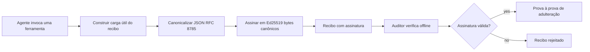
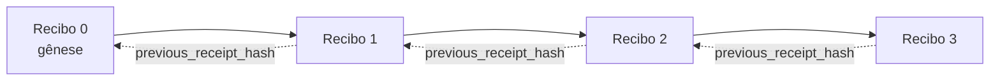

[Assista ao vídeo da lição: Protegendo Agentes de IA com Recibos Criptográficos](https://youtu.be/PLACEHOLDER_VIDEO_ID)

> _(Vídeo da lição e miniatura a serem adicionados pela equipe de conteúdo da Microsoft após a mesclagem, seguindo o padrão da lição 14 / 15.)_

# Protegendo Agentes de IA com Recibos Criptográficos

## Introdução

Esta lição abordará:

- Por que trilhas de auditoria para agentes de IA são importantes para conformidade, depuração e confiança.
- O que é um recibo criptográfico e como ele difere de uma linha de log não assinada.
- Como produzir um recibo assinado para a chamada de uma ferramenta de um agente em Python puro.
- Como verificar um recibo offline e detectar adulteração.
- Como encadear recibos para que a remoção ou reordenação de um quebre a cadeia.
- O que os recibos provam e o que eles explicitamente não provam.

## Objetivos de Aprendizagem

Após completar esta lição, você saberá como:

- Identificar os modos de falha que motivam a proveniência criptográfica para ações de agentes.
- Produzir um recibo assinado com Ed25519 sobre uma carga útil JSON canônica.
- Verificar um recibo de forma independente usando apenas a chave pública do assinante.
- Detectar adulteração ao refazer a verificação em um recibo modificado.
- Construir uma sequência de recibos encadeados por hash e explicar por que a cadeia é importante.
- Reconhecer o limite entre o que os recibos provam (atribuição, integridade, ordenação) e o que eles não provam (correção da ação, validade da política).

## O Problema: A Trilha de Auditoria do Seu Agente

Imagine que você implantou um agente de IA para a Contoso Travel. O agente lê as solicitações dos clientes, consulta uma API de voos para buscar opções e reserva assentos em nome do cliente. No último trimestre, o agente processou 50.000 reservas.

Hoje um auditor chega. Ele faz uma pergunta simples: "Mostre o que seu agente fez."

Você entrega seus arquivos de log. O auditor os analisa e faz uma pergunta mais difícil: "Como sei que esses logs não foram editados?"

Este é o problema da trilha de auditoria. A maioria das implantações de agentes hoje depende de:

- **Logs de aplicação**: escritos pelo próprio agente, editáveis por qualquer pessoa com acesso ao sistema de arquivos.
- **Serviços de log na nuvem**: evidência de adulteração no nível da plataforma, mas apenas se o auditor confiar no operador da plataforma.
- **Logs de transações de banco de dados**: bem adequados para alterações no banco, mas não para chamadas arbitrárias de ferramentas.

Nenhum deles pode responder à pergunta do auditor sem exigir que o auditor confie em alguém (você, seu provedor de nuvem, seu fornecedor de banco de dados). Para uso interno, essa confiança é geralmente aceitável. Para cargas regulamentadas (finanças, saúde, qualquer coisa sujeita à Lei de IA da UE), não é.

Recibos criptográficos resolvem isso tornando cada ação do agente verificável de forma independente. O auditor não precisa confiar em você. Ele precisa apenas de sua chave pública e do próprio recibo.

## O que é um Recibo Criptográfico?

Um recibo é um objeto JSON que registra o que um agente fez, assinado com uma assinatura digital.


```mermaid
flowchart LR
    A[Agente invoca uma ferramenta] --> B[Construir carga útil do recibo]
    B --> C[Canonicalizar JSON RFC 8785]
    C --> E[Assinar em Ed25519 bytes canônicos]
    E --> F[Recibo com assinatura]
    F --> G[Auditor verifica offline]
    G --> H{Assinatura válida?}
    H -- yes --> I[Prova à prova de adulteração]
    H -- no --> J[Recibo rejeitado]
```

Um recibo mínimo fica assim:

```json
{
  "type": "agent.tool_call.v1",
  "agent_id": "contoso-travel-bot",
  "tool_name": "lookup_flights",
  "tool_args_hash": "sha256:a3f9c1...",
  "result_hash": "sha256:7b2e1d...",
  "policy_id": "contoso-travel-policy-v3",
  "timestamp": "2026-04-25T14:30:00Z",
  "sequence": 47,
  "previous_receipt_hash": "sha256:9d4e6a...",
  "signature": {
    "alg": "EdDSA",
    "sig": "c5af83...",
    "public_key": "8f3b2c..."
  }
}
```

Três propriedades fazem o trabalho:

1. **A assinatura**. O recibo é assinado pelo gateway do agente usando uma chave privada Ed25519. Qualquer pessoa com a chave pública correspondente pode verificar a assinatura offline. Qualquer adulteração em qualquer campo invalida a assinatura.

2. **Codificação canônica**. Antes de assinar, o recibo é serializado usando o JSON Canonicalization Scheme (JCS, RFC 8785). Isso assegura que duas implementações que produzem o mesmo recibo lógico produzam saída idêntica em bytes. Sem a canonicalização, diferentes serializadores JSON produziriam assinaturas diferentes para o mesmo conteúdo.

3. **Encadeamento por hash**. O campo `previous_receipt_hash` liga cada recibo ao anterior. Remover ou reordenar um recibo quebra todos os recibos seguintes. A adulteração torna-se visível no nível da cadeia mesmo que assinaturas individuais sejam burladas.

Juntas, essas propriedades fornecem três garantias:

- **Atribuição**: esta chave assinou este conteúdo.
- **Integridade**: o conteúdo não mudou desde a assinatura.
- **Ordenação**: este recibo veio depois daquele recibo na cadeia.

## Produzindo um Recibo em Python

Você não precisa de uma biblioteca especial para produzir um recibo. Os primitivos criptográficos estão amplamente disponíveis e a lógica são poucas dezenas de linhas em Python.

Os exercícios práticos em `code_samples/18-signed-receipts.ipynb` percorrem o fluxo completo. A versão resumida:

```python
import json
import hashlib
import base64
from nacl import signing
from jcs import canonicalize  # JSON canônico RFC 8785

def b64url_nopad(data: bytes) -> str:
    return base64.urlsafe_b64encode(data).decode("ascii").rstrip("=")

def sha256_canonical(obj) -> str:
    """SHA-256 of a Python object's JCS-canonical JSON form."""
    return f"sha256:{hashlib.sha256(canonicalize(obj)).hexdigest()}"

# Gerar ou carregar uma chave de assinatura (em produção, armazenar em um cofre de chaves)
signing_key = signing.SigningKey.generate()
verify_key = signing_key.verify_key

# Construir o payload do recibo (ainda sem assinatura)
tool_args = {"origin": "SYD", "destination": "LAX"}
tool_result = [{"flight": "QF11", "price": 1850, "stops": 0}]

payload = {
    "type": "agent.tool_call.v1",
    "agent_id": "contoso-travel-bot",
    "tool_name": "lookup_flights",
    "tool_args_hash": sha256_canonical(tool_args),
    "result_hash": sha256_canonical(tool_result),
    "policy_id": "contoso-travel-policy-v3",
    "timestamp": "2026-04-25T14:30:00Z",
    "sequence": 0,
    "previous_receipt_hash": None,
}

# Canonicalizar e assinar diretamente os bytes JCS. PureEdDSA faz hash internamente.
canonical_bytes = canonicalize(payload)
signature_bytes = signing_key.sign(canonical_bytes).signature

# Anexar um objeto de assinatura estruturado.
receipt = {
    **payload,
    "signature": {
        "alg": "EdDSA",
        "sig": b64url_nopad(signature_bytes),
        "public_key": b64url_nopad(bytes(verify_key)),
    },
}
```

Este é todo o pipeline de assinatura. Os exercícios no notebook percorrem cada passo.

## Verificando um Recibo e Detectando Adulteração

Verificação é a operação inversa:

```python
import base64
import hashlib
from nacl import signing
from nacl.exceptions import BadSignatureError
from jcs import canonicalize

def b64url_decode(s: str) -> bytes:
    padding = "=" * ((4 - len(s) % 4) % 4)
    return base64.urlsafe_b64decode(s + padding)

def verify_receipt(receipt: dict) -> bool:
    # A assinatura é um objeto estruturado: {"alg", "sig", "public_key"}.
    sig_obj = receipt.get("signature")
    if not sig_obj or sig_obj.get("alg") != "EdDSA":
        return False

    # Reconstrua o payload que foi realmente assinado (tudo exceto a assinatura).
    payload = {k: v for k, v in receipt.items() if k != "signature"}

    canonical_bytes = canonicalize(payload)

    try:
        verify_key = signing.VerifyKey(b64url_decode(sig_obj["public_key"]))
        verify_key.verify(canonical_bytes, b64url_decode(sig_obj["sig"]))
        return True
    except BadSignatureError:
        return False
```

Esta função recebe um recibo e retorna `True` se a assinatura for válida, `False` caso contrário. Sem chamada de rede, sem dependência de serviço, sem necessidade de confiar em terceiros.

Para ver a detecção de adulteração em ação, o notebook percorre:

1. Produção de um recibo válido e confirmação de que ele verifica.
2. Modificação de um byte no campo `tool_args_hash`.
3. Refazer a verificação e observar que falha.

Esta é a demonstração prática de que recibos são evidência de adulteração: qualquer modificação, por menor que seja, quebra a assinatura.

## Encadeando Recibos para Agentes Multi-Etapas

Um único recibo assinado protege uma ação. Uma cadeia de recibos protege uma sequência.


```mermaid
flowchart LR
    R0[Recibo 0<br/>gênese] --> R1[Recibo 1]
    R1 --> R2[Recibo 2]
    R2 --> R3[Recibo 3]
    R1 -. previous_receipt_hash .-> R0
    R2 -. previous_receipt_hash .-> R1
    R3 -. previous_receipt_hash .-> R2
```

Cada recibo registra o hash do recibo anterior. Para remover silenciosamente o recibo 2, um invasor precisaria:

- Modificar o campo `previous_receipt_hash` do recibo 3 (quebrando a assinatura do recibo 3), OU
- Forjar uma nova assinatura no recibo 3 modificado (exige a chave privada do agente).

Se a chave privada estiver em um cofre de chaves de hardware e você publicar a chave pública com cada recibo, nenhum desses ataques é viável sem ser detectado.

O notebook percorre:

1. Construir uma cadeia de três recibos.
2. Verificar que o `previous_receipt_hash` de cada recibo corresponde ao hash real do recibo anterior.
3. Adulterar um recibo no meio e observar a cadeia quebrar exatamente nesse ponto.

Assim você produz uma trilha de auditoria que um auditor externo pode verificar sem precisar confiar em você.

## O que os Recibos Provam (e o que Eles Não Provam)

Esta é a seção mais importante desta lição. Recibos são poderosos, mas seu poder é limitado.

**Recibos provam três coisas:**

1. **Atribuição**: uma chave específica assinou uma carga útil específica.
2. **Integridade**: a carga útil não mudou desde a assinatura.
3. **Ordenação**: este recibo veio depois daquele na cadeia de hash.

**Recibos NÃO provam:**

1. **Correção**: que a ação do agente foi a ação correta. Um recibo pode ser assinado para uma resposta errada tão limpidamente quanto para uma resposta correta.
2. **Conformidade com políticas**: que a política referenciada em `policy_id` foi realmente avaliada, ou que ela teria permitido essa ação se fosse verificada. O recibo registra o que foi afirmado, não o que foi aplicado.
3. **Identidade além da chave**: o recibo diz "esta chave assinou este conteúdo." Não diz "esta pessoa autorizou." Conectar uma chave a uma pessoa ou organização requer infraestrutura de identidade separada (um diretório, um registro de chave pública etc.).
4. **Veracidade das entradas**: se o agente recebe um prompt manipulado e age com base nele, o recibo registra a ação fielmente. Recibos são posteriores à validação de entrada, não um substituto para ela.

Esse limite é importante por duas razões:

- Diz para que os recibos são úteis: tornar o comportamento do agente auditável e evidenciar adulterações, mesmo entre fronteiras organizacionais.
- Diz quais camadas adicionais ainda são necessárias: validação de entrada (Lição 6), aplicação de políticas (brevemente abordado abaixo) e infraestrutura de identidade (fora do escopo desta lição).

Um erro comum é assumir que "temos recibos" significa "estamos governados". Não é. Recibos são uma base. Governança é o sistema que você constrói a partir deles.

## Provando que um Humano Aprovou a Ação Exata

O item 3 acima merece uma seção própria: um recibo de ação diz "esta chave assinou este conteúdo", nunca "um humano autorizou". Para ações de alto risco (reembolsos, exclusões, transferências bancárias), estruturas de governança cada vez mais exigem exatamente essa declaração ausente, e ela pode ser produzida com os mesmos primitivos que você já construiu nesta lição.

O notebook complementar `code_samples/human-authorization-receipts.ipynb` adiciona um segundo tipo de recibo, `human.approval.v1`, na mesma estrutura de envelope dos recibos da lição (uma carga útil tipada assinada por Ed25519 sobre seus bytes canônicos JCS, com o objeto `signature` fora dos bytes assinados). Um aprovador nomeado assina a **ação canônica completa e seu digest** antes da execução; o recibo de ação do agente carrega o **mesmo digest de ação** e uma `parent_approval_ref`, o `receipt_hash` da aprovação, a mesma convenção que `previous_receipt_hash` na cadeia que você construiu acima. Um `verify_chain` passa por ambos os artefatos sob **registros de chave fixos e separados** (chaves de aprovador vs chaves de agente), assim o caminho de código é compartilhado, mas as autoridades nunca são.

A propriedade que isso garante, declarada cuidadosamente: *o humano aprovou esta ação exata, e o agente executou exatamente essa ação aprovada.* Os testes de recusa do notebook são o que tornam essa propriedade real e não mera assertiva:

- o conjunto clássico: adulteração, procurador confuso, repetição, chaves forjadas em qualquer lado, entrada malformada;
- **autoridade desatualizada**: uma assinatura que ainda verifica, recusada de qualquer forma porque a versão da política mudou, a chave do aprovador foi removida do registro fixo, ou a aprovação expirou antes da execução;
- **substituição de digest**: um recibo de ação válido apontando para uma aprovação *real* que vincula uma ação canônica *diferente*.

Cada falha recusa com uma razão distinta, assim um auditor lendo uma recusa pode dizer se a autoridade ficou obsoleta ou a ação executada mudou. A regra que o notebook ensina: uma aprovação assinada não é autoridade por si só. Autoridade existe apenas se ambos os recibos ainda vinculam à mesma ação canônica no momento da execução. O recibo de aprovação humana é uma composição educativa definida por esta lição, não um tipo de recibo definido pelo `draft-farley-acta-signed-receipts`.

## Referências para Produção

O código Python desta lição é intencionalmente minimalista para que você possa ler cada linha e entender exatamente o que está acontecendo. Em produção, você tem duas opções:

1. **Construir diretamente sobre os primitivos criptográficos.** As 50 linhas que você viu acima são suficientes para muitos casos de uso. PyNaCl (Ed25519) e o pacote `jcs` (JSON canônico) são bibliotecas bem mantidas e auditadas.

2. **Usar uma biblioteca de recibos para produção.** Vários projetos open-source implementam o mesmo padrão com recursos adicionais (rotação de chaves, verificação em lote, distribuição de JWK Set, integração com motores de política):
   - O pipeline de assinatura usa as convenções JCS e do escopo da assinatura em um rascunho independente do IETF ([`draft-farley-acta-signed-receipts`](https://datatracker.ietf.org/doc/draft-farley-acta-signed-receipts/), revisão 02). O recibo educacional plano desta lição difere do envelope `{payload, signature}` do rascunho e não é apresentado como uma implementação conforme. O rascunho publica uma suíte de conformidade compartilhada ([agent-governance-testvectors](https://github.com/ScopeBlind/agent-governance-testvectors)) para implementações que visam seu formato.
   - O Microsoft Agent Governance Toolkit compõe recibos com decisões políticas baseadas em Cedar; veja o Tutorial 33 nesse repositório para um exemplo completo.
   - Os pacotes `protect-mcp` (npm) e `@veritasacta/verify` (npm) fornecem uma implementação Node da assinatura e verificação offline de recibos, destinada a envolver qualquer servidor MCP com uma trilha de auditoria resistente a adulteração, incluindo um fluxo de co-assinatura onde uma ação pausada emite um recibo de aprovação vinculado ao digest da ação (com suporte a WebAuthn no fluxo desktop), o mesmo padrão de recibo de aprovação do notebook de autorização humana acima.
   - O SDK Python **[nobulex](https://github.com/arian-gogani/nobulex)** (`pip install nobulex`) fornece o mesmo padrão de assinatura Ed25519 + JCS em Python com integrações LangChain e CrewAI, incluindo vetores de teste de validação cruzada publicados e um mapeamento de conformidade contribuído via [OWASP PR #2210](https://github.com/OWASP/CheatSheetSeries/pull/2210).

A decisão entre construir sua própria solução e usar uma biblioteca é análoga à escolha entre escrever sua própria biblioteca JWT e usar uma testada: ambas são razoáveis; a biblioteca economiza tempo e reduz a superfície de auditoria; a abordagem do zero força você a entender cada primitivo. Esta lição ensina o caminho do zero para que você tenha a base para qualquer escolha.

## Verificação de Conhecimento

Teste seu entendimento antes de seguir para o exercício prático.

**1. Um recibo é assinado com a chave privada Ed25519 do agente. O auditor possui apenas a chave pública. O auditor pode verificar o recibo offline?**

<details>
<summary>Resposta</summary>

Sim. A verificação Ed25519 requer apenas a chave pública e os bytes assinados. Sem chamada de rede, sem dependência de serviço. Esta é a propriedade que torna os recibos úteis em ambientes air-gapped, multi-organizacionais ou de baixa confiança.
</details>

**2. Um invasor modifica o campo `policy_id` de um recibo para alegar que foi governado por uma política mais permissiva. A assinatura foi feita sobre a carga útil original. O que acontece durante a verificação?**

<details>
<summary>Resposta</summary>


A verificação falha. A assinatura foi calculada sobre os bytes canônicos da carga útil original; modificar qualquer campo altera esses bytes, o que torna a assinatura inválida. O atacante precisaria da chave privada para produzir uma nova assinatura válida, a qual ele não possui.
</details>

**3. Por que o recibo inclui um `tool_args_hash` e `result_hash` em vez dos argumentos brutos e resultado?**

<details>
<summary>Resposta</summary>

Duas razões. Primeiro, o recibo pode precisar ser arquivado ou transmitido em ambientes onde vazar o conteúdo bruto (informações pessoais, dados de negócios) é um problema. O hash mantém o recibo pequeno e o conteúdo privado; o auditor verifica se o hash corresponde a uma cópia separadamente armazenada do conteúdo real. Segundo, os hashes têm tamanho fixo; um recibo com hashes tem tamanho limitado independentemente do tamanho das entradas e saídas.
</details>

**4. O campo `previous_receipt_hash` vincula cada recibo ao seu predecessor. Se um atacante remover silenciosamente um recibo do meio de uma cadeia, o que se torna inválido?**

<details>
<summary>Resposta</summary>

Todo recibo que veio depois do excluído. Seus campos `previous_receipt_hash` não correspondem mais à cadeia real (porque o recibo ao qual faziam referência não existe mais, ou a cadeia agora aponta para um predecessor diferente). Para ocultar a exclusão, o atacante precisaria re-assinar todos os recibos posteriores, o que requer a chave privada.
</details>

**5. Um recibo verifica corretamente. Isso prova que a ação do agente foi correta, sólida ou compatível com a política?**

<details>
<summary>Resposta</summary>

Não. Um recibo válido prova três coisas: atribuição (esta chave assinou este conteúdo), integridade (o conteúdo não foi alterado) e ordenação (este recibo veio depois daquele). Ele NÃO prova que a ação foi correta, que a política nomeada em `policy_id` foi realmente avaliada, ou que o agente seguiu todas as regras. Recibos tornam o comportamento do agente auditável, não necessariamente correto. Esta é a fronteira mais importante da lição.
</details>

## Exercício Prático

Abra `code_samples/18-signed-receipts.ipynb` e complete todas as quatro seções:

1. **Seção 1**: Assine seu primeiro recibo e verifique-o.
2. **Seção 2**: Manipule o recibo e observe a falha na verificação.
3. **Seção 3**: Construa uma cadeia de três recibos e verifique a integridade da cadeia.
4. **Seção 4**: Aplique o padrão a um agente criado com o Microsoft Agent Framework: envolva uma chamada de ferramenta na assinatura do recibo e depois verifique o recibo independentemente.

**Desafio extra 1:** estenda o esquema do recibo com um campo adicional de sua escolha (por exemplo, um ID de requisição para rastreamento), atualize a lógica canônica de assinatura para incluí-lo e confirme que o recibo ainda passa pela verificação. Então modifique o campo após a assinatura e confirme que a verificação falha. Isso força você a entender como cada byte da codificação canônica contribui para a assinatura.

**Desafio extra 2:** Faça o hash SHA-256 de dois de seus recibos juntos (concatene seus bytes canônicos em uma ordem determinística) e incorpore o resumo resultante como um novo campo em um terceiro recibo antes de assiná-lo. Verifique que os três recibos ainda passam pela verificação. Você acabou de construir uma prova de inclusão de um passo: qualquer pessoa que tenha o terceiro recibo pode provar que os dois primeiros existiam no momento da assinatura, sem precisar revelar seus conteúdos. Este é o padrão que os recibos de divulgação seletiva usam em larga escala (compromissos Merkle, RFC 6962).

## Conclusão

Recibos criptográficos dão aos agentes de IA uma trilha de auditoria que é:

- **Independente e verificável**: qualquer parte com a chave pública pode verificar, sem dependência de serviço.
- **À prova de adulteração**: qualquer modificação invalida a assinatura.
- **Portátil**: um recibo é um pequeno arquivo JSON; pode ser arquivado, transmitido e verificado em qualquer lugar.
- **Alinhado a padrões**: construído sobre Ed25519 (RFC 8032), JCS (RFC 8785) e SHA-256, todos primitivos amplamente usados.

Eles não são substitutos para validação de entrada, aplicação de política ou infraestrutura de identidade. São uma base para essas camadas. Quando você implanta agentes em cargas de trabalho reguladas, fluxos de trabalho com múltiplas organizações, ou qualquer contexto em que um auditor futuro não possa supor confiança em você, os recibos são como você torna a trilha de auditoria honesta.

A lição mais importante: recibos provam quem disse o quê e quando. Eles não provam que o que foi dito é verdadeiro ou correto. Mantenha essa distinção clara. É a diferença entre um sistema de procedência honesto e um enganoso.

## Lista de Verificação para Produção

Quando estiver pronto para avançar desta lição para a implantação de agentes com recibos assinados em um ambiente real:

- [ ] **Remova a chave de assinatura do laptop do desenvolvedor.** Use Azure Key Vault, AWS KMS ou um módulo de segurança de hardware. A chave privada que assina seus recibos nunca deve ficar em controle de versão nem em texto simples nas máquinas de aplicação.
- [ ] **Publique a chave pública de verificação.** Auditores precisam dela para verificar offline. O padrão é um conjunto JWK em uma URL bem conhecida (RFC 7517), por exemplo, `https://your-org.example.com/.well-known/agent-keys.json`.
- [ ] **Ancore a cadeia externamente.** Periodicamente escreva o hash do último cabeçalho da cadeia em um log de transparência (Sigstore Rekor, autoridade de timestamp RFC 3161, ou um segundo sistema interno) para que uma parte externa possa confirmar "esta cadeia existia em tal momento."
- [ ] **Armazene os recibos de forma imutável.** Armazenamento append-only (Azure Storage com políticas de imutabilidade, AWS S3 Object Lock) impede que um insider reescreva o histórico no nível de armazenamento.
- [ ] **Decida sobre retenção.** Muitos regimes de conformidade requerem retenção de vários anos. Planeje o crescimento dos recibos (cada recibo tem ~500 bytes; um agente que faz 10 mil chamadas por dia produz ~1,8 GB por ano).
- [ ] **Documente o que os recibos não cobrem.** Recibos provam atribuição, integridade e ordenação. Seu manual deve listar explicitamente quais controles adicionais (validação de entrada, aplicação de políticas, limitação de taxa, infraestrutura de identidade) coexistem com os recibos na sua postura de governança.

### Tem Mais Perguntas sobre a Segurança de Agentes de IA?

Junte-se ao [Microsoft Foundry Discord](https://aka.ms/ai-agents/discord) para encontrar outros aprendizes, participar de horários de atendimento e tirar suas dúvidas sobre Agentes de IA.

## Além Desta Lição

Esta lição cobre assinatura de recibos únicos e sequências em cadeia de hash. Os mesmos primitvos compõem vários padrões mais avançados que você pode encontrar à medida que sua postura de governança amadurece:

- **Divulgação seletiva.** Quando os campos de um recibo são comprometidos independentemente (árvore Merkle estilo RFC 6962), você pode revelar campos específicos para auditores específicos e provar que os demais não foram alterados sem expô-los. Útil quando o mesmo recibo deve satisfazer uma auditoria completa (que exige integridade) e regulações de minimização de dados como o GDPR (que querem que o auditor veja o mínimo necessário).
- **Revogação de recibos.** Se uma chave de assinatura for comprometida, é necessário um modo de marcar todos os recibos assinados por essa chave como não confiáveis a partir de um momento. Padrões comuns: chaves de assinatura de vida curta junto a uma lista publicada de revogação, ou um log de transparência com entradas de revogação.
- **Recibos bilaterais / de assinatura dividida.** Algumas implementações separam a carga assinada em metades pré-execução (`authorization_*`) e pós-execução (`result_*`) com assinaturas independentes, útil quando a decisão de autorização e o resultado observado são produzidos por atores diferentes ou em momentos diferentes. Isso se soma ao formato de recibo ensinado aqui.
- **Composição da carga útil.** Um recibo sela quaisquer bytes que você colocou em `result_hash`. Cargas reais são frequentemente mais ricas do que o resultado de uma única chamada de ferramenta: raciocínio pré-decisão (predição de modelo, opções consideradas, evidências e sua completude, postura de risco, cadeia de responsabilidade, resultado do gate) podem estar dentro da carga, selados por um único recibo. Isso mantém o formato do recibo minimalista enquanto permite evolução dos esquemas de carga por domínio.
- **Conformidade entre implementações.** Várias implementações independentes do mesmo formato de recibo (Python, TypeScript, Rust, Go) se verificam entre si usando vetores de teste compartilhados. Se você construir sua própria implementação, validar contra vetores publicados confirma compatibilidade.
- **Migração pós-quântica.** Ed25519 é amplamente usado hoje, mas não é resistente a computação quântica. O formato do recibo é ágil quanto a algoritmo: o campo `signature.alg` pode carregar `ML-DSA-65` (padrão pós-quântico NIST) quando for necessário migrar. Planeje um período de transição em que os recibos sejam assinados duplamente.

## Recursos Adicionais

- <a href="https://datatracker.ietf.org/doc/draft-farley-acta-signed-receipts/" target="_blank">IETF Internet-Draft: Recibos de Decisão Assinados para Controle de Acesso Máquina a Máquina</a>
- <a href="https://learn.microsoft.com/azure/ai-studio/responsible-use-of-ai-overview" target="_blank">Visão geral de IA Responsável (Azure AI)</a>
- <a href="https://datatracker.ietf.org/doc/html/rfc8032" target="_blank">RFC 8032: Algoritmo de Assinatura Digital Edwards-Curve (EdDSA)</a>
- <a href="https://datatracker.ietf.org/doc/html/rfc8785" target="_blank">RFC 8785: Esquema de Canonicalização JSON (JCS)</a>
- <a href="https://datatracker.ietf.org/doc/html/rfc6962" target="_blank">RFC 6962: Transparência de Certificados</a> (construção de árvore Merkle usada em recibos de divulgação seletiva)
- <a href="https://github.com/microsoft/agent-governance-toolkit/blob/main/docs/tutorials/33-offline-verifiable-receipts.md" target="_blank">Microsoft Agent Governance Toolkit, Tutorial 33: Recibos de Decisão Verificáveis Offline</a>
- <a href="https://github.com/ScopeBlind/agent-governance-testvectors" target="_blank">Vetores de teste de conformidade entre implementações</a> para o formato de recibo usado nesta lição (Apache-2.0)
- <a href="https://pynacl.readthedocs.io/" target="_blank">Documentação PyNaCl</a> (Ed25519 em Python)

## Lição Anterior

[Criando Agentes de IA Locais](../17-creating-local-ai-agents/README.md)

---

<!-- CO-OP TRANSLATOR DISCLAIMER START -->
**Aviso Legal**:
Este documento foi traduzido usando o serviço de tradução por IA [Co-op Translator](https://github.com/Azure/co-op-translator). Embora nos esforcemos pela precisão, por favor, esteja ciente de que traduções automatizadas podem conter erros ou imprecisões. O documento original em seu idioma nativo deve ser considerado a fonte autorizada. Para informações críticas, recomenda-se tradução profissional humana. Não nos responsabilizamos por quaisquer mal-entendidos ou interpretações incorretas decorrentes do uso desta tradução.
<!-- CO-OP TRANSLATOR DISCLAIMER END -->