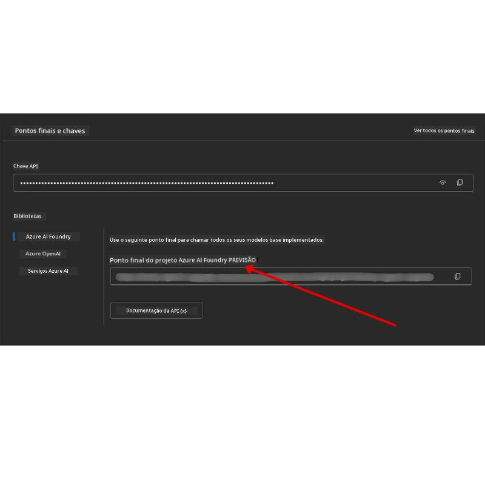

# Configuração do Curso

## Introdução

Esta lição irá cobrir como executar os exemplos de código deste curso.

## Junte-se a Outros Aprendizes e Obtenha Ajuda

Antes de começar a clonar o seu repositório, junte-se ao [canal Discord AI Agents For Beginners](https://aka.ms/ai-agents/discord) para obter ajuda com a configuração, tirar dúvidas sobre o curso ou para se conectar com outros aprendizes.

## Clone ou Faça Fork deste Repositório

Para começar, por favor clone ou faça fork do Repositório GitHub. Isto fará a sua própria versão do material do curso para que possa executar, testar e ajustar o código!

Isto pode ser feito clicando no link para <a href="https://github.com/microsoft/ai-agents-for-beginners/fork" target="_blank">fazer fork do repositório</a>

Deverá agora ter a sua própria versão forked deste curso no seguinte link:


### Clone Raso (recomendado para workshop / Codespaces)

  >O repositório completo pode ser grande (~3 GB) quando descarrega todo o histórico e todos os ficheiros. Se estiver apenas a assistir ao workshop ou precisar apenas de algumas pastas das lições, um clone raso (ou um clone esparso) evita a maior parte desse download ao truncar o histórico e/ou ignorar blobs.

#### Clone raso rápido — histórico mínimo, todos os ficheiros

Substitua `<your-username>` nos comandos abaixo pela URL do seu fork (ou a URL upstream se preferir).

Para clonar apenas o histórico da última confirmação (download pequeno):

```bash|powershell
git clone --depth 1 https://github.com/<your-username>/ai-agents-for-beginners.git
```

Para clonar um ramo específico:

```bash|powershell
git clone --depth 1 --branch <branch-name> https://github.com/<your-username>/ai-agents-for-beginners.git
```

#### Clone parcial (esparso) — blobs mínimos + apenas pastas selecionadas

Isto usa clone parcial e sparse-checkout (necessita Git 2.25+ e é recomendado usar Git moderno com suporte a clone parcial):

```bash|powershell
git clone --depth 1 --filter=blob:none --sparse https://github.com/<your-username>/ai-agents-for-beginners.git
```

Navegue até à pasta do repositório:

```bash|powershell
cd ai-agents-for-beginners
```

Depois especifique quais pastas quer (exemplo abaixo mostra duas pastas):

```bash|powershell
git sparse-checkout set 00-course-setup 01-intro-to-ai-agents
```

Após clonar e verificar os ficheiros, se precisar apenas dos ficheiros e quiser libertar espaço (sem histórico git), por favor elimine os metadados do repositório (💀 irreversível — perderá toda a funcionalidade Git: sem commits, pulls, pushes ou acesso ao histórico).

```bash
# zsh/bash
rm -rf .git
```

```powershell
# PowerShell
Remove-Item -Recurse -Force .git
```

#### Usar GitHub Codespaces (recomendado para evitar downloads grandes locais)

- Crie um novo Codespace para este repositório via a [interface do GitHub](https://github.com/codespaces).  

- No terminal do Codespace recém-criado, execute um dos comandos rasos/esparsos acima para trazer apenas as pastas das lições que precisa para o espaço de trabalho do Codespace.
- Opcional: após clonar dentro dos Codespaces, remova .git para recuperar espaço extra (veja os comandos de remoção acima).
- Nota: se preferir abrir o repositório diretamente nos Codespaces (sem um clone extra), tenha em conta que os Codespaces construirão o ambiente devcontainer e podem ainda assim provisionar mais do que precisa. Clonar uma cópia rasa dentro de um Codespace limpo dá-lhe mais controlo sobre o uso do disco.

#### Dicas

- Substitua sempre a URL do clone pelo seu fork se quiser editar/fazer commit.
- Se mais tarde precisar de mais histórico ou ficheiros, pode buscar (fetch) ou ajustar o sparse-checkout para incluir pastas adicionais.

## Executar o Código

Este curso oferece uma série de Jupyter Notebooks que pode executar para obter experiência prática na construção de Agentes de IA.

Os exemplos de código usam o **Microsoft Agent Framework (MAF)** com o `AzureAIProjectAgentProvider`, que se liga ao **Azure AI Agent Service V2** (a API de Respostas) através da **Microsoft Foundry**.

Todos os notebooks Python estão etiquetados como `*-python-agent-framework.ipynb`.

## Requisitos

- Python 3.12+
  - **NOTA**: Se não tem o Python 3.12 instalado, assegure-se de instalá-lo. Depois crie o seu venv usando python3.12 para garantir que as versões corretas são instaladas do ficheiro requirements.txt.
  
    >Exemplo

    Criar diretório do ambiente Python virtual:

    ```bash|powershell
    python -m venv venv
    ```

    Depois ative o ambiente venv para:

    ```bash
    # zsh/bash
    source venv/bin/activate
    ```
  
    ```dos
    # Command Prompt for Windows
    venv\Scripts\activate
    ```

- .NET 10+: Para os exemplos de código usando .NET, assegure-se de instalar o [.NET 10 SDK](https://dotnet.microsoft.com/download/dotnet/10.0) ou posterior. Depois, verifique a sua versão instalada do .NET SDK:

    ```bash|powershell
    dotnet --list-sdks
    ```

- **Azure CLI** — Necessário para autenticação. Instale em [aka.ms/installazurecli](https://aka.ms/installazurecli).
- **Subscripción Azure** — Para acesso ao Microsoft Foundry e Azure AI Agent Service.
- **Projeto Microsoft Foundry** — Um projeto com um modelo implementado (por exemplo, `gpt-4o`). Veja [Passo 1](../../../00-course-setup) abaixo.

Incluímos um ficheiro `requirements.txt` na raiz deste repositório que contém todos os pacotes Python necessários para executar os exemplos de código.

Pode instalá-los executando o seguinte comando no seu terminal na raiz do repositório:

```bash|powershell
pip install -r requirements.txt
```

Recomendamos criar um ambiente virtual Python para evitar quaisquer conflitos e problemas.

## Configurar VSCode

Certifique-se de que está a usar a versão correta do Python no VSCode.


## Configurar Microsoft Foundry e Azure AI Agent Service

### Passo 1: Criar um Projeto Microsoft Foundry

Precisa de um **hub** e um **projeto** Azure AI Foundry com um modelo implementado para executar os notebooks.

1. Vá a [ai.azure.com](https://ai.azure.com) e inicie sessão com a sua conta Azure.
2. Crie um **hub** (ou use um existente). Veja: [Visão geral dos recursos Hub](https://learn.microsoft.com/azure/ai-foundry/concepts/ai-resources).
3. Dentro do hub, crie um **projeto**.
4. Implemente um modelo (por exemplo, `gpt-4o`) a partir de **Models + Endpoints** → **Deploy model**.

### Passo 2: Obter o Endpoint do seu Projeto e o Nome do Desdobramento do Modelo

No seu projeto no portal Microsoft Foundry:

- **Endpoint do Projeto** — Vá para a página **Overview** e copie a URL do endpoint.



- **Nome do Desdobramento do Modelo** — Vá a **Models + Endpoints**, selecione o seu modelo implementado e anote o **Deployment name** (por exemplo, `gpt-4o`).

### Passo 3: Iniciar sessão no Azure com `az login`

Todos os notebooks usam **`AzureCliCredential`** para autenticação — não há chaves API para gerir. Isto requer que esteja autenticado via Azure CLI.

1. **Instale o Azure CLI** se ainda não o fez: [aka.ms/installazurecli](https://aka.ms/installazurecli)

2. **Inicie sessão** executando:

    ```bash|powershell
    az login
    ```

    Ou se estiver num ambiente remoto/Codespace sem browser:

    ```bash|powershell
    az login --use-device-code
    ```

3. **Selecione a sua subscrição** se for solicitado — escolha aquela que contém o seu projeto Foundry.

4. **Verifique** que está autenticado:

    ```bash|powershell
    az account show
    ```

> **Porquê `az login`?** Os notebooks autenticam usando `AzureCliCredential` do pacote `azure-identity`. Isto significa que a sua sessão do Azure CLI fornece as credenciais — sem chaves API ou segredos no seu ficheiro `.env`. Esta é uma [boa prática de segurança](https://learn.microsoft.com/azure/developer/ai/keyless-connections).

### Passo 4: Criar o seu ficheiro `.env`

Copie o ficheiro exemplo:

```bash
# zsh/bash
cp .env.example .env
```

```powershell
# PowerShell
Copy-Item .env.example .env
```

Abra `.env` e preencha estes dois valores:

```env
AZURE_AI_PROJECT_ENDPOINT=https://<your-project>.services.ai.azure.com/api/projects/<your-project-id>
AZURE_AI_MODEL_DEPLOYMENT_NAME=gpt-4o
```

| Variável | Onde encontrar |
|----------|-----------------|
| `AZURE_AI_PROJECT_ENDPOINT` | Portal Foundry → seu projeto → página **Overview** |
| `AZURE_AI_MODEL_DEPLOYMENT_NAME` | Portal Foundry → **Models + Endpoints** → nome do seu modelo implementado |

É tudo para a maioria das lições! Os notebooks vão autenticar automaticamente através da sua sessão `az login`.

### Passo 5: Instalar Dependências Python

```bash|powershell
pip install -r requirements.txt
```

Recomendamos executar isto dentro do ambiente virtual que criou anteriormente.

## Configuração Adicional para a Lição 5 (Agentic RAG)

A lição 5 usa **Azure AI Search** para geração aumentada por recuperação. Se pretende executar essa lição, adicione estas variáveis ao seu ficheiro `.env`:

| Variável | Onde encontrar |
|----------|-----------------|
| `AZURE_SEARCH_SERVICE_ENDPOINT` | Portal Azure → seu recurso **Azure AI Search** → **Overview** → URL |
| `AZURE_SEARCH_API_KEY` | Portal Azure → seu recurso **Azure AI Search** → **Settings** → **Keys** → chave administrativa primária |

## Configuração Adicional para as Lições 6 e 8 (GitHub Models)

Alguns notebooks das lições 6 e 8 usam **GitHub Models** em vez do Azure AI Foundry. Se pretende executar esses exemplos, adicione estas variáveis ao seu ficheiro `.env`:

| Variável | Onde encontrar |
|----------|-----------------|
| `GITHUB_TOKEN` | GitHub → **Settings** → **Developer settings** → **Personal access tokens** |
| `GITHUB_ENDPOINT` | Use `https://models.inference.ai.azure.com` (valor por defeito) |
| `GITHUB_MODEL_ID` | Nome do modelo a usar (ex: `gpt-4o-mini`) |

## Configuração Adicional para a Lição 8 (Fluxo de trabalho Bing Grounding)

O notebook do fluxo de trabalho condicional na lição 8 usa **Bing grounding** via Azure AI Foundry. Se pretende executar esse exemplo, adicione esta variável ao seu ficheiro `.env`:

| Variável | Onde encontrar |
|----------|-----------------|
| `BING_CONNECTION_ID` | Portal Azure AI Foundry → seu projeto → **Management** → **Connected resources** → sua ligação Bing → copie o ID da ligação |

## Resolução de Problemas

### Erros de Verificação de Certificado SSL no macOS

Se estiver no macOS e encontrar um erro como:

```plaintext
ssl.SSLCertVerificationError: [SSL: CERTIFICATE_VERIFY_FAILED] certificate verify failed: self-signed certificate in certificate chain
```

Isto é um problema conhecido com Python no macOS onde os certificados SSL do sistema não são automaticamente confiados. Experimente as seguintes soluções por ordem:

**Opção 1: Execute o script Install Certificates do Python (recomendado)**

```bash
# Substitua 3.XX pela versão do Python que tem instalada (ex., 3.12 ou 3.13):
/Applications/Python\ 3.XX/Install\ Certificates.command
```

**Opção 2: Use `connection_verify=False` no seu notebook (apenas para notebooks de GitHub Models)**

No notebook da lição 6 (`06-building-trustworthy-agents/code_samples/06-system-message-framework.ipynb`), já está incluída uma solução comentada. Descomente `connection_verify=False` ao criar o cliente:

```python
client = ChatCompletionsClient(
    endpoint=endpoint,
    credential=AzureKeyCredential(token),
    connection_verify=False,  # Desativar a verificação SSL se encontrar erros de certificado
)
```

> **⚠️ Aviso:** Desativar a verificação SSL (`connection_verify=False`) reduz a segurança ao ignorar a validação do certificado. Use isto apenas como solução temporária em ambientes de desenvolvimento, nunca em produção.

**Opção 3: Instale e use `truststore`**

```bash
pip install truststore
```

Depois adicione o seguinte no topo do seu notebook ou script antes de efectuar quaisquer chamadas de rede:

```python
import truststore
truststore.inject_into_ssl()
```

## Preso em Algum Lado?

Se tiver algum problema a executar esta configuração, junte-se ao nosso <a href="https://discord.gg/kzRShWzttr" target="_blank">Discord da Comunidade Azure AI</a> ou <a href="https://github.com/microsoft/ai-agents-for-beginners/issues?WT.mc_id=academic-105485-koreyst" target="_blank">crie um issue</a>.

## Próxima Lição

Está agora pronto para executar o código deste curso. Boas aprendizagens sobre o mundo dos Agentes de IA! 

[Introdução a Agentes de IA e Casos de Uso de Agentes](../01-intro-to-ai-agents/README.md)

---

<!-- CO-OP TRANSLATOR DISCLAIMER START -->
**Aviso Legal**:
Este documento foi traduzido utilizando o serviço de tradução automática [Co-op Translator](https://github.com/Azure/co-op-translator). Embora nos esforcemos para garantir a precisão, por favor, tenha em conta que traduções automáticas podem conter erros ou imprecisões. O documento original na sua língua nativa deve ser considerado a fonte autoritária. Para informações críticas, recomenda-se a tradução humana profissional. Não nos responsabilizamos por quaisquer mal-entendidos ou interpretações erradas decorrentes do uso desta tradução.
<!-- CO-OP TRANSLATOR DISCLAIMER END -->