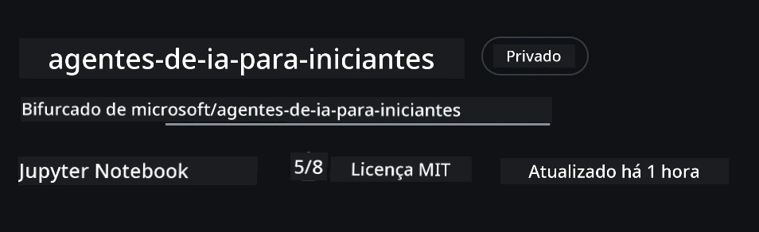
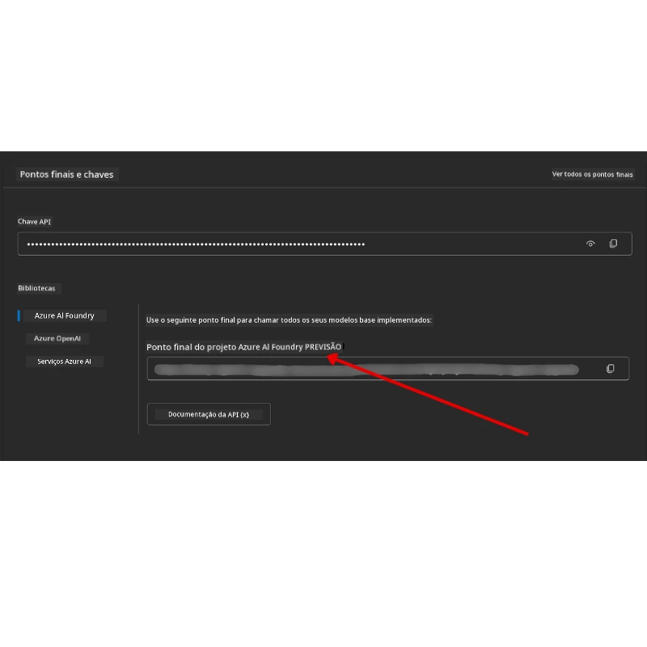

# Configuração do Curso

## Introdução

Esta lição cobrirá como executar os exemplos de código deste curso.

## Junte-se a Outros Estudantes e Obtenha Ajuda

Antes de começar a clonar o seu repositório, junte-se ao [canal Discord AI Agents For Beginners](https://aka.ms/ai-agents/discord) para obter ajuda com a configuração, esclarecer dúvidas sobre o curso ou conectar-se com outros estudantes.

## Clone ou Faça Fork deste Repositório

Para começar, por favor clone ou faça o fork do Repositório GitHub. Isto criará a sua própria versão do material do curso para que possa executar, testar e ajustar o código!

Isto pode ser feito clicando no link para <a href="https://github.com/microsoft/ai-agents-for-beginners/fork" target="_blank">fazer o fork do repositório</a>

Agora deverá ter a sua própria versão forkada deste curso no seguinte link:



### Clone Raso (recomendado para workshop / Codespaces)

  > O repositório completo pode ser grande (~3 GB) quando descarrega todo o histórico e todos os ficheiros. Se só vai participar no workshop ou só precisa de algumas pastas das lições, um clone raso (ou clone esparso) descarrega muito menos.

#### Clone raso rápido — histórico mínimo, todos os ficheiros

Substitua `<your-username>` nos comandos abaixo pela sua URL de fork (ou a URL upstream se preferir).

Para clonar apenas o histórico do último commit (download pequeno):

```bash
git clone --depth 1 https://github.com/<your-username>/ai-agents-for-beginners.git
```

Para clonar um ramo específico:

```bash
git clone --depth 1 --branch <branch-name> https://github.com/<your-username>/ai-agents-for-beginners.git
```

#### Clone Parcial (esparso) — blobs mínimos + apenas pastas selecionadas

Isto usa clone parcial e sparse-checkout (requer Git 2.25+ e Git moderno com suporte a clone parcial recomendado):

```bash
git clone --depth 1 --filter=blob:none --sparse https://github.com/<your-username>/ai-agents-for-beginners.git
```

Entre na pasta do repositório:

```bash
cd ai-agents-for-beginners
```

Depois especifique quais as pastas que quer (exemplo abaixo mostra duas pastas):

```bash
git sparse-checkout set 00-course-setup 01-intro-to-ai-agents
```

Após clonar e verificar os ficheiros, se só precisar dos ficheiros e quiser libertar espaço (sem histórico git), por favor apague os metadados do repositório (💀 irreversível — vai perder toda a funcionalidade Git):

```bash
# zsh/bash
rm -rf .git
```

```powershell
# PowerShell
Remove-Item -Recurse -Force .git
```

#### Usar GitHub Codespaces (recomendado para evitar downloads grandes locais)

- Crie um novo Codespace para este repositório via a [interface GitHub](https://github.com/codespaces).  

- No terminal do codespace recém-criado, execute um dos comandos de clone raso/esparso acima para trazer apenas as pastas das lições necessárias para o workspace do Codespace.
- Opcional: após clonar dentro do Codespaces, remova o .git para recuperar espaço extra (veja comandos de remoção acima).
- Nota: Se preferir abrir o repositório diretamente no Codespaces (sem clone extra), tenha em conta que o Codespaces vai construir o ambiente devcontainer e pode ainda assim provisionar mais do que precisa.

#### Dicas

- Substitua sempre a URL de clone pelo seu fork se quiser editar/fazer commits.
- Se mais tarde precisar de mais histórico ou ficheiros, pode buscá-los ou ajustar o sparse-checkout para incluir pastas adicionais.

## Executar o Código

Este curso oferece uma série de Jupyter Notebooks que pode executar para obter experiência prática a construir Agentes de IA.

Os exemplos de código usam **Microsoft Agent Framework (MAF)** com o `FoundryChatClient`, que se conecta ao **Microsoft Foundry Agent Service V2** (a API Responses) através do **Microsoft Foundry**.

Todos os notebooks Python estão etiquetados `*-python-agent-framework.ipynb`.

## Requisitos

- Python 3.12+
  - **NOTA**: Se não tiver Python3.12 instalado, certifique-se de o instalar. Depois crie o seu venv usando python3.12 para garantir que as versões corretas estão instaladas a partir do ficheiro requirements.txt.
  
    >Exemplo

    Crie a diretoria do ambiente virtual Python:

    ```bash
    python -m venv venv
    ```

    Depois ative o ambiente venv para:

    ```bash
    # zsh/bash
    source venv/bin/activate
    ```
  
    ```dos
    # Command Prompt for Windows
    venv\Scripts\activate
    ```

- .NET 10+: Para os exemplos de código que usam .NET, certifique-se de que instala o [.NET 10 SDK](https://dotnet.microsoft.com/download/dotnet/10.0) ou posterior. Depois, verifique a versão do SDK .NET instalada:

    ```bash
    dotnet --list-sdks
    ```

- **Azure CLI** — Necessário para autenticação. Instale a partir de [aka.ms/installazurecli](https://aka.ms/installazurecli).
- **Assinatura Azure** — Para acesso ao Microsoft Foundry e Microsoft Foundry Agent Service.
- **Projeto Microsoft Foundry** — Um projeto com um modelo implantado (ex: `gpt-5-mini`). Veja [Passo 1](#passo-1-criar-um-projeto-no-microsoft-foundry) abaixo.

Incluímos um ficheiro `requirements.txt` na raiz deste repositório que contém todos os pacotes Python necessários para executar os exemplos de código.

Pode instalá-los executando o seguinte comando no terminal na raiz do repositório:

```bash
pip install -r requirements.txt
```

Recomendamos criar um ambiente virtual Python para evitar conflitos e problemas.

## Configurar VSCode

Certifique-se de que está a usar a versão correta do Python no VSCode.


## Configurar Microsoft Foundry e Microsoft Foundry Agent Service

### Passo 1: Criar um Projeto no Microsoft Foundry

Precisa de um **hub** e **projeto** no Microsoft Foundry com um modelo implantado para executar os notebooks.

1. Vá para [ai.azure.com](https://ai.azure.com) e faça login com a sua conta Azure.
2. Crie um **hub** (ou use um existente). Veja: [Visão geral dos recursos Hub](https://learn.microsoft.com/azure/ai-foundry/concepts/ai-resources).
3. Dentro do hub, crie um **projeto**.
4. Implemente um modelo (ex: `gpt-5-mini`) em **Models + Endpoints** → **Deploy model**.

### Passo 2: Obter o Endpoint do Projeto e o Nome da Implantação do Modelo

No seu projeto no portal Microsoft Foundry:

- **Endpoint do Projeto** — Vá à página **Overview** e copie a URL do endpoint.



- **Nome da Implantação do Modelo** — Vá a **Models + Endpoints**, selecione o seu modelo implantado e anote o **Deployment name** (ex: `gpt-5-mini`).

### Passo 3: Iniciar Sessão no Azure com `az login`

A maioria dos notebooks autentica através do seu **login Azure CLI** — usando `AzureCliCredential` ou `DefaultAzureCredential` (ambos utilizam a sua sessão `az login`) do pacote `azure-identity` — portanto não requerem chaves API. Algumas lições e integrações opcionais usam chaves API; verifique os pré-requisitos de cada lição para quaisquer variáveis de ambiente adicionais. Isto requer que esteja autenticado via Azure CLI.

1. **Instale a Azure CLI** se ainda não o fez: [aka.ms/installazurecli](https://aka.ms/installazurecli)

2. **Inicie sessão** executando:

    ```bash
    az login
    ```

    Ou se estiver num ambiente remoto/Codespace sem browser:

    ```bash
    az login --use-device-code
    ```

3. **Selecione a sua subscrição** se for solicitado — escolha aquela que contém o seu projeto Foundry.

4. **Verifique** que está autenticado:

    ```bash
    az account show
    ```

> **Porquê `az login`?** Os notebooks autenticam usando `AzureCliCredential` (ou `DefaultAzureCredential`, que também usa o seu login Azure CLI) do pacote `azure-identity`. Isto significa que a sua sessão Azure CLI fornece as credenciais — sem chaves API ou segredos no seu ficheiro `.env`. Esta é uma [boa prática de segurança](https://learn.microsoft.com/azure/developer/ai/keyless-connections).

### Passo 4: Criar o seu ficheiro `.env`

Copie o ficheiro exemplo:

```bash
# zsh/bash
cp .env.example .env
```

```powershell
# PowerShell
Copy-Item .env.example .env
```

Abra o `.env` e preencha estes dois valores:

```env
AZURE_AI_PROJECT_ENDPOINT=https://<your-project>.services.ai.azure.com/api/projects/<your-project-id>
AZURE_AI_MODEL_DEPLOYMENT_NAME=gpt-5-mini
```

| Variável | Onde encontrar |
|----------|-----------------|
| `AZURE_AI_PROJECT_ENDPOINT` | Portal Foundry → seu projeto → página **Overview** |
| `AZURE_AI_MODEL_DEPLOYMENT_NAME` | Portal Foundry → **Models + Endpoints** → nome do seu modelo implantado |

Está tudo para a maior parte das lições! Os notebooks irão autenticar automaticamente através da sua sessão `az login`.

### Passo 5: Instalar Dependências Python

```bash
pip install -r requirements.txt
```

Recomendamos executar isto dentro do ambiente virtual que criou anteriormente.

## Configuração Opcional: Azure AI Search (Lições 5 e 16)

Os notebooks da Lição 5 (Agentic RAG) e Lição 16 funcionam imediatamente com uma **base de conhecimento em memória** — não são necessários recursos Azure adicionais. Se quiser suportá-los com um índice real do **Azure AI Search**, note que o **notebook da Lição 16 usa atualmente autenticação baseada em chave**: ele muda da pesquisa em memória para Azure AI Search apenas quando **ambos** `AZURE_SEARCH_SERVICE_ENDPOINT` **e** `AZURE_SEARCH_API_KEY` estão definidos; caso contrário, mantém a pesquisa em memória — para usá-lo com um índice real deve definir também a chave admin. A autenticação sem chave com Microsoft Entra ID (RBAC) é a abordagem recomendada para o seu código de produção, consistente com o fluxo `az login` usado no resto deste curso.

Os passos RBAC abaixo aplicam-se aos exemplos do guia de configuração e ao seu próprio código. Não ativam a autenticação sem chaves no notebook da Lição 16; esta ainda requer ambos endpoint e chave admin para usar o Azure AI Search.

1. **Ative o acesso baseado em roles** no seu serviço de pesquisa:

    ```bash
    az search service update --name <service-name> --resource-group <resource-group> --auth-options aadOrApiKey
    ```

2. **Atribua-se os roles necessários** (criar/carregar índices e consultar):

    ```bash
    az role assignment create --assignee <your-user-or-principal-id> --role "Search Service Contributor" --scope $(az search service show -g <resource-group> -n <service-name> --query id -o tsv)
    az role assignment create --assignee <your-user-or-principal-id> --role "Search Index Data Contributor" --scope $(az search service show -g <resource-group> -n <service-name> --query id -o tsv)
    ```

3. **Adicione o endpoint** ao seu ficheiro `.env`:

| Variável | Onde encontrar |
|----------|-----------------|
| `AZURE_SEARCH_SERVICE_ENDPOINT` | Portal Azure → seu recurso **Azure AI Search** → **Visão geral** → URL |
| `AZURE_SEARCH_API_KEY` | Obrigatório (com o endpoint) para ativar Azure AI Search no notebook da Lição 16, que usa autenticação baseada em chave. Portal Azure → **Configurações** → **Chaves** → chave principal de administrador |

> **Porquê sem chave?** As chaves admin concedem acesso total à escrita no seu serviço de pesquisa e podem vazar via ficheiros `.env`. Com RBAC, usa-se a sua identidade `az login` — o mesmo padrão sem chave do Entra ID usado nos notebooks do curso (via `AzureCliCredential` / `DefaultAzureCredential`). Veja [Conectar ao Azure AI Search usando roles](https://learn.microsoft.com/azure/search/search-security-rbac).

Veja o [guia de configuração Azure AI Search](./AzureSearch.md) para exemplos completos de criação de índices em Python e .NET.

## Configuração Adicional para Lições que Chamam Azure OpenAI Diretamente (Lições 6 e 8)

Alguns notebooks nas lições 6 e 8 chamam **Azure OpenAI** diretamente (usando a **Responses API**) em vez de passar por um projeto Microsoft Foundry. Estes exemplos usavam anteriormente GitHub Models, que está descontinuado e não suporta a Responses API. Adicione estas variáveis ao seu ficheiro `.env`:

| Variável | Onde encontrar |
|----------|-----------------|
| `AZURE_OPENAI_ENDPOINT` | Portal Azure → seu recurso **Azure OpenAI** → **Chaves e Endpoint** → Endpoint (ex: `https://<your-resource>.openai.azure.com`) |
| `AZURE_OPENAI_DEPLOYMENT` | Nome do seu modelo implantado (ex: `gpt-5-mini`) que suporta a Responses API |
| `AZURE_OPENAI_API_KEY` | Opcional — só se usar autenticação baseada em chave em vez de `az login` / Entra ID |

> A Responses API usa o endpoint estável `/openai/v1/`, por isso não é necessário `api-version`. Inicie sessão com `az login` para usar autenticação sem chave via Entra ID.

## Fornecedor Alternativo: MiniMax (Compatível com OpenAI)

[MiniMax](https://platform.minimaxi.com/) fornece modelos de contexto grande (até 204K tokens) através de uma API compatível com OpenAI. Como o `OpenAIChatClient` do Microsoft Agent Framework funciona com qualquer endpoint compatível com OpenAI, pode usar o MiniMax como alternativa direta para lições que usam `OpenAIChatClient`.

Adicione estas variáveis ao seu ficheiro `.env`:

| Variável | Onde encontrar |
|----------|-----------------|
| `MINIMAX_API_KEY` | [Plataforma MiniMax](https://platform.minimaxi.com/) → Chaves API |
| `MINIMAX_BASE_URL` | Use `https://api.minimax.io/v1` (valor padrão) |
| `MINIMAX_MODEL_ID` | Nome do modelo a usar (ex: `MiniMax-M3`) |

**Modelos exemplo**: `MiniMax-M3` (recomendado), `MiniMax-M2.7`, `MiniMax-M2.7-highspeed` (respostas mais rápidas). Nomes e disponibilidade dos modelos podem mudar ao longo do tempo, e o acesso a um dado modelo pode depender da sua conta.

Os exemplos de código que usam `OpenAIChatClient` (ex: fluxo de reserva de hotel da Lição 14) detetam e usam automaticamente a sua configuração MiniMax quando `MINIMAX_API_KEY` está definido.


## Provedor Alternativo: Foundry Local (Executar Modelos no Dispositivo)

[Foundry Local](https://foundrylocal.ai) é um runtime leve que descarrega, gere e serve modelos de linguagem **inteiramente na sua própria máquina** através de uma API compatível com OpenAI — sem necessidade de cloud.

Como o `OpenAIChatClient` do Microsoft Agent Framework funciona com qualquer endpoint compatível com OpenAI, o Foundry Local é uma alternativa local pronta a usar ao Azure OpenAI.

**1. Instalar o Foundry Local**

```bash
# Windows
winget install Microsoft.FoundryLocal

# macOS
brew install foundrylocal
```

**2. Descarregar e executar um modelo** (isto também inicia o serviço local):

```bash
foundry model list          # ver modelos disponíveis
foundry model run phi-4-mini
```

**3. Instalar o SDK Python** usado para descobrir o endpoint local:

```bash
pip install foundry-local-sdk
```

**4. Apontar o Microsoft Agent Framework para o seu modelo local:**

```python
from foundry_local import FoundryLocalManager
from agent_framework.openai import OpenAIChatClient

# Transfere (se necessário) e serve o modelo localmente, depois descobre o endpoint/porta.
manager = FoundryLocalManager("phi-4-mini")

chat_client = OpenAIChatClient(
    base_url=manager.endpoint,      # por exemplo http://localhost:<port>/v1
    api_key=manager.api_key,        # sempre "não-requerido" para Foundry Local
    model_id=manager.get_model_info("phi-4-mini").id,
)

agent = chat_client.as_agent(
    name="LocalAgent",
    instructions="You are a helpful assistant running fully on-device.",
)
```

> **Nota:** O Foundry Local expõe um endpoint de **Chat Completions** compatível com OpenAI. Use-o para desenvolvimento local e cenários offline. Para o conjunto completo de funcionalidades da **Responses API** (conversas com estado, etc.), utilize o Azure OpenAI ou um projeto Microsoft Foundry.

## Configuração Adicional para a Aula 8 (Fluxo de Trabalho Bing Grounding)

O notebook de fluxo condicional da aula 8 usa **Bing grounding** via Microsoft Foundry. Se planeia executar esse exemplo, adicione esta variável ao seu ficheiro `.env`:

| Variável | Onde encontrá-la |
|----------|-----------------|
| `BING_CONNECTION_ID` | Portal Microsoft Foundry → o seu projeto → **Gestão** → **Recursos ligados** → a sua ligação Bing → copiar o ID da ligação |

## Resolução de Problemas

### Erros de Verificação do Certificado SSL no macOS

Se estiver no macOS e encontrar um erro como:

```plaintext
ssl.SSLCertVerificationError: [SSL: CERTIFICATE_VERIFY_FAILED] certificate verify failed: self-signed certificate in certificate chain
```

Este é um problema conhecido com Python no macOS onde os certificados SSL do sistema não são automaticamente confiáveis. Tente as seguintes soluções por ordem:

**Opção 1: Executar o script Install Certificates do Python (recomendado)**

```bash
# Substitua 3.XX pela sua versão de Python instalada (por exemplo, 3.12 ou 3.13):
/Applications/Python\ 3.XX/Install\ Certificates.command
```

**Opção 2: Usar `connection_verify=False` no seu notebook (apenas para notebooks de Modelos GitHub)**

No notebook da Aula 6 (`06-building-trustworthy-agents/code_samples/06-system-message-framework.ipynb`), está já incluída uma solução alternativa comentada. Descomente `connection_verify=False` quando encontrar erros de certificado:

```python
client = ChatCompletionsClient(
    endpoint=endpoint,
    credential=AzureKeyCredential(token),
    connection_verify=False,  # Desativar a verificação SSL se encontrar erros de certificado
)
```

> **⚠️ Aviso:** Desativar a verificação SSL (`connection_verify=False`) reduz a segurança ao ignorar a validação do certificado. Use isto apenas como uma solução temporária em ambientes de desenvolvimento. Nunca use em produção.

**Opção 3: Instalar e usar `truststore`**

```bash
pip install truststore
```

Depois adicione o seguinte no topo do seu notebook ou script antes de fazer chamadas de rede:

```python
import truststore
truststore.inject_into_ssl()
```

## Preso em Algum Lugar?

Se tiver algum problema a executar esta configuração, junte-se ao nosso <a href="https://discord.gg/kzRShWzttr" target="_blank">Discord da Comunidade Azure AI</a> ou <a href="https://github.com/microsoft/ai-agents-for-beginners/issues?WT.mc_id=academic-105485-koreyst" target="_blank">crie uma questão</a>.

## Próxima Aula

Está agora pronto para executar o código deste curso. Boas aprendizagens sobre o mundo dos Agentes de IA! 

[Introdução aos Agentes de IA e Casos de Utilização de Agentes](../01-intro-to-ai-agents/README.md)

---

<!-- CO-OP TRANSLATOR DISCLAIMER START -->
**Aviso Legal**:
Este documento foi traduzido utilizando o serviço de tradução automática [Co-op Translator](https://github.com/Azure/co-op-translator). Embora nos esforcemos pela precisão, esteja ciente de que traduções automáticas podem conter erros ou imprecisões. O documento original na sua língua nativa deve ser considerado a fonte autorizada. Para informações críticas, recomenda-se tradução profissional humana. Não nos responsabilizamos por quaisquer mal-entendidos ou interpretações incorretas resultantes da utilização desta tradução.
<!-- CO-OP TRANSLATOR DISCLAIMER END -->