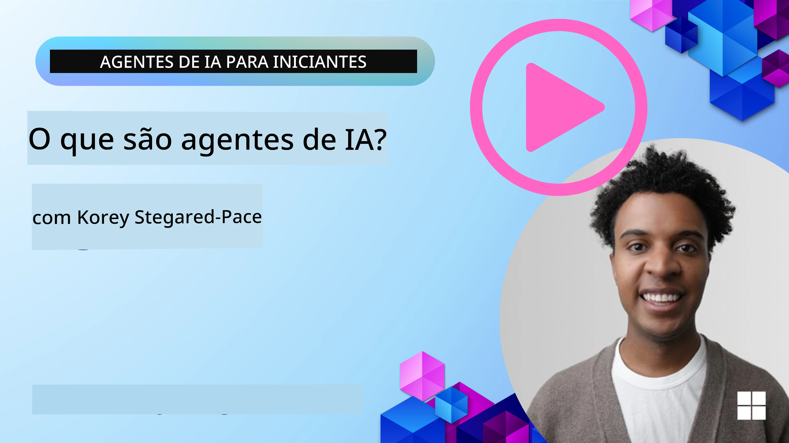
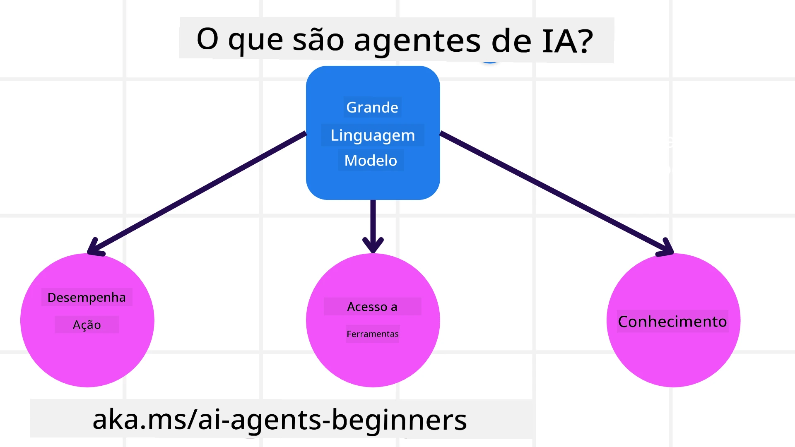
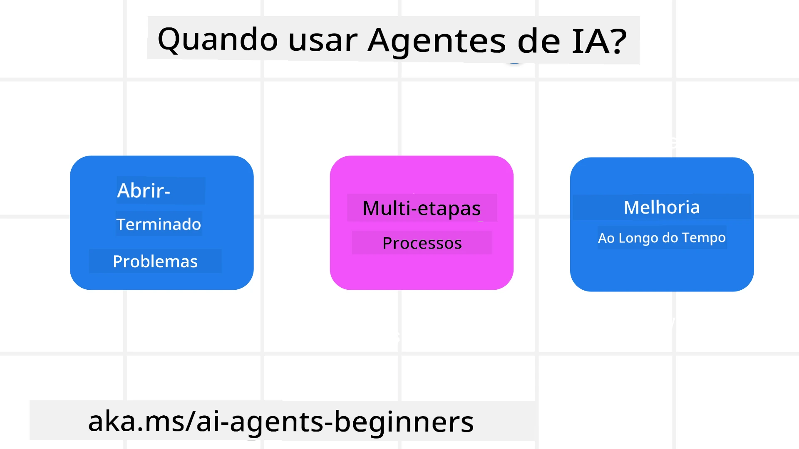

> _(Clique na imagem acima para ver o vídeo desta lição)_

# Introdução aos Agentes de IA e Casos de Uso de Agentes

Bem-vindo ao curso "Agentes de IA para Iniciantes"! Este curso fornece conhecimentos fundamentais e exemplos práticos para construir Agentes de IA.

Junte-se à <a href="https://discord.gg/kzRShWzttr" target="_blank">Comunidade Azure AI no Discord</a> para conhecer outros aprendizes e construtores de Agentes de IA e colocar quaisquer questões que tenha sobre este curso.

Para começar este curso, começamos por entender melhor o que são Agentes de IA e como podemos usá-los nas aplicações e fluxos de trabalho que construímos.

## Introdução

Esta lição cobre:

- O que são Agentes de IA e quais os diferentes tipos de agentes?
- Quais os casos de uso mais indicados para Agentes de IA e como podem ajudar-nos?
- Quais os blocos básicos ao desenhar Soluções Agentes?

## Objetivos de Aprendizagem
Após completar esta lição, deverá ser capaz de:

- Compreender os conceitos de Agentes de IA e como diferem de outras soluções de IA.
- Aplicar Agentes de IA da forma mais eficiente.
- Desenhar soluções Agentes produtivamente para utilizadores e clientes.

## Definição de Agentes de IA e Tipos de Agentes de IA

### O que são Agentes de IA?

Agentes de IA são **sistemas** que permitem que **Modelos de Linguagem Extensa (LLMs)** **realizem ações** ao expandir suas capacidades, dando aos LLMs **acesso a ferramentas** e **conhecimento**.

Vamos decompor esta definição em partes menores:

- **Sistema** - É importante pensar em agentes não apenas como um único componente, mas como um sistema de muitos componentes. Ao nível básico, os componentes de um Agente de IA são:
  - **Ambiente** - O espaço definido onde o Agente de IA está a operar. Por exemplo, se tivermos um agente de reserva de viagens, o ambiente pode ser o sistema de reservas de viagens que o agente usa para completar tarefas.
  - **Sensores** - Os ambientes têm informação e fornecem feedback. Os Agentes de IA usam sensores para recolher e interpretar esta informação sobre o estado atual do ambiente. No exemplo do agente de reservas, o sistema de reservas pode fornecer informações como disponibilidade de hotéis ou preços de voos.
  - **Atuadores** - Uma vez que o Agente de IA recebe o estado atual do ambiente, para a tarefa atual, o agente determina qual ação realizar para alterar o ambiente. Para o agente de reservas, pode ser reservar um quarto disponível para o utilizador.

**Modelos de Linguagem Extensa** - O conceito de agentes existia antes da criação dos LLMs. A vantagem de construir Agentes de IA com LLMs é a sua capacidade de interpretar linguagem humana e dados. Esta capacidade permite que os LLMs interpretem informação ambiental e definam um plano para alterar o ambiente.

**Realizar Ações** - Fora dos sistemas de Agentes de IA, os LLMs estão limitados a situações onde a ação é gerar conteúdo ou informação com base na solicitação do utilizador. Dentro de sistemas de Agentes de IA, os LLMs podem realizar tarefas interpretando o pedido do utilizador e usando ferramentas disponíveis no seu ambiente.

**Acesso a Ferramentas** - As ferramentas a que o LLM tem acesso são definidas por 1) o ambiente onde está a operar e 2) o desenvolvedor do Agente de IA. No exemplo do agente de viagens, as ferramentas do agente são limitadas às operações disponíveis no sistema de reservas, e/ou o desenvolvedor pode limitar o acesso do agente apenas a voos.

**Memória+Conhecimento** - A memória pode ser de curto prazo no contexto da conversa entre o utilizador e o agente. A longo prazo, para além da informação fornecida pelo ambiente, os Agentes de IA podem também recuperar conhecimento de outros sistemas, serviços, ferramentas e até outros agentes. No exemplo do agente de viagens, este conhecimento pode ser a informação sobre as preferências de viagem do utilizador presentes numa base de dados de clientes.

### Os diferentes tipos de agentes

Agora que temos uma definição geral de Agentes de IA, vamos ver alguns tipos específicos de agentes e como seriam aplicados a um agente de reservas de viagens.

| **Tipo de Agente**          | **Descrição**                                                                                                                 | **Exemplo**                                                                                                                       |
| --------------------------- | ------------------------------------------------------------------------------------------------------------------------------ | --------------------------------------------------------------------------------------------------------------------------------- |
| **Agentes Reflexos Simples** | Realizam ações imediatas baseadas em regras pré-definidas.                                                                      | O agente de viagens interpreta o contexto do email e reencaminha reclamações de viagem para o serviço ao cliente.                |
| **Agentes Reflexos Baseados em Modelo** | Realizam ações baseando-se num modelo do mundo e nas mudanças desse modelo.                                                | O agente de viagens prioriza rotas com alterações de preço significativas com base em acesso a dados históricos de preços.        |
| **Agentes Baseados em Objetivos** | Criam planos para alcançar objetivos específicos interpretando o objetivo e determinando ações para o atingir.                 | O agente de viagens reserva uma viagem determinando os arranjos necessários (carro, transportes públicos, voos) do local atual para o destino. |
| **Agentes Baseados em Utilidade** | Consideram preferências e ponderam compensações numericamente para determinar como alcançar os objetivos.                      | O agente de viagens maximiza a utilidade ponderando conveniência versus custo ao reservar a viagem.                                |
| **Agentes Aprendizes**       | Melhoram com o tempo respondendo a feedback e ajustando ações consequentemente.                                                 | O agente de viagens melhora usando feedback dos clientes de inquéritos pós-viagem para ajustar reservas futuras.                 |
| **Agentes Hierárquicos**    | Apresentam múltiplos agentes num sistema estratificado, com agentes de nível superior dividindo tarefas em subtarefas para agentes de nível inferior completarem. | O agente de viagens cancela uma viagem dividindo a tarefa em subtarefas (ex: cancelar reservas específicas) e deixando agentes de nível inferior completá-las, reportando ao agente de nível superior. |
| **Sistemas Multi-Agentes (MAS)** | Agentes completam tarefas independentemente, cooperativa ou competitivamente.                                                  | Cooperativo: Múltiplos agentes reservam serviços específicos como hotéis, voos e entretenimento. Competitivo: Múltiplos agentes gerem e competem sobre um calendário partilhado de reservas de hotéis para alojar clientes. |

## Quando Usar Agentes de IA

Na secção anterior, usamos o caso do agente de viagens para explicar como os diferentes tipos de agentes podem ser usados em diversos cenários de reserva de viagens. Continuaremos a usar esta aplicação ao longo do curso.

Vamos ver os tipos de casos de uso para os quais os Agentes de IA são mais indicados:

- **Problemas de Solução Aberta** - permitindo que o LLM determine os passos necessários para completar uma tarefa porque nem sempre é possível codificar tudo num fluxo de trabalho.
- **Processos Multi-etapa** - tarefas que requerem um nível de complexidade em que o Agente de IA precisa usar ferramentas ou informações por múltiplas interações em vez de uma única recuperação.  
- **Melhoria ao Longo do Tempo** - tarefas onde o agente pode melhorar com o tempo ao receber feedback do ambiente ou dos utilizadores para fornecer melhor utilidade.

Abordamos mais considerações sobre o uso de Agentes de IA na lição Construir Agentes de IA Fiáveis.

## Noções Básicas das Soluções Agentes

### Desenvolvimento de Agentes

O primeiro passo no desenho de um sistema Agente de IA é definir as ferramentas, ações e comportamentos. Neste curso, focamo-nos no uso do **Azure AI Agent Service** para definir os nossos Agentes. Este oferece funcionalidades como:

- Selecção de Modelos Abertos como OpenAI, Mistral e Llama
- Uso de Dados Licenciados através de fornecedores como o Tripadvisor
- Uso de ferramentas OpenAPI 3.0 padronizadas

### Padrões Agentes

A comunicação com os LLMs é feita através de prompts. Dada a natureza semi-autónoma dos Agentes de IA, nem sempre é possível ou necessário solicitar manualmente ao LLM após uma mudança no ambiente. Usamos **Padrões Agentes** que nos permitem direcionar o LLM por múltiplas etapas de uma forma mais escalável.

Este curso está dividido em alguns dos padrões Agentes mais populares atualmente.

### Frameworks Agentes

Os Frameworks Agentes permitem aos desenvolvedores implementar padrões agentes através de código. Estes frameworks oferecem templates, plugins e ferramentas para melhor colaboração dos Agentes de IA. Estes benefícios fornecem capacidades para melhor observabilidade e resolução de problemas dos sistemas de Agentes de IA.

Neste curso, exploraremos o Microsoft Agent Framework (MAF) para construir agentes de IA prontos para produção.

## Códigos Exemplares

- Python: [Agent Framework](./code_samples/01-python-agent-framework.ipynb)
- .NET: [Agent Framework](./code_samples/01-dotnet-agent-framework.md)

## Tem Mais Perguntas sobre Agentes de IA?

Junte-se ao [Microsoft Foundry Discord](https://aka.ms/ai-agents/discord) para encontrar outros aprendizes, participar em sessões de horas de atendimento e esclarecer as suas dúvidas sobre Agentes de IA.

## Lição Anterior

[Configuração do Curso](../00-course-setup/README.md)

## Próxima Lição

[Explorando Frameworks Agentes](../02-explore-agentic-frameworks/README.md)

---

<!-- CO-OP TRANSLATOR DISCLAIMER START -->
**Aviso Legal**:
Este documento foi traduzido utilizando o serviço de tradução automática [Co-op Translator](https://github.com/Azure/co-op-translator). Embora nos esforcemos pela precisão, por favor tenha em conta que traduções automáticas podem conter erros ou imprecisões. O documento original na sua língua nativa deverá ser considerado a fonte autorizada. Para informações críticas, recomenda-se a tradução profissional feita por humanos. Não nos responsabilizamos por quaisquer mal-entendidos ou interpretações incorretas decorrentes da utilização desta tradução.
<!-- CO-OP TRANSLATOR DISCLAIMER END -->