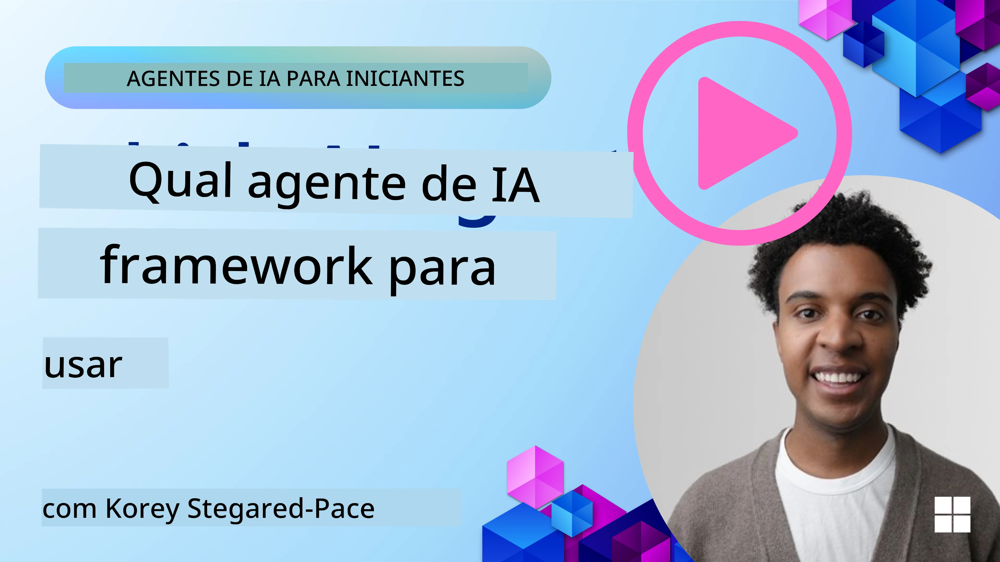

[](https://youtu.be/ODwF-EZo_O8?si=1xoy_B9RNQfrYdF7)

> _(Clique na imagem acima para ver o vídeo desta lição)_

# Explorar Frameworks de Agentes de IA

Frameworks de agentes de IA são plataformas de software desenhadas para simplificar a criação, implementação e gestão de agentes de IA. Estes frameworks fornecem aos desenvolvedores componentes pré-construídos, abstrações e ferramentas que agilizam o desenvolvimento de sistemas de IA complexos.

Estes frameworks ajudam os desenvolvedores a focar nos aspetos únicos das suas aplicações, fornecendo abordagens normalizadas para desafios comuns no desenvolvimento de agentes de IA. Potenciam a escalabilidade, acessibilidade e eficiência na construção de sistemas de IA.

## Introdução 

Esta lição irá abordar:

- O que são Frameworks de Agentes de IA e o que permitem aos desenvolvedores alcançar?
- Como podem as equipas usar estes para prototipar rapidamente, iterar e melhorar as capacidades dos seus agentes?
- Quais são as diferenças entre os frameworks e ferramentas criados pela Microsoft (<a href="https://aka.ms/ai-agents-beginners/ai-agent-service" target="_blank">Azure AI Agent Service</a> e o <a href="https://learn.microsoft.com/azure/ai-services/openai/how-to/responses" target="_blank">Microsoft Agent Framework</a>)?
- Posso integrar diretamente as ferramentas do meu ecossistema Azure existentes, ou preciso de soluções autónomas?
- O que é o Azure AI Agents service e como isto me está a ajudar?

## Objetivos de aprendizagem

Os objetivos desta lição são ajudar-te a entender:

- O papel dos Frameworks de Agentes de IA no desenvolvimento de IA.
- Como tirar partido dos Frameworks de Agentes de IA para construir agentes inteligentes.
- Capacidades chave habilitadas pelos Frameworks de Agentes de IA.
- As diferenças entre o Microsoft Agent Framework e o Azure AI Agent Service.

## O que são Frameworks de Agentes de IA e o que permitem aos desenvolvedores fazer?

Frameworks tradicionais de IA podem ajudar-te a integrar IA nas tuas apps e melhorar estas apps das seguintes formas:

- **Personalização**: A IA pode analisar o comportamento e preferências dos utilizadores para fornecer recomendações, conteúdo e experiências personalizadas.  
Exemplo: Serviços de streaming como a Netflix usam IA para sugerir filmes e séries com base no histórico de visualização, aumentando o envolvimento e satisfação dos utilizadores.  
- **Automação e Eficiência**: A IA pode automatizar tarefas repetitivas, otimizar fluxos de trabalho e melhorar a eficiência operacional.  
Exemplo: Aplicações de serviço ao cliente usam chatbots alimentados por IA para tratar de dúvidas comuns, reduzindo tempos de resposta e libertando agentes humanos para questões mais complexas.  
- **Melhoria da Experiência do Utilizador**: A IA pode aprimorar a experiência geral do utilizador ao oferecer funcionalidades inteligentes como reconhecimento de voz, processamento de linguagem natural e texto preditivo.  
Exemplo: Assistentes virtuais como Siri e Google Assistant usam IA para compreender e responder a comandos de voz, facilitando a interação dos utilizadores com os seus dispositivos.

### Isso tudo parece ótimo, certo? Então por que precisamos do Framework de Agentes de IA?

Frameworks de Agentes de IA representam algo mais do que simplesmente frameworks de IA. São desenhados para permitir a criação de agentes inteligentes que podem interagir com utilizadores, outros agentes e o ambiente para alcançar objetivos específicos. Estes agentes podem exibir comportamento autónomo, tomar decisões e adaptar-se a condições em mudança. Vamos ver algumas capacidades chave habilitadas pelos Frameworks de Agentes de IA:

- **Colaboração e Coordenação entre Agentes**: Permitem a criação de múltiplos agentes de IA que podem trabalhar juntos, comunicar e coordenar para resolver tarefas complexas.
- **Automação e Gestão de Tarefas**: Fornecem mecanismos para automatizar fluxos de trabalho multi-etapas, delegação de tarefas e gestão dinâmica de tarefas entre agentes.
- **Compreensão Contextual e Adaptação**: Equipam agentes com a capacidade de entender o contexto, adaptar-se a ambientes em mudança e tomar decisões baseadas em informações em tempo real.

Em suma, os agentes permitem fazer mais, elevar a automação a um próximo nível, criar sistemas mais inteligentes que podem adaptar-se e aprender com o seu ambiente.

## Como prototipar rapidamente, iterar e melhorar as capacidades do agente?

Este é um panorama em rápida mudança, mas há alguns elementos comuns na maioria dos Frameworks de Agentes de IA que podem ajudar-te a prototipar e iterar rapidamente, nomeadamente componentes modulares, ferramentas colaborativas e aprendizagem em tempo real. Vamos explorar estes:

- **Usar Componentes Modulares**: SDKs de IA oferecem componentes pré-construídos como conectores de IA e de memória, chamadas a funções usando linguagem natural ou plugins de código, templates de prompts e mais.
- **Aproveitar Ferramentas Colaborativas**: Desenhar agentes com papéis e tarefas específicas, permitindo-lhes testar e refinar fluxos de trabalho colaborativos.
- **Aprender em Tempo Real**: Implementar ciclos de feedback onde os agentes aprendem com as interações e ajustam o seu comportamento dinamicamente.

### Usar Componentes Modulares

SDKs como o Microsoft Agent Framework oferecem componentes pré-construídos como conectores de IA, definições de ferramentas e gestão de agentes.

**Como as equipas podem usar estes**: As equipas podem montar rapidamente estes componentes para criar um protótipo funcional sem começar do zero, permitindo experimentação e iteração rápida.

**Como funciona na prática**: Podes usar um parser pré-construído para extrair informações da entrada do utilizador, um módulo de memória para armazenar e recuperar dados, e um gerador de prompts para interagir com os utilizadores, tudo sem ter que construir estes componentes do zero.

**Código de exemplo**. Vejamos um exemplo de como usar o Microsoft Agent Framework com `AzureAIProjectAgentProvider` para que o modelo responda a entrada do utilizador com chamadas a ferramentas:

``` python
# Exemplo em Python do Microsoft Agent Framework

import asyncio
import os
from typing import Annotated

from agent_framework.azure import AzureAIProjectAgentProvider
from azure.identity import AzureCliCredential


# Define uma função de ferramenta de exemplo para reservar viagens
def book_flight(date: str, location: str) -> str:
    """Book travel given location and date."""
    return f"Travel was booked to {location} on {date}"


async def main():
    provider = AzureAIProjectAgentProvider(credential=AzureCliCredential())
    agent = await provider.create_agent(
        name="travel_agent",
        instructions="Help the user book travel. Use the book_flight tool when ready.",
        tools=[book_flight],
    )

    response = await agent.run("I'd like to go to New York on January 1, 2025")
    print(response)
    # Exemplo de saída: O seu voo para Nova Iorque no dia 1 de janeiro de 2025 foi reservado com sucesso. Boa viagem! ✈️🗽


if __name__ == "__main__":
    asyncio.run(main())
```
  
O que podes ver neste exemplo é como podes aproveitar um parser pré-construído para extrair informações chave da entrada do utilizador, como a origem, destino e data de uma solicitação de reserva de voo. Esta abordagem modular permite que te concentres na lógica de alto nível.

### Aproveitar Ferramentas Colaborativas

Frameworks como o Microsoft Agent Framework facilitam a criação de múltiplos agentes que podem trabalhar conjuntamente.

**Como as equipas podem usar estas**: As equipas podem desenhar agentes com papéis e tarefas específicas, permitindo testar e refinar fluxos colaborativos e melhorar a eficiência do sistema global.

**Como funciona na prática**: Podes criar uma equipa de agentes onde cada agente tem uma função especializada, como recuperação de dados, análise ou tomada de decisão. Estes agentes podem comunicar-se e partilhar informação para alcançar um objetivo comum, como responder a uma pergunta do utilizador ou completar uma tarefa.

**Código de exemplo (Microsoft Agent Framework)**:

```python
# Criar vários agentes que trabalham em conjunto utilizando o Microsoft Agent Framework

import os
from agent_framework.azure import AzureAIProjectAgentProvider
from azure.identity import AzureCliCredential

provider = AzureAIProjectAgentProvider(credential=AzureCliCredential())

# Agente de Recuperação de Dados
agent_retrieve = await provider.create_agent(
    name="dataretrieval",
    instructions="Retrieve relevant data using available tools.",
    tools=[retrieve_tool],
)

# Agente de Análise de Dados
agent_analyze = await provider.create_agent(
    name="dataanalysis",
    instructions="Analyze the retrieved data and provide insights.",
    tools=[analyze_tool],
)

# Executar agentes em sequência numa tarefa
retrieval_result = await agent_retrieve.run("Retrieve sales data for Q4")
analysis_result = await agent_analyze.run(f"Analyze this data: {retrieval_result}")
print(analysis_result)
```
  
O que podes ver no código anterior é como criar uma tarefa que envolve múltiplos agentes a trabalhar juntos para analisar dados. Cada agente executa uma função específica, e a tarefa é executada coordenando os agentes para alcançar o resultado desejado. Ao criar agentes dedicados com papéis especializados, podes melhorar a eficiência e desempenho da tarefa.

### Aprender em Tempo Real

Frameworks avançados fornecem capacidades para compreensão de contexto e adaptação em tempo real.

**Como as equipas podem usar estas**: As equipas podem implementar ciclos de feedback onde os agentes aprendem com as interações e ajustam o seu comportamento dinamicamente, conduzindo a melhorias e refinamentos contínuos das capacidades.

**Como funciona na prática**: Os agentes podem analisar feedback do utilizador, dados ambientais e resultados de tarefas para atualizar a sua base de conhecimento, ajustar algoritmos de decisão e melhorar o desempenho ao longo do tempo. Este processo iterativo de aprendizagem permite que os agentes se adaptem a condições em mudança e preferências dos utilizadores, aumentando a eficácia global do sistema.

## Quais as diferenças entre o Microsoft Agent Framework e o Azure AI Agent Service?

Há várias maneiras de comparar estas abordagens, mas vamos ver algumas diferenças chave em termos de design, capacidades e casos de uso alvo:

## Microsoft Agent Framework (MAF)

O Microsoft Agent Framework fornece um SDK simplificado para construir agentes de IA usando `AzureAIProjectAgentProvider`. Permite aos desenvolvedores criar agentes que usam modelos Azure OpenAI com chamadas a ferramentas integradas, gestão de conversação e segurança ao nível empresarial através da identidade Azure.

**Casos de Uso**: Construção de agentes de IA prontos para produção com uso de ferramentas, fluxos de trabalho multi-etapas e cenários de integração empresarial.

Aqui estão alguns conceitos fundamentais importantes do Microsoft Agent Framework:

- **Agentes**. Um agente é criado via `AzureAIProjectAgentProvider` e configurado com um nome, instruções e ferramentas. O agente pode:  
  - **Processar mensagens do utilizador** e gerar respostas usando modelos Azure OpenAI.  
  - **Chamar ferramentas** automaticamente com base no contexto da conversa.  
  - **Manter o estado da conversa** através de múltiplas interações.

  Aqui está um trecho de código mostrando como criar um agente:

    ```python
    import os
    from agent_framework.azure import AzureAIProjectAgentProvider
    from azure.identity import AzureCliCredential

    provider = AzureAIProjectAgentProvider(credential=AzureCliCredential())
    agent = await provider.create_agent(
        name="my_agent",
        instructions="You are a helpful assistant.",
    )

    response = await agent.run("Hello, World!")
    print(response)
    ```
  
- **Ferramentas**. O framework suporta definir ferramentas como funções Python que o agente pode invocar automaticamente. As ferramentas são registadas na criação do agente:

    ```python
    def get_weather(location: str) -> str:
        """Get the current weather for a location."""
        return f"The weather in {location} is sunny, 72\u00b0F."

    agent = await provider.create_agent(
        name="weather_agent",
        instructions="Help users check the weather.",
        tools=[get_weather],
    )
    ```
  
- **Coordenação Multi-Agente**. Podes criar vários agentes com diferentes especializações e coordenar o seu trabalho:

    ```python
    planner = await provider.create_agent(
        name="planner",
        instructions="Break down complex tasks into steps.",
    )

    executor = await provider.create_agent(
        name="executor",
        instructions="Execute the planned steps using available tools.",
        tools=[execute_tool],
    )

    plan = await planner.run("Plan a trip to Paris")
    result = await executor.run(f"Execute this plan: {plan}")
    ```
  
- **Integração com Identidade Azure**. O framework usa `AzureCliCredential` (ou `DefaultAzureCredential`) para autenticação segura e sem chaves, eliminando a necessidade de gerir diretamente chaves de API.

## Azure AI Agent Service

O Azure AI Agent Service é uma adição mais recente, apresentada na Microsoft Ignite 2024. Permite o desenvolvimento e implementação de agentes de IA com modelos mais flexíveis, como chamadas diretas a LLMs open-source como Llama 3, Mistral e Cohere.

O Azure AI Agent Service oferece mecanismos reforçados de segurança empresarial e métodos de armazenamento de dados, tornando-o adequado para aplicações empresariais.

Funciona "out-of-the-box" com o Microsoft Agent Framework para construir e implementar agentes.

Este serviço está atualmente em Preview Público e suporta Python e C# para construir agentes.

Usando o SDK Python do Azure AI Agent Service, podemos criar um agente com uma ferramenta definida pelo utilizador:

```python
import asyncio
from azure.identity import DefaultAzureCredential
from azure.ai.projects import AIProjectClient

# Definir funções auxiliares
def get_specials() -> str:
    """Provides a list of specials from the menu."""
    return """
    Special Soup: Clam Chowder
    Special Salad: Cobb Salad
    Special Drink: Chai Tea
    """

def get_item_price(menu_item: str) -> str:
    """Provides the price of the requested menu item."""
    return "$9.99"


async def main() -> None:
    credential = DefaultAzureCredential()
    project_client = AIProjectClient.from_connection_string(
        credential=credential,
        conn_str="your-connection-string",
    )

    agent = project_client.agents.create_agent(
        model="gpt-4o-mini",
        name="Host",
        instructions="Answer questions about the menu.",
        tools=[get_specials, get_item_price],
    )

    thread = project_client.agents.create_thread()

    user_inputs = [
        "Hello",
        "What is the special soup?",
        "How much does that cost?",
        "Thank you",
    ]

    for user_input in user_inputs:
        print(f"# User: '{user_input}'")
        message = project_client.agents.create_message(
            thread_id=thread.id,
            role="user",
            content=user_input,
        )
        run = project_client.agents.create_and_process_run(
            thread_id=thread.id, agent_id=agent.id
        )
        messages = project_client.agents.list_messages(thread_id=thread.id)
        print(f"# Agent: {messages.data[0].content[0].text.value}")


if __name__ == "__main__":
    asyncio.run(main())
```
  
### Conceitos chave

O Azure AI Agent Service tem os seguintes conceitos chave:

- **Agente**. O Azure AI Agent Service integra-se com o Microsoft Foundry. No AI Foundry, um Agente de IA atua como um microserviço "inteligente" que pode ser usado para responder perguntas (RAG), realizar ações, ou automatizar completamente fluxos de trabalho. Alcança isto combinando o poder dos modelos generativos de IA com ferramentas que lhe permitem aceder e interagir com fontes de dados do mundo real. Aqui está um exemplo de um agente:

    ```python
    agent = project_client.agents.create_agent(
        model="gpt-4o-mini",
        name="my-agent",
        instructions="You are helpful agent",
        tools=code_interpreter.definitions,
        tool_resources=code_interpreter.resources,
    )
    ```
  
 Neste exemplo, um agente é criado com o modelo `gpt-4o-mini`, nome `my-agent` e instruções `You are helpful agent`. O agente está equipado com ferramentas e recursos para executar tarefas de interpretação de código.

- **Thread e mensagens**. O thread é outro conceito importante. Representa uma conversa ou interação entre um agente e um utilizador. Threads podem ser usados para acompanhar o progresso de uma conversa, armazenar informação de contexto e gerir o estado da interação. Aqui está um exemplo de um thread:

    ```python
    thread = project_client.agents.create_thread()
    message = project_client.agents.create_message(
        thread_id=thread.id,
        role="user",
        content="Could you please create a bar chart for the operating profit using the following data and provide the file to me? Company A: $1.2 million, Company B: $2.5 million, Company C: $3.0 million, Company D: $1.8 million",
    )
    
    # Ask the agent to perform work on the thread
    run = project_client.agents.create_and_process_run(thread_id=thread.id, agent_id=agent.id)
    
    # Fetch and log all messages to see the agent's response
    messages = project_client.agents.list_messages(thread_id=thread.id)
    print(f"Messages: {messages}")
    ```
  
 No código anterior, um thread é criado. Em seguida, é enviada uma mensagem para o thread. Ao chamar `create_and_process_run`, o agente é solicitado a realizar trabalho no thread. Finalmente, as mensagens são recuperadas e registadas para ver a resposta do agente. As mensagens indicam o progresso da conversa entre o utilizador e o agente. É também importante compreender que as mensagens podem ser de diferentes tipos como texto, imagem ou ficheiro, ou seja, o trabalho dos agentes pode ter resultado, por exemplo, numa imagem ou numa resposta de texto. Como desenvolvedor, podes então usar esta informação para processar ainda mais a resposta ou apresentá-la ao utilizador.

- **Integração com o Microsoft Agent Framework**. O Azure AI Agent Service funciona perfeitamente com o Microsoft Agent Framework, o que significa que podes construir agentes usando `AzureAIProjectAgentProvider` e implementá-los através do Agent Service para cenários de produção.

**Casos de Uso**: O Azure AI Agent Service é desenhado para aplicações empresariais que requerem implementação segura, escalável e flexível de agentes de IA.

## Qual a diferença entre estas abordagens?

Parece haver alguma sobreposição, mas há diferenças chave em termos de design, capacidades e casos de uso alvo:

- **Microsoft Agent Framework (MAF)**: É um SDK pronto para a produção para construir agentes de IA. Fornece uma API simplificada para criar agentes com chamadas a ferramentas, gestão de conversação e integração com identidade Azure.  
- **Azure AI Agent Service**: É uma plataforma e serviço de implementação no Azure Foundry para agentes. Oferece conectividade integrada a serviços como Azure OpenAI, Azure AI Search, Bing Search e execução de código.

Ainda não tens certeza qual escolher?

### Casos de Uso

Vamos ver se te podemos ajudar percorrendo alguns casos comuns:

> Q: Estou a construir aplicações de agentes de IA para produção e quero começar rapidamente  
>  
> A: O Microsoft Agent Framework é uma ótima escolha. Fornece uma API simples e Pythonica via `AzureAIProjectAgentProvider` que te permite definir agentes com ferramentas e instruções em apenas algumas linhas de código.

> Q: Preciso de implementação ao nível empresarial com integrações Azure como Search e execução de código  
>  
> A: O Azure AI Agent Service é a melhor opção. É um serviço de plataforma que oferece capacidades incorporadas para múltiplos modelos, Azure AI Search, Bing Search e Azure Functions. Facilita construir os teus agentes no Foundry Portal e implementá-los em escala.

> Q: Ainda estou confuso, dá-me só uma opção  
>  
> A: Começa com o Microsoft Agent Framework para construir os teus agentes, e depois usa o Azure AI Agent Service quando precisares de implementar e escalar em produção. Esta abordagem permite iterar rapidamente na lógica do agente enquanto tens um caminho claro para implementação empresarial.

Vamos resumir as diferenças chave numa tabela:

| Framework | Foco | Conceitos Principais | Casos de Uso |
| --- | --- | --- | --- |
| Microsoft Agent Framework | SDK simplificado para agentes com chamadas a ferramentas | Agentes, Ferramentas, Identidade Azure | Construir agentes de IA, uso de ferramentas, fluxos de trabalho multi-etapas |
| Azure AI Agent Service | Modelos flexíveis, segurança empresarial, geração de código, chamadas a ferramentas | Modularidade, Colaboração, Orquestração de Processos | Implementação segura, escalável e flexível de agentes de IA |

## Posso integrar diretamente as ferramentas do meu ecossistema Azure existentes, ou preciso de soluções autónomas?
A resposta é sim, pode integrar as suas ferramentas existentes do ecossistema Azure diretamente com o Azure AI Agent Service especialmente, pois foi concebido para funcionar de forma integrada com outros serviços Azure. Poderia, por exemplo, integrar o Bing, Azure AI Search e Azure Functions. Existe também uma integração profunda com o Microsoft Foundry.

O Microsoft Agent Framework também integra com os serviços Azure através do `AzureAIProjectAgentProvider` e da identidade Azure, permitindo-lhe chamar serviços Azure diretamente a partir das suas ferramentas de agente.

## Sample Codes

- Python: [Agent Framework](./code_samples/02-python-agent-framework.ipynb)
- .NET: [Agent Framework](./code_samples/02-dotnet-agent-framework.md)

## Got More Questions about AI Agent Frameworks?

Join the [Microsoft Foundry Discord](https://aka.ms/ai-agents/discord) to meet with other learners, attend office hours and get your AI Agents questions answered.

## References

- <a href="https://techcommunity.microsoft.com/blog/azure-ai-services-blog/introducing-azure-ai-agent-service/4298357" target="_blank">Azure Agent Service</a>
- <a href="https://learn.microsoft.com/azure/ai-services/openai/how-to/responses" target="_blank">Microsoft Agent Framework - Azure OpenAI Responses</a>
- <a href="https://learn.microsoft.com/azure/ai-services/agents/overview" target="_blank">Azure AI Agent service</a>

## Previous Lesson

[Introduction to AI Agents and Agent Use Cases](../01-intro-to-ai-agents/README.md)

## Next Lesson

[Understanding Agentic Design Patterns](../03-agentic-design-patterns/README.md)

---

<!-- CO-OP TRANSLATOR DISCLAIMER START -->
**Aviso legal**:
Este documento foi traduzido utilizando o serviço de tradução automática [Co-op Translator](https://github.com/Azure/co-op-translator). Embora nos esforcemos por garantir a precisão, por favor tenha em conta que traduções automáticas podem conter erros ou imprecisões. O documento original na sua língua nativa deve ser considerado a fonte autoritária. Para informações críticas, recomenda-se a tradução profissional feita por humanos. Não nos responsabilizamos por quaisquer mal-entendidos ou interpretações incorretas decorrentes do uso desta tradução.
<!-- CO-OP TRANSLATOR DISCLAIMER END -->