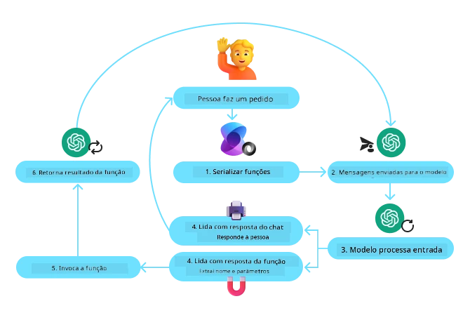
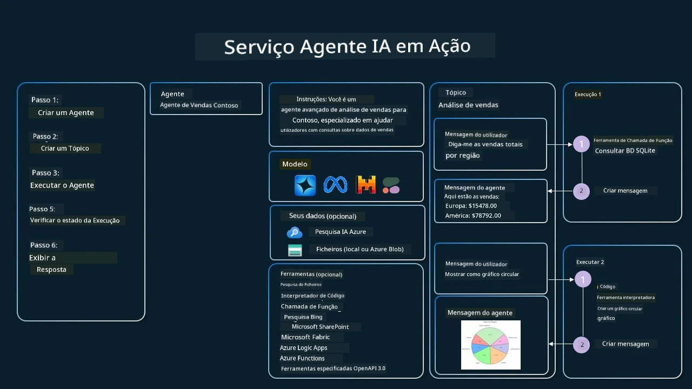

[](https://youtu.be/vieRiPRx-gI?si=cEZ8ApnT6Sus9rhn)

> _(Clique na imagem acima para ver o vídeo desta lição)_

# Padrão de Utilização de Ferramentas

As ferramentas são interessantes porque permitem que os agentes de IA tenham um leque mais amplo de capacidades. Em vez de o agente ter um conjunto limitado de ações que pode executar, ao adicionar uma ferramenta, o agente pode agora executar uma grande variedade de ações. Neste capítulo, iremos analisar o Padrão de Utilização de Ferramentas, que descreve como os agentes de IA podem usar ferramentas específicas para atingir os seus objetivos.

## Introdução

Nesta lição, procuramos responder às seguintes perguntas:

- O que é o padrão de utilização de ferramentas?
- Em que casos de uso pode ser aplicado?
- Quais são os elementos/blocos de construção necessários para implementar o padrão de design?
- Quais são as considerações especiais ao usar o Padrão de Utilização de Ferramentas para construir agentes de IA dignos de confiança?

## Objetivos de Aprendizagem

Após concluir esta lição, será capaz de:

- Definir o Padrão de Utilização de Ferramentas e o seu propósito.
- Identificar casos de uso em que o Padrão de Utilização de Ferramentas é aplicável.
- Compreender os elementos-chave necessários para implementar o padrão de design.
- Reconhecer considerações para garantir a confiança em agentes de IA que utilizam este padrão de design.

## O que é o Padrão de Utilização de Ferramentas?

O **Padrão de Utilização de Ferramentas** foca-se em dar aos LLMs a capacidade de interagir com ferramentas externas para atingir objetivos específicos. Ferramentas são código que pode ser executado por um agente para realizar ações. Uma ferramenta pode ser uma função simples, como uma calculadora, ou uma chamada de API para um serviço externo, como consulta de preços de ações ou previsão meteorológica. No contexto dos agentes de IA, as ferramentas são projetadas para serem executadas pelos agentes em resposta a **chamadas de função geradas pelo modelo**.

## Em que casos de uso pode ser aplicado?

Os Agentes de IA podem aproveitar ferramentas para completar tarefas complexas, recuperar informação ou tomar decisões. O padrão de utilização de ferramentas é frequentemente usado em cenários que exigem interação dinâmica com sistemas externos, como bases de dados, serviços web ou interpretadores de código. Esta capacidade é útil para vários casos de uso, incluindo:

- **Recuperação Dinâmica de Informação:** Os agentes podem consultar APIs externas ou bases de dados para obter dados atualizados (por exemplo, consultar uma base de dados SQLite para análise de dados, obter preços de ações ou informações meteorológicas).
- **Execução e Interpretação de Código:** Os agentes podem executar código ou scripts para resolver problemas matemáticos, gerar relatórios ou realizar simulações.
- **Automação de Workflows:** Automatizar fluxos de trabalho repetitivos ou com múltiplas etapas ao integrar ferramentas como agendadores de tarefas, serviços de email ou pipelines de dados.
- **Apoio ao Cliente:** Os agentes podem interagir com sistemas CRM, plataformas de tickets ou bases de conhecimento para resolver questões dos utilizadores.
- **Geração e Edição de Conteúdo:** Os agentes podem recorrer a ferramentas como verificadores gramaticais, geradores de sumários de texto ou avaliadores de segurança de conteúdo para ajudar nas tarefas de criação de conteúdo.

## Quais são os elementos/blocos de construção necessários para implementar o padrão de utilização de ferramentas?

Estes blocos de construção permitem que o agente de IA execute uma vasta gama de tarefas. Vejamos os elementos-chave necessários para implementar o Padrão de Utilização de Ferramentas:

- **Esquemas de Função/Ferramenta**: Definições detalhadas das ferramentas disponíveis, incluindo nome da função, propósito, parâmetros necessários e outputs esperados. Estes esquemas permitem ao LLM compreender quais ferramentas estão disponíveis e como construir pedidos válidos.

- **Lógica de Execução de Funções**: Governa como e quando as ferramentas são invocadas com base na intenção do utilizador e no contexto da conversa. Isto pode incluir módulos de planeamento, mecanismos de encaminhamento ou fluxos condicionais que determinam a utilização de ferramentas dinamicamente.

- **Sistema de Gestão de Mensagens**: Componentes que gerem o fluxo conversacional entre entradas do utilizador, respostas do LLM, chamadas de ferramenta e outputs das ferramentas.

- **Framework de Integração de Ferramentas**: Infraestrutura que liga o agente a várias ferramentas, quer sejam funções simples ou serviços externos complexos.

- **Tratamento de Erros & Validação**: Mecanismos para lidar com falhas na execução de ferramentas, validar parâmetros e gerir respostas inesperadas.

- **Gestão de Estado**: Acompanha o contexto da conversa, interações anteriores com ferramentas e dados persistentes para garantir consistência em interações multi-turno.

A seguir, vamos analisar a Chamada de Funções/Ferramentas com mais detalhe.
 
### Chamada de Funções/Ferramentas

A chamada de funções é a principal forma de permitir que os Modelos de Linguagem de Grande Escala (LLMs) interajam com ferramentas. Verá frequentemente 'Função' e 'Ferramenta' usados de forma intercambiável porque 'funções' (blocos de código reutilizável) são as 'ferramentas' que os agentes usam para executar tarefas. Para que o código de uma função seja invocado, um LLM deve comparar o pedido do utilizador com a descrição das funções. Para isso, um esquema contendo as descrições de todas as funções disponíveis é enviado ao LLM. O LLM seleciona então a função mais adequada para a tarefa e devolve o seu nome e argumentos. A função selecionada é invocada, a sua resposta é enviada de volta ao LLM, que usa a informação para responder ao pedido do utilizador.

Para que os desenvolvedores implementem a chamada de funções para agentes, será necessário:

1. Um modelo LLM que suporte chamadas de função
2. Um esquema contendo descrições das funções
3. O código para cada função descrita

Usemos o exemplo de obter a hora atual numa cidade para ilustrar:

1. **Inicializar um LLM que suporte chamadas de função:**

    Nem todos os modelos suportam chamadas de função, pelo que é importante verificar se o LLM que está a utilizar o faz.     <a href="https://learn.microsoft.com/azure/ai-services/openai/how-to/function-calling" target="_blank">Azure OpenAI</a> suporta chamadas de função. Podemos começar por iniciar o cliente Azure OpenAI. 

    ```python
    # Inicializar o cliente do Azure OpenAI
    client = AzureOpenAI(
        azure_endpoint = os.getenv("AZURE_AI_PROJECT_ENDPOINT"), 
        api_key=os.getenv("AZURE_OPENAI_API_KEY"),  
        api_version="2024-05-01-preview"
    )
    ```

1. **Criar um Esquema de Função**:

    De seguida iremos definir um esquema JSON que contém o nome da função, a descrição do que a função faz, e os nomes e descrições dos parâmetros da função.
    Depois iremos pegar neste esquema e passá-lo ao cliente criado anteriormente, juntamente com o pedido do utilizador para encontrar a hora em San Francisco. O importante a notar é que uma **chamada de ferramenta** é o que é devolvido, **não** a resposta final à pergunta. Como mencionado anteriormente, o LLM devolve o nome da função que selecionou para a tarefa, e os argumentos que serão passados para ela.

    ```python
    # Descrição da função para o modelo ler
    tools = [
        {
            "type": "function",
            "function": {
                "name": "get_current_time",
                "description": "Get the current time in a given location",
                "parameters": {
                    "type": "object",
                    "properties": {
                        "location": {
                            "type": "string",
                            "description": "The city name, e.g. San Francisco",
                        },
                    },
                    "required": ["location"],
                },
            }
        }
    ]
    ```
   
    ```python
  
    # Mensagem inicial do utilizador
    messages = [{"role": "user", "content": "What's the current time in San Francisco"}] 
  
    # Primeira chamada da API: Peça ao modelo para usar a função
      response = client.chat.completions.create(
          model=deployment_name,
          messages=messages,
          tools=tools,
          tool_choice="auto",
      )
  
      # Processar a resposta do modelo
      response_message = response.choices[0].message
      messages.append(response_message)
  
      print("Model's response:")  

      print(response_message)
  
    ```

    ```bash
    Model's response:
    ChatCompletionMessage(content=None, role='assistant', function_call=None, tool_calls=[ChatCompletionMessageToolCall(id='call_pOsKdUlqvdyttYB67MOj434b', function=Function(arguments='{"location":"San Francisco"}', name='get_current_time'), type='function')])
    ```
  
1. **O código da função necessário para realizar a tarefa:**

    Agora que o LLM escolheu qual a função que precisa ser executada, o código que realiza a tarefa precisa de ser implementado e executado.
    Podemos implementar o código para obter a hora atual em Python. Também precisaremos de escrever o código para extrair o nome e os argumentos da response_message para obter o resultado final.

    ```python
      def get_current_time(location):
        """Get the current time for a given location"""
        print(f"get_current_time called with location: {location}")  
        location_lower = location.lower()
        
        for key, timezone in TIMEZONE_DATA.items():
            if key in location_lower:
                print(f"Timezone found for {key}")  
                current_time = datetime.now(ZoneInfo(timezone)).strftime("%I:%M %p")
                return json.dumps({
                    "location": location,
                    "current_time": current_time
                })
      
        print(f"No timezone data found for {location_lower}")  
        return json.dumps({"location": location, "current_time": "unknown"})
    ```

     ```python
     # Lidar com chamadas de função
      if response_message.tool_calls:
          for tool_call in response_message.tool_calls:
              if tool_call.function.name == "get_current_time":
     
                  function_args = json.loads(tool_call.function.arguments)
     
                  time_response = get_current_time(
                      location=function_args.get("location")
                  )
     
                  messages.append({
                      "tool_call_id": tool_call.id,
                      "role": "tool",
                      "name": "get_current_time",
                      "content": time_response,
                  })
      else:
          print("No tool calls were made by the model.")  
  
      # Segunda chamada à API: Obter a resposta final do modelo
      final_response = client.chat.completions.create(
          model=deployment_name,
          messages=messages,
      )
  
      return final_response.choices[0].message.content
     ```

     ```bash
      get_current_time called with location: San Francisco
      Timezone found for san francisco
      The current time in San Francisco is 09:24 AM.
     ```

A chamada de funções está no centro de grande parte, senão de todo o desenho de utilização de ferramentas para agentes; no entanto, implementá-la do zero pode por vezes ser desafiante.
Como aprendemos em [Lesson 2](../../../02-explore-agentic-frameworks) agentic frameworks fornecem-nos blocos de construção pré-construídos para implementar a utilização de ferramentas.
 
## Exemplos de Utilização de Ferramentas com Frameworks Agentic

Aqui estão alguns exemplos de como pode implementar o Padrão de Utilização de Ferramentas usando diferentes frameworks agentic:

### Microsoft Agent Framework

<a href="https://learn.microsoft.com/azure/ai-services/agents/overview" target="_blank">Microsoft Agent Framework</a> é um framework de IA open-source para construir agentes de IA. Simplifica o processo de utilização de chamadas de função ao permitir que defina ferramentas como funções Python com o decorator `@tool`. O framework trata da comunicação bidirecional entre o modelo e o seu código. Também fornece acesso a ferramentas pré-construídas como File Search e Code Interpreter através do `AzureAIProjectAgentProvider`.

O diagrama seguinte ilustra o processo de chamada de funções com o Microsoft Agent Framework:



No Microsoft Agent Framework, as ferramentas são definidas como funções decoradas. Podemos converter a função `get_current_time` que vimos anteriormente numa ferramenta usando o decorator `@tool`. O framework irá serializar automaticamente a função e os seus parâmetros, criando o esquema a enviar ao LLM.

```python
from agent_framework import tool
from agent_framework.azure import AzureAIProjectAgentProvider
from azure.identity import AzureCliCredential

@tool
def get_current_time(location: str) -> str:
    """Get the current time for a given location"""
    ...

# Criar o cliente
provider = AzureAIProjectAgentProvider(credential=AzureCliCredential())

# Criar um agente e executá-lo com a ferramenta
agent = await provider.create_agent(name="TimeAgent", instructions="Use available tools to answer questions.", tools=get_current_time)
response = await agent.run("What time is it?")
```
  
### Azure AI Agent Service

<a href="https://learn.microsoft.com/azure/ai-services/agents/overview" target="_blank">Azure AI Agent Service</a> é um framework agentic mais recente que foi concebido para capacitar os desenvolvedores a construir, implementar e escalar agentes de IA de alta qualidade e extensíveis de forma segura, sem necessidade de gerir os recursos subjacentes de computação e armazenamento. É particularmente útil para aplicações empresariais, uma vez que é um serviço totalmente gerido com segurança de nível empresarial.

Comparado com o desenvolvimento direto com a API LLM, o Azure AI Agent Service proporciona algumas vantagens, incluindo:

- Chamada de ferramentas automática – não é necessário analisar uma chamada de ferramenta, invocar a ferramenta e tratar a resposta; tudo isto é agora feito no lado do servidor
- Dados geridos de forma segura – em vez de gerir o seu próprio estado de conversa, pode confiar nas threads para armazenar toda a informação de que necessita
- Ferramentas prontas a usar – Ferramentas que pode utilizar para interagir com as suas fontes de dados, como Bing, Azure AI Search e Azure Functions.

As ferramentas disponíveis no Azure AI Agent Service podem ser divididas em duas categorias:

1. Ferramentas de Conhecimento:
    - <a href="https://learn.microsoft.com/azure/ai-services/agents/how-to/tools/bing-grounding?tabs=python&pivots=overview" target="_blank">Grounding with Bing Search</a>
    - <a href="https://learn.microsoft.com/azure/ai-services/agents/how-to/tools/file-search?tabs=python&pivots=overview" target="_blank">File Search</a>
    - <a href="https://learn.microsoft.com/azure/ai-services/agents/how-to/tools/azure-ai-search?tabs=azurecli%2Cpython&pivots=overview-azure-ai-search" target="_blank">Azure AI Search</a>

2. Ferramentas de Ação:
    - <a href="https://learn.microsoft.com/azure/ai-services/agents/how-to/tools/function-calling?tabs=python&pivots=overview" target="_blank">Function Calling</a>
    - <a href="https://learn.microsoft.com/azure/ai-services/agents/how-to/tools/code-interpreter?tabs=python&pivots=overview" target="_blank">Code Interpreter</a>
    - <a href="https://learn.microsoft.com/azure/ai-services/agents/how-to/tools/openapi-spec?tabs=python&pivots=overview" target="_blank">OpenAPI defined tools</a>
    - <a href="https://learn.microsoft.com/azure/ai-services/agents/how-to/tools/azure-functions?pivots=overview" target="_blank">Azure Functions</a>

O Agent Service permite-nos usar estas ferramentas em conjunto como um `toolset`. Utiliza também `threads` que mantêm o histórico de mensagens de uma determinada conversa.

Imagine que é um agente de vendas numa empresa chamada Contoso. Pretende desenvolver um agente conversacional que possa responder a questões sobre os seus dados de vendas.

A imagem seguinte ilustra como poderia usar o Azure AI Agent Service para analisar os seus dados de vendas:



Para usar qualquer uma destas ferramentas com o serviço podemos criar um cliente e definir uma ferramenta ou um conjunto de ferramentas. Para implementar isto na prática podemos usar o seguinte código Python. O LLM será capaz de olhar para o toolset e decidir se utiliza a função criada pelo utilizador, `fetch_sales_data_using_sqlite_query`, ou o Code Interpreter pré-construído, dependendo do pedido do utilizador.

```python 
import os
from azure.ai.projects import AIProjectClient
from azure.identity import DefaultAzureCredential
from fetch_sales_data_functions import fetch_sales_data_using_sqlite_query # função fetch_sales_data_using_sqlite_query que pode ser encontrada no ficheiro fetch_sales_data_functions.py.
from azure.ai.projects.models import ToolSet, FunctionTool, CodeInterpreterTool

project_client = AIProjectClient.from_connection_string(
    credential=DefaultAzureCredential(),
    conn_str=os.environ["PROJECT_CONNECTION_STRING"],
)

# Inicializar o conjunto de ferramentas
toolset = ToolSet()

# Inicializar um agente que chama a função fetch_sales_data_using_sqlite_query e adicioná-lo ao conjunto de ferramentas
fetch_data_function = FunctionTool(fetch_sales_data_using_sqlite_query)
toolset.add(fetch_data_function)

# Inicializar a ferramenta Code Interpreter e adicioná-la ao conjunto de ferramentas.
code_interpreter = code_interpreter = CodeInterpreterTool()
toolset.add(code_interpreter)

agent = project_client.agents.create_agent(
    model="gpt-4o-mini", name="my-agent", instructions="You are helpful agent", 
    toolset=toolset
)
```

## Quais são as considerações especiais ao usar o Padrão de Utilização de Ferramentas para construir agentes de IA dignos de confiança?

Uma preocupação comum com SQL gerado dinamicamente por LLMs é a segurança, particularmente o risco de SQL injection ou ações maliciosas, como eliminar ou adulterar a base de dados. Embora estas preocupações sejam válidas, podem ser eficazmente mitigadas ao configurar corretamente as permissões de acesso à base de dados. Para a maioria das bases de dados, isto envolve configurar a base de dados como apenas leitura. Para serviços de base de dados como PostgreSQL ou Azure SQL, a aplicação deve receber um papel apenas de leitura (SELECT).

Executar a aplicação num ambiente seguro aumenta ainda mais a proteção. Em cenários empresariais, os dados são tipicamente extraídos e transformados dos sistemas operacionais para uma base de dados ou data warehouse apenas de leitura com um esquema amigo do utilizador. Esta abordagem garante que os dados estão seguros, otimizados para desempenho e acessibilidade, e que a aplicação tem acesso restrito apenas de leitura.

## Códigos de Exemplo

- Python: [Agent Framework](./code_samples/04-python-agent-framework.ipynb)
- .NET: [Agent Framework](./code_samples/04-dotnet-agent-framework.md)

## Tem Mais Perguntas sobre os Padrões de Utilização de Ferramentas?

Junte-se ao [Microsoft Foundry Discord](https://aka.ms/ai-agents/discord) para encontrar outros aprendizes, participar em horas de atendimento e obter respostas às suas perguntas sobre Agentes de IA.

## Recursos Adicionais

- <a href="https://microsoft.github.io/build-your-first-agent-with-azure-ai-agent-service-workshop/" target="_blank">Azure AI Agents Service Workshop</a>
- <a href="https://github.com/Azure-Samples/contoso-creative-writer/tree/main/docs/workshop" target="_blank">Contoso Creative Writer Multi-Agent Workshop</a>
- <a href="https://learn.microsoft.com/azure/ai-services/agents/overview" target="_blank">Microsoft Agent Framework Overview</a>

## Lição Anterior

[Understanding Agentic Design Patterns](../03-agentic-design-patterns/README.md)

## Próxima Lição
[Agencial RAG](../05-agentic-rag/README.md)

---

<!-- CO-OP TRANSLATOR DISCLAIMER START -->
Aviso:
Este documento foi traduzido utilizando o serviço de tradução automática por IA Co-op Translator (https://github.com/Azure/co-op-translator). Embora nos esforcemos por garantir a exatidão, por favor tenha em atenção que traduções automáticas podem conter erros ou imprecisões. O documento original, na sua língua nativa, deve ser considerado a fonte autoritativa. Para informações críticas, recomenda-se uma tradução profissional realizada por um tradutor humano. Não nos responsabilizamos por quaisquer mal-entendidos ou interpretações incorretas resultantes da utilização desta tradução.
<!-- CO-OP TRANSLATOR DISCLAIMER END -->