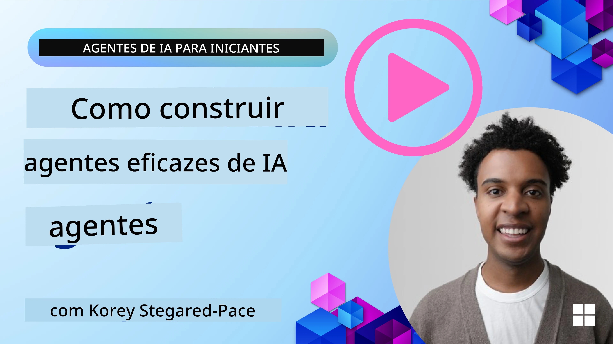
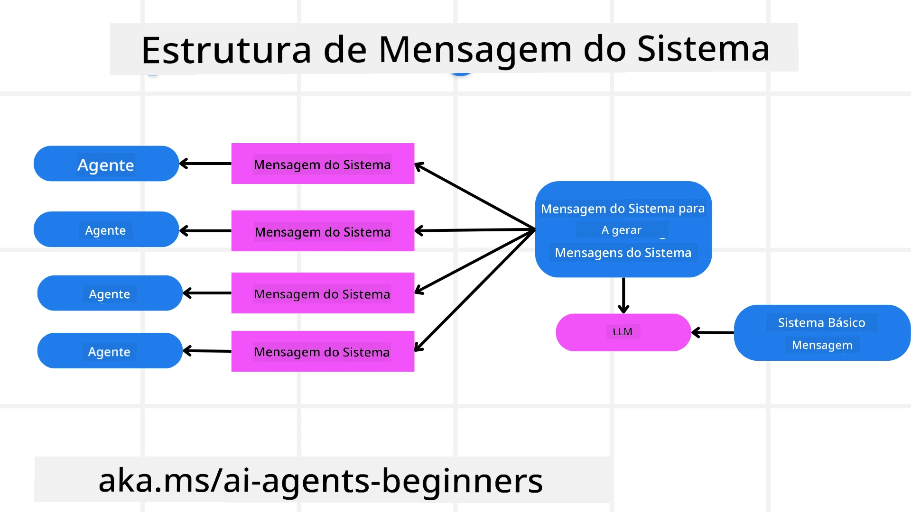
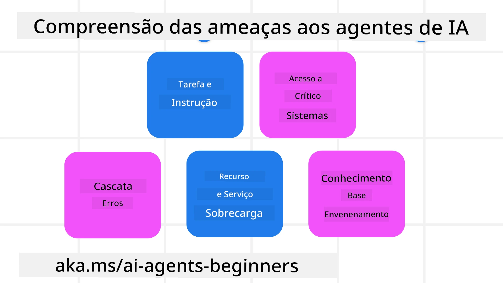
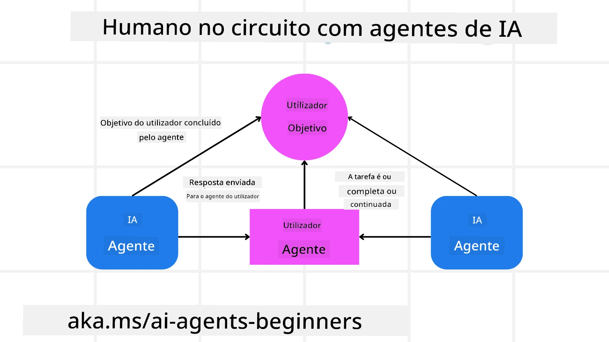

[](https://youtu.be/iZKkMEGBCUQ?si=Q-kEbcyHUMPoHp8L)

> _(Clique na imagem acima para ver o vídeo desta lição)_

# Construção de Agentes de IA Fiáveis

## Introdução

Esta lição abordará:

- Como construir e implementar Agentes de IA seguros e eficazes
- Considerações importantes de segurança ao desenvolver Agentes de IA.
- Como manter a privacidade dos dados e dos utilizadores ao desenvolver Agentes de IA.

## Objetivos de Aprendizagem

Após concluir esta lição, saberá como:

- Identificar e mitigar riscos na criação de Agentes de IA.
- Implementar medidas de segurança para garantir que os dados e o acesso são geridos corretamente.
- Criar Agentes de IA que mantenham a privacidade dos dados e proporcionem uma experiência de utilizador de qualidade.

## Segurança

Vamos primeiro analisar a construção de aplicações agentivas seguras. Segurança significa que o agente de IA funciona conforme projetado. Como construtores de aplicações agentivas, temos métodos e ferramentas para maximizar a segurança:

### Construir um Quadro de Mensagem de Sistema

Se alguma vez construiu uma aplicação de IA usando Modelos de Linguagem Grandes (LLMs), sabe a importância de projetar um prompt de sistema robusto ou mensagem de sistema. Estes prompts estabelecem as regras meta, instruções e diretrizes para como o LLM irá interagir com o utilizador e os dados.

Para Agentes de IA, o prompt de sistema é ainda mais importante, pois os Agentes de IA necessitarão de instruções altamente específicas para completar as tarefas que desenhámos para eles.

Para criar prompts de sistema escaláveis, podemos usar um quadro de mensagem de sistema para construir um ou mais agentes na nossa aplicação:



#### Passo 1: Criar uma Mensagem Meta de Sistema

O prompt meta será usado por um LLM para gerar os prompts de sistema para os agentes que criamos. Desenhamos isto como um modelo para que possamos criar múltiplos agentes de forma eficiente, se necessário.

Aqui está um exemplo de uma mensagem meta de sistema que daríamos ao LLM:

```plaintext
You are an expert at creating AI agent assistants. 
You will be provided a company name, role, responsibilities and other
information that you will use to provide a system prompt for.
To create the system prompt, be descriptive as possible and provide a structure that a system using an LLM can better understand the role and responsibilities of the AI assistant. 
```

#### Passo 2: Criar um prompt básico

O próximo passo é criar um prompt básico para descrever o Agente de IA. Deve incluir o papel do agente, as tarefas que o agente irá concluir e quaisquer outras responsabilidades do agente.

Aqui está um exemplo:

```plaintext
You are a travel agent for Contoso Travel that is great at booking flights for customers. To help customers you can perform the following tasks: lookup available flights, book flights, ask for preferences in seating and times for flights, cancel any previously booked flights and alert customers on any delays or cancellations of flights.  
```

#### Passo 3: Fornecer Mensagem Básica de Sistema ao LLM

Agora podemos otimizar esta mensagem de sistema fornecendo a mensagem meta de sistema como a mensagem de sistema e a nossa mensagem básica de sistema.

Isto irá produzir uma mensagem de sistema melhor desenhada para guiar os nossos agentes de IA:

```markdown
**Company Name:** Contoso Travel  
**Role:** Travel Agent Assistant

**Objective:**  
You are an AI-powered travel agent assistant for Contoso Travel, specializing in booking flights and providing exceptional customer service. Your main goal is to assist customers in finding, booking, and managing their flights, all while ensuring that their preferences and needs are met efficiently.

**Key Responsibilities:**

1. **Flight Lookup:**
    
    - Assist customers in searching for available flights based on their specified destination, dates, and any other relevant preferences.
    - Provide a list of options, including flight times, airlines, layovers, and pricing.
2. **Flight Booking:**
    
    - Facilitate the booking of flights for customers, ensuring that all details are correctly entered into the system.
    - Confirm bookings and provide customers with their itinerary, including confirmation numbers and any other pertinent information.
3. **Customer Preference Inquiry:**
    
    - Actively ask customers for their preferences regarding seating (e.g., aisle, window, extra legroom) and preferred times for flights (e.g., morning, afternoon, evening).
    - Record these preferences for future reference and tailor suggestions accordingly.
4. **Flight Cancellation:**
    
    - Assist customers in canceling previously booked flights if needed, following company policies and procedures.
    - Notify customers of any necessary refunds or additional steps that may be required for cancellations.
5. **Flight Monitoring:**
    
    - Monitor the status of booked flights and alert customers in real-time about any delays, cancellations, or changes to their flight schedule.
    - Provide updates through preferred communication channels (e.g., email, SMS) as needed.

**Tone and Style:**

- Maintain a friendly, professional, and approachable demeanor in all interactions with customers.
- Ensure that all communication is clear, informative, and tailored to the customer's specific needs and inquiries.

**User Interaction Instructions:**

- Respond to customer queries promptly and accurately.
- Use a conversational style while ensuring professionalism.
- Prioritize customer satisfaction by being attentive, empathetic, and proactive in all assistance provided.

**Additional Notes:**

- Stay updated on any changes to airline policies, travel restrictions, and other relevant information that could impact flight bookings and customer experience.
- Use clear and concise language to explain options and processes, avoiding jargon where possible for better customer understanding.

This AI assistant is designed to streamline the flight booking process for customers of Contoso Travel, ensuring that all their travel needs are met efficiently and effectively.

```

#### Passo 4: Iterar e Melhorar

O valor deste quadro de mensagem de sistema é conseguir escalar a criação de mensagens de sistema a partir de múltiplos agentes com mais facilidade, bem como melhorar as suas mensagens de sistema ao longo do tempo. É raro ter uma mensagem de sistema que funcione na primeira vez para o seu uso completo. Poder fazer pequenos ajustes e melhorias alterando a mensagem básica de sistema e executando-a no sistema permitirá comparar e avaliar resultados.

## Compreender Ameaças

Para construir agentes de IA fiáveis, é importante compreender e mitigar os riscos e ameaças ao seu agente de IA. Vejamos apenas algumas das diferentes ameaças aos agentes de IA e como pode planear e preparar-se melhor para elas.



### Tarefa e Instrução

**Descrição:** Os atacantes tentam mudar as instruções ou objetivos do agente de IA através de prompts ou manipulação das entradas.

**Mitigação**: Execute verificações de validação e filtros de entrada para detetar prompts potencialmente perigosos antes de serem processados pelo Agente de IA. Como estes ataques tipicamente requerem interação frequente com o Agente, limitar o número de turnos numa conversa é outra forma de prevenir estes tipos de ataques.

### Acesso a Sistemas Críticos

**Descrição**: Se um agente de IA tem acesso a sistemas e serviços que armazenam dados sensíveis, os atacantes podem comprometer a comunicação entre o agente e esses serviços. Podem ser ataques diretos ou tentativas indiretas de obter informação sobre esses sistemas através do agente.

**Mitigação**: Os agentes de IA devem ter acesso aos sistemas apenas quando necessário para evitar estes tipos de ataques. A comunicação entre o agente e o sistema também deve ser segura. Implementar autenticação e controlo de acesso é outra forma de proteger esta informação.

### Sobrecarga de Recursos e Serviços

**Descrição:** Os agentes de IA podem aceder a diferentes ferramentas e serviços para completar tarefas. Os atacantes podem usar esta capacidade para atacar esses serviços enviando um elevado volume de pedidos através do Agente de IA, o que pode resultar em falhas do sistema ou custos elevados.

**Mitigação:** Implemente políticas para limitar o número de pedidos que um agente de IA pode fazer a um serviço. Limitar o número de turnos de conversa e pedidos ao seu agente de IA é outra forma de prevenir estes tipos de ataques.

### Envenenamento da Base de Conhecimento

**Descrição:** Este tipo de ataque não visa diretamente o agente de IA, mas sim a base de conhecimento e outros serviços que o agente de IA irá usar. Poderá envolver corromper os dados ou informações que o agente de IA usará para completar uma tarefa, levando a respostas tendenciosas ou inesperadas para o utilizador.

**Mitigação:** Realize verificações regulares dos dados que o agente de IA irá usar nos seus fluxos de trabalho. Garanta que o acesso a estes dados é seguro e só pode ser alterado por pessoas de confiança para evitar este tipo de ataque.

### Erros em Cascata

**Descrição:** Os agentes de IA acedem a várias ferramentas e serviços para completar tarefas. Erros causados por atacantes podem levar a falhas de outros sistemas aos quais o agente de IA está ligado, tornando o ataque mais disseminado e mais difícil de solucionar.

**Mitigação**: Um método para evitar isto é fazer com que o Agente de IA opere num ambiente limitado, como executar tarefas numa container Docker, para prevenir ataques diretos ao sistema. Criar mecanismos de reserva e lógica de retentativa quando certos sistemas respondem com erro é outra forma de evitar falhas maiores no sistema.

## Humano no Circuito

Outra forma eficaz de construir sistemas fiáveis de Agentes de IA é usar um Humano no circuito. Isto cria um fluxo onde os utilizadores podem fornecer feedback aos Agentes durante a execução. Os utilizadores atuam essencialmente como agentes num sistema multi-agente, aprovando ou terminando o processo em execução.



Aqui está um excerto de código que usa o Microsoft Agent Framework para mostrar como este conceito é implementado:

```python
import os
from agent_framework.azure import AzureAIProjectAgentProvider
from azure.identity import AzureCliCredential

# Criar o fornecedor com aprovação humana no processo
provider = AzureAIProjectAgentProvider(
    credential=AzureCliCredential(),
)

# Criar o agente com uma etapa de aprovação humana
response = provider.create_response(
    input="Write a 4-line poem about the ocean.",
    instructions="You are a helpful assistant. Ask for user approval before finalizing.",
)

# O utilizador pode rever e aprovar a resposta
print(response.output_text)
user_input = input("Do you approve? (APPROVE/REJECT): ")
if user_input == "APPROVE":
    print("Response approved.")
else:
    print("Response rejected. Revising...")
```

## Conclusão

Construir agentes de IA fiáveis requer um design cuidadoso, medidas de segurança robustas e iteração contínua. Ao implementar sistemas estruturados de meta prompts, compreender as potenciais ameaças e aplicar estratégias de mitigação, os desenvolvedores podem criar agentes de IA que são seguros e eficazes. Adicionalmente, incorporar uma abordagem de humano no circuito assegura que os agentes de IA permanecem alinhados com as necessidades do utilizador enquanto minimiza riscos. À medida que a IA continua a evoluir, manter uma postura proativa em relação à segurança, privacidade e considerações éticas será fundamental para fomentar confiança e fiabilidade em sistemas impulsionados por IA.

## Exemplos de Código

- [`code_samples/06-system-message-framework.ipynb`](code_samples/06-system-message-framework.ipynb): Demonstração passo a passo do quadro de meta-prompt mensagem de sistema.
- [`code_samples/06-human-in-the-loop.ipynb`](code_samples/06-human-in-the-loop.ipynb): Sistemas de aprovação pré-ação, categorização de risco e registo de auditoria para agentes fiáveis.

### Tem Mais Perguntas sobre Construção de Agentes de IA Fiáveis?

Junte-se ao [Microsoft Foundry Discord](https://aka.ms/ai-agents/discord) para conhecer outros aprendizes, participar em sessões de escritório e obter respostas às suas perguntas sobre Agentes de IA.

## Recursos Adicionais

- <a href="https://learn.microsoft.com/azure/ai-studio/responsible-use-of-ai-overview" target="_blank">Visão geral de IA responsável</a>
- <a href="https://learn.microsoft.com/azure/ai-studio/concepts/evaluation-approach-gen-ai" target="_blank">Avaliação de modelos de IA generativa e aplicações de IA</a>
- <a href="https://learn.microsoft.com/azure/ai-services/openai/concepts/system-message?context=%2Fazure%2Fai-studio%2Fcontext%2Fcontext&tabs=top-techniques" target="_blank">Mensagens de sistema de segurança</a>
- <a href="https://blogs.microsoft.com/wp-content/uploads/prod/sites/5/2022/06/Microsoft-RAI-Impact-Assessment-Template.pdf?culture=en-us&country=us" target="_blank">Modelo de Avaliação de Riscos</a>

## Lição Anterior

[Agentic RAG](../05-agentic-rag/README.md)

## Próxima Lição

[Planeamento Padrão de Projeto](../07-planning-design/README.md)

---

<!-- CO-OP TRANSLATOR DISCLAIMER START -->
**Aviso Legal**:
Este documento foi traduzido utilizando o serviço de tradução automática [Co-op Translator](https://github.com/Azure/co-op-translator). Embora nos esforcemos pela precisão, esteja ciente de que traduções automáticas podem conter erros ou imprecisões. O documento original na sua língua nativa deve ser considerado a fonte autorizada. Para informações críticas, recomenda-se tradução profissional humana. Não nos responsabilizamos por quaisquer mal-entendidos ou interpretações incorretas resultantes da utilização desta tradução.
<!-- CO-OP TRANSLATOR DISCLAIMER END -->