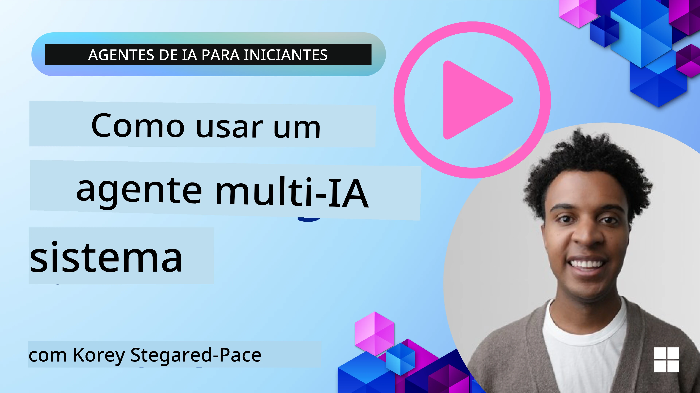
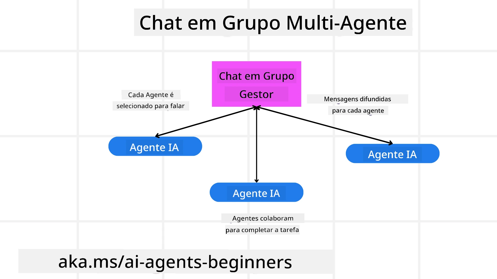
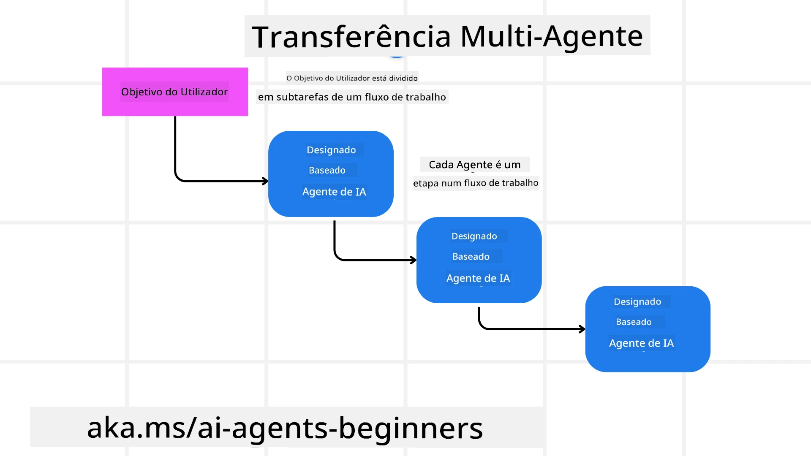
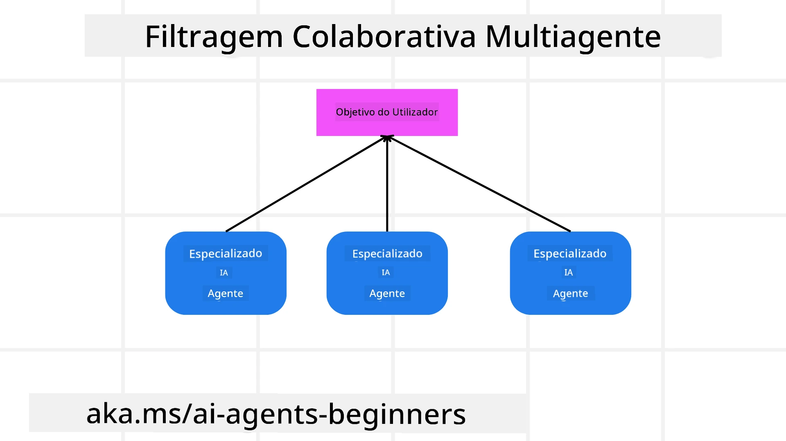

> _(Clique na imagem acima para ver o vídeo desta aula)_

# Padrões de design multiagente

Assim que começar a trabalhar num projeto que envolve múltiplos agentes, terá de considerar o padrão de design multiagente. No entanto, pode não ser imediatamente claro quando mudar para múltiplos agentes e quais são as vantagens.

## Introdução

Nesta lição, procuramos responder às seguintes perguntas:

- Quais são os cenários onde os sistemas multiagente são aplicáveis?
- Quais são as vantagens de usar multiagentes em vez de um único agente a desempenhar múltiplas tarefas?
- Quais são os blocos de construção para implementar o padrão de design multiagente?
- Como temos visibilidade sobre como os múltiplos agentes interagem entre si?

## Objetivos de Aprendizagem

Após esta lição, deverá ser capaz de:

- Identificar cenários onde os multiagentes são aplicáveis
- Reconhecer as vantagens de usar multiagentes em vez de um agente singular.
- Compreender os blocos de construção para implementar o padrão de design multiagente.

Qual é o quadro geral?

*Os sistemas multiagente são um padrão de design que permite que múltiplos agentes trabalhem em conjunto para atingir um objetivo comum*.

Este padrão é amplamente utilizado em diversos campos, incluindo robótica, sistemas autónomos e computação distribuída.

## Cenários onde os multiagentes são aplicáveis

Então, em que cenários é vantajoso usar multiagentes? A resposta é que existem muitos cenários onde empregar múltiplos agentes é benéfico, especialmente nos seguintes casos:

- **Grandes cargas de trabalho**: Grandes cargas de trabalho podem ser divididas em tarefas menores e atribuídas a diferentes agentes, permitindo processamento paralelo e conclusão mais rápida. Um exemplo disto é no caso de uma grande tarefa de processamento de dados.
- **Tarefas complexas**: Tarefas complexas, tal como grandes cargas de trabalho, podem ser desagregadas em subtarefas menores e atribuídas a diferentes agentes, cada um especializado num aspeto específico da tarefa. Um bom exemplo disto é no caso de veículos autónomos, onde diferentes agentes gerem a navegação, deteção de obstáculos e comunicação com outros veículos.
- **Conhecimentos diversificados**: Diferentes agentes podem ter conhecimentos diversificados, permitindo-lhes tratar diferentes aspetos de uma tarefa de forma mais eficaz do que um único agente. Para este caso, um bom exemplo é na área da saúde, onde agentes podem gerir diagnósticos, planos de tratamento e monitorização de pacientes.

## Vantagens de usar multiagentes em vez de um agente singular

Um sistema com um único agente pode funcionar bem para tarefas simples, mas para tarefas mais complexas, usar vários agentes pode oferecer várias vantagens:

- **Especialização**: Cada agente pode ser especializado numa tarefa específica. A falta de especialização num único agente significa que tem um agente que pode fazer de tudo, mas que pode ficar confuso sobre o que fazer quando confrontado com uma tarefa complexa. Por exemplo, pode acabar por executar uma tarefa para a qual não é o mais indicado.
- **Escalabilidade**: É mais fácil escalar sistemas adicionando mais agentes em vez de sobrecarregar um único agente.
- **Tolerância a falhas**: Se um agente falhar, os outros podem continuar a funcionar, garantindo a fiabilidade do sistema.

Vamos tomar um exemplo: vamos reservar uma viagem para um utilizador. Um sistema com um único agente teria de tratar de todos os aspetos do processo de reserva de viagem, desde encontrar voos até reservar hotéis e carros de aluguer. Para conseguir isto com um único agente, o agente teria de ter ferramentas para tratar todas essas tarefas. Isto poderia levar a um sistema complexo e monolítico que é difícil de manter e escalar. Um sistema multiagente, por outro lado, poderia ter diferentes agentes especializados em encontrar voos, reservar hotéis e carros de aluguer. Isto tornaria o sistema mais modular, mais fácil de manter e escalável.

Compare isto com uma agência de viagens pequena e familiar versus uma agência de viagens operada em regime de franquia. A pequena agência teria um único agente a tratar de todos os aspetos do processo de reserva de viagem, enquanto a franquia teria diferentes agentes a tratar de diferentes aspetos do processo de reserva de viagem.

## Blocos de construção para implementar o padrão de design multiagente

Antes de poder implementar o padrão de design multiagente, precisa de compreender os blocos de construção que compõem o padrão.

Vamos tornar isto mais concreto olhando novamente para o exemplo de reservar uma viagem para um utilizador. Neste caso, os blocos de construção incluiriam:

- **Comunicação entre agentes**: Os agentes responsáveis por encontrar voos, reservar hotéis e carros de aluguer precisam de comunicar e partilhar informação sobre as preferências e restrições do utilizador. É necessário decidir os protocolos e métodos para esta comunicação. O que isto significa concretamente é que o agente que encontra voos precisa de comunicar com o agente que reserva hotéis para garantir que o hotel é reservado para as mesmas datas do voo. Isso significa que os agentes precisam de partilhar informação sobre as datas de viagem do utilizador, o que implica que precisa de decidir *quais agentes estão a partilhar informação e como a estão a partilhar*.
- **Mecanismos de coordenação**: Os agentes precisam de coordenar as suas ações para garantir que as preferências e restrições do utilizador são satisfeitas. Uma preferência do utilizador poderia ser querer um hotel perto do aeroporto, enquanto uma restrição poderia ser que os carros de aluguer só estão disponíveis no aeroporto. Isto significa que o agente que reserva hotéis precisa de coordenar-se com o agente que reserva carros de aluguer para garantir que as preferências e restrições do utilizador são atendidas. Isto implica que precisa de decidir *como os agentes estão a coordenar as suas ações*.
- **Arquitetura dos agentes**: Os agentes precisam de ter a estrutura interna para tomar decisões e aprender com as suas interações com o utilizador. Isto significa que o agente que encontra voos precisa de ter uma estrutura interna para tomar decisões sobre que voos recomendar ao utilizador. Isto implica que precisa de decidir *como os agentes estão a tomar decisões e a aprender com as suas interações com o utilizador*. Exemplos de como um agente aprende e melhora poderiam ser que o agente que encontra voos poderia usar um modelo de aprendizagem automática para recomendar voos ao utilizador com base nas suas preferências passadas.
- **Visibilidade nas interações multiagente**: Precisa de ter visibilidade sobre como os múltiplos agentes estão a interagir entre si. Isto significa que precisa de ferramentas e técnicas para rastrear atividades e interações dos agentes. Isto pode ser na forma de ferramentas de registo e monitorização, ferramentas de visualização e métricas de desempenho.
- **Padrões multiagente**: Existem diferentes padrões para implementar sistemas multiagente, tais como arquiteturas centralizadas, descentralizadas e híbridas. Precisa de decidir o padrão que melhor se adequa ao seu caso de uso.
- **Humano no circuito**: Na maioria dos casos, terá um humano no circuito e precisa de instruir os agentes quando devem pedir intervenção humana. Isto pode ser na forma de um utilizador a pedir um hotel ou voo específico que os agentes não recomendaram ou a pedir confirmação antes de reservar um voo ou hotel.

## Visibilidade nas interações multiagente

É importante que tenha visibilidade sobre como os múltiplos agentes estão a interagir entre si. Esta visibilidade é essencial para depuração, otimização e para assegurar a eficácia global do sistema. Para conseguir isto, precisa de ferramentas e técnicas para rastrear atividades e interações dos agentes. Isto pode ser na forma de ferramentas de registo e monitorização, ferramentas de visualização e métricas de desempenho.

Por exemplo, no caso de reservar uma viagem para um utilizador, poderia ter um painel de controlo que mostre o estado de cada agente, as preferências e restrições do utilizador e as interações entre agentes. Este painel poderia mostrar as datas de viagem do utilizador, os voos recomendados pelo agente de voos, os hotéis recomendados pelo agente de hotéis e os carros de aluguer recomendados pelo agente de carros. Isto dar-lhe-ia uma visão clara de como os agentes estão a interagir entre si e se as preferências e restrições do utilizador estão a ser satisfeitas.

Vamos analisar cada um destes aspetos com mais detalhe.

- **Ferramentas de registo e monitorização**: Deve registar cada ação tomada por um agente. Uma entrada de registo poderia armazenar informação sobre o agente que tomou a ação, a ação executada, a hora da ação e o resultado da ação. Esta informação pode depois ser usada para depuração, otimização e mais.
- **Ferramentas de visualização**: As ferramentas de visualização podem ajudar a ver as interações entre agentes de uma forma mais intuitiva. Por exemplo, poderia ter um grafo que mostre o fluxo de informação entre agentes. Isto poderia ajudar a identificar gargalos, ineficiências e outros problemas no sistema.
- **Métricas de desempenho**: As métricas de desempenho podem ajudar a acompanhar a eficácia do sistema multiagente. Por exemplo, poderia acompanhar o tempo necessário para completar uma tarefa, o número de tarefas concluídas por unidade de tempo e a precisão das recomendações feitas pelos agentes. Esta informação pode ajudar a identificar áreas para melhoria e otimizar o sistema.

## Padrões multiagente

Vamos aprofundar alguns padrões concretos que podemos usar para criar aplicações multiagente. Aqui estão alguns padrões interessantes a considerar:

### Chat de grupo

Este padrão é útil quando se quer criar uma aplicação de chat de grupo onde múltiplos agentes podem comunicar entre si. Casos de uso típicos para este padrão incluem colaboração em equipa, suporte ao cliente e redes sociais.

Neste padrão, cada agente representa um utilizador no chat de grupo, e as mensagens são trocadas entre agentes usando um protocolo de mensagens. Os agentes podem enviar mensagens para o chat de grupo, receber mensagens do chat de grupo e responder a mensagens de outros agentes.

Este padrão pode ser implementado usando uma arquitetura centralizada onde todas as mensagens são encaminhadas através de um servidor central, ou uma arquitetura descentralizada onde as mensagens são trocadas diretamente.

### Passagem de tarefas

Este padrão é útil quando se quer criar uma aplicação onde múltiplos agentes podem passar tarefas entre si.

Casos de uso típicos para este padrão incluem suporte ao cliente, gestão de tarefas e automação de fluxos de trabalho.

Neste padrão, cada agente representa uma tarefa ou um passo num fluxo de trabalho, e os agentes podem passar tarefas para outros agentes com base em regras predefinidas.

### Filtragem colaborativa

Este padrão é útil quando se quer criar uma aplicação onde múltiplos agentes podem colaborar para fazer recomendações aos utilizadores.

A razão para querer que múltiplos agentes colaborem é que cada agente pode ter diferentes áreas de especialização e pode contribuir para o processo de recomendação de formas distintas.

Vamos tomar um exemplo onde um utilizador quer uma recomendação sobre a melhor ação para comprar no mercado bolsista.

- **Perito da indústria**: Um agente poderia ser um perito numa indústria específica.
- **Análise técnica**: Outro agente poderia ser um perito em análise técnica.
- **Análise fundamental**: e outro agente poderia ser um perito em análise fundamental. Ao colaborarem, estes agentes podem fornecer uma recomendação mais abrangente ao utilizador.

## Cenário: Processo de reembolso

Considere um cenário onde um cliente está a tentar obter um reembolso por um produto; podem estar envolvidos bastantes agentes neste processo, mas vamos dividi-los entre agentes específicos para este processo e agentes gerais que podem ser usados noutros processos.

**Agentes específicos para o processo de reembolso**:

Seguem-se alguns agentes que poderiam estar envolvidos no processo de reembolso:

- **Agente do cliente**: Este agente representa o cliente e é responsável por iniciar o processo de reembolso.
- **Agente do vendedor**: Este agente representa o vendedor e é responsável por processar o reembolso.
- **Agente de pagamento**: Este agente representa o processo de pagamento e é responsável por reembolsar o pagamento do cliente.
- **Agente de resolução**: Este agente representa o processo de resolução e é responsável por resolver quaisquer problemas que surjam durante o processo de reembolso.
- **Agente de conformidade**: Este agente representa o processo de conformidade e é responsável por assegurar que o processo de reembolso cumpre os regulamentos e políticas.

**Agentes gerais**:

Estes agentes podem ser usados por outras partes do seu negócio.

- **Agente de expedição**: Este agente representa o processo de expedição e é responsável por enviar o produto de volta ao vendedor. Este agente pode ser usado tanto no processo de reembolso como na expedição geral de um produto numa compra, por exemplo.
- **Agente de feedback**: Este agente representa o processo de recolha de feedback e é responsável por recolher o feedback do cliente. O feedback pode ser recolhido em qualquer momento e não apenas durante o processo de reembolso.
- **Agente de escalonamento**: Este agente representa o processo de escalonamento e é responsável por escalar questões para um nível de suporte superior. Pode usar este tipo de agente para qualquer processo onde seja necessário escalar um problema.
- **Agente de notificações**: Este agente representa o processo de notificações e é responsável por enviar notificações ao cliente em várias fases do processo de reembolso.
- **Agente de análises**: Este agente representa o processo de análise e é responsável por analisar dados relacionados com o processo de reembolso.
- **Agente de auditoria**: Este agente representa o processo de auditoria e é responsável por auditar o processo de reembolso para garantir que está a ser realizado corretamente.
- **Agente de relatórios**: Este agente representa o processo de geração de relatórios e é responsável por gerar relatórios sobre o processo de reembolso.
- **Agente de conhecimento**: Este agente representa o processo de gestão do conhecimento e é responsável por manter uma base de conhecimento de informação relacionada com o processo de reembolso. Este agente poderia ter conhecimento tanto sobre reembolsos como sobre outras partes do seu negócio.
- **Agente de segurança**: Este agente representa o processo de segurança e é responsável por assegurar a segurança do processo de reembolso.
- **Agente de qualidade**: Este agente representa o processo de qualidade e é responsável por assegurar a qualidade do processo de reembolso.

Há bastantes agentes listados anteriormente, tanto para o processo específico de reembolso como para os agentes gerais que podem ser usados noutras partes do seu negócio. Espera-se que isto lhe dê uma ideia de como pode decidir que agentes usar no seu sistema multiagente.

## Exercício

Desenhe um sistema multiagente para um processo de suporte ao cliente. Identifique os agentes envolvidos no processo, os seus papéis e responsabilidades, e como interagem entre si. Considere tanto agentes específicos do processo de suporte ao cliente como agentes gerais que possam ser usados noutras partes do seu negócio.
> Pense antes de ler a solução seguinte, pode precisar de mais agentes do que pensa.
> DICA: Pense nas diferentes fases do processo de apoio ao cliente e também considere os agentes necessários para qualquer sistema.

## Solução

[Solução](./solution/solution.md)

## Verificações de conhecimento

Pergunta: Quando deve considerar usar multi-agentes?

- [ ] A1: Quando tem uma carga de trabalho pequena e uma tarefa simples.
- [ ] A2: Quando tem uma grande carga de trabalho
- [ ] A3: Quando tem uma tarefa simples.

[Questionário da solução](./solution/solution-quiz.md)

## Resumo

Nesta lição, analisámos o padrão de design multi-agente, incluindo os cenários em que os multi-agentes são aplicáveis, as vantagens de utilizar múltiplos agentes em vez de um agente singular, os blocos de construção para implementar o padrão de design multi-agente, e como obter visibilidade sobre a interação entre os vários agentes.

### Tem mais perguntas sobre o padrão de design multi-agente?

Junte-se ao [Microsoft Foundry Discord](https://aka.ms/ai-agents/discord) para conhecer outros aprendizes, participar em horas de expediente e obter respostas às suas perguntas sobre Agentes de IA.

## Recursos adicionais

- <a href="https://learn.microsoft.com/azure/ai-services/agents/overview" target="_blank">Documentação do Microsoft Agent Framework</a>
- <a href="https://www.analyticsvidhya.com/blog/2024/10/agentic-design-patterns/" target="_blank">Padrões de design agentivo</a>

## Lição anterior

[Planeamento de Design](../07-planning-design/README.md)

## Próxima lição

[Metacognição em Agentes de IA](../09-metacognition/README.md)

---

<!-- CO-OP TRANSLATOR DISCLAIMER START -->
**Isenção de responsabilidade**:
Este documento foi traduzido utilizando o serviço de tradução por IA [Co-op Translator](https://github.com/Azure/co-op-translator). Embora nos esforcemos por garantir a precisão, deve ter em atenção que as traduções automáticas podem conter erros ou imprecisões. O documento original, na sua língua original, deve ser considerado a fonte autorizada. Para informação crítica, recomenda-se a tradução profissional por um tradutor humano. Não nos responsabilizamos por quaisquer mal-entendidos ou interpretações incorretas decorrentes da utilização desta tradução.
<!-- CO-OP TRANSLATOR DISCLAIMER END -->