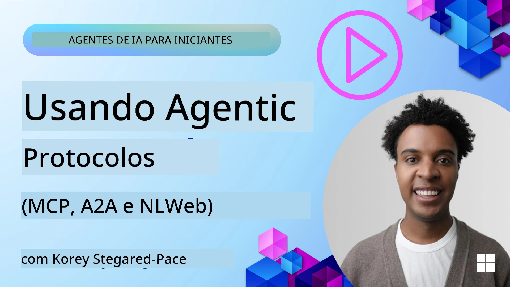
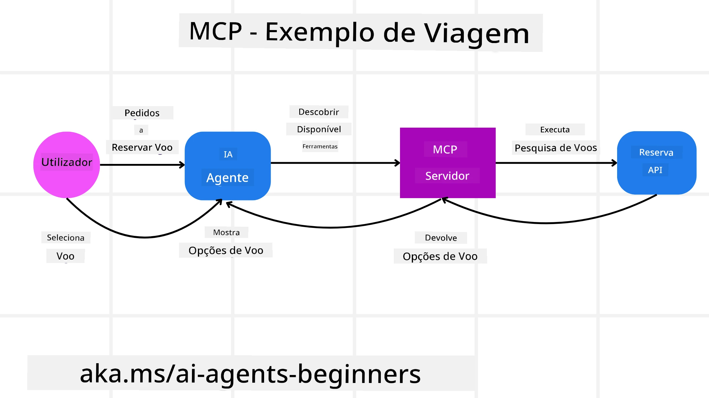
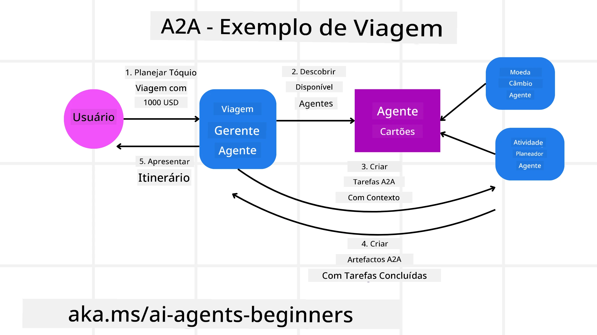
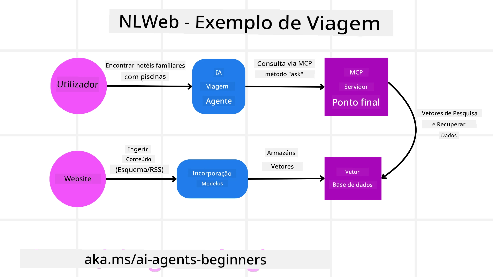

# Usar Protocolos Agenticos (MCP, A2A e NLWeb)

> _(Clique na imagem acima para assistir ao vídeo desta lição)_

À medida que o uso de agentes de IA cresce, também cresce a necessidade de protocolos que garantam padronização, segurança e apoiem a inovação aberta. Nesta lição, iremos abordar 3 protocolos que procuram responder a esta necessidade — Model Context Protocol (MCP), Agent to Agent (A2A) e Natural Language Web (NLWeb).

## Introdução

Nesta lição, iremos abordar:

• Como o **MCP** permite que Agentes de IA acedam a ferramentas e dados externos para completar tarefas do utilizador.

• Como o **A2A** possibilita a comunicação e colaboração entre diferentes agentes de IA.

• Como o **NLWeb** traz interfaces de linguagem natural a qualquer website, permitindo que agentes de IA descubram e interajam com o conteúdo.

## Objetivos de Aprendizagem

• **Identificar** o propósito principal e os benefícios do MCP, A2A e NLWeb no contexto dos agentes de IA.

• **Explicar** como cada protocolo facilita a comunicação e interação entre LLMs, ferramentas e outros agentes.

• **Reconhecer** os papéis distintos que cada protocolo desempenha na construção de sistemas agenticos complexos.

## Model Context Protocol

O **Model Context Protocol (MCP)** é um standard aberto que fornece uma forma padronizada para as aplicações fornecerem contexto e ferramentas aos LLMs. Isto permite um "adaptador universal" a diferentes fontes de dados e ferramentas a que os Agentes de IA podem ligar-se de forma consistente.

Vamos olhar para os componentes do MCP, os benefícios comparados ao uso direto de APIs e um exemplo de como agentes de IA podem usar um servidor MCP.

### Componentes Principais do MCP

O MCP opera numa **arquitetura cliente-servidor** e os seus componentes principais são:

• **Hosts** são aplicações LLM (por exemplo, um editor de código como o VSCode) que iniciam as conexões a um Servidor MCP.

• **Clients** são componentes dentro da aplicação host que mantêm conexões um-para-um com servidores.

• **Servers** são programas leves que expõem capacidades específicas.

Incluídos no protocolo estão três primitivas principais que são as capacidades de um Servidor MCP:

• **Tools**: São ações ou funções discretas que um agente de IA pode invocar para executar uma ação. Por exemplo, um serviço meteorológico pode expor uma ferramenta "obter previsão do tempo" ou um servidor de comércio eletrónico pode expor uma ferramenta "efetuar compra". Os servidores MCP anunciam o nome, descrição e esquema de entrada/saída de cada ferramenta na sua lista de capacidades.

• **Resources**: São itens de dados ou documentos apenas de leitura que um servidor MCP pode fornecer, e que os clientes podem obter sob demanda. Exemplos incluem conteúdos de ficheiros, registos de base de dados ou ficheiros de logs. Os recursos podem ser texto (como código ou JSON) ou binários (como imagens ou PDFs).

• **Prompts**: São modelos predefinidos que fornecem prompts sugeridos, permitindo fluxos de trabalho mais complexos.

### Benefícios do MCP

O MCP oferece vantagens significativas para Agentes de IA:

• **Descoberta Dinâmica de Ferramentas**: Os agentes podem receber dinamicamente uma lista de ferramentas disponíveis de um servidor juntamente com descrições do que fazem. Isto contrasta com APIs tradicionais, que frequentemente requerem codificação estática para integrações, significando que qualquer alteração na API exige atualização do código. O MCP oferece uma abordagem de "integrar uma vez", levando a maior adaptabilidade.

• **Interoperabilidade entre LLMs**: O MCP funciona com diferentes LLMs, dando flexibilidade para alternar modelos principais para melhor desempenho.

• **Segurança Padronizada**: O MCP inclui um método padrão de autenticação, melhorando a escalabilidade ao adicionar acesso a servidores MCP adicionais. Isto é mais simples do que gerir diferentes chaves e tipos de autenticação para várias APIs tradicionais.

### Exemplo de MCP

Imagine que um utilizador quer reservar um voo usando um assistente de IA baseado em MCP.

1. **Conexão**: O assistente de IA (o cliente MCP) liga-se a um servidor MCP fornecido por uma companhia aérea.

2. **Descoberta de Ferramentas**: O cliente pergunta ao servidor MCP da companhia aérea, "Que ferramentas tem disponíveis?" O servidor responde com ferramentas como "procurar voos" e "reservar voos".

3. **Invocação da Ferramenta**: Pode então pedir ao assistente de IA, "Por favor, procura um voo de Portland para Honolulu." O assistente, usando o seu LLM, identifica que precisa de chamar a ferramenta "procurar voos" e passa os parâmetros relevantes (origem, destino) para o servidor MCP.

4. **Execução e Resposta**: O servidor MCP, atuando como um invólucro, faz a chamada real à API interna de reserva da companhia aérea. Depois recebe a informação de voo (por exemplo, dados JSON) e envia-a de volta ao assistente de IA.

5. **Interação Adicional**: O assistente apresenta as opções de voo. Uma vez selecionado um voo, o assistente pode invocar a ferramenta "reservar voo" no mesmo servidor MCP, completando a reserva.

## Protocolo Agent-to-Agent (A2A)

Enquanto o MCP se foca em ligar LLMs a ferramentas, o **protocolo Agent-to-Agent (A2A)** vai um passo além ao permitir comunicação e colaboração entre diferentes agentes de IA. O A2A liga agentes de IA entre diferentes organizações, ambientes e stacks tecnológicos para completar uma tarefa partilhada.

Vamos analisar os componentes e benefícios do A2A, juntamente com um exemplo de como poderia ser aplicado na nossa aplicação de viagens.

### Componentes Principais do A2A

O A2A foca-se em permitir comunicação entre agentes para trabalharem juntos a uma sub-tarefa do utilizador. Cada componente do protocolo contribui para isto:

#### Agent Card

Semelhante a como um servidor MCP partilha uma lista de ferramentas, um Agent Card tem:
- O Nome do Agente.
- Uma **descrição das tarefas gerais** que realiza.
- Uma **lista de competências específicas** com descrições para ajudar outros agentes (ou mesmo utilizadores humanos) a entender quando e por que motivo quereriam chamar esse agente.
- A **URL do Endpoint atual** do agente.
- A **versão** e as **capacidades** do agente, como respostas em streaming e notificações push.

#### Agent Executor

O Agent Executor é responsável por **passar o contexto do chat do utilizador ao agente remoto**, que precisa disto para perceber a tarefa que deve completar. Num servidor A2A, um agente usa o seu próprio Large Language Model (LLM) para analisar os pedidos recebidos e executar tarefas utilizando as suas próprias ferramentas internas.

#### Artifact

Quando um agente remoto completa a tarefa solicitada, o resultado do seu trabalho é criado como um artifact. Um artifact **contém o resultado do trabalho do agente**, uma **descrição do que foi completado**, e o **contexto de texto** que é enviado pelo protocolo. Após o envio do artifact, a ligação com o agente remoto é fechada até ser necessária novamente.

#### Event Queue

Este componente é usado para **lidar com atualizações e passar mensagens**. É particularmente importante em produção para sistemas agenticos para evitar que a ligação entre agentes seja fechada antes da conclusão da tarefa, especialmente quando o tempo de execução da tarefa é longo.

### Benefícios do A2A

• **Colaboração Aprimorada**: Permite que agentes de diferentes fornecedores e plataformas interajam, partilhem contexto e trabalhem em conjunto, facilitando automação fluida entre sistemas tradicionalmente desconectados.

• **Flexibilidade na Seleção do Modelo**: Cada agente A2A pode decidir qual LLM usa para atender aos seus pedidos, permitindo modelos otimizados ou ajustados para cada agente — diferente da ligação a um único LLM em alguns cenários MCP.

• **Autenticação Integrada**: A autenticação está integrada diretamente no protocolo A2A, fornecendo um quadro robusto de segurança para interações entre agentes.

### Exemplo de A2A

Vamos expandir o nosso cenário de reserva de viagens, mas agora usando A2A.

1. **Pedido do Utilizador a Multi-Agente**: Um utilizador interage com um cliente/agente A2A chamado "Agente de Viagens", dizendo, por exemplo, "Por favor, reserva uma viagem completa para Honolulu para a próxima semana, incluindo voos, hotel e aluguer de carro."

2. **Orquestração pelo Agente de Viagens**: O Agente de Viagens recebe este pedido complexo. Usa o seu LLM para racionalizar a tarefa e determinar que precisa de interagir com outros agentes especializados.

3. **Comunicação Inter-Agentes**: O Agente de Viagens usa o protocolo A2A para se ligar a agentes a jusante, como um "Agente de Companhia Aérea", um "Agente de Hotel" e um "Agente de Aluguer de Carro", criados por diferentes empresas.

4. **Execução Delegada da Tarefa**: O Agente de Viagens envia tarefas específicas a estes agentes especializados (ex.: "Encontra voos para Honolulu", "Reserva um hotel", "Aluga um carro"). Cada agente especializado, usando os seus próprios LLMs e ferramentas (que podem ser servidores MCP), executa a sua parte específica da reserva.

5. **Resposta Consolidada**: Depois que todos os agentes concluem as suas tarefas, o Agente de Viagens compila os resultados (detalhes dos voos, confirmação do hotel, reserva do carro) e envia uma resposta abrangente em formato de chat para o utilizador.

## Natural Language Web (NLWeb)

Os websites têm sido durante muito tempo a forma principal para os utilizadores acederem a informação e dados na internet.

Vamos olhar para os diferentes componentes do NLWeb, os benefícios do NLWeb e um exemplo de como o nosso NLWeb funciona examinando a nossa aplicação de viagens.

### Componentes do NLWeb

- **Aplicação NLWeb (Código do Serviço Core)**: O sistema que processa perguntas em linguagem natural. Liga as diferentes partes da plataforma para criar respostas. Pode ser visto como o **motor que alimenta as funcionalidades de linguagem natural** de um website.

- **Protocolo NLWeb**: Este é um **conjunto básico de regras para interação em linguagem natural** com um website. Envia respostas em formato JSON (frequentemente usando Schema.org). O seu propósito é criar uma base simples para a “Web AI”, da mesma forma que o HTML tornou possível partilhar documentos online.

- **Servidor MCP (Endpoint do Model Context Protocol)**: Cada instalação NLWeb funciona também como um **servidor MCP**. Isto significa que pode **partilhar ferramentas (como um método “ask”) e dados** com outros sistemas de IA. Na prática, isto torna o conteúdo e as capacidades do website utilizáveis por agentes de IA, permitindo que o site faça parte do "ecossistema agente" mais amplo.

- **Modelos de Embedding**: Estes modelos são usados para **converter o conteúdo do website em representações numéricas chamadas vetores** (embeddings). Estes vetores capturam o significado de forma que os computadores podem comparar e pesquisar. São armazenados numa base de dados especial e os utilizadores podem escolher qual o modelo de embedding que querem usar.

- **Base de Dados Vetorial (Mecanismo de Recuperação)**: Esta base de dados **armazena os embeddings do conteúdo do website**. Quando alguém faz uma pergunta, o NLWeb consulta a base de dados vetorial para encontrar rapidamente a informação mais relevante. Fornece uma lista rápida de possíveis respostas, ordenadas por similaridade. O NLWeb funciona com diferentes sistemas de armazenamento vetorial como Qdrant, Snowflake, Milvus, Azure AI Search, e Elasticsearch.

### NLWeb por Exemplo

Considere o nosso website de reserva de viagens novamente, mas desta vez, alimentado pelo NLWeb.

1. **Ingestão de Dados**: Os catálogos de produtos existentes do website de viagens (ex.: listagens de voos, descrições de hotéis, pacotes turísticos) são formatados usando Schema.org ou carregados via feeds RSS. As ferramentas do NLWeb ingerem estes dados estruturados, criam embeddings e armazenam-nos numa base de dados vetorial local ou remota.

2. **Consulta em Linguagem Natural (Humano)**: Um utilizador visita o website e, em vez de navegar por menus, escreve numa interface de chat: "Encontra-me um hotel familiar em Honolulu com piscina para a próxima semana."

3. **Processamento NLWeb**: A aplicação NLWeb recebe esta consulta. Envia a consulta a um LLM para compreensão e, simultaneamente, pesquisa na sua base de dados vetorial as listagens de hotéis relevantes.

4. **Resultados Precisos**: O LLM ajuda a interpretar os resultados da pesquisa na base de dados, identificar as melhores correspondências baseadas nos critérios "familiar", "piscina" e "Honolulu", e formata uma resposta em linguagem natural. Crucialmente, a resposta refere-se a hotéis reais do catálogo do website, evitando informações inventadas.

5. **Interação do Agente de IA**: Porque o NLWeb funciona como um servidor MCP, um agente externo de viagens de IA pode também ligar-se a esta instância NLWeb do website. O agente de IA pode então usar o método `ask` do MCP para questionar o website diretamente: `ask("Existem restaurantes vegan-friendly na zona de Honolulu recomendados pelo hotel?")`. A instância NLWeb processaria isto, usando a sua base de dados de informação sobre restaurantes (se carregada), e retornaria uma resposta JSON estruturada.

### Tem Mais Perguntas sobre MCP/A2A/NLWeb?

Junte-se ao [Microsoft Foundry Discord](https://aka.ms/ai-agents/discord) para conhecer outros aprendizes, participar em horas de expediente e obter respostas às suas perguntas sobre Agentes de IA.

## Recursos

- [MCP para Principiantes](https://aka.ms/mcp-for-beginners)  
- [Documentação MCP](https://learn.microsoft.com/python/api/overview/azure/ai-projects-readme)
- [Repositório NLWeb](https://github.com/nlweb-ai/NLWeb)
- [Microsoft Agent Framework](https://aka.ms/ai-agents-beginners/agent-framewrok)

---

<!-- CO-OP TRANSLATOR DISCLAIMER START -->
**Aviso Legal**:
Este documento foi traduzido utilizando o serviço de tradução automática [Co-op Translator](https://github.com/Azure/co-op-translator). Embora nos esforcemos por garantir a precisão, por favor note que traduções automáticas podem conter erros ou imprecisões. O documento original no seu idioma nativo deve ser considerado a fonte fidedigna. Para informações críticas, recomenda-se tradução profissional humana. Não nos responsabilizamos por quaisquer mal-entendidos ou interpretações erradas decorrentes do uso desta tradução.
<!-- CO-OP TRANSLATOR DISCLAIMER END -->