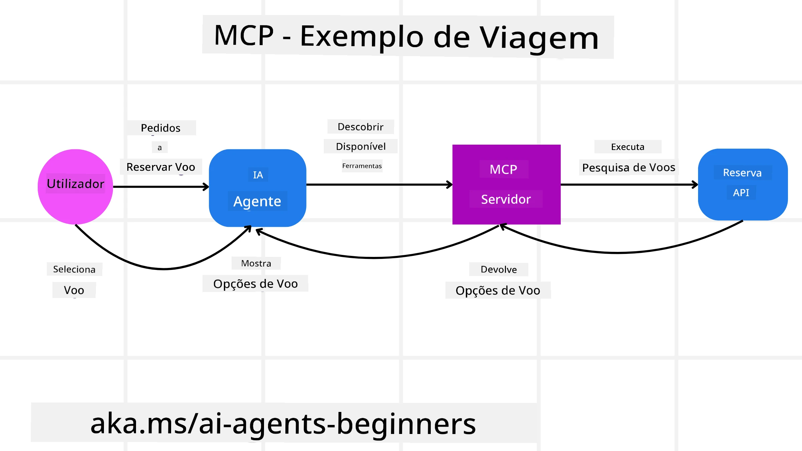
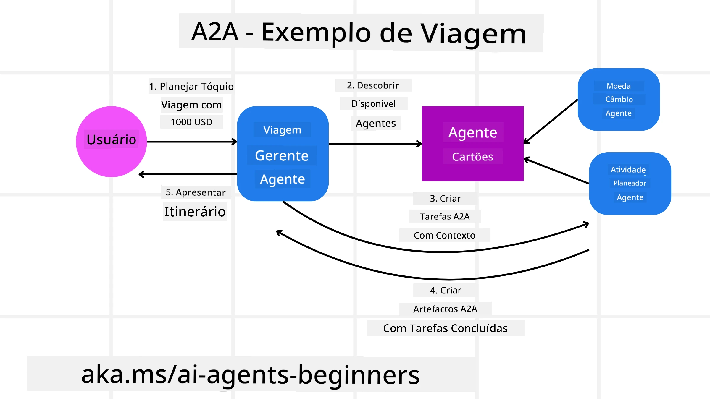
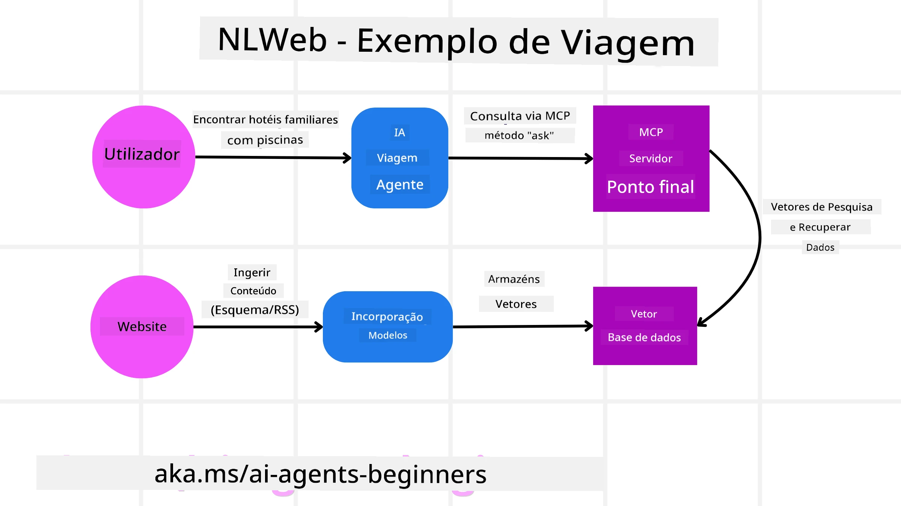

# Utilizar Protocolos Agentes (MCP, A2A e NLWeb)

> _(Clique na imagem acima para ver o vídeo desta lição)_

À medida que o uso de agentes de IA cresce, cresce também a necessidade de protocolos que garantam a padronização, a segurança e apoiem a inovação aberta. Nesta lição, abordaremos 3 protocolos que procuram satisfazer esta necessidade - Protocolo de Contexto de Modelo (MCP), Agente para Agente (A2A) e Web de Linguagem Natural (NLWeb).

## Introdução

Nesta lição, vamos abordar:

• Como o **MCP** permite que agentes de IA acedam a ferramentas e dados externos para concluir tarefas do utilizador.

• Como o **A2A** possibilita a comunicação e colaboração entre diferentes agentes de IA.

• Como o **NLWeb** traz interfaces em linguagem natural a qualquer site, permitindo que agentes de IA descubram e interajam com o conteúdo.

## Objetivos de Aprendizagem

• **Identificar** o propósito principal e os benefícios do MCP, A2A e NLWeb no contexto dos agentes de IA.

• **Explicar** como cada protocolo facilita a comunicação e interação entre LLMs, ferramentas e outros agentes.

• **Reconhecer** os papéis distintos que cada protocolo desempenha na construção de sistemas agentes complexos.

## Protocolo de Contexto de Modelo

O **Protocolo de Contexto de Modelo (MCP)** é um padrão aberto que fornece uma maneira padronizada para aplicações fornecerem contexto e ferramentas a LLMs. Isto permite um "adaptador universal" a diferentes fontes de dados e ferramentas que agentes de IA podem conectar de forma consistente.

Vamos analisar os componentes do MCP, os benefícios comparados com o uso direto de APIs, e um exemplo de como agentes de IA podem usar um servidor MCP.

### Componentes Principais do MCP

O MCP opera numa **arquitetura cliente-servidor** e os componentes principais são:

• **Hosts** são aplicações LLM (por exemplo, um editor de código como o VSCode) que iniciam as ligações a um Servidor MCP.

• **Clientes** são componentes dentro da aplicação host que mantêm ligações one-to-one com servidores.

• **Servidores** são programas leves que expõem capacidades específicas.

Incluídas no protocolo estão três primitivas principais que são as capacidades de um Servidor MCP:

• **Ferramentas**: São ações ou funções discretas que um agente de IA pode chamar para realizar uma ação. Por exemplo, um serviço de meteorologia pode expor uma ferramenta "obter tempo", ou um servidor de comércio eletrónico pode expor uma ferramenta "comprar produto". Os servidores MCP anunciam o nome de cada ferramenta, descrição e esquema de entrada/saída na sua lista de capacidades.

• **Recursos**: São itens de dados ou documentos apenas para leitura que um servidor MCP pode fornecer, e os clientes podem obtê-los sob demanda. Exemplos incluem conteúdo de ficheiros, registos de base de dados ou ficheiros de logs. Os recursos podem ser texto (como código ou JSON) ou binário (como imagens ou PDFs).

• **Prompts**: São modelos pré-definidos que fornecem sugestões de prompts, permitindo fluxos de trabalho mais complexos.

### Benefícios do MCP

O MCP oferece vantagens significativas para os agentes de IA:

• **Descoberta Dinâmica de Ferramentas**: Os agentes podem receber dinamicamente uma lista de ferramentas disponíveis de um servidor, juntamente com descrições do que fazem. Isto contrasta com APIs tradicionais, que geralmente exigem codificação estática para integrações, significando que qualquer alteração na API exige atualizações de código. MCP oferece uma abordagem de "integrar uma vez", levando a maior adaptabilidade.

• **Interoperabilidade Entre LLMs**: MCP funciona com diferentes LLMs, proporcionando flexibilidade para mudar o modelo principal para avaliar um desempenho melhor.

• **Segurança Padronizada**: MCP inclui um método padrão de autenticação, melhorando a escalabilidade ao adicionar acesso a servidores MCP adicionais. Isto é mais simples do que gerir diferentes chaves e tipos de autenticação para várias APIs tradicionais.

### Exemplo MCP

Imagine que um utilizador quer reservar um voo usando um assistente de IA alimentado por MCP.

1. **Ligação**: O assistente de IA (o cliente MCP) liga-se a um servidor MCP fornecido por uma companhia aérea.

2. **Descoberta de Ferramentas**: O cliente pergunta ao servidor MCP da companhia aérea: "Que ferramentas tens disponíveis?" O servidor responde com ferramentas como "procurar voos" e "reservar voos".

3. **Invocação da Ferramenta**: Depois pedes ao assistente de IA: "Por favor, procura um voo de Portland para Honolulu." O assistente de IA, usando o seu LLM, identifica que precisa chamar a ferramenta "procurar voos" e passa os parâmetros relevantes (origem, destino) ao servidor MCP.

4. **Execução e Resposta**: O servidor MCP, agindo como uma camada intermédia, faz a chamada real à API interna de reservas da companhia aérea. Depois recebe a informação do voo (por exemplo, dados JSON) e envia-a de volta ao assistente de IA.

5. **Interação Adicional**: O assistente de IA apresenta as opções de voo. Após escolheres um voo, o assistente pode invocar a ferramenta "reservar voo" no mesmo servidor MCP, completando a reserva.

## Protocolo Agente para Agente (A2A)

Enquanto o MCP foca-se em conectar LLMs a ferramentas, o **Protocolo Agente para Agente (A2A)** vai mais além ao permitir a comunicação e colaboração entre diferentes agentes de IA. O A2A conecta agentes de IA em diferentes organizações, ambientes e stacks tecnológicos para completar uma tarefa comum.

Vamos examinar os componentes e benefícios do A2A, juntamente com um exemplo de como pode ser aplicado na nossa aplicação de viagens.

### Componentes Principais do A2A

O A2A foca-se em permitir a comunicação entre agentes e fazê-los trabalhar juntos para completar uma subtarefa do utilizador. Cada componente do protocolo contribui para isso:

#### Agent Card

Semelhante a como um servidor MCP partilha uma lista de ferramentas, um Agent Card possui:
- O Nome do Agente.
- Uma **descrição das tarefas gerais** que completa.
- Uma **lista de competências específicas** com descrições para ajudar outros agentes (ou mesmo utilizadores humanos) a entender quando e porquê quereriam chamar esse agente.
- A **URL atual do Endpoint** do agente
- A **versão** e **capacidades** do agente, como respostas em streaming e notificações push.

#### Executor Agente

O Executor Agente é responsável por **passar o contexto do chat do utilizador ao agente remoto**, o agente remoto precisa disto para compreender a tarefa a ser concluída. Numa server A2A, um agente utiliza o seu próprio Large Language Model (LLM) para analisar pedidos recebidos e executar tarefas usando as suas ferramentas internas.

#### Artefacto

Depois de um agente remoto completar a tarefa solicitada, o seu trabalho é criado como um artefacto. Um artefacto **contém o resultado do trabalho do agente**, uma **descrição do que foi concluído**, e o **contexto textual** que é enviado através do protocolo. Após o envio do artefacto, a ligação com o agente remoto é encerrada até ser necessária novamente.

#### Fila de Eventos

Este componente é usado para **gerir atualizações e passar mensagens**. É particularmente importante em produção para sistemas agentes evitar que a ligação entre agentes seja encerrada antes da conclusão de uma tarefa, especialmente quando os tempos de conclusão podem ser longos.

### Benefícios do A2A

• **Colaboração Aprimorada**: Permite que agentes de diferentes fornecedores e plataformas interajam, partilhem contexto e colaborem, facilitando a automatização integrada entre sistemas tradicionalmente desconectados.

• **Flexibilidade na Seleção de Modelos**: Cada agente A2A pode decidir qual LLM usa para atender os seus pedidos, permitindo modelos otimizados ou ajustados por agente, ao contrário de uma única conexão LLM em alguns cenários MCP.

• **Autenticação Integrada**: A autenticação é integrada diretamente no protocolo A2A, proporcionando um arcabouço de segurança robusto para interações entre agentes.

### Exemplo A2A

Vamos expandir o nosso cenário de reserva de viagem, mas desta vez usando A2A.

1. **Pedido do Utilizador ao Multi-Agente**: Um utilizador interage com um cliente/agente A2A "Agente de Viagens", talvez dizendo: "Por favor, reserva uma viagem completa para Honolulu para a próxima semana, incluindo voos, hotel e aluguer de carro".

2. **Orquestração pelo Agente de Viagens**: O Agente de Viagens recebe este pedido complexo. Usa o seu LLM para raciocinar sobre a tarefa e determina que precisa interagir com outros agentes especializados.

3. **Comunicação Entre Agentes**: O Agente de Viagens usa o protocolo A2A para conectar-se a agentes descendentes, tais como um "Agente de Companhia Aérea", um "Agente de Hotel" e um "Agente de Aluguer de Carros" criados por diferentes empresas.

4. **Execução Delegada da Tarefa**: O Agente de Viagens envia tarefas específicas a esses agentes especializados (ex.: "Encontrar voos para Honolulu", "Reservar um hotel", "Alugar um carro"). Cada um desses agentes especializados, utilizando os seus próprios LLMs e as suas ferramentas (que podem ser próprios servidores MCP), executa a sua parte específica da reserva.

5. **Resposta Consolidada**: Depois que todos os agentes descendentes completam as suas tarefas, o Agente de Viagens compila os resultados (detalhes do voo, confirmação do hotel, reserva do aluguer de carro) e envia uma resposta abrangente, em estilo de chat, ao utilizador.

## Web de Linguagem Natural (NLWeb)

Os sites têm sido durante muito tempo a principal forma para os utilizadores acederem a informações e dados pela internet.

Vamos ver os diferentes componentes do NLWeb, os benefícios do NLWeb e um exemplo de como o nosso NLWeb funciona olhando para a nossa aplicação de viagens.

### Componentes do NLWeb

- **Aplicação NLWeb (Código do Serviço Core)**: O sistema que processa perguntas em linguagem natural. Liga as diferentes partes da plataforma para criar respostas. Pode pensar-se nele como o **motor que alimenta as funcionalidades em linguagem natural** de um site.

- **Protocolo NLWeb**: Este é um **conjunto básico de regras para interação em linguagem natural** com um site. Envia respostas em formato JSON (frequentemente usando Schema.org). O seu propósito é criar uma base simples para a “Web de IA”, da mesma forma que o HTML tornou possível partilhar documentos online.

- **Servidor MCP (Ponto de Extremidade do Protocolo de Contexto de Modelo)**: Cada instalação NLWeb também funciona como um **servidor MCP**. Isto significa que pode **partilhar ferramentas (como o método “ask”) e dados** com outros sistemas de IA. Na prática, isto torna o conteúdo e as capacidades do site utilizáveis por agentes de IA, permitindo que o site faça parte do ecossistema mais amplo de agentes.

- **Modelos de Embedding**: Estes modelos são usados para **converter o conteúdo do website em representações numéricas chamadas vetores** (embeddings). Estes vetores capturam o significado de forma comparável e pesquisável por computadores. São armazenados numa base de dados especial e os utilizadores podem escolher qual o modelo de embedding querem usar.

- **Base de Dados Vetorial (Mecanismo de Recuperação)**: Esta base de dados **armazena os embeddings do conteúdo do website**. Quando alguém faz uma pergunta, NLWeb verifica a base de dados vetorial para encontrar rapidamente a informação mais relevante. Fornece uma lista rápida de respostas possíveis, ordenadas por similaridade. NLWeb trabalha com diferentes sistemas de armazenamento vetorial, tais como Qdrant, Snowflake, Milvus, Azure AI Search e Elasticsearch.

### NLWeb por Exemplo

Considere novamente o nosso website de reservas de viagem, mas desta vez, alimentado por NLWeb.

1. **Ingestão de Dados**: Os catálogos de produtos existentes do website de viagens (ex.: listas de voos, descrições de hotéis, pacotes turísticos) são formatados usando Schema.org ou carregados via feeds RSS. As ferramentas NLWeb ingerem estes dados estruturados, criam embeddings e armazenam-nos numa base de dados vetorial local ou remota.

2. **Consulta em Linguagem Natural (Humano)**: Um utilizador visita o site e, em vez de navegar por menus, escreve numa interface de chat: "Encontra-me um hotel familiar em Honolulu com piscina para a próxima semana".

3. **Processamento NLWeb**: A aplicação NLWeb recebe esta consulta. Envia o pedido a um LLM para compreensão e ao mesmo tempo pesquisa na sua base de dados vetorial por listagens de hotéis relevantes.

4. **Resultados Preciso**: O LLM ajuda a interpretar os resultados da pesquisa da base de dados, identifica as melhores correspondências com base nos critérios "familiar", "piscina" e "Honolulu", e depois formata uma resposta em linguagem natural. Crucialmente, a resposta refere-se a hotéis reais do catálogo do site, evitando informações inventadas.

5. **Interação com Agente de IA**: Como NLWeb funciona como um servidor MCP, um agente de viagens IA externo poderia também conectar-se a esta instância NLWeb do website. O agente IA poderia então usar o método MCP `ask` para interrogar diretamente o site: `ask("Há restaurantes veganos recomendados pelo hotel na área de Honolulu?")`. A instância NLWeb processaria esta questão, aproveitando a sua base de dados de informação sobre restaurantes (se carregada), e retornaria uma resposta JSON estruturada.

### Tem Mais Perguntas sobre MCP/A2A/NLWeb?

Junta-te ao [Microsoft Foundry Discord](https://discord.com/invite/ATgtXmAS5D) para encontrares outros aprendizes, participares em horas de atendimento e obter respostas às tuas perguntas sobre Agentes de IA.

## Recursos

- [MCP para Iniciantes](https://aka.ms/mcp-for-beginners)  
- [Documentação do MCP](https://learn.microsoft.com/python/api/overview/azure/ai-projects-readme)
- [Repositório NLWeb](https://github.com/nlweb-ai/NLWeb)
- [Framework de Agentes Microsoft](https://learn.microsoft.com/en-us/agent-framework/overview/?wt.mc_id=youtube_26688_organicsocial_reactor&pivots=programming-language-python)

## Lição Anterior

[Agentes de IA em Produção](../10-ai-agents-production/README.md)

## Próxima Lição

[Engenharia de Contexto para Agentes de IA](../12-context-engineering/README.md)

---

<!-- CO-OP TRANSLATOR DISCLAIMER START -->
**Aviso Legal**:
Este documento foi traduzido utilizando o serviço de tradução automática [Co-op Translator](https://github.com/Azure/co-op-translator). Embora nos esforcemos pela precisão, esteja ciente de que traduções automáticas podem conter erros ou imprecisões. O documento original na sua língua nativa deve ser considerado a fonte autorizada. Para informações críticas, recomenda-se tradução profissional humana. Não nos responsabilizamos por quaisquer mal-entendidos ou interpretações incorretas resultantes da utilização desta tradução.
<!-- CO-OP TRANSLATOR DISCLAIMER END -->