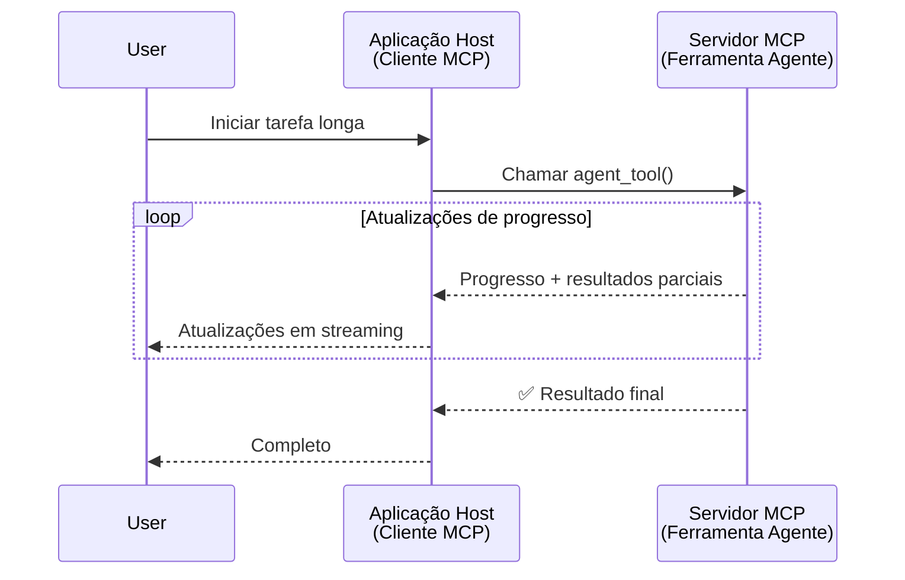
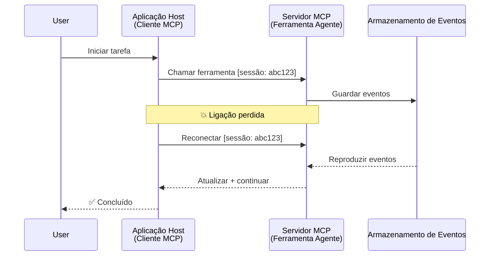
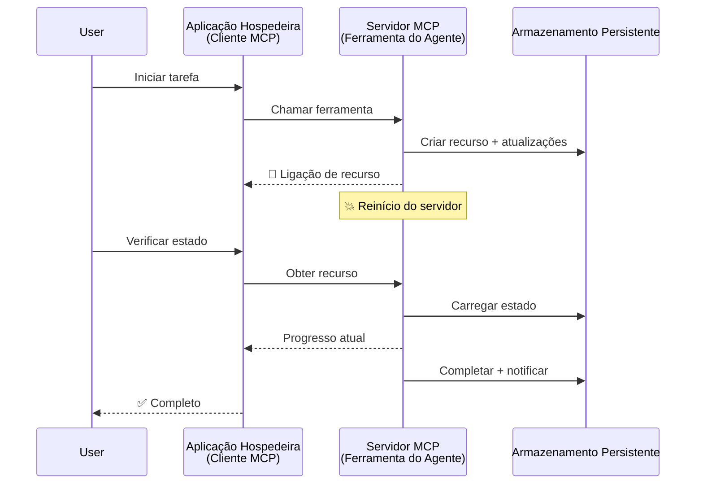
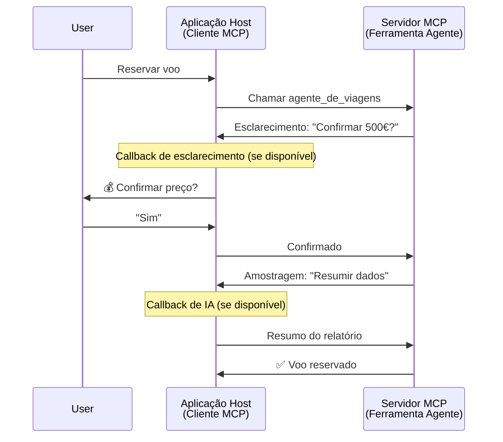
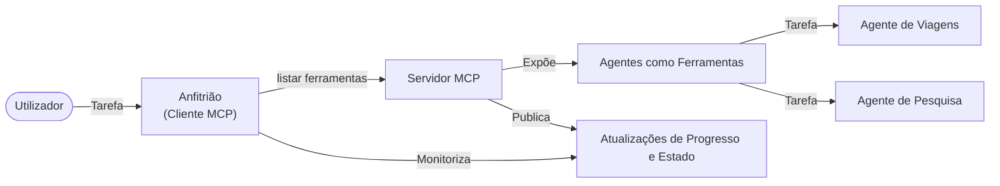

# Construir Sistemas de Comunicação Agente-para-Agente com MCP

> TL;DR - Pode construir comunicação Agent2Agent em MCP? Sim!

O MCP evoluiu significativamente além do seu objetivo original de "fornecer contexto aos LLMs". Com melhorias recentes incluindo [streams retomar](https://modelcontextprotocol.io/docs/concepts/transports#resumability-and-redelivery), [elicitação](https://modelcontextprotocol.io/specification/2025-06-18/client/elicitation), [amostragem](https://modelcontextprotocol.io/specification/2025-06-18/client/sampling), e notificações ([progresso](https://modelcontextprotocol.io/specification/2025-06-18/basic/utilities/progress) e [recursos](https://modelcontextprotocol.io/specification/2025-06-18/schema#resourceupdatednotification)), o MCP agora proporciona uma base robusta para construir sistemas complexos de comunicação agente-para-agente.

## O Equívoco Agente/Ferramenta

À medida que mais desenvolvedores exploram ferramentas com comportamentos agentes (executar por longos períodos, poder requerer input adicional durante a execução, etc.), um equívoco comum é que o MCP é inadequado principalmente porque exemplos iniciais das suas ferramentas primitivas focavam em padrões simples de pedido-resposta.

Esta perceção está desatualizada. A especificação do MCP tem sido significativamente melhorada nos últimos meses com capacidades que colmatam a lacuna na construção de comportamentos agentes de longa duração:

- **Streaming e Resultados Parciais**: Atualizações de progresso em tempo real durante a execução
- **Retomabilidade**: Clientes podem reconectar e continuar após desconexão
- **Durabilidade**: Resultados sobrevivem reinícios do servidor (ex., via links de recursos)
- **Multi-turno**: Input interativo durante a execução via elicitação e amostragem

Estas funcionalidades podem ser combinadas para permitir aplicações agentes e multi-agentes complexas, todas implementadas no protocolo MCP.

Para referência, consideraremos um agente como uma "ferramenta" disponível num servidor MCP. Isto implica a existência de uma aplicação hospedeira que implementa um cliente MCP que estabelece uma sessão com o servidor MCP e pode invocar o agente.

## O Que Torna uma Ferramenta MCP "Agente"?

Antes de entrar na implementação, vamos estabelecer quais as capacidades de infraestrutura necessárias para suportar agentes de longa duração.

> Definiremos um agente como uma entidade capaz de operar autonomamente por períodos prolongados, apta a gerir tarefas complexas que podem requerer múltiplas interações ou ajustes baseados em feedback em tempo real.

### 1. Streaming e Resultados Parciais

Padrões tradicionais de pedido-resposta não funcionam para tarefas de longa duração. Os agentes precisam fornecer:

- Atualizações de progresso em tempo real
- Resultados intermédios

**Suporte MCP**: As notificações de atualização de recursos possibilitam o streaming de resultados parciais, ainda que isto exija um design cuidadoso para evitar conflitos com o modelo 1:1 de pedido/resposta do JSON-RPC.

| Funcionalidade             | Caso de Uso                                                                                                                                                               | Suporte MCP                                                                               |
| -------------------------- | ------------------------------------------------------------------------------------------------------------------------------------------------------------------------ | ----------------------------------------------------------------------------------------- |
| Atualizações de Progresso em Tempo Real | Um utilizador pede uma tarefa de migração de código. O agente transmite o progresso: "10% - A analisar dependências... 25% - A converter ficheiros TypeScript... 50% - A atualizar importações..."          | ✅ Notificações de progresso                                                               |
| Resultados Parciais         | Tarefa "Gerar um livro" transmite resultados parciais, ex.: 1) Esquema da trama, 2) Lista de capítulos, 3) Cada capítulo à medida que fica completo. O anfitrião pode inspecionar, cancelar ou redirecionar a qualquer momento. | ✅ Notificações podem ser "extendidas" para incluir resultados parciais veja propostas nos PR 383, 776 |

<div align="center" style="font-style: italic; font-size: 0.95em; margin-bottom: 0.5em;">
<strong>Figura 1:</strong> Este diagrama ilustra como um agente MCP transmite atualizações de progresso em tempo real e resultados parciais para a aplicação hospedeira durante uma tarefa de longa duração, permitindo ao utilizador monitorizar a execução em tempo real.
</div>



### 2. Retomabilidade

Os agentes devem gerir interrupções de rede de forma suave:

- Reconectar após uma desconexão do cliente
- Continuar do ponto onde pararam (reentrega de mensagens)

**Suporte MCP**: O transporte StreamableHTTP do MCP suporta hoje retomada de sessão e reentrega de mensagens com IDs de sessão e do último evento. Nota importante: o servidor deve implementar um EventStore que permita a reprodução de eventos na reconexão do cliente.  
Note que há uma proposta comunitária (PR #975) que explora streams retomáveis independentes do transporte.

| Funcionalidade  | Caso de Uso                                                                                                                                                    | Suporte MCP                                                                |
| -------------- | ------------------------------------------------------------------------------------------------------------------------------------------------------------- | -------------------------------------------------------------------------- |
| Retomabilidade | Cliente desconecta durante tarefa longa. No reconectar, a sessão retoma com eventos perdidos reproduzidos, continuando sem falhas do ponto em que parou.         | ✅ Transporte StreamableHTTP com IDs de sessão, reprodução de eventos e EventStore |

<div align="center" style="font-style: italic; font-size: 0.95em; margin-bottom: 0.5em;">
<strong>Figura 2:</strong> Este diagrama mostra como o transporte StreamableHTTP do MCP e a loja de eventos permitem uma retomada de sessão fluida: se o cliente desconectar, pode reconectar e reproduzir eventos perdidos, continuando a tarefa sem perda de progresso.
</div>



### 3. Durabilidade

Agentes de longa duração precisam de estado persistente:

- Resultados sobrevivem a reinícios do servidor
- Estado pode ser recuperado fora de banda
- Acompanhamento de progresso através de sessões

**Suporte MCP**: O MCP agora suporta um tipo de retorno de ligação a recursos para chamadas de ferramentas. Hoje, um padrão possível é desenhar uma ferramenta que cria um recurso e devolve imediatamente um link para recurso. A ferramenta pode continuar a tratar a tarefa em segundo plano e atualizar o recurso. Por sua vez, o cliente pode optar por sondar o estado deste recurso para obter resultados parciais ou completos (baseado nas atualizações que o servidor fornece) ou subscrever-se ao recurso para notificações de atualização.

Uma limitação aqui é que sondar recursos ou subscrever atualizações pode consumir recursos com implicações em escala. Existe uma proposta comunitária em aberto (incluindo #992) que explora a possibilidade de incluir webhooks ou triggers que o servidor pode chamar para notificar o cliente/aplicação hospedeira de atualizações.

| Funcionalidade | Caso de Uso                                                                                                                                         | Suporte MCP                                                        |
| -------------- | -------------------------------------------------------------------------------------------------------------------------------------------------- | ------------------------------------------------------------------ |
| Durabilidade   | Servidor crasha durante tarefa de migração de dados. Resultados e progresso sobrevivem a reinício, cliente pode verificar estado e continuar do recurso persistente. | ✅ Links de recurso com armazenamento persistente e notificações de estado |

Hoje, um padrão comum é desenhar uma ferramenta que cria um recurso e devolve imediatamente um link para recurso. A ferramenta pode em segundo plano endereçar a tarefa, emitir notificações de recurso que servem como atualizações de progresso ou incluir resultados parciais, e atualizar o conteúdo do recurso conforme necessário.

<div align="center" style="font-style: italic; font-size: 0.95em; margin-bottom: 0.5em;">
<strong>Figura 3:</strong> Este diagrama demonstra como agentes MCP usam recursos persistentes e notificações de estado para garantir que tarefas de longa duração sobrevivem a reinícios do servidor, permitindo que clientes verifiquem progresso e recuperem resultados mesmo após falhas.
</div>



### 4. Interações Multi-Turno

Agentes frequentemente precisam de input adicional durante a execução:

- Esclarecimento ou aprovação humana
- Assistência AI para decisões complexas
- Ajuste dinâmico de parâmetros

**Suporte MCP**: Totalmente suportado via amostragem (para input AI) e elicitação (para input humano).

| Funcionalidade            | Caso de Uso                                                                                                                                    | Suporte MCP                                             |
| ------------------------ | --------------------------------------------------------------------------------------------------------------------------------------------- | ------------------------------------------------------- |
| Interações Multi-Turno    | Agente de reservas de viagem pede confirmação de preço ao utilizador, depois solicita AI para resumir dados de viagem antes de concluir a reserva. | ✅ Elicitação para input humano, amostragem para input AI |

<div align="center" style="font-style: italic; font-size: 0.95em; margin-bottom: 0.5em;">
<strong>Figura 4:</strong> Este diagrama representa como agentes MCP podem interativamente solicitar input humano ou pedir assistência AI durante execução, suportando fluxos de trabalho complexos e multi-turno como confirmações e decisões dinâmicas.
</div>



## Implementação de Agentes de Longa Duração no MCP - Visão Geral do Código

Como parte deste artigo, fornecemos um [repositório de código](https://github.com/victordibia/ai-tutorials/tree/main/MCP%20Agents) que contém uma implementação completa de agentes de longa duração usando o SDK Python do MCP com transporte StreamableHTTP para retomada de sessão e reentrega de mensagens. A implementação demonstra como as capacidades do MCP podem ser combinadas para permitir comportamentos sofisticados semelhantes a agentes.

Especificamente, implementamos um servidor com duas ferramentas principais de agentes:

- **Agente de Viagens** - Simula um serviço de reservas com confirmação de preço via elicitação
- **Agente de Pesquisa** - Realiza tarefas de pesquisa com resumos assistidos por AI via amostragem

Ambos os agentes demonstram atualizações de progresso em tempo real, confirmações interativas, e capacidades completas de retomada de sessão.

### Conceitos-Chave da Implementação

As secções seguintes mostram a implementação do agente no lado servidor e o manuseamento do host no cliente para cada capacidade:

#### Streaming e Atualizações de Progresso - Estado da Tarefa em Tempo Real

O streaming permite que os agentes forneçam atualizações de progresso em tempo real durante tarefas longas, mantendo os utilizadores informados do estado da tarefa e de resultados intermédios.

**Implementação Servidor (agente envia notificações de progresso):**

```python
# De server/server.py - Agente de viagens a enviar atualizações de progresso
for i, step in enumerate(steps):
    await ctx.session.send_progress_notification(
        progress_token=ctx.request_id,
        progress=i * 25,
        total=100,
        message=step,
        related_request_id=str(ctx.request_id)
    )
    await anyio.sleep(2)  # Simular trabalho

# Alternativa: Registar mensagens para atualizações detalhadas passo a passo
await ctx.session.send_log_message(
    level="info",
    data=f"Processing step {current_step}/{steps} ({progress_percent}%)",
    logger="long_running_agent",
    related_request_id=ctx.request_id,
)
```

**Implementação Cliente (host recebe atualizações de progresso):**

```python
# Do client/client.py - Cliente a gerir notificações em tempo real
async def message_handler(message) -> None:
    if isinstance(message, types.ServerNotification):
        if isinstance(message.root, types.LoggingMessageNotification):
            console.print(f"📡 [dim]{message.root.params.data}[/dim]")
        elif isinstance(message.root, types.ProgressNotification):
            progress = message.root.params
            console.print(f"🔄 [yellow]{progress.message} ({progress.progress}/{progress.total})[/yellow]")

# Registar o manipulador de mensagens ao criar sessão
async with ClientSession(
    read_stream, write_stream,
    message_handler=message_handler
) as session:
```

#### Elicitação - Solicitar Input do Utilizador

A elicitação permite que agentes solicitem input do utilizador durante a execução. Isto é essencial para confirmações, esclarecimentos ou aprovações durante tarefas longas.

**Implementação Servidor (agente solicita confirmação):**

```python
# Do servidor/server.py - Agente de viagens a solicitar confirmação do preço
elicit_result = await ctx.session.elicit(
    message=f"Please confirm the estimated price of $1200 for your trip to {destination}",
    requestedSchema=PriceConfirmationSchema.model_json_schema(),
    related_request_id=ctx.request_id,
)

if elicit_result and elicit_result.action == "accept":
    # Continuar com a reserva
    logger.info(f"User confirmed price: {elicit_result.content}")
elif elicit_result and elicit_result.action == "decline":
    # Cancelar a reserva
    booking_cancelled = True
```

**Implementação Cliente (host fornece callback de elicitação):**

```python
# Do client/client.py - Gestão de pedidos de elicitação pelo cliente
async def elicitation_callback(context, params):
    console.print(f"💬 Server is asking for confirmation:")
    console.print(f"   {params.message}")

    response = console.input("Do you accept? (y/n): ").strip().lower()

    if response in ['y', 'yes']:
        return types.ElicitResult(
            action="accept",
            content={"confirm": True, "notes": "Confirmed by user"}
        )
    else:
        return types.ElicitResult(
            action="decline",
            content={"confirm": False, "notes": "Declined by user"}
        )

# Registar o callback ao criar a sessão
async with ClientSession(
    read_stream, write_stream,
    elicitation_callback=elicitation_callback
) as session:
```

#### Amostragem - Solicitar Assistência AI

A amostragem permite agentes solicitarem assistência de LLM para decisões complexas ou geração de conteúdo durante a execução. Isto permite fluxos de trabalho híbridos humano-AI.

**Implementação Servidor (agente solicita assistência AI):**

```python
# De server/server.py - Agente de pesquisa a solicitar resumo de IA
sampling_result = await ctx.session.create_message(
    messages=[
        SamplingMessage(
            role="user",
            content=TextContent(type="text", text=f"Please summarize the key findings for research on: {topic}")
        )
    ],
    max_tokens=100,
    related_request_id=ctx.request_id,
)

if sampling_result and sampling_result.content:
    if sampling_result.content.type == "text":
        sampling_summary = sampling_result.content.text
        logger.info(f"Received sampling summary: {sampling_summary}")
```

**Implementação Cliente (host fornece callback de amostragem):**

```python
# De client/client.py - Cliente a tratar pedidos de amostragem
async def sampling_callback(context, params):
    message_text = params.messages[0].content.text if params.messages else 'No message'
    console.print(f"🧠 Server requested sampling: {message_text}")

    # Numa aplicação real, isto poderia chamar uma API LLM
    # Para fins de demonstração, fornecemos uma resposta simulada
    mock_response = "Based on current research, MCP has evolved significantly..."

    return types.CreateMessageResult(
        role="assistant",
        content=types.TextContent(type="text", text=mock_response),
        model="interactive-client",
        stopReason="endTurn"
    )

# Registar o callback ao criar a sessão
async with ClientSession(
    read_stream, write_stream,
    sampling_callback=sampling_callback,
    elicitation_callback=elicitation_callback
) as session:
```

#### Retomabilidade - Continuidade da Sessão Após Desconexões

A retomabilidade garante que tarefas longas de agentes podem sobreviver a desconexões do cliente e continuar sem falhas ao reconectar. Isto é implementado através de lojas de eventos e tokens de retomada.

**Implementação da Loja de Eventos (servidor mantém estado da sessão):**

```python
# De server/event_store.py - Armazenamento simples de eventos em memória
class SimpleEventStore(EventStore):
    def __init__(self):
        self._events: list[tuple[StreamId, EventId, JSONRPCMessage]] = []
        self._event_id_counter = 0

    async def store_event(self, stream_id: StreamId, message: JSONRPCMessage) -> EventId:
        """Store an event and return its ID."""
        self._event_id_counter += 1
        event_id = str(self._event_id_counter)
        self._events.append((stream_id, event_id, message))
        return event_id

    async def replay_events_after(self, last_event_id: EventId, send_callback: EventCallback) -> StreamId | None:
        """Replay events after the specified ID for resumption."""
        start_index = None
        stream_id = None
        for index, (event_stream_id, event_id, _) in enumerate(self._events):
            if event_id == last_event_id:
                start_index = index + 1
                stream_id = event_stream_id
                break

        if start_index is None:
            return None

        # Reproduzir apenas eventos posteriores do fluxo original da sessão.
        for event_stream_id, event_id, message in self._events[start_index:]:
            if event_stream_id != stream_id:
                continue
            await send_callback(EventMessage(message, event_id))

        return stream_id

# De server/server.py - Passando o armazenamento de eventos para o gestor de sessões
def create_server_app(event_store: Optional[EventStore] = None) -> Starlette:
    server = ResumableServer()

    # Criar gestor de sessões com armazenamento de eventos para retoma
    session_manager = StreamableHTTPSessionManager(
        app=server,
        event_store=event_store,  # O armazenamento de eventos permite a retoma da sessão
        json_response=False,
        security_settings=security_settings,
    )

    return Starlette(routes=[Mount("/mcp", app=session_manager.handle_request)])

# Uso: Inicializar com armazenamento de eventos
event_store = SimpleEventStore()
app = create_server_app(event_store)
```

**Metadados do Cliente com Token de Retomada (cliente reconecta usando estado guardado):**

```python
# De client/client.py - Retoma do cliente com metadados
if existing_tokens and existing_tokens.get("resumption_token"):
    # Usar token de retoma existente para continuar de onde parámos
    metadata = ClientMessageMetadata(
        resumption_token=existing_tokens["resumption_token"],
    )
else:
    # Criar callback para guardar o token de retoma quando recebido
    def enhanced_callback(token: str):
        protocol_version = getattr(session, 'protocol_version', None)
        token_manager.save_tokens(session_id, token, protocol_version, command, args)

    metadata = ClientMessageMetadata(
        on_resumption_token_update=enhanced_callback,
    )

# Enviar pedido com metadados de retoma
result = await session.send_request(
    types.ClientRequest(
        types.CallToolRequest(
            method="tools/call",
            params=types.CallToolRequestParams(name=command, arguments=args)
        )
    ),
    types.CallToolResult,
    metadata=metadata,
)
```

A aplicação hospedeira mantém IDs de sessão e tokens de retomada localmente, permitindo reconectar a sessões existentes sem perda de progresso ou estado.

### Organização do Código

<div align="center" style="font-style: italic; font-size: 0.95em; margin-bottom: 0.5em;">
<strong>Figura 5:</strong> Arquitetura do sistema de agentes baseado em MCP
</div>



**Ficheiros-Chave:**

- **`server/server.py`** - Servidor MCP retomável com agentes de viagens e pesquisa que demonstram elicitação, amostragem e atualizações de progresso
- **`client/client.py`** - Aplicação hospedeira interativa com suporte a retomada, handlers de callback, e gestão de tokens
- **`server/event_store.py`** - Implementação de loja de eventos permitindo retomada de sessão e reentrega de mensagens

## Extender para Comunicação Multi-Agente em MCP

A implementação acima pode ser estendida a sistemas multi-agente incrementando a inteligência e o âmbito da aplicação hospedeira:

- **Desconstrução Inteligente de Tarefas**: Host analisa pedidos complexos do utilizador e divide-os em subtarefas para diferentes agentes especializados
- **Coordenação Multi-Servidor**: Host mantém ligações a múltiplos servidores MCP, cada um expondo diferentes capacidades de agente
- **Gestão do Estado das Tarefas**: Host acompanha o progresso de múltiplas tarefas concorrentes de agentes, gerindo dependências e sequências
- **Resiliência e Tentativas**: Host gere falhas, implementa lógica de retry e redireciona tarefas quando agentes ficam indisponíveis
- **Síntese de Resultados**: Host combina outputs de múltiplos agentes em resultados finais coerentes

O host evolui de um cliente simples para um orquestrador inteligente, coordenando capacidades distribuídas de agentes mantendo a mesma base do protocolo MCP.

## Conclusão

As capacidades aprimoradas do MCP - notificações de recursos, elicitação/amostragem, streams retomáveis e recursos persistentes - permitem interações complexas agente-para-agente mantendo a simplicidade do protocolo.

## Começar

Pronto para construir o seu próprio sistema agent2agent? Siga estes passos:

### 1. Execute a Demonstração

```bash
# Iniciar o servidor com armazenamento de eventos para retomada
python -m server.server --port 8006

# Noutro terminal, execute o cliente interativo
python -m client.client --url http://127.0.0.1:8006/mcp
```

**Comandos disponíveis no modo interativo:**

- `travel_agent` - Fazer reservas de viagens com confirmação de preço via elicitação
- `research_agent` - Pesquisar tópicos com resumos assistidos por AI via amostragem
- `list` - Mostrar todas as ferramentas disponíveis
- `clean-tokens` - Limpar tokens de retomada
- `help` - Mostrar ajuda detalhada de comandos
- `quit` - Sair do cliente

### 2. Testar Capacidades de Retomada

- Inicie um agente de longa duração (ex., `travel_agent`)
- Interrompa o cliente durante execução (Ctrl+C)
- Reinicie o cliente - ele retomará automaticamente de onde parou

### 3. Explore e Expanda

- **Explore os exemplos**: Consulte este [mcp-agents](https://github.com/victordibia/ai-tutorials/tree/main/MCP%20Agents)
- **Junte-se à comunidade**: Participe nas discussões do MCP no GitHub
- **Experimente**: Comece com uma tarefa simples de longa duração e gradualmente adicione streaming, retomabilidade, e coordenação multi-agente

Isto demonstra como o MCP permite comportamentos inteligentes de agentes mantendo a simplicidade de ferramentas.

Em geral, a especificação do protocolo MCP está rapidamente a evoluir; recomenda-se ao leitor revisitar o site oficial da documentação para as atualizações mais recentes - https://modelcontextprotocol.io/introduction

---

<!-- CO-OP TRANSLATOR DISCLAIMER START -->
**Aviso Legal**:
Este documento foi traduzido utilizando o serviço de tradução automática [Co-op Translator](https://github.com/Azure/co-op-translator). Embora nos esforcemos pela precisão, esteja ciente de que traduções automáticas podem conter erros ou imprecisões. O documento original na sua língua nativa deve ser considerado a fonte autorizada. Para informações críticas, recomenda-se tradução profissional humana. Não nos responsabilizamos por quaisquer mal-entendidos ou interpretações incorretas resultantes da utilização desta tradução.
<!-- CO-OP TRANSLATOR DISCLAIMER END -->