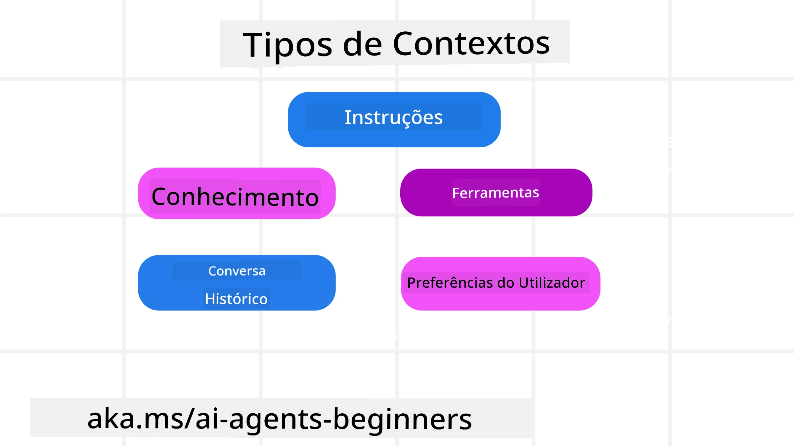
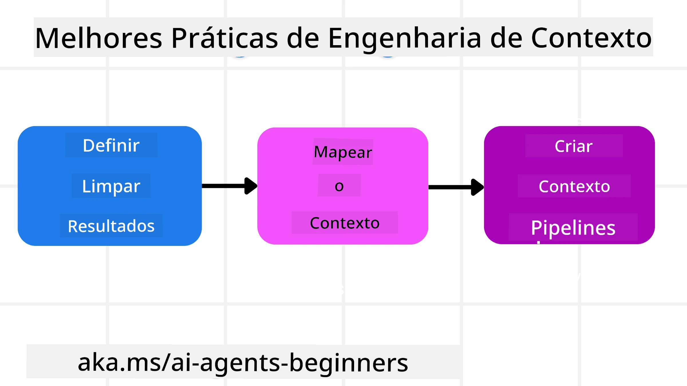

# Engenharia de Contexto para Agentes de IA

> _(Clique na imagem acima para assistir ao vídeo desta lição)_

Compreender a complexidade da aplicação para a qual está a construir um agente de IA é importante para criar um agente fiável. Precisamos de construir Agentes de IA que gerem eficazmente a informação para responder a necessidades complexas, para além da engenharia de prompts.

Nesta lição, vamos analisar o que é a engenharia de contexto e o seu papel na construção de agentes de IA.

## Introdução

Esta lição vai abordar:

• **O que é Engenharia de Contexto** e por que é diferente da engenharia de prompts.

• **Estratégias para uma Engenharia de Contexto eficaz**, incluindo como escrever, selecionar, comprimir e isolar informação.

• **Falhas comuns de contexto** que podem sabotar o seu agente de IA e como as corrigir.

## Objetivos de Aprendizagem

Após completar esta lição, saberá como:

• **Definir engenharia de contexto** e diferenciá-la da engenharia de prompts.

• **Identificar os componentes-chave do contexto** em aplicações de Modelos Linguísticos Grandes (LLM).

• **Aplicar estratégias para escrever, selecionar, comprimir e isolar contexto** para melhorar o desempenho do agente.

• **Reconhecer falhas comuns de contexto** como envenenamento, distração, confusão e conflito, e implementar técnicas de mitigação.

## O que é Engenharia de Contexto?

Para Agentes de IA, o contexto é o que orienta o planeamento para o agente tomar certas ações. Engenharia de Contexto é a prática de garantir que o Agente de IA tem a informação certa para completar o próximo passo da tarefa. A janela de contexto é limitada em tamanho, pelo que, como construtores de agentes, precisamos de criar sistemas e processos para gerir a adição, remoção e condensação da informação na janela de contexto.

### Engenharia de Prompt vs Engenharia de Contexto

A engenharia de prompt foca-se num conjunto único de instruções estáticas para guiar eficazmente os Agentes de IA com um conjunto de regras. A engenharia de contexto trata de gerir um conjunto dinâmico de informação, incluindo o prompt inicial, para garantir que o Agente de IA tem o que precisa ao longo do tempo. A ideia principal da engenharia de contexto é tornar esse processo repetível e fiável.

### Tipos de Contexto

É importante lembrar que contexto não é apenas uma coisa. A informação que o Agente de IA necessita pode vir de várias fontes diferentes, e cabe-nos garantir que o agente tem acesso a essas fontes:

Os tipos de contexto que um agente de IA poderá precisar de gerir incluem:

• **Instruções:** São como as "regras" do agente – prompts, mensagens do sistema, exemplos few-shot (mostrando à IA como fazer algo) e descrições das ferramentas que pode usar. Aqui é onde o foco da engenharia de prompts se cruza com a engenharia de contexto.

• **Conhecimento:** Inclui factos, informação recuperada de bases de dados, ou memórias de longo prazo que o agente acumulou. Isto inclui integrar um sistema Retrieval Augmented Generation (RAG) se um agente precisar de acesso a diferentes bases de conhecimento e bases de dados.

• **Ferramentas:** São as definições de funções externas, APIs e MCP Servers que o agente pode chamar, juntamente com o feedback (resultados) que obtém ao usá-las.

• **Histórico de Conversa:** O diálogo contínuo com um utilizador. Com o tempo, estas conversas tornam-se mais longas e complexas, o que significa que ocupam espaço na janela de contexto.

• **Preferências do Utilizador:** Informação aprendida sobre gostos ou aversões do utilizador ao longo do tempo. Estas podem ser armazenadas e utilizadas ao tomar decisões-chave para ajudar o utilizador.

## Estratégias para uma Engenharia de Contexto Eficaz

### Estratégias de Planeamento

Boa engenharia de contexto começa com um bom planeamento. Aqui está uma abordagem que o ajudará a começar a pensar em como aplicar o conceito de engenharia de contexto:

1. **Definir Resultados Claros** – Os resultados das tarefas que os Agentes de IA vão ser atribuídos devem estar claramente definidos. Responda à pergunta - "Como será o mundo quando o Agente de IA terminar a sua tarefa?" Ou seja, que mudança, informação, ou resposta o utilizador deve ter após interagir com o Agente de IA.
2. **Mapear o Contexto** – Depois de definir os resultados do Agente de IA, precisa responder à pergunta "Que informação é que o Agente de IA precisa para completar esta tarefa?". Assim, pode começar a mapear o contexto de onde essa informação pode ser encontrada.
3. **Criar Pipelines de Contexto** – Agora que sabe onde está a informação, precisa responder à pergunta "Como irá o Agente obter esta informação?". Isto pode ser feito de várias formas, incluindo RAG, uso de servidores MCP e outras ferramentas.

### Estratégias Práticas

O planeamento é importante, mas assim que a informação começar a entrar na janela de contexto do nosso agente, precisamos de ter estratégias práticas para a gerir:

#### Gestão do Contexto

Embora alguma informação seja adicionada automaticamente à janela de contexto, a engenharia de contexto consiste em assumir um papel mais ativo nesta informação, o que pode ser feito por algumas estratégias:

 1. **Bloco de Anotações do Agente**  
 Permite que um Agente de IA tome notas de informação relevante sobre as tarefas atuais e interações com o utilizador durante uma única sessão. Deve existir fora da janela de contexto, num ficheiro ou objeto de tempo de execução que o agente possa recuperar durante esta sessão, se necessário.

 2. **Memórias**  
 Os blocos de anotações são bons para gerir informação fora da janela de contexto de uma única sessão. Memórias permitem que os agentes armazenem e recuperem informação relevante entre múltiplas sessões. Isto pode incluir resumos, preferências do utilizador e feedback para melhorias futuras.

 3. **Comprimir Contexto**  
 Quando a janela de contexto cresce e se aproxima do seu limite, técnicas como sumarização e poda podem ser usadas. Inclui manter apenas a informação mais relevante ou remover mensagens mais antigas.

 4. **Sistemas Multi-Agente**  
 Desenvolver sistemas multi-agente é uma forma de engenharia de contexto porque cada agente tem a sua própria janela de contexto. Como esse contexto é partilhado e passado para diferentes agentes é outra coisa a planear na construção desses sistemas.

 5. **Ambientes de Sandbox**  
 Se um agente precisa executar algum código ou processar grandes quantidades de informação num documento, isto pode consumir muitos tokens para processar os resultados. Em vez de ter tudo armazenado na janela de contexto, o agente pode usar um ambiente sandbox capaz de executar esse código e apenas ler os resultados e outra informação relevante.

 6. **Objetos de Estado em Tempo de Execução**  
 Isto é feito criando contentores de informação para gerir situações em que o Agente precisa de ter acesso a certa informação. Para uma tarefa complexa, isto permitiria ao Agente armazenar os resultados de cada subtarefa passo a passo, permitindo que o contexto permaneça ligado apenas a essa subtarefa específica.

#### Inspeção do Contexto

Depois de aplicar uma destas estratégias, vale a pena verificar o que a próxima chamada ao modelo recebeu efetivamente. Uma questão útil para debugging é:

> O agente carregou demasiado contexto, o contexto errado, ou faltou-lhe contexto que precisava?

Não precisa de registar prompts brutos, saídas de ferramentas, ou conteúdos da memória para responder a essa questão. Em produção, prefira pequenos registos de inspeção de contexto que capturem contagens, ids, hashes e etiquetas de política:

- **Seleção:** Registe quantos fragmentos candidatos, ferramentas ou memórias foram considerados, quantos foram selecionados, e qual regra ou pontuação causou a filtragem dos outros.
- **Compressão:** Registe a gama de fonte ou id de rastreio, o id do sumário, uma estimativa de contagem de tokens antes e depois da compressão, e se o conteúdo bruto foi excluído da próxima chamada.
- **Isolamento:** Note qual subtarefa foi executada num agente separado, sessão, ou sandbox, que resumo limitado foi devolvido, e se grandes saídas de ferramentas permaneceram fora do contexto do agente pai.
- **Memória e RAG:** Armazene ids dos documentos recuperados, ids de memória, pontuações, ids selecionados e estado de redacção em vez do texto completo recuperado.
- **Segurança e privacidade:** Prefira hashes, ids, baldes de tokens e etiquetas de política em vez de texto sensível de prompts, argumentos de ferramentas, resultados de ferramentas ou conteúdos das memórias dos utilizadores.

O objetivo não é manter mais contexto. É deixar evidência suficiente para que um programador possa dizer qual estratégia de contexto foi usada e se alterou a próxima chamada ao modelo da forma pretendida.

### Exemplo de Engenharia de Contexto

Digamos que queremos que um agente de IA **"Reserve-me uma viagem para Paris."**

• Um agente simples usando apenas engenharia de prompts poderia simplesmente responder: **"Ok, quando quer ir para Paris?"**. Só processou a sua pergunta direta no momento em que o utilizador perguntou.

• Um agente que usa as estratégias de engenharia de contexto abordadas faria muito mais. Antes de responder, o seu sistema poderia:

  ◦ **Verificar o seu calendário** para datas disponíveis (recuperando dados em tempo real).

 ◦ **Recordar preferências de viagens passadas** (da memória de longo prazo) como companhia aérea preferida, orçamento ou se prefere voos diretos.

 ◦ **Identificar ferramentas disponíveis** para reserva de voos e hotéis.

- Depois, uma resposta de exemplo poderia ser: "Olá [O Seu Nome]! Vejo que está livre na primeira semana de outubro. Quer que procure voos diretos para Paris na [Companhia Aérea Preferida] dentro do seu orçamento habitual de [Orçamento]?". Esta resposta mais rica, consciente do contexto, demonstra o poder da engenharia de contexto.

## Falhas Comuns de Contexto

### Envenenamento do Contexto

**O que é:** Quando uma alucinação (informação falsa gerada pelo LLM) ou um erro entra no contexto e é repetidamente referenciada, levando o agente a perseguir objetivos impossíveis ou desenvolver estratégias absurdas.

**O que fazer:** Implementar **validação de contexto** e **quarentena**. Validar a informação antes de a adicionar à memória de longo prazo. Se for detectado potencial envenenamento, iniciar novos fios de contexto para evitar que a má informação se espalhe.

**Exemplo de Reserva de Viagem:** O seu agente alucina um **voo direto de um pequeno aeroporto local para uma cidade internacional distante** que na realidade não oferece voos internacionais. Este detalhe inexistente do voo é guardado no contexto. Mais tarde, quando pede ao agente para reservar, ele continua a tentar encontrar bilhetes para esta rota impossível, levando a erros repetidos.

**Solução:** Implementar uma etapa que **valide a existência e rotas do voo com uma API em tempo real** _antes_ de adicionar o detalhe do voo ao contexto ativo do agente. Se a validação falhar, a informação errada é "colocada em quarentena" e não usada mais.

### Distração do Contexto

**O que é:** Quando o contexto se torna tão grande que o modelo se foca demasiado no historial acumulado em vez de usar o que aprendeu durante o treino, levando a ações repetitivas ou inúteis. Os modelos podem começar a cometer erros mesmo antes da janela de contexto estar cheia.

**O que fazer:** Usar **sumarização de contexto**. Comprimir periodicamente a informação acumulada em resumos mais curtos, mantendo detalhes importantes e removendo historial redundante. Isto ajuda a "reiniciar" o foco.

**Exemplo de Reserva de Viagem:** Tem discutido vários destinos de sonho por muito tempo, incluindo uma narrativa detalhada da sua viagem de mochilão há dois anos. Quando finalmente pede para **"encontrar um voo barato para o próximo mês,"** o agente fica preso nos detalhes antigos e irrelevantes e continua a perguntar sobre o seu equipamento de mochilão ou itinerários passados, negligenciando o seu pedido atual.

**Solução:** Após um certo número de interações ou quando o contexto ficar demasiado grande, o agente deve **resumir as partes mais recentes e relevantes da conversa** – focando nas suas datas e destino de viagem atuais – e usar esse resumo condensado para a próxima chamada ao LLM, descartando a conversa histórica menos relevante.

### Confusão do Contexto

**O que é:** Quando contexto desnecessário, frequentemente sob a forma de muitas ferramentas disponíveis, faz o modelo gerar respostas más ou chamar ferramentas irrelevantes. Modelos mais pequenos são especialmente propensos a isto.

**O que fazer:** Implementar **gestão do conjunto de ferramentas** usando técnicas RAG. Armazenar descrições das ferramentas numa base de dados vetorial e selecionar _apenas_ as ferramentas mais relevantes para cada tarefa específica. A investigação mostra que limitar a seleção a menos de 30 ferramentas é eficaz.

**Exemplo de Reserva de Viagem:** O seu agente tem acesso a dezenas de ferramentas: `book_flight`, `book_hotel`, `rent_car`, `find_tours`, `currency_converter`, `weather_forecast`, `restaurant_reservations`, etc. Pergunta: **"Qual é a melhor forma de me deslocar em Paris?"** Devido ao número elevado de ferramentas, o agente fica confuso e tenta chamar `book_flight` _dentro_ de Paris, ou `rent_car` embora você prefira transportes públicos, porque as descrições das ferramentas podem sobrepor-se ou simplesmente não consegue discernir a melhor.

**Solução:** Usar **RAG sobre as descrições das ferramentas**. Quando pergunta sobre deslocação em Paris, o sistema recupera dinamicamente _apenas_ as ferramentas mais relevantes como `rent_car` ou `public_transport_info` com base na sua questão, apresentando um "conjunto" focado de ferramentas ao LLM.

### Conflito de Contexto

**O que é:** Quando existe informação conflitante no contexto, levando a raciocínio inconsistente ou respostas finais ruins. Isto acontece frequentemente quando a informação chega em fases e suposições iniciais incorretas ficam no contexto.

**O que fazer:** Usar **poda do contexto** e **descarregamento**. Poda significa remover informação obsoleta ou conflitante à medida que chegam novos dados. Descarregamento dá ao modelo um espaço de trabalho "bloco de notas" separado para processar informação sem sobrecarregar o contexto principal.
**Exemplo de Reserva de Viagem:** Inicialmente diz ao seu agente, **"Quero voar em classe económica."** Mais tarde, na conversa, muda de opinião e diz, **"Na verdade, para esta viagem, vamos em classe executiva."** Se ambas as instruções permanecerem no contexto, o agente pode receber resultados de pesquisa conflitantes ou ficar confuso sobre qual preferência priorizar.

**Solução:** Implemente **poda de contexto**. Quando uma nova instrução contradiz uma antiga, a instrução mais antiga é removida ou explicitamente substituída no contexto. Alternativamente, o agente pode usar um **bloco de notas** para conciliar preferências conflitantes antes de decidir, garantindo que apenas a instrução final e consistente guie as suas ações.

## Tem Mais Perguntas Sobre Engenharia de Contexto?

Junte-se ao [Microsoft Foundry Discord](https://aka.ms/ai-agents/discord) para encontrar outros aprendizes, participar em horas de atendimento e obter respostas às suas perguntas sobre Agentes de IA.

---

<!-- CO-OP TRANSLATOR DISCLAIMER START -->
**Aviso Legal**:
Este documento foi traduzido utilizando o serviço de tradução automática [Co-op Translator](https://github.com/Azure/co-op-translator). Embora nos esforcemos pela precisão, esteja ciente de que traduções automáticas podem conter erros ou imprecisões. O documento original na sua língua nativa deve ser considerado a fonte autorizada. Para informações críticas, recomenda-se tradução profissional humana. Não nos responsabilizamos por quaisquer mal-entendidos ou interpretações incorretas resultantes da utilização desta tradução.
<!-- CO-OP TRANSLATOR DISCLAIMER END -->