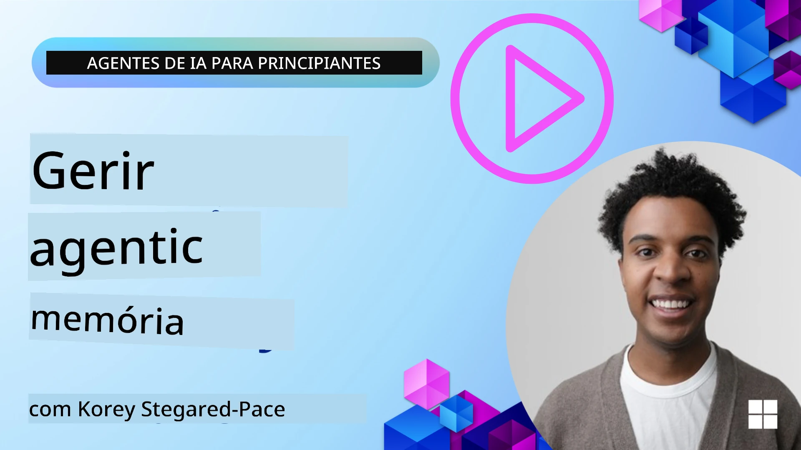

# Memória para Agentes de IA 

Ao discutir os benefícios únicos da criação de Agentes de IA, duas coisas são principalmente abordadas: a capacidade de chamar ferramentas para completar tarefas e a capacidade de melhorar ao longo do tempo. A memória está na base da criação de agentes autoaperfeiçoáveis que podem criar melhores experiências para os nossos utilizadores.

Nesta lição, vamos analisar o que é a memória para Agentes de IA e como podemos geri-la e usá-la em benefício das nossas aplicações.

## Introdução

Esta lição irá abordar:

• **Compreender a Memória dos Agentes de IA**: O que é a memória e porque é essencial para os agentes.

• **Implementar e Armazenar Memória**: Métodos práticos para adicionar capacidades de memória aos seus agentes de IA, focando na memória de curto e longo prazo.

• **Tornar Agentes de IA Autoaperfeiçoados**: Como a memória permite que os agentes aprendam com interações passadas e melhorem ao longo do tempo.

## Implementações Disponíveis

Esta lição inclui dois tutoriais completos em notebook:

• **[13-agent-memory.ipynb](./13-agent-memory.ipynb)**: Implementa memória usando Mem0 e Azure AI Search com Microsoft Agent Framework

• **[13-agent-memory-cognee.ipynb](./13-agent-memory-cognee.ipynb)**: Implementa memória estruturada usando Cognee, construindo automaticamente um grafo de conhecimento suportado por embeddings, visualizando o grafo, e recuperação inteligente

## Objetivos de Aprendizagem

Após completar esta lição, irá saber como:

• **Diferenciar entre vários tipos de memória de agentes de IA**, incluindo memória de trabalho, de curto prazo, e de longo prazo, bem como formas especializadas como memória de persona e episódica.

• **Implementar e gerir memória de curto e longo prazo para agentes de IA** usando o Microsoft Agent Framework, aproveitando ferramentas como Mem0, Cognee, memória Whiteboard, e integrando com Azure AI Search.

• **Compreender os princípios por detrás dos agentes de IA autoaperfeiçoados** e como sistemas robustos de gestão de memória contribuem para aprendizagem e adaptação contínuas.

## Compreender a Memória dos Agentes de IA

Na sua essência, **memória para agentes de IA refere-se aos mecanismos que lhes permitem reter e recordar informação**. Esta informação pode ser detalhes específicos sobre uma conversa, preferências do utilizador, ações passadas ou até padrões aprendidos.

Sem memória, as aplicações de IA são frequentemente sem estado, significando que cada interação começa do zero. Isto leva a uma experiência de utilizador repetitiva e frustrante onde o agente "esquece" o contexto ou preferências anteriores.

### Porque é que a Memória é Importante?

A inteligência de um agente está profundamente ligada à sua capacidade de recordar e usar informação passada. A memória permite que os agentes sejam:

• **Reflexivos**: Aprendendo com ações e resultados passados.

• **Interativos**: Mantendo contexto durante uma conversa em curso.

• **Proativos e Reativos**: Antecipando necessidades ou respondendo adequadamente com base em dados históricos.

• **Autónomos**: Operando de forma mais independente ao recorrer ao conhecimento armazenado.

O objetivo de implementar memória é tornar os agentes mais **fiáveis e capazes**.

### Tipos de Memória

#### Memória de Trabalho

Pense nisto como uma folha de rascunho que um agente usa durante uma única tarefa ou processo de pensamento em andamento. Ela guarda a informação imediata necessária para calcular o próximo passo.

Para agentes de IA, a memória de trabalho captura frequentemente a informação mais relevante de uma conversa, mesmo que o histórico completo do chat seja longo ou truncado. Foca-se em extrair elementos-chave como requisitos, propostas, decisões e ações.

**Exemplo de Memória de Trabalho**

Numa agente de reserva de viagens, a memória de trabalho pode capturar o pedido atual do utilizador, como "Quero reservar uma viagem para Paris". Este requisito específico é mantido no contexto imediato do agente para guiar a interação atual.

#### Memória de Curto Prazo

Este tipo de memória retém informação durante a duração de uma única conversa ou sessão. É o contexto do chat atual, permitindo que o agente se refira a mensagens anteriores no diálogo.

**Exemplo de Memória de Curto Prazo**

Se o utilizador pergunta, "Quanto custa um voo para Paris?" e depois continua com "E a acomodação lá?", a memória de curto prazo garante que o agente sabe que "lá" se refere a "Paris" na mesma conversa.

#### Memória de Longo Prazo

Esta é a informação que persiste ao longo de múltiplas conversas ou sessões. Permite que os agentes se lembrem de preferências do utilizador, interações históricas ou conhecimento geral por períodos prolongados. Isto é importante para personalização.

**Exemplo de Memória de Longo Prazo**

Uma memória de longo prazo pode guardar que "Ben gosta de esquiar e atividades ao ar livre, aprecia café com vista para a montanha e quer evitar pistas avançadas de esqui devido a uma lesão passada". Esta informação, aprendida em interações anteriores, influencia recomendações em futuras sessões de planeamento de viagens, tornando-as altamente personalizadas.

#### Memória de Persona

Este tipo especializado de memória ajuda um agente a desenvolver uma "personalidade" ou "persona" consistente. Permite que o agente se lembre de detalhes sobre si próprio ou o seu papel pretendido, tornando as interações mais fluidas e focadas.

**Exemplo de Memória de Persona**

Se o agente de viagens estiver desenhado para ser um "planeador especialista de esqui", a memória de persona pode reforçar este papel, influenciando as suas respostas para alinhar com o tom e conhecimento de um especialista.

#### Memória de Workflow/Episódica

Esta memória armazena a sequência de passos que um agente toma durante uma tarefa complexa, incluindo sucessos e falhas. É como lembrar "episódios" específicos ou experiências passadas para aprender com elas.

**Exemplo de Memória Episódica**

Se o agente tentou reservar um voo específico mas falhou devido a indisponibilidade, a memória episódica poderia registar esta falha, permitindo que o agente tente voos alternativos ou informe o utilizador sobre o problema de forma mais informada numa nova tentativa.

#### Memória de Entidade

Isto envolve extrair e lembrar entidades específicas (como pessoas, lugares ou coisas) e eventos das conversas. Permite que o agente construa uma compreensão estruturada dos elementos-chave discutidos.

**Exemplo de Memória de Entidade**

Numa conversa sobre uma viagem passada, o agente pode extrair "Paris", "Torre Eiffel" e "jantar no restaurante Le Chat Noir" como entidades. Numa interação futura, o agente pode recordar "Le Chat Noir" e oferecer-se para fazer uma nova reserva lá.

#### RAG Estruturado (Retrieval Augmented Generation)

Embora RAG seja uma técnica mais ampla, o "RAG Estruturado" é destacado como uma tecnologia poderosa de memória. Ele extrai informação densa e estruturada de várias fontes (conversas, emails, imagens) e usa-a para melhorar a precisão, recall e velocidade nas respostas. Ao contrário do RAG clássico que depende apenas da similaridade semântica, o RAG Estruturado trabalha com a estrutura inerente da informação.

**Exemplo de RAG Estruturado**

Em vez de apenas corresponder palavras-chave, o RAG Estruturado pode analisar detalhes de voo (destino, data, hora, companhia aérea) de um email e armazená-los de forma estruturada. Isto permite consultas precisas como "Que voo reservei para Paris na terça-feira?"

## Implementar e Armazenar Memória

Implementar memória para agentes de IA envolve um processo sistemático de **gestão de memória**, que inclui gerar, armazenar, recuperar, integrar, atualizar e até "esquecer" (ou eliminar) informação. A recuperação é um aspeto particularmente crucial.

### Ferramentas Especializadas de Memória

#### Mem0

Uma forma de armazenar e gerir memória de agentes é usando ferramentas especializadas como o Mem0. O Mem0 funciona como uma camada de memória persistente, permitindo que agentes recordem interações relevantes, armazenem preferências do utilizador e contexto factual, e aprendam com sucessos e falhas ao longo do tempo. A ideia aqui é que agentes sem estado se transformam em agentes com estado.

Funciona através de um **pipeline de memória em duas fases: extração e atualização**. Primeiro, mensagens adicionadas ao tópico de um agente são enviadas para o serviço Mem0, que usa um Large Language Model (LLM) para resumir o histórico da conversa e extrair novas memórias. Subsequentemente, uma fase de atualização conduzida por um LLM determina se deve adicionar, modificar ou eliminar estas memórias, armazenando-as numa base de dados híbrida que pode incluir vetores, grafos e bases de dados chave-valor. Este sistema também suporta vários tipos de memória e pode incorporar memória em grafo para gerir relações entre entidades.

#### Cognee

Outra abordagem poderosa é usar o **Cognee**, uma memória semântica open-source para agentes de IA que transforma dados estruturados e não estruturados em grafos de conhecimento pesquisáveis, suportados por embeddings. Cognee fornece uma **arquitetura de armazenamento dupla** que combina pesquisa por similaridade vetorial com relações em grafos, permitindo que agentes compreendam não apenas que informação é similar, mas como os conceitos se relacionam.

Excele na **recuperação híbrida** que combina similaridade vetorial, estrutura de grafo e raciocínio LLM - desde a consulta direta a fragmentos brutos até perguntas conscientes do grafo. O sistema mantém uma **memória viva** que evolui e cresce enquanto permanece pesquisável como um grafo conectado, suportando tanto o contexto de sessão de curto prazo quanto a memória persistente de longo prazo.

O tutorial em notebook Cognee ([13-agent-memory-cognee.ipynb](./13-agent-memory-cognee.ipynb)) demonstra a construção desta camada unificada de memória, com exemplos práticos de ingestão de fontes de dados diversas, visualização do grafo de conhecimento, e consultas com diferentes estratégias de pesquisa adaptadas às necessidades específicas do agente.

### Armazenar Memória com RAG

Para além de ferramentas especializadas como mem0, pode aproveitar serviços robustos de pesquisa como o **Azure AI Search como backend para armazenar e recuperar memórias**, especialmente para RAG estruturado.

Isto permite fundamentar as respostas do seu agente com os seus próprios dados, garantindo respostas mais relevantes e precisas. O Azure AI Search pode ser usado para armazenar memórias específicas de viagens de utilizadores, catálogos de produtos, ou qualquer outro conhecimento específico de domínio.

O Azure AI Search suporta capacidades como **RAG Estruturado**, que se destaca na extração e recuperação de informação densa e estruturada de grandes conjuntos de dados como históricos de conversa, emails ou até imagens. Isto fornece "precisão e recall sobre-humanos" em comparação com abordagens tradicionais baseadas em fragmentação de texto e embeddings.

## Tornar Agentes de IA Autoaperfeiçoados

Um padrão comum para agentes autoaperfeiçoados envolve a introdução de um **"agente de conhecimento"**. Este agente separado observa a conversa principal entre o utilizador e o agente primário. O seu papel é:

1. **Identificar informação valiosa**: Determinar se alguma parte da conversa vale a pena guardar como conhecimento geral ou como uma preferência específica do utilizador.

2. **Extrair e resumir**: Destilar o aprendizado ou preferência essencial da conversa.

3. **Armazenar numa base de conhecimento**: Persistir esta informação extraída, muitas vezes numa base de dados vetorial, para que possa ser recuperada posteriormente.

4. **Aumentar consultas futuras**: Quando o utilizador inicia uma nova consulta, o agente de conhecimento recupera informação relevante armazenada e adiciona-a ao prompt do utilizador, fornecendo contexto crucial ao agente primário (semelhante a RAG).

### Otimizações para Memória

• **Gestão de Latência**: Para evitar atrasar as interações do utilizador, pode ser usado inicialmente um modelo mais barato e rápido para verificar rapidamente se a informação merece ser armazenada ou recuperada, invocando o processo mais complexo de extração/recuperação apenas quando necessário.

• **Manutenção da Base de Conhecimento**: Para uma base de conhecimento crescente, informação menos usada pode ser movida para "armazém frio" para gerir custos.

## Tem Mais Perguntas Sobre a Memória de Agentes?

Junte-se ao [Microsoft Foundry Discord](https://aka.ms/ai-agents/discord) para conhecer outros aprendentes, participar em sessões de esclarecimento e obter respostas às suas dúvidas sobre Agentes de IA.

---

<!-- CO-OP TRANSLATOR DISCLAIMER START -->
**Aviso Legal**:  
Este documento foi traduzido utilizando o serviço de tradução por IA [Co-op Translator](https://github.com/Azure/co-op-translator). Apesar de nos esforçarmos para garantir a precisão, por favor tenha em conta que traduções automáticas podem conter erros ou imprecisões. O documento original no seu idioma nativo deve ser considerado a fonte autorizada. Para informações críticas, recomenda-se a tradução profissional humana. Não nos responsabilizamos por quaisquer mal-entendidos ou interpretações incorretas resultantes da utilização desta tradução.
<!-- CO-OP TRANSLATOR DISCLAIMER END -->