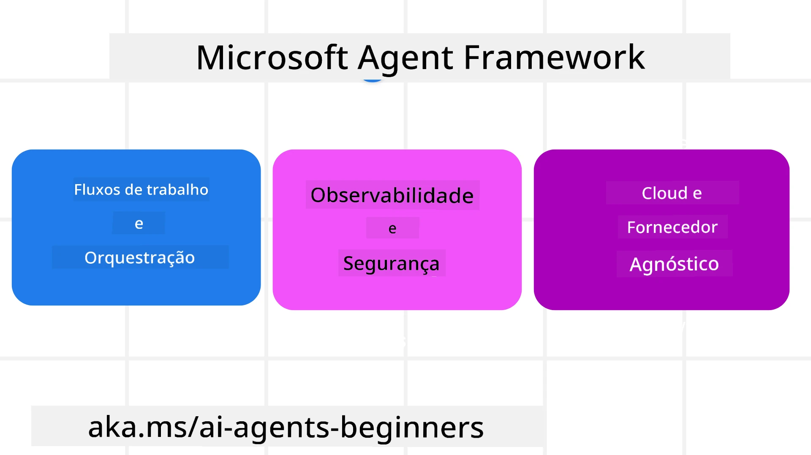
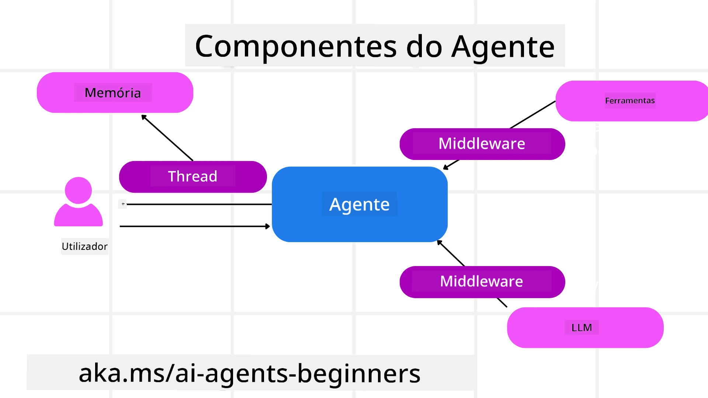

# Explorando o Microsoft Agent Framework


### Introdução

Esta lição irá cobrir:

- Compreender o Microsoft Agent Framework: Funcionalidades chave e valor  
- Explorar os Conceitos Principais do Microsoft Agent Framework
- Padrões Avançados do MAF: Fluxos de Trabalho, Middleware e Memória

## Objetivos de Aprendizagem

Depois de completar esta lição, saberá como:

- Construir Agentes de IA prontos para produção usando o Microsoft Agent Framework
- Aplicar as funcionalidades principais do Microsoft Agent Framework aos seus casos de uso baseados em agentes
- Usar padrões avançados incluindo fluxos de trabalho, middleware e observabilidade

## Exemplos de Código 

Os exemplos de código para [Microsoft Agent Framework (MAF)](https://aka.ms/ai-agents-beginners/agent-framewrok) podem ser encontrados neste repositório em `xx-python-agent-framework` e `xx-dotnet-agent-framework`.

## Compreender o Microsoft Agent Framework



[Microsoft Agent Framework (MAF)](https://aka.ms/ai-agents-beginners/agent-framewrok) é o framework unificado da Microsoft para construir agentes de IA. Oferece a flexibilidade para abordar a grande variedade de casos de uso baseados em agentes observados em ambientes de produção e investigação, incluindo:

- **Orquestração sequencial de agentes** em cenários onde são necessários fluxos de trabalho passo a passo.
- **Orquestração concorrente** em cenários onde os agentes precisam completar tarefas ao mesmo tempo.
- **Orquestração em chat de grupo** em cenários onde agentes podem colaborar juntos numa tarefa.
- **Orquestração de transferência (Handoff)** em cenários onde agentes passam a tarefa uns aos outros à medida que as subtarefas são concluídas.
- **Orquestração magnética** em cenários onde um agente gestor cria e modifica uma lista de tarefas e gere a coordenação dos subagentes para completar a tarefa.

Para entregar Agentes de IA em Produção, o MAF também inclui funcionalidades para:

- **Observabilidade** através do uso de OpenTelemetry onde cada ação do Agente de IA, incluindo invocação de ferramentas, passos de orquestração, fluxos de raciocínio e monitorização de desempenho, pode ser visualizada através de dashboards do Microsoft Foundry.
- **Segurança** ao hospedar agentes nativamente no Microsoft Foundry, que inclui controlos de segurança tais como controlo de acessos baseado em funções, gestão de dados privados e segurança de conteúdo integrada.
- **Durabilidade** uma vez que threads e fluxos de trabalho de agentes podem pausar, retomar e recuperar de erros, o que permite processos de maior duração.
- **Controlo** uma vez que fluxos de trabalho com intervenção humana são suportados, onde tarefas são marcadas como requerendo aprovação humana.

O Microsoft Agent Framework também está focado em ser interoperável através de:

- **Ser Cloud-agnostic** - Os agentes podem correr em containers, on-prem e através de várias clouds diferentes.
- **Ser Provider-agnostic** - Os agentes podem ser criados através do seu SDK preferido incluindo Azure OpenAI e OpenAI
- **Integrar Padrões Abertos** - Os agentes podem utilizar protocolos tais como Agent-to-Agent(A2A) e Model Context Protocol (MCP) para descobrir e usar outros agentes e ferramentas.
- **Plugins e Conectores** - Podem ser estabelecidas ligações a serviços de dados e memória tais como Microsoft Fabric, SharePoint, Pinecone e Qdrant.

Vamos ver como estas funcionalidades são aplicadas a alguns dos conceitos principais do Microsoft Agent Framework.

## Conceitos Principais do Microsoft Agent Framework

### Agentes



**Criar Agentes**

A criação de agentes é feita definindo o serviço de inferência (LLM Provider), um conjunto de instruções para o Agente de IA seguir, e um `name` atribuído:

```python
agent = AzureOpenAIChatClient(credential=AzureCliCredential()).create_agent( instructions="You are good at recommending trips to customers based on their preferences.", name="TripRecommender" )
```

O exemplo acima está a usar `Azure OpenAI`, mas os agentes podem ser criados usando uma variedade de serviços incluindo `Microsoft Foundry Agent Service`:

```python
AzureAIAgentClient(async_credential=credential).create_agent( name="HelperAgent", instructions="You are a helpful assistant." ) as agent
```

OpenAI `Responses`, `ChatCompletion` APIs

```python
agent = OpenAIResponsesClient().create_agent( name="WeatherBot", instructions="You are a helpful weather assistant.", )
```

```python
agent = OpenAIChatClient().create_agent( name="HelpfulAssistant", instructions="You are a helpful assistant.", )
```

ou agentes remotos usando o protocolo A2A:

```python
agent = A2AAgent( name=agent_card.name, description=agent_card.description, agent_card=agent_card, url="https://your-a2a-agent-host" )
```

**Executar Agentes**

Os agentes são executados usando os métodos `.run` ou `.run_stream` para respostas sem streaming ou em streaming.

```python
result = await agent.run("What are good places to visit in Amsterdam?")
print(result.text)
```

```python
async for update in agent.run_stream("What are the good places to visit in Amsterdam?"):
    if update.text:
        print(update.text, end="", flush=True)

```

Cada execução de agente também pode ter opções para personalizar parâmetros tais como `max_tokens` usados pelo agente, `tools` que o agente pode chamar, e até o próprio `model` usado pelo agente.

Isto é útil em casos onde modelos ou ferramentas específicas são necessários para completar a tarefa de um utilizador.

**Ferramentas**

As ferramentas podem ser definidas tanto ao definir o agente:

```python
def get_attractions( location: Annotated[str, Field(description="The location to get the top tourist attractions for")], ) -> str: """Get the top tourist attractions for a given location.""" return f"The top attractions for {location} are." 


# Ao criar um ChatAgent diretamente

agent = ChatAgent( chat_client=OpenAIChatClient(), instructions="You are a helpful assistant", tools=[get_attractions]

```

como também ao executar o agente:

```python

result1 = await agent.run( "What's the best place to visit in Seattle?", tools=[get_attractions] # Ferramenta fornecida apenas para esta execução )
```

**Threads de Agente**

Os Threads de Agente são usados para lidar com conversas multi-turno. Os threads podem ser criados de duas formas:

- Usando `get_new_thread()` que permite que o thread seja guardado ao longo do tempo
- Criando um thread automaticamente ao executar um agente e fazendo com que o thread dure apenas durante a execução atual.

Para criar um thread, o código é o seguinte:

```python
# Criar uma nova thread.
thread = agent.get_new_thread() # Executar o agente com a thread.
response = await agent.run("Hello, I am here to help you book travel. Where would you like to go?", thread=thread)

```

Pode então serializar o thread para ser armazenado para uso posterior:

```python
# Criar uma nova thread.
thread = agent.get_new_thread() 

# Executar o agente com a thread.

response = await agent.run("Hello, how are you?", thread=thread) 

# Serializar a thread para armazenamento.

serialized_thread = await thread.serialize() 

# Desserializar o estado da thread após o carregamento a partir do armazenamento.

resumed_thread = await agent.deserialize_thread(serialized_thread)
```

**Middleware de Agente**

Os agentes interagem com ferramentas e LLMs para completar as tarefas dos utilizadores. Em certos cenários, queremos executar ou rastrear interações entre estes. O middleware de agente permite-nos fazer isto através de:

*Middleware de Função*

Este middleware permite executar uma ação entre o agente e uma função/ferramenta que este irá chamar. Um exemplo de quando isto seria usado é quando se pretende efetuar algum registo (logging) na chamada da função.

No código abaixo, `next` define se o próximo middleware ou a função real deve ser chamado.

```python
async def logging_function_middleware(
    context: FunctionInvocationContext,
    next: Callable[[FunctionInvocationContext], Awaitable[None]],
) -> None:
    """Function middleware that logs function execution."""
    # Pré-processamento: Gravar no log antes da execução da função
    print(f"[Function] Calling {context.function.name}")

    # Continuar para o middleware seguinte ou para a execução da função
    await next(context)

    # Pós-processamento: Gravar no log após a execução da função
    print(f"[Function] {context.function.name} completed")
```

*Middleware de Chat*

Este middleware permite-nos executar ou registar uma ação entre o agente e os pedidos enviados ao LLM.

Isto contém informação importante como as `messages` que estão a ser enviadas ao serviço de IA.

```python
async def logging_chat_middleware(
    context: ChatContext,
    next: Callable[[ChatContext], Awaitable[None]],
) -> None:
    """Chat middleware that logs AI interactions."""
    # Pré-processamento: Registo antes da chamada à IA
    print(f"[Chat] Sending {len(context.messages)} messages to AI")

    # Continuar para o middleware seguinte ou serviço de IA
    await next(context)

    # Pós-processamento: Registo após a resposta da IA
    print("[Chat] AI response received")

```

**Memória do Agente**

Como abordado na lição `Agentic Memory`, a memória é um elemento importante para permitir que o agente opere sobre diferentes contextos. O MAF oferece vários tipos diferentes de memórias:

*Armazenamento em Memória*

Esta é a memória armazenada nos threads durante o tempo de execução da aplicação.

```python
# Criar uma nova thread.
thread = agent.get_new_thread() # Executar o agente com a thread.
response = await agent.run("Hello, I am here to help you book travel. Where would you like to go?", thread=thread)
```

*Mensagens Persistentes*

Esta memória é usada ao armazenar o histórico de conversas através de diferentes sessões. É definida utilizando o `chat_message_store_factory` :

```python
from agent_framework import ChatMessageStore

# Criar um repositório de mensagens personalizado
def create_message_store():
    return ChatMessageStore()

agent = ChatAgent(
    chat_client=OpenAIChatClient(),
    instructions="You are a Travel assistant.",
    chat_message_store_factory=create_message_store
)

```

*Memória Dinâmica*

Esta memória é adicionada ao contexto antes dos agentes serem executados. Estas memórias podem ser armazenadas em serviços externos tais como mem0:

```python
from agent_framework.mem0 import Mem0Provider

# Usar o Mem0 para capacidades avançadas de memória
memory_provider = Mem0Provider(
    api_key="your-mem0-api-key",
    user_id="user_123",
    application_id="my_app"
)

agent = ChatAgent(
    chat_client=OpenAIChatClient(),
    instructions="You are a helpful assistant with memory.",
    context_providers=memory_provider
)

```

**Observabilidade do Agente**

A observabilidade é importante para construir sistemas agentivos fiáveis e fáceis de manter. O MAF integra-se com o OpenTelemetry para fornecer tracing e métricas para melhor observabilidade.

```python
from agent_framework.observability import get_tracer, get_meter

tracer = get_tracer()
meter = get_meter()
with tracer.start_as_current_span("my_custom_span"):
    # fazer algo
    pass
counter = meter.create_counter("my_custom_counter")
counter.add(1, {"key": "value"})
```

### Fluxos de Trabalho

O MAF oferece fluxos de trabalho que são passos pré-definidos para completar uma tarefa e que incluem agentes de IA como componentes desses passos.

Os fluxos de trabalho são compostos por diferentes componentes que permitem um melhor fluxo de controlo. Os fluxos de trabalho também permitem **orquestração multi-agente** e **checkpointing** para guardar estados do fluxo de trabalho.

Os componentes principais de um fluxo de trabalho são:

**Executores**

Os executores recebem mensagens de entrada, realizam as tarefas atribuídas e depois produzem uma mensagem de saída. Isto faz avançar o fluxo de trabalho em direção à conclusão da tarefa maior. Os executores podem ser um agente de IA ou lógica personalizada.

**Arestas**

As arestas são usadas para definir o fluxo de mensagens num fluxo de trabalho. Estas podem ser:

*Arestas Diretas* - Ligações simples um-para-um entre executores:

```python
from agent_framework import WorkflowBuilder

builder = WorkflowBuilder()
builder.add_edge(source_executor, target_executor)
builder.set_start_executor(source_executor)
workflow = builder.build()
```

*Arestas Condicionais* - Ativadas depois de determinada condição ser satisfeita. Por exemplo, quando quartos de hotel não estão disponíveis, um executor pode sugerir outras opções.

*Arestas switch-case* - Encaminham mensagens para diferentes executores com base em condições definidas. Por exemplo, se um cliente de viagem tiver acesso prioritário e as suas tarefas forem tratadas através de outro fluxo de trabalho.

*Arestas Fan-out* - Enviam uma mensagem para múltiplos destinos.

*Arestas Fan-in* - Reúnem múltiplas mensagens de diferentes executores e enviam para um destino.

**Eventos**

Para providenciar melhor observabilidade nos fluxos de trabalho, o MAF oferece eventos integrados para execução incluindo:

- `WorkflowStartedEvent`  - A execução do workflow inicia
- `WorkflowOutputEvent` - O workflow produz uma saída
- `WorkflowErrorEvent` - O workflow encontra um erro
- `ExecutorInvokeEvent`  - O executor começa a processar
- `ExecutorCompleteEvent`  -  O executor termina o processamento
- `RequestInfoEvent` - É emitido um pedido

## Padrões Avançados do MAF

As secções acima cobrem os conceitos chave do Microsoft Agent Framework. À medida que constrói agentes mais complexos, aqui estão alguns padrões avançados a considerar:

- **Composição de Middleware**: Encadear múltiplos manipuladores de middleware (registo, autenticação, limitação de taxa) usando middleware de função e de chat para um controlo pormenorizado do comportamento do agente.
- **Checkpointing de Workflows**: Usar eventos de workflow e serialização para guardar e retomar processos de agentes de longa duração.
- **Seleção Dinâmica de Ferramentas**: Combinar RAG sobre descrições de ferramentas com o registo de ferramentas do MAF para apresentar apenas as ferramentas relevantes por consulta.
- **Transferência Multiagente**: Usar arestas de workflow e encaminhamento condicional para orquestrar transferências entre agentes especializados.

## Exemplos de Código 

Os exemplos de código para Microsoft Agent Framework podem ser encontrados neste repositório em `xx-python-agent-framework` e `xx-dotnet-agent-framework`.

## Tem Mais Perguntas Sobre o Microsoft Agent Framework?

Junte-se ao [Discord da Microsoft Foundry](https://aka.ms/ai-agents/discord) para encontrar outros aprendizes, participar em horas de atendimento e obter respostas às suas perguntas sobre agentes de IA.

---

<!-- CO-OP TRANSLATOR DISCLAIMER START -->
Aviso legal:
Este documento foi traduzido utilizando o serviço de tradução por IA Co-op Translator (https://github.com/Azure/co-op-translator). Embora nos esforcemos por garantir a precisão, esteja ciente de que traduções automatizadas podem conter erros ou imprecisões. O documento original, na sua língua original, deve ser considerado a fonte oficial. Para informações críticas, recomenda-se uma tradução humana profissional. Não nos responsabilizamos por quaisquer mal-entendidos ou interpretações incorretas decorrentes da utilização desta tradução.
<!-- CO-OP TRANSLATOR DISCLAIMER END -->