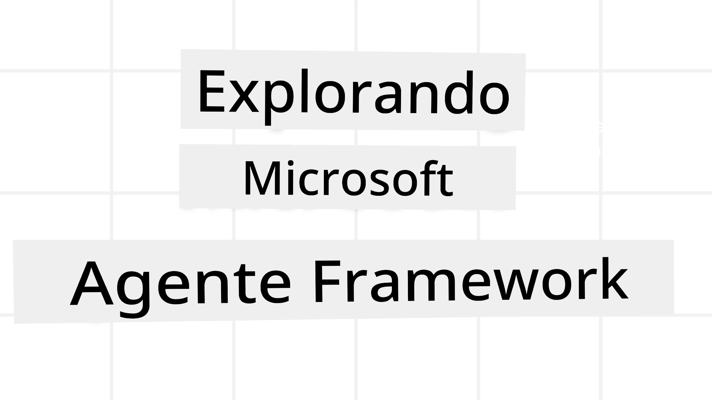
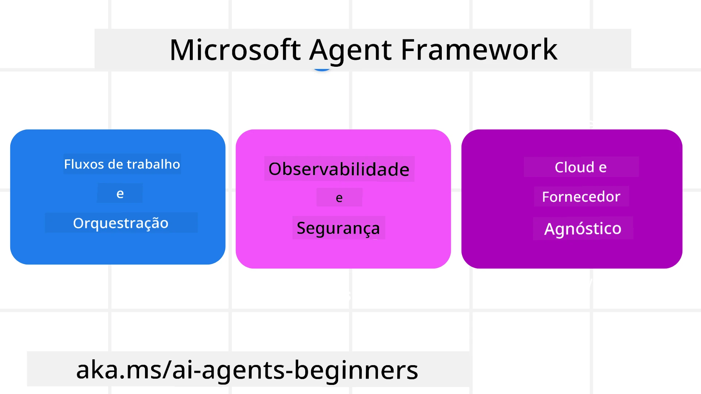
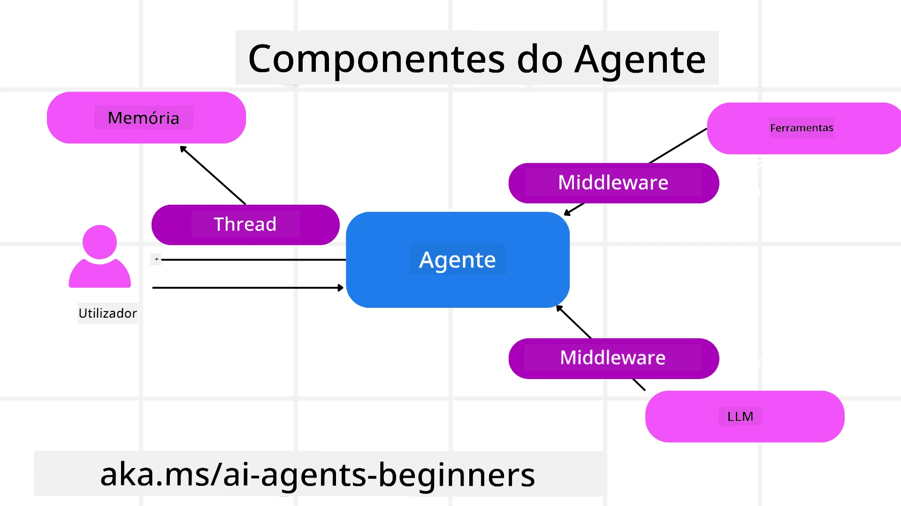

# Explorando o Microsoft Agent Framework



### Introdução

Esta lição irá abranger:

- Compreender o Microsoft Agent Framework: Principais Funcionalidades e Valor  
- Explorar os Conceitos-Chave do Microsoft Agent Framework
- Padrões Avançados do MAF: Fluxos de Trabalho, Middleware e Memória

## Objetivos de Aprendizagem

Após completar esta lição, você saberá como:

- Construir Agentes de IA Prontos para Produção usando o Microsoft Agent Framework
- Aplicar as funcionalidades principais do Microsoft Agent Framework aos seus Casos de Uso Agenticos
- Usar padrões avançados incluindo fluxos de trabalho, middleware e observabilidade

## Exemplos de Código 

Exemplos de código para [Microsoft Agent Framework (MAF)](https://learn.microsoft.com/en-us/agent-framework/overview/?wt.mc_id=youtube_26688_organicsocial_reactor&pivots=programming-language-python) podem ser encontrados neste repositório nos ficheiros `xx-python-agent-framework` e `xx-dotnet-agent-framework`.

## Compreendendo o Microsoft Agent Framework



[Microsoft Agent Framework (MAF)](https://learn.microsoft.com/en-us/agent-framework/overview/?wt.mc_id=youtube_26688_organicsocial_reactor&pivots=programming-language-python) é o framework unificado da Microsoft para construir agentes de IA. Oferece a flexibilidade para abordar a grande variedade de casos de uso agenticos vistos tanto em ambientes de produção como de pesquisa, incluindo:

- **Orquestração Sequencial de Agentes** em cenários onde são necessários fluxos de trabalho passo a passo.
- **Orquestração Concorrente** em cenários onde os agentes precisam completar tarefas ao mesmo tempo.
- **Orquestração de Chat em Grupo** em cenários onde os agentes podem colaborar juntos numa única tarefa.
- **Orquestração de Transferência** em cenários onde os agentes passam a tarefa uns aos outros à medida que as subtarefas são concluídas.
- **Orquestração Magnética** em cenários onde um agente gestor cria e modifica uma lista de tarefas e gere a coordenação dos subagentes para concluir a tarefa.

Para entregar Agentes de IA em Produção, o MAF inclui também funcionalidades para:

- **Observabilidade** através do uso do OpenTelemetry onde cada ação do Agente de IA, incluindo invocação de ferramentas, passos de orquestração, fluxos de raciocínio e monitorização de desempenho através dos dashboards do Microsoft Foundry.
- **Segurança** ao alojar agentes nativamente no Microsoft Foundry, que inclui controlos de segurança como acesso baseado em papéis, tratamento de dados privados e segurança de conteúdo incorporada.
- **Durabilidade** pois os fios e fluxos de trabalho do Agente podem pausar, retomar e recuperar de erros, permitindo processos de maior duração.
- **Controlo** pois são suportados fluxos de trabalho com intervenção humana onde as tarefas ficam marcadas como requerendo aprovação humana.

O Microsoft Agent Framework também está focado em ser interoperável através de:

- **Ser Cloud-agnóstico** - Agentes podem correr em containers, em instalações locais e em múltiplas clouds diferentes.
- **Ser Provider-agnóstico** - Os agentes podem ser criados através do seu SDK preferido incluindo Azure OpenAI e OpenAI
- **Integrar Padrões Abertos** - Agentes podem utilizar protocolos como Agent-to-Agent (A2A) e Model Context Protocol (MCP) para descobrir e usar outros agentes e ferramentas.
- **Plugins e Conectores** - Podem estabelecer-se ligações a serviços de dados e memória como Microsoft Fabric, SharePoint, Pinecone e Qdrant.

Vamos ver como estas funcionalidades são aplicadas a alguns dos conceitos-chave do Microsoft Agent Framework.

## Conceitos-Chave do Microsoft Agent Framework

### Agentes



**Criar Agentes**

A criação do agente é feita definindo o serviço de inferência (Fornecedor LLM), um 
conjunto de instruções para o Agente de IA seguir, e um `nome` atribuído:

```python
agent = AzureOpenAIChatClient(credential=AzureCliCredential()).create_agent( instructions="You are good at recommending trips to customers based on their preferences.", name="TripRecommender" )
```

O acima utiliza `Azure OpenAI`, mas agentes podem ser criados usando uma variedade de serviços incluindo o `Microsoft Foundry Agent Service`:

```python
AzureAIAgentClient(async_credential=credential).create_agent( name="HelperAgent", instructions="You are a helpful assistant." ) as agent
```

APIs OpenAI `Responses`, `ChatCompletion`

```python
agent = OpenAIResponsesClient().create_agent( name="WeatherBot", instructions="You are a helpful weather assistant.", )
```

```python
agent = OpenAIChatClient().create_agent( name="HelpfulAssistant", instructions="You are a helpful assistant.", )
```

ou [MiniMax](https://platform.minimaxi.com/), que fornece uma API compatível com OpenAI com grandes janelas de contexto (até 204K tokens):

```python
agent = OpenAIChatClient(base_url="https://api.minimax.io/v1", api_key=os.environ["MINIMAX_API_KEY"], model_id="MiniMax-M3").create_agent( name="HelpfulAssistant", instructions="You are a helpful assistant.", )
```

ou agentes remotos usando o protocolo A2A:

```python
agent = A2AAgent( name=agent_card.name, description=agent_card.description, agent_card=agent_card, url="https://your-a2a-agent-host" )
```

**Executar Agentes**

Agentes são executados usando os métodos `.run` ou `.run_stream` para respostas não transmitidas ou transmitidas.

```python
result = await agent.run("What are good places to visit in Amsterdam?")
print(result.text)
```

```python
async for update in agent.run_stream("What are the good places to visit in Amsterdam?"):
    if update.text:
        print(update.text, end="", flush=True)

```

Cada execução de agente pode também ter opções para personalizar parâmetros como `max_tokens` usados pelo agente, `tools` que o agente pode chamar, e até mesmo o `model` usado pelo agente.

Isto é útil em casos onde modelos ou ferramentas específicas são necessárias para completar a tarefa do utilizador.

**Ferramentas**

As ferramentas podem ser definidas tanto ao criar o agente:

```python
def get_attractions( location: Annotated[str, Field(description="The location to get the top tourist attractions for")], ) -> str: """Get the top tourist attractions for a given location.""" return f"The top attractions for {location} are." 


# Ao criar um ChatAgent diretamente

agent = ChatAgent( chat_client=OpenAIChatClient(), instructions="You are a helpful assistant", tools=[get_attractions]

```

como ao executar o agente:

```python

result1 = await agent.run( "What's the best place to visit in Seattle?", tools=[get_attractions] # Ferramenta fornecida apenas para esta execução )
```

**Fios de Agente**

Fios de agente são usados para gerir conversas com múltiplos turnos. Fios podem ser criados por:

- Usar `get_new_thread()` que permite que o fio seja guardado ao longo do tempo
- Criar um fio automaticamente ao executar um agente, onde o fio só dura durante a execução atual.

Para criar um fio, o código é assim:

```python
# Criar uma nova thread.
thread = agent.get_new_thread() # Executar o agente com a thread.
response = await agent.run("Hello, I am here to help you book travel. Where would you like to go?", thread=thread)

```

Pode depois serializar o fio para ser guardado para uso posterior:

```python
# Criar uma nova thread.
thread = agent.get_new_thread() 

# Executar o agente com a thread.

response = await agent.run("Hello, how are you?", thread=thread) 

# Serializar a thread para armazenamento.

serialized_thread = await thread.serialize() 

# Desserializar o estado da thread após carregar do armazenamento.

resumed_thread = await agent.deserialize_thread(serialized_thread)
```

**Middleware de Agente**

Agentes interagem com ferramentas e LLMs para completar tarefas do utilizador. Em certos cenários queremos executar ou registar algo entre estas interações. Middleware de agente permite fazer isso através de:

*Middleware de Função*

Este middleware permite executar uma ação entre o agente e uma função/ferramenta que será chamada. Um exemplo de uso é quando se quer registar algo na chamada da função.

No código abaixo, `next` define se o middleware seguinte ou a função real deve ser chamada.

```python
async def logging_function_middleware(
    context: FunctionInvocationContext,
    next: Callable[[FunctionInvocationContext], Awaitable[None]],
) -> None:
    """Function middleware that logs function execution."""
    # Pré-processamento: Registar antes da execução da função
    print(f"[Function] Calling {context.function.name}")

    # Continuar para o próximo middleware ou execução da função
    await next(context)

    # Pós-processamento: Registar após a execução da função
    print(f"[Function] {context.function.name} completed")
```

*Middleware de Chat*

Este middleware permite executar ou registar uma ação entre o agente e os pedidos entre o LLM.

Contém informações importantes como as `messages` que estão a ser enviadas ao serviço de IA.

```python
async def logging_chat_middleware(
    context: ChatContext,
    next: Callable[[ChatContext], Awaitable[None]],
) -> None:
    """Chat middleware that logs AI interactions."""
    # Pré-processamento: Registar antes da chamada AI
    print(f"[Chat] Sending {len(context.messages)} messages to AI")

    # Continuar para o próximo middleware ou serviço AI
    await next(context)

    # Pós-processamento: Registar após a resposta da AI
    print("[Chat] AI response received")

```

**Memória do Agente**

Como abordado na lição `Agentic Memory`, a memória é um elemento importante para permitir que o agente opere sobre diferentes contextos. O MAF oferece vários tipos diferentes de memórias:

*Armazenamento em Memória*

Esta é a memória armazenada nos fios durante o tempo de execução da aplicação.

```python
# Crie uma nova thread.
thread = agent.get_new_thread() # Execute o agente com a thread.
response = await agent.run("Hello, I am here to help you book travel. Where would you like to go?", thread=thread)
```

*Mensagens Persistentes*

Esta memória é usada para armazenar o histórico de conversas ao longo de diferentes sessões. É definida usando o `chat_message_store_factory`:

```python
from agent_framework import ChatMessageStore

# Criar um armazenamento de mensagens personalizado
def create_message_store():
    return ChatMessageStore()

agent = ChatAgent(
    chat_client=OpenAIChatClient(),
    instructions="You are a Travel assistant.",
    chat_message_store_factory=create_message_store
)

```

*Memória Dinâmica*

Esta memória é adicionada ao contexto antes dos agentes serem executados. Estas memórias podem ser armazenadas em serviços externos como mem0:

```python
from agent_framework.mem0 import Mem0Provider

# A usar Mem0 para funcionalidades avançadas de memória
memory_provider = Mem0Provider(
    api_key="your-mem0-api-key",
    user_id="user_123",
    application_id="my_app"
)

agent = ChatAgent(
    chat_client=OpenAIChatClient(),
    instructions="You are a helpful assistant with memory.",
    context_providers=memory_provider
)

```

**Observabilidade do Agente**

A observabilidade é importante para construir sistemas agenticos fiáveis e manuteníveis. O MAF integra-se com OpenTelemetry para fornecer tracing e métricas para melhor observabilidade.

```python
from agent_framework.observability import get_tracer, get_meter

tracer = get_tracer()
meter = get_meter()
with tracer.start_as_current_span("my_custom_span"):
    # fazer algo
    pass
counter = meter.create_counter("my_custom_counter")
counter.add(1, {"key": "value"})
```

### Fluxos de Trabalho

O MAF oferece fluxos de trabalho que são passos pré-definidos para completar uma tarefa e incluem agentes de IA como componentes nesses passos.

Os fluxos de trabalho são constituídos por diferentes componentes que permitem melhor controlo do fluxo. Os fluxos de trabalho também permitem **orquestração multi-agente** e **checkpointing** para guardar estados do fluxo de trabalho.

Os componentes principais de um fluxo de trabalho são:

**Executores**

Os executores recebem mensagens de entrada, executam as tarefas que lhes são atribuídas, e produzem uma mensagem de saída. Isto move o fluxo de trabalho para a conclusão da tarefa maior. Os executores podem ser agentes de IA ou lógica personalizada.

**Arestas**

As arestas são usadas para definir o fluxo das mensagens num fluxo de trabalho. Estas podem ser:

*Arestas Diretas* - Ligações simples um-para-um entre executores:

```python
from agent_framework import WorkflowBuilder

builder = WorkflowBuilder()
builder.add_edge(source_executor, target_executor)
builder.set_start_executor(source_executor)
workflow = builder.build()
```

*Arestas Condicionais* - Ativadas após uma certa condição ser satisfeita. Por exemplo, quando quartos de hotel não estão disponíveis, um executor pode sugerir outras opções.

*Arestas Switch-case* - Encaminham mensagens para diferentes executores baseados em condições definidas. Por exemplo, se um cliente de viagens tem acesso prioritário, as suas tarefas serão tratadas através de outro fluxo de trabalho.

*Arestas Fan-out* - Enviam uma mensagem para múltiplos destinos.

*Arestas Fan-in* - Recolhem múltiplas mensagens de executores diferentes e enviam para um destino.

**Eventos**

Para proporcionar melhor observabilidade dos fluxos de trabalho, o MAF oferece eventos incorporados para execução incluindo:

- `WorkflowStartedEvent`  - Execução do fluxo de trabalho começa
- `WorkflowOutputEvent` - Fluxo de trabalho produz uma saída
- `WorkflowErrorEvent` - Fluxo de trabalho encontra um erro
- `ExecutorInvokeEvent`  - Executor começa a processar
- `ExecutorCompleteEvent`  - Executor termina processamento
- `RequestInfoEvent` - Um pedido é emitido

## Padrões Avançados do MAF

As secções acima abrangem os conceitos-chave do Microsoft Agent Framework. À medida que constrói agentes mais complexos, aqui estão alguns padrões avançados a considerar:

- **Composição de Middleware**: Encadear múltiplos manipuladores middleware (registo, autenticação, limitação de taxa) usando middleware de função e chat para controle refinado sobre o comportamento do agente.
- **Checkpointing de Fluxo de Trabalho**: Usar eventos do fluxo de trabalho e serialização para guardar e retomar processos de agente longos.
- **Seleção Dinâmica de Ferramentas**: Combinar RAG sobre descrições de ferramentas com o registo de ferramentas do MAF para apresentar apenas as ferramentas relevantes por consulta.
- **Transferência Multi-Agente**: Usar arestas do fluxo de trabalho e encaminhamento condicional para orquestrar transferências entre agentes especializados.

## Alojamento de Agentes LangChain / LangGraph no Microsoft Foundry

O Microsoft Agent Framework é **interoperável entre frameworks** — não está limitado a agentes escritos com MAF. Se já tem um agente construído com **LangChain** ou **LangGraph**, pode executá-lo como um **agente alojado no Microsoft Foundry** para que o Foundry gere o runtime, sessões, escalamento, identidade e endpoints do protocolo para si, enquanto a sua lógica de agente permanece em LangGraph.

Isto é feito com o pacote `langchain_azure_ai.agents.hosting`, que expõe um grafo LangGraph compilado sobre os mesmos protocolos usados pelos agentes alojados no Foundry.

**1. Instale o extra de alojamento:**

```bash
pip install -U "langchain-azure-ai[hosting]>=1.2.4" azure-identity
```

O extra `hosting` instala as bibliotecas dos protocolos Foundry: `azure-ai-agentserver-responses` (o endpoint `/responses` compatível com OpenAI) e `azure-ai-agentserver-invocations` (o endpoint genérico `/invocations`).

**2. Escolha um protocolo de alojamento:**

| Protocolo | Classe Host | Endpoint | Utilização Quando |
|----------|-------------|----------|-------------|
| **Responses** | `ResponsesHostServer` | `/responses` | Quer chat compatível com OpenAI, streaming, histórico de respostas, e encadeamento de conversas — o recomendado por defeito para agentes conversacionais. |
| **Invocations** | `InvocationsHostServer` | `/invocations` | Precisa de uma forma JSON personalizada, um endpoint estilo webhook, ou processamento não conversacional. |

Porque a **API Responses é a API principal para desenvolvimento ao estilo agente no Foundry**, comece com `ResponsesHostServer` para a maioria dos agentes.

**3. Configure as variáveis de ambiente** (`az login` primeiro para `DefaultAzureCredential` autenticar):

```bash
export FOUNDRY_PROJECT_ENDPOINT="https://<resource>.services.ai.azure.com/api/projects/<project>"
export FOUNDRY_MODEL_NAME="gpt-5-mini"
```

Quando o agente for depois executado como um agente alojado no Foundry, a plataforma injeta automaticamente `FOUNDRY_PROJECT_ENDPOINT`.

**4. Exponha um agente LangGraph sobre o protocolo Responses:**

```python
import os

from azure.ai.projects import AIProjectClient
from azure.identity import DefaultAzureCredential, get_bearer_token_provider
from langchain.agents import create_agent
from langchain_openai import ChatOpenAI
from langchain_azure_ai.agents.hosting import ResponsesHostServer

_AZURE_AI_SCOPE = "https://ai.azure.com/.default"


def build_chat_model() -> ChatOpenAI:
    project_endpoint = os.environ["FOUNDRY_PROJECT_ENDPOINT"].rstrip("/")
    deployment = os.environ.get("FOUNDRY_MODEL_NAME", "gpt-5-mini")
    credential = DefaultAzureCredential()
    project = AIProjectClient(endpoint=project_endpoint, credential=credential)
    openai_client = project.get_openai_client()
    token_provider = get_bearer_token_provider(credential, _AZURE_AI_SCOPE)

    # O ChatOpenAI aqui direciona para o endpoint compatível com OpenAI (Respostas) do projeto Foundry.
    return ChatOpenAI(
        model=deployment,
        base_url=str(openai_client.base_url),
        api_key=token_provider,
    )


def main() -> None:
    graph = create_agent(build_chat_model(), tools=[])
    port = int(os.environ.get("PORT", "8088"))
    ResponsesHostServer(graph).run(port=port)


if __name__ == "__main__":
    main()
```

Execute localmente com `python main.py`, depois envie um pedido Responses para `http://localhost:8088/responses`.

**Comportamentos-chave:**

- **Conversas**: Clientes continuam uma conversa passando `previous_response_id` ou um ID `conversation`. Se o seu grafo estiver compilado com um checkpointer LangGraph, o Foundry associa o estado da conversa ao checkpoint (use um checkpointer durável em produção; `MemorySaver` é suficiente para testes locais).
- **Intervenção Humana**: Se o seu grafo usar `interrupt()` do LangGraph, o `ResponsesHostServer` apresenta a interrupção pendente como um item `function_call` / `mcp_approval_request` do Responses, e os clientes retomam com um `function_call_output` / `mcp_approval_response` correspondente.
- **Desplegar no Foundry**: Use o Azure Developer CLI — `azd ext install azure.ai.agents`, `azd ai agent init -m <manifest>`, `azd ai agent run` (local, requer Docker), depois `azd provision` e `azd deploy`. O deployment de agentes alojados requer o papel **Foundry Project Manager**.

Uma versão executável deste exemplo está em [code-samples/14-langchain-hosted-agent.py](../../../14-microsoft-agent-framework/code-samples/14-langchain-hosted-agent.py). Para o guia completo (protocolo Invocations, esquemas de pedido personalizados e resolução de problemas), veja [Host LangGraph agents as Foundry hosted agents](https://learn.microsoft.com/azure/foundry/how-to/develop/langchain-hosted-agents).

## Exemplos de Código 

Exemplos de código para Microsoft Agent Framework podem ser encontrados neste repositório nos ficheiros `xx-python-agent-framework` e `xx-dotnet-agent-framework`.

## Tem Mais Perguntas Sobre o Microsoft Agent Framework?

Junte-se ao [Microsoft Foundry Discord](https://discord.com/invite/ATgtXmAS5D) para encontrar outros aprendizes, participar em horas de expediente e obter respostas para as suas perguntas sobre Agentes de IA.
## Lição Anterior

[Memória para Agentes de IA](../13-agent-memory/README.md)

## Próxima Lição

[Construir Agentes de Uso de Computador (CUA)](../15-browser-use/README.md)

---

<!-- CO-OP TRANSLATOR DISCLAIMER START -->
**Aviso Legal**:
Este documento foi traduzido utilizando o serviço de tradução automática [Co-op Translator](https://github.com/Azure/co-op-translator). Embora nos esforcemos pela precisão, esteja ciente de que traduções automáticas podem conter erros ou imprecisões. O documento original na sua língua nativa deve ser considerado a fonte autorizada. Para informações críticas, recomenda-se tradução profissional humana. Não nos responsabilizamos por quaisquer mal-entendidos ou interpretações incorretas resultantes da utilização desta tradução.
<!-- CO-OP TRANSLATOR DISCLAIMER END -->