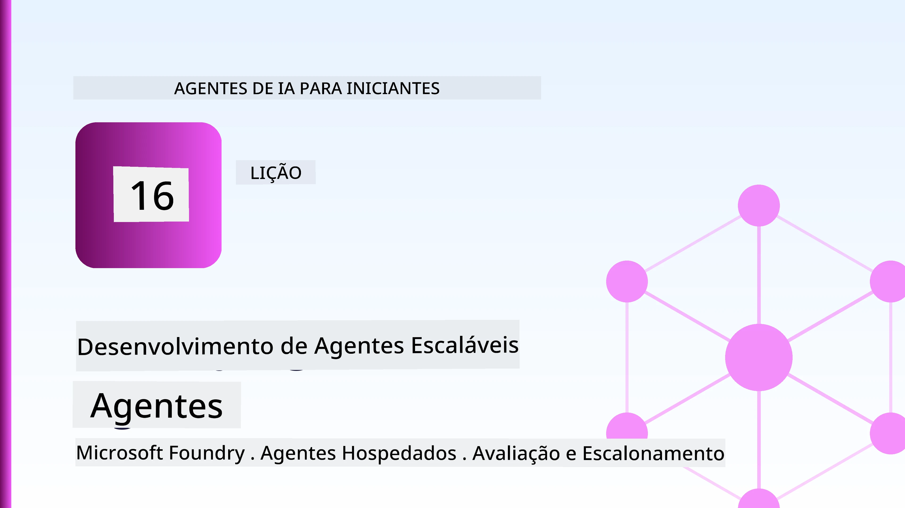
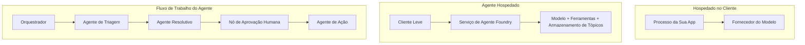
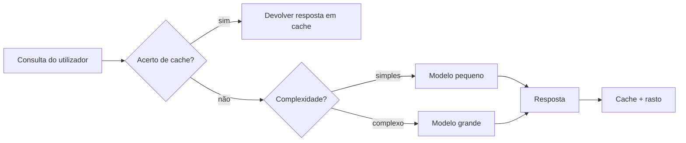
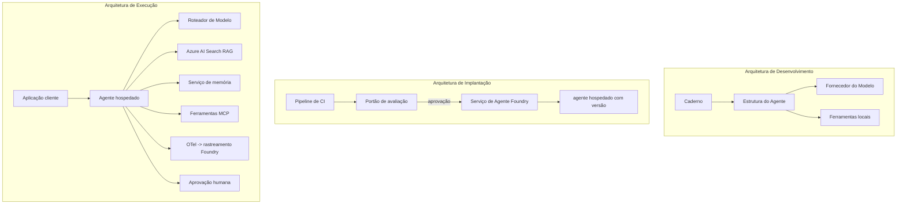

# Desdobramento de Agentes Escaláveis com o Microsoft Foundry



Até este ponto do curso, construiu agentes que correm no seu portátil, dentro de um notebook, guiados por `az login` e um punhado de variáveis de ambiente. Essa é exatamente a forma correta de aprender. Não é a forma correta de executar um agente do qual milhares de clientes dependem às 3 da manhã.

Esta lição trata da lacuna entre "funciona na minha máquina" e "funciona, de forma fiável e acessível, em produção." Fechamos essa lacuna usando o **Microsoft Foundry** e o **Serviço de Agente Microsoft Foundry**, e fazemos isso construindo um agente de suporte ao cliente real que tem ferramentas, recuperação, memória, avaliação e monitorização.

## Introdução

Esta lição cobrirá:

- A diferença entre um **agente protótipo** e um **agente desdobrado**, e por que a transição diz respeito maioritariamente a tudo o que está *à volta* do modelo.
- **Padrões de desdobramento** para agentes: hospedados no cliente, hospedados em serviço (Agentes Hospedados) e orquestrados por workflow.
- O **ciclo de vida do agente** no Microsoft Foundry — criar, versionar, desdobrar, avaliar, observar, aposentar.
- **Estratégias de escalabilidade**: encaminhamento de modelo, cache, concorrência e design sem estado.
- **Observabilidade** com OpenTelemetry e rastreamento Foundry.
- **Otimização de custos** através da seleção do modelo, encaminhamento e portões de avaliação.
- **Considerações empresariais**: governação, aprovação humana e execução segura de servidores MCP em produção.

## Objetivos de Aprendizagem

Depois de completar esta lição, saberá como:

- Escolher o padrão de desdobramento adequado para uma dada carga de trabalho de agente.
- Desdobrar um agente para o Serviço de Agente Microsoft Foundry para que seja versionado, gerido e observável.
- Instrumentar um agente para rastreamento e ligar um pipeline de avaliação que corre antes de cada lançamento.
- Aplicar encaminhamento e cache de modelo para manter a latência e o custo controlados à escala.
- Adicionar um portão de aprovação humana para ações de alto risco e integrar um servidor MCP de forma segura para produção.

## Pré-requisitos

Esta lição assume que concluiu as lições anteriores e está confortável com:

- Construção de agentes com o [Microsoft Agent Framework](../14-microsoft-agent-framework/README.md) (Lição 14).
- [Uso de Ferramentas](../04-tool-use/README.md) (Lição 4) e [RAG Agente](../05-agentic-rag/README.md) (Lição 5).
- [Memória do Agente](../13-agent-memory/README.md) (Lição 13) e [Protocolos Agentes / MCP](../11-agentic-protocols/README.md) (Lição 11).
- [Observabilidade e Avaliação](../10-ai-agents-production/README.md) (Lição 10) — esta lição baseia-se diretamente nela.

Também precisará de:

- Uma **subscrição Azure** e um **projeto Microsoft Foundry** com pelo menos um modelo de chat desdobrado.
- A **CLI Azure** autenticada (`az login`).
- Python 3.12+ e os pacotes no repositório [`requirements.txt`](../../../requirements.txt).

## De Protótipo a Produção: O Que Realmente Muda

Um agente protótipo e um agente de produção partilham o mesmo ciclo central — raciocinar, chamar ferramentas, responder. O que muda é tudo aquilo que envolve esse ciclo. O modelo representa talvez 20% de um agente de produção; os outros 80% são o esqueleto operacional.

| Preocupação | Protótipo | Produção |
| --- | --- | --- |
| **Hospedagem** | Corre no seu notebook | Corre como um serviço hospedado, versionado e implementado |
| **Identidade** | O seu token `az login` | Identidade gerida com RBAC com escopo |
| **Estado** | Na memória, perdido na reiniciação | Externado (armazenamento de thread, serviço de memória) |
| **Falha** | Vê o traceback | Tentativas, fallback, dead-letter, alertas |
| **Custo** | "São uns cêntimos" | Rastreado por pedido, encaminhado, cacheado, orçamentado |
| **Qualidade** | Avalia visualmente a saída | Avaliado automaticamente antes de cada lançamento |
| **Confiança** | Aprova todas as ações | Política + humano no ciclo para ações de risco |

Tenha esta tabela em mente. Cada secção abaixo corresponde a uma destas linhas.

## Padrões de Desdobramento de Agentes

Existem três padrões que irá usar, frequentemente em combinação.

### 1. Agentes Hospedados no Cliente

O objeto do agente reside dentro do processo *da sua* aplicação. O seu código chama o fornecedor do modelo diretamente; o ciclo de raciocínio corre no seu serviço. É isto que todas as lições anteriores fizeram.

- **Use quando** precisar de controlo total sobre o ciclo, middleware personalizado, ou estiver a integrar o agente dentro de uma backend existente.
- **Compromisso**: você é responsável pelo escalonamento, estado e resiliência.

### 2. Agentes Hospedados (Serviço de Agente Foundry)

O agente está *registado como recurso* no Microsoft Foundry. O Foundry hospeda o ciclo de raciocínio, armazena threads, reforça segurança de conteúdo e RBAC, e torna o agente visível no portal Foundry. A sua aplicação torna-se um cliente leve que cria threads e lê respostas.

- **Use quando** quiser durabilidade, observabilidade embutida, governação, e menor área operacional.
- **Compromisso**: menos controlo a baixo nível em troca de um runtime gerido.

### 3. Workflows de Agentes

Múltiplos agentes (e ferramentas) são compostos num grafo com fluxo de controlo explícito — passos sequenciais, ramificações, nós de aprovação humana e pontos de verificação duráveis que podem pausar e retomar. Esta é a capacidade de **Workflows** do Microsoft Agent Framework aplicada à escala de desdobramento.

- **Use quando** uma única tarefa abrange vários agentes especializados ou requer um passo de aprovação no meio.
- **Compromisso**: mais partes móveis; necessita observabilidade ao nível da orquestração.



## O Ciclo de Vida do Agente no Microsoft Foundry

Desdobrar um agente não é um simples `push` pontual. É um ciclo, e assemelha-se muito a um ciclo de lançamento de software porque é exatamente isso.


A ideia chave, trazida da [Lição 10](../10-ai-agents-production/README.md): **a avaliação offline é um portão, não um pensamento secundário.** Uma nova versão do agente não é lançada a menos que cumpra os seus limiares de avaliação. A observabilidade online depois alimenta as falhas do mundo real de volta ao seu conjunto de testes offline. Esse é todo o ciclo.

## Estratégias de Escala

Escalar um agente é diferente de escalar uma API web sem estado, porque cada pedido pode desencadear múltiplas chamadas dispendiosas a modelos e ferramentas. Quatro técnicas suportam a maior parte da carga.

**Tratamento de pedidos sem estado.** Não mantenha estado por utilizador na memória do seu processo. Persista threads de conversação na loja de threads do Foundry ou num serviço de memória para que qualquer instância possa tratar qualquer pedido. Isto permite escalar horizontalmente — adicionar instâncias, sem sessões fixas.

**Encaminhamento de modelo.** Nem todo pedido precisa do seu modelo mais capaz (e mais caro). Encaminhe pedidos simples — classificação de intenção, respostas factuais curtas — para um modelo pequeno e rápido, e reserve o modelo grande para verdadeiro raciocínio. O **Model Router** do Foundry faz isto por si, ou pode implementar um classificador leve. Construirá a versão DIY no laboratório.

**Cache de respostas.** Muitas consultas de suporte são quase duplicados ("como faço para resetar a minha palavra-passe?"). Cache as respostas a perguntas comuns e sirva-as sem sequer consultar o modelo. Mesmo uma taxa modesta de cache reduz significativamente custo e latência.

**Concorrência e retropressão.** Os fornecedores de modelo têm limites de taxa. Limite a sua concorrência, use tentativas com backoff exponencial, e falhe com elegância (uma resposta enfileirada "estamos a tratar disso" é melhor do que um 500).



## Observabilidade em Produção

Não pode operar o que não vê. Conforme coberto na Lição 10, o Microsoft Agent Framework emite rastreamentos **OpenTelemetry** nativamente — cada chamada de modelo, invocação de ferramenta e passo de orquestração torna-se um span. Em produção, exporta esses spans para o Microsoft Foundry (ou qualquer backend compatível com OTel) para que possa:

- Rastrear uma reclamação de cliente de ponta a ponta por cada chamada de modelo e ferramenta.
- Monitorizar latência p50/p95 e custo por pedido ao longo do tempo.
- Alertar sobre picos de taxa de erro e anomalias de custo antes que os seus utilizadores (ou a sua equipa financeira) percebam.

```python
from agent_framework.observability import get_tracer

tracer = get_tracer()

with tracer.start_as_current_span("support_request") as span:
    span.set_attribute("customer.tier", "enterprise")
    span.set_attribute("routed.model", "gpt-5-nano")
    # a execução do agente é rastreada automaticamente dentro deste intervalo
```

Atributos como `customer.tier` e `routed.model` são o que transformam um muro de rastreamentos em perguntas respondíveis ("os clientes empresariais estão a ser encaminhados para o modelo pequeno com demasiada frequência?").

## Otimização de Custos

O custo nos agentes em produção é dominado pelos tokens. Três alavancas, por ordem de impacto:

1. **Escolha do modelo certo.** Um modelo pequeno que passa o seu portão de avaliação é quase sempre mais barato que um grande que também passa. Use a avaliação para *provare* que o modelo pequeno é suficientemente bom em vez de optar automaticamente pelo maior por precaução.
2. **Encaminhar por complexidade.** Como acima — pague preços de modelo grande apenas para pedidos que necessitam desse raciocínio.
3. **Cache agressivamente.** A chamada de modelo mais barata é aquela que nunca faz.

Portões de avaliação e controlo de custos são a mesma disciplina vista de dois ângulos: a avaliação indica o *piso de qualidade*, o encaminhamento e o cache mantêm-no o mais próximo possível do *custo* desse piso.

## Considerações de Desdobramento Empresarial

**Governação.** Agentes Hospedados herdam o RBAC, segurança de conteúdo e registos de auditoria do Foundry. Dê a cada agente uma identidade gerida com o menor privilégio necessário — acesso de leitura apenas à base de conhecimento, acesso com escopo à API de tickets, nada mais.

**Humano no ciclo.** Algumas ações são demasiado importantes para automatizar por completo — emitir um reembolso, apagar uma conta, escalar para uma equipa legal. O Microsoft Agent Framework suporta ferramentas que requerem **aprovação**: o agente propõe a ação, a execução pausa, um humano aprova ou rejeita, e o workflow retoma. Viu o primitivo na [Lição 6](../06-building-trustworthy-agents/README.md); aqui irá desdobrá-lo.

**MCP em produção.** [MCP](../11-agentic-protocols/README.md) permite que o seu agente consuma ferramentas externas através de uma interface padrão. Em produção, trate cada servidor MCP como um limite não confiável: fixe a versão do servidor, execute-o com uma identidade com escopo, valide as suas saídas e nunca lhe exponha segredos. Um servidor MCP é uma dependência, e dependências são corrigidas, auditadas e limitadas em taxa.



Esses três diagramas — desenvolvimento, desdobramento, tempo de execução — são o mesmo agente em três etapas da sua vida. O laboratório que se segue orienta-o na sua construção.

## Laboratório Prático: Um Agente de Suporte ao Cliente Pronto para Produção

Abra [`code_samples/16-python-agent-framework.ipynb`](./code_samples/16-python-agent-framework.ipynb) e percorra-o de ponta a ponta. Irá montar um **agente de suporte ao cliente Contoso** com todas as preocupações de produção ligadas:

1. **Chamada de ferramentas** — consultar estado de encomendas e abrir tickets de suporte.
2. **RAG** — responder a perguntas de política de uma base de conhecimento (Azure AI Search, com fallback em memória para que o notebook corra sem recurso Search).
3. **Memória** — lembrar o cliente ao longo da conversa.
4. **Encaminhamento de modelo** — um classificador de complexidade encaminha cada pedido a um modelo pequeno ou grande.
5. **Cache de respostas** — perguntas repetidas servidas a partir do cache.
6. **Aprovação humana** — reembolsos acima de um limite esperam por aprovação humana.
7. **Pipeline de avaliação** — um conjunto de testes offline reduzido pontua o agente e atua como portão de lançamento.
8. **Observabilidade** — rastreamento OpenTelemetry em cada pedido.

### Passeio guiado

O notebook está organizado para que cada preocupação de produção seja uma secção autónoma e executável. O coração é o manipulador de pedidos de encaminhamento e cache:

```python
async def handle_support_request(query: str, customer_id: str) -> str:
    # 1. Servir a partir da cache sempre que possível.
    cached = response_cache.get(normalize(query))
    if cached:
        return cached

    # 2. Roteamento por complexidade para controlar custos.
    model = "gpt-5-nano" if is_simple(query) else "gpt-5-mini"

    # 3. Executar o agente dentro de um span de rastreio para observabilidade.
    with tracer.start_as_current_span("support_request") as span:
        span.set_attribute("routed.model", model)
        span.set_attribute("customer.id", customer_id)
        response = await support_agent.run(query, model=model)

    # 4. Guardar em cache e retornar.
    response_cache.set(normalize(query), response.text)
    return response.text
```

O portão de avaliação que protege um lançamento é assim:

```python
async def evaluation_gate(agent, test_cases, threshold: float = 0.8) -> bool:
    passed = 0
    for case in test_cases:
        result = await agent.run(case["input"])
        if score_response(result.text, case["expected"]) >= 0.8:
            passed += 1
    pass_rate = passed / len(test_cases)
    print(f"Evaluation pass rate: {pass_rate:.0%} (gate: {threshold:.0%})")
    return pass_rate >= threshold  # só fazer o deploy se o gate passar
```

Leia todas as linhas — o notebook mantém os primitivos deliberadamente pequenos para que nada fique oculto atrás de uma chamada de framework.

## Validar um Agente Desdobrado com Testes de Fumaça

O portão de avaliação acima corre *offline* contra o seu objeto agente. Uma vez que o agente está desdobrado como Agente Hospedado, precisa de mais uma verificação, ainda mais barata: **o endpoint desdobrado está realmente a responder?**

Desdobrar com "sucesso" prova apenas que o plano de controlo aceitou a definição — não prova que o agente responde. Uma dependência em falta, um encaminhamento de modelo errado ou uma ligação expirada podem deixar um desdobramento verde que não responde. Um **teste de fumaça** detecta isto em segundos, a cada desdobramento, sem custo de uma avaliação completa.

Este repositório fornece um pipeline de teste de fumaça pronto a usar baseado no GitHub Action [AI Smoke Test](https://github.com/marketplace/actions/ai-smoke-test):

- **Catálogo** — [`tests/lesson-16-smoke-tests.json`](../../../tests/lesson-16-smoke-tests.json) contém prompts e afirmações para o agente de suporte Contoso (respostas ancoradas em políticas, consulta de encomendas, manter-se no tópico, e continuidade de thread multivolta). Catálogos para agentes de outras lições vivem ao lado — veja [`tests/README.md`](../tests/README.md).
- **Workflow** — [`.github/workflows/smoke-test.yml`](../../../.github/workflows/smoke-test.yml) autentica com Azure OIDC e envia cada prompt para o endpoint Responses do agente, falhando a tarefa em qualquer falha de afirmação.

```yaml
- name: Smoke-test hosted agent
  uses: JFolberth/ai-smoketest@v1
  with:
    project_endpoint: ${{ inputs.project_endpoint }}
    agent_name: ContosoSupportAgent
    tests_file: tests/lesson-16-smoke-tests.json
```


Execute-o a partir do separador **Ações** uma vez que o seu agente esteja implantado, fornecendo o endpoint do seu projeto Foundry e o nome do agente. A identidade federada precisa da função **Azure AI User** no âmbito do projeto Foundry. Pense nas camadas como uma pirâmide: testes rápidos (acessível e a responder?) executam-se a cada implantação, avaliação offline (bom o suficiente para lançar?) executa-se antes da promoção, e avaliação online (como está a comportar-se em ambiente real?) executa-se continuamente.

## Verificação de Conhecimento

Teste a sua compreensão antes de avançar para o exercício.

**1. Cerca de quanto do agente de produção é "o modelo", e o que é o resto?**

<details>
<summary>Resposta</summary>

O modelo é uma minoria do sistema — frequentemente citado como cerca de 20%. O resto é o esqueleto operacional: alojamento e versionamento, identidade e RBAC, estado externalizado, gestão de falhas, monitorização de custos, avaliação e controlos com intervenção humana. Passar para produção é principalmente construir tudo *à volta* do ciclo de raciocínio.
</details>

**2. Quando escolheria um Agente Hospedado em vez de um agente hospedado no cliente?**

<details>
<summary>Resposta</summary>

Quando quer um ambiente gerido com durabilidade incorporada (threads que persistem e podem retomar), observabilidade, segurança de conteúdo e RBAC, e está disposto a trocar algum controlo ao nível baixo do ciclo de raciocínio por menos área operacional. Agente hospedado no cliente é preferível quando necessita de controlo total do ciclo ou está a incorporar o agente numa infraestrutura existente.
</details>

**3. Porque é que um agente escalável deve ser sem estado na memória do seu processo?**

<details>
<summary>Resposta</summary>

Para que qualquer instância possa tratar qualquer pedido, o que permite a escalabilidade horizontal sem sessões pegajosas. O estado da conversa por utilizador é externalizado para uma loja de threads ou serviço de memória. Se o estado vivesse na memória do processo, perdia-o ao reiniciar e não poderia distribuir a carga livremente.
</details>

**4. Que problema resolve o encaminhamento do modelo, e como se relaciona com a avaliação?**

<details>
<summary>Resposta</summary>

O encaminhamento envia pedidos simples para um modelo pequeno, barato e rápido e reserva o modelo grande para verdadeiro raciocínio, controlando tanto a latência como o custo. Relaciona-se com a avaliação porque esta é o que *prova* que o modelo pequeno é suficientemente bom para uma classe de pedidos — o encaminhamento sem avaliação é um palpite.
</details>

**5. O que é um "portão de avaliação" e onde está no ciclo de vida?**

<details>
<summary>Resposta</summary>

Um portão de avaliação executa um conjunto de testes offline contra uma nova versão do agente e bloqueia a implantação a menos que a taxa de aprovação ultrapasse um limiar. Está entre "versão" e "implantação" no ciclo de vida, tornando a qualidade uma precondição para o lançamento em vez de algo que verifica depois da entrega.
</details>

**6. Porque é que um servidor MCP deve ser tratado como um limite não confiável em produção?**

<details>
<summary>Resposta</summary>

Porque é uma dependência externa que o seu agente invoca. Deve fixar a sua versão, executá-lo com uma identidade restrita, validar as suas saídas, limitar a taxa de pedidos e nunca expor segredos ao mesmo — a mesma disciplina que aplica a qualquer dependência de terceiros. As suas saídas entram no raciocínio do seu agente, por isso confiança não validada é um risco de segurança.
</details>

**7. Qual a única alteração que normalmente tem maior impacto no custo do agente em produção, e porquê?**

<details>
<summary>Resposta</summary>

Dimensionar corretamente o modelo — usar o menor modelo que ainda passe no seu portão de avaliação. O custo é dominado pelos tokens, e um modelo menor que cumpra o padrão de qualidade é quase sempre mais barato que um maior. O caching e o encaminhamento reduzem ainda mais o custo, mas escolher o modelo base correto tem o maior efeito de primeira ordem.
</details>

**8. Que papel desempenham atributos de span como `customer.tier` e `routed.model` na observabilidade?**

<details>
<summary>Resposta</summary>

Transformam rastreios brutos em perguntas comerciais respondíveis. Sem atributos tem uma parede de spans; com eles pode perguntar "os clientes empresariais estão a ser encaminhados para o modelo pequeno com demasiada frequência?" ou "qual modelo trata dos nossos pedidos mais lentos?" Os atributos são como fatia a telemetria pelas dimensões que importam para a sua operação.
</details>

## Exercício

Pegue no agente de suporte ao cliente do laboratório e fortaleça-o para um cenário específico: **um agente de suporte de faturação por subscrição para uma empresa SaaS.**

A sua submissão deve:

1. **Substituir as ferramentas** por outras relevantes para faturação: `get_subscription_status`, `get_invoice` e `issue_credit` (créditos acima de $50 requerem aprovação humana).
2. **Adicionar três documentos RAG** cobrindo a política de reembolso da empresa, ciclo de faturação e política de cancelamento.
3. **Estender o conjunto de avaliação** para pelo menos oito casos, incluindo pelo menos dois que *devem* ativar o caminho de aprovação humana, e confirmar que o seu portão de avaliação passa ou falha corretamente.
4. **Adicionar um relatório de custos**: após executar dez consultas misturadas através do agente, imprimir quantas foram ao modelo pequeno, quantas ao modelo grande e quantas servidas a partir do cache.

Escreva um pequeno parágrafo (numa célula markdown) explicando qual regra de encaminhamento de modelo escolheu e como a validaria com tráfego real. Não há uma resposta única correta — será avaliado sobre se as preocupações de produção estão ligadas de forma coerente.

## Resumo

Nesta lição passou um agente do protótipo para a produção com Microsoft Foundry:

- A passagem para produção é maioritariamente sobre o **esqueleto operacional** à volta do modelo — alojamento, identidade, estado, gestão de falhas, custo, qualidade e confiança.
- Aprendeu os três **padrões de implantação** — cliente hospedado, Agentes Hospedados e Fluxos de Trabalho de Agentes — e quando usar cada um.
- Seguiu o **ciclo de vida do agente**, onde a avaliação offline **atua como um portão de lançamento** e a observabilidade online alimenta falhas de volta no conjunto de testes.
- Aplicou **estratégias de escala** — design sem estado, encaminhamento de modelo, caching e concorrência limitada — e ligou-os à **otimização de custos**.
- Implementou **controlos empresariais**: RBAC, aprovação com intervenção humana e integração MCP segura para produção.
- Construiu um **agente de suporte ao cliente pronto para produção** que liga todas estas preocupações em código executável.

A próxima lição faz a viagem oposta: em vez de escalar agentes na nuvem, irá trazê-los *para baixo* num só computador de programador e executá-los completamente localmente.

## Recursos Adicionais

- <a href="https://learn.microsoft.com/azure/ai-foundry/what-is-azure-ai-foundry" target="_blank">Documentação Microsoft Foundry</a>
- <a href="https://learn.microsoft.com/azure/ai-foundry/agents/overview" target="_blank">Visão geral do Serviço de Agentes Microsoft Foundry</a>
- <a href="https://learn.microsoft.com/en-us/agent-framework/overview/?wt.mc_id=youtube_26688_organicsocial_reactor&pivots=programming-language-python" target="_blank">Microsoft Agent Framework</a>
- <a href="https://learn.microsoft.com/azure/ai-foundry/concepts/model-router" target="_blank">Encaminhador de Modelo no Microsoft Foundry</a>
- <a href="https://learn.microsoft.com/azure/search/search-what-is-azure-search" target="_blank">Azure AI Search</a>
- <a href="https://opentelemetry.io/" target="_blank">OpenTelemetry</a>
- <a href="https://github.com/marketplace/actions/ai-smoke-test" target="_blank">Ação GitHub AI Smoke Test</a>
- <a href="https://modelcontextprotocol.io/" target="_blank">Protocolo de Contexto de Modelo (MCP)</a>

## Lição Anterior

[Construir Agentes de Utilização de Computador (CUA)](../15-browser-use/README.md)

## Próxima Lição

[Criar Agentes de IA Locais](../17-creating-local-ai-agents/README.md)

---

<!-- CO-OP TRANSLATOR DISCLAIMER START -->
**Aviso Legal**:
Este documento foi traduzido utilizando o serviço de tradução automática [Co-op Translator](https://github.com/Azure/co-op-translator). Embora nos esforcemos pela precisão, esteja ciente de que traduções automáticas podem conter erros ou imprecisões. O documento original na sua língua nativa deve ser considerado a fonte autorizada. Para informações críticas, recomenda-se tradução profissional humana. Não nos responsabilizamos por quaisquer mal-entendidos ou interpretações incorretas resultantes da utilização desta tradução.
<!-- CO-OP TRANSLATOR DISCLAIMER END -->