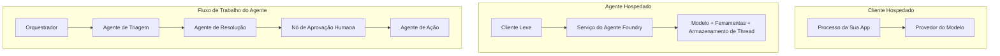
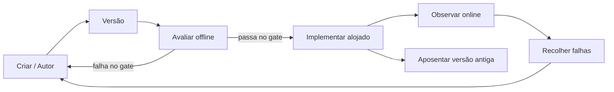
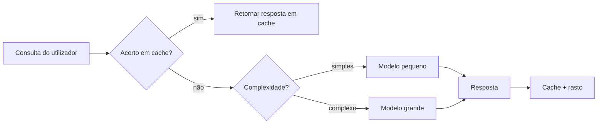
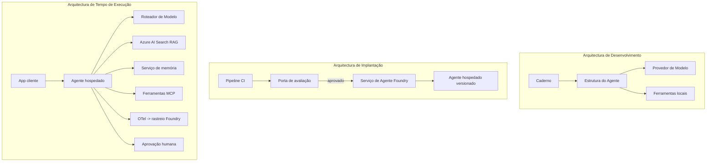

# Implementação de Agentes Escaláveis com Microsoft Foundry


Até este ponto no curso, construiu agentes que correm no seu portátil, dentro de um notebook, acionados por `az login` e um conjunto de variáveis de ambiente. Esta é exatamente a forma correta de aprender. Não é a forma correta de operar um agente do qual milhares de clientes dependem às 3 da manhã.

Esta lição trata da lacuna entre "funciona na minha máquina" e "funciona, de forma fiável e acessível, em produção". Fechamos essa lacuna usando **Microsoft Foundry** e o **Microsoft Foundry Agent Service**, construindo um agente real de suporte ao cliente que possui ferramentas, recuperação, memória, avaliação e monitoramento.

## Introdução

Esta lição cobrirá:

- A diferença entre um **agente protótipo** e um **agente implementado**, e por que a transição se foca sobretudo em tudo o que envolve o modelo.
- **Padrões de implementação** para agentes: hospedados no cliente, hospedados como serviço (Hosted Agents) e orquestrados por fluxos de trabalho.
- O **ciclo de vida do agente** na Microsoft Foundry — criar, versionar, implementar, avaliar, observar, retirar.
- **Estratégias de escalabilidade**: encaminhamento de modelo, cache, concorrência e design sem estado.
- **Observabilidade** com OpenTelemetry e rastreamento Foundry.
- **Otimização de custos** através da seleção de modelos, encaminhamento e portões de avaliação.
- **Considerações empresariais**: governança, aprovação humana e execução segura de servidores MCP em produção.

## Objetivos de Aprendizagem

Após completar esta lição, saberá como:

- Escolher o padrão de implementação adequado para uma determinada carga de trabalho do agente.
- Implementar um agente no Microsoft Foundry Agent Service para que seja versionado, governado e observável.
- Instrumentar um agente para rastreamento e configurar um pipeline de avaliação que funciona antes de cada lançamento.
- Aplicar encaminhamento de modelo e cache para manter a latência e custos sob controlo em escala.
- Adicionar um portão de aprovação humana para ações de alto risco e integrar um servidor MCP de forma segura em produção.

## Pré-requisitos

Esta lição assume que completou as lições anteriores e está confortável com:

- Construção de agentes com o [Microsoft Agent Framework](../14-microsoft-agent-framework/README.md) (Lição 14).
- [Uso de Ferramentas](../04-tool-use/README.md) (Lição 4) e [Agentic RAG](../05-agentic-rag/README.md) (Lição 5).
- [Memória de Agente](../13-agent-memory/README.md) (Lição 13) e [Protocolos Agênticos / MCP](../11-agentic-protocols/README.md) (Lição 11).
- [Observabilidade e Avaliação](../10-ai-agents-production/README.md) (Lição 10) — esta lição baseia-se diretamente nela.

Também precisará de:

- Uma **subscrição Azure** e um **projeto Microsoft Foundry** com pelo menos um modelo de chat implementado.
- A **Azure CLI** autenticada (`az login`).
- Python 3.12+ e os pacotes no repositório [`requirements.txt`](../../../requirements.txt).

## Do Protótipo à Produção: O que Realmente Muda

Um agente protótipo e um agente de produção partilham o mesmo ciclo fundamental — raciocinar, chamar ferramentas, responder. O que muda é tudo o que envolve esse ciclo. O modelo é talvez 20% de um agente de produção; os restantes 80% são o esqueleto operacional.

| Preocupação | Protótipo | Produção |
| --- | --- | --- |
| **Hospedagem** | Corre no seu notebook | Corre como um serviço hospedado, versionado e distribuído |
| **Identidade** | Seu token `az login` | Identidade gerida com RBAC escalonado |
| **Estado** | Na memória, perdido ao reiniciar | Externalizado (armazenamento de threads, serviço de memória) |
| **Falha** | Vê o traceback | Repetições, contornos, dead-letter, alertas |
| **Custo** | "São alguns cêntimos" | Rastreado por pedido, encaminhado, armazenado em cache, orçamentado |
| **Qualidade** | Avalia visualmente a saída | Avaliado automaticamente antes de cada lançamento |
| **Confiança** | Aprova cada ação | Política + humano no ciclo para ações arriscadas |

Tenha esta tabela em mente. Cada secção abaixo corresponde a uma destas linhas.

## Padrões de Implementação de Agentes

Existem três padrões que usará, frequentemente em combinação.

### 1. Agentes Hospedados no Cliente

O objeto agente vive dentro do processo da *sua* aplicação. O seu código chama diretamente o provedor do modelo; o ciclo de raciocínio corre no seu serviço. Isto é o que todas as lições anteriores fizeram.

- **Use quando** precisar de controlo total sobre o ciclo, middleware personalizado, ou estiver a embutir o agente dentro de um backend existente.
- **Trade-off**: assume a responsabilidade de escalar, gerir estado e resiliência.

### 2. Agentes Hospedados (Foundry Agent Service)

O agente está *registado como um recurso* na Microsoft Foundry. A Foundry hospeda o ciclo de raciocínio, armazena threads, aplica segurança de conteúdo e RBAC, e torna o agente visível no portal Foundry. A sua aplicação torna-se um cliente leve que cria threads e lê respostas.

- **Use quando** quiser durabilidade, observabilidade integrada, governança e menos superfície operacional.
- **Trade-off**: menos controlo ao nível baixo em troca de um runtime gerido.

### 3. Fluxos de Trabalho de Agentes

Vários agentes (e ferramentas) são compostos num grafo com fluxo de controlo explícito — passos sequenciais, ramificações, nós de aprovação humana e pontos de verificação duráveis que podem pausar e retomar. Esta é a capacidade **Workflows** do Microsoft Agent Framework aplicada à escala de implementação.

- **Use quando** uma única tarefa abranja vários agentes especializados ou exija uma etapa de aprovação intermédia.
- **Trade-off**: mais partes móveis; necessita de observabilidade ao nível da orquestração.



## O Ciclo de Vida do Agente na Microsoft Foundry

Implementar um agente não é um `push` único. É um ciclo, e parece muito com um ciclo de lançamento de software porque é exatamente isso.



A ideia chave, herdada da [Lição 10](../10-ai-agents-production/README.md): **a avaliação offline é um portão, não um pensamento tardio.** Uma nova versão do agente não é lançada a menos que cumpra os seus limiares de avaliação. A observabilidade online depois alimenta falhas reais de volta ao seu conjunto de testes offline. Esse é todo o ciclo.

## Estratégias de Escalabilidade

Escalar um agente é diferente de escalar uma API web sem estado, porque cada pedido pode desencadear múltiplas chamadas dispendiosas a modelos e ferramentas. Quatro técnicas suportam a maior parte da carga.

**Processamento sem estado por pedido.** Não mantenha estado por utilizador na memória do seu processo. Persista as threads da conversa no armazenamento de threads Foundry ou num serviço de memória para que qualquer instância possa tratar qualquer pedido. Isso permite escalar horizontalmente — adicionar instâncias, sem sessões pegajosas (sticky).

**Encaminhamento de modelo.** Nem todos os pedidos precisam do seu modelo mais capaz (e mais caro). Encaminhe pedidos simples — classificação de intenção, respostas factuais curtas — para um modelo pequeno e rápido, reservando o modelo grande para o raciocínio profundo. O **Model Router** da Foundry faz isto por si, ou pode implementar um classificador leve. Construirá a versão DIY no laboratório.

**Cache de respostas.** Muitas perguntas de suporte são quase-dúplicas ("como faço para resetar a minha palavra-passe?"). Armazene em cache respostas a perguntas comuns e sirva-as sem consultar o modelo. Mesmo uma taxa modesta de hits no cache reduz significativamente custo e latência.

**Concorrência e controlo de pressão.** Provedores de modelo têm limites de taxa. Controle a sua concorrência, use reintentos com backoff exponencial, e falhe elegantemente (uma resposta enfileirada de "estamos a tratar" é melhor que um erro 500).



## Observabilidade em Produção

Não pode operar o que não consegue ver. Conforme abordado na Lição 10, o Microsoft Agent Framework emite rastreios **OpenTelemetry** nativamente — cada chamada de modelo, invocação de ferramenta e passo da orquestração vira um span. Em produção, exporta esses spans para Microsoft Foundry (ou qualquer backend compatível com OTel) para que possa:

- Rastrear uma única reclamação do cliente de ponta a ponta em cada chamada de modelo e ferramenta.
- Monitorizar latência p50/p95 e custo por pedido ao longo do tempo.
- Alertar em picos de taxa de erro e anomalias de custo antes que os seus utilizadores (ou a sua equipa financeira) reparem.

```python
from agent_framework.observability import get_tracer

tracer = get_tracer()

with tracer.start_as_current_span("support_request") as span:
    span.set_attribute("customer.tier", "enterprise")
    span.set_attribute("routed.model", "gpt-5-nano")
    # a execução do agente é rastreada automaticamente dentro deste intervalo
```

Atributos como `customer.tier` e `routed.model` são o que transforma uma parede de rastreios em perguntas respondíveis ("os clientes empresariais estão a ser encaminhados para o modelo pequeno demasiadas vezes?").

## Otimização de Custos

O custo nos agentes de produção é dominado por tokens. Três alavancas, por ordem de impacto:

1. **Tamanho adequado do modelo.** Um modelo pequeno que ultrapassa o seu portão de avaliação é quase sempre mais barato que um grande que também ultrapassa. Use a avaliação para *demonstrar* que o modelo pequeno é suficientemente bom, em vez de optar por um modelo grande por precaução.
2. **Encaminhe por complexidade.** Como acima — pague preços de modelo grande apenas para pedidos que requerem raciocínio de modelo grande.
3. **Cache agressivamente.** A chamada de modelo mais barata é aquela que nunca faz.

Portões de avaliação e controlo de custos são a mesma disciplina vista de dois ângulos: a avaliação indica o *piso de qualidade*, encaminhamento e cache mantêm o custo tão próximo desse piso quanto possível.

## Considerações Empresariais na Implementação

**Governança.** Agentes Hospedados herdam o RBAC da Foundry, segurança de conteúdo e registo de auditoria. Dê a cada agente uma identidade gerida com o privilégio mínimo necessário — acesso apenas a leitura à base de conhecimento, acesso restrito à API de tickets, nada mais.

**Humano no ciclo.** Algumas ações são demasiado importantes para automatizar totalmente — emitir um reembolso, apagar uma conta, escalar para uma equipa legal. O Microsoft Agent Framework suporta ferramentas que requerem **aprovação**: o agente propõe a ação, a execução pausa, um humano aprova ou rejeita, e o fluxo de trabalho retoma. Viu o primitivo na [Lição 6](../06-building-trustworthy-agents/README.md); aqui implementa-o.

**MCP em produção.** [MCP](../11-agentic-protocols/README.md) permite que o seu agente consuma ferramentas externas através de uma interface padrão. Em produção, trate cada servidor MCP como uma fronteira não confiável: fixe a versão do servidor, execute-o com identidade restrita, valide as suas saídas, e nunca exponha segredos a ele. Um servidor MCP é uma dependência, e dependências são atualizadas, auditadas e sujeitas a limite de taxa.



Esses três diagramas — desenvolvimento, implementação, runtime — são o mesmo agente em três fases da sua vida. O laboratório que segue guia-o na sua construção.

## Laboratório Prático: Um Agente de Suporte ao Cliente Pronto para Produção

Abra [`code_samples/16-python-agent-framework.ipynb`](./code_samples/16-python-agent-framework.ipynb) e percorra-o do início ao fim. Vai montar um **agente de suporte ao cliente Contoso** com todas as preocupações de produção integradas:

1. **Chamada de ferramentas** — consulta o estado de encomendas e abre tickets de suporte.
2. **RAG** — responde a perguntas de política a partir de uma base de conhecimento (Azure AI Search, com fallback na memória para correr o notebook sem recurso Search).
3. **Memória** — lembra o cliente ao longo das rodadas de conversa.
4. **Encaminhamento de modelo** — um classificador de complexidade encaminha cada pedido para um modelo pequeno ou grande.
5. **Cache de respostas** — perguntas repetidas são servidas a partir do cache.
6. **Aprovação humana** — reembolsos acima de um limite pausam para aprovação humana.
7. **Pipeline de avaliação** — um pequeno conjunto de testes offline pontua o agente e atua como portão de lançamento.
8. **Observabilidade** — rastreamento OpenTelemetry em cada pedido.

### Explicação

O notebook está organizado para que cada preocupação de produção seja uma secção autónoma e executável. O núcleo é o manipulador de pedidos de encaminhamento e cache:

```python
async def handle_support_request(query: str, customer_id: str) -> str:
    # 1. Servir a partir da cache sempre que possível.
    cached = response_cache.get(normalize(query))
    if cached:
        return cached

    # 2. Roteamento por complexidade para controlar o custo.
    model = "gpt-5-nano" if is_simple(query) else "gpt-5-mini"

    # 3. Executar o agente dentro de um span de rastreio para observabilidade.
    with tracer.start_as_current_span("support_request") as span:
        span.set_attribute("routed.model", model)
        span.set_attribute("customer.id", customer_id)
        response = await support_agent.run(query, model=model)

    # 4. Armazenar em cache e retornar.
    response_cache.set(normalize(query), response.text)
    return response.text
```

O portão de avaliação que protege um lançamento é assim:

```python
async def evaluation_gate(agent, test_cases, threshold: float = 0.8) -> bool:
    passed = 0
    for case in test_cases:
        result = await agent.run(case["input"])
        if score_response(result.text, case["expected"]) >= 0.8:
            passed += 1
    pass_rate = passed / len(test_cases)
    print(f"Evaluation pass rate: {pass_rate:.0%} (gate: {threshold:.0%})")
    return pass_rate >= threshold  # apenas implementar se a portaria passar
```

Leia cada linha — o notebook mantém os primitivos deliberadamente pequenos para que nada esteja oculto atrás de uma chamada de framework.

## Validar um Agente Implementado com Testes de Fumaça

O portão de avaliação acima executa *offline* contra o objeto agente. Depois de o agente estar implementado como Hosted Agent, precisa de mais uma verificação, ainda mais simples: **o endpoint implementado está realmente a responder?**

Implementar "com sucesso" apenas prova que o plano de controlo aceitou a definição — não prova que o agente responde. Uma dependência em falta, um encaminhamento incorreto do modelo ou uma ligação expirada podem deixar uma implementação verde que não retorna nada. Um **teste de fumaça** detecta isso em segundos, a cada implementação, sem o custo de uma avaliação completa.

Este repositório disponibiliza um pipeline de teste de fumaça pronto a usar, construído com a GitHub Action [AI Smoke Test](https://github.com/marketplace/actions/ai-smoke-test):

- **Catálogo** — [`tests/lesson-16-smoke-tests.json`](../../../tests/lesson-16-smoke-tests.json) contém prompts e afirmações para o agente de suporte Contoso (respostas baseadas em políticas, consulta de encomendas, manutenção do tema e continuidade da thread em múltiplas voltas). Catálogos para agentes de outras lições residem a seu lado — veja [`tests/README.md`](../tests/README.md).
- **Fluxo de trabalho** — [`.github/workflows/smoke-test.yml`](../../../.github/workflows/smoke-test.yml) autentica com Azure OIDC e envia cada prompt ao endpoint Responses do agente, falhando a job em qualquer afirmação falhada.

```yaml
- name: Smoke-test hosted agent
  uses: JFolberth/ai-smoketest@v1
  with:
    project_endpoint: ${{ inputs.project_endpoint }}
    agent_name: ContosoSupportAgent
    tests_file: tests/lesson-16-smoke-tests.json
```


Execute-o a partir do separador **Ações** uma vez que o seu agente esteja implementado, fornecendo o endpoint do seu projeto Foundry e o nome do agente. A identidade federada precisa da função **Azure AI User** ao nível do projeto Foundry. Pense nas camadas como uma pirâmide: testes de fumo (acessível e a responder?) são executados em cada implementação, avaliação offline (bom o suficiente para lançar?) é executada antes da promoção, e avaliação online (como está a funcionar no terreno?) é executada continuamente.

## Verificação de Conhecimento

Teste o seu entendimento antes de avançar para a tarefa.

**1. Aproximadamente qual a proporção de um agente de produção que é "o modelo", e o que é o resto?**

<details>
<summary>Resposta</summary>

O modelo é uma minoria do sistema — frequentemente citado como cerca de 20%. O resto é o esqueleto operativo: alojamento e versionamento, identidade e RBAC, estado externalizado, gestão de falhas, monitorização de custos, avaliação e controlos humano-no-ciclo. Passar para produção é principalmente sobre construir tudo *à volta* do ciclo de raciocínio.
</details>

**2. Quando escolheria um Agente Hosted em vez de um agente alojado no cliente?**

<details>
<summary>Resposta</summary>

Quando pretende um ambiente gerido com durabilidade incorporada (threads que persistem e podem retomar), observabilidade, segurança de conteúdo e RBAC, e está disposto a sacrificar algum controlo de baixo nível do ciclo de raciocínio para reduzir a superfície operacional. Agente alojado no cliente é preferível quando necessita de controlo total sobre o ciclo ou está a incorporar o agente numa infraestrutura existente.
</details>

**3. Porque é que um agente escalável deve ser sem estado na memória do seu próprio processo?**

<details>
<summary>Resposta</summary>

Para que qualquer instância possa tratar qualquer pedido, o que permite a escalabilidade horizontal sem sessões fixas. O estado da conversa por utilizador é externalizado para um armazenamento de threads ou serviço de memória. Se o estado estivesse na memória do processo, perderia o estado após reinício e não poderia distribuir a carga livremente.
</details>

**4. Que problema resolve a roteirização do modelo, e como está relacionada com a avaliação?**

<details>
<summary>Resposta</summary>

A roteirização envia pedidos simples para um modelo pequeno, barato e rápido e reserva o modelo grande para raciocínios genuínos, controlando latência e custo. Relaciona-se com a avaliação porque é a avaliação que *prova* que o modelo pequeno é bom o suficiente para uma classe de pedidos — roteirização sem avaliação é adivinhação.
</details>

**5. O que é um "portão de avaliação" e onde se situa no ciclo de vida?**

<details>
<summary>Resposta</summary>

Um portão de avaliação executa um conjunto de testes offline contra uma nova versão do agente e bloqueia a implementação a menos que a taxa de aprovação ultrapasse um limiar. Está situado entre "versão" e "implementação" no ciclo de vida, tornando a qualidade uma pré-condição para o lançamento em vez de algo que se verifica após a entrega.
</details>

**6. Por que razão um servidor MCP deve ser tratado como um limite não confiável em produção?**

<details>
<summary>Resposta</summary>

Porque é uma dependência externa para a qual o seu agente faz chamadas. Deve fixar a sua versão, executá-lo com uma identidade com escopo, validar as suas saídas, limitar a taxa, e nunca expor segredos — a mesma disciplina que aplica a qualquer dependência de terceiros. As saídas fluem para o raciocínio do seu agente, por isso a confiança sem validação é um risco de segurança.
</details>

**7. Qual a alteração única que geralmente tem maior impacto no custo de um agente de produção, e porquê?**

<details>
<summary>Resposta</summary>

Dimensionar corretamente o modelo — usar o modelo mais pequeno que ainda passa no seu portão de avaliação. O custo é dominado por tokens, e um modelo mais pequeno que cumpre o padrão de qualidade é quase sempre mais barato que um maior. A cache e a roteirização reduzem o custo ainda mais, mas escolher o modelo base certo tem o maior efeito imediato.
</details>

**8. Que papel desempenham atributos de span como `customer.tier` e `routed.model` na observabilidade?**

<details>
<summary>Resposta</summary>

Transformam rastreamentos brutos em questões empresariais respondíveis. Sem atributos tem uma parede de spans; com eles pode perguntar "os clientes empresariais estão a ser roteados para o modelo pequeno com demasiada frequência?" ou "qual modelo trata dos nossos pedidos mais lentos?" Os atributos permitem segmentar a telemetria pelas dimensões importantes para a operação.
</details>

## Tarefa

Pegue no agente de suporte ao cliente do laboratório e fortaleça-o para um cenário específico: **um agente de suporte para faturação de subscrições de uma empresa SaaS.**

A sua submissão deve:

1. **Substituir as ferramentas** por outras relevantes para faturação: `get_subscription_status`, `get_invoice`, e `issue_credit` (créditos acima de 50$ requerem aprovação humana).
2. **Adicionar três documentos RAG** cobrindo a política de reembolso da empresa, o ciclo de faturação, e a política de cancelamento.
3. **Estender o conjunto de avaliação** para pelo menos oito casos, incluindo pelo menos dois que *devem* desencadear a via de aprovação humana, e confirmar que o seu portão de avaliação passa ou falha corretamente.
4. **Adicionar um relatório de custos**: depois de executar dez consultas mistas através do agente, imprimir quantas foram para o modelo pequeno, quantas para o modelo grande, e quantas servidas a partir da cache.

Escreva um parágrafo curto (numa célula markdown) explicando qual a regra de roteirização de modelo que escolheu e como a validaria com tráfego real. Não há resposta única correta — será avaliado se as preocupações de produção estão ligadas coerentemente.

## Resumo

Nesta lição passou um agente de protótipo para produção com Microsoft Foundry:

- A passagem para produção é principalmente sobre o **esqueleto operativo** à volta do modelo — alojamento, identidade, estado, gestão de falhas, custo, qualidade e confiança.
- Aprendeu os três **padrões de implementação** — alojado no cliente, Agentes Hosted e Workflows de Agente — e quando cada um é adequado.
- Percorreu o **ciclo de vida do agente**, onde a avaliação offline **atua como portão de liberação** e a observabilidade online alimenta as falhas de volta para o conjunto de testes.
- Aplicou **estratégias de escalabilidade** — design sem estado, roteirização do modelo, cache e concorrência limitada — e ligou-as à **otimização de custos**.
- Ligou **controlos empresariais**: RBAC, aprovação humana no ciclo, e integração segura MCP em produção.
- Construiu um **agente de suporte ao cliente preparado para produção** que junta todas estas preocupações num código executável.

A lição seguinte faz a jornada oposta: em vez de escalar agentes na cloud, vai trazê-los *para baixo* numa única máquina de desenvolvimento e executá-los inteiramente localmente.

## Recursos Adicionais

- <a href="https://learn.microsoft.com/azure/ai-foundry/what-is-azure-ai-foundry" target="_blank">Documentação do Microsoft Foundry</a>
- <a href="https://learn.microsoft.com/azure/ai-foundry/agents/overview" target="_blank">Visão geral do Microsoft Foundry Agent Service</a>
- <a href="https://learn.microsoft.com/en-us/agent-framework/overview/?wt.mc_id=youtube_26688_organicsocial_reactor&pivots=programming-language-python" target="_blank">Microsoft Agent Framework</a>
- <a href="https://learn.microsoft.com/azure/ai-foundry/concepts/model-router" target="_blank">Model Router no Microsoft Foundry</a>
- <a href="https://learn.microsoft.com/azure/search/search-what-is-azure-search" target="_blank">Azure AI Search</a>
- <a href="https://opentelemetry.io/" target="_blank">OpenTelemetry</a>
- <a href="https://github.com/marketplace/actions/ai-smoke-test" target="_blank">AI Smoke Test GitHub Action</a>
- <a href="https://modelcontextprotocol.io/" target="_blank">Model Context Protocol (MCP)</a>

## Lição Anterior

[Construção de Agentes de Uso de Computador (CUA)](../15-browser-use/README.md)

## Próxima Lição

[Criar Agentes AI Locais](../17-creating-local-ai-agents/README.md)

---

<!-- CO-OP TRANSLATOR DISCLAIMER START -->
**Aviso Legal**:
Este documento foi traduzido utilizando o serviço de tradução automática [Co-op Translator](https://github.com/Azure/co-op-translator). Embora nos esforcemos pela precisão, esteja ciente de que traduções automáticas podem conter erros ou imprecisões. O documento original na sua língua nativa deve ser considerado a fonte autorizada. Para informações críticas, recomenda-se tradução profissional humana. Não nos responsabilizamos por quaisquer mal-entendidos ou interpretações incorretas resultantes da utilização desta tradução.
<!-- CO-OP TRANSLATOR DISCLAIMER END -->