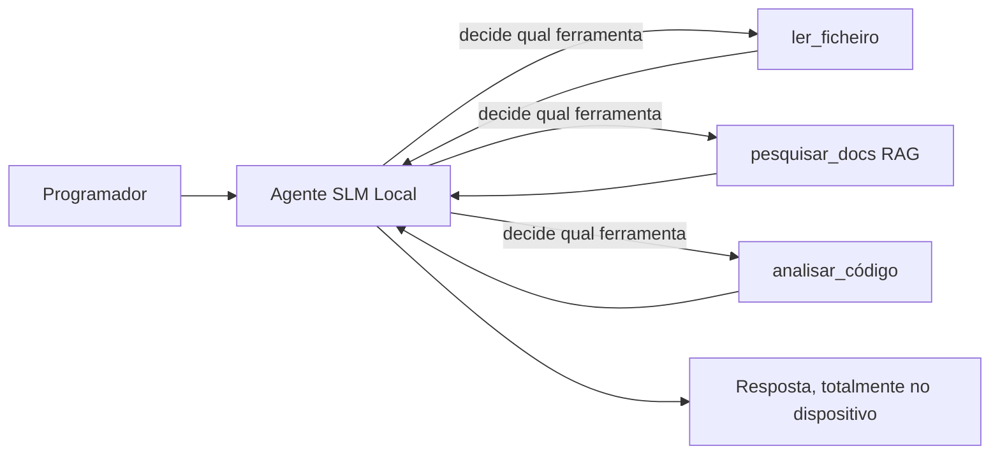
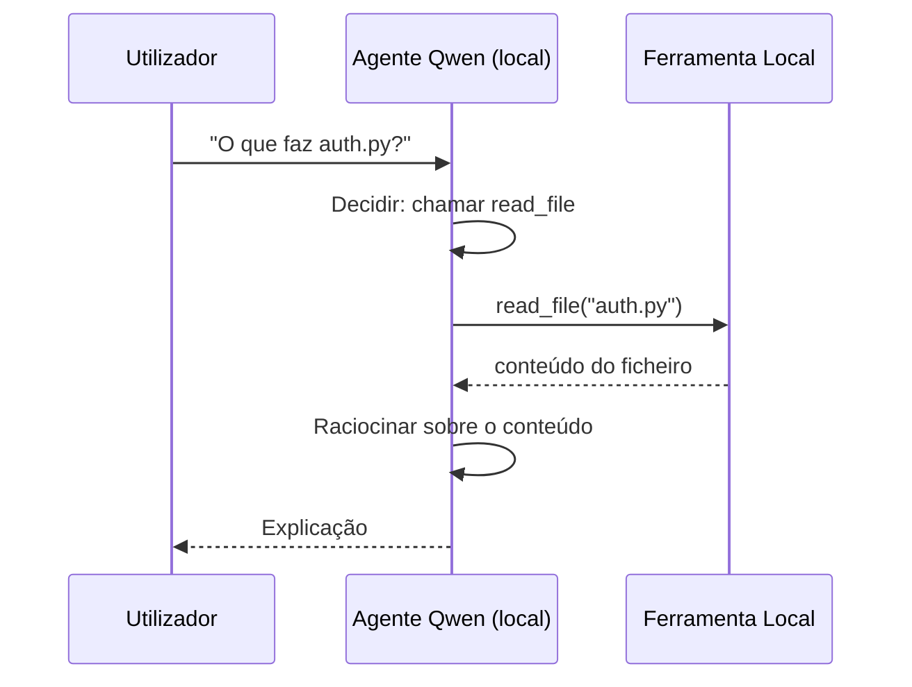
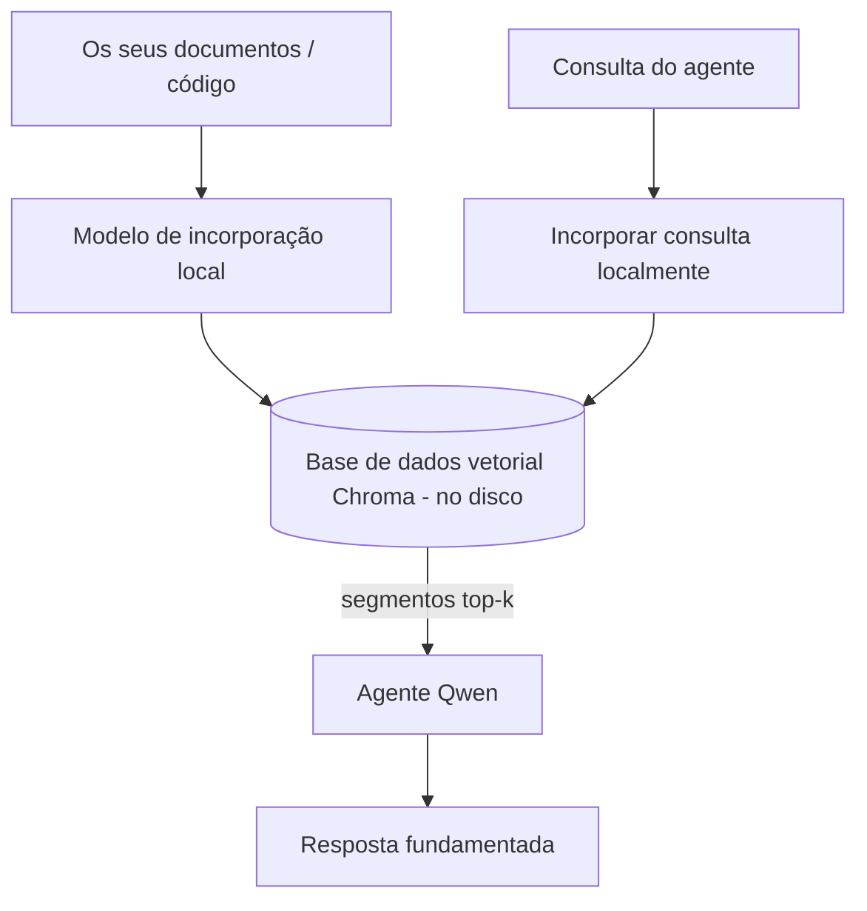
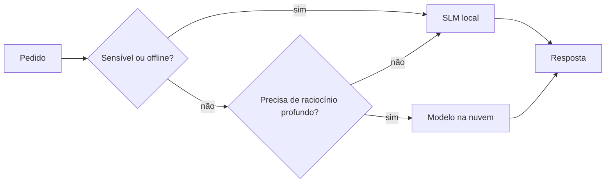

# Criar Agentes de IA Locais Usando o Microsoft Foundry Local e Qwen


A lição anterior escalou agentes *para cima* para a cloud. Esta traz-nos *para baixo* para uma única máquina. No final terá um assistente de engenharia a funcionar que raciocina, chama ferramentas, lê os seus ficheiros e pesquisa na sua documentação — **sem uma única chamada de inferência na cloud.**

Porque é que gostaria disso? Três razões que surgem frequentemente no trabalho real de engenharia:

- **Privacidade.** O código e os documentos nunca saem da máquina. Nenhum prompt, fragmento ou dado do cliente cruza a fronteira da rede.
- **Custo.** Inferência local não tem custo por token. Pode iterar todo o dia pelo preço da eletricidade.
- **Offline.** Num avião, numa instalação segura ou durante uma falha, o agente continua a funcionar.

A questão é que está a trocar um modelo de topo da cloud por um **Modelo de Linguagem Pequeno (SLM)** a correr na sua CPU, GPU ou NPU. Esta lição é sobre construir agentes que sejam *bons* dentro dessa limitação em vez de fingir que ela não existe.

## Introdução

Esta lição cobre:

- **Modelos de Linguagem Pequenos (SLMs)** — o que são, onde brilham e onde não brilham.
- **Microsoft Foundry Local** — um runtime que descarrega e serve modelos no dispositivo através de uma **API compatível com OpenAI**.
- **Modelos Qwen com chamada de funções** — SLMs que produzem chamadas de ferramentas de forma fiável, o que permite criar agentes locais (não apenas chat local).
- **Ferramentas locais, RAG local e MCP local** — dando capacidade ao agente sem a cloud.
- **Padrões híbridos** — quando manter as coisas locais e quando recorrer à cloud.

## Objetivos de Aprendizagem

Após completar esta lição, saberá:

- Explicar as compensações dos SLMs e escolher casos de uso apropriados para agentes locais.
- Servir um modelo Qwen localmente com Foundry Local e conectar-se a ele através do endpoint compatível com OpenAI.
- Construir um agente com chamada de ferramentas que corre inteiramente na sua estação de trabalho.
- Adicionar RAG local sobre os seus próprios documentos usando uma base de dados vetorial local (Chroma).
- Ligar o agente a um servidor MCP local e refletir sobre projetos híbridos local/cloud.

## Pré-requisitos

Esta lição assume que completou as lições anteriores e está confortável com:

- [Uso de Ferramentas](../04-tool-use/README.md) (Lição 4) e [Agentic RAG](../05-agentic-rag/README.md) (Lição 5).
- [Protocolos Agentic / MCP](../11-agentic-protocols/README.md) (Lição 11).
- O [Microsoft Agent Framework](../14-microsoft-agent-framework/README.md) (Lição 14).

Também precisará de:

- Estação de trabalho para desenvolvimento. **8 GB de RAM é o mínimo realista**; 16 GB+ é confortável. Uma GPU ou NPU ajuda mas não é obrigatória.
- **Microsoft Foundry Local** instalado (veja a seção de configuração abaixo).
- Python 3.12+ e os pacotes do repositório [`requirements.txt`](../../../requirements.txt), além de `foundry-local-sdk`, `openai` e `chromadb` para esta lição.

## Modelos de Linguagem Pequenos: A Ferramenta Certa para Trabalho Local

Um modelo de ponta na cloud tem centenas de milhares de milhões de parâmetros e um centro de dados por trás. Um SLM tem alguns milhares de milhões de parâmetros e tem de caber na RAM do seu portátil. Essa diferença define expectativas claras.

**SLMs são bons em:**

- Tarefas estruturadas e delimitadas — classificação, extração, sumarização de um documento conhecido.
- **Chamada de ferramentas** — decidir que função chamar e com que argumentos.
- Iteração rápida, barata e privada nos seus próprios dados.

**SLMs são mais fracos em:**

- Raciocínio aberto e complexo através de contexto grande.
- Conhecimento amplo do mundo (viram menos e esquecem mais).

Portanto, a estratégia vencedora para agentes locais é: **deixar o SLM orquestrar, e deixar as ferramentas fazer o trabalho pesado.** O modelo não precisa de *conhecer* a sua base de código — precisa de saber quando chamar `read_file` e `search_docs`. Isso joga diretamente com os pontos fortes de um SLM.



## Microsoft Foundry Local

**Microsoft Foundry Local** é um runtime leve que descarrega, gere e serve modelos inteiramente na sua máquina. A funcionalidade mais importante para nós é que expos um **endpoint HTTP compatível com OpenAI** — o que significa que o SDK OpenAI e o cliente OpenAI do Microsoft Agent Framework funcionam com ele alterando apenas o `base_url`. Tudo o que aprendeu sobre construir agentes transfere diretamente; só o endpoint muda da cloud para `localhost`.

Foundry Local também escolhe automaticamente a melhor versão do modelo para o seu hardware — uma versão CPU, uma versão CUDA/GPU ou uma versão NPU — para que não precise de otimizar manualmente por máquina.

### Configuração

Instale o Foundry Local (veja a [documentação](https://learn.microsoft.com/azure/ai-foundry/foundry-local/) para o seu SO), depois confirme que funciona:

```bash
# Instalar (exemplo; siga a documentação para a sua plataforma)
winget install Microsoft.FoundryLocal      # Windows
# brew install microsoft/foundrylocal/foundrylocal   # macOS

# Descarregue e execute um modelo Qwen, depois inicie o serviço local
foundry model run qwen2.5-7b-instruct
foundry service status
```

Depois do serviço estar a correr, terá um endpoint local, compatível com OpenAI (tipicamente `http://localhost:PORT/v1`). O notebook usa o `foundry-local-sdk` para descobrir automaticamente o endpoint, para não ter de codificar o porto manualmente.

## Chamada de Funções Qwen: Porquê que É Importante

Um agente é realmente um agente se puder chamar ferramentas. Muitos SLMs podem conversar mas produzem chamadas de ferramentas pouco fiáveis e mal formadas. Os modelos **Qwen** são treinados para chamada de funções e geram estruturas de chamadas de ferramentas bem formadas — que é exatamente o que transforma um modelo de chat local num *agente* local.

O fluxo é o loop de chamada de ferramentas padrão que já conhece, apenas a correr no dispositivo:



## RAG Local

A pesquisa na documentação é onde os agentes locais justificam a sua utilidade. Em vez de esperar que o SLM memorize a documentação do seu framework, insere esses documentos numa **base de dados vetorial local** e deixa o agente recuperar os fragmentos relevantes sob demanda.

Usamos o **Chroma**, um armazenamento vetorial incorporado que corre no processo sem servidor para gerir. O pipeline é inteiramente local: modelo de embed local → vetores locais → recuperação local → SLM local.



Este é o mesmo padrão Agentic RAG da Lição 5 — a única mudança é que todos os componentes correm na sua máquina.

## Servidores MCP Locais

[MCP](../11-agentic-protocols/README.md) é um transporte, não um serviço na cloud. Um servidor MCP pode correr como processo local em `stdio`, expondo ferramentas para o seu agente através do protocolo padrão. Isto permite reutilizar o ecossistema crescente de servidores MCP — acesso a sistema de ficheiros, operações git, querys em bases de dados — inteiramente offline.

A postura de segurança é diferente da cloud, mas não ausente: um servidor MCP local corre ainda com as permissões do seu utilizador, por isso limite o que pode aceder (um diretório de projeto, não toda a sua pasta home) e trate as suas saídas como entradas a validar.

## Padrões Híbridos Cloud-e-Local

Local-primeiro não significa só local. Sistemas maduros fazem roteamento por sensibilidade e dificuldade:

| Situação | Onde corre |
| --- | --- |
| Código / dados sensíveis, ou offline | **SLM Local** |
| Tarefa simples e delimitada | **SLM Local** (barato, rápido) |
| Raciocínio multi-hop complexo em dados não sensíveis | **Modelo Cloud** |
| Tudo, durante uma falha | **SLM Local** (degradação suave) |

Isto reflete a ideia de **roteamento de modelos** da Lição 16 — exceto que um dos "modelos" é agora a sua própria máquina. Um design robusto recorre ao local quando a cloud está indisponível, de modo que o agente degrada em qualidade ao invés de falhar completamente.



## Laboratório Prático: Um Assistente de Engenharia Local

Abra [`code_samples/17-local-agent-foundry-local.ipynb`](./code_samples/17-local-agent-foundry-local.ipynb) e trabalhe nele. Vai construir um **assistente de engenharia local** que corre inteiramente na sua estação de trabalho e pode:

1. **Chamar ferramentas** — via chamada de funções Qwen através do Foundry Local.
2. **Executar operações locais em ficheiros** — listar e ler ficheiros num diretório de projeto.
3. **Analisar código** — reportar métricas básicas num ficheiro-fonte.
4. **Pesquisar documentação** — RAG local sobre uma pasta de documentação com Chroma.
5. **Usar MCP** — conectar a um servidor MCP local (com um salto gracioso se nenhum estiver configurado).

Em nenhum momento é usada inferência na cloud.

### Passo a Passo

O assistente conecta ao Foundry Local pelo endpoint compatível com OpenAI, de modo que o código do agente é quase idêntico ao das lições na cloud — só o cliente muda:

```python
from foundry_local import FoundryLocalManager
from openai import OpenAI

# Foundry Local descobre/transfera o modelo e fornece-nos um endpoint local.
manager = FoundryLocalManager(\"qwen2.5-7b-instruct\")
client = OpenAI(base_url=manager.endpoint, api_key=manager.api_key)  # api_key é um placeholder local
```

As ferramentas são funções Python normais limitadas a um diretório de projeto:

```python
def read_file(path: str) -> str:
    \"\"\"Read a file, but only inside the sandboxed project directory.\"\"\"
    full = (PROJECT_ROOT / path).resolve()
    if PROJECT_ROOT not in full.parents and full != PROJECT_ROOT:
        return \"Access denied: path is outside the project directory.\"
    return full.read_text(encoding=\"utf-8\")
```

Repare na verificação sandbox — mesmo localmente, uma ferramenta que lê caminhos arbitrários é um risco. O notebook mantém cada ferramenta limitada a uma raiz de projeto.

## Verificação de Conhecimentos

Teste o seu entendimento antes de passar para o trabalho prático.

**1. Dê duas razões concretas para executar um agente localmente em vez de na cloud.**

<details>
<summary>Resposta</summary>

Quaisquer duas destas: **privacidade** (código e dados nunca saem da máquina), **custo** (sem cobrança por token de inferência), e **capacidade offline** (funciona sem rede — num avião, numa instalação segura ou durante uma falha). Restrições regulatórias/compliance que impedem o envio de dados para fora do dispositivo são um motivo comum para a razão da privacidade.
</details>

**2. Qual é a divisão recomendada do trabalho entre um SLM e as suas ferramentas num agente local, e porquê?**

<details>
<summary>Resposta</summary>

Deixe o SLM **orquestrar** (decidir que ferramenta chamar e com que argumentos) e deixe as **ferramentas fazerem o trabalho pesado** (ler ficheiros, recuperar documentação, calcular resultados). SLMs são fortes em decisões delimitadas como seleção de ferramentas mas mais fracos em conhecimento amplo e raciocínio multi-hop longo, por isso usar ferramentas joga com os seus pontos fortes.
</details>

**3. O que torna possível reutilizar código de agente cloud com o Foundry Local?**

<details>
<summary>Resposta</summary>

O Foundry Local expõe um **endpoint HTTP compatível com OpenAI**. O SDK OpenAI e o cliente OpenAI do Agent Framework funcionam contra ele alterando apenas o `base_url` (e usando uma chave API local fictícia). Todo o resto no código do agente permanece igual.
</details>

**4. Porque é que usamos especificamente um modelo Qwen com chamada de funções em vez de qualquer SLM?**

<details>
<summary>Resposta</summary>

Porque um agente deve produzir chamadas de ferramentas fiáveis e bem formadas. Muitos SLMs podem conversar mas emitem estruturas de chamadas de ferramentas mal formadas ou inconsistentes. Modelos Qwen são treinados para chamada de funções e produzem chamadas de ferramentas consistentes, o que transforma um modelo local de chat num agente local a funcionar.
</details>

**5. No pipeline RAG local, que componentes correm na máquina?**

<details>
<summary>Resposta</summary>

Todos: o modelo de embedding, a base de dados vetorial (Chroma, em disco), o passo de recuperação e o SLM. Os documentos são embedados localmente, armazenados localmente, recuperados localmente e raciocinados por um modelo local — nenhum componente toca a cloud.
</details>

**6. Um servidor MCP local corre na sua máquina. Isso torna-o automaticamente seguro? Que precaução deve ainda ter?**

<details>
<summary>Resposta</summary>

Não. Um servidor MCP local corre com as permissões do seu utilizador, por isso pode aceder a tudo o que o utilizador pode. Limite-o ao que precisa (por exemplo, um único diretório de projeto em vez de toda a pasta home) e trate as suas saídas como entradas a validar antes de agir.
</details>

**7. Descreva uma regra sensata de roteamento híbrido que inclua um modelo local.**

<details>
<summary>Resposta</summary>

Roteie pedidos sensíveis ou offline para o SLM local; roteie tarefas simples e limitadas para o SLM local pela velocidade e custo; roteie raciocínio multi-hop difícil em dados não sensíveis para um modelo cloud; e recorra ao SLM local se a cloud estiver indisponível para que o agente degrade suavemente em vez de falhar. Isto é roteamento de modelos (Lição 16) com a máquina local como um dos modelos.
</details>

**8. Qual é uma quantidade realista mínima de RAM para correr o agente local nesta lição, e o que ganha com mais RAM?**

<details>
<summary>Resposta</summary>

Cerca de **8 GB** é o mínimo realista; 16 GB+ é confortável. Mais RAM permite executar modelos maiores e mais capazes e manter mais contexto em memória. Uma GPU ou NPU acelera a inferência mas não é requerida — o Foundry Local seleciona uma versão CPU na ausência de acelerador.
</details>

## Trabalho Prático

Expanda o assistente de engenharia local para um **revisor local de documentação** para um projeto pequeno à sua escolha (use uma das pastas de lições deste repositório, se quiser).

A sua submissão deve:

1. **Indexar uma pasta real de documentação/código** no Chroma (pelo menos cinco ficheiros).
2. **Adicionar uma ferramenta `find_todos`** que varra o projeto em busca de comentários `TODO`/`FIXME` e os devolva com ficheiro e número de linha — mantendo a mesma verificação sandbox que `read_file`.

3. **Faça três perguntas ao agente** que o obriguem a combinar ferramentas: uma pergunta puramente RAG, uma que exija ler um ficheiro específico e outra que exija encontrar TODOs.
4. **Meça-o**: cronometre cada uma das três respostas e anote-as numa célula markdown. Comente se a latência é aceitável para o seu fluxo de trabalho pretendido.

Depois escreva um pequeno parágrafo sobre **o que moveria para a cloud e o que manteria local para este revisor, e porquê**. Será avaliado sobre se os componentes locais estão ligados corretamente e se o seu raciocínio híbrido é sólido — não sobre a qualidade do modelo.

## Resumo

Nesta lição construiu um agente que corre inteiramente na sua própria máquina:

- **SLMs** trocam amplitude por privacidade, custo e funcionamento offline — e brilham quando **orquestram ferramentas** em vez de carregarem todo o conhecimento por si só.
- **Foundry Local** serve modelos no dispositivo através de um **endpoint compatível com OpenAI**, pelo que o código do seu agente na cloud transfere-se com uma alteração de uma linha.
- **Modelos Qwen com chamadas de função** tornam possível chamadas confiáveis a ferramentas locais — e portanto *agentes* locais.
- **RAG local** (Chroma) e **MCP local** dão capacidade ao agente sem sair da máquina.
- **Padrões híbridos** permitem encaminhar por sensibilidade e dificuldade, com o local como suporte de fallback elegante.

Isto completa o arco de implantação: a Lição 16 dimensionou agentes para a Microsoft Foundry, e esta lição reduziu-os para uma única estação de trabalho. A próxima lição aborda manter agentes implantados seguros.

## Recursos Adicionais

- <a href="https://learn.microsoft.com/azure/ai-foundry/foundry-local/" target="_blank">Documentação do Microsoft Foundry Local</a>
- <a href="https://learn.microsoft.com/azure/ai-foundry/what-is-azure-ai-foundry" target="_blank">Documentação do Microsoft Foundry</a>
- <a href="https://learn.microsoft.com/en-us/agent-framework/overview/?wt.mc_id=youtube_26688_organicsocial_reactor&pivots=programming-language-python" target="_blank">Microsoft Agent Framework</a>
- <a href="https://qwen.readthedocs.io/en/latest/framework/function_call.html" target="_blank">Documentação das chamadas de função Qwen</a>
- <a href="https://modelcontextprotocol.io/" target="_blank">Model Context Protocol (MCP)</a>
- <a href="https://docs.trychroma.com/" target="_blank">Base de dados vetorial Chroma</a>

## Lição Anterior

[Implantação de Agentes Escaláveis](../16-deploying-scalable-agents/README.md)

## Próxima Lição

[Segurança de Agentes de IA](../18-securing-ai-agents/README.md)

---

<!-- CO-OP TRANSLATOR DISCLAIMER START -->
**Aviso Legal**:
Este documento foi traduzido utilizando o serviço de tradução automática [Co-op Translator](https://github.com/Azure/co-op-translator). Embora nos esforcemos pela precisão, esteja ciente de que traduções automáticas podem conter erros ou imprecisões. O documento original na sua língua nativa deve ser considerado a fonte autorizada. Para informações críticas, recomenda-se tradução profissional humana. Não nos responsabilizamos por quaisquer mal-entendidos ou interpretações incorretas resultantes da utilização desta tradução.
<!-- CO-OP TRANSLATOR DISCLAIMER END -->