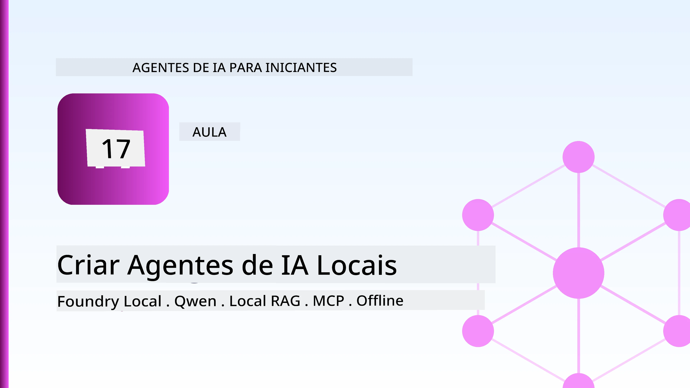
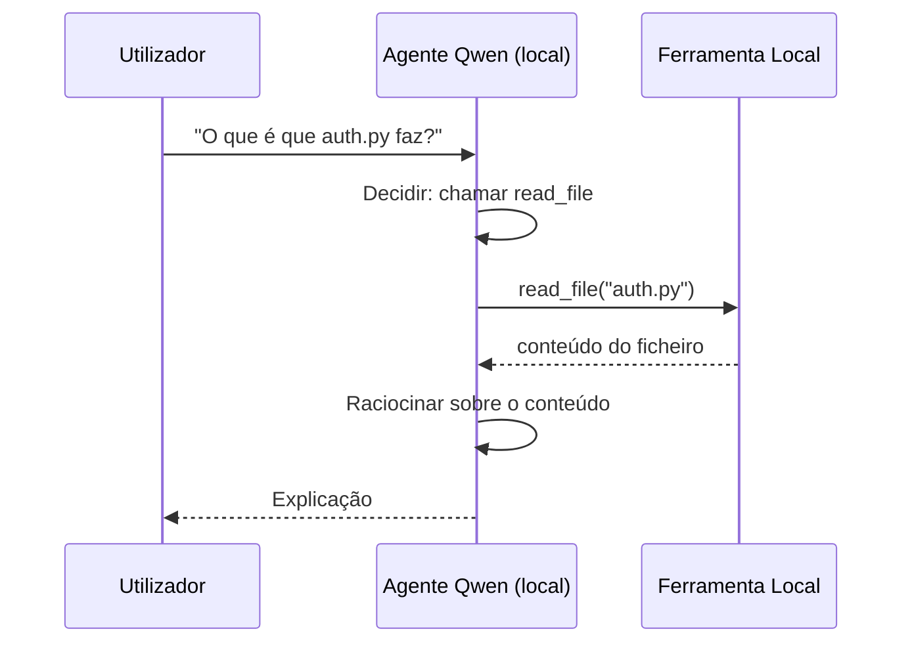
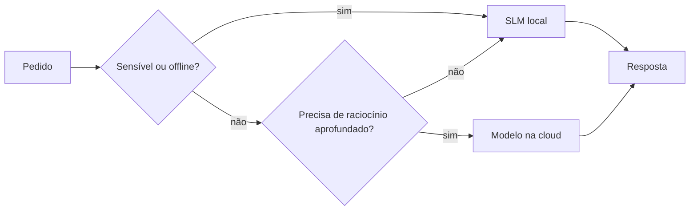

# Criação de Agentes de IA Locais Usando Microsoft Foundry Local e Qwen



A aula anterior escalou agentes *para cima* na cloud. Esta traz-os *para baixo* para uma única máquina. No final, terá um assistente de engenharia funcional que raciocina, chama ferramentas, lê os seus ficheiros e pesquisa a sua documentação — **sem uma única chamada de inferência na cloud.**

Porquê desejar isso? Três razões que surgem constantemente no trabalho de engenharia real:

- **Privacidade.** O código e os documentos nunca saem da máquina. Nenhum prompt, excerto ou dado do cliente atravessa a rede.
- **Custo.** A inferência local não tem custo por token. Pode iterar o dia todo pelo preço da eletricidade.
- **Offline.** Num avião, numa instalação segura ou durante uma falha, o agente continua funcional.

O problema é que está a trocar um modelo de ponta de cloud por um **Modelo de Linguagem Pequeno (SLM)** a correr no seu CPU, GPU ou NPU. Esta aula é sobre construir agentes que sejam *bons* dentro dessa limitação, em vez de fingir que essa limitação não existe.

## Introdução

Esta aula cobrira:

- **Modelos de Linguagem Pequenos (SLMs)** — o que são, onde brilham e onde não.
- **Microsoft Foundry Local** — um runtime que descarrega e serve modelos no dispositivo através de uma **API compatível com OpenAI**.
- **Modelos Qwen com chamada de funções** — SLMs que produzem chamadas a ferramentas de forma fiável, o que torna possível agentes locais *reais* (não apenas chat local).
- **Ferramentas locais, RAG local e MCP local** — dando funcionalidade ao agente sem cloud.
- **Padrões híbridos** — quando manter coisas locais e quando recorrer à cloud.

## Objetivos de Aprendizagem

Após completar esta aula, saberá como:

- Explicar as compensações dos SLMs e escolher casos de uso apropriados para agentes locais.
- Servir um modelo Qwen localmente com Foundry Local e ligar-se a ele através do endpoint compatível com OpenAI.
- Construir um agente de chamada de ferramentas que corre inteiramente na sua estação de trabalho.
- Adicionar RAG local sobre os seus próprios documentos usando uma base de dados vetorial local (Chroma).
- Ligar o agente a um servidor MCP local e raciocinar sobre designs híbridos local/cloud.

## Pré-requisitos

Esta aula assume que completou as aulas anteriores e sente-se confortável com:

- [Uso de Ferramentas](../04-tool-use/README.md) (Aula 4) e [Agentic RAG](../05-agentic-rag/README.md) (Aula 5).
- [Protocolos Agenticos / MCP](../11-agentic-protocols/README.md) (Aula 11).
- O [Microsoft Agent Framework](../14-microsoft-agent-framework/README.md) (Aula 14).

Também precisará de:

- Uma estação de trabalho para desenvolvimento. **8 GB de RAM é um mínimo realista**; 16 GB+ é confortável. Uma GPU ou NPU ajuda, mas não é obrigatório.
- **Microsoft Foundry Local** instalado (ver a secção de configuração abaixo).
- Python 3.12+ e os pacotes no repositório [`requirements.txt`](../../../requirements.txt), além de `foundry-local-sdk`, `openai` e `chromadb` para esta aula.

## Modelos de Linguagem Pequenos: A Ferramenta Certa para Trabalho Local

Um modelo na cloud de ponta tem centenas de milhares de milhões de parâmetros e um centro de dados por trás dele. Um SLM tem alguns milhares de milhões de parâmetros e tem de caber na RAM do seu portátil. Essa diferença define expectativas claras.

**SLMs são bons em:**

- Tarefas estruturadas e limitadas — classificação, extração, resumo de um documento conhecido.
- **Chamada de ferramentas** — decidir que função chamar e com que argumentos.
- Iteração rápida, barata e privada nos seus próprios dados.

**SLMs são mais fracos em:**

- Raciocínio aberto e de múltiplos saltos em contexto extenso.
- Conhecimento amplo do mundo (viram menos e esquecem mais).

A estratégia vencedora para agentes locais é por isso: **deixar o SLM orquestrar e deixar as ferramentas fazer o trabalho pesado.** O modelo não precisa de *conhecer* a sua base de código — precisa de saber quando chamar `read_file` e `search_docs`. Isto joga diretamente com as forças de um SLM.


## Microsoft Foundry Local

**Microsoft Foundry Local** é um runtime leve que descarrega, gere e serve modelos inteiramente na sua máquina. A funcionalidade mais importante para nós é que expõe um **endpoint HTTP compatível com OpenAI** — o que significa que o SDK OpenAI e o cliente OpenAI do Microsoft Agent Framework funcionam contra ele com apenas a mudança do `base_url`. Tudo o que aprendeu sobre construir agentes transfere-se diretamente; só o endpoint muda da cloud para `localhost`.

Foundry Local também escolhe automaticamente a melhor build para o seu hardware — uma build CPU, uma build CUDA/GPU, ou uma build NPU — para que não tenha de otimizar manualmente por máquina.

### Configuração

Instale o Foundry Local (veja a [documentação](https://learn.microsoft.com/azure/ai-foundry/foundry-local/) para o seu sistema operativo), depois confirme que funciona:

```bash
# Instalar (exemplo; siga a documentação para a sua plataforma)
winget install Microsoft.FoundryLocal      # Windows
# brew install microsoft/foundrylocal/foundrylocal   # macOS

# Descarregue e execute um modelo Qwen, depois inicie o serviço local
foundry model run qwen2.5-7b-instruct
foundry service status
```

Quando o serviço estiver a correr, terá um endpoint local compatível com OpenAI (tipicamente `http://localhost:PORT/v1`). O notebook usa o `foundry-local-sdk` para descobrir o endpoint automaticamente, para não precisar de codificar a porta.

## Chamada de Funções Qwen: Porquê Importar-se

Um agente só é agente se puder chamar ferramentas. Muitos SLMs podem conversar mas produzem chamadas a ferramentas pouco fiáveis e malformadas. Os modelos **Qwen** são treinados para chamadas de funções e produzem estruturas de chamadas de ferramentas bem formadas consistentemente — que é exatamente o que transforma um modelo de chat local num *agente* local.

O fluxo é o típico ciclo de chamada de ferramentas que já conhece, apenas a correr no dispositivo:



## RAG Local

A pesquisa de documentação é onde agentes locais justificam o seu uso. Em vez de esperar que o SLM tenha memorizado a documentação do seu framework, incorpora esses documentos numa **base de dados vetorial local** e deixa o agente recuperar os excertos relevantes a pedido.

Usamos o **Chroma**, um armazenamento vetorial incorporado que corre em processo sem servidor para gerir. A cadeia é inteiramente local: modelo de incorporação local → vetores locais → recuperação local → SLM local.


Este é o mesmo padrão Agentic RAG da Aula 5 — a única diferença é que todos os componentes correm na sua máquina.

## Servidores MCP Locais

[MCP](../11-agentic-protocols/README.md) é um transporte, não um serviço cloud. Um servidor MCP pode correr como processo local em `stdio`, expondo ferramentas ao seu agente via protocolo standard. Isto permite reutilizar o ecossistema crescente de servidores MCP — acesso a sistemas de ficheiros, operações git, consultas a bases de dados — totalmente offline.

A postura de segurança é diferente da cloud, mas não inexistente: um servidor MCP local ainda corre com permissões do seu utilizador, por isso defina o escopo do que pode aceder (uma pasta de projeto, não a sua pasta pessoal toda) e trate as suas saídas como inputs a validar.

## Padrões Híbridos Cloud-e-Local

Primeiro local não significa apenas local. Sistemas maduros fazem roteamento por sensibilidade e dificuldade:

| Situação | Onde corre |
| --- | --- |
| Código / dados sensíveis, ou offline | **SLM Local** |
| Tarefa simples e limitada | **SLM Local** (barato, rápido) |
| Raciocínio multi-salto difícil em dados não sensíveis | **Modelo na cloud** |
| Tudo, durante uma falha | **SLM Local** (degradação graciosa) |

Isto espelha a ideia de **roteamento de modelos** da Aula 16 — exceto que um dos "modelos" é agora a sua própria máquina. Um design robusto recua para local se a cloud estiver indisponível, assim o agente degrada em qualidade em vez de falhar completamente.



## Laboratório Prático: Um Assistente de Engenharia Local

Abra [`code_samples/17-local-agent-foundry-local.ipynb`](./code_samples/17-local-agent-foundry-local.ipynb) e trabalhe nele. Construirá um **assistente de engenharia local** que corre inteiramente na sua estação de trabalho e pode:

1. **Chamar ferramentas** — via chamadas de função Qwen através do Foundry Local.
2. **Executar operações locais em ficheiros** — listar e ler ficheiros numa pasta de projeto.
3. **Analisar código** — reportar métricas básicas num ficheiro fonte.
4. **Pesquisar documentação** — RAG local sobre uma pasta de documentação com Chroma.
5. **Usar MCP** — ligar a um servidor MCP local (com opção graciosa de ignorar se nenhum estiver configurado).

Nenhuma inferência na cloud é usada em momento algum.

### Passo a passo

O assistente liga-se ao Foundry Local através do endpoint compatível com OpenAI, portanto o código do agente é quase idêntico ao das aulas na cloud — só o cliente muda:

```python
from foundry_local import FoundryLocalManager
from openai import OpenAI

# Foundry Local descobre/descarrega o modelo e fornece-nos um endpoint local.
manager = FoundryLocalManager(\"qwen2.5-7b-instruct\")
client = OpenAI(base_url=manager.endpoint, api_key=manager.api_key)  # api_key é um marcador de posição local
```

As ferramentas são funções Python normais com escopo numa pasta de projeto:

```python
def read_file(path: str) -> str:
    \"\"\"Read a file, but only inside the sandboxed project directory.\"\"\"
    full = (PROJECT_ROOT / path).resolve()
    if PROJECT_ROOT not in full.parents and full != PROJECT_ROOT:
        return \"Access denied: path is outside the project directory.\"
    return full.read_text(encoding=\"utf-8\")
```

Note o cheque de sandbox — mesmo localmente, uma ferramenta que lê caminhos arbitrários é um risco. O notebook mantém cada ferramenta limitada a uma única raiz de projeto.

## Verificação de Conhecimento

Teste o seu entendimento antes de avançar para a tarefa.

**1. Dê duas razões concretas para executar um agente localmente em vez de na cloud.**

<details>
<summary>Resposta</summary>

Qualquer duas de: **privacidade** (código e dados nunca deixam a máquina), **custo** (sem fatura por token de inferência) e **capacidade offline** (funciona sem rede — num avião, numa instalação segura ou durante uma falha). Restrições regulatórias/de conformidade que proíbem envio de dados fora do dispositivo são uma causa comum para a razão da privacidade.
</details>

**2. Qual é a divisão recomendada do trabalho entre um SLM e as suas ferramentas num agente local, e porquê?**

<details>
<summary>Resposta</summary>

Deixe o SLM **orquestrar** (decidir que ferramenta chamar e com que argumentos) e deixe as **ferramentas fazerem o trabalho pesado** (ler ficheiros, recuperar documentos, calcular resultados). SLMs são fortes em decisões limitadas como seleção de ferramentas, mas mais fracos em conhecimento amplo e raciocínio multi-salto longo, por isso apoiar-se em ferramentas joga com as suas forças.
</details>

**3. O que torna possível reutilizar código de agente de cloud com Foundry Local?**

<details>
<summary>Resposta</summary>

O Foundry Local expõe um **endpoint HTTP compatível com OpenAI**. O SDK OpenAI e o cliente OpenAI do Agent Framework funcionam contra ele apenas mudando o `base_url` (e usando uma chave API fictícia local). Todo o resto do código do agente mantém-se igual.
</details>

**4. Por que usamos especificamente um modelo Qwen de chamada de função em vez de qualquer SLM?**

<details>
<summary>Resposta</summary>

Porque um agente deve produzir chamadas de ferramentas fiáveis e bem formadas. Muitos SLMs conseguem conversar, mas emitem estruturas de chamadas de ferramentas malformadas ou inconsistentes. Os modelos Qwen são treinados para chamadas de funções e produzem chamadas de ferramentas consistentes, o que transforma um modelo de chat local num agente local funcional.
</details>

**5. Na pipeline RAG local, que componentes correm na máquina?**

<details>
<summary>Resposta</summary>

Todos eles: o modelo de incorporação, a base de dados vetorial (Chroma, em disco), o passo de recuperação, e o SLM. Documentos são incorporados localmente, armazenados localmente, recuperados localmente e raciocinados por um modelo local — nenhum componente toca na cloud.
</details>

**6. Um servidor MCP local corre na sua máquina. Isso torna-o automaticamente seguro? Que precaução ainda deve tomar?**

<details>
<summary>Resposta</summary>

Não. Um servidor MCP local corre com permissões do seu utilizador, por isso pode aceder a tudo o que o utilizador pode. Limite-o ao que é necessário (por exemplo, uma única pasta de projeto em vez da pasta pessoal toda) e trate as suas saídas como inputs a validar antes de agir sobre elas.
</details>

**7. Descreva uma regra sensata de roteamento híbrido que inclua um modelo local.**

<details>
<summary>Resposta</summary>

Direcione pedidos sensíveis ou offline para o SLM local; direcione tarefas simples e limitadas para o SLM local para velocidade e custo; direcione raciocínios multi-salto difíceis em dados não sensíveis para um modelo na cloud; e recorra ao SLM local se a cloud estiver indisponível para que o agente degrade graciosamente em vez de falhar. Isto é roteamento de modelos (Aula 16) com a máquina local como um dos modelos.
</details>

**8. Qual é uma cifra realista mínima de RAM para executar o agente local nesta aula, e o que mais RAM lhe oferece?**

<details>
<summary>Resposta</summary>

Cerca de **8 GB** é um mínimo realista; 16 GB+ é confortável. Mais RAM permite correr modelos maiores e mais capazes e manter mais contexto na memória. Uma GPU ou NPU acelera a inferência, mas não é necessária — o Foundry Local seleciona uma build CPU quando não há acelerador disponível.
</details>

## Tarefa

Expanda o assistente de engenharia local para um **revisor local de documentação** para um pequeno projeto à sua escolha (pode usar uma das pastas de aula deste repositório se quiser).

A sua submissão deve:

1. **Indexar uma pasta real de documentação/código** no Chroma (pelo menos cinco ficheiros).
2. **Adicionar uma ferramenta `find_todos`** que verifica o projeto por comentários `TODO`/`FIXME` e os retorna com ficheiro e número da linha — mantendo o mesmo cheque de sandbox que o `read_file`.

3. **Faça três perguntas ao agente** que o obriguem a combinar ferramentas: uma pergunta RAG pura, uma que exija ler um ficheiro específico e outra que exija encontrar TODOs.
4. **Meça-o**: cronometre cada uma das três respostas e anote-as numa célula markdown. Comente se a latência é aceitável para o seu fluxo de trabalho pretendido.

Depois escreva um pequeno parágrafo sobre **o que moveria para a cloud e o que manteria localmente** para este avaliador, e porquê. Será avaliado se os componentes locais estão ligados corretamente entre si e se o seu raciocínio híbrido é sólido — e não pela qualidade do modelo.

## Resumo

Nesta lição construiu um agente que corre inteiramente na sua própria máquina:

- **SLMs** trocam amplitude por privacidade, custo e funcionamento offline — e destacam-se quando **orquestram ferramentas** em vez de possuírem todo o conhecimento.
- **Foundry Local** serve modelos no dispositivo por trás de um **endereço compatível com OpenAI**, pelo que o seu código de agente cloud transfere-se com uma alteração de uma linha.
- **Modelos Qwen com chamada a funções** tornam possível chamadas fiáveis a ferramentas locais — e portanto também *agentes* locais.
- **RAG local** (Chroma) e **MCP local** dão capacidade ao agente sem sair da máquina.
- **Padrões híbridos** permitem encaminhamento por sensibilidade e dificuldade, com o local como uma solução de recurso elegante.

Isto completa o arco de implantação: a Lição 16 ampliou agentes para o Microsoft Foundry, e esta lição reduziu-os para uma única estação de trabalho. A próxima lição dedica-se a manter os agentes implantados seguros.

## Recursos Adicionais

- <a href="https://learn.microsoft.com/azure/ai-foundry/foundry-local/" target="_blank">Documentação do Microsoft Foundry Local</a>
- <a href="https://learn.microsoft.com/azure/ai-foundry/what-is-azure-ai-foundry" target="_blank">Documentação do Microsoft Foundry</a>
- <a href="https://learn.microsoft.com/en-us/agent-framework/overview/?wt.mc_id=youtube_26688_organicsocial_reactor&pivots=programming-language-python" target="_blank">Microsoft Agent Framework</a>
- <a href="https://qwen.readthedocs.io/en/latest/framework/function_call.html" target="_blank">Documentação sobre chamadas a funções Qwen</a>
- <a href="https://modelcontextprotocol.io/" target="_blank">Protocolo de Contexto do Modelo (MCP)</a>
- <a href="https://docs.trychroma.com/" target="_blank">Base de dados vetor Chroma</a>

## Lição Anterior

[Implantação de Agentes Escaláveis](../16-deploying-scalable-agents/README.md)

## Próxima Lição

[Segurança para Agentes de IA](../18-securing-ai-agents/README.md)

---

<!-- CO-OP TRANSLATOR DISCLAIMER START -->
**Aviso Legal**:
Este documento foi traduzido utilizando o serviço de tradução automática [Co-op Translator](https://github.com/Azure/co-op-translator). Embora nos esforcemos pela precisão, esteja ciente de que traduções automáticas podem conter erros ou imprecisões. O documento original na sua língua nativa deve ser considerado a fonte autorizada. Para informações críticas, recomenda-se tradução profissional humana. Não nos responsabilizamos por quaisquer mal-entendidos ou interpretações incorretas resultantes da utilização desta tradução.
<!-- CO-OP TRANSLATOR DISCLAIMER END -->