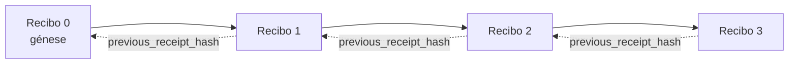

[Watch the lesson video: Securing AI Agents with Cryptographic Receipts](https://youtu.be/PLACEHOLDER_VIDEO_ID)

> _(Vídeo da aula e miniatura a serem adicionados pela equipa de conteúdos da Microsoft após a fusão, seguindo o padrão das aulas 14 / 15.)_

# Protegendo Agentes IA com Recibos Criptográficos

## Introdução

Esta aula irá abordar:

- Porque os registos de auditoria para agentes IA são importantes para conformidade, depuração e confiança.
- O que é um recibo criptográfico e como ele difere de uma linha de log não assinada.
- Como produzir um recibo assinado para uma chamada de ferramenta de um agente em Python simples.
- Como verificar um recibo offline e detetar adulterações.
- Como encadear recibos para que remover ou reordenar um deles quebre a cadeia.
- O que os recibos provam e o que explicitamente não provam.

## Objetivos de Aprendizagem

Após concluir esta aula, saberá como:

- Identificar os modos de falha que motivam a proveniência criptográfica das ações do agente.
- Produzir um recibo assinado com Ed25519 sobre uma carga útil JSON canónica.
- Verificar um recibo independentemente usando apenas a chave pública do signatário.
- Detetar adulterações ao reexecutar a verificação num recibo modificado.
- Construir uma sequência de recibos encadeados por hash e explicar porque a cadeia é importante.
- Reconhecer o limite entre o que os recibos provam (atribuição, integridade, ordenação) e o que não provam (correcção da ação, solidez da política).

## O Problema: Registo de Auditoria do Seu Agente

Imagine que implementou um agente IA para a Contoso Travel. O agente lê pedidos dos clientes, faz chamadas a uma API de voos para procurar opções e reserva lugares em nome do cliente. No último trimestre, o agente processou 50.000 reservas.

Hoje chega um auditor. Ele faz uma pergunta simples: "Mostre-me o que o seu agente fez."

Entrega os seus ficheiros de log. O auditor analisa-os e faz a pergunta mais difícil: "Como posso saber que estes registos não foram editados?"

Este é o problema do registo de auditoria. A maioria das implementações de agentes hoje em dia baseiam-se em:

- **Logs de aplicação**: escritos pelo próprio agente, editáveis por qualquer pessoa com acesso ao sistema de ficheiros.
- **Serviços de logging em nuvem**: evidência de manipulação ao nível da plataforma, mas apenas se o auditor confiar no operador da plataforma.
- **Logs de transações de base de dados**: adequados para alterações na base de dados, mas não para chamadas arbitrárias de ferramentas.

Nenhum destes consegue responder à pergunta do auditor sem que este tenha de confiar em alguém (em si, no seu fornecedor de nuvem, no fornecedor da base de dados). Para uso interno, essa confiança é muitas vezes aceitável. Para cargas de trabalho reguladas (finanças, saúde, qualquer coisa sujeita ao Regulamento Europeu de IA), não é.

Recibos criptográficos resolvem isto, tornando cada ação do agente independentemente verificável. O auditor não precisa confiar em si. Só necessita da sua chave pública e do próprio recibo.

## O que é um Recibo Criptográfico?

Um recibo é um objeto JSON que regista o que um agente fez, assinado com uma assinatura digital.


Um recibo mínimo é assim:

```json
{
  "type": "agent.tool_call.v1",
  "agent_id": "contoso-travel-bot",
  "tool_name": "lookup_flights",
  "tool_args_hash": "sha256:a3f9c1...",
  "result_hash": "sha256:7b2e1d...",
  "policy_id": "contoso-travel-policy-v3",
  "timestamp": "2026-04-25T14:30:00Z",
  "sequence": 47,
  "previous_receipt_hash": "sha256:9d4e6a...",
  "signature": {
    "alg": "EdDSA",
    "sig": "c5af83...",
    "public_key": "8f3b2c..."
  }
}
```

Três propriedades fazem o trabalho:

1. **A assinatura**. O recibo é assinado pelo gateway do agente usando uma chave privada Ed25519. Qualquer pessoa com a chave pública correspondente pode verificar a assinatura offline. Adulterar qualquer campo invalida a assinatura.

2. **Codificação canónica**. Antes de assinar, o recibo é serializado usando o Esquema de Canonicalização JSON (JCS, RFC 8785). Isto assegura que duas implementações que produzam o mesmo recibo lógico produzam uma saída byte-idêntica. Sem canonicidade, diferentes serializadores JSON produziriam assinaturas diferentes para o mesmo conteúdo.

3. **Encadeamento por hash**. O campo `previous_receipt_hash` liga cada recibo ao anterior. Remover ou reordenar um recibo quebra todos os recibos seguintes. A adulteração torna-se visível a nível da cadeia, mesmo que as assinaturas individuais sejam contornadas.

Estas propriedades juntas proporcionam três garantias:

- **Atribuição**: esta chave assinou este conteúdo.
- **Integridade**: o conteúdo não foi alterado desde a assinatura.
- **Ordenação**: este recibo foi emitido depois daquele recibo na cadeia.

## Produzir um Recibo em Python

Não precisa de uma biblioteca especial para produzir um recibo. As primitivas criptográficas estão amplamente disponíveis e a lógica é de poucas dezenas de linhas em Python.

Os exercícios práticos em `code_samples/18-signed-receipts.ipynb` apresentam todo o fluxo. A versão resumida:

```python
import json
import hashlib
import base64
from nacl import signing
from jcs import canonicalize  # JSON canónico RFC 8785

def b64url_nopad(data: bytes) -> str:
    return base64.urlsafe_b64encode(data).decode("ascii").rstrip("=")

def sha256_canonical(obj) -> str:
    """SHA-256 of a Python object's JCS-canonical JSON form."""
    return f"sha256:{hashlib.sha256(canonicalize(obj)).hexdigest()}"

# Gerar ou carregar uma chave de assinatura (em produção, armazenar num cofre de chaves)
signing_key = signing.SigningKey.generate()
verify_key = signing_key.verify_key

# Construir a carga útil do recibo (ainda sem assinatura)
tool_args = {"origin": "SYD", "destination": "LAX"}
tool_result = [{"flight": "QF11", "price": 1850, "stops": 0}]

payload = {
    "type": "agent.tool_call.v1",
    "agent_id": "contoso-travel-bot",
    "tool_name": "lookup_flights",
    "tool_args_hash": sha256_canonical(tool_args),
    "result_hash": sha256_canonical(tool_result),
    "policy_id": "contoso-travel-policy-v3",
    "timestamp": "2026-04-25T14:30:00Z",
    "sequence": 0,
    "previous_receipt_hash": None,
}

# Canonicalizar, hash, assinar.
canonical_bytes = canonicalize(payload)
message_hash = hashlib.sha256(canonical_bytes).digest()
signature_bytes = signing_key.sign(message_hash).signature

# Anexar um objeto de assinatura estruturado.
receipt = {
    **payload,
    "signature": {
        "alg": "EdDSA",
        "sig": b64url_nopad(signature_bytes),
        "public_key": b64url_nopad(bytes(verify_key)),
    },
}
```

Este é todo o pipeline de assinatura. Os exercícios no notebook explicam cada passo detalhadamente.

## Verificar um Recibo e Detetar Adulterações

A verificação é a operação inversa:

```python
import base64
import hashlib
from nacl import signing
from nacl.exceptions import BadSignatureError
from jcs import canonicalize

def b64url_decode(s: str) -> bytes:
    padding = "=" * ((4 - len(s) % 4) % 4)
    return base64.urlsafe_b64decode(s + padding)

def verify_receipt(receipt: dict) -> bool:
    # A assinatura é um objeto estruturado: {"alg", "sig", "public_key"}.
    sig_obj = receipt.get("signature")
    if not sig_obj or sig_obj.get("alg") != "EdDSA":
        return False

    # Reconstrói a carga útil que foi realmente assinada (tudo exceto a assinatura).
    payload = {k: v for k, v in receipt.items() if k != "signature"}

    canonical_bytes = canonicalize(payload)
    message_hash = hashlib.sha256(canonical_bytes).digest()

    try:
        verify_key = signing.VerifyKey(b64url_decode(sig_obj["public_key"]))
        verify_key.verify(message_hash, b64url_decode(sig_obj["sig"]))
        return True
    except BadSignatureError:
        return False
```

Esta função recebe um recibo e retorna `True` se a assinatura for válida, `False` caso contrário. Sem chamadas à rede, sem dependência de serviços, sem necessidade de confiar em terceiros.

Para ver a deteção de adulterações em ação, o notebook mostra:

1. Produzir um recibo válido e confirmar que verifica.
2. Modificar um byte do campo `tool_args_hash`.
3. Voltar a executar a verificação e ver que falha.

Este é um exemplo prático de que os recibos evidenciam adulterações: qualquer modificação, por menor que seja, quebra a assinatura.

## Encadear Recibos para Agentes com Múltiplas Etapas

Um único recibo assinado protege uma ação. Uma cadeia de recibos protege uma sequência.



Cada recibo regista o hash do recibo anterior. Para remover silenciosamente o recibo 2, um atacante teria de:

- Modificar o campo `previous_receipt_hash` do recibo 3 (quebra a assinatura do recibo 3), OU
- Forjar uma nova assinatura num recibo 3 modificado (requer a chave privada do agente).

Se a chave privada estiver num cofre hardware e publicar a chave pública com cada recibo, nenhum destes ataques é factível sem deteção.

O notebook explica:

1. Construir uma cadeia de três recibos.
2. Verificar que o `previous_receipt_hash` de cada recibo corresponde ao hash real do recibo anterior.
3. Manipular um recibo no meio e ver a cadeia quebrar nesse ponto.

É assim que se produz um registo de auditoria que um auditor externo pode verificar sem confiar em si.

## O que os Recibos Provam (e o que Não Provam)

Esta é a secção mais importante desta aula. Recibos são poderosos, mas o seu poder é limitado.

**Os recibos provam três coisas:**

1. **Atribuição**: uma chave específica assinou uma carga útil específica.
2. **Integridade**: a carga útil não foi alterada desde a assinatura.
3. **Ordenação**: este recibo veio depois daquele na cadeia de hashes.

**Os recibos NÃO provam:**

1. **Correcção**: que a ação do agente foi a ação correta. Um recibo pode ser assinado por uma resposta errada tão facilmente quanto por uma correta.
2. **Conformidade com a política**: que a política referida em `policy_id` foi efectivamente avaliada ou que teria permitido esta ação se tivesse sido verificada. O recibo regista o que foi reclamado, não o que foi aplicado.
3. **Identidade além da chave**: o recibo diz "esta chave assinou este conteúdo". Não diz "este humano autorizou isto". Ligar uma chave a uma pessoa ou organização requer uma infraestrutura de identidade separada (directório, registo de chave pública, etc.).
4. **Veracidade das entradas**: se o agente recebe um prompt manipulado e age em conformidade, o recibo regista a ação fielmente. Recibos estão depois da validação da entrada, não substituem essa validação.

Este limite é importante por duas razões:

- Diz para que os recibos são úteis: tornar o comportamento do agente auditável e evidenciar adulterações, mesmo através de fronteiras organizacionais.
- Diz que camadas adicionais o utilizador ainda precisa: validação de entrada (Aula 6), aplicação da política (brevemente coberta abaixo) e infraestrutura de identidade (fora do âmbito desta aula).

Um erro comum é assumir que "temos recibos" significa "estamos governados". Não significa. Recibos são uma base. Governança é o sistema que constrói em cima.

## Referências para Produção

O código Python nesta aula é intencionalmente minimalista para que possa ler linha a linha e entender exatamente o que acontece. Em produção, tem duas opções:

1. **Construir diretamente sobre as primitivas criptográficas.** As 50 linhas que viu acima são suficientes para muitos casos de uso. PyNaCl (Ed25519) e o pacote `jcs` (JSON canónico) são bibliotecas bem mantidas e auditadas.

2. **Usar uma biblioteca de recibos em produção.** Vários projetos open-source implementam o mesmo padrão com funcionalidades adicionais (rotação de chaves, verificação em lote, distribuição de JWK Set, integração com motores de política):
   - O formato de recibo usado nesta aula segue um rascunho IETF Internet-Draft (`draft-farley-acta-signed-receipts`) atualmente no processo de normalização.
   - O Microsoft Agent Governance Toolkit compõe recibos com decisões de política baseadas em Cedar; veja o Tutorial 33 nesse repositório para um exemplo completo.
   - Os pacotes `protect-mcp` (npm) e `@veritasacta/verify` (npm) fornecem uma implementação Node para assinatura e verificação offline de recibos, destinada a proteger qualquer servidor MCP com registo de auditoria evidenciando adulteração.

A decisão entre construir a sua solução ou usar uma biblioteca é como decidir entre escrever a sua própria biblioteca JWT ou usar uma testada: ambas razoáveis; a biblioteca poupa tempo e reduz a superfície de auditoria; o caminho do zero força a compreender cada primitiva. Esta aula ensina o caminho do zero para lhe dar a base para qualquer escolha.

## Verificação de Conhecimento

Teste a sua compreensão antes de avançar para o exercício prático.

**1. Um recibo é assinado com a chave privada Ed25519 do agente. O auditor tem apenas a chave pública. Pode o auditor verificar o recibo offline?**

<details>
<summary>Resposta</summary>

Sim. A verificação Ed25519 requer apenas a chave pública e os bytes assinados. Sem chamadas à rede, sem dependências de serviços. Esta é a propriedade que torna os recibos úteis em ambientes isolados, multi-organização, ou de baixa confiança.
</details>

**2. Um atacante modifica o campo `policy_id` de um recibo para alegar que estava governado por uma política mais permissiva. A assinatura estava sobre a carga original. O que acontece durante a verificação?**

<details>
<summary>Resposta</summary>

A verificação falha. A assinatura foi calculada sobre os bytes canónicos da carga original; modificar qualquer campo altera os bytes canónicos, o que altera o hash SHA-256, tornando a assinatura inválida. O atacante precisaria da chave privada para produzir uma assinatura válida nova, e não a tem.
</details>

**3. Porque é que o recibo inclui um `tool_args_hash` e um `result_hash` em vez dos argumentos e resultados crus?**

<details>
<summary>Resposta</summary>

Por duas razões. Primeiro, o recibo pode precisar ser arquivado ou transmitido em ambientes onde revelar o conteúdo cru (PII, dados comerciais) é problemático. O hashing mantém o recibo pequeno e o conteúdo privado; o auditor verifica que o hash corresponde a uma cópia armazenada separadamente do conteúdo real. Segundo, hashes têm tamanho fixo; um recibo com hashes tem tamanho limitado independentemente do tamanho dos inputs e outputs.
</details>

**4. O campo `previous_receipt_hash` liga cada recibo ao seu predecessor. Se um atacante eliminar silenciosamente um recibo do meio da cadeia, o que fica inválido?**

<details>
<summary>Resposta</summary>

Cada recibo que veio depois do eliminado. Os seus campos `previous_receipt_hash` já não correspondem à cadeia real (porque o recibo a que faziam referência já não existe, ou a cadeia agora aponta para outro predecessor). Para ocultar a eliminação, o atacante teria de re-assinar todos os recibos posteriores, o que requer a chave privada.
</details>

**5. Um recibo verifica corretamente. Isso prova que a ação do agente estava correcta, sólida ou em conformidade com a política?**

<details>
<summary>Resposta</summary>

Não. Um recibo válido prova três coisas: atribuição (esta chave assinou este conteúdo), integridade (o conteúdo não mudou) e ordenação (este recibo veio depois daquele). NÃO prova que a ação foi correta, que a política indicada em `policy_id` foi efectivamente avaliada, ou que o agente seguiu todas as regras. Recibos tornam o comportamento do agente auditável, não necessariamente correcto. Este é o limite mais importante da aula.
</details>

## Exercício Prático

Abra `code_samples/18-signed-receipts.ipynb` e complete as quatro secções:

1. **Secção 1**: Assine o seu primeiro recibo e verifique-o.
2. **Secção 2**: Manipule o recibo e observe a falha na verificação.
3. **Secção 3**: Construa uma cadeia de três recibos e verifique a integridade da cadeia.
4. **Secção 4**: Aplique o padrão a um agente construído com o Microsoft Agent Framework: envolva uma chamada de ferramenta na assinatura do recibo, depois verifique o recibo independentemente.

**Desafio extra 1:** alargue o esquema do recibo com um campo adicional à sua escolha (por exemplo, um ID de pedido para rastreio), atualize a lógica canónica de assinatura para o incluir, e confirme que o recibo passa ainda a verificação. Depois modifique o campo após a assinatura e confirme que a verificação falha. Isto obriga a compreender como cada byte da codificação canónica contribui para a assinatura.
**Desafio extra 2:** Faça o hash SHA-256 de dois dos seus recibos juntos (concatene os seus bytes canónicos numa ordem determinística) e incorpore o resumo resultante como um novo campo num terceiro recibo antes de o assinar. Verifique que os três recibos ainda podem ser revertidos para o seu estado original. Acabou de construir uma prova de inclusão em um passo: qualquer pessoa que possua o terceiro recibo pode provar que os dois primeiros existiam na altura em que foi assinado, sem precisar revelar o seu conteúdo. Este é o padrão que os recibos de divulgação seletiva usam em grande escala (compromissos de Merkle, RFC 6962).

## Conclusão

Os recibos criptográficos fornecem aos agentes de IA uma trilha de auditoria que é:

- **Independemente verificável**: qualquer parte com a chave pública pode verificar, sem dependência de serviço.
- **Com evidência de adulteração**: qualquer modificação invalida a assinatura.
- **Portátil**: um recibo é um pequeno ficheiro JSON; pode ser arquivado, transmitido e verificado em qualquer lugar.
- **Alinhado com standards**: construído sobre Ed25519 (RFC 8032), JCS (RFC 8785) e SHA-256, todos primitivos amplamente utilizados.

Eles não substituem a validação de entrada, aplicação de políticas ou infraestrutura de identidade. São uma base para essas camadas. Quando está a colocar agentes em cargas de trabalho reguladas, fluxos de trabalho multi-organização, ou qualquer cenário em que um auditor futuro não possa presumir confiar em si, os recibos são a forma de tornar a trilha de auditoria honesta.

O ponto mais importante: os recibos provam quem disse o quê, quando. Não provam que o que foi dito era verdade ou correto. Mantenha essa distinção bem clara. É a diferença entre um sistema de proveniência honesto e um enganador.

## Lista de Verificação para Produção

Quando estiver pronto para passar desta lição para a implementação de agentes assinados com recibos num ambiente real:

- [ ] **Mova a chave de assinatura para fora do computador do programador.** Use Azure Key Vault, AWS KMS ou um módulo de segurança de hardware. A chave privada que assina os seus recibos nunca deve estar no controlo de código fonte ou em texto simples nas máquinas da aplicação.
- [ ] **Publique a chave pública de verificação.** Os auditores precisam dela para verificar offline. O padrão é um JWK Set num URL bem conhecido (RFC 7517), por exemplo, `https://your-org.example.com/.well-known/agent-keys.json`.
- [ ] **Ancore a cadeia externamente.** Periodicamente, escreva o hash da cabeça da cadeia mais recente num log de transparência (Sigstore Rekor, autoridade de carimbo de tempo RFC 3161, ou um segundo sistema interno) para que uma parte externa possa confirmar "esta cadeia existia nesta altura."
- [ ] **Armazene os recibos de forma imutável.** Armazenamento append-only (Azure Storage com políticas de imutabilidade, AWS S3 Object Lock) evita que um insider reescreva o histórico ao nível do armazenamento.
- [ ] **Decida a retenção.** Muitos regimes de conformidade exigem retenção de vários anos. Planeie para o crescimento dos recibos (cada recibo tem ~500 bytes; um agente que faça 10 mil chamadas por dia produz ~1.8 GB por ano).
- [ ] **Documente o que os recibos não cobrem.** Os recibos provam atribuição, integridade e ordenação. O seu manual deve listar explicitamente quais os controlos adicionais (validação de entrada, aplicação de políticas, limitação de taxa, infraestrutura de identidade) que coexistem com recibos na sua postura de governação.

### Tem Mais Perguntas sobre Segurança para Agentes de IA?

Junte-se ao [Microsoft Foundry Discord](https://aka.ms/ai-agents/discord) para conhecer outros aprendizes, participar em horas de atendimento e obter respostas às suas perguntas sobre Agentes de IA.

## Para Além Desta Lição

Esta lição cobre a assinatura com recibo único e sequências encadeadas por hash. Os mesmos primitivos compõem vários padrões mais avançados que poderá encontrar à medida que a sua postura de governação se desenvolve:

- **Divulgação seletiva.** Quando os campos de um recibo são comprometidos independentemente (árvore de Merkle ao estilo RFC 6962), pode revelar campos específicos a auditores específicos e provar que os restantes não foram alterados sem os expor. Útil quando o mesmo recibo tem de satisfazer tanto uma auditoria abrangente (que quer completude) como regulamentos de minimização de dados como o GDPR (que querem que o auditor veja o mínimo necessário).
- **Revogação de recibos.** Se uma chave de assinatura for comprometida, precisa de uma forma de marcar todos os recibos assinados por essa chave como não confiáveis a partir de um determinado momento. Padrões comuns: chaves de assinatura de curta duração mais uma lista publicada de revogação, ou um log de transparência com entradas de revogação.
- **Recibos bilaterais / com assinatura dividida.** Algumas implementações dividem a carga assinada em duas metades com assinaturas independentes: pré-execução (`authorization_*`) e pós-execução (`result_*`), útil quando a decisão de autorização e o resultado observado são produzidos por atores diferentes ou em momentos diferentes. Isto compõe-se de forma aditiva por cima do formato de recibo ensinado nesta lição.
- **Composição da carga.** Um recibo sela quaisquer bytes que colocar em `result_hash`. Cargas reais são frequentemente mais ricas do que o resultado de uma única chamada de ferramenta: raciocínio pré-decisão (predição de modelo, opções consideradas, evidência e sua completude, postura de risco, cadeia de responsabilidade, resultado do gate) podem todas residir na carga, seladas por um único recibo. Isto mantém o formato do recibo minimalista ao mesmo tempo que permite que os esquemas de carga evoluam domínio a domínio.
- **Conformidade cruzada de implementações.** Múltiplas implementações independentes do mesmo formato de recibo (Python, TypeScript, Rust, Go) verificam cruzadamente contra vetores de teste partilhados. Se criar a sua própria implementação, validar contra vetores publicados confirma a compatibilidade do protocolo.
- **Migração pós-quântica.** Ed25519 está amplamente implantado hoje, mas não é resistente a computadores quânticos. O formato do recibo é ágil em relação ao algoritmo: o campo `signature.alg` pode transportar `ML-DSA-65` (o standard NIST para assinaturas pós-quânticas) quando precisar de migrar. Planeie um período de transição em que os recibos tenham assinaturas duplas.

## Recursos Adicionais

- <a href="https://datatracker.ietf.org/doc/draft-farley-acta-signed-receipts/" target="_blank">IETF Internet-Draft: Recibos de Decisão Assinados para Controlo de Acesso Máquina-a-Máquina</a>
- <a href="https://learn.microsoft.com/azure/ai-studio/responsible-use-of-ai-overview" target="_blank">Visão geral de IA responsável (Azure AI)</a>
- <a href="https://datatracker.ietf.org/doc/html/rfc8032" target="_blank">RFC 8032: Algoritmo Digital de Assinatura Edwards-Curve (EdDSA)</a>
- <a href="https://datatracker.ietf.org/doc/html/rfc8785" target="_blank">RFC 8785: Esquema de Canonicalização JSON (JCS)</a>
- <a href="https://datatracker.ietf.org/doc/html/rfc6962" target="_blank">RFC 6962: Transparência de Certificados</a> (construção de árvore de Merkle usada por recibos de divulgação seletiva)
- <a href="https://github.com/microsoft/agent-governance-toolkit/blob/main/docs/tutorials/33-offline-verifiable-receipts.md" target="_blank">Microsoft Agent Governance Toolkit, Tutorial 33: Recibos de Decisão Verificáveis Offline</a>
- <a href="https://github.com/ScopeBlind/agent-governance-testvectors" target="_blank">Vetores de teste de conformidade cruzada</a> para o formato de recibo usado nesta lição (Apache-2.0)
- <a href="https://pynacl.readthedocs.io/" target="_blank">Documentação PyNaCl</a> (Ed25519 em Python)

## Lição Anterior

[Construir Agentes de Uso de Computador (CUA)](../15-browser-use/README.md)

## Próxima Lição

_(A determinar pelos mantenedores do currículo)_

---

<!-- CO-OP TRANSLATOR DISCLAIMER START -->
**Aviso Legal**:
Este documento foi traduzido utilizando o serviço de tradução automática [Co-op Translator](https://github.com/Azure/co-op-translator). Embora nos esforcemos pela precisão, esteja ciente de que traduções automáticas podem conter erros ou imprecisões. O documento original na sua língua nativa deve ser considerado a fonte autorizada. Para informações críticas, recomenda-se tradução profissional humana. Não nos responsabilizamos por quaisquer mal-entendidos ou interpretações incorretas resultantes da utilização desta tradução.
<!-- CO-OP TRANSLATOR DISCLAIMER END -->