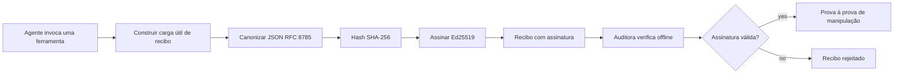
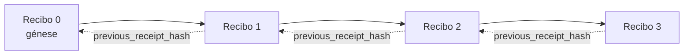

[Veja o vídeo da lição: Assegurar Agentes de IA com Recibos Criptográficos](https://youtu.be/PLACEHOLDER_VIDEO_ID)

> _(O vídeo da lição e a miniatura serão adicionados pela equipa de conteúdos da Microsoft após a junção, seguindo o padrão da lição 14 / 15.)_

# Assegurar Agentes de IA com Recibos Criptográficos

## Introdução

Esta lição irá cobrir:

- Porque é que os registos de auditoria para agentes de IA são importantes para conformidade, depuração e confiança.
- O que é um recibo criptográfico e como ele difere de uma linha de registo não assinada.
- Como produzir um recibo assinado para a chamada de uma ferramenta de um agente em Python simples.
- Como verificar um recibo offline e detetar adulterações.
- Como encadear recibos de modo que remover ou reordenar um quebre a cadeia.
- O que os recibos provam e o que explicitamente não provam.

## Objetivos de Aprendizagem

Depois de completar esta lição, saberá como:

- Identificar os modos de falha que motivam a proveniência criptográfica para ações de agentes.
- Produzir um recibo assinado Ed25519 sobre uma carga útil JSON canónica.
- Verificar um recibo independentemente usando apenas a chave pública do assinante.
- Detetar adulteração ao reexecutar a verificação num recibo modificado.
- Construir uma sequência encadeada de recibos e explicar porque é que a cadeia importa.
- Reconhecer o limite entre o que os recibos provam (atribuibilidade, integridade, ordenação) e o que não provam (correção da ação, validade da política).

## O Problema: A Trajetória de Auditoria do Seu Agente

Imagine que implementou um agente de IA para a Contoso Travel. O agente lê pedidos dos clientes, chama uma API de voos para consultar opções e reserva lugares em nome do cliente. No último trimestre, o agente processou 50.000 reservas.

Hoje chega um auditor. Ele faz uma pergunta simples: "Mostre-me o que o seu agente fez."

Entrega os seus ficheiros de registo. O auditor olha para eles e faz a pergunta mais difícil: "Como sei que estes registos não foram editados?"

Este é o problema da trajetória de auditoria. A maioria das implementações de agentes hoje em dia depende de:

- **Registos de aplicação**: escritos pelo próprio agente, editáveis por qualquer pessoa com acesso ao sistema de ficheiros.
- **Serviços de registo na cloud**: à prova de adulteração a nível da plataforma mas só se o auditor confiar no operador da plataforma.
- **Registos de transações em bases de dados**: adequados para alterações em bases de dados mas não para chamadas arbitrárias de ferramentas.

Nenhum destes pode responder à pergunta do auditor sem que este tenha que confiar em alguém (você, o seu fornecedor de cloud, o fornecedor da base de dados). Para uso interno, essa confiança é muitas vezes aceitável. Para cargas de trabalho reguladas (finanças, saúde, qualquer coisa sujeita ao Regime de IA da UE), não é.

Os recibos criptográficos resolvem isto tornando cada ação do agente verificável independentemente. O auditor não precisa de confiar em si. Só precisa da sua chave pública e do próprio recibo.

## O Que é um Recibo Criptográfico?

Um recibo é um objeto JSON que regista o que um agente fez, assinado com uma assinatura digital.



Um recibo minimalista parece assim:

```json
{
  "type": "agent.tool_call.v1",
  "agent_id": "contoso-travel-bot",
  "tool_name": "lookup_flights",
  "tool_args_hash": "sha256:a3f9c1...",
  "result_hash": "sha256:7b2e1d...",
  "policy_id": "contoso-travel-policy-v3",
  "timestamp": "2026-04-25T14:30:00Z",
  "sequence": 47,
  "previous_receipt_hash": "sha256:9d4e6a...",
  "signature": {
    "alg": "EdDSA",
    "sig": "c5af83...",
    "public_key": "8f3b2c..."
  }
}
```

Três propriedades fazem o trabalho:

1. **A assinatura**. O recibo é assinado pelo gateway do agente, usando uma chave privada Ed25519. Quem tiver a chave pública correspondente pode verificar a assinatura offline. Qualquer adulteração de um campo invalida a assinatura.

2. **Codificação canónica**. Antes de assinar, o recibo é serializado usando o JSON Canonicalization Scheme (JCS, RFC 8785). Isto garante que duas implementações que produzem o mesmo recibo lógico geram saída byte-idêntica. Sem canoicalização, diferentes serializadores JSON produziriam assinaturas diferentes para o mesmo conteúdo.

3. **Encadeamento por hash**. O campo `previous_receipt_hash` liga cada recibo ao anterior. Remover ou reordenar um recibo quebra todos os recibos posteriores. A adulteração torna-se visível a nível da cadeia mesmo que as assinaturas individuais sejam ultrapassadas.

Juntas, estas propriedades fornecem três garantias:

- **Atribuição**: esta chave assinou este conteúdo.
- **Integridade**: o conteúdo não mudou desde a assinatura.
- **Ordenação**: este recibo veio depois daquele na cadeia.

## Produzir um Recibo em Python

Não precisa de uma biblioteca especial para produzir um recibo. As primitivas criptográficas estão amplamente disponíveis e a lógica é de poucas dezenas de linhas de Python.

Os exercícios práticos em `code_samples/18-signed-receipts.ipynb` percorrem o fluxo completo. A versão resumida:

```python
import json
import hashlib
import base64
from nacl import signing
from jcs import canonicalize  # RFC 8785 JSON canónico

def b64url_nopad(data: bytes) -> str:
    return base64.urlsafe_b64encode(data).decode("ascii").rstrip("=")

def sha256_canonical(obj) -> str:
    """SHA-256 of a Python object's JCS-canonical JSON form."""
    return f"sha256:{hashlib.sha256(canonicalize(obj)).hexdigest()}"

# Gerar ou carregar uma chave de assinatura (em produção, armazenar num cofre de chaves)
signing_key = signing.SigningKey.generate()
verify_key = signing_key.verify_key

# Construir a carga útil do recibo (ainda sem assinatura)
tool_args = {"origin": "SYD", "destination": "LAX"}
tool_result = [{"flight": "QF11", "price": 1850, "stops": 0}]

payload = {
    "type": "agent.tool_call.v1",
    "agent_id": "contoso-travel-bot",
    "tool_name": "lookup_flights",
    "tool_args_hash": sha256_canonical(tool_args),
    "result_hash": sha256_canonical(tool_result),
    "policy_id": "contoso-travel-policy-v3",
    "timestamp": "2026-04-25T14:30:00Z",
    "sequence": 0,
    "previous_receipt_hash": None,
}

# Canonicalizar, hash, assinar.
canonical_bytes = canonicalize(payload)
message_hash = hashlib.sha256(canonical_bytes).digest()
signature_bytes = signing_key.sign(message_hash).signature

# Anexar um objeto de assinatura estruturado.
receipt = {
    **payload,
    "signature": {
        "alg": "EdDSA",
        "sig": b64url_nopad(signature_bytes),
        "public_key": b64url_nopad(bytes(verify_key)),
    },
}
```

Este é todo o pipeline de assinatura. Os exercícios no notebook explicam cada passo.

## Verificar um Recibo e Detetar Adulteração

A verificação é a operação inversa:

```python
import base64
import hashlib
from nacl import signing
from nacl.exceptions import BadSignatureError
from jcs import canonicalize

def b64url_decode(s: str) -> bytes:
    padding = "=" * ((4 - len(s) % 4) % 4)
    return base64.urlsafe_b64decode(s + padding)

def verify_receipt(receipt: dict) -> bool:
    # A assinatura é um objeto estruturado: {"alg", "sig", "public_key"}.
    sig_obj = receipt.get("signature")
    if not sig_obj or sig_obj.get("alg") != "EdDSA":
        return False

    # Reconstrua o payload que foi realmente assinado (tudo exceto a assinatura).
    payload = {k: v for k, v in receipt.items() if k != "signature"}

    canonical_bytes = canonicalize(payload)
    message_hash = hashlib.sha256(canonical_bytes).digest()

    try:
        verify_key = signing.VerifyKey(b64url_decode(sig_obj["public_key"]))
        verify_key.verify(message_hash, b64url_decode(sig_obj["sig"]))
        return True
    except BadSignatureError:
        return False
```

Esta função recebe um recibo e retorna `True` se a assinatura for válida, `False` caso contrário. Sem chamadas de rede, sem dependência de serviços, sem necessidade de confiar em terceiros.

Para ver a detecção de adulteração em ação, o notebook percorre:

1. Produzir um recibo válido e confirmar que verifica.
2. Modificar um byte do campo `tool_args_hash`.
3. Reexecutar a verificação e ver que falha.

Esta é a demonstração prática de que os recibos são à prova de adulteração: qualquer modificação, por mínima que seja, quebra a assinatura.

## Encadear Recibos para Agentes Multi-etapa

Um único recibo assinado protege uma ação. Uma cadeia de recibos protege uma sequência.



Cada recibo regista o hash do recibo anterior. Para remover silenciosamente o recibo 2, um atacante teria que:

- Modificar o campo `previous_receipt_hash` do recibo 3 (quebra a assinatura do recibo 3), OU
- Forjar uma nova assinatura no recibo 3 modificado (requer a chave privada do agente).

Se a chave privada estiver num hardware key vault e publicar a chave pública com cada recibo, nenhum destes ataques é viável sem deteção.

O notebook percorre:

1. Construir uma cadeia de três recibos.
2. Verificar que o `previous_receipt_hash` de cada recibo corresponde ao hash real do recibo anterior.
3. Adulterar um recibo no meio e ver a cadeia quebrar exatamente nesse ponto.

É assim que produz uma trajetória de auditoria que um auditor externo pode verificar sem confiar em si.

## O Que os Recibos Provam (e o Que Não Provam)

Esta é a secção mais importante desta lição. Os recibos são poderosos mas o seu poder tem limites.

**Os recibos provam três coisas:**

1. **Atribuição**: uma chave específica assinou uma carga útil específica.
2. **Integridade**: a carga útil não mudou desde a assinatura.
3. **Ordenação**: este recibo veio depois daquele na cadeia de hash.

**Os recibos NÃO provam:**

1. **Correção**: que a ação do agente foi a ação correta. Um recibo pode ser assinado por uma resposta errada tão facilmente como por uma resposta correta.
2. **Conformidade com a política**: que a política referida em `policy_id` foi realmente avaliada, ou que teria permitido esta ação se verificada. O recibo regista o que foi alegado, não o que foi aplicado.
3. **Identidade para além da chave**: o recibo diz "esta chave assinou este conteúdo." Não diz "este humano autorizou isto." Ligar uma chave a uma pessoa ou organização requer infraestrutura de identidade separada (um diretório, um registo de chaves públicas, etc.).
4. **Verdade dos inputs**: se o agente recebe um prompt manipulado e age com base nele, o recibo regista essa ação fielmente. Os recibos estão a jusante da validação de inputs, não são um substituto dela.

Este limite é importante por duas razões:

- Diz para que é que os recibos são úteis: tornar o comportamento do agente auditável e evidente para adulteração, mesmo entre organizações.
- Diz que camadas adicionais ainda são necessárias: validação de inputs (Lição 6), aplicação de políticas (coberta brevemente abaixo), e infraestrutura de identidade (fora do escopo desta lição).

Um erro comum é assumir que "temos recibos" significa "temos governação." Não significa. Os recibos são uma base. A governação é o sistema que constrói sobre ela.

## Referências de Produção

O código Python nesta lição é intencionalmente minimalista para que possa ler cada linha e entender exatamente o que está a acontecer. Em produção, tem duas opções:

1. **Construir diretamente sobre as primitivas criptográficas.** As 50 linhas que viu acima são suficientes para muitos casos. PyNaCl (Ed25519) e o pacote `jcs` (JSON canónico) são bibliotecas bem mantidas e auditadas.

2. **Usar uma biblioteca de recibos para produção.** Vários projetos open-source implementam o mesmo padrão com funcionalidades adicionais (rotação de chaves, verificação em lote, distribuição de conjuntos JWK, integração com motores de políticas):
   - O formato de recibo usado nesta lição segue um Internet-Draft IETF (`draft-farley-acta-signed-receipts`) atualmente em processo de normalização.
   - O Microsoft Agent Governance Toolkit compõe recibos com decisões de política baseadas em Cedar; veja o Tutorial 33 nesse repositório para um exemplo completo.
   - Os pacotes `protect-mcp` (npm) e `@veritasacta/verify` (npm) fornecem uma implementação baseada em Node de assinatura de recibos e verificação offline, destinados a envolver qualquer servidor MCP com uma trajetória de auditoria à prova de adulteração.
   - O SDK Python **[nobulex](https://github.com/arian-gogani/nobulex)** (`pip install nobulex`) fornece o mesmo padrão de assinatura Ed25519 + JCS em Python com integrações LangChain e CrewAI, incluindo vetores de teste cruzados publicados e um mapeamento de conformidade contribuído via [OWASP PR #2210](https://github.com/OWASP/CheatSheetSeries/pull/2210).

A decisão entre construir o seu próprio e usar uma biblioteca espelha a decisão entre escrever a sua própria biblioteca JWT e usar uma testada: ambos são razoáveis; a biblioteca poupa tempo e reduz a superfície de auditoria; a abordagem do zero obriga a entender cada primitiva. Esta lição ensina o caminho do zero para que tenha a base para qualquer escolha.

## Verificação de Conhecimentos

Teste a sua compreensão antes de avançar para o exercício prático.

**1. Um recibo é assinado com a chave privada Ed25519 do agente. O auditor só tem a chave pública. Pode o auditor verificar o recibo offline?**

<details>
<summary>Resposta</summary>

Sim. A verificação Ed25519 requer apenas a chave pública e os bytes assinados. Sem chamadas de rede, sem dependência de serviços. Esta é a propriedade que torna os recibos úteis em ambientes isolados, multi-organizações ou de baixa confiança.
</details>

**2. Um atacante modifica o campo `policy_id` de um recibo para alegar que foi governado por uma política mais permissiva. A assinatura era sobre a carga útil original. O que acontece durante a verificação?**

<details>
<summary>Resposta</summary>

A verificação falha. A assinatura foi calculada sobre os bytes canónicos da carga útil original; modificar qualquer campo altera os bytes canónicos, o que altera o hash SHA-256, invalidando a assinatura. O atacante precisaria da chave privada para produzir uma nova assinatura válida, que não tem.
</details>

**3. Porque é que o recibo inclui um `tool_args_hash` e `result_hash` em vez dos argumentos e resultado brutos?**

<details>
<summary>Resposta</summary>

Por duas razões. Primeiro, o recibo pode precisar de ser arquivado ou transmitido em ambientes onde vazar o conteúdo bruto (dados pessoais, dados empresariais) é problemático. O hashing mantém o recibo pequeno e o conteúdo privado; o auditor verifica que o hash corresponde a uma cópia armazenada separadamente do conteúdo real. Segundo, os hashes têm tamanho fixo; um recibo com hashes tem tamanho limitado independentemente do tamanho dos inputs e outputs.
</details>

**4. O campo `previous_receipt_hash` liga cada recibo ao seu predecessor. Se um atacante eliminar silenciosamente um recibo no meio da cadeia, o que se torna inválido?**

<details>
<summary>Resposta</summary>

Todos os recibos que vieram depois do eliminado. Os seus campos `previous_receipt_hash` deixam de coincidir com a cadeia real (porque o recibo referido já não existe, ou porque a cadeia agora aponta para um predecessor diferente). Para ocultar a eliminação, o atacante teria que reassinar todos os recibos posteriores, o que requer a chave privada.
</details>

**5. Um recibo verifica-se corretamente. Isso prova que a ação do agente foi correta, válida ou conforme a política?**

<details>
<summary>Resposta</summary>

Não. Um recibo válido prova três coisas: atribuição (esta chave assinou este conteúdo), integridade (o conteúdo não mudou) e ordenação (este recibo veio depois daquele). Não prova que a ação foi correta, que a política indicada em `policy_id` foi realmente avaliada, ou que o agente seguiu todas as regras. Os recibos tornam o comportamento do agente auditável, não necessariamente correto. Este é o limite mais importante da lição.
</details>

## Exercício Prático

Abra `code_samples/18-signed-receipts.ipynb` e complete as quatro secções:

1. **Secção 1**: Assine o seu primeiro recibo e verifique-o.
2. **Secção 2**: Adulte o recibo e observe a falha na verificação.
3. **Secção 3**: Construa uma cadeia de três recibos e verifique a integridade da cadeia.
4. **Secção 4**: Aplique o padrão a um agente construído com o Microsoft Agent Framework: envolva uma chamada a uma ferramenta na assinatura do recibo e depois verifique o recibo independentemente.
**Desafio estendido 1:** expanda o esquema do recibo com um campo adicional à sua escolha (por exemplo, um ID de pedido para rastreamento), atualize a lógica de assinatura canónica para incluí-lo e confirme que o recibo ainda passa pela verificação de ida e volta. Depois modifique o campo após a assinatura e confirme que a verificação falha. Isto força a entender como cada byte da codificação canónica contribui para a assinatura.

**Desafio estendido 2:** calcule o hash SHA-256 de dois dos seus recibos juntos (concatene os seus bytes canónicos numa ordem determinística) e incorpore o resumo resultante como um novo campo num terceiro recibo antes de o assinar. Verifique que os três recibos ainda passam pela verificação de ida e volta. Acaba de construir uma prova de inclusão de um passo: qualquer pessoa que possua o terceiro recibo pode provar que os dois primeiros existiam no momento em que foi assinado, sem precisar revelar os seus conteúdos. Este é o padrão que os recibos de divulgação seletiva usam à escala (compromissos Merkle, RFC 6962).

## Conclusão

Os recibos criptográficos fornecem aos agentes de IA um registo de auditoria que é:

- **Verificável de forma independente**: qualquer parte com a chave pública pode verificar, sem dependência de serviço.
- **Detetável em caso de adulteração**: qualquer modificação invalida a assinatura.
- **Portátil**: um recibo é um pequeno ficheiro JSON; pode ser arquivado, transmitido e verificado em qualquer lugar.
- **Alinhado com padrões**: construído sobre Ed25519 (RFC 8032), JCS (RFC 8785) e SHA-256, todos primitivas amplamente implementadas.

Não são um substituto para a validação de entradas, aplicação de políticas ou infraestruturas de identidade. São a base para essas camadas. Quando estiver a implantar agentes em cargas de trabalho regulamentadas, fluxos de trabalho multi-organização ou qualquer ambiente onde um auditor futuro não possa assumir confiança em si, os recibos são como torna honesto o registo de auditoria.

A lição mais importante: os recibos provam quem disse o quê e quando. Não provam que o que foi dito é verdadeiro ou correto. Mantenha essa distinção bem clara. É a diferença entre um sistema de proveniência honesto e um enganador.

## Lista de Verificação para Produção

Quando estiver pronto para passar desta lição para implantar agentes assinados com recibos num ambiente real:

- [ ] **Mova a chave de assinatura para fora do portátil do desenvolvedor.** Use Azure Key Vault, AWS KMS ou um módulo de segurança hardware. A chave privada que assina os seus recibos nunca deve estar em controlo de versão nem em texto claro nas máquinas da aplicação.
- [ ] **Publique a chave pública de verificação.** Os auditores precisam dela para verificar offline. O padrão é um JWK Set numa URL bem conhecida (RFC 7517), ex.: `https://your-org.example.com/.well-known/agent-keys.json`.
- [ ] **Ancore a cadeia externamente.** Periodicamente grave o hash do último cabeçalho da cadeia num log de transparência (Sigstore Rekor, autoridade de carimbo de tempo RFC 3161, ou um segundo sistema interno) para que uma parte externa possa confirmar "esta cadeia existia nesta altura."
- [ ] **Armazene recibos de forma imutável.** Armazenamento blob só em apêndice (Azure Storage com políticas de imutabilidade, AWS S3 Object Lock) impede que um insider reescreva a história ao nível do armazenamento.
- [ ] **Decida sobre retenção.** Muitos regimes de conformidade exigem retenção plurianual. Planeie o crescimento dos recibos (cada recibo tem cerca de 500 bytes; um agente que faz 10 mil chamadas por dia produz cerca de 1,8 GB por ano).
- [ ] **Documente o que os recibos não cobrem.** Recibos provam atribuição, integridade e ordenação. O seu manual deve listar explicitamente que controlos adicionais (validação de entrada, aplicação de políticas, limitação de taxa, infraestruturas de identidade) estão juntamente com os recibos na sua postura de governação.

### Tem Mais Perguntas sobre Como Proteger Agentes de IA?

Junte-se ao [Microsoft Foundry Discord](https://aka.ms/ai-agents/discord) para reunir-se com outros aprendizes, participar em horas de atendimento e obter respostas para as suas dúvidas sobre Agentes de IA.

## Para Além Desta Lição

Esta lição cobre a assinatura única de recibos e sequências encadeadas por hash. As mesmas primitivas compõem vários padrões mais avançados que pode encontrar à medida que a sua postura de governação amadurece:

- **Divulgação seletiva.** Quando os campos de um recibo são comprometidos de forma independente (árvore Merkle estilo RFC 6962), pode revelar campos específicos a auditores específicos e provar que os restantes não foram alterados sem os expor. Útil quando o mesmo recibo tem de satisfazer uma auditoria abrangente (que quer completude) e regulamentos de minimização de dados como o RGPD (que querem que o auditor veja o mínimo necessário).
- **Revogação de recibos.** Se uma chave de assinatura for comprometida, precisa de uma forma de marcar todos os recibos assinados por essa chave como não confiáveis a partir de um determinado momento. Padrões comuns: chaves de assinatura de curta duração com lista de revogação publicada, ou log de transparência com entradas de revogação.
- **Recibos bilaterais / de assinatura dividida.** Algumas implementações dividem a carga útil assinada em metades pré-execução (`authorization_*`) e pós-execução (`result_*`) com assinaturas independentes, útil quando a decisão de autorização e o resultado observado são produzidos por atores diferentes ou em momentos diferentes. Isto acrescenta-se ao formato de recibo ensinado nesta lição.
- **Composição da carga útil.** Um recibo sela os bytes que colocar em `result_hash`. Cargas úteis do mundo real são muitas vezes mais ricas do que o resultado de uma única chamada a ferramenta: raciocínio pré-decisão (previsão do modelo, opções consideradas, evidência e a sua completude, postura de risco, cadeia de responsabilidade, resultado do gate) podem residir na carga útil, selados por um único recibo. Isto mantém o formato de recibo minimalista ao permitir que esquemas de carga útil evoluam domain-by-domain.
- **Conformidade entre implementações.** Múltiplas implementações independentes do mesmo formato de recibo (Python, TypeScript, Rust, Go) verificam cruzadamente contra vetores de teste partilhados. Se construir a sua própria implementação, validar contra vetores publicados confirma compatibilidade na comunicação.
- **Migração pós-quântica.** Ed25519 está amplamente implementado hoje mas não é resistente a ataques quânticos. O formato do recibo é algoritmo-ágeil: o campo `signature.alg` pode conter `ML-DSA-65` (o padrão de assinatura pós-quântica NIST) quando precisar migrar. Planear um período de transição onde recibos sejam assinados duplamente.

## Recursos Adicionais

- <a href="https://datatracker.ietf.org/doc/draft-farley-acta-signed-receipts/" target="_blank">IETF Internet-Draft: Recibos de Decisão Assinados para Controlo de Acesso Máquina-a-Máquina</a>
- <a href="https://learn.microsoft.com/azure/ai-studio/responsible-use-of-ai-overview" target="_blank">Visão geral de IA responsável (Azure IA)</a>
- <a href="https://datatracker.ietf.org/doc/html/rfc8032" target="_blank">RFC 8032: Algoritmo de Assinatura Digital de Curva Edwards (EdDSA)</a>
- <a href="https://datatracker.ietf.org/doc/html/rfc8785" target="_blank">RFC 8785: Esquema de Canonicalização JSON (JCS)</a>
- <a href="https://datatracker.ietf.org/doc/html/rfc6962" target="_blank">RFC 6962: Transparência de Certificados</a> (construção de árvore Merkle usada por recibos de divulgação seletiva)
- <a href="https://github.com/microsoft/agent-governance-toolkit/blob/main/docs/tutorials/33-offline-verifiable-receipts.md" target="_blank">Microsoft Agent Governance Toolkit, Tutorial 33: Recibos de Decisão Verificáveis Offline</a>
- <a href="https://github.com/ScopeBlind/agent-governance-testvectors" target="_blank">Vetores de teste de conformidade entre implementações</a> para o formato de recibo usado nesta lição (Apache-2.0)
- <a href="https://pynacl.readthedocs.io/" target="_blank">Documentação PyNaCl</a> (Ed25519 em Python)

## Lição Anterior

[Construir Agentes de Uso de Computador (CUA)](../15-browser-use/README.md)

## Próxima Lição

_(A ser determinada pelos responsáveis pelo currículo)_

---

<!-- CO-OP TRANSLATOR DISCLAIMER START -->
**Aviso Legal**:
Este documento foi traduzido utilizando o serviço de tradução automática [Co-op Translator](https://github.com/Azure/co-op-translator). Embora nos esforcemos pela precisão, esteja ciente de que traduções automáticas podem conter erros ou imprecisões. O documento original na sua língua nativa deve ser considerado a fonte autorizada. Para informações críticas, recomenda-se tradução profissional humana. Não nos responsabilizamos por quaisquer mal-entendidos ou interpretações incorretas resultantes da utilização desta tradução.
<!-- CO-OP TRANSLATOR DISCLAIMER END -->