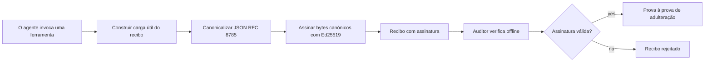
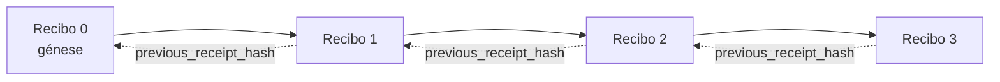

[Veja o vídeo da lição: Segurança de Agentes de IA com Recibos Criptográficos](https://youtu.be/PLACEHOLDER_VIDEO_ID)

> _(Vídeo da lição e miniatura a serem adicionados pela equipa de conteúdos da Microsoft após a fusão, seguindo o padrão da lição 14/15.)_

# Segurança de Agentes de IA com Recibos Criptográficos

## Introdução

Esta lição irá abordar:

- Porque é que os registos de auditoria para agentes de IA são importantes para conformidade, depuração e confiança.
- O que é um recibo criptográfico e como se diferencia de uma linha de registo não assinada.
- Como produzir um recibo assinado para uma chamada de ferramenta do agente em Python simples.
- Como verificar um recibo offline e detetar manipulação.
- Como encadear recibos de forma que remover ou reordenar um quebre a cadeia.
- O que os recibos provam e o que explicitamente não provam.

## Objetivos de Aprendizagem

Depois de completar esta lição, saberá como:

- Identificar os modos de falha que motivam a proveniência criptográfica para ações de agentes.
- Produzir um recibo assinado Ed25519 sobre uma carga útil JSON canónica.
- Verificar um recibo de forma independente usando apenas a chave pública do assinante.
- Detetar manipulação reexecutando a verificação num recibo modificado.
- Construir uma sequência encadeada por hash de recibos e explicar porque é que a cadeia é importante.
- Reconhecer o limite entre o que os recibos provam (atribuição, integridade, ordenação) e o que não provam (correcção da ação, validade da política).

## O Problema: O Registo de Auditoria do Seu Agente

Imagine que implementou um agente de IA para a Contoso Travel. O agente lê pedidos dos clientes, chama uma API de voos para procurar opções, e reserva lugares em nome do cliente. No último trimestre, o agente processou 50.000 reservas.

Hoje chega um auditor. Ele faz uma pergunta simples: "Mostre-me o que o seu agente fez."

Entrega os seus ficheiros de registos. O auditor olha para eles e faz a pergunta mais difícil: "Como posso saber que estes registos não foram editados?"

Este é o problema do registo de auditoria. A maioria das implementações de agentes hoje em dia baseia-se em:

- **Registos de aplicação**: escritos pelo próprio agente, editáveis por qualquer pessoa com acesso ao sistema de ficheiros.
- **Serviços de registos na cloud**: evidenciam manipulação ao nível da plataforma, mas apenas se o auditor confiar no operador da plataforma.
- **Registos de transações de base de dados**: adequados para alterações em bases de dados, mas não para chamadas arbitrárias de ferramentas.

Nenhum destes pode responder à pergunta do auditor sem exigir que este confie em alguém (em si, no seu fornecedor de cloud, no fornecedor da sua base de dados). Para uso interno, essa confiança é muitas vezes aceitável. Para cargas de trabalho reguladas (finanças, saúde, qualquer coisa sujeita ao Regulamento Europeu de IA), não é.

Os recibos criptográficos resolvem isto tornando cada ação do agente independentemente verificável. O auditor não precisa de confiar em si. Precisa apenas da sua chave pública e do próprio recibo.

## O que é um Recibo Criptográfico?

Um recibo é um objeto JSON que regista o que um agente fez, assinado com uma assinatura digital.


```mermaid
flowchart LR
    A[O agente invoca uma ferramenta] --> B[Construir carga útil do recibo]
    B --> C[Canonicalizar JSON RFC 8785]
    C --> E[Assinar bytes canónicos com Ed25519]
    E --> F[Recibo com assinatura]
    F --> G[Auditor verifica offline]
    G --> H{Assinatura válida?}
    H -- yes --> I[Prova à prova de adulteração]
    H -- no --> J[Recibo rejeitado]
```

Um recibo mínimo parece-se com isto:

```json
{
  "type": "agent.tool_call.v1",
  "agent_id": "contoso-travel-bot",
  "tool_name": "lookup_flights",
  "tool_args_hash": "sha256:a3f9c1...",
  "result_hash": "sha256:7b2e1d...",
  "policy_id": "contoso-travel-policy-v3",
  "timestamp": "2026-04-25T14:30:00Z",
  "sequence": 47,
  "previous_receipt_hash": "sha256:9d4e6a...",
  "signature": {
    "alg": "EdDSA",
    "sig": "c5af83...",
    "public_key": "8f3b2c..."
  }
}
```

Três propriedades estão a fazer o trabalho:

1. **A assinatura**. O recibo é assinado pela gateway do agente usando uma chave privada Ed25519. Qualquer pessoa com a chave pública correspondente pode verificar a assinatura offline. Manipular qualquer campo invalida a assinatura.

2. **Codificação canónica**. Antes de assinar, o recibo é serializado usando o Esquema de Canonicalização JSON (JCS, RFC 8785). Isto assegura que duas implementações que produzem o mesmo recibo lógico produzem saída byte-idêntica. Sem a canonização, diferentes serializadores JSON produziriam assinaturas diferentes para o mesmo conteúdo.

3. **Encadeamento por hash**. O campo `previous_receipt_hash` liga cada recibo ao anterior. Remover ou reordenar um recibo quebra cada recibo que o segue. A manipulação torna-se visível ao nível da cadeia, mesmo que as assinaturas individuais sejam burladas.

Em conjunto, estas propriedades oferecem três garantias:

- **Atribuição**: esta chave assinou este conteúdo.
- **Integridade**: o conteúdo não mudou desde que foi assinado.
- **Ordenação**: este recibo veio depois daquele recibo na cadeia.

## Produzir um Recibo em Python

Não precisa de uma biblioteca especial para produzir um recibo. As primitivas criptográficas são amplamente disponíveis e a lógica são algumas dezenas de linhas de Python.

Os exercícios práticos em `code_samples/18-signed-receipts.ipynb` percorrem todo o fluxo. A versão resumida:

```python
import json
import hashlib
import base64
from nacl import signing
from jcs import canonicalize  # JSON canónico RFC 8785

def b64url_nopad(data: bytes) -> str:
    return base64.urlsafe_b64encode(data).decode("ascii").rstrip("=")

def sha256_canonical(obj) -> str:
    """SHA-256 of a Python object's JCS-canonical JSON form."""
    return f"sha256:{hashlib.sha256(canonicalize(obj)).hexdigest()}"

# Gerar ou carregar uma chave de assinatura (em produção, armazenar num cofre de chaves)
signing_key = signing.SigningKey.generate()
verify_key = signing_key.verify_key

# Construir a carga útil do recibo (ainda sem assinatura)
tool_args = {"origin": "SYD", "destination": "LAX"}
tool_result = [{"flight": "QF11", "price": 1850, "stops": 0}]

payload = {
    "type": "agent.tool_call.v1",
    "agent_id": "contoso-travel-bot",
    "tool_name": "lookup_flights",
    "tool_args_hash": sha256_canonical(tool_args),
    "result_hash": sha256_canonical(tool_result),
    "policy_id": "contoso-travel-policy-v3",
    "timestamp": "2026-04-25T14:30:00Z",
    "sequence": 0,
    "previous_receipt_hash": None,
}

# Canonicalizar e assinar diretamente os bytes JCS. PureEdDSA faz hashing internamente.
canonical_bytes = canonicalize(payload)
signature_bytes = signing_key.sign(canonical_bytes).signature

# Anexar um objeto de assinatura estruturado.
receipt = {
    **payload,
    "signature": {
        "alg": "EdDSA",
        "sig": b64url_nopad(signature_bytes),
        "public_key": b64url_nopad(bytes(verify_key)),
    },
}
```

Essa é toda a pipeline de assinatura. Os exercícios no caderno percorrem cada passo.

## Verificar um Recibo e Detetar Manipulação

A verificação é a operação inversa:

```python
import base64
import hashlib
from nacl import signing
from nacl.exceptions import BadSignatureError
from jcs import canonicalize

def b64url_decode(s: str) -> bytes:
    padding = "=" * ((4 - len(s) % 4) % 4)
    return base64.urlsafe_b64decode(s + padding)

def verify_receipt(receipt: dict) -> bool:
    # A assinatura é um objeto estruturado: {"alg", "sig", "public_key"}.
    sig_obj = receipt.get("signature")
    if not sig_obj or sig_obj.get("alg") != "EdDSA":
        return False

    # Reconstrua a carga útil que foi realmente assinada (tudo exceto a assinatura).
    payload = {k: v for k, v in receipt.items() if k != "signature"}

    canonical_bytes = canonicalize(payload)

    try:
        verify_key = signing.VerifyKey(b64url_decode(sig_obj["public_key"]))
        verify_key.verify(canonical_bytes, b64url_decode(sig_obj["sig"]))
        return True
    except BadSignatureError:
        return False
```

Esta função recebe um recibo e retorna `True` se a assinatura for válida, `False` caso contrário. Sem chamada de rede, sem dependência de serviço, sem confiança necessária em terceiros.

Para ver a deteção de manipulação em ação, o caderno percorre:

1. Produzir um recibo válido e confirmar que verifica.
2. Modificar um byte do campo `tool_args_hash`.
3. Reexecutar a verificação e ver falhar.

Esta é a demonstração prática de que os recibos evidenciam manipulação: qualquer modificação, por menor que seja, quebra a assinatura.

## Encadear Recibos para Agentes com Múltiplos Passos

Um único recibo assinado protege uma ação. Uma cadeia de recibos protege uma sequência.


```mermaid
flowchart LR
    R0[Recibo 0<br/>génese] --> R1[Recibo 1]
    R1 --> R2[Recibo 2]
    R2 --> R3[Recibo 3]
    R1 -. previous_receipt_hash .-> R0
    R2 -. previous_receipt_hash .-> R1
    R3 -. previous_receipt_hash .-> R2
```

Cada recibo regista o hash do recibo anterior. Para remover silenciosamente o recibo 2, um atacante teria de:

- Modificar o campo `previous_receipt_hash` do recibo 3 (quebra a assinatura do recibo 3), OU
- Forjar uma nova assinatura no recibo 3 modificado (requer a chave privada do agente).

Se a chave privada estiver num cofre de chaves de hardware e publicar a chave pública com cada recibo, nenhum ataque é viável sem deteção.

O caderno percorre:

1. Construir uma cadeia de três recibos.
2. Verificar que cada campo `previous_receipt_hash` do recibo corresponde ao hash real do recibo anterior.
3. Manipular um recibo no meio e ver a cadeia quebrar exatamente nesse ponto.

É assim que produz um registo de auditoria que um auditor externo pode verificar sem confiar em si.

## O que os Recibos Provam (e o que Não Provam)

Esta é a secção mais importante desta lição. Os recibos são poderosos, mas o seu poder tem limites.

**Os recibos provam três coisas:**

1. **Atribuição**: uma chave específica assinou uma carga útil específica.
2. **Integridade**: a carga útil não mudou desde a assinatura.
3. **Ordenação**: este recibo veio depois daquele na cadeia de hash.

**Os recibos NÃO provam:**

1. **Correcção**: que a ação do agente foi a ação correta. Um recibo pode ser assinado para uma resposta errada tão facilmente quanto para uma resposta certa.
2. **Conformidade com a política**: que a política referenciada em `policy_id` foi de facto avaliada, ou que teria permitido esta ação se verificada. O recibo regista o que foi declarado, não o que foi cumprido.
3. **Identidade além da chave**: o recibo diz "esta chave assinou este conteúdo." Não diz "este humano autorizou isto." A ligação de uma chave a uma pessoa ou organização requer infraestrutura de identidade separada (um diretório, um registo de chaves públicas, etc.).
4. **Verdade dos inputs**: se o agente recebe um prompt manipulado e age em função dele, o recibo regista a ação fielmente. Os recibos estão a jusante da validação de inputs, não são um substituto para ela.

Este limite é importante por duas razões:

- Diz-lhe para que servem os recibos: tornar o comportamento do agente auditável e evidenciar manipulação, mesmo entre fronteiras organizacionais.
- Diz-lhe que camadas adicionais ainda necessita: validação de inputs (Lição 6), aplicação de políticas (abordada brevemente abaixo) e infraestrutura de identidade (fora do âmbito desta lição).

Um erro comum é assumir que "temos recibos" significa "estamos governados." Isso não é verdade. Os recibos são uma base. A governação é o sistema que constrói em cima.

## Provar que um Humano Aprovou a Ação Exata

O ponto 3 acima merece a sua própria secção: um recibo de ação diz "esta chave assinou este conteúdo," nunca "um humano autorizou isto." Para ações de alto risco (reembolsos, eliminações, transferências bancárias), os frameworks de governação exigem cada vez mais exatamente essa declaração em falta, e ela é produzida com as mesmas primitivas que já construiu nesta lição.

O caderno seguinte `code_samples/human-authorization-receipts.ipynb` adiciona um segundo tipo de recibo, `human.approval.v1`, na mesma forma de envelope que os recibos da lição (uma carga útil tipada assinada por Ed25519 sobre os seus bytes canónicos JCS, com o objeto `signature` fora dos bytes assinados). Um aprovador nomeado assina a **ação canónica completa e o seu digest** antes da execução; o recibo de ação do agente carrega o **mesmo digest da ação** e um `parent_approval_ref`, o `receipt_hash` da aprovação, na mesma convenção do `previous_receipt_hash` na cadeia que construiu acima. Um `verify_chain` percorre ambos os artefactos sob **registos de chaves fixos separados** (chaves aprovadoras vs chaves do agente), pelo que o caminho de código é partilhado mas as autoridades nunca o são.

A propriedade que isto oferece, declarada cuidadosamente: *o humano aprovou esta ação exata, e o agente executou exatamente essa ação aprovada.* Os testes de recusa do caderno é que tornam a propriedade real e não meramente afirmada:

- o conjunto clássico: manipulação, delegado confuso, repetição, chaves forjadas de ambos os lados, input malformado;
- **autoridade desatualizada**: uma assinatura que ainda verifica, recusada na mesma porque a versão da política mudou, a chave do aprovador saiu do registo fixo, ou a aprovação expirou antes da execução;
- **substituição do digest**: um recibo de ação assinado validamente apontando para uma aprovação *real* que liga uma ação canónica *diferente*.

Cada falha recusa por uma razão distinta, para que um auditor lendo uma recusa possa dizer se a autoridade ficou desatualizada ou a ação executada mudou. A regra que o caderno ensina: uma aprovação assinada não é autoridade por si só. A autoridade só existe se ambos os recibos ainda ligam à mesma ação canónica na altura da execução. O recibo de aprovação humana é uma composição educativa definida por esta lição, não um tipo de recibo definido por `draft-farley-acta-signed-receipts`.

## Referências de Produção

O código Python desta lição é intencionalmente minimalista para que possa ler cada linha e compreender exatamente o que está a acontecer. Em produção, tem duas opções:

1. **Construir diretamente sobre as primitivas criptográficas.** As 50 linhas que viu acima são suficientes para muitos casos de uso. PyNaCl (Ed25519) e o pacote `jcs` (JSON canónico) são bibliotecas bem mantidas e auditadas.

2. **Usar uma biblioteca de recibos para produção.** Vários projetos open-source implementam o mesmo padrão com funcionalidades adicionais (rotação de chaves, verificação por lotes, distribuição JWK Set, integração com motores de políticas):
   - A pipeline de assinatura usa as convenções JCS e de escopo de assinatura num Rascunho IETF independente ([`draft-farley-acta-signed-receipts`](https://datatracker.ietf.org/doc/draft-farley-acta-signed-receipts/), revisão 02). O recibo educativo plano desta lição difere do envelope `{payload, signature}` do rascunho e não é apresentado como uma implementação conforme. O rascunho publica um conjunto de conformidade partilhado ([agent-governance-testvectors](https://github.com/ScopeBlind/agent-governance-testvectors)) para implementações que visam o seu formato de fio.
   - O Microsoft Agent Governance Toolkit compõe recibos com decisões de políticas baseadas em Cedar; veja o Tutorial 33 nesse repositório para um exemplo completo.
   - Os pacotes `protect-mcp` (npm) e `@veritasacta/verify` (npm) providenciam uma implementação baseada em Node para assinatura de recibos e verificação offline, destinado a envolver qualquer servidor MCP com um registo de auditoria à prova de manipulação, incluindo um fluxo de retenção para coassinatura em que uma ação pausada emite um recibo de aprovação ligado ao digest da ação (WebAuthn suportado no fluxo desktop), o mesmo padrão de recibo de aprovação do caderno de autorização humana acima.
   - O SDK Python **[nobulex](https://github.com/arian-gogani/nobulex)** (`pip install nobulex`) providencia o mesmo padrão de assinatura Ed25519 + JCS em Python com integrações LangChain e CrewAI, incluindo vetores de teste de validação cruzada publicados e um mapeamento de conformidade contribuído via [OWASP PR #2210](https://github.com/OWASP/CheatSheetSeries/pull/2210).

A decisão entre criar algo próprio e usar uma biblioteca espelha a decisão entre escrever a sua própria biblioteca JWT e usar uma testada: ambos são razoáveis; a biblioteca poupa tempo e reduz a superfície de auditoria; a abordagem do zero obriga-o a entender cada primitiva. Esta lição ensina o caminho do zero para que tenha a base para qualquer escolha.

## Verificação de Conhecimento

Teste a sua compreensão antes de passar ao exercício prático.

**1. Um recibo é assinado com a chave privada Ed25519 do agente. O auditor tem apenas a chave pública. Pode o auditor verificar o recibo offline?**

<details>
<summary>Resposta</summary>

Sim. A verificação Ed25519 requer apenas a chave pública e os bytes assinados. Sem chamada de rede, sem dependência de serviço. Esta é a propriedade que torna os recibos úteis em ambientes isolados, multi-organizacionais, ou de baixa confiança.
</details>

**2. Um atacante modifica o campo `policy_id` de um recibo para alegar que foi governado por uma política mais permissiva. A assinatura foi feita sobre a carga útil original. O que acontece durante a verificação?**

<details>
<summary>Resposta</summary>


A verificação falha. A assinatura foi calculada sobre os bytes canónicos da carga útil original; modificar qualquer campo altera esses bytes, o que torna a assinatura inválida. O atacante precisaria da chave privada para produzir uma nova assinatura válida, que não possui.
</details>

**3. Por que é que o recibo inclui um `tool_args_hash` e um `result_hash` em vez dos argumentos e resultados brutos?**

<details>
<summary>Resposta</summary>

Duas razões. Primeiro, o recibo pode precisar ser arquivado ou transmitido em ambientes onde a divulgação do conteúdo bruto (dados pessoais identificáveis, dados comerciais) representa um problema. A aplicação de hash mantém o recibo pequeno e o conteúdo privado; o auditor verifica que o hash corresponde a uma cópia armazenada separadamente do conteúdo real. Segundo, os hashes têm um tamanho fixo; um recibo com hashes tem um tamanho limitado independentemente do tamanho dos inputs e outputs.
</details>

**4. O campo `previous_receipt_hash` liga cada recibo ao seu predecessor. Se um atacante eliminar silenciosamente um recibo do meio de uma cadeia, o que se torna inválido?**

<details>
<summary>Resposta</summary>

Todos os recibos que vieram após o eliminado. Os seus campos `previous_receipt_hash` já não correspondem à cadeia real (porque o recibo referenciado deixou de existir, ou a cadeia agora aponta para um predecessor diferente). Para ocultar a eliminação, o atacante teria de voltar a assinar todos os recibos posteriores, o que requer a chave privada.
</details>

**5. Um recibo verifica-se corretamente. Isso prova que a ação do agente foi correta, sólida ou conforme a política?**

<details>
<summary>Resposta</summary>

Não. Um recibo válido prova três coisas: atribuição (esta chave assinou este conteúdo), integridade (o conteúdo não mudou) e ordenação (este recibo veio depois daquele recibo). NÃO prova que a ação foi correta, que a política nomeada em `policy_id` foi realmente avaliada, ou que o agente seguiu todas as regras. Os recibos tornam o comportamento do agente auditável, não necessariamente correto. Esta é a fronteira mais importante desta lição.
</details>

## Exercício de Prática

Abra `code_samples/18-signed-receipts.ipynb` e complete todas as quatro secções:

1. **Seção 1**: Assine o seu primeiro recibo e verifique-o.
2. **Seção 2**: Manipule o recibo e observe a falha de verificação.
3. **Seção 3**: Construa uma cadeia de três recibos e verifique a integridade da cadeia.
4. **Seção 4**: Aplique o padrão a um agente construído com o Microsoft Agent Framework: envolva uma chamada de ferramenta na assinatura do recibo, depois verifique o recibo de forma independente.

**Desafio extra 1:** estenda o esquema do recibo com um campo adicional à sua escolha (por exemplo, um ID de pedido para rastreamento), atualize a lógica canónica de assinatura para o incluir, e confirme que o recibo ainda passa pela verificação. Depois modifique o campo após a assinatura e confirme que a verificação falha. Isto obriga a entender como cada byte da codificação canónica contribui para a assinatura.

**Desafio extra 2:** faça hash SHA-256 de dois dos seus recibos juntos (concatene os seus bytes canónicos numa ordem determinística) e incorpore o resumo resultante como um novo campo num terceiro recibo antes de o assinar. Verifique que os três recibos ainda passam pela verificação. Acabou de construir uma prova de inclusão de um só passo: qualquer pessoa que possua o terceiro recibo pode provar que os dois primeiros existiam no momento da assinatura, sem precisar de revelar o seu conteúdo. Este é o padrão que os recibos com divulgação seletiva usam à escala (compromissos Merkle, RFC 6962).

## Conclusão

Recibos criptográficos dão aos agentes AI uma trilha de auditoria que é:

- **Verificável independentemente**: qualquer parte com a chave pública pode verificar, sem dependência de serviço.
- **À prova de adulterações**: qualquer modificação invalida a assinatura.
- **Portátil**: um recibo é um pequeno ficheiro JSON; pode ser arquivado, transmitido e verificado em qualquer lugar.
- **Alinhado com standards**: construído sobre Ed25519 (RFC 8032), JCS (RFC 8785), e SHA-256, todos primitivas amplamente utilizadas.

Não são um substituto para validação de entrada, aplicação de políticas ou infraestruturas de identidade. São a base para essas camadas. Quando estiver a implementar agentes em cargas de trabalho reguladas, fluxos de trabalho multi-organização, ou qualquer cenário onde um auditor futuro não possa ser assumido como confiável, os recibos são o modo de tornar a trilha de auditoria honesta.

O ponto mais importante: os recibos provam quem disse o quê, quando. Não provam que o que foi dito é verdade ou certo. Mantenha essa distinção clara. É a diferença entre um sistema de proveniência honesto e um enganador.

## Lista de Verificação para Produção

Quando estiver pronto para avançar desta lição para implementar agentes com recibos assinados num ambiente real:

- [ ] **Transfira a chave de assinatura para fora do portátil do programador.** Use Azure Key Vault, AWS KMS, ou um módulo de segurança hardware. A chave privada que assina os seus recibos nunca deve estar em controlo de código fonte ou em texto simples nas máquinas da aplicação.
- [ ] **Publique a chave pública de verificação.** Os auditores precisam dela para verificar offline. O padrão é um JWK Set num URL conhecido (RFC 7517), por ex., `https://your-org.example.com/.well-known/agent-keys.json`.
- [ ] **Ancore a cadeia externamente.** Periodicamente, escreva o hash do último cabeçalho da cadeia num registo de transparência (Sigstore Rekor, autoridade de timestamp RFC 3161, ou um segundo sistema interno) para que uma parte externa possa confirmar “esta cadeia existia nesta data.”
- [ ] **Armazene os recibos de forma imutável.** Armazenamento append-only (Azure Storage com políticas de imutabilidade, AWS S3 Object Lock) impede que um insider reescreva a história ao nível do armazenamento.
- [ ] **Decida sobre retenção.** Muitos regimes de conformidade exigem retenção por vários anos. Planeie o crescimento dos recibos (cada recibo tem ~500 bytes; um agente fazendo 10 mil chamadas por dia produz ~1.8 GB por ano).
- [ ] **Documente o que os recibos não cobrem.** Os recibos provam atribuição, integridade e ordenação. O seu manual operacional deve listar explicitamente quais os controlos adicionais (validação de entrada, aplicação de políticas, limitação de taxa, infraestruturas de identidade) que acompanham os recibos na sua postura de governação.

### Tem Mais Perguntas sobre Segurança de Agentes AI?

Junte-se ao [Microsoft Foundry Discord](https://aka.ms/ai-agents/discord) para conhecer outros aprendizes, participar em horas de expediente e obter respostas às suas perguntas sobre Agentes AI.

## Para Além Deste Conteúdo

Esta lição cobre a assinatura de recibos únicos e sequências com hash encadeado. As mesmas primitivas compõem vários padrões mais avançados que poderá encontrar à medida que a sua postura de governação amadureça:

- **Divulgação seletiva.** Quando os campos de um recibo estão comprometidos independentemente (árvore Merkle estilo RFC 6962), pode revelar campos específicos a auditores específicos e provar que os restantes não mudaram sem os expor. Útil quando o mesmo recibo tem de servir uma auditoria abrangente (que exige completude) e regulamentos de minimização de dados como GDPR (que querem que o auditor veja o mínimo necessário).
- **Revogação de recibos.** Se uma chave de assinatura for comprometida, precisa de uma forma de marcar todos os recibos assinados por essa chave como não confiáveis a partir de um dado momento. Padrões comuns: chaves de assinatura de curta duração com lista pública de revogação, ou um registo de transparência com entradas de revogação.
- **Recibos bilaterais / assinaturas divididas.** Algumas implementações dividem o payload assinado nas metades pré-execução (`authorization_*`) e pós-execução (`result_*`) com assinaturas independentes, útil quando a decisão de autorização e o resultado observado são produzidos por atores diferentes ou em momentos diferentes. Isto completa o formato de recibo ensinado nesta lição.
- **Composição da carga útil.** Um recibo sela os bytes que colocar em `result_hash`. Cargas úteis do mundo real são frequentemente mais ricas que o resultado de uma única chamada de ferramenta: raciocínio pré-decisão (previsão do modelo, opções consideradas, evidências e sua completude, postura de risco, cadeia de responsabilidade, resultado de gate) podem residir dentro da carga útil, seladas por um único recibo. Isto mantém o formato do recibo mínimo permitindo que esquemas de carga evoluam domínio a domínio.
- **Conformidade entre implementações.** Múltiplas implementações independentes do mesmo formato de recibo (Python, TypeScript, Rust, Go) fazem verificação cruzada contra vectores de teste partilhados. Se construir a sua própria implementação, validar contra vectores publicados confirma a compatibilidade de protocolo.
- **Migração pós-quântica.** Ed25519 está amplamente utilizado hoje mas não é resistente a ataques quânticos. O formato do recibo é ágil em termos de algoritmo: o campo `signature.alg` pode transportar `ML-DSA-65` (o padrão NIST de assinatura pós-quântica) quando precisar migrar. Planeie um período de transição onde os recibos sejam assinados duplamente.

## Recursos Adicionais

- <a href="https://datatracker.ietf.org/doc/draft-farley-acta-signed-receipts/" target="_blank">IETF Internet-Draft: Recibos de Decisão Assinados para Controlo de Acesso Máquina-a-Máquina</a>
- <a href="https://learn.microsoft.com/azure/ai-studio/responsible-use-of-ai-overview" target="_blank">Visão geral da IA responsável (Azure AI)</a>
- <a href="https://datatracker.ietf.org/doc/html/rfc8032" target="_blank">RFC 8032: Algoritmo de Assinatura Digital Edwards-Curve (EdDSA)</a>
- <a href="https://datatracker.ietf.org/doc/html/rfc8785" target="_blank">RFC 8785: Esquema de Canonicalização JSON (JCS)</a>
- <a href="https://datatracker.ietf.org/doc/html/rfc6962" target="_blank">RFC 6962: Transparência de Certificados</a> (construção de árvore Merkle usada em recibos de divulgação seletiva)
- <a href="https://github.com/microsoft/agent-governance-toolkit/blob/main/docs/tutorials/33-offline-verifiable-receipts.md" target="_blank">Microsoft Agent Governance Toolkit, Tutorial 33: Recibos de Decisão Verificáveis Offline</a>
- <a href="https://github.com/ScopeBlind/agent-governance-testvectors" target="_blank">Vectores de teste de conformidade entre implementações</a> para o formato de recibo usado nesta lição (Apache-2.0)
- <a href="https://pynacl.readthedocs.io/" target="_blank">Documentação PyNaCl</a> (Ed25519 em Python)

## Lição Anterior

[Criar Agentes AI Locais](../17-creating-local-ai-agents/README.md)

---

<!-- CO-OP TRANSLATOR DISCLAIMER START -->
**Aviso Legal**:
Este documento foi traduzido utilizando o serviço de tradução automática [Co-op Translator](https://github.com/Azure/co-op-translator). Embora nos esforcemos pela precisão, esteja ciente de que traduções automáticas podem conter erros ou imprecisões. O documento original na sua língua nativa deve ser considerado a fonte autorizada. Para informações críticas, recomenda-se tradução profissional humana. Não nos responsabilizamos por quaisquer mal-entendidos ou interpretações incorretas resultantes da utilização desta tradução.
<!-- CO-OP TRANSLATOR DISCLAIMER END -->