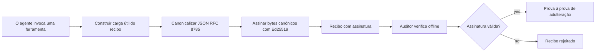
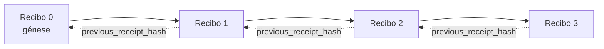

[Veja o vídeo da lição: Garantir Agentes de IA com Recibos Criptográficos](https://youtu.be/PLACEHOLDER_VIDEO_ID)

> _(Vídeo da lição e miniatura a ser adicionados pela equipa de conteúdos da Microsoft após a fusão, correspondendo ao padrão da lição 14 / 15.)_

# Garantir Agentes de IA com Recibos Criptográficos

## Introdução

Esta lição irá abordar:

- Por que os registos de auditoria para agentes de IA são importantes para conformidade, depuração e confiança.
- O que é um recibo criptográfico e como difere de uma linha de registo não assinada.
- Como produzir um recibo assinado para uma chamada de ferramenta do agente em Python simples.
- Como verificar um recibo offline e detectar adulterações.
- Como encadear recibos para que a remoção ou reordenação de um quebre a cadeia.
- O que os recibos provam e o que explicitamente não provam.

## Objetivos de Aprendizagem

Após completar esta lição, saberá como:

- Identificar os modos de falha que motivam a proveniência criptográfica para ações do agente.
- Produzir um recibo assinado Ed25519 sobre uma carga útil JSON canónica.
- Verificar um recibo independentemente, usando apenas a chave pública do signatário.
- Detectar adulterações reexecutando a verificação sobre um recibo modificado.
- Construir uma sequência encadeada por hash de recibos e explicar porque a cadeia é importante.
- Reconhecer o limite entre o que os recibos provam (atribuição, integridade, ordenação) e o que não provam (correcção da ação, validade da política).

## O Problema: O Registo de Auditoria do Seu Agente

Imagine que implementou um agente de IA para a Contoso Travel. O agente lê pedidos dos clientes, chama uma API de voos para procurar opções e reserva lugares em nome do cliente. No último trimestre, o agente processou 50.000 reservas.

Hoje chega um auditor. Ele faz uma pergunta simples: "Mostre-me o que o seu agente fez."

Entrega os seus ficheiros de registo. O auditor olha para eles e faz a pergunta mais difícil: "Como sei que estes registos não foram editados?"

Este é o problema do registo de auditoria. A maioria das implementações de agentes actualmente baseia-se em:

- **Registos da aplicação**: escritos pelo próprio agente, editáveis por qualquer pessoa com acesso ao sistema de ficheiros.
- **Serviços de registo na cloud**: evidência de adulteração a nível da plataforma mas apenas se o auditor confiar no operador da plataforma.
- **Registos de transacções de base de dados**: adequados para alterações na base de dados mas não para chamadas arbitrárias de ferramentas.

Nenhum destes pode responder à pergunta do auditor sem que este tenha de confiar em alguém (você, o seu fornecedor de cloud, o fornecedor da base de dados). Para uso interno, essa confiança é muitas vezes aceitável. Para cargas de trabalho reguladas (finanças, saúde, qualquer coisa sujeita ao Regulamento Europeu sobre IA), não é.

Os recibos criptográficos resolvem isto tornando cada acção do agente independentemente verificável. O auditor não precisa de confiar em si. Só precisa da sua chave pública e do recibo em si.

## O que é um Recibo Criptográfico?

Um recibo é um objecto JSON que regista o que um agente fez, assinado com uma assinatura digital.


```mermaid
flowchart LR
    A[O agente invoca uma ferramenta] --> B[Construir carga útil do recibo]
    B --> C[Canonicalizar JSON RFC 8785]
    C --> E[Assinar bytes canónicos com Ed25519]
    E --> F[Recibo com assinatura]
    F --> G[Auditor verifica offline]
    G --> H{Assinatura válida?}
    H -- yes --> I[Prova à prova de adulteração]
    H -- no --> J[Recibo rejeitado]
```

Um recibo mínimo tem esta aparência:

```json
{
  "type": "agent.tool_call.v1",
  "agent_id": "contoso-travel-bot",
  "tool_name": "lookup_flights",
  "tool_args_hash": "sha256:a3f9c1...",
  "result_hash": "sha256:7b2e1d...",
  "policy_id": "contoso-travel-policy-v3",
  "timestamp": "2026-04-25T14:30:00Z",
  "sequence": 47,
  "previous_receipt_hash": "sha256:9d4e6a...",
  "signature": {
    "alg": "EdDSA",
    "sig": "c5af83...",
    "public_key": "8f3b2c..."
  }
}
```

Três propriedades estão a fazer o trabalho:

1. **A assinatura**. O recibo é assinado pelo gateway do agente usando uma chave privada Ed25519. Qualquer pessoa com a chave pública correspondente pode verificar a assinatura offline. Alterar qualquer campo invalida a assinatura.

2. **Codificação canónica**. Antes da assinatura, o recibo é serializado usando o Esquema de Canonicalização JSON (JCS, RFC 8785). Isto garante que duas implementações que produzem o mesmo recibo lógico produzem uma saída byte-idêntica. Sem canonização, diferentes serializadores JSON produziriam assinaturas diferentes para o mesmo conteúdo.

3. **Encadeamento por hash**. O campo `previous_receipt_hash` liga cada recibo ao anterior. Remover ou reordenar um recibo quebra todos os recibos que vieram depois. A adulteração torna-se visível ao nível da cadeia mesmo que assinaturas individuais sejam ultrapassadas.

Juntas, estas propriedades fornecem três garantias:

- **Atribuição**: esta chave assinou este conteúdo.
- **Integridade**: o conteúdo não mudou desde a assinatura.
- **Ordenação**: este recibo veio depois daquele na cadeia.

## Produzir um Recibo em Python

Não precisa de uma biblioteca especial para produzir um recibo. As primitivas criptográficas estão amplamente disponíveis e a lógica são algumas dezenas de linhas de Python.

Os exercícios práticos em `code_samples/18-signed-receipts.ipynb` guiam todo o fluxo. A versão resumo:

```python
import json
import hashlib
import base64
from nacl import signing
from jcs import canonicalize  # JSON canónico RFC 8785

def b64url_nopad(data: bytes) -> str:
    return base64.urlsafe_b64encode(data).decode("ascii").rstrip("=")

def sha256_canonical(obj) -> str:
    """SHA-256 of a Python object's JCS-canonical JSON form."""
    return f"sha256:{hashlib.sha256(canonicalize(obj)).hexdigest()}"

# Gerar ou carregar uma chave de assinatura (em produção, guardar numa cofres de chaves)
signing_key = signing.SigningKey.generate()
verify_key = signing_key.verify_key

# Construir a carga útil do recibo (ainda sem assinatura)
tool_args = {"origin": "SYD", "destination": "LAX"}
tool_result = [{"flight": "QF11", "price": 1850, "stops": 0}]

payload = {
    "type": "agent.tool_call.v1",
    "agent_id": "contoso-travel-bot",
    "tool_name": "lookup_flights",
    "tool_args_hash": sha256_canonical(tool_args),
    "result_hash": sha256_canonical(tool_result),
    "policy_id": "contoso-travel-policy-v3",
    "timestamp": "2026-04-25T14:30:00Z",
    "sequence": 0,
    "previous_receipt_hash": None,
}

# Canonicalizar e assinar os bytes JCS diretamente. PureEdDSA faz hash internamente.
canonical_bytes = canonicalize(payload)
signature_bytes = signing_key.sign(canonical_bytes).signature

# Anexar um objeto de assinatura estruturado.
receipt = {
    **payload,
    "signature": {
        "alg": "EdDSA",
        "sig": b64url_nopad(signature_bytes),
        "public_key": b64url_nopad(bytes(verify_key)),
    },
}
```

Esse é todo o pipeline de assinatura. Os exercícios no notebook guiam cada passo.

## Verificar um Recibo e Detectar Adulterações

A verificação é a operação inversa:

```python
import base64
import hashlib
from nacl import signing
from nacl.exceptions import BadSignatureError
from jcs import canonicalize

def b64url_decode(s: str) -> bytes:
    padding = "=" * ((4 - len(s) % 4) % 4)
    return base64.urlsafe_b64decode(s + padding)

def verify_receipt(receipt: dict) -> bool:
    # A assinatura é um objeto estruturado: {"alg", "sig", "public_key"}.
    sig_obj = receipt.get("signature")
    if not sig_obj or sig_obj.get("alg") != "EdDSA":
        return False

    # Reconstrua a carga útil que foi realmente assinada (tudo excepto a assinatura).
    payload = {k: v for k, v in receipt.items() if k != "signature"}

    canonical_bytes = canonicalize(payload)

    try:
        verify_key = signing.VerifyKey(b64url_decode(sig_obj["public_key"]))
        verify_key.verify(canonical_bytes, b64url_decode(sig_obj["sig"]))
        return True
    except BadSignatureError:
        return False
```

Esta função recebe um recibo e retorna `True` se a assinatura for válida, `False` caso contrário. Sem chamadas de rede, sem dependência de serviço, sem necessidade de confiar em terceiros.

Para ver a detecção de adulterações em ação, o notebook orienta:

1. Produzir um recibo válido e confirmar que verifica.
2. Modificar um byte do campo `tool_args_hash`.
3. Reexecutar a verificação e confirmar a falha.

Esta é a demonstração prática de que os recibos são evidência de adulteração: qualquer alteração, por menor que seja, quebra a assinatura.

## Encadeamento de Recibos para Agentes com Vários Passos

Um único recibo assinado protege uma acção. Uma cadeia de recibos protege uma sequência.


```mermaid
flowchart LR
    R0[Recibo 0<br/>génese] --> R1[Recibo 1]
    R1 --> R2[Recibo 2]
    R2 --> R3[Recibo 3]
    R1 -. previous_receipt_hash .-> R0
    R2 -. previous_receipt_hash .-> R1
    R3 -. previous_receipt_hash .-> R2
```

Cada recibo regista o hash do recibo anterior. Para remover silenciosamente o recibo 2, um atacante precisaria:

- Modificar o campo `previous_receipt_hash` do recibo 3 (quebra a assinatura do recibo 3), OU
- Forjar uma nova assinatura num recibo 3 modificado (requer a chave privada do agente).

Se a chave privada estiver num cofre de chaves hardware e você publicar a chave pública com cada recibo, nenhum destes ataques é viável sem deteção.

O notebook orienta:

1. Construir uma cadeia de três recibos.
2. Verificar que o `previous_receipt_hash` de cada recibo corresponde ao hash real do recibo anterior.
3. Adulterar um recibo no meio e ver a cadeia partir-se exactamente nesse ponto.

É assim que se produz um registo de auditoria que um auditor externo pode verificar sem confiar em si.

## O Que os Recibos Provam (e o Que Não Provam)

Esta é a secção mais importante desta lição. Os recibos são poderosos, mas o seu poder é limitado.

**Os recibos provam três coisas:**

1. **Atribuição**: uma chave específica assinou uma carga útil específica.
2. **Integridade**: a carga útil não mudou desde a assinatura.
3. **Ordenação**: este recibo veio depois daquele na cadeia de hashes.

**Os recibos NÃO provam:**

1. **Correcção**: que a acção do agente foi a correcta. Um recibo pode ser assinado para uma resposta errada tão facilmente quanto para uma resposta certa.
2. **Conformidade com a política**: que a política referida em `policy_id` foi realmente avaliada, ou que teria permitido esta acção se verificada. O recibo regista o que foi afirmado, não o que foi aplicado.
3. **Identidade além da chave**: o recibo diz "esta chave assinou este conteúdo." Não diz "este humano autorizou isto." Ligar uma chave a uma pessoa ou organização requer uma infra-estrutura de identidade separada (um directório, um registo de chave pública, etc.).
4. **Verdade dos inputs**: se o agente receber um prompt manipulado e agir com base nele, o recibo regista a acção fielmente. Os recibos são posteriores à validação do input, não um substituto da mesma.

Este limite é importante por duas razões:

- Diz-lhe para que os recibos são úteis: tornar o comportamento do agente auditável e evidência de adulteração, mesmo através de limites organizacionais.
- Diz-lhe que camadas adicionais são ainda necessárias: validação de entradas (Lição 6), aplicação de políticas (abordado brevemente abaixo), e infra-estrutura de identidade (fora do âmbito desta lição).

Um erro comum é assumir que "temos recibos" significa "estamos governados." Não significa. Os recibos são uma base. A governação é o sistema que constrói por cima.

## Provar que um Humano Aprovou a Acção Exacta

O ponto 3 acima merece a sua própria secção: um recibo de acção diz "esta chave assinou este conteúdo," nunca "um humano autorizou isto." Para acções de alto risco (reembolsos, eliminações, transferências bancárias), quadros de governação exigem cada vez mais exactamente essa declaração em falta, e pode ser produzida com as mesmas primitivas que já construiu nesta lição.

O notebook complementar `code_samples/human-authorization-receipts.ipynb` adiciona um segundo tipo de recibo, `human.approval.v1`, com a mesma forma de envelope dos recibos da lição (uma carga útil tipada assinada por Ed25519 sobre seus bytes canónicos JCS, com o objeto `signature` fora dos bytes assinados). Um aprovador nomeado assina a **acção canónica completa e o seu sumário** antes da execução; o recibo da acção do agente carrega o **mesmo sumário da acção** e um `parent_approval_ref`, o `receipt_hash` da aprovação, a mesma convenção que `previous_receipt_hash` na cadeia que construiu acima. Um `verify_chain` percorre ambos os artefactos sob **registos de chaves fixas separados** (chaves dos aprovadores vs chaves dos agentes), portanto o caminho do código é partilhado mas as autoridades nunca o são.

A propriedade que isto garante, afirmada cuidadosamente: *o humano aprovou exactamente esta acção, e o agente executou exactamente essa acção aprovada.* Os testes de recusa no notebook são o que tornam a propriedade real e não só afirmada:

- o conjunto clássico: adulteração, delegado confuso, replay, chaves forjadas de ambos os lados, input malformado;
- **autoridade obsoleta**: uma assinatura que ainda verifica, recusada de qualquer modo porque a versão da política mudou, a chave do aprovador foi removida do registo fixo, ou a aprovação expirou antes da execução;
- **substituição do sumário**: um recibo de acção válido apontando para uma *aprovação real* que liga uma *acção canónica diferente*.

Cada falha recusa com uma razão distinta, por isso um auditor a ler uma recusa pode saber se a autoridade ficou obsoleta ou se a ação executada mudou. A regra que o notebook ensina: uma aprovação assinada não é autoridade por si só. A autoridade existe apenas se ambos os recibos ainda ligarem à mesma acção canónica no momento da execução. O recibo de aprovação humana é uma composição educativa definida por esta lição, não um tipo de recibo definido por `draft-farley-acta-signed-receipts`.

## Referências de Produção

O código Python nesta lição é intencionalmente minimalista para que possa ler cada linha e entender exactamente o que está a acontecer. Em produção, tem duas opções:

1. **Construir directamente sobre as primitivas criptográficas.** As 50 linhas que viu acima são suficientes para muitos casos de uso. PyNaCl (Ed25519) e o pacote `jcs` (JSON canónico) são bibliotecas bem mantidas e auditadas.

2. **Usar uma biblioteca de recibos para produção.** Vários projectos open-source implementam o mesmo padrão com funcionalidades adicionais (rotação de chaves, verificação em lote, distribuição de JWK Set, integração com motores de política):
   - O pipeline de assinatura usa as convenções JCS e de âmbito da assinatura num IETF Internet-Draft independente ([`draft-farley-acta-signed-receipts`](https://datatracker.ietf.org/doc/draft-farley-acta-signed-receipts/), revisão 02). O recibo educativo plano desta lição difere do envelope `{payload, signature}` do draft e não é apresentado como uma implementação conforme. O draft publica um conjunto de conformidade partilhado ([agent-governance-testvectors](https://github.com/ScopeBlind/agent-governance-testvectors)) para implementações que miram o seu formato em rede.
   - O Kit de Ferramentas Microsoft Agent Governance compõe recibos com decisões políticas baseadas no Cedar; veja o Tutorial 33 nesse repositório para um exemplo end-to-end.
   - Os pacotes `protect-mcp` (npm) e `@veritasacta/verify` (npm) fornecem uma implementação Node da assinatura e verificação offline de recibos, destinada a envolver qualquer servidor MCP com um registo de auditoria evidência de adulteração, incluindo um fluxo mantido para co-assinatura onde uma acção suspensa emite um recibo de aprovação ligado ao sumário da acção (WebAuthn suportado no fluxo desktop), o mesmo padrão de recibo de aprovação do notebook de autorização humana acima.
   - O SDK Python **[nobulex](https://github.com/arian-gogani/nobulex)** (`pip install nobulex`) oferece o mesmo padrão de assinatura Ed25519 + JCS em Python com integrações LangChain e CrewAI, incluindo vetores de teste de validação cruzada publicados e um mapeamento de conformidade contribuído via [OWASP PR #2210](https://github.com/OWASP/CheatSheetSeries/pull/2210).

A decisão entre construir o seu próprio e usar uma biblioteca espelha a decisão entre escrever a sua própria biblioteca JWT e usar uma testada: ambas são razoáveis; a biblioteca poupa tempo e reduz a superfície de auditoria; a abordagem do zero obriga-o a entender cada primitiva. Esta lição ensina o caminho do zero para que tenha a base para qualquer escolha.

## Verificação do Conhecimento

Teste a sua compreensão antes de passar para o exercício prático.

**1. Um recibo é assinado com a chave privada Ed25519 do agente. O auditor tem apenas a chave pública. Pode o auditor verificar o recibo offline?**

<details>
<summary>Resposta</summary>

Sim. A verificação Ed25519 requer apenas a chave pública e os bytes assinados. Sem chamadas de rede, sem dependência de serviço. Esta é a propriedade que torna os recibos úteis em ambientes isolados, multi-organizações ou de baixa confiança para auditoria.
</details>

**2. Um atacante modifica o campo `policy_id` de um recibo para alegar que foi regido por uma política mais permissiva. A assinatura foi sobre a carga útil original. O que acontece na verificação?**

<details>
<summary>Resposta</summary>


A verificação falha. A assinatura foi calculada sobre os bytes canónicos da carga útil original; modificar qualquer campo altera esses bytes, o que torna a assinatura inválida. O atacante precisaria da chave privada para produzir uma nova assinatura válida, que não possui.
</details>

**3. Porque é que o recibo inclui um `tool_args_hash` e `result_hash` em vez dos argumentos e resultado em bruto?**

<details>
<summary>Resposta</summary>

Duas razões. Primeiro, o recibo pode precisar ser arquivado ou transmitido em ambientes onde a divulgação do conteúdo em bruto (PII, dados empresariais) é um problema. O hashing mantém o recibo pequeno e o conteúdo privado; o auditor verifica que o hash coincide com uma cópia armazenada separadamente do conteúdo real. Segundo, os hashes têm um tamanho fixo; um recibo com hashes tem tamanho limitado independentemente do tamanho das entradas e saídas.
</details>

**4. O campo `previous_receipt_hash` liga cada recibo ao seu predecessor. Se um atacante eliminar silenciosamente um recibo do meio de uma cadeia, o que fica inválido?**

<details>
<summary>Resposta</summary>

Todos os recibos que vieram depois do eliminado. Os seus campos `previous_receipt_hash` deixam de coincidir com a cadeia real (porque o recibo a que referenciavam já não existe, ou a cadeia agora aponta para um predecessor diferente). Para ocultar a eliminação, o atacante teria de reinscrever todos os recibos posteriores, o que requer a chave privada.
</details>

**5. Um recibo verifica corretamente. Isso prova que a ação do agente foi correta, razoável ou conforme à política?**

<details>
<summary>Resposta</summary>

Não. Um recibo válido prova três coisas: atribuição (esta chave assinou este conteúdo), integridade (o conteúdo não mudou) e ordenação (este recibo veio depois daquele recibo). Não prova que a ação foi correta, que a política indicada em `policy_id` foi realmente avaliada, ou que o agente seguiu todas as regras. Os recibos permitem auditar o comportamento do agente, não necessariamente que este seja correto. Esta é a fronteira mais importante desta lição.
</details>

## Exercício Prático

Abra `code_samples/18-signed-receipts.ipynb` e complete as quatro secções:

1. **Secção 1**: Assine o seu primeiro recibo e verifique-o.
2. **Secção 2**: Manipule o recibo e observe a falha na verificação.
3. **Secção 3**: Construa uma cadeia de três recibos e verifique a integridade da cadeia.
4. **Secção 4**: Aplique o padrão a um agente construído com o Microsoft Agent Framework: envolva uma chamada de ferramenta na assinatura do recibo e depois verifique o recibo de forma independente.

**Desafio extra 1:** extenda o esquema do recibo com um campo adicional à sua escolha (por exemplo, um ID de pedido para rastreamento), atualize a lógica canónica da assinatura para o incluir, e confirme que o recibo ainda passa pela verificação sem problemas. Depois modifique o campo após a assinatura e confirme que a verificação falha. Isto força a compreensão de como cada byte da codificação canónica contribui para a assinatura.

**Desafio extra 2:** Faça o hash SHA-256 de dois dos seus recibos juntos (concatene os seus bytes canónicos numa ordem determinística) e incorpore o resumo resultante como um novo campo num terceiro recibo antes de o assinar. Verifique que os três recibos ainda passam pela verificação. Acabou de construir uma prova de inclusão de um passo: qualquer pessoa que tenha o terceiro recibo pode provar que os dois primeiros existiam na altura da assinatura, sem precisar revelar os seus conteúdos. Este é o padrão usado pelos recibos de divulgação seletiva em larga escala (compromissos Merkle, RFC 6962).

## Conclusão

Recibos criptográficos dão aos agentes de IA um rasto de auditoria que é:

- **Verificável de forma independente**: qualquer parte com a chave pública pode verificar, sem dependência de serviços.
- **À prova de manipulações**: qualquer modificação invalida a assinatura.
- **Portátil**: um recibo é um pequeno ficheiro JSON; pode ser arquivado, transmitido e verificado em qualquer lugar.
- **Alinhado com padrões**: baseado em Ed25519 (RFC 8032), JCS (RFC 8785) e SHA-256, todos primitivos amplamente usados.

Não são um substituto para validação de entrada, aplicação de políticas ou infraestruturas de identidade. São uma base para essas camadas. Quando estiver a implantar agentes em cargas reguladas, fluxos de trabalho entre organizações ou qualquer contexto onde um auditor futuro não possa presumir confiança, os recibos são como garantir que o rasto de auditoria é honesto.

O mais importante a reter: os recibos provam quem disse o quê e quando. Não provam que o que foi dito era verdade ou correto. Mantenha essa distinção clara. É a diferença entre um sistema de proveniência honesto e um enganador.

## Lista de Verificação para Produção

Quando estiver pronto para avançar desta lição para a implantação de agentes assinando recibos num ambiente real:

- [ ] **Mova a chave de assinatura para fora do portátil do desenvolvedor.** Use Azure Key Vault, AWS KMS ou um módulo de segurança hardware. A chave privada que assina os seus recibos nunca deve estar em controlo de código fonte ou em texto claro nas máquinas de aplicação.
- [ ] **Publique a chave pública de verificação.** Os auditores precisam dela para verificar offline. O padrão é um JWK Set numa URL conhecida (RFC 7517), por exemplo, `https://your-org.example.com/.well-known/agent-keys.json`.
- [ ] **Ancore a cadeia externamente.** Periodicamente, grave o hash da cabeça mais recente da cadeia num registo de transparência (Sigstore Rekor, autoridade de carimbo temporal RFC 3161, ou um segundo sistema interno) para que uma parte externa possa confirmar "esta cadeia existia nesta data."
- [ ] **Armazene os recibos de forma imutável.** O armazenamento append-only (Azure Storage com políticas de imutabilidade, AWS S3 Object Lock) impede um insider de reescrever o historial ao nível de armazenamento.
- [ ] **Decida sobre a retenção.** Muitos regimes de conformidade requerem retenção por vários anos. Planeie o crescimento dos recibos (cada recibo tem ~500 bytes; um agente com 10K chamadas por dia gera ~1.8 GB por ano).
- [ ] **Documente o que os recibos não cobrem.** Os recibos provam atribuição, integridade e ordenação. O seu plano operacional deve listar explicitamente que controlos adicionais (validação de entrada, aplicação de políticas, limitação de taxa, infraestrutura de identidade) acompanham os recibos na sua postura de governação.

### Tem Mais Perguntas sobre Segurança de Agentes de IA?

Junte-se ao [Microsoft Foundry Discord](https://aka.ms/ai-agents/discord) para encontrar outros aprendizes, participar em sessões de horário marcado e esclarecer as suas dúvidas sobre Agentes de IA.

## Além desta Lição

Esta lição cobre assinatura de um único recibo e sequências encadeadas por hash. Os mesmos primitivos compõem vários padrões mais avançados que poderá encontrar à medida que sua postura de governação amadurece:

- **Divulgação seletiva.** Quando os campos de um recibo são comprometidos independentemente (árvore Merkle estilo RFC 6962), pode revelar campos específicos a auditores específicos e provar que o resto não foi alterado, sem os expor. Útil quando o mesmo recibo tem de satisfazer uma auditoria abrangente (que quer completude) e regulamentos de minimização de dados como o RGPD (que querem que o auditor veja o mínimo necessário).
- **Revogação de recibos.** Se uma chave de assinatura ficar comprometida, precisa de uma forma de marcar todos os recibos assinados por essa chave como não confiáveis a partir de um ponto no tempo. Padrões comuns: chaves de assinatura de vida curta e uma lista de revogação publicada, ou um registo de transparência com entradas de revogação.
- **Recibos bilaterais / de assinatura dividida.** Algumas implementações dividem a carga assinada em metades pré-execução (`authorization_*`) e pós-execução (`result_*`) com assinaturas independentes, útil quando a decisão de autorização e o resultado observado são produzidos por atores diferentes ou em tempos distintos. Isto compõe-se sobre o formato de recibo ensinado nesta lição.
- **Composição da carga útil.** Um recibo sela quaisquer bytes que colocar em `result_hash`. Cargas úteis do mundo real são frequentemente mais ricas do que um único resultado de chamada de ferramenta: raciocínio pré-decisão (predição de modelo, opções consideradas, evidências e a sua completude, postura de risco, cadeia de responsabilidade, resultado de gate) pode residir todo dentro da carga, selado por um único recibo. Isso mantém o formato do recibo mínimo enquanto permite que esquemas de carga evoluam domínio a domínio.
- **Conformidade entre implementações.** Múltiplas implementações independentes do mesmo formato de recibo (Python, TypeScript, Rust, Go) verificam cruzadamente contra vetores de teste partilhados. Se construir a sua própria implementação, validar contra vetores publicados confirma a compatibilidade de comunicação.
- **Migração pós-quântica.** Ed25519 está amplamente implementado hoje, mas não é resistente a computadores quânticos. O formato do recibo é ágil quanto ao algoritmo: o campo `signature.alg` pode conter `ML-DSA-65` (o padrão NIST de assinatura pós-quântica) quando precisar migrar. Planeie um período de transição onde os recibos sejam assinados duplamente.

## Recursos Adicionais

- <a href="https://datatracker.ietf.org/doc/draft-farley-acta-signed-receipts/" target="_blank">IETF Internet-Draft: Recibos de Decisão Assinados para Controlo de Acesso Máquina a Máquina</a>
- <a href="https://learn.microsoft.com/azure/ai-studio/responsible-use-of-ai-overview" target="_blank">Visão geral de IA responsável (Azure AI)</a>
- <a href="https://datatracker.ietf.org/doc/html/rfc8032" target="_blank">RFC 8032: Algoritmo de Assinatura Digital Curva Edwards (EdDSA)</a>
- <a href="https://datatracker.ietf.org/doc/html/rfc8785" target="_blank">RFC 8785: Esquema de Canonicalização JSON (JCS)</a>
- <a href="https://datatracker.ietf.org/doc/html/rfc6962" target="_blank">RFC 6962: Transparência de Certificados</a> (construção de árvore Merkle usada por recibos de divulgação seletiva)
- <a href="https://github.com/microsoft/agent-governance-toolkit/blob/main/docs/tutorials/33-offline-verifiable-receipts.md" target="_blank">Microsoft Agent Governance Toolkit, Tutorial 33: Recibos de Decisão Verificáveis Offline</a>
- <a href="https://github.com/ScopeBlind/agent-governance-testvectors" target="_blank">Vetores de teste de conformidade entre implementações</a> para o formato de recibo usado nesta lição (Apache-2.0)
- <a href="https://pynacl.readthedocs.io/" target="_blank">Documentação PyNaCl</a> (Ed25519 em Python)

## Lição Anterior

[Criação de Agentes de IA Locais](../17-creating-local-ai-agents/README.md)

---

<!-- CO-OP TRANSLATOR DISCLAIMER START -->
**Aviso Legal**:
Este documento foi traduzido utilizando o serviço de tradução automática [Co-op Translator](https://github.com/Azure/co-op-translator). Embora nos esforcemos pela precisão, esteja ciente de que traduções automáticas podem conter erros ou imprecisões. O documento original na sua língua nativa deve ser considerado a fonte autorizada. Para informações críticas, recomenda-se tradução profissional humana. Não nos responsabilizamos por quaisquer mal-entendidos ou interpretações incorretas resultantes da utilização desta tradução.
<!-- CO-OP TRANSLATOR DISCLAIMER END -->